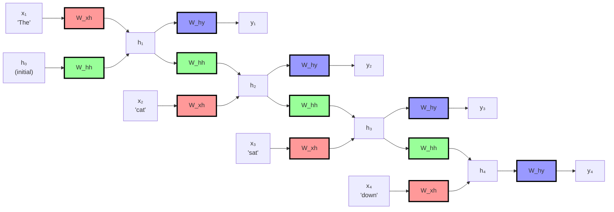
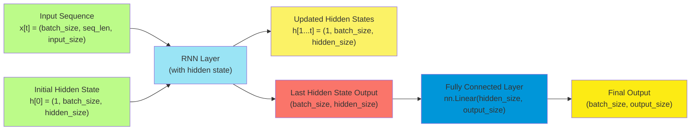
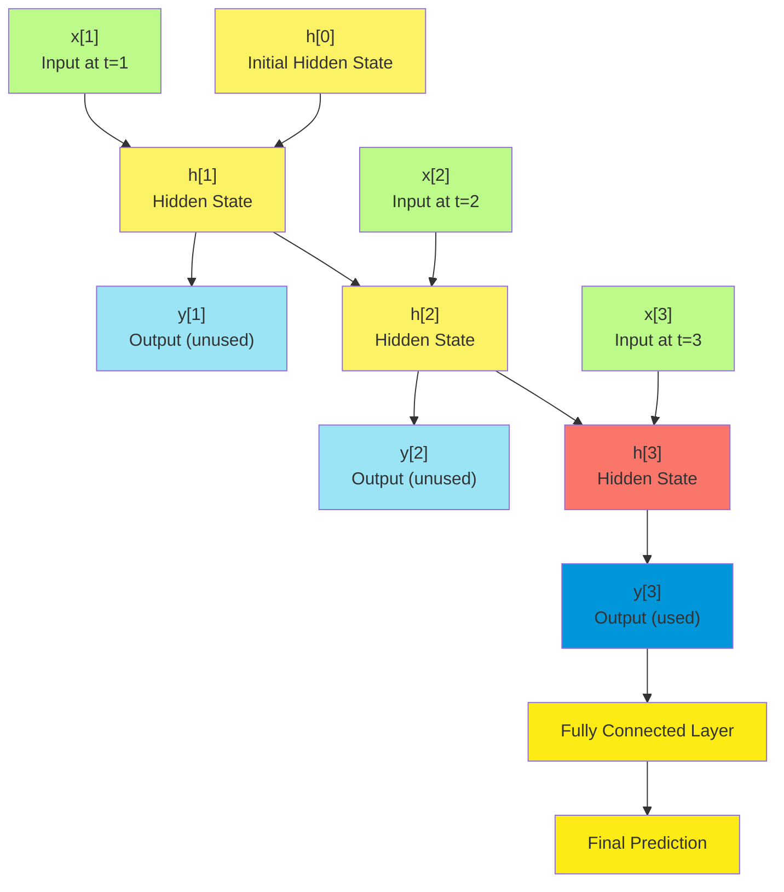

# S-3: Recurrent Neural Networks and Transformers

# C-1: Intro to Recurrent Neural Networks

1. Fundamentals of Recurrent Neural Networks
    - RNN Architecture and Core Concepts
    - Sequential Data Processing Applications
    - Basic RNN Mathematical Formulation
    - Types of RNN Architectures (One-to-One, One-to-Many, Many-to-One, Many-to-Many)
2. The Gradient Problem in RNNs
    - Vanishing Gradient Problem Explained
    - Exploding Gradient Problem and Solutions
    - Mathematical Models (Recurrent Network, Dynamical Systems, Geometric)
    - Gradient Clipping Techniques
3. Advanced RNN Architectures
    - Long Short-Term Memory (LSTM) Networks
    - Gated Recurrent Units (GRU)
    - LSTM vs GRU Comparison
4. Backpropagation Through Time (BPTT)
    - Mathematical Formulation of BPTT
    - Forward and Backward Pass Calculations
    - Truncated BPTT and Implementation Considerations
    - Mini-Batch Training Using Gradient Descent
5. RNNs vs Feed-Forward Neural Networks
    - Architectural Differences and Memory Capabilities
    - Application Domain Comparison
    - Training Process Distinctions
    - Memory and Context Handling
6. Natural Language Processing with RNNs
    - Text Preprocessing Techniques
        - Normalization
        - Tokenization
        - Stop Word Removal
        - Stemming and Lemmatization
    - Word Embedding Methods
        - GloVe (Global Vectors)
        - FastText
        - CharNgram

#### Fundamentals of Recurrent Neural Networks

##### RNN Architecture and Core Concepts

Recurrent Neural Networks (RNNs) represent a fundamental shift in how neural networks process information. Unlike
traditional feedforward networks, RNNs introduce a critical innovation: **memory**.

Think of a regular neural network as someone who meets you for the first time every single day—they process each input
independently with no recollection of previous interactions. In contrast, an RNN is like someone who remembers your past
conversations, allowing each interaction to be informed by what came before.

This memory capability comes from **recurrent connections** in the network architecture. Imagine a loop where
information can travel back into the network, creating a path for information to persist. This simple modification
transforms the network from a static processor into a dynamic system that can work with sequences and maintain context
over time.

The core concept behind RNNs can be understood through this analogy: If a standard neural network is like a single
photograph, an RNN is like a movie—a sequence of frames where each one relates to those that came before it.

In practical terms, RNNs maintain a **hidden state** that acts as the network's memory. This hidden state is updated
with each new input, combining fresh information with the accumulated context from previous steps. This mechanism allows
RNNs to:

1. Process inputs sequentially, one element at a time
2. Maintain a memory of what they've seen before
3. Make decisions informed by both current input and historical context

This architecture creates a profound capability: the ability to learn patterns across time. Whether processing words in
a sentence, notes in a melody, or frames in a video, RNNs can capture how elements relate to each other in
sequence—something fundamentally impossible for traditional neural networks.

For example, consider the sentence: "The clouds are in the \_\_\_." To predict "sky" correctly, a network needs to
remember the earlier words. An RNN maintains this context in its hidden state, allowing it to make predictions based on
the entire sequence history.

The true power of RNNs becomes apparent when we realize that many real-world phenomena are inherently
sequential—language, music, video, sensor readings, stock prices—making RNNs applicable across an extraordinarily wide
range of problems.

##### Sequential Data Processing Applications

The ability of RNNs to process sequential data has opened up solutions to problems that were previously intractable for
neural networks. Let's explore the diverse application domains where RNNs excel:

**Natural Language Processing (NLP)** represents perhaps the most prominent application area for RNNs. Language is
inherently sequential—the meaning of a word depends on the words around it, and the meaning of a sentence depends on the
order of its words. RNNs have revolutionized:

- **Language Modeling**: Predicting the next word in a sequence, enabling applications like predictive text and
  autocomplete
- **Machine Translation**: Translating text from one language to another by understanding sequential dependencies in
  both languages
- **Sentiment Analysis**: Determining the emotional tone of text by tracking how sentiment evolves through a document
- **Text Generation**: Creating coherent paragraphs of text by learning the patterns and structure of language

Consider how "I'm going to the bank" could refer to a financial institution or a riverside, depending on context. RNNs
excel at disambiguating such meanings by maintaining context through their hidden state.

**Time Series Analysis** forms another critical application area. Any data collected over time—from stock prices to
weather measurements—contains temporal patterns that RNNs can learn:

- **Stock Market Prediction**: Learning patterns in financial time series to forecast future movements
- **Weather Forecasting**: Predicting upcoming weather by learning from historical patterns in temperature, pressure,
  and other variables
- **Energy Load Forecasting**: Anticipating electricity demand based on usage patterns, helping power companies optimize
  resources

For example, an RNN analyzing electricity consumption might learn that usage typically spikes at certain hours or
correlates with temperature, allowing it to predict future demand patterns.

**Speech Processing** leverages RNNs' ability to process acoustic signals as sequences:

- **Speech Recognition**: Converting spoken language to text by identifying patterns in audio waveforms
- **Speaker Identification**: Determining who is speaking by learning characteristic patterns in different voices
- **Voice Synthesis**: Generating natural-sounding speech by learning the sequential patterns of human vocalization

**Bioinformatics** has adopted RNNs for analyzing biological sequences:

- **Protein Structure Prediction**: Forecasting how proteins fold by analyzing amino acid sequences
- **DNA Sequence Analysis**: Identifying genes or predicting gene expression from nucleotide sequences
- **Drug Discovery**: Generating potential drug molecules by learning patterns in effective compounds

**Anomaly Detection** in sequential data benefits from RNNs' ability to learn normal patterns and identify deviations:

- **Fraud Detection**: Identifying unusual transaction patterns that might indicate fraud
- **Network Security**: Detecting abnormal traffic patterns that could signal cyber attacks
- **Industrial Equipment Monitoring**: Identifying unusual sensor readings that might indicate impending failure

The versatility of RNNs stems from a key insight: many real-world phenomena involve sequential dependencies where the
past influences the present. By design, RNNs capture this fundamental aspect of reality, making them applicable across
seemingly disparate domains.

What unifies all these applications is that they involve data where order matters and context needs to be
maintained—precisely the strengths that RNNs bring to the table.

##### Basic RNN Mathematical Formulation

To truly understand RNNs, we need to look under the hood at their mathematical formulation. While the equations might
seem intimidating at first, they express a surprisingly intuitive idea: combining new information with remembered
context.

Let's start with the basic recurrent unit. At each time step $t$, an RNN processes an input $x_t$ and updates its hidden
state $h_t$ using the following equation:

$$
h_t = \tanh(W_{hh}h_{t-1} + W_{xh}x_t + b_h)
$$

This equation might look complex, but we can break it down into intuitive components:

1. $h_{t-1}$ represents the **previous hidden state**—the network's memory of everything it has seen up to this point.
2. $W_{hh}$ is the **recurrent weight matrix** that determines how much of the previous state should influence the
   current state.
3. $x_t$ is the **current input** at time step $t$.
4. $W_{xh}$ is the **input weight matrix** that determines how much the current input should influence the state.
5. $b_h$ is a **bias term** that allows the network to learn baseline activations.
6. The $\tanh$ function squashes the result between -1 and 1, keeping the hidden state values controlled.

###### Understanding the Core RNN Equation

The equation only directly uses the current input $x_t$ and the immediately previous hidden state $h_{t-1}$. However,
this doesn't mean the RNN can't capture longer-range dependencies - it's more subtle than that.

###### How Information from Far Behind Gets Preserved

Even though the equation only explicitly references $h_{t-1}$, that previous hidden state $h_{t-1}$ actually contains
compressed information from ALL previous time steps. Think of it like this:

- $h_1$ contains information from $x_1$
- $h_2$ contains information from $x_2$ AND compressed information from $h_1$ (which had $x_1$)
- $h_3$ contains information from $x_3$ AND compressed information from $h_2$ (which had $x_1$ and $x_2$)
- And so on...

So when we compute $h_t$, the $h_{t-1}$ term carries forward a compressed representation of the entire sequence history
up to that point.

###### The Problem with Distant Relations

Here's where the challenge lies: as information gets passed forward through many time steps, it tends to get diluted or
lost due to the vanishing gradient problem. Each time we apply the transformation with $W_{hh}$ and the tanh activation,
some information is preserved and some is lost.

For a relation that's far behind (say, 50 time steps ago), the information has to survive 50 successive transformations.
In practice, basic RNNs typically can only reliably maintain information for about 8-10 time steps before it vanishes.

###### Why This Led to LSTM and GRU

This limitation is exactly why LSTM and GRU were invented. They create additional pathways for information to flow
across time steps with minimal transformation, allowing distant relationships to be preserved much more effectively.

The beauty of the RNN equation is its simplicity, but this simplicity also creates its main limitation for long-range
dependencies. Think of this equation as a recipe for mixing memory and new information: the network takes its previous
state (memory), combines it with the new input (fresh information), and produces an updated state that incorporates
both.

After updating the hidden state, the RNN can generate an output for the current time step:

$$
y_t = W_{hy}h_t + b_y
$$

Here, $W_{hy}$ is the output weight matrix, and $b_y$ is the output bias term. This equation transforms the hidden state
into the desired output format.

To make this concrete, let's visualize a simple RNN processing a sequence of words. For the word "cat" in a sentence:

1. The network receives the word embedding for "cat" as input $x_t$
2. It combines this with its memory of previous words (hidden state $h_{t-1}$)
3. It produces an updated hidden state $h_t$ that now incorporates information about "cat"
4. From this updated state, it can generate predictions about the next word

###### The Sequential Relationship Between the Two Equations

These two equations work together in a specific order within each time step of the RNN:

1. **First, the core equation runs:** $h_t = \tanh(W_{hh}h_{t-1} + W_{xh}x_t + b_h)$
2. **Then, the output equation runs:** $y_t = W_{hy}h_t + b_y$

###### What the Output Equation Does

The output equation takes the hidden state $h_t$ (which was just computed by the core equation) and transforms it into
the actual output/prediction $y_t$ that we want from the network.

Think of it this way:

- The core equation creates an internal "summary" or "understanding" of everything up to time $t$
- The output equation converts that internal understanding into a concrete prediction

###### Why We Need Both

The hidden state $h_t$ serves two purposes:

1. **Memory storage:** It gets passed to the next time step as $h_{t-1}$ in the core equation
2. **Information source:** It provides the basis for making predictions via the output equation

The dimensions often don't match up directly. For example:

- $h_t$ might be a 256-dimensional vector (the network's internal representation)
- $y_t$ might be a 10,000-dimensional vector (if predicting the next word from a vocabulary of 10,000 words)

###### The Linear Transformation

Notice that the output equation is linear (no activation function) - it's just a matrix multiplication plus bias. This
is because:

- The hidden state $h_t$ already went through nonlinear processing (tanh)
- For many tasks, we want the raw output values before applying task-specific functions like softmax for classification

So the core equation does the "thinking" and the output equation does the "speaking.”

###### Setting Up Our Example RNN

Let me walk through a concrete example with small dimensions for clarity. We'll build an RNN that processes a sequence
of 3 words and predicts the next word at each step.

**Network Configuration:**

- Hidden state size: 3 dimensions
- Input size: 4 dimensions (word embeddings)
- Output size: 5 dimensions (vocabulary of 5 words)

**Weight Matrices:**

$$
W_{hh} = \begin{bmatrix} 0.1 & 0.2 & 0.1 \\ 0.3 & 0.1 & 0.2 \\ 0.2 & 0.1 & 0.3 \end{bmatrix} \quad W_{xh} = \begin{bmatrix} 0.3 & 0.1 & 0.2 & 0.4 \\ 0.2 & 0.4 & 0.1 & 0.3 \\ 0.1 & 0.2 & 0.3 & 0.2 \end{bmatrix} \quad W_{hy} = \begin{bmatrix} 0.5 & 0.3 & 0.2 \\ 0.4 & 0.2 & 0.5 \\ 0.3 & 0.4 & 0.1 \\ 0.2 & 0.1 & 0.3 \\ 0.1 & 0.3 & 0.4 \end{bmatrix}
$$

$$
b_h = \begin{bmatrix} 0.1 \\ 0.1 \\ 0.1 \end{bmatrix} \quad b_y = \begin{bmatrix} 0.1 \\ 0.1 \\ 0.1 \\ 0.1 \\ 0.1 \end{bmatrix}
$$

###### Breaking Down Each Weight Matrix and Bias Vector

Let me explain what each matrix and vector represents in the RNN architecture:

###### $W_{hh}$ (Recurrent Weight Matrix)

$$
W_{hh} = \begin{bmatrix} 0.1 & 0.2 & 0.1 \\ 0.3 & 0.1 & 0.2 \\ 0.2 & 0.1 & 0.3 \end{bmatrix}
$$

**What it does:** This matrix transforms the previous hidden state h\_{t-1} into a contribution for the current hidden
state h_t.

**Dimensions:** 3×3 because we have a 3-dimensional hidden state, and we need to transform from 3 dimensions (previous
state) to 3 dimensions (current state contribution).

**Role:** Controls how much information from each dimension of the previous hidden state influences each dimension of
the new hidden state. This is where the "memory" flows through time.

###### $W_{xh}$ (Input-to-Hidden Weight Matrix)

$$
W_{xh} = \begin{bmatrix} 0.3 & 0.1 & 0.2 & 0.4 \\ 0.2 & 0.4 & 0.1 & 0.3 \\ 0.1 & 0.2 & 0.3 & 0.2 \end{bmatrix}
$$

**What it does:** This matrix transforms the current input x_t into a contribution for the current hidden state h_t.

**Dimensions:** 3×4 because we have 4-dimensional input vectors (word embeddings) and need to transform them into
3-dimensional contributions to the hidden state.

**Role:** Controls how much each element of the input influences each dimension of the hidden state. This is how new
information enters the network.

###### $W_{hy}$ (Hidden-to-Output Weight Matrix)

$$
W_{hy} = \begin{bmatrix} 0.5 & 0.3 & 0.2 \\ 0.4 & 0.2 & 0.5 \\ 0.3 & 0.4 & 0.1 \\ 0.2 & 0.1 & 0.3 \\ 0.1 & 0.3 & 0.4 \end{bmatrix}
$$

**What it does:** This matrix transforms the current hidden state $h_t$ into the output $y_t$.

**Dimensions:** 5×3 because we have a 3-dimensional hidden state and want to produce a 5-dimensional output
(representing probabilities for 5 possible next words).

**Role:** Controls how the network's internal understanding (hidden state) gets converted into actual predictions.

**Dimensions:** 5×3 because we have a 3-dimensional hidden state and want to produce a 5-dimensional output
(representing probabilities for 5 possible next words).

**Role:** Controls how the network's internal understanding (hidden state) gets converted into actual predictions.

###### $b_h$ (Hidden State Bias)

$$
b_h = \begin{bmatrix} 0.1 \\ 0.1 \\ 0.1 \end{bmatrix}
$$

**What it does:** Added to the hidden state computation to provide baseline activations.

**Dimensions:** 3×1 to match the hidden state dimensionality.

###### $b_y$ (Output Bias)

$$
b_y = \begin{bmatrix} 0.1 \\ 0.1 \\ 0.1 \\ 0.1 \\ 0.1 \end{bmatrix}
$$

**What it does:** Added to the output computation to provide baseline predictions.

**Dimensions:** 5×1 to match the output dimensionality.

###### How They Work Together

In the equations:

- **$h_t = tanh(W_hh × h_{t-1} + W_xh × x_t + b_h)$:** $W_hh$ brings forward memory, $W_xh$ incorporates new input,
  $b_h$ provides baseline
- **$y_t = W_hy × h_t + b_y$:** $W_hy$ converts internal state to predictions, $b_y$ provides output baseline

**Input Sequence:** Let's say we're processing: "The cat sat"

- $x_1 = [1, 0, 0, 1] (embedding for "The")
- $x_2 = [0, 1, 1, 0] (embedding for "cat")
- $x_3 = [1, 1, 0, 0] (embedding for "sat")

###### Time Step 1: Processing "The"

**Initial state:** $h_0 = [0, 0, 0]$

**Step 1a - Core Equation:**

$$
h_1 = \tanh(W_{hh} \times h_0 + W_{xh} \times x_1 + b_h) \\ \\

W_{hh} \times h_0 = \begin{bmatrix} 0.1 & 0.2 & 0.1 \\ 0.3 & 0.1 & 0.2 \\ 0.2 & 0.1 & 0.3 \end{bmatrix} \times \begin{bmatrix} 0 \\ 0 \\ 0 \end{bmatrix} = \begin{bmatrix} 0 \\ 0 \\ 0 \end{bmatrix} \\

W_{xh} \times x_1 = \begin{bmatrix} 0.3 & 0.1 & 0.2 & 0.4 \\ 0.2 & 0.4 & 0.1 & 0.3 \\ 0.1 & 0.2 & 0.3 & 0.2 \end{bmatrix} \times \begin{bmatrix} 1 \\ 0 \\ 0 \\ 1 \end{bmatrix} = \begin{bmatrix} 0.3 + 0.4 \\ 0.2 + 0.3 \\ 0.1 + 0.2 \end{bmatrix} = \begin{bmatrix} 0.7 \\ 0.5 \\ 0.3 \end{bmatrix} \\

h_1 = \tanh\left(\begin{bmatrix} 0 \\ 0 \\ 0 \end{bmatrix} + \begin{bmatrix} 0.7 \\ 0.5 \\ 0.3 \end{bmatrix} + \begin{bmatrix} 0.1 \\ 0.1 \\ 0.1 \end{bmatrix}\right) = \tanh\left(\begin{bmatrix} 0.8 \\ 0.6 \\ 0.4 \end{bmatrix}\right) = \begin{bmatrix} 0.66 \\ 0.54 \\ 0.38 \end{bmatrix} \\
$$

**Step 1b - Output Equation:**

$$
y_1 = W_{hy} h_1 + b_y
$$

$$
y_1 = \begin{bmatrix}
0.5 & 0.3 & 0.2 \\
0.4 & 0.2 & 0.5 \\
0.3 & 0.4 & 0.1 \\
0.2 & 0.1 & 0.3 \\
0.1 & 0.3 & 0.4
\end{bmatrix} \begin{bmatrix}
0.66 \\
0.54 \\
0.38
\end{bmatrix} + \begin{bmatrix}
0.1 \\
0.1 \\
0.1 \\
0.1 \\
0.1
\end{bmatrix} = \begin{bmatrix}
0.5 \times 0.66 + 0.3 \times 0.54 + 0.2 \times 0.38 \\
0.4 \times 0.66 + 0.2 \times 0.54 + 0.5 \times 0.38 \\
0.3 \times 0.66 + 0.4 \times 0.54 + 0.1 \times 0.38 \\
0.2 \times 0.66 + 0.1 \times 0.54 + 0.3 \times 0.38 \\
0.1 \times 0.66 + 0.3 \times 0.54 + 0.4 \times 0.38
\end{bmatrix} + \begin{bmatrix}
0.1 \\
0.1 \\
0.1 \\
0.1 \\
0.1
\end{bmatrix} = \begin{bmatrix}
0.57 \\
0.57 \\
0.52 \\
0.36 \\
0.37
\end{bmatrix}
$$

###### Time Step 2: Processing "cat"

**Step 2a - Core Equation (using h₁ from previous step):**

$$
h_2 = \tanh(W_{hh} \times h_1 + W_{xh} \times x_2 + b_h) \\
$$

$$
W_{hh} \times h_1 = \begin{bmatrix}
0.1 & 0.2 & 0.1 \\
0.3 & 0.1 & 0.2 \\
0.2 & 0.1 & 0.3
\end{bmatrix} \begin{bmatrix}
0.66 \\
0.54 \\
0.38
\end{bmatrix} = \begin{bmatrix}
0.1 \times 0.66 + 0.2 \times 0.54 + 0.1 \times 0.38 \\
0.3 \times 0.66 + 0.1 \times 0.54 + 0.2 \times 0.38 \\
0.2 \times 0.66 + 0.1 \times 0.54 + 0.3 \times 0.38
\end{bmatrix} = \begin{bmatrix}
0.21 \\
0.33 \\
0.30
\end{bmatrix}
$$

$$
W_{xh} \times x_2 = \begin{bmatrix}
0.3 & 0.1 & 0.2 & 0.4 \\
0.2 & 0.4 & 0.1 & 0.3 \\
0.1 & 0.2 & 0.3 & 0.2
\end{bmatrix} \begin{bmatrix}
0 \\
1 \\
1 \\
0
\end{bmatrix} = \begin{bmatrix}
0.1 + 0.2 \\
0.4 + 0.1 \\
0.2 + 0.3
\end{bmatrix} = \begin{bmatrix}
0.3 \\
0.5 \\
0.5
\end{bmatrix}
$$

$$
h_2 = \tanh\left(\begin{bmatrix}
0.21 \\
0.33 \\
0.30
\end{bmatrix} + \begin{bmatrix}
0.3 \\
0.5 \\
0.5
\end{bmatrix} + \begin{bmatrix}
0.1 \\
0.1 \\
0.1
\end{bmatrix}\right) = \tanh\left(\begin{bmatrix}
0.61 \\
0.93 \\
0.90
\end{bmatrix}\right) = \begin{bmatrix}
0.54 \\
0.73 \\
0.71
\end{bmatrix}
$$

**Step 2b - Output Equation:**

$$
y_2 = W_{hy} \times h_2 + b_y = \begin{bmatrix}
0.5 & 0.3 & 0.2 \\
0.4 & 0.2 & 0.5 \\
0.3 & 0.4 & 0.1 \\
0.2 & 0.1 & 0.3 \\
0.1 & 0.3 & 0.4
\end{bmatrix} \begin{bmatrix}
0.54 \\
0.73 \\
0.71
\end{bmatrix} + \begin{bmatrix}
0.1 \\
0.1 \\
0.1 \\
0.1 \\
0.1
\end{bmatrix} = \begin{bmatrix}
0.69 \\
0.78 \\
0.72 \\
0.44 \\
0.62
\end{bmatrix}
$$

###### Time Step 3: Processing "sat"

Following the same pattern, we'd compute h₃ using h₂, then y₃ using h₃.

###### How This Demonstrates the Key Concepts

**Memory Accumulation:** Notice how h₂ depends on h₁ (which contained information about "The"), so h₂ now contains
information about both "The" and "cat". This is how the RNN maintains context.

**Prediction at Each Step:** Each y_t represents the network's prediction for the next word:

- y₁ might predict what comes after "The"
- y₂ might predict what comes after "The cat"
- y₃ might predict what comes after "The cat sat"

**Information Flow:** The core equation updates the network's "understanding" (hidden state), while the output equation
converts that understanding into actual predictions. The hidden state serves as both memory for the next time step AND
the basis for current predictions.

###### Converting Raw Numbers to Actual Word Predictions

You're absolutely right! The raw numbers from y_t don't directly tell us which word is predicted. We need additional
steps to convert these numbers into actual word predictions.

###### Step 1: Understanding What the Numbers Represent

Let's say our vocabulary is: ["dog", "cat", "sat", "on", "mat"]

The raw output from our example:

$$
y_1 = \begin{bmatrix} 0.57 \\ 0.57 \\ 0.52 \\ 0.36 \\ 0.37 \end{bmatrix}
$$

Each number corresponds to a "score" or "logit" for each word in our vocabulary:

- 0.57 → "dog"
- 0.57 → "cat"
- 0.52 → "sat"
- 0.36 → "on"
- 0.37 → "mat"

###### Step 2: Apply Softmax to Get Probabilities

We apply the softmax function to convert these raw scores into probabilities that sum to 1:

$$
\sigma(x_i) = \frac{\large e^{x_i}}{\sum({\large e^{x_j}})} \\ \\

\text{For} \quad y_1 = \begin{bmatrix} 0.57 \\ 0.57 \\ 0.52 \\ 0.36 \\ 0.37 \end{bmatrix}: \\ \\
$$

$$
\begin{align}
&e^{0.57} = 1.77, e^{0.57} = 1.77, e^{0.52} = 1.68, e^{0.36} = 1.43, e^{0.37} = 1.45 \\ \\
&\text{Sum} = 1.77 + 1.77 + 1.68 + 1.43 + 1.45 = 8.10 \\
\end{align}
$$

Probabilities:

$$
P(\text{dog}) = \frac{1.77}{8.10} = 0.22 \text{ (22\%)} \\
P(\text{cat}) = \frac{1.77}{8.10} = 0.22 \text{ (22\%)} \\
P(\text{sat}) = \frac{1.68}{8.10} = 0.21 \text{ (21\%)} \\
P(\text{on})  = \frac{1.43}{8.10} = 0.18 \text{ (18\%)} \\
P(\text{mat}) = \frac{1.45}{8.10} = 0.18 \text{ (18\%)}
$$

###### Step 3: Make the Prediction

**Option 1 - Greedy Decoding:** Choose the word with highest probability After "The" → both "dog" and "cat" have highest
probability (22%), so we might pick "dog"

**Option 2 - Sampling:** Randomly sample based on the probability distribution We might randomly pick "cat" even though
"dog" had equal probability

**Option 3 - Beam Search:** Keep track of multiple possible sequences and choose the best overall sequence

###### Complete Example Flow

Input: "The" Raw output: $[0.57, 0.57, 0.52, 0.36, 0.37]$

Softmax: $[0.22, 0.22, 0.21, 0.18, 0.18]$

Prediction: "dog" (highest probability)

Input: "The cat" Raw output: $[0.69, 0.78, 0.72, 0.44, 0.62]$

Softmax: $[0.19, 0.21, 0.20, 0.15, 0.18]$

Prediction: "cat" (highest probability)

###### Why This Makes Sense

The network learns during training that:

- After "The", common next words are nouns like "dog" or "cat"
- After "The cat", common next words might be verbs like "sat"
- The probabilities reflect what the network learned from training data

So those raw numbers are just the network's "confidence scores" before we convert them into actual word probabilities
and make the final prediction

The power of these equations lies in three key properties:

**1. Parameter Sharing:** The same weights ($W_{hh}$, $W_{xh}$, $W_{hy}$) are used at each time step, allowing the
network to learn patterns that can apply anywhere in a sequence.

**2. Variable-length Sequences:** Because the recurrent equation can be applied indefinitely, RNNs can process sequences
of any length using a fixed number of parameters.

**3. Information Integration:** Each hidden state contains a compressed representation of everything the network has
seen so far, allowing it to make decisions based on the entire context.

To visualize how information flows through an RNN over time, think of unrolling the network across time steps:

- At time step 1: $h_1 = \tanh(W_{hh}h_0 + W_{xh}x_1 + b_h)$
- At time step 2: $h_2 = \tanh(W_{hh}h_1 + W_{xh}x_2 + b_h)$
- At time step 3: $h_3 = \tanh(W_{hh}h_2 + W_{xh}x_3 + b_h)$

Each state depends on the previous state, creating a chain of influence that allows information to flow from the
beginning of a sequence all the way to the end.

However, this mathematical formulation also reveals the Achilles' heel of basic RNNs: as the chain grows longer,
information from early steps must pass through many transformations to reach later steps. This can lead to the vanishing
(or exploding) gradient problem, which we'll explore in later sections.

###### Understanding Weight Sharing in RNNs

The concept of weight sharing is one of the most fundamental principles that makes Recurrent Neural Networks (RNNs)
powerful for processing sequential data. Let me explain why RNNs use the same weights across all time steps.

In a traditional feedforward neural network, each layer has its own unique set of weights. If we tried to process a
sequence by having a separate set of weights for each position in the sequence, we'd face several major problems:

1. We wouldn't be able to handle sequences of different lengths
2. We'd need an enormous number of parameters for long sequences
3. Most importantly, the network wouldn't generalize patterns across different positions in the sequence

###### How Weight Sharing Works in RNNs

In an RNN, the same weights are applied repeatedly at each time step:

- The recurrent weight matrix W₍ₕₕ₎ (which connects the previous hidden state to the current one)
- The input weight matrix W₍ₓₕ₎ (which connects the current input to the current hidden state)
- The output weight matrix W₍ₕᵧ₎ (which connects the hidden state to the output)

This means that when processing a sequence of any length, we're using the exact same set of parameters over and over
again.

###### Why This Is Powerful

Think about language as an example. The rule that determines how a verb relates to a subject should work the same way
regardless of where it appears in a sentence. By sharing weights across time steps, RNNs can:

1. **Learn Position-Independent Patterns**: The network learns general rules about sequential data rather than
   position-specific rules.
2. **Handle Variable-Length Sequences**: Since we're applying the same weights repeatedly, we can process sequences of
   any length using a fixed number of parameters.
3. **Achieve Parameter Efficiency**: Instead of needing separate parameters for each position in a sequence, we reuse
   the same parameters, drastically reducing the model size.
4. **Enable Transfer Learning Across Positions**: A pattern learned at one position in a sequence can be applied at any
   other position.

###### An Intuitive Example

Imagine you're reading a book. You don't use a different "reading strategy" for the 5th word versus the 100th word in a
paragraph. You apply the same language processing skills throughout the text.

Similarly, an RNN applies the same transformation (weights) to each element in a sequence. For a word in a sentence,
whether it's the first word or the last word, the same weight matrices are used to process it - though the context
(hidden state) will be different.

###### Mathematical Perspective

When we "unroll" an RNN across time steps, we can see how the same weights are used repeatedly:

- At time step 1: $h_1 = tanh(W_{hh}h_0 + W_{xh}x_1 + b_h)$
- At time step 2: $h_2 = tanh(W_{hh}h_1 + W_{xh}x_2 + b_h)$
- At time step 3: $h_3 = tanh(W_{hh}h_2 + W_{xh}x_3 + b_h)$

Notice that $W_{hh}$ and $W_{xh}$ are the same across all time steps. The only things that change are the input
($x_1, x_2, x_3$) and the previous hidden state ($h_0, h_1, h_2$).

###### Training with Shared Weights

During backpropagation through time (BPTT), gradients from all time steps are accumulated for these shared weights. This
means that when we update $W_{hh}$ or $W_{xh}$, we're incorporating feedback from the entire sequence.

The weight update for $W_{hh}$, for example, would look like:

$$
\Delta W_{hh} = \text{Sum of gradients from all time steps}
$$

This shared update helps the network learn patterns that work consistently across the entire sequence, rather than
overfitting to specific positions.

Weight sharing is what gives RNNs their ability to find generalizable patterns in sequential data, making them
fundamentally different from standard feedforward networks and particularly well-suited for tasks like natural language
processing, time series analysis, and other sequential data problems.

###### Understanding Weight Sharing in RNNs

Weight sharing means that the same weight matrices ($W_{hh}$, $W_{xh}$, $W_{hy}$) are used at every time step when
processing a sequence. Instead of having different weights for position 1, position 2, position 3, etc., the RNN uses
identical weights throughout the entire sequence.

###### How Weight Sharing Works

Consider processing the sentence "The cat sat on the mat":

**Without weight sharing (hypothetical):**

- Position 1: Use $W_{hh}^{(1)}$, $W_{xh}^{(1)}$, $W_{hy}^{(1)}$ for "The"
- Position 2: Use $W_{hh}^{(2)}$, $W_{xh}^{(2)}$, $W_{hy}^{(2)}$ for "cat"
- Position 3: Use $W_{hh}^{(3)}$, $W_{xh}^{(3)}$, $W_{hy}^{(3)}$ for "sat"
- And so on...

**With weight sharing (actual RNN):**

- All positions: Use the same $W_{hh}$, $W_{xh}$, $W_{hy}$ for every word

###### Why This Creates Generalizable Patterns

**1. Pattern Recognition Across Positions:** The network learns general rules like "after seeing a determiner, expect a
noun" rather than position-specific rules like "the second word in a sentence is usually a noun."

**Example:** If the RNN learns that determiners are followed by nouns, this pattern works whether the determiner appears
at position 2, position 5, or position 50 in the sentence.

**2. Transfer of Learning:** When the network encounters the phrase "a dog" at position 10 in a sentence, it can apply
the same linguistic knowledge it learned from seeing "the cat" at position 1 in training data.

###### Mathematical Advantage

**1. Parameter Efficiency:** Instead of having $T \times \text{(number of parameters)}$ where $T$ is sequence length, we
have just $\text{(number of parameters)}$ regardless of sequence length.

**2. Variable Length Handling:** The same weights can process sequences of length 5, 50, or 500 without modification.

###### Real-World Examples

**Language Processing:** The grammatical rule "verbs follow subjects" applies whether it's the 3rd word or 15th word in
a sentence. Weight sharing lets the RNN learn this rule once and apply it everywhere.

**Time Series:** In stock price prediction, the pattern "sudden drops often bounce back" should apply whether it occurs
in January or July. Weight sharing captures this temporal pattern regardless of when it happens.

**Speech Recognition:** The acoustic pattern for recognizing the phoneme "th" should work whether it appears at the
beginning, middle, or end of a word.

This is fundamentally different from feedforward networks, which would need separate parameters for each position and
couldn't generalize patterns across different positions in the input.

###### Expressive Power of RNNs with Limited Weights

While an RNN only has three primary weight matrices ($W_{hh}$, $W_{xh}$, and $W_{hy}$), its true power comes from:

1. **The dimensionality of these matrices**: Each weight matrix contains many parameters. For instance, if the hidden
   state has 256 dimensions and the input has 300 dimensions, $W_{xh}$ alone would have 76,800 parameters.
2. **The recurrent connection**: The hidden state carries information forward through time, allowing the network to
   maintain and update an increasingly rich representation of the sequence.

###### How Complex Rules Emerge

Think about the hidden state as a multidimensional workspace where the network stores and processes information. With a
sufficiently large hidden state (often hundreds of dimensions), the network can learn to:

1. **Dedicate different dimensions to different linguistic features**: Some dimensions might track subject-verb
   agreement, others might track tense, and still others might track topic or sentiment.
2. **Create complex combinations of features**: The non-linear activation function (typically tanh or ReLU) allows the
   network to model intricate relationships between these features.
3. **Maintain memory of important elements**: The recurrent connection allows information about subjects, objects, and
   other critical elements to persist across many time steps.

###### An Analogy: The Brain's Neural Patterns

Consider the human brain: we have a fixed architecture of neurons and connections, yet we can learn countless different
rules and patterns. The power comes not from changing the basic architecture but from strengthening different neural
pathways.

Similarly, an RNN doesn't need different sets of weights for different rules. Instead, it learns to utilize its fixed
architecture in different ways for different patterns by adjusting the strength of various connections. Each element of
the hidden state at time t is computed as:

$$
h_t^i = \tanh(\sum_j W_{hh}^{ij} \times h_{t-1}^j + \sum_k W_{xh}^{ik} \times x_t^k + b_h^i)
$$

Through training, some connections become stronger than others, effectively implementing different "rules" for
processing language without changing the basic form of the equation.

Despite this flexibility, basic RNNs do struggle with certain aspects of language:

1. **Long-range dependencies**: Information tends to get diluted as it passes through many time steps.
2. **Hierarchical structure**: Language often has nested structures that are difficult to capture in a flat sequence.

This is why more advanced architectures like LSTMs, GRUs, and eventually Transformers were developed to address these
limitations while maintaining the core principle of parameter sharing.

The magic of neural networks is that they use distributed representations - patterns of activation across many neurons -
rather than explicit rules. A single neuron doesn't encode "subject-verb agreement" on its own; rather, this rule
emerges from the collective activity of many neurons.

These distributed representations allow a seemingly simple architecture with a fixed number of weights to learn and
represent extraordinarily complex patterns - including the many rules that govern natural language.

##### How an RNN Processes a Sentence: A Concrete Example

Let’s walk you through a concrete example of how an RNN might process a sentence while simultaneously tracking multiple
linguistic features. This will help illustrate how a simple architecture with shared weights can handle complex language
patterns.

Let's analyze how an RNN might process: "The cats who live next door chase mice."

This sentence contains several linguistic features worth tracking:

- Subject-verb agreement (plural "cats" with plural verb "chase")
- A relative clause ("who live next door")
- Semantic roles (who is doing what to whom)

###### Setting Up Our Simplified RNN

For clarity, let's imagine an RNN with a hidden state of just 4 dimensions, where each dimension roughly corresponds to
tracking a specific type of information:

- Dimension 1: Subject number (singular vs. plural)
- Dimension 2: Subject semantics (what kind of entity)
- Dimension 3: Verb expectation (is a verb expected soon?)
- Dimension 4: Clause tracking (main clause vs. relative clause)

In reality, RNNs use much larger hidden states (often 256-1024 dimensions) with more distributed representations, but
this simplification helps us understand the concept.

###### Processing the Sentence Step by Step

###### Initial State

Hidden state = [0, 0, 0, 0] (no information yet)

###### Word 1: "The"

Input: Word embedding for "The"

- The network recognizes this as a determiner that will be followed by a noun
- Updated hidden state: [0, 0, 0.5, 0]
    - Dimension 3 increases, indicating a noun (and potential subject) is expected

###### Word 2: "cats"

Input: Word embedding for "cats"

- The network identifies this as a plural noun that could be a subject
- Updated hidden state: [0.8, 0.7, 0.3, 0]
    - Dimension 1 increases to indicate plural
    - Dimension 2 increases to store "cat-ness" (animal semantics)
    - Dimension 3 decreases slightly, as the noun has been found but we expect something else

###### Word 3: "who"

Input: Word embedding for "who"

- The network recognizes this starts a relative clause
- Updated hidden state: [0.8, 0.7, 0.6, 0.9]
    - Dimensions 1-2 maintain information about "cats"
    - Dimension 3 increases as a verb is now expected within the relative clause
    - Dimension 4 increases sharply, indicating we've entered a relative clause

###### Word 4: "live"

Input: Word embedding for "live"

- The network processes this as a verb in the relative clause
- Updated hidden state: [0.8, 0.7, 0.2, 0.9]
    - Dimensions 1-2 still maintain subject information
    - Dimension 3 decreases as the expected verb has arrived
    - Dimension 4 remains high, we're still in the relative clause

###### Words 5-6: "next door"

Input: Word embeddings for these words

- The network processes these as adverbial information
- Updated hidden state: [0.8, 0.7, 0.6, 0.3]
    - Dimensions 1-2 still maintain subject information
    - Dimension 3 increases as we now expect the main verb of the sentence
    - Dimension 4 decreases as we're returning to the main clause

###### Word 7: "chase"

Input: Word embedding for "chase"

- The network processes this as the main verb, checking for agreement with the subject
- Updated hidden state: [0.8, 0.7, 0.1, 0.1]
    - The network implicitly checks if the verb form matches the subject number from Dimension 1
    - Dimension 3 decreases sharply as the main verb has been found
    - Dimension 4 is now very low as we're fully back in the main clause

###### Word 8: "mice"

Input: Word embedding for "mice"

- The network processes this as the object of the sentence
- Final hidden state: [0.8, 0.7, 0.0, 0.0]
    - The sentence is now complete with all expected elements provided

###### How This Works with Shared Weights

Throughout this entire process, the same weight matrices were used:

1. W₍ₕₕ₎ determined how much previous information to retain
2. W₍ₓₕ₎ determined how to integrate each new word
3. W₍ₕᵧ₎ determined what outputs to produce (such as next-word predictions)

The ability to handle subject-verb agreement, track clause structure, and maintain semantic information comes not from
different sets of weights, but from how these shared weights transform the hidden state differently depending on the
current context.

###### The Key Insight: Unfolding Through Time

Let me explain this step-by-step with a concrete example. When we say "same weight matrices," we mean the **physical
memory locations** storing the weight values are identical across all time steps.

###### Visualizing the Unfolded RNN

Imagine we have a sequence of 4 words: ["The", "cat", "sat", "down"]

**What it looks like when "unfolded":**

```
Time:    t=1        t=2        t=3        t=4
Input:   "The"      "cat"      "sat"      "down"
         ↓          ↓          ↓          ↓
         W_xh       W_xh       W_xh       W_xh     ← SAME matrix
         ↓          ↓          ↓          ↓
h₀ → [W_hh] → h₁ → [W_hh] → h₂ → [W_hh] → h₃ → [W_hh] → h₄
         ↓          ↓          ↓          ↓
         W_hy       W_hy       W_hy       W_hy     ← SAME matrix
         ↓          ↓          ↓          ↓
         y₁         y₂         y₃         y₄
```

###### Mermaid Diagram for RNN Weight Sharing



###### Key Visual Elements

- **Red boxes** ($W_{xh}$): Same input-to-hidden matrix used at all time steps
- **Green boxes** ($W_{hh}$): Same hidden-to-hidden matrix used at all time steps
- **Blue boxes** ($W_{hy}$): Same hidden-to-output matrix used at all time steps
- **Thick borders**: Emphasize that matrices with same color are literally the same physical matrix being reused

The diagram shows how the same three weight matrices are applied repeatedly across the sequence, demonstrating the
weight sharing concept visually.

###### The Same Physical Matrices

Let's say our $W_{hh}$ matrix is stored in computer memory as:
$$W_{hh} = \begin{bmatrix} 0.1 & 0.2 \\ 0.3 & 0.4 \end{bmatrix}$$

**At every time step, we use these exact same numbers:**

- Time 1: $h_1 = \tanh(W_{hh} \times h_0 + W_{xh} \times x_1 + b_h)$
- Time 2: $h_2 = \tanh(W_{hh} \times h_1 + W_{xh} \times x_2 + b_h)$
- Time 3: $h_3 = \tanh(W_{hh} \times h_2 + W_{xh} \times x_3 + b_h)$
- Time 4: $h_4 = \tanh(W_{hh} \times h_3 + W_{xh} \times x_4 + b_h)$

###### Concrete Numerical Example

Using our $W_{hh} = \begin{bmatrix} 0.1 & 0.2 \ 0.3 & 0.4 \end{bmatrix}$ at each time step:

**Time 1:** $h_0 = \begin{bmatrix} 0 \ 0 \end{bmatrix}$, $h_1 = \begin{bmatrix} 0.5 \ 0.7 \end{bmatrix}$

**Time 2:**
$$W_{hh} \times h_1 = \begin{bmatrix} 0.1 & 0.2 \ 0.3 & 0.4 \end{bmatrix} \times \begin{bmatrix} 0.5 \ 0.7 \end{bmatrix} = \begin{bmatrix} 0.19 \ 0.43 \end{bmatrix}$$

**Time 3:** $$W_{hh} \times h_2 = \begin{bmatrix} 0.1 & 0.2 \ 0.3 & 0.4 \end{bmatrix} \times h_2$$

###### The Key Point

Notice that the matrix $\begin{bmatrix} 0.1 & 0.2 \\ 0.3 & 0.4 \end{bmatrix}$ appears in every single computation. We're
not creating new matrices for each time step - we're literally reusing the same matrix over and over again. This is like
having one calculator that you use repeatedly, rather than having a separate calculator for each step in a math problem.

In reality, the RNN doesn't have explicit "rules" like "check if the subject is plural." Instead, during training, the
network adjusts its weights to minimize prediction errors. Through this process, it implicitly learns patterns like:

- After seeing a plural noun as a subject, expect plural verb forms later
- When encountering "who," prepare to process a relative clause
- After completing a relative clause, return to processing the main clause

These patterns emerge from the statistical regularities in the training data, not from explicit programming or separate
weight sets for different rules.

This simplified example shows how an RNN with just three weight matrices can simultaneously track multiple linguistic
features and their relationships. The true power comes from:

1. **Compositionality**: The hidden state can represent complex combinations of features
2. **Memory**: The recurrent connection allows information to persist across many words
3. **Context sensitivity**: The same weights process words differently depending on context

In a real RNN with hundreds of dimensions, the network can track far more features and more complex relationships than
our simplified example, enabling it to learn many of the intricate patterns that make up natural language.

I see the confusion! Let me clarify the difference between the hidden state and the weight matrices in an RNN.

The final hidden state [0.8, 0.7, 0.0, 0.0] is not a set of weights - it's the activation values or the state of the
network at that particular time step. Think of it as the "memory" or "working space" of the RNN at that moment.

The weight matrices are completely separate from the hidden state. They are:

1. $W_hh$ - The recurrent weight matrix that connects the previous hidden state to the current hidden state
2. $W_xh$ - The input weight matrix that connects the current input (word embedding) to the hidden state
3. $W_hy$ - The output weight matrix that connects the hidden state to the output

These three weight matrices have fixed dimensions and contain the actual learnable parameters of the network. For
example:

- If the hidden state has 4 dimensions and the input (word embedding) has 300 dimensions, then:
    - $W_hh$ would be a 4×4 matrix (16 parameters)
    - $W_xh$ would be a 4×300 matrix (1,200 parameters)
    - $W_hy$ would be an output_size×4 matrix (if predicting the next word from a vocabulary of 10,000 words, this would
      be 10,000×4 or 40,000 parameters)

When processing each word in our sentence, the RNN applies the same three weight matrices repeatedly. The hidden state
changes at each step, but the weights remain constant. This is what we mean by "weight sharing" - using the same weights
across all time steps.

To calculate the new hidden state at each time step, the RNN uses these weights with this formula:

h₍ₜ₎ = tanh(W₍ₕₕ₎ · h₍ₜ₋₁₎ + W₍ₓₕ₎ · x₍ₜ₎ + b₍ₕ₎)

Where:

- h₍ₜ₎ is the new hidden state (like our [0.8, 0.7, 0.0, 0.0])
- h₍ₜ₋₁₎ is the previous hidden state
- x₍ₜ₎ is the current input (word embedding)
- b₍ₕ₎ is a bias term

The weights (W₍ₕₕ₎, W₍ₓₕ₎, W₍ₕᵧ₎) determine how information flows and transforms, while the hidden state is what changes
as we process each word, carrying the evolving contextual information forward.

###### Understanding RNN Weight Matrix Dimensions

Let’s walk you through how the dimensions of the weight matrices in an RNN are determined. This is a fundamental concept
that helps explain how RNNs process sequential data.

In an RNN, there are three critical dimensions that determine the sizes of all the weight matrices:

1. **Input size** (let's call it `input_dim`): This is the dimensionality of your input features at each time step. In
   natural language processing, this is typically the dimension of your word embeddings (often 100-300).
2. **Hidden state size** (let's call it `hidden_dim`): This is the dimensionality of the RNN's internal state vector.
   This is a hyperparameter you choose based on the complexity of the task (typically 32-1024).
3. **Output size** (let's call it `output_dim`): This depends on what you're trying to predict. For next-word
   prediction, this would be the vocabulary size. For classification, it would be the number of classes.

Now, let's see how these dimensions determine the sizes of each weight matrix:

###### W_hh: The Recurrent Weight Matrix

The recurrent weight matrix transforms the previous hidden state into a contribution to the new hidden state.

Since we're transforming from a hidden state vector (dimension `hidden_dim`) to another vector of the same dimension
(`hidden_dim`), this matrix must have dimensions:

**$W_hh$: $hidden_dim × hidden_dim$**

In our example with a hidden state of 4 dimensions:

- $W_hh$ has shape 4×4, containing 16 parameters

This makes sense because each of the 4 elements in the new hidden state can depend on each of the 4 elements in the
previous hidden state.

###### W_xh: The Input Weight Matrix

The input weight matrix transforms the current input vector into a contribution to the new hidden state.

Since we're transforming from an input vector (dimension `input_dim`) to a contribution to the hidden state (dimension
`hidden_dim`), this matrix must have dimensions:

**$W_xh$: $hidden_dim × input_dim$**

In our example with a hidden state of 4 dimensions and input embeddings of 300 dimensions:

- $W_xh$ has shape 4×300, containing 1,200 parameters

This allows each of the 4 elements in the hidden state to be influenced by each of the 300 elements in the input
embedding.

###### W_hy: The Output Weight Matrix

The output weight matrix transforms the current hidden state into the output prediction.

Since we're transforming from a hidden state vector (dimension `hidden_dim`) to an output vector (dimension
`output_dim`), this matrix must have dimensions:

**$W_hy$: $output_dim × hidden_dim$**

In our example with a hidden state of 4 dimensions and a vocabulary size of 10,000:

- $W_hy$ has shape 10,000×4, containing 40,000 parameters

This allows each of the 10,000 possible word predictions to depend on each of the 4 elements in the hidden state.



###### The Role of Matrix Multiplication

These dimensions ensure that the matrix multiplications in the RNN equations work correctly:

1. For the hidden state update:

    $$
    h_t = \tanh(W_{hh} \cdot h_{t-1} + W_{xh} \cdot x_t + b_h)
    $$

    - W*hh (hidden_dim × hidden_dim) × h*{t-1} (hidden_dim) → Result is (hidden_dim)
    - W_xh (hidden_dim × input_dim) × x_t (input_dim) → Result is (hidden_dim)
    - Adding these together works because both results have dimension (hidden_dim)

2. For the output calculation:

    $$
    y_t = W_{hy} \cdot h_t + b_y
    $$

    - W_hy (output_dim × hidden_dim) × h_t (hidden_dim) → Result is (output_dim)

Understanding these dimensions helps you:

1. See how the size of your hidden state affects the model's capacity and computational requirements
2. Understand how information flows from inputs to outputs through the recurrent connections
3. Calculate the total number of parameters in your model, which affects training time and memory usage

For example, if you increase your hidden state from 4 to 256 dimensions while keeping the other dimensions the same:

- $W_hh$ grows from 16 to 65,536 parameters
- $W_xh$ grows from 1,200 to 76,800 parameters
- $W_hy$ grows from 40,000 to 2,560,000 parameters

This shows how the model's capacity (and computational requirements) can grow significantly with larger hidden states,
allowing the RNN to capture more complex patterns in the data.

###### Understanding Matrix Multiplication in RNN Hidden State Transformation

Let’s clarify with a concrete matrix example. You're right that the hidden state itself is a 1×4 vector (a row vector
with 4 elements), but the transformation between hidden states requires a 4×4 matrix. Here's why:

When we update the hidden state using the recurrent weight matrix, we're performing this operation:

$$
h_t = \tanh(W_{hh} \cdot h_{t-1} + ...)
$$

Let's break this down with specific numbers and matrices.

###### Example with Actual Values

Suppose our previous hidden state h\_{t-1} is:

$$
h_{t-1} = [0.2, 0.5, -0.3, 0.1]
$$

And our recurrent weight matrix W_hh is:

$$
W_{hh} = \begin{bmatrix}
0.1 & 0.2 & -0.1 & 0.3 \\
0.4 & -0.2 & 0.5 & 0.1 \\
0.2 & 0.3 & 0.1 & -0.4 \\
-0.3 & 0.1 & 0.2 & 0.5
\end{bmatrix}
$$

The matrix multiplication W*hh · h*{t-1} works like this:

First, let's arrange our hidden state as a column vector for the multiplication:

$$
h_{t-1} = \begin{bmatrix}
0.2 \\
0.5 \\
-0.3 \\
0.1
\end{bmatrix}
$$

Now, the matrix multiplication gives us:

$$
W_{hh} \cdot h_{t-1} = \begin{bmatrix}
0.1 \times 0.2 + 0.2 \times 0.5 + (-0.1) \times (-0.3) + 0.3 \times 0.1 \\
0.4 \times 0.2 + (-0.2) \times 0.5 + 0.5 \times (-0.3) + 0.1 \times 0.1 \\
0.2 \times 0.2 + 0.3 \times 0.5 + 0.1 \times (-0.3) + (-0.4) \times 0.1 \\
-0.3 \times 0.2 + 0.1 \times 0.5 + 0.2 \times (-0.3) + 0.5 \times 0.1
\end{bmatrix}
$$

Computing each element of the result:

$$
Result[0] = 0.1\times0.2 + 0.2\times0.5 + (-0.1)\times(-0.3) + 0.3\times0.1 = 0.02 + 0.1 + 0.03 + 0.03 = 0.18
$$

Result[1] = 0.4\times0.2 + (-0.2)\times0.5 + 0.5\times(-0.3) + 0.1\times0.1 = 0.08 - 0.1 - 0.15 + 0.01 = -0.16

$$


$$

Result[2] = 0.2\times0.2 + 0.3\times0.5 + 0.1\times(-0.3) + (-0.4)\times0.1 = 0.04 + 0.15 - 0.03 - 0.04 = 0.12

$$


$$

Result[3] = (-0.3)\times0.2 + 0.1\times0.5 + 0.2\times(-0.3) + 0.5\times0.1 = -0.06 + 0.05 - 0.06 + 0.05 = -0.02

$$
So the result of W_hh · h_{t-1} is:
$$

\begin{bmatrix} 0.18 \\-0.16 \
0.12 \\-0.02 \end{bmatrix}

$$

This becomes part of the input to the tanh function, along with the contribution from the current input.

###### Why a 4×4 Matrix?

Each element in the new hidden state needs to be computed as a function of all elements in the previous hidden state.
The 4×4 matrix allows every element in the new state to depend on every element in the previous state.

For example:

- The first row of W_hh determines how the previous hidden state affects the first element of the new hidden state
- The second row determines how the previous hidden state affects the second element of the new hidden state
- And so on

This full connectivity is essential because:

1. It allows the network to learn complex patterns of dependencies between different aspects of the hidden state
2. Different dimensions of the hidden state can interact with each other, enabling richer representations
3. Information can flow between different features being tracked by the network

###### Visual Representation

Think of it this way:

```shell
Previous hidden state: [h1, h2, h3, h4]
                           ↓
                        ┌─────┐
                        │     │
                        │ W_hh│ ← 4×4 matrix with 16 parameters
                        │     │
                        └─────┘
                           ↓
New hidden state part: [h1', h2', h3', h4']
```

Each element in the new hidden state is computed using a weighted sum of all elements from the previous hidden state,
with the weights coming from the corresponding row of $W_hh$.

Yes, exactly! The recurrent weight matrix $W_hh$ is initially randomized at the beginning of training. This random
initialization is a crucial step in neural network training for several reasons.

When we first create an RNN, we don't know what values these weights should have - they need to be learned from the
data. Starting with random weights gives the network a random starting point from which the learning process can begin.

The specific initialization method matters too. If we initialized all weights to zero or the same value, all neurons in
the layer would compute the same output and receive the same gradient during backpropagation, which would prevent the
network from learning diverse features. Random initialization breaks this symmetry.

Common initialization methods include:

1. **Uniform initialization**: Drawing weights from a uniform distribution, typically within a small range like [-0.1,
   0.1]
2. **Normal initialization**: Drawing weights from a normal distribution with mean 0 and a small standard deviation
3. **Xavier/Glorot initialization**: Scaling the random values based on the number of input and output connections,
   helping maintain appropriate activation magnitudes through the network
4. **Orthogonal initialization**: For recurrent weights specifically, using an orthogonal matrix as initialization often
   helps with training stability

For recurrent networks specifically, the initialization of W_hh is particularly important because this matrix determines
how information flows across time steps. If the eigenvalues of this matrix are too large, gradients might explode; if
they're too small, gradients might vanish. That's why specialized initialization techniques like orthogonal
initialization (where W_hh is initialized as an orthogonal matrix) are often used for RNNs.

During training, these initially random weights are gradually adjusted through backpropagation to minimize the
prediction error on your training data. The final learned values in W_hh capture the patterns in your sequential data -
essentially encoding the "rules" for how past information should influence current predictions.

###### Backpropagation in RNNs: Backpropagation Through Time

Yes, RNNs absolutely use backpropagation, but with an important extension called Backpropagation Through Time (BPTT).
This specialized form of backpropagation is necessary because of the recurrent connections that define RNNs.

In a standard feedforward neural network, backpropagation works by calculating gradients layer by layer, moving backward
from the output. However, RNNs have an additional complexity: the same weights are used repeatedly across time steps,
and the hidden state at each time step depends on all previous time steps.

This creates a temporal dependency chain that regular backpropagation doesn't account for. If we simply applied standard
backpropagation to each time step independently, we would miss how changes to the weights affect future time steps
through the recurrent connections.

###### How Backpropagation Through Time Works

BPTT solves this problem by "unrolling" the RNN into a deep feedforward network, where each layer represents a time
step. Then it applies backpropagation through this unrolled network. Here's how it works:

1. **Forward Pass**: Process the entire sequence from start to finish, computing and storing all hidden states and
   outputs.
2. **Calculate Loss**: Compute the loss at each time step (or at the end, depending on the task).
3. **Backward Pass**: Starting from the last time step, propagate gradients backward:
    - Gradients flow from outputs to hidden states
    - Gradients flow from hidden states to inputs
    - Most importantly, gradients flow from the current hidden state back to the previous hidden state
4. **Gradient Accumulation**: Since the same weights are used at each time step, gradients for these weights are
   accumulated across all time steps.
5. **Weight Update**: Update all weights using the accumulated gradients.

###### Mathematical Formulation

For a sequence of length T, the gradient of the loss L with respect to the recurrent weight matrix W_hh is:

$$\frac{\partial L}{\partial W_{hh}} = \sum_{t=1}^{T} \sum_{k=1}^{t} \frac{\partial L_t}{\partial y_t} \frac{\partial y_t}{\partial h_t} \frac{\partial h_t}{\partial h_k} \frac{\partial h_k}{\partial W_{hh}}$$

This equation shows that changing W_hh at time step k affects all future time steps t ≥ k, and we need to account for
all these effects when computing the gradient.

###### The Vanishing and Exploding Gradient Problems

BPTT reveals why RNNs struggle with long-term dependencies. When we compute $\frac{\partial h_t}{\partial h_k}$ for t >>
k (much later time steps), we're essentially multiplying many Jacobian matrices together:

$$\frac{\partial h_t}{\partial h_k} = \prod_{i=k+1}^{t} \frac{\partial h_i}{\partial h_{i-1}}$$

Each of these matrices involves the recurrent weight matrix W_hh and the derivative of the activation function. If the
largest eigenvalue of this product is less than 1, gradients vanish over many time steps. If it's greater than 1, they
explode.

This explains why vanilla RNNs often fail to learn long-range dependencies and why architectures like LSTM and GRU were
developed to address this limitation.

###### Truncated BPTT: A Practical Solution

For very long sequences, full BPTT becomes computationally expensive, as we need to store all hidden states and
backpropagate through the entire sequence. Truncated BPTT provides a practical solution:

1. Process the sequence in chunks of fixed length k
2. For each chunk, backpropagate only up to k steps back
3. Carry the hidden state forward to the next chunk

This approximates full BPTT while making computation feasible for long sequences.

###### How BPTT Differs from Standard Backpropagation

The key differences between BPTT and standard backpropagation are:

1. **Temporal dimension**: BPTT handles dependencies across time steps, not just across layers
2. **Parameter sharing**: The same weights affect multiple time steps, requiring gradient accumulation
3. **Gradient flow**: Gradients can flow both through the network depth and backward through time
4. **Computational challenges**: The potential path length for gradient flow is much longer (sequence length vs. network
   depth)

Understanding BPTT helps explain both the power of RNNs to model sequential data and their challenges with learning
long-range dependencies. It also clarifies why careful initialization and architectures like LSTM are so important for
successful RNN training.

##### Types of RNN Architectures

RNNs come in several architectural variants, each designed to handle different relationships between input and output
sequences. Understanding these architectures is crucial for selecting the right approach for a specific problem.

###### One-to-One Architecture

The One-to-One architecture is the simplest case and actually corresponds to a standard feedforward neural network
without recurrence. In this architecture:

- A single input produces a single output
- No sequential processing occurs
- Mathematical representation: $y = f(x)$

For example, image classification falls into this category—a single image (input) is classified as a single label
(output). This architecture serves as our baseline for comparison, highlighting what traditional networks can do before
we introduce recurrence.

###### One-to-Many Architecture

The One-to-Many architecture takes a single input and produces a sequence of outputs:

- One input → Multiple outputs in sequence
- The hidden state is initialized based on the input, then evolves to generate each output element
- Mathematical representation: $(y_1, y_2, ..., y_n) = f(x)$

Think of this architecture as a storyteller that takes a single prompt and then tells an entire story. Real-world
applications include:

**Image Captioning:** A single image (input) generates a sequence of words describing the image (outputs).

```
Input: [Image of a dog playing in a park]
Outputs: "A", "brown", "dog", "playing", "frisbee", "in", "the", "park"
```

**Music Generation:** A musical style or seed note (input) produces a sequence of notes (outputs).

The key insight: the initial input sets the context, and the network then generates sequential outputs by updating its
hidden state without receiving new external inputs.

###### Many-to-One Architecture

The Many-to-One architecture processes a sequence of inputs to produce a single output:

- Multiple sequential inputs → One output
- The network updates its hidden state with each input, but only produces an output after seeing the entire sequence
- Mathematical representation: $y = f(x_1, x_2, ..., x_n)$

This is like a judge who listens to an entire argument before making a decision. Applications include:

**Sentiment Analysis:** A sequence of words (inputs) produces a single sentiment classification (output).

```
Inputs: "This", "movie", "was", "absolutely", "incredible"
Output: Positive Sentiment (0.95)
```

**Time Series Classification:** A sequence of sensor readings (inputs) results in an activity classification (output).

**Anomaly Detection:** A sequence of system logs (inputs) determines whether the pattern is normal or anomalous
(output).

The power of this architecture lies in its ability to compress information from an entire sequence into a single
decision, focusing on the collective meaning rather than individual elements.

###### Many-to-Many Architecture

The Many-to-Many architecture comes in two important variants, both processing sequences to produce sequences:

**Synchronized Many-to-Many:**

- Each input immediately produces a corresponding output
- The hidden state carries context from previous steps
- Mathematical representation: $(y_1, y_2, ..., y_n) = f(x_1, x_2, ..., x_n)$
- Input and output sequences have the same length

This works like a simultaneous translator who translates each word as it's spoken. Applications include:

**Part-of-Speech Tagging:** Each word in a sentence (input) is assigned its grammatical role (output).

```
Inputs: "The", "cat", "sat", "on", "the", "mat"
Outputs: "DET", "NOUN", "VERB", "PREP", "DET", "NOUN"
```

**Named Entity Recognition:** Each word is classified as a person, organization, location, or none.

**Encoder-Decoder Many-to-Many:**

- Processes the entire input sequence first, then generates the output sequence
- Uses two RNNs: an encoder to process inputs and a decoder to generate outputs
- Mathematical representation: $(y_1, y_2, ..., y_m) = f(x_1, x_2, ..., x_n)$
- Input and output sequences can have different lengths

This is similar to a translator who listens to a complete sentence before translating it. Applications include:

**Machine Translation:** A sequence of words in English (inputs) produces a sequence of words in French (outputs).

```
Inputs: "The", "house", "is", "beautiful"
Outputs: "La", "maison", "est", "belle"
```

**Text Summarization:** A long document (inputs) generates a concise summary (outputs).

**Sequence-to-Sequence Tasks:** Any task where both input and output are sequences of potentially different lengths.

The key distinction between these variants is whether outputs are generated in lockstep with inputs (synchronized) or
after processing the entire input sequence (encoder-decoder).

Understanding these architectural patterns provides a framework for approaching sequential problems. When facing a new
task, ask consider:

1. Is the input a single item or a sequence?
2. Is the output a single item or a sequence?
3. If both are sequences, do they need to have the same length?

The answers guide to the appropriate RNN architecture, setting the foundation for designing effective solutions to
sequential problems.



#### The Gradient Problem in RNNs

##### Vanishing Gradient Problem Explained

The vanishing gradient problem represents one of the most fundamental challenges in training recurrent neural networks,
effectively limiting their ability to learn long-range dependencies in sequential data. To understand this problem, we
need to examine what happens during the training of RNNs through backpropagation through time (BPTT).

When we train an RNN, we calculate the gradient of the loss function with respect to the weights by applying the chain
rule across time steps. For a sequence of length T, the gradient flows backward from the output through each time step
all the way to the beginning of the sequence. This can be visualized as unfolding the RNN into a very deep feedforward
network with T layers, all sharing the same weights.

The mathematical expression for backpropagating through an RNN illustrates the issue:

$$\frac{\partial L}{\partial W} = \sum_{t=1}^{T} \frac{\partial L_t}{\partial y_t} \frac{\partial y_t}{\partial h_t} \frac{\partial h_t}{\partial h_1} \frac{\partial h_1}{\partial W}$$

The crucial term here is $\frac{\partial h_t}{\partial h_1}$, which represents how the hidden state at time t depends on
the hidden state at time 1. This term can be expanded as:

$$\frac{\partial h_t}{\partial h_1} = \prod_{i=2}^{t} \frac{\partial h_i}{\partial h_{i-1}}$$

This equation reveals the heart of the vanishing gradient problem. We're multiplying many Jacobian matrices together -
one for each time step. In a standard RNN, each of these matrices involves the weight matrix and the derivative of the
activation function:

$$\frac{\partial h_i}{\partial h_{i-1}} = W_{hh}^T \cdot \text{diag}(f'(h_{i-1}))$$

Where $W_{hh}$ is the recurrent weight matrix and $f'$ is the derivative of the activation function (typically tanh or
sigmoid).

Now consider what happens with these common activation functions:

- The derivative of tanh is at most 1.0 and typically much smaller
- The derivative of sigmoid is at most 0.25 and typically smaller

Furthermore, if the largest eigenvalue of the recurrent weight matrix $W_{hh}$ is less than 1, each multiplication
further reduces the gradient magnitude.

This creates a compounding effect. Imagine if each of these terms has a norm of 0.5. After just 10 time steps, the
gradient is reduced by a factor of $0.5^{10} \approx 0.001$ – effectively making it vanish.

To understand this intuitively, think of the gradient as a signal that needs to travel backward through time. With each
step it takes, the signal weakens. By the time it reaches the distant past, the signal has become so faint that it's
practically nonexistent – like trying to hear a whisper across a noisy room.

The consequences of this vanishing gradient are severe:

1. **Limited Memory Horizon**: The network effectively can't learn dependencies that span more than a few time steps,
   typically 8-10 steps in practice.
2. **Bias Toward Recent Information**: The model gives much more weight to recent inputs while largely ignoring early
   parts of the sequence.
3. **Training Difficulties**: The network's parameters receive extremely small updates for long-range dependencies,
   making training slow or impossible.
4. **Underutilization of Network Capacity**: Despite having the theoretical architecture to handle long sequences, the
   network can't effectively use this capacity.

This limitation is particularly problematic in tasks like language modeling, where understanding the context often
requires considering words that appeared many steps earlier. For instance, in the sentence "The person who spoke
multiple languages fluently applied for the translator position," the connection between "person" and "applied" spans
several words but is crucial for understanding.

The vanishing gradient problem is not merely a numerical issue but a fundamental limitation on what traditional RNNs can
learn from sequential data. This recognition led to the development of specialized architectures like LSTM and GRU,
which we'll discuss later, specifically designed to address this problem by creating more stable gradient paths across
time.

##### Exploding Gradient Problem and Solutions

While the vanishing gradient problem gets more attention, the exploding gradient problem can be equally destructive to
the training of RNNs. This phenomenon occurs when, instead of diminishing toward zero, gradients grow exponentially as
they're propagated backward through time.

The exploding gradient problem happens under conditions opposite to those causing vanishing gradients:

1. When the largest eigenvalue of the recurrent weight matrix $W_{hh}$ is greater than 1
2. When repeated multiplication of Jacobian matrices leads to exponential growth rather than decay

Mathematically, looking at the same expansion we examined for vanishing gradients:

$$\frac{\partial h_t}{\partial h_1} = \prod_{i=2}^{t} \frac{\partial h_i}{\partial h_{i-1}}$$

If each factor in this product has a norm greater than 1, the gradient magnitude explodes. For example, if each term has
a norm of 1.5, after just 10 time steps, the gradient increases by a factor of $1.5^{10} \approx 57.7$.

The symptoms of exploding gradients are dramatic and often immediately visible during training:

1. **Numerical Overflow**: Gradient values become so large that they result in NaN (Not a Number) or infinity values.
2. **Erratic Training Dynamics**: Loss values jump wildly from one iteration to the next.
3. **Catastrophic Weight Updates**: Extremely large gradient values cause massive weight changes that destroy any
   learning the network had achieved.
4. **Model Divergence**: Instead of converging toward a solution, the model's parameters move further away from optimal
   values.

Imagine a child learning to ride a bike who overcompensates for every small mistake, swinging wildly from one extreme to
another and never finding balance. This is analogous to what happens when gradients explode in an RNN.

Fortunately, unlike the vanishing gradient problem, which requires architectural changes to fully address, the exploding
gradient problem has a relatively straightforward solution: gradient clipping.

**Gradient Clipping Solutions**

Gradient clipping is a technique that limits the magnitude of gradients before applying weight updates. It effectively
places a ceiling on how large gradient values can become, preventing the explosive growth that destabilizes training.
There are two main approaches:

1. **Norm Clipping**: This method rescales gradients when their norm exceeds a threshold:

$$\text{if } |\nabla| > \text{threshold}: \nabla = \text{threshold} \cdot \frac{\nabla}{|\nabla|}$$

Where $|\nabla|$ represents the L2 norm of the gradient vector.

This approach preserves the direction of the gradient while limiting its magnitude, like preserving the steering
direction but limiting the speed.

1. **Value Clipping**: This simpler approach clips individual gradient values to a range:

$$\nabla_{\text{clipped}} = \text{max}(\text{min}(\nabla, \text{threshold}), -\text{threshold})$$

While value clipping is simpler to implement, norm clipping is generally preferred as it preserves the relative
proportions between gradient components.

Beyond gradient clipping, several other techniques can help prevent or mitigate exploding gradients:

- **Proper Weight Initialization**: Techniques like Xavier/Glorot or orthogonal initialization can help keep gradient
  magnitudes stable during the initial phase of training.
- **Regularization**: L1 or L2 regularization can discourage the model from learning weight configurations that might
  lead to gradient explosion.
- **Batch Normalization**: Though less common in RNNs than in feedforward networks, batch normalization can help
  stabilize the distribution of activations, indirectly addressing gradient issues.
- **Learning Rate Scheduling**: Starting with a small learning rate and gradually increasing it can help avoid the large
  weight updates that exacerbate exploding gradients.

The exploding gradient problem, while disruptive, is considered more manageable than the vanishing gradient problem.
Gradient clipping provides an effective bandage that allows training to proceed, whereas vanishing gradients require
fundamental redesigns of the network architecture to create paths for gradients to flow unimpeded across many time
steps.

In practice, detecting exploding gradients is straightforward—the loss becomes NaN, or training becomes wildly unstable.
Many modern deep learning frameworks even implement automatic gradient clipping as a safeguard, allowing practitioners
to focus on other aspects of model development with confidence that exploding gradients won't derail their work.

##### Mathematical Models (Recurrent Network, Dynamical Systems, Geometric)

To gain deeper insight into gradient problems in RNNs, we can view them through three complementary mathematical lenses:
the recurrent network model, dynamical systems theory, and geometric interpretation. Each perspective illuminates
different aspects of why gradients vanish or explode and suggests different approaches to addressing these issues.

###### Recurrent Network Model

The recurrent network perspective examines how information and gradients flow through the network's explicit
computational architecture.

In this view, we consider the basic evolution equation of an RNN:

$$(h_t, x_t) = F(h_{t-1}, u_t, \theta)$$

Where:

- $h_t$ represents hidden states
- $x_t$ represents outputs
- $u_t$ represents inputs
- $\theta$ represents parameters

For a simple RNN with sigmoid activation, this becomes:

$$h_t = F(h_{t-1}, u_t, \theta) = W_{rec}\sigma(h_{t-1}) + W_{in}u_t + b$$

The gradient analysis in this framework involves examining the Jacobian matrix:

$$\nabla_h F(h_{t-1}, u_t, \theta) = W_{rec}\text{diag}(\sigma'(h_{t-1}))$$

This Jacobian matrix describes how small changes in the hidden state at time t-1 affect the hidden state at time t.
During backpropagation, this matrix (or its transpose) is multiplied repeatedly as gradients flow backward through time.

The eigenvalues of this Jacobian determine whether gradients will vanish or explode:

- If the largest eigenvalue is less than 1, gradients will vanish over time
- If the largest eigenvalue is greater than 1, gradients will explode over time

This model clearly illustrates how the choice of activation function ($\sigma$) and the recurrent weight matrix
($W_{rec}$) directly influence whether gradients vanish or explode.

###### Dynamical Systems Model

The dynamical systems perspective treats RNNs as continuous-time systems governed by differential equations. This view
helps understand the long-term behavior of the network as a dynamical system evolving over time.

A one-neuron recurrent network with sigmoid activation can be represented as:

$$\frac{dh}{dt} = -h(t) + \sigma(wh(t) + b) + w'u(t)$$

This differential equation describes how the hidden state evolves continuously. For autonomous cases (with no input,
$u = 0$), stable points occur where:

$$h = \sigma(wh + b)$$

These stable points act as attractors in the state space. If a hidden state falls within the basin of attraction of one
of these points, it will eventually converge to that point, effectively "forgetting" its initial state.

The dynamical systems view provides crucial insights:

- Vanishing gradients correspond to strong attractors that cause different initial states to converge rapidly
- Exploding gradients correspond to repellers or unstable regions where small differences in initial states grow rapidly
- Effective long-term memory requires systems that balance between these extremes, creating metastable states or slow
  dynamics

This perspective helps explain why RNNs struggle with long-term dependencies: the dynamical system tends to either lose
information rapidly (vanishing) or amplify small differences chaotically (exploding).

###### Geometric Model

The geometric perspective focuses on the shape of the loss landscape that the optimization algorithm traverses during
training.

With a sample loss function:

$$L(h(T)) = (0.855 - h(T))^2$$

The gradient of this loss with respect to the parameters determines the direction and magnitude of weight updates during
training.

In this geometric view:

- Vanishing gradients correspond to extremely flat regions in the loss landscape, where the gradient provides little
  guidance for optimization
- Exploding gradients correspond to extremely steep regions, where small steps in parameter space cause large jumps in
  the loss
- Ideal training conditions occur in regions with moderate slopes, providing clear direction without excessive steepness

This visualization helps explain why vanishing gradients make learning so difficult—it's like trying to find your way
across a vast, nearly flat plateau with no discernible slope to indicate the correct direction. Conversely, exploding
gradients are like trying to balance on a razor-sharp ridge where the slightest movement causes you to fall
precipitously.

###### Unified Understanding

These three models complement each other to provide a comprehensive understanding of the gradient problems in RNNs:

1. The recurrent network model shows the direct mathematical cause in terms of matrix operations and parameter values
2. The dynamical systems model reveals how the network's behavior evolves over time and how it naturally tends toward
   certain stability patterns
3. The geometric model illustrates why these problems make optimization difficult in terms of navigating the loss
   landscape

This multi-perspective understanding has driven the development of solutions like:

- LSTM and GRU architectures, which create alternative paths for gradient flow (network perspective)
- Gating mechanisms that allow controlled information persistence without vanishing or exploding (dynamical systems
  perspective)
- Optimization techniques like gradient clipping that make navigating the loss landscape more manageable (geometric
  perspective)

By viewing the gradient problems through these complementary lenses, researchers have developed increasingly
sophisticated approaches to training recurrent networks for long-term dependencies, culminating in the advanced
architectures we use today.

##### Gradient Clipping Techniques

Gradient clipping is a straightforward yet effective technique for addressing the exploding gradient problem in RNNs. It
serves as a safeguard during training, preventing extremely large gradient values from destabilizing the optimization
process. Let's explore the various approaches to implementing gradient clipping, along with their mathematical
formulation and practical considerations.

###### Global Norm Clipping

This is the most common form of gradient clipping, where the gradient vector's norm is scaled down if it exceeds a
threshold:

$$g_{\text{clipped}} = \begin{cases} g & \text{if } ||g|| \leq \text{threshold} \\ \text{threshold} \cdot \frac{g}{||g||} & \text{if } ||g|| > \text{threshold} \end{cases}$$

Where:

- $g$ is the original gradient vector across all parameters
- $||g||$ is the L2 norm (Euclidean length) of the gradient vector
- $\text{threshold}$ is a hyperparameter that sets the maximum allowed gradient norm

Conceptually, this approach is like putting a speed limit on how quickly the model can change in any direction. It
preserves the direction of the gradient while limiting its magnitude, ensuring that weight updates remain reasonable
even when the computed gradients are extreme.

For example, if the calculated gradient has a norm of 15.0 and our threshold is 5.0, we would scale the entire gradient
vector by a factor of 5/15 = 1/3, preserving its direction but reducing its magnitude to the threshold value.

```python
# Pseudocode for global norm clipping
def clip_by_global_norm(gradients, threshold):
    global_norm = sqrt(sum([sum(g**2) for g in gradients]))
    if global_norm > threshold:
        scale = threshold / global_norm
        return [g * scale for g in gradients]
    return gradients
```

The key advantage of global norm clipping is that it maintains the relative proportions between gradient components,
preserving the underlying directional information while controlling the overall magnitude of the update.

###### Per-Parameter Value Clipping

In this simpler approach, individual gradient values are clipped to a specified range:

$$g_{\text{clipped},i} = \max(\min(g_i, \text{threshold}), -\text{threshold})$$

Where:

- $g_i$ is the gradient for parameter i
- $\text{threshold}$ defines the allowable range [-threshold, threshold]

This method is more straightforward to implement but has a significant drawback: it changes the direction of the
gradient, potentially leading to suboptimal optimization paths. It's like forcing a diagonal movement to become a square
one by limiting each component independently.

```python
# Pseudocode for per-parameter clipping
def clip_by_value(gradients, threshold):
    return [np.clip(g, -threshold, threshold) for g in gradients]
```

While simpler, this approach is generally less preferred in practice because it distorts the relative importance of
different gradient components.

###### Adaptive Clipping

More sophisticated approaches adapt the clipping threshold based on the history of gradient norms:

$$\text{threshold}*t = \alpha \cdot \text{threshold}*{t-1} + (1-\alpha) \cdot ||g_t||$$

Where:

- $\alpha$ is a smoothing factor (typically close to 1)
- $\text{threshold}_t$ is the adaptive threshold at time t
- $||g_t||$ is the norm of the current gradient

This adaptive approach automatically adjusts to different phases of training and various layer types within the network.
During the initial phases of training when gradients might naturally be larger, the threshold adapts upward. As training
progresses and gradients typically become smaller, the threshold follows suit.

###### Implementation Considerations

When implementing gradient clipping, several important factors should be considered:

1. **Threshold Selection**: The clipping threshold is a critical hyperparameter. Too small a value can slow down
   learning by restricting legitimate gradients, while too large a value might not effectively prevent explosions.
   Typical values range from 1.0 to 10.0, but the optimal value depends on the specific model architecture and task.
2. **Clipping Timing**: Clipping can be applied either before or after gradient averaging in mini-batch training.
   Clipping before averaging clips individual examples' gradients, while clipping after averaging clips the batch
   gradient. The latter approach is more common and computationally efficient.
3. **Monitoring**: Tracking the frequency and magnitude of clipping operations provides valuable insights into training
   stability:
    - If clipping rarely occurs, consider increasing the threshold
    - If clipping happens frequently, the model might have fundamental instabilities that should be addressed through
      architectural changes
    - The pattern of clipping across layers can identify problematic components of the network
4. **Complementary Techniques**: Gradient clipping works best when combined with:
    - Proper weight initialization (e.g., orthogonal initialization for recurrent weights)
    - Batch normalization or layer normalization
    - Appropriate activation functions
    - Learning rate scheduling

It's important to note that while gradient clipping effectively addresses the exploding gradient problem, it does not
solve the vanishing gradient problem. For that, architectural solutions like LSTM and GRU are required, as they create
paths for gradients to flow more easily across time steps.

Most modern deep learning frameworks provide built-in functions for gradient clipping:

```python
# TensorFlow example
optimizer = tf.keras.optimizers.Adam(learning_rate=0.001)
optimizer = tf.keras.optimizers.experimental.clip_by_global_norm(optimizer, clip_norm=5.0)

# PyTorch example
optimizer = torch.optim.Adam(model.parameters(), lr=0.001)
torch.nn.utils.clip_grad_norm_(model.parameters(), max_norm=5.0)
```

In practice, gradient clipping is often applied as a default safety mechanism when training RNNs, LSTMs, and GRUs. Even
with advanced architectures designed to mitigate gradient problems, the additional stability provided by clipping can
improve training reliability with minimal computational overhead.

The elegance of gradient clipping lies in its simplicity and effectiveness - it requires minimal computational overhead
while providing significant stability benefits, making it a standard practice in training recurrent neural networks for
complex sequential tasks.

#### Advanced RNN Architectures

##### Long Short-Term Memory (LSTM) Networks

Long Short-Term Memory (LSTM) networks represent a revolutionary advancement in recurrent neural network design.
Introduced by Hochreiter and Schmidhuber in 1997, LSTMs were specifically created to address the vanishing gradient
problem that prevents standard RNNs from learning long-range dependencies.

The fundamental insight behind LSTMs is that we need a more controlled way for information to flow through the network
across time steps. Rather than forcing all information to pass through the same transformation at each step (as in
standard RNNs), LSTMs create a separate pathway—a "memory cell"—that can maintain information with minimal interference.

To understand LSTMs, imagine a conveyor belt (the cell state) moving through a factory. At various points, workers
(gates) can decide to add items to the belt, remove items, or let items pass through unchanged. This controlled flow
allows important information to travel long distances without degradation.

The LSTM architecture consists of three primary components:

1. **Cell State (C)**: This is the "conveyor belt" that runs through the entire sequence, carrying information with
   minimal distortion. It provides a direct pathway for information to flow across many time steps.
2. **Hidden State (h)**: This is the "working memory" that gets updated at each step and is used for making predictions.
   It interacts with the current input and the cell state.
3. **Gates**: These are neural network layers that control what information enters, exits, or is forgotten from the cell
   state. There are three gates in a standard LSTM:
    - **Forget Gate**: Decides what information to discard from the cell state
    - **Input Gate**: Decides what new information to store in the cell state
    - **Output Gate**: Decides what information from the cell state to use for the hidden state

Let's walk through the mathematical formulation of an LSTM, step by step:

**1. Forget Gate**: This gate determines what information should be thrown away from the cell state. It looks at the
previous hidden state and current input, outputting values between 0 (completely forget) and 1 (completely keep).

$$f_t = \sigma(W_f \cdot [h_{t-1}, x_t] + b_f)$$

Where $\sigma$ is the sigmoid function, which outputs values between 0 and 1.

**2. Input Gate**: This mechanism controls what new information will be stored in the cell state. It consists of two
parts:

- The input gate itself, which decides which values to update: $$i_t = \sigma(W_i \cdot [h_{t-1}, x_t] + b_i)$$
- A candidate cell state created through a tanh layer: $$\tilde{C}_t = \tanh(W_C \cdot [h*{t-1}, x_t] + b_C)$$

**3. Cell State Update**: The old cell state is updated with the results from the forget and input gates:

$$C_t = f_t \times C_{t-1} + i_t \times \tilde{C}_t$$

This equation performs the core memory operation of an LSTM. It first scales the old cell state by the forget gate
(removing information we want to forget), then adds the scaled new candidate values (adding information we want to
remember).

**4. Output Gate**: This gate controls what parts of the cell state will be output to the hidden state:

$$o_t = \sigma(W_o \cdot [h_{t-1}, x_t] + b_o)$$

**5. Hidden State Update**: Finally, the hidden state is computed as a filtered version of the cell state:

$$h_t = o_t \times \tanh(C_t)$$

The tanh function squashes the cell state values between -1 and 1, and the output gate decides which parts of this to
output.

To visualize the flow of information, let's consider a concrete example:

Imagine an LSTM processing the sentence "_The cat, which was very old, sat on the mat._" When the network encounters
"was," the forget gate might assign a high value (close to 1) for information about "the cat," as this is the subject
that "was" refers to. The input gate might add information about the age attribute ("very old"). Later, when processing
"sat," the network still has access to "the cat" information in its cell state because the forget gate allowed that
information to persist.

The forget gate in an LSTM controls what information is _removed_ from the cell state, not what is added. The naming is
somewhat counterintuitive:

- When the forget gate outputs values close to 1, it means "keep this information" (don't forget it)
- When the forget gate outputs values close to 0, it means "erase this information" (do forget it)

So in the example with "The cat, which was very old, sat on the mat," when the network processes "was," the forget gate
might output values close to 1 for the dimensions storing information about "the cat." This high value (close to 1)
means the network is choosing to _retain_ this information, not discard it.

The mathematical operation confirms this interpretation. The forget gate's output is multiplied element-wise with the
previous cell state:

Cell state update: $C_t = f_t * C_{t-1} + i_t * \tilde{C}_t$

Where:

- $f_t$ is the forget gate output (between 0 and 1)
- $C_{t-1}$ is the previous cell state
- $i_t$ is the input gate output
- $C̃_t$ is the candidate cell state (new information)

If $f_t$ is close to 1, most of $C_{t-1}$ is preserved. If $f_t$ is close to 0, that information is largely erased.

So the explanation should have said: "The forget gate might assign a high value (close to 1) for information about 'the
cat,' allowing this information to persist in the cell state." The high value from the forget gate means "remember
this," not "forget this," despite the somewhat confusing name.

This preserved information about "the cat" remains available when processing "sat" later in the sentence, enabling the
LSTM to correctly connect the subject with its verb even across the intervening relative clause.

This ability to selectively remember and forget is what gives LSTMs their power to handle long-range dependencies. When
the forget gate is mostly open (values close to 1) and the input gate is mostly closed (values close to 0), the cell
state provides a clear path for information to flow unimpeded across many time steps—a property often called the
"constant error carousel" (CEC).

The CEC addresses the vanishing gradient problem directly. During backpropagation, gradients can flow backward through
the cell state with minimal attenuation, allowing the network to learn dependencies that span hundreds or even thousands
of time steps. This is impossible for standard RNNs, which typically can't learn dependencies spanning more than 8-10
steps.

LSTMs have transformed the landscape of sequence modeling, enabling breakthroughs in machine translation, speech
recognition, text generation, and many other domains where understanding long-range context is crucial. Their ability to
maintain relevant information over extended sequences while forgetting irrelevant details gives them a form of adaptive
memory that closely mirrors how humans process sequential information.

##### Understanding the Candidate Cell State in an LSTM

The equation you're asking about represents the "candidate cell state" in an LSTM, which is a crucial component of how
these networks update their memory. Let me break this down step by step:

$$\tilde{C}_t = \tanh(W_C \cdot [h_{t-1}, x_t] + b_C)$$

This equation calculates new information that might be added to the cell state. Let's analyze each part:

1. **Candidate Cell State**: $\tilde{C}_t$ (read as "C-tilde at time t") represents potential new information that the
   LSTM is considering adding to its memory. The tilde (~) indicates it's not the final cell state, but a candidate for
   what might be added.
2. **Input Components**: $[h_{t-1}, x_t]$ is the concatenation of:
    - $h_{t-1}$: The previous hidden state (what the network "remembered" after processing all previous words)
    - $x_t$: The current input (like the embedding of the current word)
3. **Weight Matrix and Bias**:
    - $W_C$: A weight matrix that transforms the concatenated input into the right dimensions
    - $b_C$: A bias term that helps the network learn more complex patterns
4. **Tanh Activation**: The $\tanh$ function squashes the values between -1 and 1, creating a normalized representation
   of the new information. This helps control the scale of values in the cell state.

The candidate cell state doesn't directly enter the memory. Instead, the LSTM uses the input gate to decide how much of
this new information should actually be stored. The full update equation for the cell state is:

$$C_t = f_t \odot C_{t-1} + i_t \odot \tilde{C}_t$$

Where:

- $f_t$ controls how much of the old memory is kept (forget gate)
- $i_t$ controls how much of the new candidate information is added (input gate)
- $\odot$ represents element-wise multiplication

###### A Practical Example

Let's say we're processing the sentence "The student studies hard":

1. When we reach the word "studies," the candidate cell state $\tilde{C}_t$ might contain information about the action
   being performed.
2. The input gate $i_t$ might have high values in dimensions related to verbs, allowing this new information about
   "studies" to enter the cell state.
3. At the same time, the forget gate $f_t$ would have high values for dimensions storing subject information, preserving
   the fact that "student" is the one performing the action.

In this way, the candidate cell state provides the raw material of new information, while the gates control how this
information is integrated with existing memory.

##### LSTM Processing: A Complete Example with All Gates

Lets walk through how an LSTM processes a sentence, showing the operation of all gates at each step. I'll use the
sentence: "_The student who failed the exam studied harder next time._"

An LSTM has three gates and a memory cell. For each time step $t$, we have:

- Input gate ($i_t$): Controls what new information to store
- Forget gate ($f_t$): Controls what old information to keep
- Output gate ($o_t$): Controls what information to output
- $$\tilde{C}_t$$, A candidate cell state created through a tanh layer

- Cell state ($C_t$): The long-term memory
- Hidden state ($h_t$): The working memory/output

The mathematical formulation is:

$$f_t = \sigma(W_f \cdot [h_{t-1}, x_t] + b_f)$$

$$i_t = \sigma(W_i \cdot [h_{t-1}, x_t] + b_i)$$

$$\tilde{C}_t = \tanh(W_C \cdot [h_{t-1}, x_t] + b_C)$$

$$C_t = f_t \odot C_{t-1} + i_t \odot \tilde{C}_t$$

$$o_t = \sigma(W_o \cdot [h*{t-1}, x_t] + b_o)$$ $$h_t = o_t \odot \tanh(C_t)$$

Where:

- $f_t$ is the forget gate output (between 0 and 1)
- $\sigma$ is the sigmoid function (outputs between 0 and 1)
- $\tanh$ is the hyperbolic tangent (outputs between -1 and 1)
- $\odot$ represents element-wise multiplication
- $[h_{t-1}, x_t]$ represents concatenation of vectors

The symbol $\odot$ represents element-wise multiplication (also known as the **Hadamard product**), not matrix
multiplication. This is an important distinction in the LSTM equations.

In element-wise multiplication, corresponding elements at the same positions in two matrices or vectors are multiplied
together. If we have two vectors of the same dimension:

$a = [a_1, a_2, a_3, a_4]$

$b = [b_1, b_2, b_3, b_4]$

Then their element-wise multiplication is:

$a \odot b = [a_1 \times b_1, a_2 \times b_2, a_3 \times b_3, a_4 \times b_4]$

This is very different from matrix multiplication, which involves dot products between rows and columns.

In the context of LSTM gates, this element-wise multiplication is crucial because it allows the gates to selectively
affect different dimensions of the cell state. For example, when the forget gate $f_t$ is applied to the previous cell
state $C_{t-1}$:

$f_t \odot C_{t-1}$

Each element of the forget gate controls how much of the corresponding element in the cell state is retained. This
component-wise control enables the LSTM to selectively remember or forget different pieces of information stored in
different dimensions of the cell state.

###### Processing Our Example Sentence

Let's assume we have a simplified LSTM with a 4-dimensional hidden state, where these dimensions roughly track:

1. Subject information
2. Verb information
3. Object information
4. Temporal/contextual information

For simplicity, let’s show representative values rather than full vectors.

###### Initial State

- $C_0 = [0.0, 0.0, 0.0, 0.0]$
- $h_0 = [0.0, 0.0, 0.0, 0.0]$

###### Word 1: "The"

Input: $x_1$ = embedding for "The"

Gate calculations:

$$f_1 = \sigma(W_f \cdot [h_0, x_1] + b_f) = [0.7, 0.7, 0.7, 0.7]$$

$$i_1 = \sigma(W_i \cdot [h_0, x_1] + b_i) = [0.6, 0.2, 0.2, 0.4]$$

$$\tilde{C}_1 = \tanh(W_C \cdot [h_0, x_1] + b_C) = [0.3, 0.1, 0.0, 0.2]$$

$$o_1 = \sigma(W_o \cdot [h_0, x_1] + b_o) = [0.5, 0.3, 0.3, 0.4]$$

State updates:

$$C_1 = f_1 \odot C_0 + i_1 \odot \tilde{C}_1 = [0.0, 0.0, 0.0, 0.0] + [0.18, 0.02, 0.0, 0.08] = [0.18, 0.02, 0.0, 0.08]$$

$$h_1 = o_1 \odot \tanh(C_1) = [0.5, 0.3, 0.3, 0.4] \odot \tanh([0.18, 0.02, 0.0, 0.08]) = [0.09, 0.006, 0.0, 0.032]$$

Interpretation: The network recognizes "The" as a determiner that signals a noun will follow. Minimal information is
stored at this point. When the LSTM processes the first word "The," we need to calculate the forget gate values. The
equation is:

$$f_1 = \sigma(W_f \cdot [h_0, x_1] + b_f)$$

Let's unpack this step by step:

###### The Input Components

- $h_0 = [0, 0, 0, 0]$ (initial hidden state, all zeros)
- $x_1$ = the word embedding for "The" (let's say this is a 300-dimensional vector)
- $[h_0, x_1]$ means we concatenate these vectors, resulting in a vector of length 304 (4 + 300)

In an LSTM, both the input word embedding and the hidden state are row vectors:

- The word embedding $x_1$ for "The" would be a row vector with dimensions 1×300 (one row, 300 columns)
- The initial hidden state $h_0$ is a row vector with dimensions 1×4 (one row, 4 columns)

When we concatenate these vectors, we place them side by side to create a longer row vector:

$$[h_0, x_1] = [0, 0, 0, 0, e_1, e_2, e_3, ..., e_{300}]$$

Where $e_1$ through $e_{300}$ are the 300 elements of the word embedding. The resulting concatenated vector has
dimensions 1×304 (one row, 304 columns).

This is an important detail about how the LSTM processes information. The weight matrix $W_f$ for the forget gate has
dimensions 4×304 because:

- It needs to accept this concatenated 1×304 input vector
- It needs to produce a 1×4 output vector (one value for each dimension of our hidden state)

The matrix multiplication works like this:

- (1×304) · (304×4) = (1×4)

So our concatenated input vector [$h_0$, $x_1$] with dimensions 1×304 multiplied by the weight matrix $W_f$ with
dimensions 304×4 gives us a result with dimensions 1×4.

This pattern applies to all the gates in the LSTM. Each gate (forget, input, output, and cell candidate) has its own
weight matrix with the same dimensions, allowing them to transform the concatenated [hidden state, input] vector into
the appropriate gate activations.

This concatenation operation is a key part of how the LSTM combines information from the previous state with new input
information at each time step. The weight matrices learn which parts of this combined vector are important for different
aspects of the LSTM's memory management.

###### The Weight Matrix and Bias

- $W_f$ is the forget gate weight matrix with dimensions 4×304 (because we need 4 outputs, one for each dimension of our
  hidden state)
- $b_f$ is the bias vector with dimensions 4×1

Let's use some concrete numbers for $W_f$. For simplicity, I'll just show the first few elements:

$$W_f = \begin{bmatrix} 0.1 & 0.05 & -0.2 & 0.15 & 0.01 & \ldots \\ -0.05 & 0.2 & 0.1 & -0.1 & 0.03 & \ldots \\ 0.15 & -0.1 & 0.05 & 0.2 & -0.02 & \ldots \\ 0.05 & 0.15 & 0.1 & -0.05 & 0.04 & \ldots \end{bmatrix}$$

And for the bias:

$$b_f = \begin{bmatrix} 0.8 \ 0.7 \ 0.6 \ 0.9 \end{bmatrix}$$

In practice, these weights would be randomly initialized and then learned during training.

###### The Matrix Multiplication

The term $W_f \cdot [h_0, x_1]$ involves multiplying each row of $W_f$ by the concatenated vector. Since $h_0$ is all
zeros, only the parts of $W_f$ that multiply with $x_1$ will contribute to the result.

Let's compute the first element as an example:

- Row 1 of $W_f$ × $[h_0, x_1]$
- Since $h_0$ is all zeros, this simplifies to: Row 1 (columns 5 to 304) × $x_1$
- Let's say this equals -0.1

Doing this for all rows, we might get:

$$W_f \cdot [h_0, x_1] = \begin{bmatrix} -0.1 \ 0.2 \ 0.05 \ -0.15 \end{bmatrix}$$

###### Adding the Bias

Now we add the bias:

$$W_f \cdot [h_0, x_1] + b_f = \begin{bmatrix} -0.1 \ 0.2 \ 0.05 \ -0.15 \end{bmatrix} + \begin{bmatrix} 0.8 \ 0.7 \ 0.6 \ 0.9 \end{bmatrix} = \begin{bmatrix} 0.7 \ 0.9 \ 0.65 \ 0.75 \end{bmatrix}$$

###### Applying the Sigmoid Function

Finally, we apply the sigmoid function to each element:

$$\sigma\begin{bmatrix} 0.7 \ 0.9 \ 0.65 \ 0.75 \end{bmatrix} = \begin{bmatrix} \sigma(0.7) \ \sigma(0.9) \ \sigma(0.65) \ \sigma(0.75) \end{bmatrix}$$

The sigmoid function is:

$$\sigma(x) = \frac{1}{1 + e^{-x}}$$

Computing each value:

- $\sigma(0.7) = \frac{1}{1 + e^{-0.7}} \approx 0.668 \approx 0.7$
- $\sigma(0.9) = \frac{1}{1 + e^{-0.9}} \approx 0.711 \approx 0.7$
- $\sigma(0.65) = \frac{1}{1 + e^{-0.65}} \approx 0.657 \approx 0.7$
- $\sigma(0.75) = \frac{1}{1 + e^{-0.75}} \approx 0.679 \approx 0.7$

So we end up with approximately:

$$f_1 = \begin{bmatrix} 0.7 \ 0.7 \ 0.7 \ 0.7 \end{bmatrix}$$

In the example, we simplified by rounding to a single decimal place, which is why all values appear as 0.7. In a real
implementation, you'd have more precise values.

For the first word "The," having all forget gate values around 0.7 is reasonable because:

1. The forget gate controls what to keep from the previous state, and at the first word, there's nothing meaningful to
   forget yet.
2. Values around 0.7 (rather than 0 or 1) represent a moderate stance - not completely erasing the previous state but
   not fully preserving it either.
3. In practice, the forget gate bias is often initialized to values around 1 (which gives sigmoid outputs around 0.7),
   as this improves the flow of gradients during training.

The beauty of LSTMs is that while the mechanics are complex, the network learns all these weights automatically through
backpropagation. You don't need to manually figure out what values should go where - the training process discovers the
patterns that work best for your data.

In training, the network would adjust all these weights to minimize the prediction error. After training, the weights
encode the patterns the network has learned about language structure.

###### Understanding the Forget Gate Values in an LSTM

The forget gate values $f_1 = [0.7, 0.7, 0.7, 0.7]$ represent how much information from the previous cell state should
be retained or "remembered" as we process the new input. Let me explain this in detail.

In an LSTM, the forget gate controls what information should be thrown away or kept from the cell state. It produces
values between 0 and 1 for each element in the cell state vector. A value close to 1 means "keep this information" while
a value close to 0 means "forget this information."

For our example where $f_1 = [0.7, 0.7, 0.7, 0.7]$, this means:

- For each of the 4 dimensions in our cell state, we're keeping about 70% of the previous information.
- Since we're processing the first word "The," these moderate values make sense - we don't have much meaningful
  information yet, but we're not completely wiping the slate clean either.

Think of each dimension in the forget gate as controlling a different aspect of what the network remembers:

1. The first dimension (0.7) might control remembering subject information
2. The second dimension (0.7) might control verb information
3. The third dimension (0.7) might control object information
4. The fourth dimension (0.7) might control context/clause structure information

When we apply the forget gate to the previous cell state, we use element-wise multiplication:

$$C_1 = f_1 \odot C_0 + i_1 \odot \tilde{C}_1$$

For the first time step, the previous cell state $C_0 = [0, 0, 0, 0]$ is all zeros, so $f_1 \odot C_0 = [0, 0, 0, 0]$
regardless of what $f_1$ values are. That's why the forget gate values don't actually matter much for the very first
word.

But as we continue processing more words, these forget gate values become crucial. For example, when we process
"studied" (word 7) and the forget gate value for the subject dimension is high (0.9), that means we're preserving 90% of
the subject information ("student") even though it appeared several words earlier.

Imagine the cell state as your memory while reading a book. The forget gate is like your ability to decide what's
important to remember as you read each new word:

- A value of 1.0 would mean "this is critical, remember everything about it"
- A value of 0.0 would mean "this is irrelevant, forget all about it"
- A value of 0.7 means "this seems somewhat important, keep most of this information but it's okay to let some details
  fade"

The power of LSTMs comes from learning when to remember (high forget gate values) and when to forget (low forget gate
values), allowing them to maintain relevant context over long sequences.

Interestingly, despite its name, higher values in the forget gate mean more remembering, not more forgetting. The name
comes from the perspective that the gate controls "what to forget" - a value of 0 means "forget everything" while a
value of 1 means "forget nothing."

###### Word 2: "student"

Input: $x_2$ = embedding for "student"

Gate calculations:

$$f_2 = \sigma(W_f \cdot [h_1, x_2] + b_f) = [0.9, 0.7, 0.7, 0.8]$$

$$i_2 = \sigma(W_i \cdot [h_1, x_2] + b_i) = [0.8, 0.3, 0.3, 0.4]$$

$$\tilde{C}_2 = \tanh(W_C \cdot [h_1, x_2] + b_C) = [0.9, 0.2, 0.1, 0.3]$$

$$o_2 = \sigma(W_o \cdot [h_1, x_2] + b_o) = [0.7, 0.4, 0.4, 0.5]$$

State updates:

$$C_2 = f_2 \odot C_1 + i_2 \odot \tilde{C}_2 = [0.162, 0.014, 0.0, 0.064] + [0.72, 0.06, 0.03, 0.12] = [0.882, 0.074, 0.03, 0.184]$$

$$h_2 = o_2 \odot \tanh(C_2) = [0.7, 0.4, 0.4, 0.5] \odot \tanh([0.882, 0.074, 0.03, 0.184]) = [0.53, 0.029, 0.012, 0.091]$$

Interpretation: The network identifies "student" as the subject and stores this information strongly in the first
dimension of the cell state.

###### Word 3: "who"

Input: $x_3$ = embedding for "who"

Gate calculations:

$$f_3 = \sigma(W_f \cdot [h_2, x_3] + b_f) = [0.95, 0.6, 0.6, 0.9]$$

$$i_3 = \sigma(W_i \cdot [h_2, x_3] + b_i) = [0.3, 0.4, 0.4, 0.8]$$

$$\tilde{C}_3 = \tanh(W_C \cdot [h_2, x_3] + b_C) = [0.1, 0.4, 0.3, 0.9]$$

$$o_3 = \sigma(W_o \cdot [h_2, x_3] + b_o) = [0.6, 0.5, 0.5, 0.7]$$

State updates:

$$C_3 = f_3 \odot C_2 + i_3 \odot \tilde{C}_3 = [0.838, 0.044, 0.018, 0.166] + [0.03, 0.16, 0.12, 0.72] = [0.868, 0.204, 0.138, 0.886]$$

$$h_3 = o_3 \odot \tanh(C_3) = [0.6, 0.5, 0.5, 0.7] \odot \tanh([0.868, 0.204, 0.138, 0.886]) = [0.45, 0.1, 0.069, 0.55]$$

Interpretation: The network recognizes "who" as introducing a relative clause. Note the high forget gate value (0.95)
for the subject dimension, preserving information about "student". The fourth dimension increases to track that we're in
a relative clause.

###### Word 4: "failed"

Input: $x_4$ = embedding for "failed"

Gate calculations:

$$f_4 = \sigma(W_f \cdot [h_3, x_4] + b_f) = [0.9, 0.8, 0.7, 0.8]$$
$$i_4 = \sigma(W_i \cdot [h_3, x_4] + b_i) = [0.2, 0.8, 0.4, 0.6]$$

$$\tilde{C}_4 = \tanh(W_C \cdot [h_3, x_4] + b_C) = [0.1, 0.9, 0.3, 0.4]$$

$$o_4 = \sigma(W_o \cdot [h_3, x_4] + b_o) = [0.5, 0.7, 0.5, 0.6]$$

State updates:

$$C_4 = f_4 \odot C_3 + i_4 \odot \tilde{C}_4 = [0.781, 0.163, 0.097, 0.709] + [0.02, 0.72, 0.12, 0.24] = [0.801, 0.883, 0.217, 0.949]$$

$$h_4 = o_4 \odot \tanh(C_4) = [0.5, 0.7, 0.5, 0.6] \odot \tanh([0.801, 0.883, 0.217, 0.949]) = [0.37, 0.58, 0.11, 0.52]$$

Interpretation: The network processes "failed" as a verb in the relative clause, with a high input gate value (0.8) for
the verb dimension. The subject information about "student" is still preserved in the cell state (0.781) thanks to the
high forget gate value.

###### Words 5-6: "the exam"

Input: $x_5$, $x_6$ = embeddings for "the exam"

After processing these words, the cell state might look like:

$$C_6 = [0.72, 0.74, 0.65, 0.82]$$

$$h_6 = [0.33, 0.41, 0.38, 0.47]$$

Interpretation: The network now has information about the subject ("student"), the verb in the relative clause
("failed"), and the object of that clause ("exam"). The high value in the fourth dimension indicates we're still
tracking the relative clause context.

###### Word 7: "studied"

Input: $x_7$ = embedding for "studied"

Gate calculations:

$$f_7 = \sigma(W_f \cdot [h_6, x_7] + b_f) = [0.9, 0.7, 0.3, 0.4]$$

$$i_7 = \sigma(W_i \cdot [h_6, x_7] + b_i) = [0.3, 0.9, 0.4, 0.7]$$

$$\tilde{C}_7 = \tanh(W_C \cdot [h_6, x_7] + b_C) = [0.2, 0.9, 0.1, 0.3]$$

$$o_7 = \sigma(W_o \cdot [h_6, x_7] + b_o) = [0.6, 0.8, 0.5, 0.7]$$

State updates:

$$C_7 = f_7 \odot C_6 + i_7 \odot \tilde{C}_7 = [0.648, 0.518, 0.195, 0.328] + [0.06, 0.81, 0.04, 0.21] = [0.708, 1.328, 0.235, 0.538]$$

$$h_7 = o_7 \odot \tanh(C_7) = [0.6, 0.8, 0.5, 0.7] \odot \tanh([0.708, 1.328, 0.235, 0.538]) = [0.4, 0.77, 0.11, 0.35]$$

Interpretation: Here's the crucial part. The network has exited the relative clause and encountered the main verb
"studied". Notice:

1. The forget gate keeps information about the subject "student" (0.9)
2. The forget gate partially discards information about the relative clause verb "failed" (0.7)
3. The forget gate strongly discards information about "exam" (0.3) and the relative clause context (0.4)
4. The input gate strongly incorporates the new main verb "studied" (0.9)

The result is that dimension 1 (subject) still has a high value (0.708), preserving "student" as the subject of
"studied", while dimension 2 now mostly represents the main verb "studied" (1.328).

###### Remaining Words: "harder next time"

As the network processes the final words, it continues to update its state, but the connection between "student" and
"studied" has been successfully maintained despite the intervening relative clause.

###### The Power of LSTM's Memory Mechanism

This example demonstrates several key aspects of LSTM's memory capabilities:

1. **Selective Information Preservation**: The forget gate allowed subject information to persist across the relative
   clause, with high values (0.9+) maintaining the "student" information.

2. **Contextual Processing**: The network tracked when it was processing the main clause versus the relative clause
   (dimension 4).

3. **Gradient Flow**: During backpropagation, the error signal can flow relatively unimpeded through the cell state
   pathway. When the forget gate is close to 1, we have: $$\frac{\partial C_t}{\partial C_{t-1}} = f_t$$

    This means gradients can flow backward with minimal vanishing, allowing the network to learn dependencies across
    many time steps.

4. **Adaptive Memory Management**: The network learned to discard information that was no longer relevant (like "exam")
   while preserving information needed for long-term dependencies.

This ability to selectively remember information over extended sequences is why LSTMs have been transformative for tasks
requiring long-range context understanding, such as language modeling, translation, and speech recognition.

##### Gated Recurrent Units (GRU)

Gated Recurrent Units (GRUs) emerged as a streamlined alternative to LSTMs, introduced by Cho et al. in 2014. They
maintain the essential ability to capture long-term dependencies while using a simpler architecture with fewer
parameters, making them computationally more efficient.

The GRU can be thought of as a more efficient redesign of the LSTM. If the LSTM is like a factory with **three
specialized** **workers** controlling the conveyor belt, the GRU is like a factory that has merged roles to have just
**two workers** handling similar tasks more efficiently.

The key simplification in GRUs is that they combine the cell state and hidden state into a single state vector and use
only two gates instead of three. Let's explore how these components work together:

**1. Update Gate**: This gate determines how much of the previous hidden state should be kept versus how much of the new
candidate state should be used. It functions similarly to a combined forget and input gate from LSTMs:

$$z_t = \sigma(W_z \cdot [h_{t-1}, x_t] + b_z)$$

The update gate produces values between 0 and 1. Values close to 1 indicate "update with new information," while values
close to 0 mean "keep the old information."

**2. Reset Gate**: This gate controls how much of the previous hidden state should be used when computing the new
candidate state, allowing the unit to effectively "forget" when necessary:

$$r_t = \sigma(W_r \cdot [h_{t-1}, x_t] + b_r)$$

When the reset gate outputs values close to 0, it effectively makes the unit "forget" the previous state and reset
itself, focusing only on the current input.

**3. Candidate Hidden State**: The reset gate helps create a candidate hidden state that combines the current input with
a selectively filtered version of the previous hidden state:

$$\tilde{h}_t = \tanh(W_h \cdot [r_t \times h_{t-1}, x_t] + b_h)$$

The element-wise multiplication of the reset gate with the previous hidden state determines how much of the past
information to forget before using it to compute the new candidate state.

**4. Final Hidden State Update**: The update gate then decides how much of the previous hidden state to keep versus how
much of the candidate state to incorporate:

$$h_t = (1 - z_t) \times h_{t-1} + z_t \times \tilde{h}_t$$

This equation is the core of the GRU's memory mechanism. It performs an interpolation between the previous state and the
candidate state, controlled by the update gate.

To illustrate how a GRU processes information, let's consider an example:

Imagine a GRU processing a news article about climate change. When encountering a sentence like "Global temperatures
have risen by 1 degree since 1900," the update gate might assign high values when processing "risen," indicating that
this information about temperature change is important to remember. The reset gate might be more active when the article
shifts to a new subtopic, helping the network to focus on new information rather than being influenced too much by
previous contexts.

The mathematical design of GRUs presents several elegant properties:

1. **Complementary Weighting**: The use of $(1-z_t)$ for weighting the previous state and $z_t$ for the candidate state
   ensures that the total influence sums to 1, creating a well-behaved interpolation.
2. **Adaptive Time Scales**: GRUs can learn to operate at different time scales for different features. Some units might
   have update gates that frequently open, creating "fast" features that change rapidly, while others might have update
   gates that rarely open, creating "slow" features that maintain information for many time steps.
3. **Dynamic Reset**: The reset gate allows the network to temporarily ignore previous states when necessary, helping it
   to handle abrupt transitions in sequences.

The GRU's ability to selectively update its hidden state makes it particularly effective at capturing medium to
long-range dependencies while remaining computationally efficient. It offers an attractive balance between the
expressive power of LSTMs and the simplicity of standard RNNs.

Through its carefully designed gating mechanisms, the GRU provides paths for gradients to flow backward through time
with minimal vanishing, allowing it to learn temporal patterns that standard RNNs cannot capture. This capability,
combined with its more streamlined design, has made GRUs popular for many sequence modeling tasks, especially when
computational efficiency is a concern.

##### LSTM vs GRU Comparison

When choosing between LSTM and GRU architectures for a sequential modeling task, understanding their relative strengths,
weaknesses, and practical differences becomes crucial. Both successfully address the vanishing gradient problem, but
they differ in several important aspects that can impact their performance and suitability for specific applications.

**Structural Differences**

The most fundamental distinction lies in architectural complexity:

1. **State Representation**:
    - LSTMs maintain separate cell state (C) and hidden state (h) vectors
    - GRUs combine these into a single hidden state vector
2. **Gating Mechanisms**:
    - LSTMs employ three gates: forget, input, and output
    - GRUs use only two gates: update and reset
3. **Information Flow**:
    - LSTMs use additive updates to the cell state: $C_t = f_t \times C_{t-1} + i_t \times \tilde{C}_t$
    - GRUs use interpolation between states: $h_t = (1 - z_t) \times h_{t-1} + z_t \times \tilde{h}_t$
4. **Output Control**:
    - LSTMs have an explicit output gate controlling what information reaches the next layer
    - GRUs lack this separate output control mechanism

These architectural differences translate into practical considerations that affect how these models perform in
real-world applications:

**Parameter Efficiency and Computational Cost**

GRUs are more efficient in terms of parameters and computation:

1. **Parameter Count**:
    - GRUs typically have about 25% fewer parameters than LSTMs with the same hidden state size
    - For a hidden state of size h and input of size d, an LSTM requires 4 weight matrices of size h×(h+d), while a GRU
      needs 3 such matrices
2. **Computational Requirements**:
    - Training and inference with GRUs is approximately 30% faster than with equivalent LSTMs
    - GRUs require less memory during training and deployment
    - The reduced complexity makes GRUs easier to parallelize in some hardware implementations

Let's quantify this with an example: For a hidden state size of 256 and input size of 100, an LSTM would have
approximately 365,568 parameters in its gates, while a GRU would have about 274,176—a significant reduction.

**Memory Capacity and Expressiveness**

LSTMs often have an edge in memory capacity:

1. **Separate Memory Cell**:
    - LSTMs' separate cell state provides a cleaner memory pathway with less interference
    - The output gate gives LSTMs more control over what information influences the next layer
    - This separation can help LSTMs store more fine-grained information
2. **Output Filtering**:
    - LSTMs can choose to output only specific parts of their memory via the output gate
    - GRUs expose their entire memory content (modulated by the update gate)
3. **Complex Sequence Handling**:
    - For very long sequences or those with complex dependencies, the additional expressiveness of LSTMs can be
      beneficial
    - LSTMs can maintain multiple pieces of information more distinctly in their memory

**Training Dynamics and Performance**

The architectures show different behaviors during training:

1. **Convergence Speed**:
    - GRUs often converge faster during training due to their simpler structure
    - This faster convergence can be particularly valuable during hyperparameter tuning
2. **Final Performance**:
    - LSTMs may achieve better final performance on complex tasks given sufficient training time
    - The performance gap is often task-dependent and sometimes negligible
3. **Overfitting Tendencies**:
    - GRUs can be less prone to overfitting on smaller datasets due to their reduced parameter count
    - LSTMs' additional capacity sometimes requires more regularization

**Task-Specific Performance Patterns**

Research has shown that the relative performance depends significantly on the specific task:

1. **Language Modeling and Translation**:
    - LSTMs often perform slightly better when given sufficient data and training time
    - Their separate memory pathway seems particularly suited to language tasks
2. **Speech Recognition**:
    - GRUs frequently achieve comparable or sometimes better results with greater efficiency
    - The simpler structure may be sufficient for the patterns in audio data
3. **Time Series Forecasting**:
    - For financial or sensor data, GRUs often provide competitive performance with fewer resources
    - The choice depends on the complexity and periodicity of the time series
4. **Sequence Length Considerations**:
    - For very long sequences (thousands of steps), LSTMs' separate memory cell can provide advantages
    - For shorter sequences, GRUs often perform equally well at lower computational cost

**Gradient Flow Properties**

Both architectures create paths for gradients to flow backward through time, but with subtle differences:

1. **LSTM's Constant Error Carousel**:
    - The cell state provides a direct pathway with minimal transformation
    - When the forget gate is open (close to 1) and input gate is closed (close to 0), gradients flow almost unchanged
2. **GRU's Update Gate Mechanism**:
    - The interpolation between states via the update gate provides a similar but slightly different mechanism
    - When the update gate is close to 0, information persists with minimal change
3. **Reset Mechanism Differences**:
    - The LSTM's forget gate completely erases information by multiplication with values near 0
    - The GRU's reset gate modulates how much past information affects the candidate state computation

**Implementation Considerations**

When implementing these architectures:

1. **State Initialization**:
    - LSTMs require initializing both hidden and cell states
    - GRUs need only a single hidden state, simplifying implementation
2. **Bias Initialization**:
    - LSTM implementations often benefit from initializing the forget gate bias to 1.0 (encouraging remembering by
      default)
    - GRUs typically work well with standard initialization techniques
3. **Framework Support**:
    - Both architectures are well-supported in modern deep learning frameworks
    - Some frameworks optimize GRUs more aggressively due to their simpler structure

**Practical Guidance for Selection**

As a general rule of thumb:

1. **Start with GRUs when**:
    - Working with limited computational resources
    - Dealing with smaller datasets
    - Needing faster training cycles
    - The sequence length is moderate
    - Simple implementation is preferred
2. **Consider LSTMs when**:
    - Modeling very long-range dependencies
    - Working with complex, large datasets
    - Maximum performance is more important than computational efficiency
    - You have sufficient computational resources available
    - The task involves multiple types of information that need to be tracked separately

A comparative table highlights key differences:

| Aspect            | LSTM                            | GRU                 |
| ----------------- | ------------------------------- | ------------------- |
| States            | Separate cell and hidden states | Single hidden state |
| Gates             | Three (forget, input, output)   | Two (update, reset) |
| Parameters        | More                            | ~25% fewer          |
| Computation       | More intensive                  | More efficient      |
| Memory Capacity   | Potentially higher              | Somewhat limited    |
| Training Speed    | Slower                          | Faster              |
| Implementation    | More complex                    | Simpler             |
| Long Dependencies | Excellent                       | Very good           |
| Small Datasets    | May overfit                     | Often better        |

In practice, the best approach is to try both architectures and let empirical results guide the final decision. The
optimal choice depends on the specific characteristics of the task, dataset, and available resources. Modern deep
learning frameworks make it relatively straightforward to experiment with both architectures to determine which works
best for a particular application.

Both LSTMs and GRUs represent tremendous advances over standard RNNs. Whichever you choose, you'll benefit from their
ability to learn long-range dependencies and capture temporal patterns in sequential data—capabilities that have
revolutionized how we approach sequence modeling tasks across numerous domains.

#### Backpropagation Through Time (BPTT)

##### Mathematical Formulation of BPTT

Backpropagation Through Time (BPTT) extends standard backpropagation to handle the temporal dynamics of recurrent neural
networks. While traditional backpropagation works with feedforward networks by computing gradients layer by layer, BPTT
must account for how information flows across time steps through recurrent connections.

To understand BPTT, let's first recall how an RNN processes a sequence. For a sequence of inputs $x_1, x_2, ..., x_T$,
the RNN computes a sequence of hidden states $h_1, h_2, ..., h_T$ and outputs $y_1, y_2, ..., y_T$ using these
recurrence relations:

$$h_t = \tanh(W_{hh}h_{t-1} + W_{xh}x_t + b_h)$$ $$y_t = W_{hy}h_t + b_y$$

Where:

- $W_{hh}$ is the recurrent weight matrix
- $W_{xh}$ is the input-to-hidden weight matrix
- $W_{hy}$ is the hidden-to-output weight matrix
- $b_h$ and $b_y$ are bias terms

The key insight of BPTT is that we can "unfold" the RNN across time steps, effectively treating it as a very deep
feedforward network where each layer corresponds to a time step. The crucial difference is that the same weights
($W_{hh}$, $W_{xh}$, $W_{hy}$) are reused at each time step.

When we train an RNN, we need to compute how changes in these weights affect the overall loss. Given a loss function
$L$, the total loss over the sequence is:

$$L_{total} = \sum_{t=1}^{T} L_t(y_t, \hat{y}_t)$$

Where $\hat{y}_t$ is the target output at time $t$.

The gradients for the weight matrices are computed by summing contributions across all time steps:

$$\frac{\partial L_{total}}{\partial W_{hy}} = \sum_{t=1}^{T} \frac{\partial L_t}{\partial W_{hy}}$$

$$\frac{\partial L_{total}}{\partial W_{xh}} = \sum_{t=1}^{T} \frac{\partial L_t}{\partial W_{xh}}$$

The most complex case is computing the gradient for the recurrent weight matrix $W_{hh}$, because changes in this matrix
at an early time step affect all subsequent time steps. The gradient is:

$$\frac{\partial L_{total}}{\partial W_{hh}} = \sum_{t=1}^{T} \sum_{k=1}^{t} \frac{\partial L_t}{\partial y_t} \frac{\partial y_t}{\partial h_t} \frac{\partial h_t}{\partial h_k} \frac{\partial h_k}{\partial W_{hh}}$$

This equation captures a fundamental aspect of BPTT: the gradient at each time step depends not just on the current time
step, but on all future time steps as well. The term $\frac{\partial h_t}{\partial h_k}$ represents how the hidden state
at time $t$ depends on the hidden state at an earlier time $k$.

For $t > k$, this dependency is calculated as:

$$\frac{\partial h_t}{\partial h_k} = \prod_{i=k+1}^{t} \frac{\partial h_i}{\partial h_{i-1}}$$

Each term in this product is:

$$\frac{\partial h_i}{\partial h_{i-1}} = \text{diag}(1 - \tanh^2(W_{hh}h_{i-1} + W_{xh}x_i + b_h)) \cdot W_{hh}$$

This reveals why vanishing and exploding gradients occur: as we multiply many such terms together, the product either
shrinks toward zero (vanishing) or grows explosively (exploding).

Think of BPTT as tracing the ripple effects of a change in weights through time. If we adjust $W_{hh}$ at time step 1,
this affects $h_1$, which affects $h_2$, which affects $h_3$, and so on, creating a cascade of effects that must all be
accounted for in the gradient calculation.

The temporal dependencies in RNNs make BPTT more complex than standard backpropagation, but the core principle remains
the same: compute how changes in parameters affect the loss through the chain rule of calculus, and use these gradients
to update the parameters to minimize the loss.

##### Forward and Backward Pass Calculations

The BPTT algorithm consists of two main phases: the forward pass and the backward pass. Let's examine each phase in
detail, with concrete calculations to illustrate how information flows through the network and how gradients are
computed.

**Forward Pass:**

During the forward pass, the RNN processes the input sequence chronologically, from the first time step to the last:

1. Initialize the first hidden state, typically to zeros: $h_0 = \vec{0}$
2. For each time step $t$ from 1 to $T$:
    - Compute the hidden state: $h_t = \tanh(W_{hh}h_{t-1} + W_{xh}x_t + b_h)$
    - Compute the output: $y_t = W_{hy}h_t + b_y$
    - Calculate the loss: $L_t = L(y_t, \hat{y}_t)$
3. Compute the total loss: $L_{total} = \sum_{t=1}^{T} L_t$

Throughout this process, we store all intermediate values ($h_t$ and $y_t$ for all $t$), as they'll be needed during the
backward pass.

Let's illustrate with a simplified numerical example. Consider an RNN with:

- Hidden state size: 2
- Input size: 3
- Output size: 1
- Sequence length: 3

With example weight matrices:

- $W_{hh} = \begin{bmatrix} 0.1 & 0.2 \ 0.3 & 0.1 \end{bmatrix}$
- $W_{xh} = \begin{bmatrix} 0.4 & 0.5 & 0.6 \ 0.7 & 0.8 & 0.9 \end{bmatrix}$
- $W_{hy} = \begin{bmatrix} 0.5 & 0.5 \end{bmatrix}$
- $b_h = \begin{bmatrix} 0.1 \ 0.1 \end{bmatrix}$
- $b_y = \begin{bmatrix} 0.1 \end{bmatrix}$

For time step 1, with input $x_1 = \begin{bmatrix} 1 & 0 & 1 \end{bmatrix}^T$ and
$h_0 = \begin{bmatrix} 0 & 0 \end{bmatrix}^T$:

$h_1 = \tanh\left(W_{hh}h_0 + W_{xh}x_1 + b_h\right) = \tanh\left(\begin{bmatrix} 0 \ 0 \end{bmatrix} + \begin{bmatrix} 0.4 + 0 + 0.6 \ 0.7 + 0 + 0.9 \end{bmatrix} + \begin{bmatrix} 0.1 \ 0.1 \end{bmatrix}\right) = \tanh\left(\begin{bmatrix} 1.1 \ 1.7 \end{bmatrix}\right) \approx \begin{bmatrix} 0.80 \ 0.94 \end{bmatrix}$

$y_1 = W_{hy}h_1 + b_y = \begin{bmatrix} 0.5 & 0.5 \end{bmatrix} \begin{bmatrix} 0.80 \ 0.94 \end{bmatrix} + 0.1 \approx 0.97$

If the target output is $\hat{y}_1 = 1$, and we use squared error loss:
$L_1 = (y_1 - \hat{y}_1)^2 = (0.97 - 1)^2 \approx 0.0009$

We would continue similarly for time steps 2 and 3, storing all intermediate values.

**Backward Pass:**

The backward pass propagates error gradients backward through time, from the last time step to the first:

1. Initialize gradients for all parameters to zero:
    - $\nabla W_{hh} = 0$, $\nabla W_{xh} = 0$, $\nabla W_{hy} = 0$
    - $\nabla b_h = 0$, $\nabla b_y = 0$
2. Initialize the error gradient for the final hidden state: $\delta h_T = \vec{0}$
3. For each time step $t$ from $T$ down to 1:
    - Compute the output error gradient: $$\delta y_t = \frac{\partial L_t}{\partial y_t}$$
    - Compute the hidden state error gradient, including error flowing from the output and from the next time step (if
      any):
      $$\delta h_t = W_{hy}^T \delta y_t + \delta h_{t+1} \odot (1 - \tanh^2(W_{hh}h_{t-1} + W_{xh}x_t + b_h)) \cdot W_{hh}^T$$
    - Accumulate gradients for the parameters: $$\nabla W_{hy} += \delta y_t h_t^T$$
      $$\nabla W_{hh} += \delta h_t h_{t-1}^T$$ $$\nabla W_{xh} += \delta h_t x_t^T$$ $$\nabla b_h += \delta h_t$$
      $$\nabla b_y += \delta y_t$$
4. Update the parameters using gradient descent:
    - $W_{hh} = W_{hh} - \alpha \nabla W_{hh}$
    - $W_{xh} = W_{xh} - \alpha \nabla W_{xh}$
    - $W_{hy} = W_{hy} - \alpha \nabla W_{hy}$
    - $b_h = b_h - \alpha \nabla b_h$
    - $b_y = b_y - \alpha \nabla b_y$

Where $\alpha$ is the learning rate and $\odot$ represents element-wise multiplication.

Let's continue our numerical example for the backward pass at time step 3, assuming we've already computed the forward
pass through all three time steps.

If the final output is $y_3 = 0.85$ and the target is $\hat{y}_3 = 1$, then:

$\delta y_3 = \frac{\partial L_3}{\partial y_3} = 2(y_3 - \hat{y}_3) = 2(0.85 - 1) = -0.3$

Since this is the last time step, $\delta h_4$ doesn't exist, so it's treated as a zero vector. The hidden state
gradient becomes:

$\delta h_3 = W_{hy}^T \delta y_3 = \begin{bmatrix} 0.5 \ 0.5 \end{bmatrix} \cdot (-0.3) = \begin{bmatrix} -0.15 \ -0.15 \end{bmatrix}$

We then accumulate gradients for the parameters related to time step 3:

$\nabla W_{hy} += \delta y_3 h_3^T = -0.3 \cdot \begin{bmatrix} h_{3,1} & h_{3,2} \end{bmatrix}$

Similarly, we would calculate $\nabla W_{hh}$, $\nabla W_{xh}$, $\nabla b_h$, and $\nabla b_y$.

Moving to time step 2, the calculation becomes more complex because error flows from both the output at time 2 and from
the hidden state at time 3:

$\delta h_2 = W_{hy}^T \delta y_2 + \delta h_3 \odot (1 - \tanh^2(W_{hh}h_{2} + W_{xh}x_3 + b_h)) \cdot W_{hh}^T$

This equation captures how errors propagate backward through the network: errors from the current output ($\delta y_2$)
combine with errors from future time steps that were influenced by the current hidden state ($\delta h_3$).

The key insight of BPTT is that each hidden state affects both:

1. The immediate output at that time step
2. All future hidden states (and consequently, all future outputs)

By working backward through time, BPTT efficiently computes how changes in the weights at each time step impact the
total loss across the entire sequence.

##### Truncated BPTT and Implementation Considerations

While full BPTT provides the exact gradients for optimizing RNNs, it becomes computationally prohibitive for very long
sequences. The memory requirements scale linearly with sequence length, as we need to store all hidden states.
Additionally, the computational cost of backpropagating through many time steps can be substantial. Truncated BPTT
offers a practical solution to these challenges.

**Truncated BPTT:**

Truncated BPTT limits the number of time steps through which gradients are backpropagated, effectively approximating the
full gradient by considering only a fixed number of previous time steps. Here's how it works:

1. Divide the sequence into chunks of length k (the truncation length)
2. For each chunk:
    - Perform the forward pass through the entire chunk
    - Perform the backward pass, but only backpropagate gradients up to k steps back
    - Update the weights based on these truncated gradients
    - Continue the forward pass on the next chunk, using the final hidden state from the previous chunk

Mathematically, for a chunk starting at time step t and ending at t+k, the gradient of the loss with respect to $W_{hh}$
is approximated as:

$$\frac{\partial L_{chunk}}{\partial W_{hh}} \approx \sum_{i=t}^{t+k} \sum_{j=\max(t,i-k)}^{i} \frac{\partial L_i}{\partial y_i} \frac{\partial y_i}{\partial h_i} \frac{\partial h_i}{\partial h_j} \frac{\partial h_j}{\partial W_{hh}}$$

This approximation reduces the computational complexity from O(T²) to O(Tk), where T is the total sequence length and k
is the truncation length.

Imagine reading a very long book and periodically stopping to reflect on the most recent chapters rather than trying to
keep the entire book in mind at once. Truncated BPTT works similarly—it updates the network based on recent context
rather than the entire history.

For example, with a truncation length of 10 time steps:

- Process time steps 1-10, backpropagate through these steps, update weights
- Process time steps 11-20 (using the hidden state from step 10), backpropagate through these steps, update weights
- Continue this process for the entire sequence

**Implementation Considerations:**

Several practical considerations arise when implementing BPTT:

1. **Hidden State Initialization:**

    The initial hidden state $h_0$ affects the entire sequence. Common initialization approaches include:

    - Zeros initialization: Set $h_0 = \vec{0}$
    - Random initialization: Sample $h_0$ from a distribution like $\mathcal{N}(0, 0.01)$
    - Learned initialization: Make $h_0$ a trainable parameter

    For truncated BPTT, it's crucial to carry the final hidden state from one chunk to the next to maintain the temporal
    dependencies. For example, if chunk 1 ends with hidden state $h_{50}$, chunk 2 would begin with this state rather
    than reinitializing.

2. **Gradient Clipping:**

    To prevent the exploding gradient problem, implement gradient clipping:

    $$\text{if } ||\nabla|| > \text{threshold}: \nabla = \text{threshold} \cdot \frac{\nabla}{||\nabla||}$$

    This keeps gradients within a reasonable range while preserving their direction. Typical threshold values range from
    1.0 to 10.0, depending on the application.

3. **Sequence Padding and Masking:**

    When training on batches of sequences with different lengths:

    - Pad shorter sequences with zeros or special tokens to match the longest sequence
    - Use a binary mask to ensure padded elements don't contribute to the loss or gradients

    For example, with a loss mask $m_t$ (1 for real tokens, 0 for padding):

    $$L_{total} = \sum_{t=1}^{T} m_t \cdot L_t$$

4. **Memory Management:**

    For very long sequences, storing all hidden states can exhaust memory. Techniques to address this include:

    - Checkpointing: Store only selected hidden states and recompute others during backpropagation
    - Reversible architectures: Design networks where the hidden states can be reconstructed during the backward pass
    - Gradient approximation: Use stochastic approximations of the gradient that require less memory

    These approaches trade computation time for memory efficiency.

5. **Parallelization:**

    RNNs are inherently sequential, which can limit parallelization:

    - The forward pass must process time steps sequentially
    - Within each time step, operations can be parallelized across batch dimensions and features
    - Truncated BPTT allows some parallelization across chunks

    Modern implementations use vectorized operations to process multiple examples simultaneously:

    $$H_t = \tanh(H_{t-1}W_{hh}^T + X_tW_{xh}^T + b_h)$$

    Where $H_t$ and $X_t$ have shape [batch_size, hidden_size] and [batch_size, input_size] respectively.

6. **Choosing the Truncation Length:**

    The truncation length k in truncated BPTT significantly impacts learning and efficiency:

    - Too small: Unable to capture long-term dependencies
    - Too large: Computational inefficiency and potential instability

    Common values range from 5 to 100, depending on the task. For language modeling, values around 20-50 are common. For
    tasks with longer dependencies, larger truncation lengths are necessary.

    To determine an appropriate value, consider:

    - The natural time scale of dependencies in your data
    - Available computational resources
    - Stability of training

7. **Learning Rate Scheduling:**

    BPTT benefits from careful learning rate management:

    - Start with a small learning rate to avoid instability
    - Use adaptive learning rate methods like Adam or RMSprop
    - Consider learning rate decay over time

    For truncated BPTT, smaller learning rates are often necessary to prevent large oscillations when updating based on
    partial information.

8. **Layer Normalization:**

    Adding layer normalization between time steps can significantly stabilize training:

    $$h_t = \tanh(\text{LayerNorm}(W_{hh}h_{t-1} + W_{xh}x_t + b_h))$$

    This normalizes hidden states before applying the recurrent transformation, preventing internal covariate shift and
    making training more stable.

By addressing these implementation considerations, BPTT becomes feasible for training RNNs on practical tasks with long
sequences. Truncated BPTT, in particular, offers a pragmatic compromise between computational efficiency and the ability
to capture temporal dependencies.

For example, when training a language model on books, we might use a truncation length of 50 words. While this means the
model can't directly learn dependencies beyond this window, the carried-over hidden state still contains compressed
information about earlier text, allowing some longer-range information to influence predictions.

##### Mini-Batch Training Using Gradient Descent

Mini-batch training combines the stability of batch gradient descent with the computational efficiency of stochastic
gradient descent. When applied to RNNs with BPTT, mini-batch training introduces additional considerations due to the
sequential nature of the data. Let's explore how to effectively implement mini-batch training for RNNs.

**Mathematical Formulation of Mini-Batch BPTT:**

In mini-batch training, we process multiple sequences simultaneously. For a mini-batch of size M, the total loss is:

$$L_{batch} = \frac{1}{M} \sum_{m=1}^{M} \sum_{t=1}^{T} L_t^{(m)}$$

Where $L_t^{(m)}$ is the loss for the m-th sequence at time step t.

The gradient for each parameter is averaged across all sequences in the mini-batch. For example, the gradient for the
recurrent weight matrix $W_{hh}$ becomes:

$$\frac{\partial L_{batch}}{\partial W_{hh}} = \frac{1}{M} \sum_{m=1}^{M} \frac{\partial L_{total}^{(m)}}{\partial W_{hh}}$$

This averaging provides more stable and representative updates compared to processing a single sequence at a time, while
still being more computationally efficient than processing the entire dataset at once.

**Processing Steps for Mini-Batch Training:**

Let's walk through the steps of implementing mini-batch training for RNNs:

1. **Data Organization:**

    First, organize your sequences into mini-batches. For sequences of equal length, this is straightforward—simply
    group M sequences together. For variable-length sequences, you have two main options:

    - **Bucketing**: Group sequences of similar lengths together to minimize padding
    - **Padding**: Add padding tokens to make all sequences in a batch the same length

    For example, with a batch size of 3 and sequences of different lengths:

    ```
    Sequence 1: [A, B, C, D, E]
    Sequence 2: [F, G, H]
    Sequence 3: [I, J, K, L]
    ```

    After padding:

    ```
    Sequence 1: [A, B, C, D, E]
    Sequence 2: [F, G, H, pad, pad]
    Sequence 3: [I, J, K, L, pad]
    ```

    With a corresponding mask:

    ```
    Mask 1: [1, 1, 1, 1, 1]
    Mask 2: [1, 1, 1, 0, 0]
    Mask 3: [1, 1, 1, 1, 0]
    ```

2. **Batched Forward Pass:**

    Process all sequences in the batch simultaneously, taking advantage of parallelization:

    - Initialize hidden states for all sequences in the batch: $H_0$ of shape [batch_size, hidden_size]
    - For each time step t from 1 to T:
        - Get inputs for this time step across all sequences: $X_t$ of shape [batch_size, input_size]
        - Compute hidden states for all sequences: $H_t = \tanh(H_{t-1}W_{hh}^T + X_tW_{xh}^T + b_h)$
        - Compute outputs: $Y_t = H_tW_{hy}^T + b_y$
        - Calculate losses: $L_t = L(Y_t, \hat{Y}_t) \odot M_t$, where $M_t$ is the mask at time t
    - Compute the batch loss: $L_{batch} = \frac{1}{M} \sum_{m=1}^{M} \sum_{t=1}^{T} L_t^{(m)}$

3. **Batched Backward Pass:**

    Propagate errors backward through time for all sequences simultaneously:

    - Initialize gradient accumulators to zero
    - Initialize error gradients for the final hidden states: $\delta H_T = \vec{0}$
    - For each time step t from T down to 1:
        - Compute output gradients for all sequences: $\delta Y_t = \frac{\partial L_t}{\partial Y_t} \odot M_t$
        - Compute hidden state gradients:
          $\delta H_t = \delta Y_t W_{hy} + \delta H_{t+1} \odot (1 - \tanh^2(H_{t-1}W_{hh}^T + X_tW_{xh}^T + b_h)) \cdot W_{hh}$
        - Accumulate gradients for all parameters:
            - $\nabla W_{hy} += \frac{1}{M} \sum_{m=1}^{M} \delta Y_t^{(m)} (H_t^{(m)})^T$
            - $\nabla W_{hh} += \frac{1}{M} \sum_{m=1}^{M} \delta H_t^{(m)} (H_{t-1}^{(m)})^T$
            - $\nabla W_{xh} += \frac{1}{M} \sum_{m=1}^{M} \delta H_t^{(m)} (X_t^{(m)})^T$
            - $\nabla b_h += \frac{1}{M} \sum_{m=1}^{M} \delta H_t^{(m)}$
            - $\nabla b_y += \frac{1}{M} \sum_{m=1}^{M} \delta Y_t^{(m)}$
    - Apply gradient clipping if necessary
    - Update parameters using the averaged gradients

4. **Optimizing with Mini-Batch Gradient Descent:**

    Update the model parameters using the mini-batch gradients:

    $$\theta_{t+1} = \theta_t - \alpha \cdot \nabla_{\theta} L_{batch}$$

    Where $\theta$ represents all parameters, $\alpha$ is the learning rate, and $\nabla_{\theta} L_{batch}$ is the
    gradient of the batch loss with respect to the parameters.

**Advantages of Mini-Batch Training for RNNs:**

Mini-batch training offers several key benefits for RNN training:

1. **Computational Efficiency:**

    By processing multiple sequences in parallel, we better utilize modern hardware:

    - GPUs and TPUs are designed for batch operations
    - Vector and matrix operations are highly optimized
    - The overhead of computing gradients is amortized across multiple examples

2. **More Stable Gradients:**

    Averaging gradients across multiple sequences provides:

    - Better approximation of the true gradient direction
    - Reduced variance in updates
    - More stable convergence trajectories
    - Resilience to outliers or unusually difficult sequences

3. **Efficient Learning:**

    Mini-batch training combines benefits of both stochastic and batch methods:

    - More frequent updates than full-batch training
    - More stable updates than per-sequence training
    - Better escape from poor local minima than full-batch methods
    - Faster convergence in many practical scenarios

**Practical Considerations for Mini-Batch RNN Training:**

1. **Batch Size Selection:**

    The batch size significantly impacts training dynamics:

    - **Small batches (8-32)**: More stochastic updates, potentially better generalization, but higher variance
    - **Medium batches (32-128)**: Good balance of stability and computation
    - **Large batches (128+)**: More stable updates but diminishing returns and potential generalization issues

    For RNNs specifically, memory constraints often limit batch sizes, as each sequence requires storing hidden states
    for all time steps.

2. **Handling Variable-Length Sequences:**

    When sequences in a batch have different lengths:

    - Use masking to ensure padded elements don't contribute to gradients
    - Consider sorting datasets by sequence length and creating batches of similar-length sequences
    - Implement dynamic computation graphs that process only the actual sequence elements

    For example, in PyTorch:

    ```python
    # Assuming sequences are padded and we have a binary mask
    # mask shape: [batch_size, max_seq_length]
    loss = loss_function(predictions, targets) * mask
    loss = loss.sum() / mask.sum()  # Normalize by actual sequence elements
    ```

3. **State Reset Between Sequences:**

    In a mini-batch, each sequence needs its own independent hidden state:

    - Initialize hidden states to zeros or learned values for each sequence
    - For truncated BPTT, carry over the appropriate hidden states for each sequence
    - Ensure no leakage of information between unrelated sequences

    When processing a continuous text with truncated BPTT:

    ```python
    # Detach hidden states to prevent backpropagation beyond chunk boundaries
    hidden = hidden.detach()  # Detach but preserve values for the next chunk
    ```

4. **Gradient Accumulation:**

    For very large models or long sequences, gradient accumulation can help overcome memory limitations:

    - Process smaller mini-batches (even single sequences)
    - Accumulate gradients without updating weights
    - Update weights after accumulating gradients from several mini-batches

    This simulates larger batch sizes while staying within memory constraints.

5. **Adaptive Learning Rates:**

    RNN training benefits from adaptive optimization methods:

    - Adam, RMSprop, or AdamW typically outperform standard SGD
    - These methods adapt learning rates based on gradient statistics
    - They help mitigate the effects of varying gradient magnitudes across parameters

    Example with Adam:

    ```python
    optimizer = torch.optim.Adam(model.parameters(), lr=0.001)
    ```

6. **Batch Normalization and Layer Normalization:**

    Normalization techniques improve training stability:

    - Layer normalization is typically preferred for RNNs (normalizes across feature dimensions)
    - Batch normalization must be applied carefully in RNNs due to the sequential nature
    - These techniques help reduce internal covariate shift and improve gradient flow

7. **Multi-GPU Training:**

    For large datasets, distributing training across multiple GPUs:

    - Split mini-batches across devices (data parallelism)
    - Synchronize gradients before updates
    - Consider pipeline parallelism for very deep models

A typical implementation of mini-batch BPTT with truncation might look like:

```python
def train_rnn_with_truncated_bptt(model, sequences, batch_size, truncation_length, num_epochs):
    # Organize sequences into batches
    batches = create_batches(sequences, batch_size)

    for epoch in range(num_epochs):
        for batch in batches:
            # Initialize hidden states
            hidden = initialize_hidden_state(batch_size)

            # Split sequence into chunks for truncated BPTT
            chunks = split_into_chunks(batch, truncation_length)

            for chunk in chunks:
                # Forward pass
                outputs, hidden = model(chunk, hidden)
                loss = compute_loss(outputs, targets, mask)

                # Backward pass
                loss.backward()

                # Gradient clipping
                clip_grad_norm_(model.parameters(), max_norm=5.0)

                # Update weights
                optimizer.step()
                optimizer.zero_grad()

                # Detach hidden states to prevent backpropagation beyond chunk boundaries
                hidden = hidden.detach()
```

Mini-batch training with BPTT is essential for making RNN training feasible on modern hardware and large datasets. By
processing multiple sequences in parallel and averaging their gradients, we obtain more stable and efficient training
while still capturing the sequential nature of the data.

The equation for mini-batch training using gradient descent captures the essence of this approach:

$$\theta_{t+1} = \theta_t - \alpha \cdot \frac{1}{M} \sum_{m=1}^{M} \nabla_{\theta} L^{(m)}(\theta_t)$$

This combination of batched processing with the temporal unfolding of BPTT makes it possible to train recurrent networks
efficiently on large-scale sequential data.

#### RNNs vs Feed-Forward Neural Networks

##### Architectural Differences and Memory Capabilities

At their core, Recurrent Neural Networks (RNNs) and Feed-Forward Neural Networks (FFNNs) represent two fundamentally
different approaches to processing information, each with its own strengths and limitations.

The most defining characteristic that separates these architectures is the presence or absence of cycles in their
computational graphs. Feed-forward networks, as their name suggests, allow information to flow in only one
direction—from input to output—without any loops or feedback. In contrast, RNNs introduce recurrent connections that
create cycles, allowing information to persist and influence future computations.

To understand this distinction more concretely, imagine reading a book. A feed-forward network would be like a reader
who considers each word in isolation, with no memory of what came before. An RNN would be like a reader who remembers
previous words and sentences, using that context to interpret each new word they encounter.

This architectural difference manifests mathematically in their core equations. A standard feed-forward network computes
its output as:

$$\text{Output} = f(W \cdot \text{Input} + b)$$

Where $f$ is an activation function, $W$ is a weight matrix, and $b$ is a bias term. Crucially, this calculation depends
only on the current input and learned parameters.

In contrast, an RNN computes its hidden state using:

$$h_t = f(W_{hh}h_{t-1} + W_{xh}x_t + b_h)$$

And its output as:

$$y_t = W_{hy}h_t + b_y$$

The key difference appears in the hidden state equation, where $h_{t-1}$ (the previous hidden state) influences the
current hidden state $h_t$. This recurrent connection creates a form of memory that persists across time steps.

When we visualize these networks, a feed-forward network appears as a straight line or series of layers with connections
always moving forward:

```
Input → Hidden Layer(s) → Output
```

An RNN, when unfolded across time, looks like this:

```
      ↑         ↑         ↑
      y₁        y₂        y₃
      ↑         ↑         ↑
h₀ → h₁ → h₂ → h₃ → ...
      ↑         ↑         ↑
      x₁        x₂        x₃
```

This diagram illustrates how information flows not just from input to output but also horizontally across time steps
through the hidden states.

This architectural distinction leads to profound differences in memory capabilities:

**Feed-forward Networks: No Intrinsic Memory**

Feed-forward networks are inherently memoryless—they process each input independently without any notion of temporal
context. When presented with sequential data, an FFNN can only "see" the current input in isolation. Any temporal
patterns or dependencies must be explicitly encoded in the input representation.

For example, if we want a feed-forward network to predict the next word in "The cat sat on the \_\_\_", we would need to
provide all preceding words as a fixed-size input vector simultaneously. The network has no built-in mechanism to
remember previous inputs it processed.

To address this limitation, we might use a sliding window approach, where we include a fixed number of past inputs along
with the current one:

$$y_t = f_{\text{FFNN}}([x_{t-n}, x_{t-n+1}, ..., x_{t-1}, x_t])$$

But this approach has significant drawbacks:

- It requires knowing in advance how far back relevant context might extend
- It increases input dimensionality for larger context windows
- It can't handle variable-length contexts
- The network must learn patterns anew for each position in the window

**RNNs: Dynamic Memory Through Recurrence**

RNNs, by contrast, maintain an internal state vector that serves as an adaptive memory, capturing information from all
past inputs. This state vector is updated with each new input, allowing the network to maintain and use historical
context adaptively.

The RNN's output depends not just on the current input but on all previous inputs through the hidden state:

$$h_t = f_{\text{RNN}}(h_{t-1}, x_t)$$ $$y_t = g(h_t)$$

This fundamental difference gives RNNs several advantages in memory capability:

1. **Adaptive Memory Focus**: RNNs can learn to selectively retain important information and discard irrelevant details,
   effectively deciding what's worth remembering.
2. **Variable Context Length**: RNNs can maintain context over variable and potentially very long sequences, without
   needing to predefine how far back to look.
3. **Parameter Efficiency**: Rather than having separate parameters for each position in a context window, RNNs share
   parameters across time steps, making them more efficient for learning sequential patterns.
4. **Dynamic Adaptation**: The context representation evolves as new information arrives, allowing the network to
   continuously update its understanding of the sequence.

However, standard RNNs do face challenges in maintaining long-term memory due to the vanishing gradient problem. In
practice, their effective memory is limited to about 8-10 time steps. This limitation led to the development of
specialized architectures like LSTM and GRU, which we explored earlier.

To illustrate this memory distinction, consider the task of translating the sentence "The man who wrote the book entered
the room." In English, we know "entered" refers to "the man," not "the book," but making this connection requires
remembering the subject across several intervening words. A feed-forward network would struggle with this unless
explicitly designed to take the entire sentence as input, while an RNN could potentially maintain the subject in its
hidden state across the phrase "who wrote the book."

The architectural differences between FFNNs and RNNs reflect different philosophical approaches to computation:
feed-forward networks embody a stateless, point-in-time computational paradigm, while recurrent networks embrace
stateful, temporally-extended computation that more closely resembles how many natural processes unfold in the world.

##### Application Domain Comparison

The architectural differences between RNNs and feed-forward networks naturally lead them to excel in different
application domains. Understanding where each architecture shines can help us make informed choices when approaching new
problems.

**Feed-Forward Neural Network Domains**

Feed-forward networks excel in scenarios where:

1. **Inputs have fixed dimensionality**: FFNNs require inputs of consistent size and format. This makes them well-suited
   for problems where each example can be represented as a fixed-length feature vector.
2. **Temporal relationships are not critical**: When the order and timing of features don't matter, FFNNs provide a
   simpler and more efficient solution.
3. **Independent decision-making is sufficient**: For tasks where each instance should be evaluated independently
   without referring to previous instances.

The most successful applications of feed-forward networks include:

**Image Classification and Computer Vision**

Convolutional Neural Networks (CNNs), a specialized type of feed-forward network, have revolutionized computer vision.
They excel at tasks like:

- Classifying images into categories (e.g., determining if a photo contains a dog, cat, or other object)
- Object detection and localization
- Facial recognition
- Medical image analysis

CNNs work well for these tasks because they can capture spatial patterns and hierarchies within a single image, without
needing to consider temporal sequences.

**Tabular Data Analysis**

For structured data with fixed features, such as:

- Customer churn prediction
- Credit scoring
- Product recommendation based on user profiles
- Medical diagnosis from patient records

Feed-forward networks can identify complex non-linear relationships between features, often outperforming traditional
statistical methods.

**Single-Instance Classification/Regression**

When predicting outcomes based on a snapshot of information:

- House price prediction based on property features
- Manufacturing quality control
- Material property prediction

These tasks benefit from FFNNs' ability to model complex relationships between input features and target variables
without needing sequential context.

**Pattern Recognition in Non-Sequential Data**

Identifying patterns where relationships are spatial rather than temporal:

- Anomaly detection in static data
- Clustering and dimensionality reduction
- Signal processing for spectral data

**Recurrent Neural Network Domains**

RNNs dominate in domains where:

1. **Data is inherently sequential**: When the order of inputs matters fundamentally to their meaning and
   interpretation.
2. **Variable-length inputs and outputs**: Tasks where inputs and outputs can vary in length from example to example.
3. **Temporal dependencies are crucial**: Applications where understanding the relationship between events over time is
   essential.
4. **Context from previous inputs influences current processing**: When past information is needed to correctly
   interpret current inputs.

The natural application domains for RNNs include:

**Natural Language Processing**

Text is inherently sequential, with meaning dependent on word order and context. RNNs excel at:

- Language modeling and text generation
- Machine translation
- Sentiment analysis
- Named entity recognition
- Question answering
- Text summarization

Consider the sentence "The bank by the river is steep" versus "The bank approved my loan application." The word "bank"
has completely different meanings based on context. RNNs can capture this context dependence through their hidden state.

**Time Series Analysis**

For data collected over time, where patterns and trends matter:

- Stock market prediction
- Weather forecasting
- Energy load prediction
- Anomaly detection in sensor data
- Traffic flow prediction

RNNs can learn to identify seasonal patterns, trends, and complex dependencies across time. For example, electricity
consumption might follow daily and weekly patterns, while also responding to holidays and weather conditions –
relationships that RNNs can learn to recognize.

**Speech Processing**

Audio signals unfold over time, making them naturally suited to RNN processing:

- Speech recognition
- Speaker identification
- Voice command systems
- Emotion recognition from speech
- Music generation and analysis

The ability to maintain context helps RNNs disambiguate similar-sounding words based on surrounding context.

**Video Analysis**

Understanding how scenes evolve over time:

- Action recognition
- Video captioning
- Object tracking
- Anomaly detection in surveillance footage

RNNs can track objects and actions across frames, understanding activities that take place over time.

**Sequential Decision Making**

Tasks where decisions depend on a sequence of observations:

- Reinforcement learning for sequential environments
- Game playing
- Robotics control
- Dialog systems

**Comparative Examples**

To illustrate the domain differences, consider how each architecture might approach the same problem:

**Example 1: Product Recommendation**

- A feed-forward approach would look at a user's static profile and preferences to recommend products
- An RNN approach would consider the sequence of items a user has viewed or purchased over time, capturing evolving
  interests

**Example 2: Healthcare Monitoring**

- A feed-forward approach might classify a patient's current health status based on present vital signs
- An RNN approach could track patterns in vital signs over hours or days, detecting subtle deteriorations or
  improvements that only become apparent through temporal analysis

**Example 3: Financial Fraud Detection**

- A feed-forward approach would examine individual transactions in isolation
- An RNN approach would analyze sequences of transactions, detecting unusual patterns that might indicate account
  takeover or identity theft

**Hybrid Approaches**

In practice, many modern systems combine both architectures to leverage their complementary strengths:

- Using CNNs to extract features from images, then feeding these features into an RNN to generate captions
- Processing each time step of a sequence with a feed-forward network, then passing the sequence of outputs to an RNN
- Using an RNN to process sequential data, then passing the final hidden state to a feed-forward network for
  classification

The choice between RNNs and FFNNs ultimately comes down to whether temporal relationships and sequential context are
fundamental to the problem at hand. When time, order, and evolving context matter, RNNs provide the architectural
foundations needed to capture these critical dimensions. When individual instances can be meaningfully processed without
reference to what came before or after, feed-forward networks offer a simpler and often more computationally efficient
solution.

##### Training Process Distinctions

The training processes for feed-forward and recurrent neural networks differ significantly in complexity, computational
requirements, and optimization challenges. These differences stem directly from their architectural disparities and have
profound implications for implementation.

**Backpropagation vs. Backpropagation Through Time**

The core distinction lies in how gradients flow through these networks during training. In feed-forward networks,
standard backpropagation is relatively straightforward:

1. **Forward pass**: Input data is processed layer by layer, from input to output
2. **Loss calculation**: The network's output is compared to the target using a loss function
3. **Backward pass**: Gradients flow backward through the network, layer by layer
4. **Weight updates**: Parameters are adjusted based on the calculated gradients

For a feed-forward network with L layers, the gradient calculation for a weight in layer l depends only on the
activations from layer l and the gradient from layer l+1. This localized calculation makes standard backpropagation
computationally efficient.

For recurrent networks, we need Backpropagation Through Time (BPTT), which is considerably more complex:

1. **Forward pass through time**: Process the entire sequence, computing and storing hidden states at each time step
2. **Loss calculation**: Calculate loss at each time step (or at the end of the sequence)
3. **Backward pass through time**: Propagate gradients backward through time steps
4. **Accumulate gradients**: Combine gradients from all time steps for each shared weight
5. **Weight updates**: Adjust parameters based on accumulated gradients

Let's visualize the difference with a simple example. Imagine we have:

- A feed-forward network with 3 layers processing a single image
- An RNN processing a sequence of 5 words

The feed-forward network performs one forward pass through 3 layers, then one backward pass to compute gradients:

```
Input → Layer 1 → Layer 2 → Layer 3 → Output → Loss
                                         ↓
                                       Gradients
                                         ↓
Input ← Layer 1 ← Layer 2 ← Layer 3 ← Output
```

The RNN, when unfolded, processes 5 time steps with the same weights, then backpropagates through all time steps:

```
x₁ → h₁ → y₁ → L₁     x₂ → h₂ → y₂ → L₂     ...  x₅ → h₅ → y₅ → L₅
     ↑                     ↑                          ↑
     h₀                    h₁                         h₄
```

During backpropagation, gradients flow not just from outputs to inputs at each time step, but also across time steps:

```
      ∂L/∂h₁                 ∂L/∂h₂                   ∂L/∂h₅
      ↑  ↖                   ↑  ↖                     ↑
      ∂L/∂y₁                 ∂L/∂y₂                   ∂L/∂y₅
```

The gradient for the recurrent weight matrix $W_{hh}$ must account for its effect across all time steps:

$$\frac{\partial L}{\partial W_{hh}} = \sum_{t=1}^{T} \sum_{k=1}^{t} \frac{\partial L_t}{\partial y_t} \frac{\partial y_t}{\partial h_t} \frac{\partial h_t}{\partial h_k} \frac{\partial h_k}{\partial W_{hh}}$$

This expanded computation reveals why training RNNs is more complex than training FFNNs.

**Computational Complexity Differences**

The computational requirements for these training processes differ substantially:

1. **Time Complexity**:
    - FFNNs: O(N), where N is the number of layers
    - RNNs: O(T), where T is the sequence length, which can be much larger than the network depth
2. **Memory Requirements**:
    - FFNNs: Need to store activations and gradients for each layer
    - RNNs: Need to store states and gradients for each time step, which becomes prohibitive for long sequences
3. **Parallelization Possibilities**:
    - FFNNs: Easy to parallelize across examples in a batch and across layers
    - RNNs: Can parallelize across batch examples but not easily across time steps due to sequential dependencies

To put this in perspective, training an RNN on sequences of 1,000 steps can be computationally equivalent to training a
1,000-layer feed-forward network, but with the additional challenge that the same weights affect all layers/time steps.

**The Gradient Problems: Vanishing and Exploding**

The extended backpropagation path in RNNs leads to the infamous vanishing and exploding gradient problems:

1. **Vanishing Gradients**: As gradients are propagated backward through many time steps, they tend to become extremely
   small, effectively preventing the network from learning long-range dependencies. This occurs because:
    - The derivative of activation functions like tanh is always ≤ 1
    - Repeated multiplication by values ≤ 1 leads to exponential shrinking
2. **Exploding Gradients**: Conversely, in some cases, gradients can grow exponentially large, causing training
   instability and wild parameter updates.

These issues are much more severe in RNNs than in typical feed-forward networks because:

- The same weights are reused at each time step, amplifying any tendency toward vanishing or exploding
- The number of time steps is often much larger than the typical depth of a feed-forward network

This is why specialized architectures like LSTM and GRU were developed specifically for RNNs, while feed-forward
networks can often use simpler activation functions without encountering such severe gradient issues.

**Training Stability and Hyperparameter Sensitivity**

These differences translate into practical challenges:

1. **Learning Rate Selection**:
    - FFNNs: Often tolerate a wider range of learning rates
    - RNNs: Require more careful tuning; too high can cause divergence, too low can make learning from long-range
      dependencies impossible
2. **Initialization Strategies**:
    - FFNNs: Standard initialization methods like Xavier/Glorot often work well
    - RNNs: May require specialized initialization, particularly for recurrent weights (e.g., orthogonal initialization)
3. **Regularization Needs**:
    - FFNNs: Standard regularization techniques like dropout can be applied straightforwardly
    - RNNs: Require adapted techniques; naive dropout between time steps can disrupt the flow of information
4. **Convergence Behavior**:
    - FFNNs: Often show steady convergence with well-behaved loss curves
    - RNNs: May exhibit more erratic training dynamics, with plateaus followed by sudden improvements

**Training Time Considerations**

The practical impact of these differences is substantial:

1. **Wall-Clock Training Time**:
    - FFNNs: Faster training due to simpler computations and better parallelization
    - RNNs: Slower training due to sequential nature and more complex gradient calculations
2. **Epochs Required**:
    - FFNNs: Often reach good performance in fewer epochs
    - RNNs: May require more epochs to learn temporal dependencies effectively
3. **Early Stopping Strategies**:
    - FFNNs: Standard early stopping based on validation loss usually works well
    - RNNs: May need more patience as performance improvements can occur after apparent plateaus

**Practical Example: Training Time Comparison**

Consider training a model to classify images versus training a model to classify text documents:

For 10,000 image samples with a CNN (feed-forward):

- Each sample is processed once per epoch
- Parallelization allows processing many samples simultaneously
- Training might take minutes to hours depending on complexity

For 10,000 text documents of 500 words each with an RNN:

- Each sample requires 500 sequential computations
- Limited parallelization across time steps
- Training might take hours to days for the same batch size

This dramatic difference in training time is one reason why attention-based models like Transformers, which allow more
parallelization, have become popular alternatives to RNNs for many sequence tasks.

**Optimization Techniques and Adaptations**

Due to these challenges, different optimization approaches have evolved:

1. **For Feed-Forward Networks**:
    - Standard optimizers like SGD, Adam, or RMSprop work well
    - Techniques like batch normalization significantly improve training
    - Learning rate schedules are helpful but not always critical
2. **For Recurrent Networks**:
    - Gradient clipping is often essential to prevent exploding gradients
    - Truncated BPTT limits backpropagation to a fixed number of time steps
    - Adaptive optimizers like Adam or RMSprop are strongly preferred
    - Layer normalization often works better than batch normalization
    - Careful learning rate scheduling is usually critical

The training process distinctions between feed-forward and recurrent networks reflect their fundamentally different
approaches to processing information. While feed-forward networks process data as independent instances, recurrent
networks must maintain coherence across time steps, leading to more complex training dynamics that require specialized
techniques and greater computational resources. Understanding these differences is crucial for effectively implementing
and training these architectures for their respective application domains.

##### Memory and Context Handling

The most profound distinction between feed-forward and recurrent neural networks lies in how they handle memory and
context—their ability to retain and utilize information across inputs. This capability fundamentally determines what
kinds of patterns and relationships they can learn from data.

**Feed-Forward Networks: Explicit Context Representation**

Feed-forward networks have no built-in memory mechanism. They process each input in isolation, without any notion of
what came before or after. This "amnesia" means that FFNNs can only respond to the specific information presented at
their input layer at one moment.

Mathematically, a feed-forward network always produces the same output for a given input:

$$y = f_{\text{FFNN}}(x)$$

Regardless of what inputs the network processed previously, given the same input $x$, it will always produce the same
output $y$.

To handle sequential data with feed-forward networks, we must explicitly encode temporal context in the input. Several
approaches are possible:

1. **Window-Based Methods**: Include a window of past inputs alongside the current one.
   $$y_t = f_{\text{FFNN}}([x_{t-n}, x_{t-n+1}, ..., x_{t-1}, x_t])$$

    While functional, this approach:

    - Requires pre-determining the window size
    - Greatly increases input dimensionality
    - Treats each position in the window as entirely separate
    - Cannot adapt to variable context lengths

2. **Feature Engineering**: Manually create features that capture temporal patterns.

    For example, in time series analysis, we might compute:

    - Rolling averages over different time windows
    - Rates of change (first differences)
    - Frequency-domain features through Fourier transforms
    - Explicit lag features

3. **Embedding Previous Outcomes**: Feed the network's previous outputs back as inputs.
   $$y_t = f_{\text{FFNN}}([x_t, y_{t-1}])$$

    This creates a form of recurrence through external feedback, but doesn't integrate as deeply as true RNNs.

The common thread in these approaches is that any context must be explicitly designed into the input representation. The
network itself has no inherent ability to remember or accumulate information across time steps.

**RNNs: Implicit, Learnable Context Representation**

Recurrent networks, by contrast, maintain an internal state vector that serves as an adaptive memory, capturing
information from all past inputs. This state vector is updated with each new input, creating an evolving summary of the
sequence history.

The RNN's output depends not just on the current input but on this accumulated state:

$$h_t = f_{\text{RNN}}(h_{t-1}, x_t)$$ $$y_t = g(h_t)$$

This recurrent formulation creates several powerful memory capabilities:

1. **Implicit History Compression**: The hidden state $h_t$ compresses the entire history of the sequence
   $x_1, x_2, ..., x_t$ into a fixed-size vector. This is a learned summarization that can adapt to different types of
   sequences.
2. **Adaptive Focus**: Unlike the rigid window approach of FFNNs, RNNs can learn to selectively attend to important past
   events while ignoring irrelevant ones. This adaptability means they don't waste capacity on unimportant details.
3. **Variable-Length Memory**: RNNs can theoretically maintain information for arbitrary sequence lengths, without
   needing to predefine a context window size.
4. **Shared Parametrization**: By using the same weights across time steps, RNNs learn general principles for updating
   their state based on new information, rather than position-specific rules.

To understand the practical impact of these different memory mechanisms, consider how each architecture might handle
this sequence of text:

"John, who had grown up in France but moved to Spain when he was a teenager, speaks fluent French and Spanish."

**Feed-Forward Approach (with 5-word window):** When processing "speaks fluent French and Spanish," the network sees
only "John who had grown up" at the beginning of the sentence. It misses the connection between John growing up in
France and speaking French because that information is outside its fixed context window.

**RNN Approach:** As the RNN processes the sentence word by word, it can maintain information about John's connection to
France in its hidden state. When it reaches "speaks fluent French," this context allows it to understand why John speaks
French, even though this information appeared many words earlier.

This example illustrates how RNNs can capture long-range dependencies that feed-forward networks struggle with unless
explicitly designed to handle the specific context length needed.

**Memory Implementations in Advanced RNN Architectures**

The basic RNN has theoretical limitations in its memory capabilities due to the vanishing gradient problem. This led to
the development of specialized architectures with enhanced memory mechanisms:

1. **LSTM (Long Short-Term Memory)**: Introduces a dedicated "cell state" that provides a straight path for information
   flow across many time steps, controlled by three gates:

    - Forget gate: Controls what to remove from memory
    - Input gate: Controls what new information to add to memory
    - Output gate: Controls what parts of memory to expose

    This explicit gating mechanism gives LSTMs fine-grained control over information retention and forgetting.

2. **GRU (Gated Recurrent Unit)**: Provides similar capabilities with a simplified architecture using two gates:

    - Update gate: Controls the balance between maintaining old information and adding new information
    - Reset gate: Controls how much past information to forget when computing the new candidate state

3. **Attention Mechanisms**: Allow the network to selectively focus on specific parts of the input sequence history:

    - RNNs with attention store the entire sequence of hidden states
    - When producing each output, they compute weighted averages of these states
    - The weights determine which past states are most relevant for the current decision

These advanced mechanisms demonstrate an important principle: as sequence modeling has evolved, increasingly
sophisticated memory strategies have been developed to better capture how information persists and transforms over time.

**Practical Implications of Memory Differences**

These architectural differences in memory handling have profound practical implications:

1. **Data Preprocessing Requirements**:
    - FFNNs require explicit feature engineering to capture temporal patterns
    - RNNs can work with raw sequential data, learning to extract relevant patterns automatically
2. **Handling Variable-Length Inputs**:
    - FFNNs require fixed-size inputs, necessitating padding or truncation for variable-length data
    - RNNs naturally handle variable-length inputs without modification
3. **Transfer Learning Across Sequence Lengths**:
    - FFNNs trained on sequences of a certain length may not generalize to longer sequences
    - RNNs can often generalize to sequences longer than those seen during training
4. **Memory Efficiency**:
    - FFNNs with large context windows have input sizes that scale linearly with context length
    - RNNs maintain fixed-size hidden states regardless of sequence length, though they need to store intermediate
      states during training
5. **Information Retrieval**:
    - FFNNs can directly access any position in their context window
    - Basic RNNs must propagate information forward sequentially, potentially leading to information loss
    - Advanced RNNs like LSTMs and attention mechanisms provide more direct access to past information

**Conceptual Understanding of Context**

The difference in memory handling reflects different conceptual models of context:

- Feed-forward networks treat context as a static, pre-defined window of previous inputs. Context is explicit, fixed,
  and externally provided.
- Recurrent networks treat context as a dynamic, learned summary that evolves with each new input. Context is implicit,
  adaptive, and internally maintained.

This distinction parallels how humans process sequential information. We don't recall every detail of what we've
experienced, but rather maintain a continuously updated mental model that incorporates new information while preserving
important aspects of the past. RNNs attempt to capture this more human-like approach to handling sequential data.

The memory capabilities of RNNs make them fundamentally more suited to tasks where understanding evolving context is
crucial. While feed-forward networks can be adapted to handle sequential data through careful engineering, recurrent
networks provide an architectural foundation specifically designed for learning from sequences, capturing the temporal
dependencies and patterns that characterize many real-world phenomena.

In this way, the distinction between feed-forward and recurrent networks isn't merely technical—it reflects different
philosophies about how to model and understand sequential processes in the world around us.

#### Natural Language Processing with RNNs

##### Text Preprocessing Techniques

Before feeding text to recurrent neural networks, we need to transform raw text into a format that neural networks can
process effectively. Text preprocessing is crucial—it directly affects what patterns the model can discover and how well
it will learn from data. Let's explore the essential preprocessing steps that prepare text for RNN-based analysis.

###### Normalization

Text normalization is the process of transforming text into a consistent, standard form. Imagine trying to have a
conversation where the same word is spoken with different accents or volumes each time—it would be confusing!
Normalization helps our models avoid this confusion by standardizing text variations.

Text normalization typically involves several key operations:

**Case Conversion**

Converting all text to lowercase (or occasionally uppercase) ensures that words like "Apple" and "apple" are treated as
the same entity. Consider this example:

Original: "The Quick Brown Fox Jumps Over The Lazy Dog" Normalized: "the quick brown fox jumps over the lazy dog"

This simple transformation dramatically reduces the vocabulary size the model needs to learn. Without it, the model
would treat "The" and "the" as completely different words, effectively doubling the vocabulary size just for
capitalization variations.

For mathematical context, if a vocabulary has V unique words, case-sensitive treatment could potentially increase this
to nearly 2V in the worst case. By normalizing case, we keep the vocabulary manageable while preserving meaning.

**Punctuation Handling**

Depending on the task, punctuation might be removed, standardized, or treated specially:

Original: "Hello, world! How are you? I'm fine; thanks." Normalized: "hello world how are you im fine thanks"

However, for tasks like sentiment analysis, punctuation often carries meaningful signals:

"I love this movie!!!" (multiple exclamation marks suggest strong positive sentiment) "The service was good?" (question
mark might indicate uncertainty)

In these cases, we might preserve punctuation but standardize it. For example, multiple consecutive exclamation points
might be reduced to a single one, or special tokens might be created for common punctuation patterns.

**Special Character Removal**

Characters like emojis, symbols, and non-standard characters might be removed or replaced:

Original: "I ♥ natural language processing 😊 #NLP rocks!" Normalized: "i natural language processing nlp rocks"

Again, for some applications like social media analysis, these special characters carry important meaning and would be
preserved or encoded specially.

**Whitespace Normalization**

Multiple spaces, tabs, newlines, and other whitespace characters are standardized:

Original: "text with irregular spacing" Normalized: "text with irregular spacing"

This ensures consistent tokenization in later steps.

**Contraction Expansion**

In English and other languages, contractions can be expanded to their full form:

Original: "don't can't won't I'm they're" Expanded: "do not cannot will not I am they are"

This reduces vocabulary size and creates more consistent representations.

**Number Handling**

Numbers might be normalized to a standard format, spelled out as words, or replaced with placeholder tokens:

Original: "I have 25 apples and $3.14 was spent on 42 oranges" Normalized: "i have NUM apples and MONEY was spent on NUM
oranges"

The mathematical impact of normalization is significant. By reducing the vocabulary size from potentially hundreds of
thousands of unique tokens to a much smaller set of normalized forms, we decrease the dimensionality of the problem
space. For an RNN, this means fewer parameters to learn in the embedding layer, more efficient training, and better
generalization to unseen text.

When implementing normalization, it's important to consider the specific NLP task. For tasks like sentiment analysis,
preserving elements like uppercase words (which might indicate emphasis) or punctuation (which might signal emotion)
could be beneficial. For tasks like topic classification, aggressive normalization might be more appropriate to focus on
core content words.

###### Tokenization

Tokenization is the process of breaking text into smaller units (tokens) that will serve as the basic elements processed
by the neural network. This step is crucial—it determines the granularity at which the model understands language.
Choosing the right tokenization strategy can significantly impact a model's ability to capture linguistic patterns.

Let's explore different tokenization approaches and their implications:

**Word Tokenization**

Word tokenization divides text into individual words, which is often the most intuitive approach:

"Natural language processing is fascinating." ↓ ["Natural", "language", "processing", "is", "fascinating", "."]

This approach feels natural because words are meaningful linguistic units that often carry semantic meaning
independently. However, word tokenization faces several challenges:

1. **Handling punctuation**: Should "word." become ["word", "."] or stay as ["word."]? Different tokenizers make
   different choices.
2. **Dealing with contractions**: Should "don't" become ["don", "'", "t"], ["don't"], or ["do", "n't"]? Each option
   affects how the model processes negations.
3. **Compound words**: In languages like German, compound words are common (e.g., "Freundschaftsbezeugung" meaning
   "demonstration of friendship"). Should these be split or kept whole?

Word tokenization creates a token vocabulary based on the unique words in the training corpus. For large datasets, this
vocabulary can grow very large, potentially including hundreds of thousands of tokens. This presents challenges for the
embedding layer, which needs parameters for each token.

**Sentence Tokenization**

Before word tokenization, we often need to split text into sentences:

"Hello world. How are you today? I am fine." ↓ ["Hello world.", "How are you today?", "I am fine."]

This step matters because many NLP tasks operate at the sentence level, and sentence boundaries provide important
context for understanding words. Sentence tokenization requires handling ambiguous punctuation (e.g., periods in
abbreviations like "Dr." versus sentence-ending periods).

**Subword Tokenization**

Subword tokenization breaks words into meaningful subunits, helping handle rare words and morphologically rich
languages:

"unhappiness" → ["un", "happiness"] or ["un", "happy", "ness"]

This approach offers several advantages:

1. **Handling out-of-vocabulary words**: If the model encounters a new word composed of familiar subwords, it can still
   process it meaningfully.
2. **Vocabulary efficiency**: A relatively small vocabulary of subwords can compose a much larger effective vocabulary
   of whole words.
3. **Morphological awareness**: The model can learn patterns in prefixes, suffixes, and word stems.

Popular subword tokenization methods include:

- **Byte-Pair Encoding (BPE)**: Starts with individual characters and iteratively merges the most frequent pairs of
  tokens. For example, BPE might start with ["u", "n", "h", "a", "p", "p", "y"] and progressively merge frequent pairs
  to reach ["un", "ha", "ppy"].
- **WordPiece**: Similar to BPE but uses likelihood rather than frequency for merges, prioritizing pairs that maximize
  the probability of the training data.
- **SentencePiece**: Treats the text as a sequence of Unicode characters and applies BPE or unigram language model
  tokenization, handling language-specific tokenization challenges uniformly.

Subword tokenization offers an excellent compromise between character and word-level approaches, providing better
handling of rare words and out-of-vocabulary terms. This is why models like BERT, GPT, and many modern NLP systems use
subword tokenization.

**Character Tokenization**

Character tokenization treats each character as a separate token:

"Hello" → ["H", "e", "l", "l", "o"]

This approach:

- Creates very long sequences (5x longer than word tokenization for English)
- Handles any word, including unknown ones
- Works well for languages with large character sets like Chinese or Japanese
- Is effective for tasks like spelling correction or character-level language modeling

The choice of tokenization affects how RNNs process text in several key ways:

1. **Sequence Length**: Character tokenization creates longer sequences, which can be challenging for RNNs due to the
   vanishing gradient problem.
2. **Vocabulary Size**: Word tokenization typically results in larger vocabularies, requiring more parameters in the
   embedding layer.
3. **Out-of-Vocabulary Handling**: Subword tokenization provides better coverage for rare or unseen words.

The output of tokenization is typically a sequence of token indices, where each token is mapped to a unique integer:

"The cat sat on the mat." → [1, 2, 3, 4, 1, 5]

This creates a discrete sequence that can be fed into the embedding layer of an RNN, which transforms these indices into
dense vector representations that the network can process.

Choosing the right tokenization strategy depends on your specific task, language, and model architecture. For modern
RNN-based models processing English text, subword tokenization often provides the best balance between vocabulary size,
sequence length, and handling of unknown words.

###### Stop Word Removal

Stop word removal is the process of filtering out common words that typically add little semantic value to the analysis.
These high-frequency words—such as "the," "is," "at," "which," and "on"—often serve grammatical functions rather than
conveying significant meaning on their own.

Let's understand why stop word removal might be beneficial and when it might not be the right approach:

**The Rationale for Removing Stop Words**

1. **Dimensionality Reduction**: By removing these frequent but low-information words, we reduce the length of the
   sequences the RNN must process, making training more efficient.
2. **Focus on Content**: Removing stop words helps the model concentrate on the meaningful content words that carry the
   primary message of the text.
3. **Reducing Noise**: In some NLP tasks, stop words can introduce noise, potentially obscuring the more significant
   patterns in the data.

Here's a typical example of stop word removal:

Original: "The cat sat on the mat while the dog watched from the corner." After stop word removal: "cat sat mat dog
watched corner."

Notice how the resulting text is shorter but still conveys the main action and entities in the sentence.

Standard English stop word lists typically contain approximately 100-400 words, including:

- Articles: a, an, the
- Prepositions: in, on, at, with
- Conjunctions: and, but, or
- Common pronouns: I, you, he, she, they
- Forms of "to be": am, is, are, was, were

From a mathematical perspective, stop word removal creates a sparse representation of text by eliminating predictable,
high-frequency terms. For an RNN, this can simplify the learning task, as the model can focus on relationships between
content words rather than spending capacity learning grammatical patterns.

**When Stop Word Removal Is Not Advisable**

However, stop word removal isn't always beneficial for RNN-based NLP tasks:

1. **Preserving Grammatical Structure**: For tasks like parsing, machine translation, or text generation, stop words
   carry crucial grammatical information that helps determine the correct structure of sentences.
2. **Maintaining Contextual Meaning**: In sentiment analysis, phrases like "not good" have significantly different
   meanings than just "good." Removing "not" would completely change the sentiment.
3. **Modern Deep Learning Approaches**: Contemporary RNN architectures often have sufficient capacity to learn which
   words are informative for a specific task, making manual removal unnecessary.

For example, consider these sentences:

- "The movie was not very good."
- "The movie was very good."

Removing stop words would yield:

- "movie not good."
- "movie good."

The critical word "not" would be preserved because it's not typically in stop word lists, but other important context
might be lost.

**Contextual Decision Making**

The decision to remove stop words should be guided by:

1. **The specific task**: Classification tasks might benefit more from stop word removal than generation tasks.
2. **The model's capacity**: Smaller models might perform better with the reduced input dimensionality that comes from
   stop word removal.
3. **Available training data**: With limited data, removing stop words can help the model focus on learning patterns
   among content words.
4. **Language characteristics**: Stop word removal techniques vary by language due to different grammatical structures.

In contemporary NLP with RNNs and especially with transformer-based models, the trend has shifted away from explicit
stop word removal. Instead, models are allowed to learn the relative importance of different words through attention
mechanisms or through the patterns they discover during training.

This reflects a broader shift in NLP from manual feature engineering toward letting models learn optimal representations
directly from data. Many modern practitioners skip stop word removal entirely, trusting the model to appropriately
weight word importance during training.

If you do implement stop word removal for an RNN-based model, it's worth experimenting with both approaches (with and
without stop words) to determine which yields better performance for your specific task and dataset.

###### Stemming and Lemmatization

Stemming and lemmatization are techniques that reduce words to their base or root form, helping to unify different
variations of the same word. These methods address the morphological richness of language, where a single concept might
be expressed through multiple word forms.

Both techniques aim to normalize words, but they use different approaches with distinct trade-offs. Let's explore each
in detail:

**Stemming: Quick and Rule-Based**

Stemming is a heuristic process that removes suffixes (and sometimes prefixes) from words to obtain a stem. It operates
using rule-based algorithms without considering the linguistic context or part of speech.

Think of stemming as a rough-and-ready approach—it chops off word endings according to predefined rules, often producing
non-dictionary words as a result. The process is computationally efficient but sometimes yields stems that aren't actual
words.

Common stemming algorithms include:

1. **Porter Stemmer**: A widely used algorithm for English that applies a series of rules in phases:
    - "running" → "run"
    - "argument" → "argument" (unchanged)
    - "happiness" → "happi" (not a dictionary word)
2. **Snowball Stemmer** (Porter2): An improved version of the Porter stemmer that handles more cases and supports
   multiple languages:
    - "conditional" → "condition"
    - "easily" → "easi" (not a dictionary word)
3. **Lancaster Stemmer**: A more aggressive algorithm that produces shorter stems:
    - "maximum" → "maxim"
    - "presumably" → "presum" (not a dictionary word)

Here are some stemming examples showing how related words get reduced to the same stem:

- "argue", "argued", "argues", "arguing", "argus" → "argu"
- "retrieval", "retrieved", "retrieving", "retrieves" → "retriev"

Notice that the stems aren't always valid English words ("argu", "retriev"), but they capture the core of the word that
carries the primary meaning.

**Lemmatization: Sophisticated and Dictionary-Based**

Lemmatization is a more sophisticated approach that considers the morphological analysis of words, reducing them to
their dictionary form (lemma) based on their part of speech and linguistic context. Unlike stemming, lemmatization
always produces valid dictionary words.

Lemmatization requires:

1. Part-of-speech tagging to identify the word's role in the sentence
2. A dictionary or database of word forms and their canonical lemmas
3. Morphological analysis to understand the word structure

For example, lemmatization can understand that:

- "better" → "good" (adjective)
- "running" → "run" (verb)
- "mice" → "mouse" (noun)
- "was", "were", "am", "is", "are" → "be" (verb)

These transformations require understanding the word's part of speech and its role in the sentence, making lemmatization
more complex but also more accurate.

**Comparing Stemming and Lemmatization**

The key differences between these approaches are:

| Aspect            | Stemming                   | Lemmatization                             |
| ----------------- | -------------------------- | ----------------------------------------- |
| Output            | Often non-dictionary words | Valid dictionary words                    |
| Complexity        | Simple, rule-based         | Complex, requires linguistic knowledge    |
| Speed             | Fast                       | Slower                                    |
| Accuracy          | Lower                      | Higher                                    |
| Context-awareness | None                       | Considers word context and part of speech |

To understand the practical difference, consider these examples:

- "caring" → "car" (stemming with Porter) vs. "care" (lemmatization)
- "studies" → "studi" (stemming with Porter) vs. "study" (lemmatization)
- "worse" → "wors" (stemming with Porter) vs. "bad" (lemmatization)

In the last example, lemmatization correctly identifies "worse" as a form of "bad," which stemming cannot do because it
only applies pattern-based rules.

**Benefits for RNN-Based NLP Tasks**

Both techniques offer several benefits for RNN-based NLP tasks:

1. **Vocabulary Reduction**: By mapping multiple word forms to the same stem or lemma, we reduce the vocabulary size the
   model needs to learn. This makes the embedding layer more efficient and helps address the sparse data problem.
2. **Data Sparsity Mitigation**: Words that occur rarely in their full form might have stems or lemmas that occur more
   frequently, allowing better statistical learning. For example, "democratization" might be rare, but its lemma
   "democratize" could appear more often.
3. **Generalization**: The model can more easily generalize patterns across different forms of the same word. For
   instance, if "running" and "runs" are mapped to the same token, the model can learn from both examples when
   encountering either form.

**Choosing the Right Approach for RNNs**

The decision to use stemming, lemmatization, or neither depends on the specific NLP task and the characteristics of the
RNN model:

- For simple frequency-based analysis or search applications, stemming might be sufficient and computationally
  efficient.
- For tasks requiring precise understanding of word meanings, lemmatization may be preferable despite its higher
  computational cost.
- For modern deep learning approaches with large models and subword tokenization, neither technique may be necessary, as
  the model can learn morphological relationships directly from data through embeddings.

In practice, many contemporary RNN and transformer-based NLP systems skip explicit stemming and lemmatization, instead
relying on their ability to learn word relationships through distributed representations (embeddings) that capture
morphological similarities implicitly.

If you do implement stemming or lemmatization for an RNN-based model, it's worth experimenting with both approaches to
determine which yields better performance for your specific task and dataset.

##### Word Embedding Methods

Word embeddings represent one of the most significant advances in natural language processing, transforming discrete
symbolic representations of words into continuous vector spaces that capture semantic and syntactic relationships. For
RNNs processing textual data, these embeddings serve as the critical first layer, converting tokens into dense numerical
representations that the network can process.

The fundamental insight behind word embeddings is that "a word is characterized by the company it keeps"—words with
similar meanings tend to occur in similar contexts. By encoding this distributional information in vector form,
embeddings place semantically similar words close together in a multidimensional space, creating a rich representation
that RNNs can leverage to understand language.

###### GloVe (Global Vectors)

GloVe, developed by researchers at Stanford, represents a significant approach to generating word embeddings by directly
leveraging the statistical information in global word-word co-occurrence matrices. The method combines the advantages of
two major paradigms in word embedding: global matrix factorization and local context window methods.

**The Foundational Insight of GloVe**

The key insight of GloVe is that ratios of word co-occurrence probabilities encode meaningful semantic relationships.
Rather than focusing solely on predicting context words (as in Word2Vec), GloVe directly fits vectors to represent these
ratios.

Let me explain this with an intuitive example. Consider the words "ice" and "steam" and their relationships to "solid"
and "gas." In a corpus of text, "ice" is more likely to co-occur with "solid" than with "gas," while "steam" is more
likely to co-occur with "gas" than with "solid." These co-occurrence ratios capture the semantic relationships between
these words.

GloVe aims to encode these relationships in the vector space, such that:

- The difference between the vector for "ice" and the vector for "steam" should in some way encode the difference
  between solid and gaseous states
- These semantic relationships should be reflected in the vector operations

**Mathematical Foundation**

GloVe's mathematical foundation starts with constructing a co-occurrence matrix $X$, where each element $X_{ij}$
represents how often word $i$ appears in the context of word $j$.

The training objective is to learn word vectors $w_i$ and context vectors $\tilde{w}_j$ such that their dot product
approximates the logarithm of their co-occurrence probability:

$$w_i^T \tilde{w}_j + b_i + \tilde{b}_j = \log(X_{ij})$$

Where $b_i$ and $\tilde{b}_j$ are bias terms for the respective vectors.

The actual loss function incorporates a weighting function $f(X_{ij})$ that prevents rare co-occurrences from being
weighted too heavily:

$$J = \sum_{i,j=1}^{V} f(X_{ij}) (w_i^T \tilde{w}_j + b_i + \tilde{b}_j - \log(X_{ij}))^2$$

Where:

- $V$ is the vocabulary size
- $f(X_{ij})$ is a weighting function that assigns lower weights to rare co-occurrences

This formulation allows GloVe to capture both global statistics and local context information.

**Remarkable Properties of GloVe Embeddings**

GloVe embeddings demonstrate several fascinating properties that make them particularly valuable for RNN-based NLP:

1. **Linear Substructures**: Vector arithmetic works meaningfully with GloVe embeddings. The classic example is:

    vector("king") - vector("man") + vector("woman") ≈ vector("queen")

    This isn't just a party trick—it demonstrates that the embeddings have captured deep semantic relationships between
    concepts.

2. **Hierarchical Relationships**: The embeddings capture various types of relationships:

    - Hypernymy (is-a relationships): "animal" relates to "dog" as a broader category
    - Hyponymy (specific types): "spaniel" relates to "dog" as a specific type
    - Meronymy (part-of relationships): "wheel" relates to "car" as a part

3. **Semantic Clustering**: Words with similar meanings naturally cluster together in the vector space. For example,
   colors cluster together, days of the week cluster together, and so on.

To visualize this, imagine using dimensionality reduction techniques like t-SNE or PCA to project the high-dimensional
GloVe vectors to 2D space. You would see clear clustering of semantically related words, with smooth transitions between
related concepts.

**Practical Implementation with RNNs**

When using GloVe embeddings as input representations for RNNs, several practical considerations apply:

1. **Dimensionality**: GloVe embeddings are available in various dimensions (50d, 100d, 200d, 300d). Higher dimensions
   capture more nuanced relationships but require more parameters. For most RNN applications, 100d or 300d vectors
   provide a good balance.

2. **Pre-training Corpus**: GloVe embeddings trained on different corpora capture different relationships. Options
   include:

    - Wikipedia + Gigaword (general knowledge)
    - Twitter (social media language)
    - Common Crawl (broad web content)

    Choose a corpus that aligns with your task domain.

3. **Fine-tuning vs. Frozen**: You can either:

    - Keep GloVe embeddings fixed (frozen) during RNN training
    - Allow them to be fine-tuned through backpropagation

    Frozen embeddings work well with smaller datasets where overfitting is a concern, while fine-tuning can adapt the
    embeddings to your specific task.

4. **Handling Out-of-Vocabulary Words**: For words not in the GloVe vocabulary, options include:

    - Using a special <UNK> token with randomly initialized embedding
    - Creating embeddings from subword information
    - Initializing with the average of known word embeddings

GloVe embeddings provide several advantages for RNN-based NLP:

1. They initialize the network with rich semantic knowledge acquired from large corpora without task-specific
   supervision.
2. They reduce the number of parameters the RNN needs to learn from scratch.
3. They help the network generalize better, especially when training data is limited.

These pre-trained representations give your RNN a significant head start in understanding language, providing a
foundation of semantic knowledge that would be impossible to learn from smaller task-specific datasets alone.

###### FastText

FastText, developed by Facebook Research, extends the word embedding concept by representing each word as a bag of
character n-grams rather than treating words as atomic units. This subword approach helps address limitations of
traditional word embeddings when dealing with morphologically rich languages and out-of-vocabulary words.

**The Character-Based Innovation**

The fundamental innovation of FastText is that it learns representations for character n-grams and represents words as
the sum of these subword vectors. Imagine breaking words down into overlapping puzzle pieces and then reconstructing
their meaning from these pieces.

For example, the word "apple" with n-grams of length 3 to 6 might be represented as:

{"<ap", "app", "ppl", "ple", "le>", "<app", "appl", "pple", "ple>", "<appl", "apple", "pple>", "<apple", "apple>"}

Where `<` and `>` are special boundary symbols marking the beginning and end of the word.

**Mathematical Formulation**

Mathematically, FastText represents a word $w$ as:

$$v_w = \frac{1}{|G_w|} \sum_{g \in G_w} z_g$$

Where:

- $G_w$ is the set of n-grams appearing in word $w$
- $z_g$ is the vector representation of n-gram $g$
- $|G_w|$ is the number of n-grams in word $w$

The training objective is similar to Word2Vec's skip-gram model, predicting context words based on a target word, but
with the target word represented by its subword components.

**Why Character N-grams Matter**

This approach has profound implications for how language is modeled. Consider these examples:

1. **Morphological Awareness**: The word "unhappiness" shares n-grams with "unhappy," "happiness," and "happily." This
   allows the model to understand relationships between words that share morphological components—prefixes, roots, and
   suffixes—even if some specific word forms are rare.
2. **Out-of-Vocabulary Handling**: If the model encounters a word it never saw during training, it can still generate a
   meaningful embedding by combining the vectors of its character n-grams. For instance, even if "precomputing" wasn't
   in the training data, it shares n-grams with "computing," "precompute," etc.
3. **Handling Misspellings**: Since character n-grams are shared between similar spellings, FastText is less sensitive
   to minor typographical errors. "Applw" would share most n-grams with "apple," resulting in similar vector
   representations.

**Practical Advantages for RNN-Based NLP**

FastText offers several key advantages that make it particularly valuable for RNN-based NLP:

1. **Robust Vocabulary Coverage**: By deriving embeddings from subword information, FastText dramatically reduces the
   problem of out-of-vocabulary words. This is especially valuable in:
    - User-generated content with typos and informal spellings
    - Technical domains with specialized terminology
    - Low-resource languages with limited training data
2. **Morphologically Rich Languages**: Languages like Finnish, Turkish, or Hungarian, which create complex words through
   extensive affixation, benefit significantly from FastText's subword approach. For example, in Finnish, a single word
   "talossanikin" means "also in my house"—FastText can capture the relationships with other words sharing roots.
3. **Cross-Lingual Transfer**: The character-level patterns captured by FastText can sometimes transfer across related
   languages, helping with multilingual models.

Let's see a concrete example of how FastText handles words not seen during training:

Imagine FastText never saw the word "unhappiest" during training, but it did see "unhappy" and "happiest." When it
encounters "unhappiest," it breaks it down into n-grams, many of which appeared in other words:

- "unhappiest" → {"<un", "unh", "nha", ..., "est>"}

Even though the complete word is new, many of its n-grams have associated vectors from training, allowing the model to
generate a reasonable embedding for "unhappiest" that places it near semantically related words in the vector space.

**Implementation Considerations for RNNs**

When implementing RNN models with FastText embeddings, several practical considerations apply:

1. **N-gram Range Selection**: The range of n-gram lengths (typically 3 to 6 characters) can be tuned based on the
   language and task. Shorter n-grams capture more character-level patterns but might create more ambiguity.
2. **Dimensionality Balance**: The dimensionality of FastText embeddings (typically between 100 and 300) offers a
   trade-off between expressiveness and computational efficiency. For RNNs processing long sequences, lower dimensions
   might be preferred for efficiency.
3. **Pre-Training vs. Task-Specific Training**: You can either:
    - Use pre-trained FastText embeddings available in 157 languages
    - Train FastText embeddings on your domain-specific corpus before RNN training
    - Integrate FastText's subword mechanism directly into your model's embedding layer
4. **Handling Special Characters**: For domain-specific text with unusual characters or symbols, consider extending the
   character vocabulary or applying custom normalization.

FastText embeddings are particularly valuable for RNN-based NLP in scenarios with:

- Diverse or noisy text input
- Many rare words or specialized terminology
- Applications where robustness to spelling variations is important
- Morphologically rich languages

By leveraging subword information, FastText provides a more resilient foundation for RNNs processing real-world text
data, where vocabulary limitations and unexpected inputs are common challenges.

###### CharNgram

CharNgram (Character N-gram) embeddings offer yet another approach to word representation, focusing exclusively on
character-level patterns within words. This method represents each word as a collection of overlapping character
n-grams, capturing morphological and orthographic features directly.

**Fundamental Approach**

Unlike FastText, which combines subword representations with a skip-gram objective, CharNgram embeddings are typically
derived from a predictive model trained to capture word similarity based on character-level patterns alone. These
embeddings are particularly effective at capturing morphological relationships and handling out-of-vocabulary words.

The mathematical foundation of CharNgram embeddings involves representing a word as a set of overlapping character
sequences of varying lengths. For instance, the word "cat" with n-grams of length 1 to 4 might include:

{"<c", "c", "a", "t", "t>", "<ca", "ca", "at", "t>", "<cat", "cat", "cat>", "<cat>"}

Where `<` and `>` denote word boundaries.

Each n-gram is assigned a vector, and the word's representation is computed as an aggregation (typically the sum or
average) of its constituent n-gram vectors:

$$v_{\text{word}} = \text{aggregate}(v_{g_1}, v_{g_2}, ..., v_{g_n})$$

Where $v_{g_i}$ is the vector for the i-th character n-gram in the word.

**Learning from Character Patterns**

The power of CharNgram embeddings comes from their ability to learn from the internal structure of words rather than
just their usage contexts. This provides several unique advantages:

1. **Orthographic Similarity Capture**: Words that look similar have similar representations, even if they don't appear
   in similar contexts. This can help with:
    - Spelling variations (color/colour)
    - Technical terms with common prefixes (hyperlink/hypertext)
    - Proper nouns with distinctive patterns
2. **Language-Agnostic Operation**: The character-level approach works across different languages and writing systems
   without requiring language-specific tokenization.
3. **Compression Efficiency**: CharNgram models can often represent large vocabularies with relatively compact models,
   as the number of unique character n-grams is far smaller than the number of possible words.

Consider how CharNgram embeddings might handle morphologically related words:

- "play", "plays", "player", "playing" would share many character n-grams, resulting in similar vector representations
  that capture their semantic relatedness despite different suffixes.
- The names "Johnson", "Johnston", and "Johnstone" would likewise receive similar representations due to their shared
  character patterns, even if some variants were rare in the training data.

**Practical Applications with RNNs**

For RNNs processing text with specialized terminology, technical jargon, or user-generated content with non-standard
spellings, CharNgram embeddings provide several benefits:

1. **Handling Specialized Vocabulary**: In domains like medicine or law with extensive specialized terminology,
   character-level patterns can help the model handle rare terms by leveraging similarities to more common words.
2. **Cross-Domain Transfer**: Character patterns often transfer well across domains, allowing models to adapt to new
   contexts more easily.
3. **Misspelling Robustness**: For applications processing user-generated content, the resilience to spelling variations
   can significantly improve performance.
4. **Computational Efficiency**: The relatively small number of unique character n-grams compared to words means these
   embeddings often require fewer parameters.

**Implementation Considerations**

When implementing CharNgram embeddings in RNN models, consider these factors:

1. **N-gram Range Selection**: The range of n-gram lengths affects the granularity of the morphological patterns
   captured. Typical ranges include 2-4 or 3-6 characters.
2. **Embedding Dimensionality**: Lower dimensions (50-100) are often sufficient compared to word-level embeddings, as
   the fundamental patterns being captured are simpler.
3. **Aggregation Method**: How you combine the n-gram vectors affects the final word representation:
    - Simple summing is computationally efficient
    - Weighted averaging can emphasize more distinctive n-grams
    - Learned attention mechanisms can dynamically focus on relevant n-grams
4. **Handling of Special Characters**: Decisions about treating punctuation, digits, and special symbols affect how the
   model generalizes.

**Comparing Embedding Approaches**

The three embedding approaches we've examined—

Let me continue explaining the comparison of word embedding approaches:

**Comparing Embedding Approaches**

The three embedding approaches we've examined—GloVe, FastText, and CharNgram—represent different points on a spectrum
from purely word-level to increasingly granular subword representations. Each captures different aspects of language
structure and offers distinct advantages for RNN-based natural language processing.

GloVe focuses on capturing semantic relationships between whole words through global co-occurrence statistics. This
approach excels at learning rich semantic relationships and abstract concepts, placing words in a vector space where
distance and direction have meaningful interpretations. GloVe's strength lies in its ability to represent word-level
semantics, but it struggles with out-of-vocabulary words and morphological variations.

FastText strikes a balance by representing words as bags of character n-grams. This approach maintains word-level
training objectives while incorporating subword information, allowing it to handle morphological variations and
out-of-vocabulary words. FastText effectively bridges the gap between semantic understanding and morphological
awareness, making it versatile for many languages and domains.

CharNgram takes the subword approach furthest by focusing exclusively on character-level patterns. This approach excels
at capturing morphological and orthographic similarities, making it particularly resilient to spelling variations and
specialized vocabulary. While CharNgram might capture less semantic nuance than word-level approaches, its robustness to
vocabulary limitations makes it valuable for certain applications.

To illustrate these differences, consider how each approach would handle these related words:

**For the words "happy," "unhappy," and the rare word "hyperhappiness":**

- **GloVe** would learn distinct representations for "happy" and "unhappy" that capture their semantic opposition.
  However, if "hyperhappiness" wasn't in the training vocabulary, it would have no representation.
- **FastText** would represent these words using overlapping character n-grams, capturing the shared root "happy". Even
  if "hyperhappiness" was never seen during training, FastText could generate a reasonable embedding for it by combining
  vectors for n-grams like "happy", "hyper", etc.
- **CharNgram** would represent all three words based on their character patterns alone. "Hyperhappiness" would receive
  a representation similar to "happy" due to their orthographic similarity, even without contextual training.

**Practical Selection Guidelines for RNNs**

When implementing RNNs for NLP tasks, the choice of embedding method should be guided by:

1. **Language Characteristics**: For morphologically rich languages like Finnish or Turkish, subword approaches
   (FastText or CharNgram) typically outperform word-level embeddings.
2. **Vocabulary Stability**: When vocabulary is constantly evolving (as in social media or technical domains),
   character-based approaches offer better adaptability.
3. **Semantic Depth Required**: For tasks requiring deep semantic understanding (like sentiment analysis or question
   answering), GloVe or hybrid approaches may be preferable.
4. **Data Size**: With smaller datasets, pre-trained embeddings like GloVe offer valuable transfer learning. With larger
   datasets, FastText might learn more domain-specific representations.
5. **Computational Constraints**: CharNgram and FastText can often use lower dimensionality effectively, reducing memory
   and computation requirements.

Many modern approaches combine these techniques, sometimes using multi-channel architectures that leverage both
word-level and character-level information. For example, you might use:

- GloVe embeddings for known words plus character-based embeddings for unknown words
- FastText for primary word representation plus attention over character sequences
- Ensemble methods that combine predictions from models using different embedding types

The right embedding foundation can dramatically improve an RNN's ability to capture the rich, hierarchical patterns that
characterize human language. By understanding the strengths and limitations of each approach, you can select the most
appropriate embedding method for your specific NLP task, language, and dataset characteristics.

In practical implementations, experimenting with different embedding approaches—or combinations of approaches—often
yields valuable insights about which representations best capture the patterns relevant to your particular application.
$$
