<br>
<br>

# C-2: Introduction to LSTM

<br>
<br>

The problem with RNNs is that memory stored in an RNN can be effective short-term memory. This is due to the "Vanishing
Gradient Problem." The Vanishing Gradient Problem happens when the gradient of a deep layer of the neural network is "
diluted" and has a reduced effect on the network. This is due to the nature of the activation functions of the RNN that
can diminish the effect of the gradients of the deeper layer over time.

The LSTM solves the problem by introducing an operation to maintain the long-term memory of the network. Long Short-Term
Memory Cells, (LSTM) give a solution to the vanishing gradient problem, by helping us apply networks that have temporal
dependencies. They were proposed in 1997 by Sepp Hochreiter and Jürgen SchmidhuberIf we look closely at the RNN neuron,
we see that we have simple linear combinations (with or without an activation function). We can also see that we have a
single addition.

At the center, there is a large blue circle representing the RNN cell with the label "Phi," indicating a non-linear
activation function. Surrounding the circle are inputs and outputs. To the left, "S-bar-t" represents the previous
hidden state multiplied by the weight matrix "W-S" and combines with an addition operation, shown by a plus sign inside
the cell. Below, "x-bar-t-plus-1" represents the next input state, multiplied by the weight matrix "W-X." These values
feed into the cell to produce the next hidden state, labeled as "x-bar-t-plus-1," which exits to the right and is
multiplied by "W-S."

<br>
<div align="center">
<p>
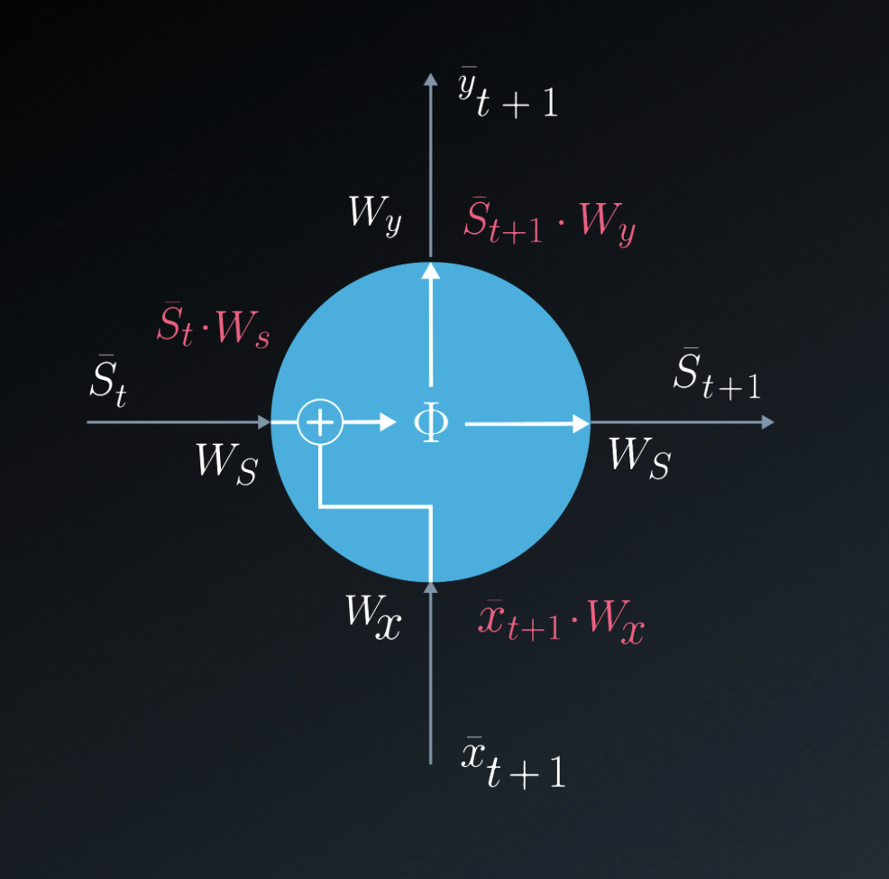
</p>
<p>figure: RNN Neuron Structure and Components</p>
</div>

<br>

At the top, "y-bar-t-plus-1" shows the next output, computed from the current state using the weight matrix "W-Y."The
diagram highlights the flow of information and the transformation of values within the RNN structure through various
mathematical operations, focusing on how input states, hidden states, and output states interact with weights.

#### LSTM Cell Explanation

The diagram is enclosed within a dark rectangle representing the LSTM unit. On the left, the input "x-sub-t" enters the
cell from the bottom left. Several key operations occur within the cell, including the use of the sigmoid function,
represented by "sigma," and the hyperbolic tangent function, represented by "tanh," both essential for controlling
information flow.

At the top, the previous cell state "S-sub-t" is depicted flowing through, being modified by operations involving
multiplication and addition. The cell has several gates: the forget gate, input gate, and output gate, each interacting
with the input "x-sub-t" and the previous state to control which information to store or discard. There are arrows
showing information flow through the LSTM, including multiplications and additions, with multiple paths converging or
splitting based on the gate operations.

<br>
<div align="center">
<p>
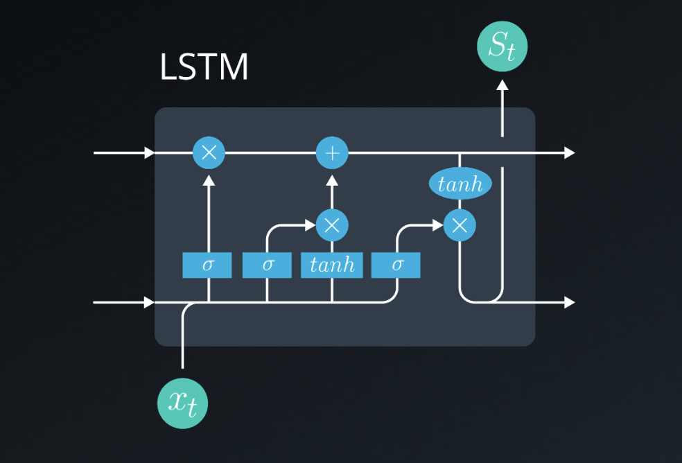
</p>
<p>figure: LSTM Cell Structure and Components</p>
</div>
<br>

The activation functions are visually separated, with "tanh" applied towards the right side and "sigma" present in the
input pathways. The output of the LSTM, represented by arrows exiting to the right, combines information from the gates
and the cell state, forming the cell’s output. The entire structure illustrates the complex interplay between the gates
and the hidden state within an LSTM network.

The LSTM cell allows a recurrent system to learn over many time steps without the fear of losing information due to the
vanishing gradient problem. It is fully differentiable, therefore allowing us to use backpropagation when updating the
weights easily.

#### Basics of LSTM

Inputs

1. Long Term Memory
2. Short Term Memory
3. Input Vector (Event)

Gates

1. Forget Gate
2. Learn Gate
3. Remember Gate
4. Use Gate

Outputs

1. New Long-Term Memory
2. New Short-Term Memory

<br>
<div align="center">
<p>
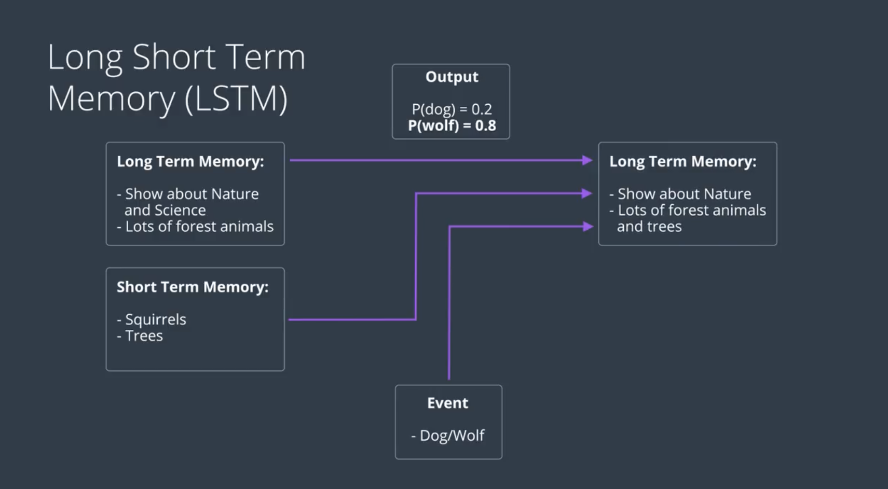
</p>
<p>figure: LSTM Prediction Flow</p>
</div>
<br>

<br>
<div align="center">
<p>
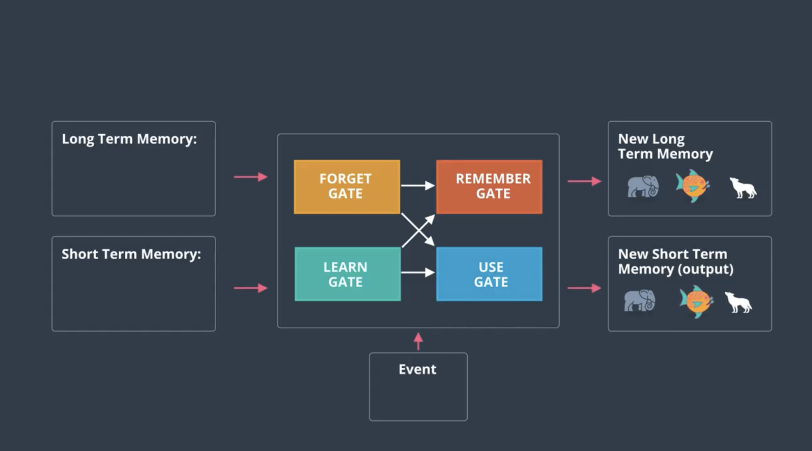
</p>
<p>figure: LSTM Gate Structure</p>
</div>
<br>

<br>
<div align="center">
<p>
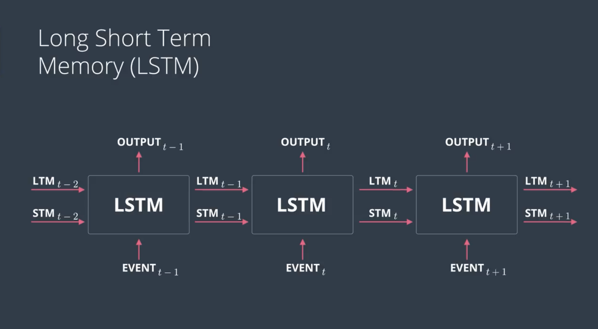
</p>
<p>figure: LSTM Gate Operations</p>
</div>
<br>

## LSTM Gates

Long Short-Term Memory (LSTM) networks use a system of gates to control information flow. These gates help solve the
vanishing gradient problem and allow the network to learn long-term dependencies.

#### Forget Gate

The forget gate decides what information to discard from the cell state.

Mathematical Representation:

$$f_t = \sigma(W_f \cdot [h_{t-1}, x_t] + b_f)$$

Where:

- $f_t$: Forget gate output (0-1)
- $\sigma$: Sigmoid function
- $W_f$: Weight matrix
- $h_{t-1}$: Previous hidden state
- $x_t$: Current input
- $b_f$: Bias term

Purpose:

- Filters information from cell state
- Values close to 0: forget
- Values close to 1: keep

#### Input Gate

Determines which new information will be stored in the cell state.

Mathematical Representation:

$$i_t = \sigma(W_i \cdot [h_{t-1}, x_t] + b_i)$$ $$\tilde{C}_t = \tanh(W_c \cdot [h_{t-1}, x_t] + b_c)$$

Where:

- $i_t$: Input gate output
- $\tilde{C}_t$: Candidate values
- $W_i$, $W_c$: Weight matrices
- $b_i$, $b_c$: Bias terms

Purpose:

- Controls new information flow
- Creates candidate values
- Scales new information importance

#### Remember Gate (Cell State Update)

Updates the cell state by combining forget gate and learn gate outputs.

Mathematical Representation:

$$C_t = f_t \cdot C_{t-1} + i_t \cdot \tilde{C}_t$$

Where:

- $C_t$: New cell state
- $C_{t-1}$: Previous cell state
- $\cdot$: Element-wise multiplication

Purpose:

- Maintains long-term memory
- Combines old and new information
- Controls information flow through time

#### Use Gate (Output Gate)

Controls what parts of the cell state will be output.

Mathematical Representation:

$$o_t = \sigma(W_o \cdot [h_{t-1}, x_t] + b_o)$$ $$h_t = o_t \cdot \tanh(C_t)$$

Where:

- $o_t$: Output gate values
- $h_t$: Hidden state output
- $W_o$: Weight matrix
- $b_o$: Bias term

Purpose:

- Filters cell state output
- Creates final output
- Controls information visibility

#### Complete LSTM Step:

1. Forget: Remove irrelevant information
2. Learn: Add new information
3. Remember: Update cell state
4. Use: Create output

```python
# Complete LSTM Forward Pass
def lstm_forward(x_t, h_prev, c_prev):
    # Forget Gate
    f_t = sigmoid(dot(W_f, concat(h_prev, x_t)) + b_f)

    # Input Gate
    i_t = sigmoid(dot(W_i, concat(h_prev, x_t)) + b_i)
    c_tilde = tanh(dot(W_c, concat(h_prev, x_t)) + b_c)

    # Cell State Update
    c_t = f_t * c_prev + i_t * c_tilde

    # Output Gate
    o_t = sigmoid(dot(W_o, concat(h_prev, x_t)) + b_o)
    h_t = o_t * tanh(c_t)

    return h_t, c_t
```

#### Practical Considerations

##### Advantages:

1. Solves vanishing gradient
2. Better long-term memory
3. Selective information retention

##### Challenges:

1. Computational complexity
2. More parameters to train
3. Memory requirements

##### Best Practices:

1. Use proper initialization
2. Apply dropout carefully
3. Consider bidirectional LSTM
4. Use gradient clipping

##### Applications:

- Sequence prediction
- Machine translation
- Speech recognition
- Time series forecasting

#### Code Example for Gate Visualization:

```python
def visualize_gates(lstm_layer, input_sequence):
    # Get gate activations
    forget_acts = lstm_layer.get_forget_gate_values(input_sequence)
    input_acts = lstm_layer.get_input_gate_values(input_sequence)
    cell_acts = lstm_layer.get_cell_state_values(input_sequence)
    output_acts = lstm_layer.get_output_gate_values(input_sequence)

    # Plot activations
    plt.figure(figsize=(15, 10))
    plt.subplot(4,1,1)
    plt.title('Gate Activations Over Time')
    plt.plot(forget_acts, label='Forget Gate')
    plt.plot(input_acts, label='Input Gate')
    plt.plot(cell_acts, label='Cell State')
    plt.plot(output_acts, label='Output Gate')
    plt.legend()
    plt.show()
```

##### Quiz Question: LSTM Memory Update Mechanism

**Question:** The Long Term Memory and Short Term Memory are updated by a method where... (Select the response that best
completes the sentence)

**Options:**

1. The Remember Gate takes in the LTM & STM to determine the new LTM. The USE gate performs the same operation for the
   STM. ✅
2. The USE takes in the LTM & STM to determine the new LTM. The Remember gate performs the same operation for the LTM.
3. The Long Term Memory is multiplied against the Short Term Memory using a weight matrix.

**Correct Answer:** Option 1: The Remember Gate takes in the LTM & STM to determine the new LTM. The USE gate performs
the same operation for the STM. ✅

**Explanation:**

In LSTM networks, the memory update process works as follows:

1. **Remember Gate (Cell State Update)**:

    - Takes both Long Term Memory (LTM/Cell State) and Short Term Memory (STM/Hidden State)
    - Formula: $$C_t = f_t \cdot C_{t-1} + i_t \cdot \tilde{C}_t$$
    - Determines what information to keep and what to update in the LTM

2. **USE Gate (Output Gate)**:
    - Controls the Short Term Memory update
    - Formula: $$h_t = o_t \cdot \tanh(C_t)$$
    - Filters the cell state to create the new hidden state (STM)

The process is sequential:

1. Remember Gate updates LTM first
2. USE Gate then uses the updated LTM to create new STM

This is why Option 1 is correct - it accurately describes how:

- Remember Gate handles LTM updates
- USE Gate handles STM updates
- Both gates work together but have distinct roles in memory management

Option 2 is incorrect because it reverses the roles of the gates, and Option 3 oversimplifies the complex gating
mechanism of LSTMs.

##### Quiz Question: Important Components of LSTM Architecture

**Question:** Check the important pieces of an LSTM architecture. (Multiple correct responses)

**Options and Their Status:**

1. ✅ The inputs of the input vector, LTM, and STM
2. ❌ The modulation factor
3. ✅ Forget, Learn, Remember and Use Gates
4. ❌ The normalization gate
5. ✅ The Hidden State
6. ✅ The outputs of the LTM and STM
7. ✅ The Cell State

**Explanation:**

Let's analyze each component and why it's correct or incorrect:

**Correct Components:**

1. **Input Vector, LTM, and STM**

    - Essential inputs for LSTM processing
    - LTM (Long-Term Memory) stores long-term dependencies
    - STM (Short-Term Memory) handles immediate context

2. **Four Gates (Forget, Learn, Remember, Use)**

    - Forget Gate: Decides what to discard
    - Learn Gate: Determines new information to store
    - Remember Gate: Updates cell state
    - Use Gate: Controls output information

3. **Hidden State**

    - Represents short-term memory
    - Carries immediate context information
    - Essential for sequence processing

4. **LTM and STM Outputs**

    - Critical for information flow
    - Enables both short and long-term memory retention
    - Necessary for next time step processing

5. **Cell State**
    - Core component for maintaining long-term dependencies
    - Acts as the memory highway through time
    - Essential for solving vanishing gradient problem

**Incorrect Components:**

1. **Modulation Factor**

    - Not a standard LSTM component
    - Might be confused with gate multipliers

2. **Normalization Gate**
    - Not part of standard LSTM architecture
    - While normalization can be used in LSTMs, it's not a gate component

This distinction shows that LSTM's power comes from its carefully designed memory and gate mechanisms, not from
additional processing components.

<br>
<div align="center">
<p>
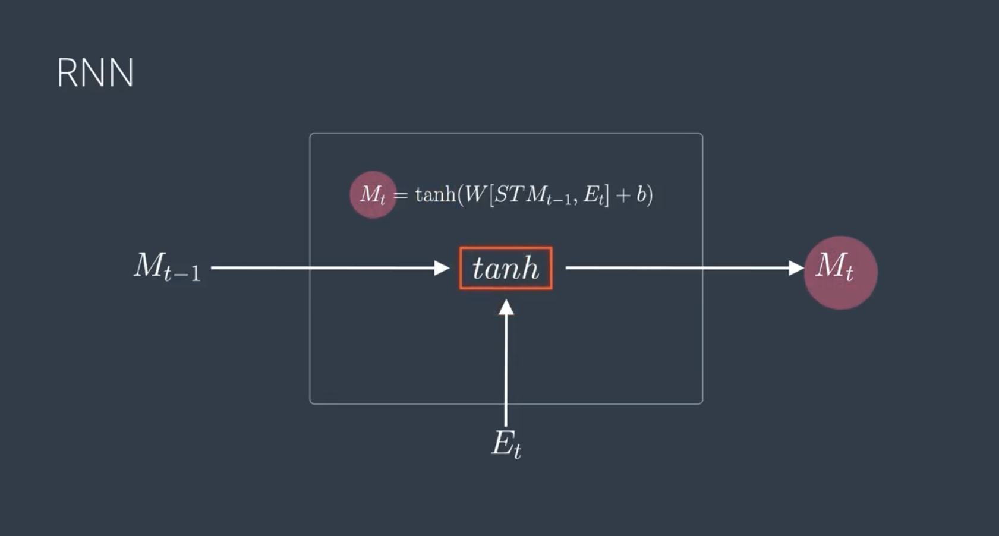
</p>
<p>figure: RNN Architecture Overview</p>
</div>
<br>

<br>
<div align="center">
<p>
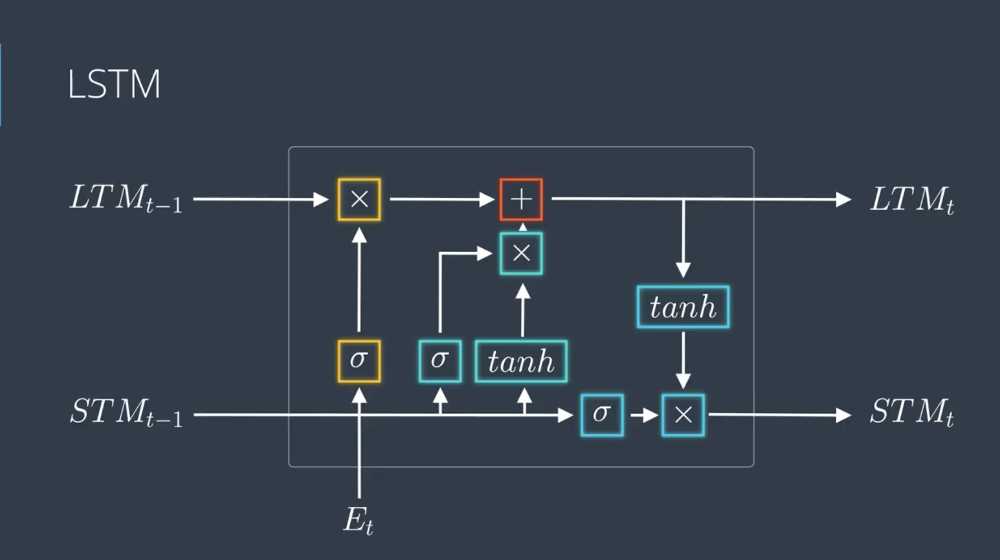
</p>
<p>figure: LSTM Architecture Overview</p>
</div>
<br>

#### Learn Gate

The output of the _Learn Gate_ is $N_ti_t$ where:

$$N_t = \tanh(W_n[STM_{t-1}, E_t] + b_n)$$

$$i_t = \sigma(W_i[STM_{t-1}, E_t] + b_i)$$

Note: The equation shows a Learn Gate equation where:

- $N_t$ is computed using hyperbolic tangent (tanh) activation
- $i_t$ is computed using sigmoid ($\sigma$) activation
- Both use weights ($W$) and biases ($b$) with previous short-term memory ($STM_{t-1}$) and current input ($E_t$)

<br>
<div align="center">
<p>
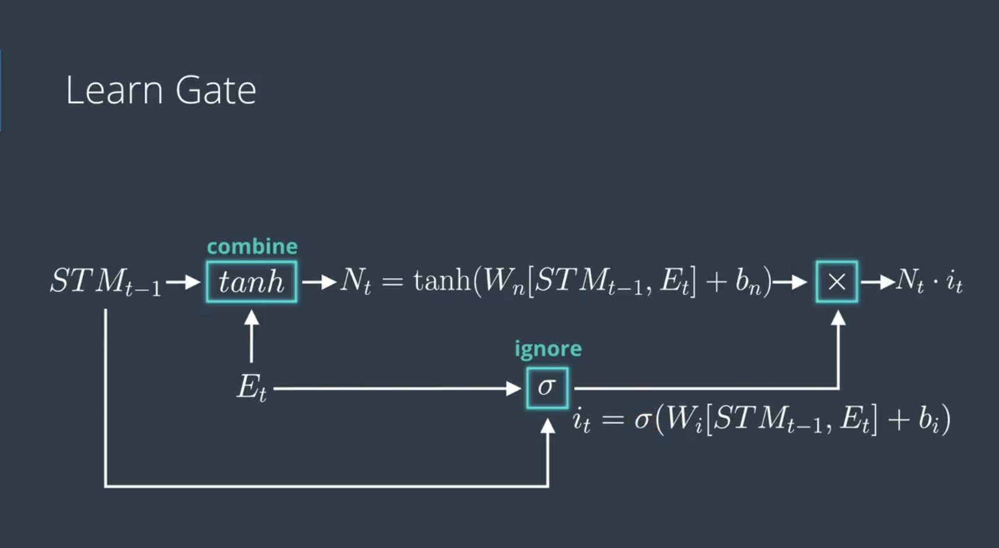
</p>
<p>figure: LSTM Learn Gate Operation</p>
</div>
<br>

#### Forget Gate

The output of the Forget Gate is $LTM_{t-1}f_t$ where:

$$f_t = \sigma(W_f[STM_{t-1}, E_t] + b_f)$$

<br>
<div align="center">
<p>
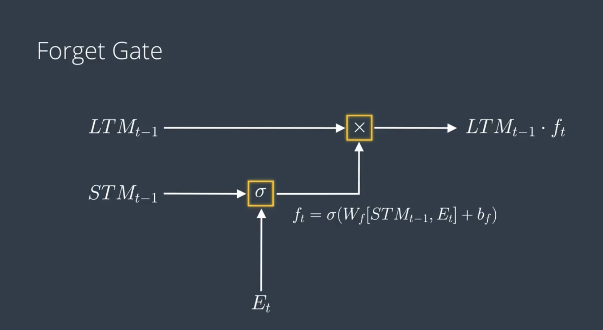
</p>
<p>figure: LSTM Forget Gate Operation</p>
</div>
<br>

#### Remember Gate

The output of the Remember Gate is:

$$LTM_{t-1}f_t + N_ti_t$$

$(N_t, i_t \text{ and } f_t \text{ are calculated in equations 1 and 2})$

<br>
<div align="center">
<p>
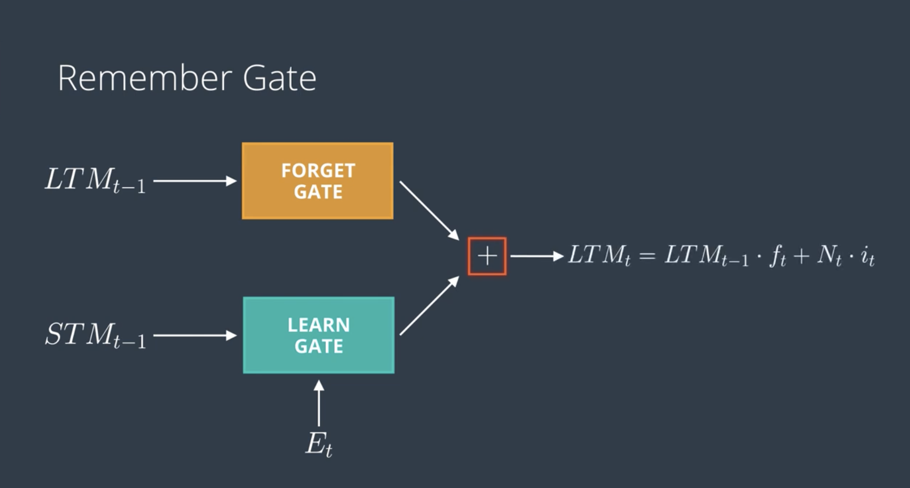
</p>
<p>figure: LSTM Remember Gate Operation</p>
</div>
<br>

#### Use Gate

The output of the Use Gate is $U_tV_t$ where:

$$U_t = \tanh(W_uLTM_{t-1}f_t + b_u)$$ $$V_t = \sigma(W_v[STM_{t-1}, E_t] + b_v)$$

These equations represent the mathematical formulation of how information flows through each gate in an LSTM cell, with:

- $\sigma$ representing the sigmoid function
- $\tanh$ representing the hyperbolic tangent function
- $W$ terms representing weight matrices
- $b$ terms representing bias vectors
- $LTM$ representing Long Term Memory
- $STM$ representing Short Term Memory
- $E_t$ representing the input at time t

<br>
<div align="center">
<p>
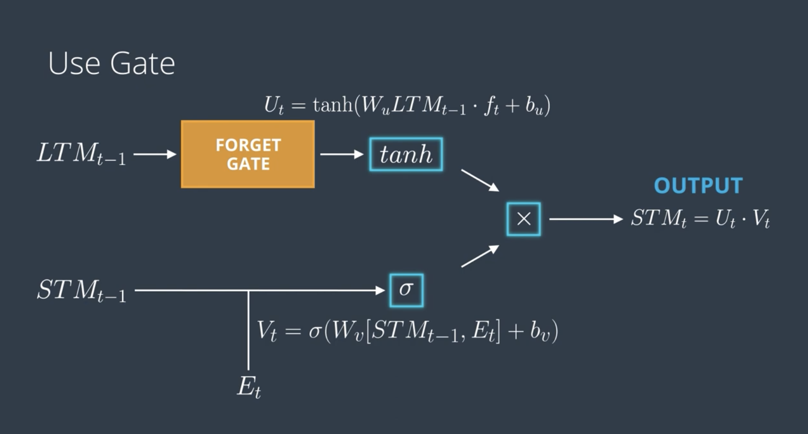
</p>
<p>figure: LSTM Use Gate Operation</p>
</div>
<br>

##### Quiz: LSTM Gate Functions

**Question:** Match each LSTM gate to its function.

| Gate              | Function                                                  | Explanation                                                                                                                                                                   |
| ----------------- | --------------------------------------------------------- | ----------------------------------------------------------------------------------------------------------------------------------------------------------------------------- |
| The Forget Gate   | Chooses which parts of the long-term memory are important | Controls what information should be discarded from the cell state using a sigmoid function to output values between 0 (forget) and 1 (keep)                                   |
| The Learn Gate    | Updates the short-term memory with new information        | Creates and controls what new information should be stored in the cell state, using both a sigmoid layer to decide what to update and a tanh layer to create candidate values |
| The Remember Gate | Outputs the long-term memory                              | Combines the filtered old memory (from Forget Gate) with potential new memories (from Learn Gate) to update the cell state                                                    |
| The Use Gate      | Outputs the short-term memory                             | Decides what parts of the cell state will be output as the hidden state, using a filtered version through tanh and sigmoid functions                                          |

##### **Detailed Explanation:**

1. Forget Gate
    - Primary function: Information filtering
    - Equation: $$f_t = \sigma(W_f[STM_{t-1}, E_t] + b_f)$$
    - Acts as the memory "clearance" mechanism
2. Learn Gate

    - Primary function: Information acquisition
    - Updates STM with new data
    - Essential for incorporating new information

3. Remember Gate

    - Primary function: Memory persistence
    - Equation: $$LTM_{t-1}f_t + N_ti_t$$
    - Manages long-term information storage

4. Use Gate
    - Primary function: Output control
    - Equation: $$U_tV_t$$ where $$U_t = \tanh(W_uLTM_{t-1}f_t + b_u)$$
    - Controls information flow to the next layer

These gates work together to create LSTM's ability to maintain and manage both short-term and long-term dependencies in
sequential data.
