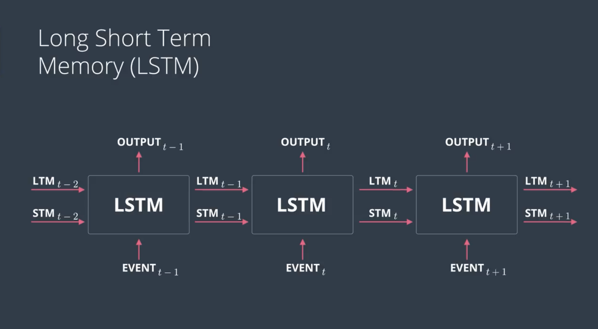
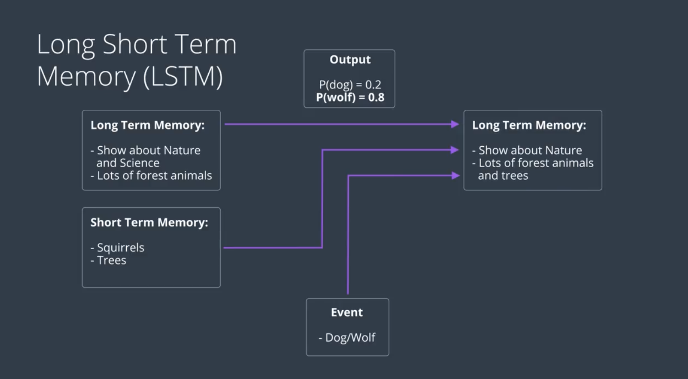
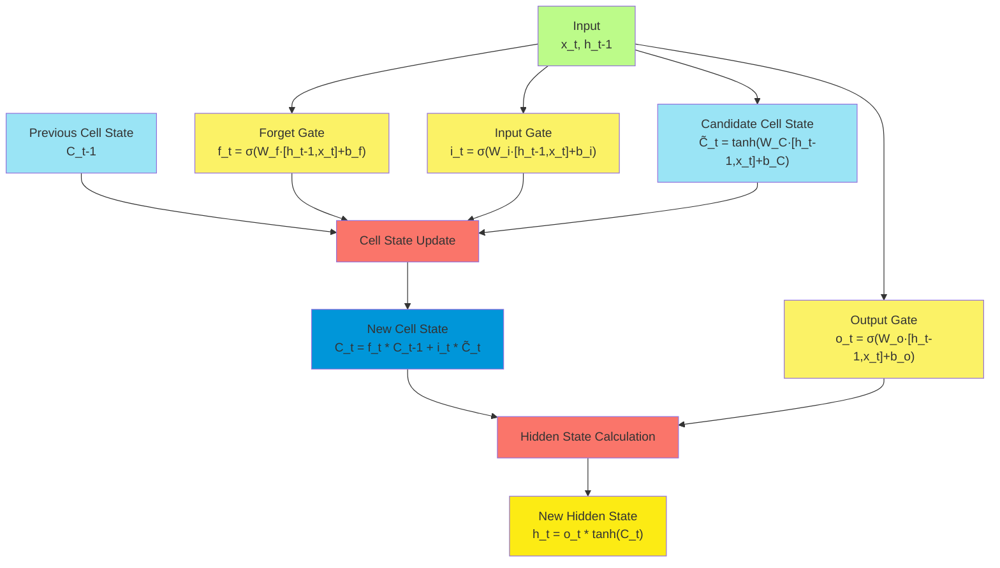
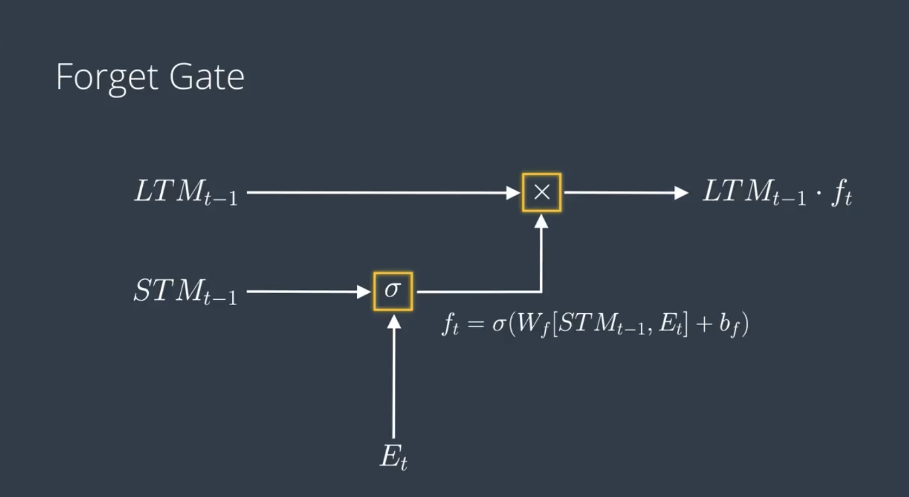
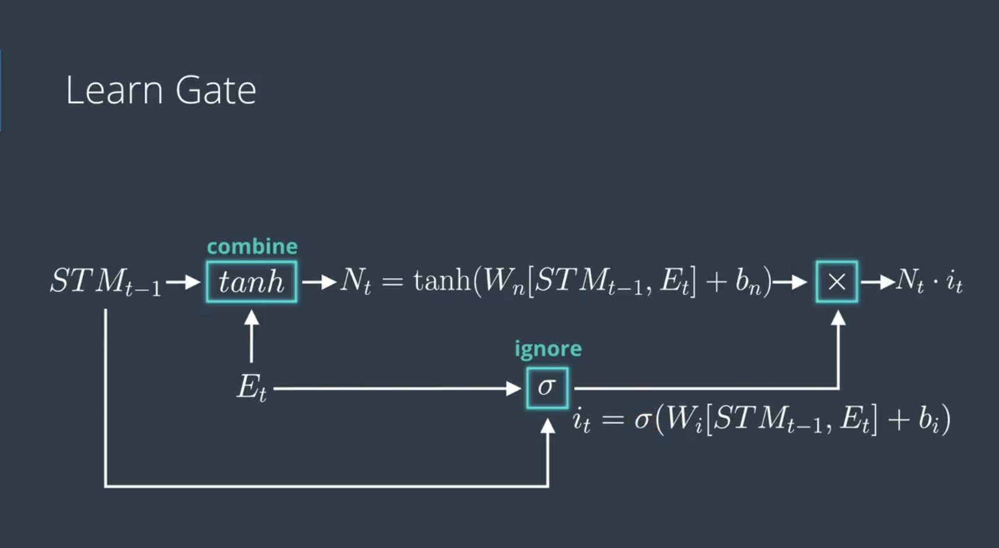
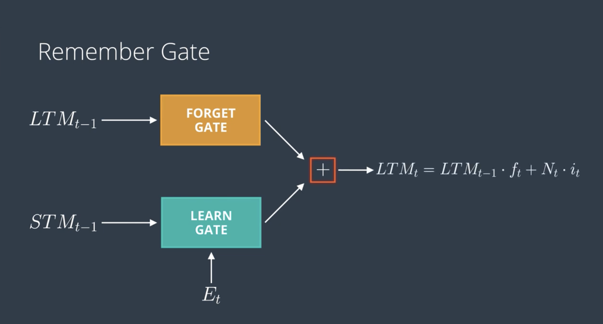
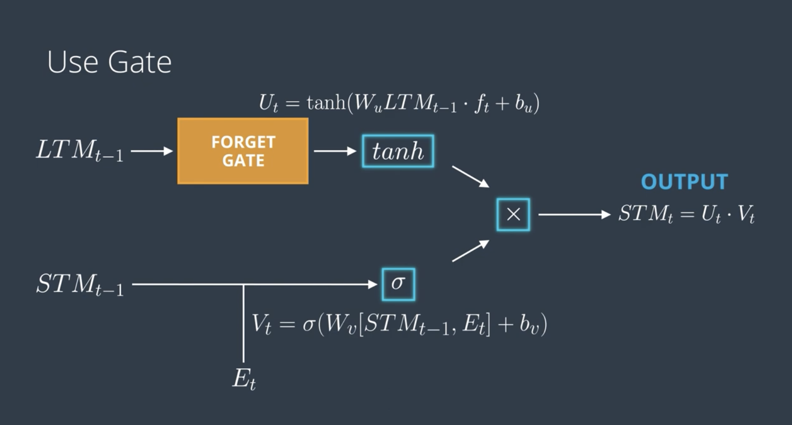
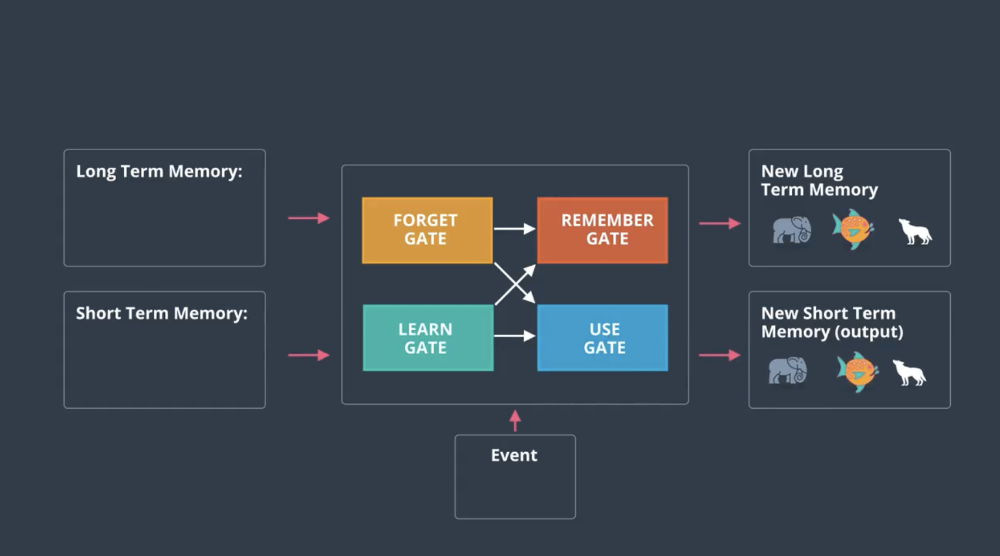

# C-2: Introduction to LSTM

1. LSTM Fundamentals and Motivation
    - The Vanishing Gradient Problem in RNNs
    - How LSTMs Solve Long-Term Dependencies
    - LSTM Cell Architecture vs Standard RNN Cells
    - Memory Types in LSTM Networks
2. LSTM Cell Structure and Components
    - Basic Inputs and Outputs
    - Cell State and Hidden State Concept
    - Activation Functions in LSTM (Sigmoid and Tanh)
    - Information Flow Within the LSTM Cell
3. LSTM Gating Mechanisms
    - Forget Gate: Operation and Mathematical Formulation
    - Learn Gate: Operation and Mathematical Formulation
    - Remember Gate: Operation and Mathematical Formulation
    - Use Gate: Operation and Mathematical Formulation
4. LSTM Forward Pass Computation
    - Complete Mathematical Representation
    - Step-by-Step Information Processing
    - Practical Implementation Considerations
    - Updating Long-Term and Short-Term Memory
5. Advantages and Applications of LSTM Networks
    - Comparison with Standard RNNs
    - Practical Considerations and Best Practices
    - Common Challenges and Solutions
    - Application Domains and Use Cases

#### LSTM Fundamentals and Motivation

##### The Vanishing Gradient Problem in RNNs

Imagine trying to remember something important someone told you at the beginning of a very long conversation. By the
end, that crucial detail might be lost among all the other information that came after it. Standard Recurrent Neural
Networks (RNNs) face a similar challenge called the **vanishing gradient problem**.

At its core, this problem occurs during the training of RNNs when we're trying to connect information across many time
steps. To understand why this happens, let's first understand how RNNs learn.

When an RNN processes a sequence, it updates its hidden state at each time step:

$$h_t = \tanh(W_{hh} \cdot h_{t-1} + W_{xh} \cdot x_t + b_h)$$

During training, the network learns by adjusting its weights through a process called backpropagation through time
(BPTT). This involves calculating how much each weight contributed to any errors in the network's predictions, then
updating those weights accordingly.

<div align="center">

<p>figure: LSTM Gate Operations</p>
</div>

For long sequences, this calculation requires multiplying many derivatives together as we move backward through time.
Here's where the trouble begins. Mathematically, the gradient at a given time step depends on gradients from future time
steps, creating a chain of multiplications:

$$\frac{\partial h_t}{\partial h_{t-n}} = \prod_{i=t-n+1}^{t} \frac{\partial h_i}{\partial h_{i-1}}$$

Each term in this product involves the derivative of the activation function (like tanh or sigmoid) and the recurrent
weight matrix. For common activation functions, these derivatives fall between 0 and 1 for most input values. When we
multiply many small numbers together, the result gets exponentially smaller—this is the "vanishing" in the vanishing
gradient problem.

**Why this matters:** When gradients become extremely small, the weight updates during training also become negligibly
small. This effectively prevents the network from learning patterns that span many time steps, as the learning signal
becomes too weak to influence the weights that would capture these long-range connections.

Think of it like trying to whisper a message through 50 people in a line. By the time it reaches the end, the message
has become distorted or lost entirely. Similarly, the learning signal in an RNN becomes too faint to be useful after
backpropagating through many time steps.

This limitation creates several practical problems:

1. **Limited memory horizon:** An RNN can typically only learn dependencies spanning about 5-10 time steps, making it
   ineffective for tasks requiring longer-term memory.
2. **Context blindness:** Important information from the distant past essentially vanishes from the network's
   consideration.
3. **Training difficulties:** Learning stalls as gradients become too small to drive meaningful weight updates.

Consider a practical example: A language model trying to complete the sentence "I grew up in France... I speak fluent
**\_**." A human would easily predict "French," making a connection between "France" and the language spoken. But if
these words are separated by many other words, a standard RNN would struggle to maintain this connection because the
gradient signal from "French" would vanish before reaching back to "France" during training.

This limitation helps explain why, despite their theoretical capability to process sequences of arbitrary length,
traditional RNNs often fail at tasks requiring long-term memory—creating the need for more sophisticated architectures
like LSTMs.

##### How LSTMs Solve Long-Term Dependencies

Long Short-Term Memory (LSTM) networks were specifically designed to overcome the vanishing gradient problem. Rather
than making small modifications to the standard RNN architecture, LSTMs introduce a fundamentally different approach to
how information flows through the network.

**The Cell State: A Highway for Information**

The key innovation in LSTMs is the introduction of a **cell state** (sometimes called long-term memory). Think of this
cell state as an express highway running straight through the network, allowing information to flow forward with minimal
interference.

While a standard RNN forces all information through repeated transformations that can distort or lose information, the
LSTM provides this separate pathway—the cell state—where information can travel relatively unchanged across many time
steps.

Mathematically, the cell state update in an LSTM is:

$$C_t = f_t \odot C_{t-1} + i_t \odot \tilde{C}_t$$

Where:

- $C_t$ is the cell state at time $t$
- $f_t$ is the forget gate output (values between 0 and 1)
- $i_t$ is the input gate output (values between 0 and 1)
- $\tilde{C}_t$ is the candidate cell state
- $\odot$ represents element-wise multiplication

**Solving the Vanishing Gradient: The Constant Error Carousel**

The cell state solves the vanishing gradient problem through what researchers call a "constant error carousel" (CEC).
Here's how it works:

When the forget gate $f_t$ outputs values close to 1 and the input gate $i_t$ outputs values close to 0, the cell state
remains almost unchanged:

$$C_t \approx C_{t-1}$$

This creates a direct path for gradients to flow backward during training with minimal reduction in magnitude. Unlike
the standard RNN where gradients are repeatedly multiplied by small numbers, causing them to vanish, the LSTM allows
gradients to flow back through the cell state with little attenuation.

When the forget gate in an LSTM is close to 1, it means the network is deciding to keep or preserve most of the
information from the previous cell state.

Specifically, when the forget gate outputs values close to 1:

- The previous memory (cell state) is largely preserved
- Information from earlier time steps continues to flow through the network with minimal loss
- The network determines that past context remains relevant for current processing

In the cell state update equation: $C_t = f_t ⊙ C_{t-1} + i_t ⊙ \tilde{C}_t$

When $f_t$ (forget gate) is close to 1, the first term $f_t ⊙ C_{t-1}$ keeps most of the previous cell state intact.

This is why forget gate values close to 1 are crucial for capturing long-term dependencies. For example, when processing
a long document, the LSTM might keep the forget gate open (close to 1) for information about the main subject, allowing
it to maintain topic coherence across many sentences or paragraphs.

The name "forget gate" can be slightly confusing - when it outputs 1, the network actually "remembers" or "doesn't
forget" the information, while values close to 0 mean the information is forgotten.

When the input gate in an LSTM is close to 1, it means the network is allowing new information to be fully added to the
cell state (long-term memory).

Here's what happens with input gate values close to 1:

- The network decides that the new information is important and should be incorporated into memory
- The candidate values (new information created by the tanh layer) are allowed to pass through almost completely
- The cell state gets strongly updated with this new information

For example, if an LSTM is processing a text and encounters an important new character or plot point, the input gate
might open wide (values close to 1) to store this critical new information in the cell state.

In the complete LSTM memory update equation: $C*t = f_t ⊙ C*{t-1} + i_t ⊙ \tilde{C}_t$

When $f_t$ (forget gate) is close to 1, the network preserves old information. When $i_t$ (input gate) is close to 1,
the network fully incorporates new information.

This dual mechanism gives LSTMs their power - they can simultaneously remember important past information while also
being receptive to crucial new information.

For the output gate in an LSTM, the values have a specific meaning:

When the output gate (denoted as $o_t$) has values close to 1:

- The network allows information from the cell state to be exposed in the hidden state
- That part of the memory is considered relevant for the current output or prediction
- Information flows strongly from the long-term memory to the short-term memory/output

When the output gate has values close to 0:

- The network blocks information from the cell state from appearing in the hidden state
- That part of the memory is considered irrelevant for the current output
- Information is preserved in long-term memory without affecting the current output

This is reflected in the hidden state equation: $$h_t = o_t \odot \tanh(C_t)$$

The output gate acts as a filter determining which parts of the transformed cell state ($\tanh(C_t)$) should be exposed
as output.

For example, in language processing, the LSTM might maintain information about multiple topics in its cell state, but
the output gate would only open for information relevant to forming the current word or prediction, keeping other
context hidden but preserved for later use.

This selective exposure mechanism is what allows LSTMs to maintain comprehensive internal memory while sharing only
what's needed at each time step. The gate equations are provided below:

For the forget gate: $$f_t = \sigma(W_f \cdot [h_{t-1}, x_t] + b_f)$$

For the input gate: $$i_t = \sigma(W_i \cdot [h_{t-1}, x_t] + b_i)$$

For the candidate cell state: $$\tilde{C}_t = \tanh(W_C \cdot [h_{t-1}, x_t] + b_C)$$

For the output gate: $$o_t = \sigma(W_o \cdot [h_{t-1}, x_t] + b_o)$$

For the cell state update: $$C_t = f_t \odot C_{t-1} + i_t \odot \tilde{C}_t$$

For the hidden state: $$h_t = o_t \odot \tanh(C_t)$$

Where:

- $\sigma$ is the sigmoid function
- $\tanh$ is the hyperbolic tangent function
- $\odot$ represents element-wise multiplication
- $[h_{t-1}, x_t]$ is the concatenation of the previous hidden state and current input
- $W_f$, $W_i$, $W_C$, $W_o$ are weight matrices
- $b_f$, $b_i$, $b_C$, $b_o$ are bias vectors

**The Gating Mechanism: Selective Memory**

Another brilliant aspect of LSTMs is their gating mechanism, which consists of three main gates:

1. **Forget gate:** Decides what information to discard from the cell state
2. **Input gate:** Controls what new information to add to the cell state
3. **Output gate:** Determines what parts of the cell state to expose as output

Each gate consists of a sigmoid neural network layer and a pointwise multiplication operation. The sigmoid function
outputs values between 0 and 1, determining how much of each component should pass through. We can think of these gates
as "quality control officers" deciding what information is worth remembering, updating, or sharing.

**Practical Example: Language Understanding**

To understand how these mechanisms help with long-term dependencies, consider an LSTM processing this text:

"Jane grew up in Germany. She moved to France for college. After graduation, she returned to Germany and now she
speaks..."

When the LSTM encounters the final part about speaking, it can predict "German" because:

1. The cell state has preserved information about Jane's connection to Germany across many time steps.
2. The forget gate has selectively retained this important context while discarding less relevant details.
3. The output gate now exposes this long-term memory of Germany when it's relevant for predicting the language she
   speaks.

A standard RNN would likely predict "French" because it's the most recent country mentioned—the connection to Germany
from earlier would have been lost due to the vanishing gradient problem.

**Why This Works Better Than Standard RNNs**

LSTMs overcome the limitations of standard RNNs through:

1. **Protected pathways for gradient flow:** The cell state provides a highway where gradients can travel back through
   many time steps without vanishing.
2. **Selective memory management:** The gates learn when to preserve information and when to update it, focusing memory
   resources on what's actually important.
3. **Separation of storage and computation:** By separating the cell state (storage) from the hidden state (working
   memory), LSTMs can maintain long-term information while still remaining responsive to new inputs.

These innovations enable LSTMs to capture dependencies spanning hundreds of time steps, drastically outperforming
standard RNNs on tasks requiring long-term memory.

##### LSTM Cell Architecture vs Standard RNN Cells

To fully appreciate how LSTMs overcome the limitations of standard RNNs, let's compare their architectural differences
and understand why these differences matter for sequence processing tasks.

**Standard RNN Cell: Simple but Limited**

A standard RNN cell has a straightforward structure. At each time step, it:

1. Takes the current input and the previous hidden state
2. Combines them through a weight matrix
3. Applies a nonlinear activation function (typically tanh)
4. Produces a new hidden state

This process can be represented by a single equation:

$$h_t = \tanh(W_{hh} \cdot h_{t-1} + W_{xh} \cdot x_t + b_h)$$

The simplicity of this architecture is both a strength and a weakness. It's computationally efficient but offers limited
control over information flow. Every aspect of the hidden state is updated at each time step, making it difficult to
preserve information over long sequences.

**LSTM Cell: Complex but Powerful**

In contrast, an LSTM cell has a much more elaborate architecture built around controlled information flow. The key
components include:

1. **Cell state ($C_t$):** A separate memory channel that runs through the cell, allowing information to flow unchanged
   across many time steps.
2. **Hidden state ($h_t$):** Serves as the working memory and output of the cell.
3. **Three gating mechanisms:**
    - Forget gate: Controls what to discard from the cell state
    - Input gate: Controls what new information to add
    - Output gate: Controls what to expose in the hidden state
4. **Candidate cell state:** Creates potential new values to add to the cell state

This architecture creates distinct pathways for memory storage (cell state) and output generation (hidden state),
enabling more fine-grained control over information processing.

**Visual Comparison**

Imagine the difference between:

- A standard RNN cell: Like a single room where all information processing happens together
- An LSTM cell: Like a building with specialized rooms for different functions—storage, filtering, processing—with
  controlled doorways (gates) between them

**Key Architectural Differences**

| Feature             | Standard RNN                                 | LSTM                                       | Why It Matters                                                              |
| ------------------- | -------------------------------------------- | ------------------------------------------ | --------------------------------------------------------------------------- |
| Memory structure    | Single hidden state                          | Separate cell state and hidden state       | Allows LSTMs to maintain long-term memory while still processing new inputs |
| Information control | Complete state overwrite at each step        | Selective update through gating mechanisms | Enables preservation of important information over many time steps          |
| Gradient flow       | Single pathway with multiple transformations | Direct pathway through cell state          | Helps prevent vanishing gradients during training                           |
| Parameter count     | Relatively few parameters                    | ~4x more parameters than equivalent RNN    | Greater capacity but more computationally expensive                         |

**Computational Complexity**

The LSTM's sophisticated architecture comes at a computational cost. An LSTM cell requires computing four different
neural network layers (for the three gates and the candidate cell state), compared to just one in a standard RNN. This
makes LSTMs more parameter-intensive and computationally expensive.

For an input of dimension $d_x$ and hidden state of dimension $d_h$, the parameter counts are:

- Standard RNN: $d_h \times (d_x + d_h + 1)$ parameters
- LSTM: $4 \times d_h \times (d_x + d_h + 1)$ parameters

Let me break down how the parameter counts are computed for both standard RNNs and LSTMs:

###### Standard RNN Parameter Count

For a standard RNN, we have a single update equation: $$h_t = \tanh(W_{hh} \cdot h_{t-1} + W_{xh} \cdot x_t + b_h)$$

Let's count the parameters:

1. $W_{hh}$ has dimensions $d_h \times d_h$ (mapping previous hidden state to current)
2. $W_{xh}$ has dimensions $d_h \times d_x$ (mapping input to hidden state)
3. $b_h$ has dimension $d_h$ (bias term)

Total parameters = $d_h \times d_h + d_h \times d_x + d_h$ = $d_h \times (d_h + d_x + 1)$

When we write $d_h \times d_h$, we're referring to the dimensions of the weight matrix $W_{hh}$, not an element-wise
multiplication operation.

In this context:

- $d_h \times d_h$ means a matrix with $d_h$ rows and $d_h$ columns, containing $d_h^2$ total parameters
- This matrix $W_{hh}$ is used in a matrix multiplication operation with the previous hidden state $h_{t-1}$

When we compute $W_{hh} \cdot h_{t-1}$, this is a matrix-vector multiplication, not an element-wise operation.

Element-wise multiplication in equations is typically denoted by the symbol $\odot$ (as in $f_t \odot C_{t-1}$), while
regular matrix multiplication is denoted by $\cdot$ or sometimes just by adjacency.

So in the parameter count:

- $d_h \times d_h$ means a matrix with $d_h^2$ parameters
- $d_h \times d_x$ means a matrix with $d_h \times d_x$ parameters
- $d_h$ means a vector with $d_h$ parameters

###### LSTM Parameter Count

An LSTM has four gates/components, each with its own weights and biases:

1. Forget gate: $f_t = \sigma(W_f \cdot [h_{t-1}, x_t] + b_f)$
2. Input gate: $i_t = \sigma(W_i \cdot [h_{t-1}, x_t] + b_i)$
3. Candidate cell state: $\tilde{C}*t = \tanh(W_C \cdot [h*{t-1}, x_t] + b_C)$
4. Output gate: $o_t = \sigma(W_o \cdot [h_{t-1}, x_t] + b_o)$

For each gate/component:

- Weight matrix for $[h_{t-1}, x_t]$ has dimensions $d_h \times (d_h + d_x)$
- Bias vector has dimension $d_h$

So each gate/component has $d_h \times (d_h + d_x) + d_h = d_h \times (d_h + d_x + 1)$ parameters.

With 4 gates/components, the total is: $4 \times d_h \times (d_h + d_x + 1)$ parameters

This 4× increase in parameters gives LSTMs their greater capacity but also makes them more computationally expensive
than standard RNNs.

Despite the increased complexity, the additional parameters enable LSTMs to learn more sophisticated patterns in
sequential data, particularly when long-term dependencies are important.

**Practical Advantages of LSTM Architecture**

The architectural differences between LSTMs and standard RNNs create several practical advantages:

1. **Controlled information retention:** Unlike RNNs which must overwrite their entire state at each step, LSTMs can
   selectively update portions of their memory.
2. **Multi-timescale processing:** LSTMs can simultaneously track both fast-changing patterns (through the hidden state)
   and slow-changing patterns (through the cell state).
3. **Adaptive memory focus:** The gating mechanisms learn to focus memory resources on important information while
   discarding irrelevant details.
4. **Protection against vanishing gradients:** The direct pathway through the cell state allows gradients to flow
   backward with minimal diminishing.

Consider a practical example: An RNN and an LSTM both analyzing a patient's medical history to predict future health
risks. The RNN might focus primarily on recent symptoms, having "forgotten" important events from the patient's past due
to its limited memory. The LSTM, however, could maintain awareness of critical factors like childhood illnesses or
genetic predispositions from much earlier in the sequence while still processing current symptoms effectively.

These architectural differences explain why LSTMs consistently outperform standard RNNs on tasks requiring memory of
events across many time steps.

##### Memory Types in LSTM Networks

One of the most distinctive features of LSTM networks is their sophisticated dual-memory system. Understanding how these
different types of memory work together gives us insight into why LSTMs are so effective at processing sequential
information.

**The Two-Track Memory System**

LSTMs maintain two primary types of memory, each serving a different purpose:

1. **Long-Term Memory (LTM)** - represented by the cell state ($C_t$)
2. **Short-Term Memory (STM)** - represented by the hidden state ($h_t$)

Think of this like the difference between your general knowledge (long-term memory) and what you're actively thinking
about right now (short-term or working memory). Both are important, but they serve different functions in how you
process information.

<div align="center">

<p>figure: LSTM Prediction Flow</p>
</div>

**Long-Term Memory: The Cell State**

The cell state functions as the network's long-term memory storage system. Visualized as a horizontal line running
through the top of the LSTM cell diagram, it serves as a protected reservoir of information that can persist across many
time steps.

**Key characteristics of the cell state:**

1. **Persistence:** Information can flow through the cell state relatively unchanged across many time steps, especially
   when the forget gate is open (values close to 1) and the input gate is closed (values close to 0).
2. **Protected storage:** Unlike the hidden state, which is directly exposed to other layers of the network, the cell
   state is internal to the LSTM. This protection allows information to be stored without immediately affecting
   predictions or outputs.
3. **Selective modification:** The cell state is carefully regulated by the forget and input gates, which determine what
   information to discard and what new information to store.

**Short-Term Memory: The Hidden State**

The hidden state serves as the network's working memory or short-term memory, focusing on immediate processing tasks
while the cell state maintains longer-term context.

**Key characteristics of the hidden state:**

1. **Output generation:** The hidden state is what gets passed to subsequent layers in the network or used for
   predictions.
2. **Recurrent input:** The hidden state from the previous time step is used as input for all gate calculations at the
   current time step.
3. **Filtered view of memory:** The hidden state contains information from the cell state that has been filtered through
   the output gate, exposing only what's relevant for the current time step.

**How the Two Memory Types Interact**

The relationship between long-term and short-term memory creates a sophisticated information processing system:

1. **Information flow path:** Typically, information flows:
    - From input to gates
    - Through gates to cell state for storage
    - From cell state through output gate to hidden state
    - From hidden state to subsequent layers or time steps
2. **Memory specialization:** Long-term memory (cell state) specializes in preserving important context over extended
   periods, while short-term memory (hidden state) handles immediate processing and output generation.
3. **Temporal multi-scale processing:** This dual-memory system allows LSTMs to simultaneously track patterns at
   different time scales—rapid changes through the hidden state and slower trends through the cell state.

**A Real-World Analogy**

Think of the LSTM's memory system as similar to how you might write a research paper:

- **Long-term memory (cell state):** Your notes and reference materials that persist throughout the writing process. You
  don't need to access all of them constantly, but they're there when needed.
- **Short-term memory (hidden state):** The specific notes and ideas you're actively using to write the current
  paragraph. This changes frequently as you move through different sections.
- **Forget gate:** Your decision to discard certain references or notes that are no longer relevant to your current
  section.
- **Input gate:** Your choice to add new information to your collection of notes as you discover it.
- **Output gate:** Your decision about which specific notes to consult for the paragraph you're currently writing.

**Practical Example: Language Processing**

When an LSTM processes text, this dual memory system allows it to maintain both local and global context:

For the sentence "The cat, which had been missing for days and had the entire neighborhood searching everywhere, finally
returned home," an LSTM might use:

- **Cell state (LTM):** Maintains awareness that we're talking about "the cat" throughout the long clause about being
  missing.
- **Hidden state (STM):** Focuses on processing the current part of the sentence, like "had been missing" or "returned
  home."

When the sentence reaches "returned home," the LSTM can still access the subject "cat" from its cell state, even though
many words have intervened. This allows it to maintain grammatical agreement and semantic coherence across the entire
sentence.

This distinction between long-term and short-term memory, with carefully controlled information flow between them, is
what gives LSTMs their remarkable ability to learn dependencies across varying time scales, from immediate context to
information presented hundreds of time steps earlier.

#### LSTM Cell Structure and Components

##### Basic Inputs and Outputs

An LSTM cell is like a sophisticated processing unit designed specifically to handle sequential information while
preserving important context over time. To understand how LSTMs work, let's first look at what goes into and comes out
of these remarkable cells.

**The Three Essential Inputs**

Every LSTM cell processes three fundamental inputs at each time step:

1. **Current Input Vector** (often denoted as $x_t$ or $E_t$): This represents the new information arriving at the
   current time step. Depending on your application, this could be:
    - A word embedding if you're processing text
    - A feature vector if you're analyzing time series data
    - A frame representation if you're working with video
    - Any other form of sequential data
2. **Previous Hidden State** (denoted as $h_{t-1}$ or $STM_{t-1}$): This is the short-term memory from the previous time
   step. Think of this as the network's immediate working memory—what it was just thinking about or focusing on at the
   last time step.
3. **Previous Cell State** (denoted as $C_{t-1}$ or $LTM_{t-1}$): This is the long-term memory from the previous time
   step. This acts as the network's longer-term memory storage, maintaining information that might be relevant across
   many time steps.

<div align="center">

<p>figure: LSTM Cell Structure and Components</p>
</div>

You can think of these inputs like the different information sources you use when continuing a conversation: what the
other person just said (current input), what you were just talking about (previous hidden state), and the broader
context of your relationship or the topic you've been discussing (previous cell state).

**The Two Critical Outputs**

After processing these inputs through its internal mechanisms, the LSTM cell produces two primary outputs:

1. **New Hidden State** (denoted as $h_t$ or $STM_t$): This updated short-term memory serves two important purposes:
    - It's used as input to whatever comes next in the network (output layers or the next layer in a stacked LSTM)
    - It's passed to the next time step as part of the recurrent connection
2. **New Cell State** (denoted as $C_t$ or $LTM_t$): This updated long-term memory is passed exclusively to the next
   time step of the same LSTM cell, maintaining the continuity of the long-term memory.

This dual output nature is one of the key distinctions between LSTMs and standard RNNs. Standard RNNs produce only a
single output (the hidden state), while LSTMs maintain both a hidden state and a separate cell state.

**Dimensions and Practical Implementation**

In practice, these inputs and outputs have specific dimensions:

- For an LSTM with a hidden size of $n$, both the short-term memory ($h_t$) and long-term memory ($C_t$) will be vectors
  of dimension $n$.
- The input vector ($x_t$) dimension depends on how you represent your data. For word embeddings, this might be 100-300
  dimensions; for other applications, it could be any appropriate size.

For instance, if you're building an LSTM for sentiment analysis with word embeddings of dimension 200 and a hidden size
of 128, then at each time step:

- Input vector: 200 dimensions (one embedding per word)
- Hidden state: 128 dimensions
- Cell state: 128 dimensions

###### LSTM Dimensions Explained

In an LSTM network, there are three key vectors with specific dimensions that we track:

1. **Input Vector (x_t)**: This is the data you're feeding into the LSTM at the current time step.

    - Dimension: [batch_size, input_size] or just [input_size] for a single example
    - The input_size (often denoted as d_x) varies based on your data representation
    - For word embeddings, this is typically between 100-300 dimensions
    - For sensor data, this could be the number of sensors or features

    Word embeddings are numerical representations of words that capture semantic meaning in a vector space referring to
    the size or dimensionality of these word embedding vectors as mentioned of 100-300 dimensions.

    Each word in your vocabulary gets converted into a vector (essentially a list of numbers) of fixed length. This
    length is what we call the "embedding dimension." For example, with a 200-dimensional embedding:

    The word "happy" might be represented as a vector with 200 numbers: $[0.2, -0.4, 0.1, ..., 0.8]$

    The word "sad" would be a different vector with 200 numbers: $[-0.3, 0.2, -0.5, ..., -0.7]$

    These vectors are designed so that words with similar meanings have similar vectors (closer to each other in the
    vector space). The number of dimensions determines how much semantic information can be encoded about each word.

    In natural language processing tasks:

    - Lower dimensions (like 50-100) might be used for simpler tasks or smaller datasets
    - Medium dimensions (100-300) are common for many general NLP tasks
    - Higher dimensions (300+) might be used for very complex language tasks with large datasets

    The specific embedding dimension is a hyperparameter you choose when designing your model. In the example from the
    text, they chose 200 dimensions for their word embeddings, which means each word input to the LSTM would be
    represented as a 200-dimensional vector.

    In natural language processing with LSTMs, we typically process batches of sequences (sentences) simultaneously.
    When processing text with an LSTM, we typically organize our data in batches where:

    - Each sentence is a sequence of word embeddings
    - Multiple sentences are processed in parallel

    The correct dimensional structure is:

    For a single time step:

    - Input dimension: [batch_size, input_size]
        - batch_size = number of sentences we're processing simultaneously
        - input_size = dimension of each word embedding (200 in our example)

    For the full sequence:

    - Input dimension: [batch_size, sequence_length, input_size]
        - sequence_length = number of words in each sentence

    Say we have 32 sentences, each with varying numbers of words. To process them in a batch:

    1. We first need to make all sequences the same length by padding shorter sentences
    2. If the longest sentence has 20 words, our input tensor would be [32, 20, 200]
    3. The LSTM processes one word from each sentence simultaneously, moving through time steps

    For a single time step (processing the 5th word from all 32 sentences, for example):

    - The input would be [32, 200] - one word embedding from each sentence
    - The hidden state would be [32, 128] - one hidden state per sentence
    - The cell state would be [32, 128] - one cell state per sentence

    ###### Visualization of Correct Batch Processing

    ```shell
    Sentence 1: [word1_1] → [word1_2] → [word1_3] → ...
    Sentence 2: [word2_1] → [word2_2] → [word2_3] → ...
    ...
    Sentence 32: [word32_1] → [word32_2] → [word32_3] → ...
                    ↓           ↓           ↓
                 LSTM step 1 → LSTM step 2 → LSTM step 3 → ...
    ```

    At each time step, the LSTM processes one word from each sentence in the batch, updating 32 separate hidden states
    and cell states in parallel.

2. **Hidden State (h_t)**: This is the "short-term memory" or output of the LSTM cell.

    - Dimension: [batch_size, hidden_size] or just [hidden_size] for a single example
    - The hidden_size (often denoted as d_h or n) is a hyperparameter you choose
    - Common values range from 64 to 1024 depending on task complexity
    - This is also what gets passed to the next layer or used for predictions

3. **Cell State (C_t)**: This is the "long-term memory" that flows internally through the LSTM cell.

    - Dimension: [batch_size, hidden_size] or just [hidden_size] for a single example
    - The cell state has exactly the same dimensions as the hidden state
    - This is by design - each element in the hidden state has a corresponding memory element

###### Concrete Example

Let's work through the example from the text:

For an LSTM processing sentiment analysis with:

- Word embedding dimension = 200
- Hidden size = 128
- Batch size = 32 (processing 32 examples at once)

At each time step (each word in a sentence):

1. **Input Vector**:
    - Dimension: [32, 200]
    - Each word is represented as a 200-dimensional embedding vector
    - We're processing 32 sentences simultaneously
2. **Hidden State**:
    - Dimension: [32, 128]
    - Each sentence has a 128-dimensional hidden state representing the current context
    - This is what would be used to predict sentiment or passed to the next layer
3. **Cell State**:
    - Dimension: [32, 128]
    - Each sentence has a 128-dimensional cell state maintaining long-term dependencies
    - This flows internally through the LSTM cells

###### Weight Matrix Dimensions

The weight matrices in an LSTM have dimensions derived from these vector sizes:

1. Each gate has a weight matrix operating on the concatenated [h_t-1, x_t]:
    - Dimension of concatenated input: [batch_size, hidden_size + input_size]
    - Weight matrix dimension: [hidden_size, hidden_size + input_size]
    - In our example: [128, 328] (128 + 200)
2. Each gate also has a bias vector:
    - Dimension: [hidden_size]
    - In our example: [128]

This is why the total parameter count for an LSTM is 4 × hidden_size × (hidden_size + input_size + 1), as we have four
sets of these weights and biases (for the forget gate, input gate, cell candidate, and output gate).

###### Visualization of Dimensions

Imagine each sentence as a sequence of words flowing through time steps:

```
Sentence 1: [word1] → [word2] → [word3] → ...
              ↓         ↓         ↓
            x_t=1      x_t=2     x_t=3    (each x_t is 200-dimensional)
              ↓         ↓         ↓
            LSTM →     LSTM →    LSTM →   (each LSTM maintains 128-dimensional states)
              ↓         ↓         ↓
            h_t=1      h_t=2     h_t=3    (each h_t is 128-dimensional)
```

The LSTM processes one word at a time, updating its hidden state and cell state at each step. The final hidden state (or
sometimes all hidden states) can then be used for tasks like sentiment classification.

##### How Word Embeddings Work

Word embeddings are created through a sophisticated process of training neural networks to represent words as vectors.
At its core, a word embedding maps words to numerical vectors in a way that captures semantic relationships. This
mapping isn't arbitrary - it's learned from data.

There are several methods to create these vectors:

###### Word2Vec

This popular approach trains a neural network to predict either:

- A word based on its context (Continuous Bag of Words model)
- Context words based on a center word (Skip-gram model)

The network doesn't actually complete this prediction task - instead, we extract the weights from the hidden layer,
which become our word embeddings.

###### GloVe (Global Vectors)

GloVe analyzes global word-word co-occurrence statistics from a corpus. It creates embeddings so that the dot product of
two word vectors relates to the logarithm of their co-occurrence probability.

###### FastText

Similar to Word2Vec, but it represents each word as a bag of character n-grams, helping with rare words and
morphologically rich languages.

In the example, the word "happy" is represented as $[0.2, -0.4, 0.1, ..., 0.8]$ - a 200-dimensional vector.

Each dimension doesn't have a specific interpretable meaning like "happiness level" or "noun-ness." Instead, the vector
as a whole creates a position in a high-dimensional space where:

- Similar words cluster together
- Different relationships between words are captured in consistent ways

For example, the vector relationship (king - man + woman) might be very close to the vector for queen, capturing
analogical relationships.

###### An Intuitive Example

Imagine a simplified 2D space where we only track two made-up dimensions:

- Dimension 1: Might accidentally capture something like "formality"
- Dimension 2: Might accidentally capture something like "sentiment"

Words might be positioned like:

- "happy": [0.8, 0.9] (informal, positive)
- "delighted": [0.4, 0.95] (more formal, positive)
- "sad": [0.7, -0.8] (informal, negative)
- "melancholy": [0.3, -0.7] (more formal, negative)

In reality, we use 100-300 dimensions because language has many more subtle relationships than just two dimensions could
capture.

##### Matrix Multiplication

Matrix multiplication is a fundamental operation in linear algebra that has become increasingly important with the rise
of deep learning and neural networks. Let me walk you through how it works from the ground up.

When we multiply two matrices, we're performing a specific pattern of multiplications and additions that combines
information from both matrices. The operation is written as C = A × B, where A and B are input matrices and C is the
resulting matrix.

For multiplication to be possible, the matrices must have compatible dimensions:

- If matrix $A$ has dimensions $m × n$ (m rows, n columns)
- And matrix $B$ has dimensions $n × p$ (n rows, p columns)
- Then the result $C$ will have dimensions $m × p$ (m rows, p columns)

The key requirement is that the number of columns in the first matrix (n) must equal the number of rows in the second
matrix (n).

###### Matrix-Vector Multiplication

In neural networks, we often multiply a matrix by a vector. A vector is just a matrix with one column. The same
principles apply:

If A is an $m × n$ matrix and x is an $n$-dimensional vector, then $A × x$ is an $m$-dimensional vector where:

- $(A × x)ᵢ = Σⱼ Aᵢⱼ × xⱼ$

This is exactly what happens in each layer of a neural network when we compute W × x + b.

###### Why Matrix Multiplication Matters in LSTMs

In LSTMs, when we see equations like:

- $fₜ = σ(Wf · [hₜ₋₁, xₜ] + bf)$

We're performing matrix multiplication between the weight matrix Wf and the concatenated vector [hₜ₋₁, xₜ].

If:

- hₜ₋₁ has dimension dh
- xₜ has dimension dx
- Then [hₜ₋₁, xₜ] has dimension (dh + dx)
- And Wf would have dimension dh × (dh + dx)

The result of this multiplication is a vector of dimension dh, to which we add the bias vector bf (also of dimension dh)
before applying the sigmoid function.

Matrix multiplication allows neural networks to learn complex patterns by combining inputs with learned weights in a
structured way. It's the fundamental operation that enables the powerful representational capacity of deep learning
models.

**The Continuous Chain of Processing**

What makes recurrent networks special is how they create a continuous chain of processing across time steps. The outputs
of one step become inputs to the next, establishing a memory that spans the entire sequence:

Time step 1:

($x_1$, initial $h_0$, initial $C_0$) → LSTM → ($h_1$, $C_1$)

Time step 2:

($x_2$, $h_1$, $C_1$) → LSTM → ($h_2$, $C_2$) Time step 3: ($x_3$, $h_2$, $C_2$) → LSTM → ($h_3$, $C_3$)

And so on...

This recurrent connection is what allows the LSTM to maintain context across a sequence, with each new input being
processed in light of all previous inputs (as summarized in the current state vectors).

Understanding this basic input-output structure lays the foundation for exploring how the internal components of the
LSTM cell manipulate this information to achieve its remarkable memory capabilities.

##### Cell State and Hidden State Concept

The heart of the LSTM's power lies in its sophisticated dual-memory system—the cell state and hidden state. These two
memory vectors serve different but complementary roles, working together to give LSTMs their remarkable ability to
maintain information across both short and long time spans.

**The Cell State: Long-Term Memory Highway**

The cell state (denoted as $C_t$ or $LTM$) functions as the network's long-term memory. You can visualize it as a
horizontal line running straight through the top of the LSTM cell diagram—like a highway that allows information to flow
through the network with minimal interference.

**Why the cell state is special:**

1. **Information Persistence**: The cell state is designed to allow information to flow through the network relatively
   unchanged if needed. When the "forget gate" is open (values close to 1) and the "input gate" is closed (values close
   to 0), the cell state can carry information virtually unchanged across many time steps.
2. **Protected Information Storage**: Unlike the hidden state, which is directly exposed to other parts of the network,
   the cell state is internal to the LSTM. This protection means information can be stored without being forced to
   immediately affect predictions or outputs.
3. **Selective Memory Control**: The cell state is carefully regulated by the forget and input gates, which determine
   what information should be discarded and what new information should be stored. This selective memory allows the LSTM
   to distinguish between transient information and important context.

Think of the cell state like a secure vault where important information is stored. Not everything gets access to this
vault, and not everything in the vault is shown to others—it's a protected storage system with carefully controlled
access.

Mathematically, the cell state update follows this equation:

$$C_t = f_t \odot C_{t-1} + i_t \odot \tilde{C}_t$$

Where:

- $f_t$ is the forget gate output (controlling what to keep from the previous cell state)
- $i_t$ is the input gate output (controlling what new information to add)
- $\tilde{C}_t$ is the candidate values created from the current input and previous hidden state
- $\odot$ represents element-wise multiplication

This equation shows how the cell state combines filtered old information with carefully selected new information.

**The Hidden State: Working Memory and Output**

The hidden state (denoted as $h_t$ or $STM$) serves as the LSTM's working memory or short-term memory. It fulfills
several essential functions:

1. **Output Generation**: The hidden state is what gets passed to subsequent layers in the network, making it the LSTM's
   "public face" to the rest of the model. If you're predicting the next word in a sentence, for instance, the hidden
   state would be used to make that prediction.
2. **Recurrent Input**: The hidden state from the previous time step ($h_{t-1}$) is used as input to all gate
   calculations at the current time step, providing immediate context for processing new information.
3. **Filtered Information View**: The hidden state contains a filtered view of the cell state, with the output gate
   determining what aspects of the long-term memory should be exposed at the current time step.

You can think of the hidden state like your active thoughts or working memory—what you're currently focused on and what
you're sharing with others, as opposed to everything you know (which would be more like the cell state).

The hidden state is calculated as:

$$h_t = o_t \odot \tanh(C_t)$$

Where:

- $o_t$ is the output gate activation
- $\tanh(C_t)$ is a transformed version of the cell state
- $\odot$ represents element-wise multiplication

This equation reveals that the hidden state is essentially a controlled view of the cell state, filtered through the
output gate to determine what's relevant for the current output and next time step.

**A Real-World Analogy**

To better understand the relationship between these two types of memory, consider a writer working on a novel:

- **Cell State (Long-term memory)**: This is like all the background information, character details, plot points, and
  world-building elements the writer has developed. They don't need to actively think about all of it at once, but it's
  preserved and available when needed.
- **Hidden State (Short-term memory)**: This is like what the writer is actively focusing on while writing the current
  paragraph—perhaps the immediate dialogue, the current scene's mood, or a specific character's reaction. It's what's
  actively being worked with and what influences the immediate output (the words being written).
- **The gates control**:
    - What background information to remember or forget (forget gate)
    - What new developments to add to the overall story knowledge (input gate)
    - What specific elements to focus on right now for the current paragraph (output gate)

**How They Work Together**

The relationship between cell state and hidden state creates a sophisticated memory hierarchy:

1. **Division of Labor**: The cell state specializes in long-term memory retention, while the hidden state handles
   immediate processing and output generation.
2. **Information Control Flow**: Information typically flows from input to hidden state to cell state for storage, and
   then from cell state back to hidden state for output—all regulated by the gates.
3. **Temporal Multi-scale Processing**: This dual-state architecture allows LSTMs to simultaneously track patterns at
   different time scales—rapid changes through the hidden state and slower trends through the cell state.
4. **Protection with Access**: Important information can be preserved in the cell state without necessarily affecting
   current outputs, but can be accessed when relevant.

For example, when processing a long document, an LSTM might store important subject matter or thematic information in
its cell state, while keeping track of grammatical structure and recent words in its hidden state. This allows it to
maintain coherence across long passages while still handling local linguistic patterns correctly.

This conceptual separation between short-term and long-term memory is directly implemented in the LSTM architecture
through the gating mechanisms and separate state vectors. This explicit separation creates a model that more closely
mimics how humans process sequential information, managing both immediate context and longer-term dependencies.

##### Activation Functions in LSTM (Sigmoid and Tanh)

The LSTM architecture relies heavily on two specific activation functions: the sigmoid function and the hyperbolic
tangent (tanh) function. These functions play distinct and critical roles in controlling how information flows through
the cell. Understanding these activation functions helps us see how LSTMs achieve their sophisticated memory management.

**The Sigmoid Function: The Gatekeeper**

The sigmoid function, denoted as σ(x), is mathematically defined as:

$$\sigma(x) = \frac{1}{1 + e^{-x}}$$

This function takes any input value and squeezes it into an output between 0 and 1, creating a smooth S-shaped curve.
Let's think about why this particular range is so useful in LSTMs.

**Why the 0-to-1 range matters:** When we need to decide how much of something to let through—how much information to
keep, add, or output—we need values between 0 and 1 to represent the proportion. A value of 0 means "let nothing
through" (completely close the gate), while a value of 1 means "let everything through" (completely open the gate).

**Where sigmoid appears in LSTMs:**

1. **Forget Gate**: The sigmoid determines what proportion of the previous cell state should be retained or discarded.
    - A value of 0 means "forget everything about this feature"
    - A value of 1 means "remember everything about this feature"
    - Values in between allow for partial forgetting, like remembering 70% of some information
2. **Input Gate**: The sigmoid controls how much of the newly computed information should be added to the cell state.
    - A value of 0 means "ignore this new information completely"
    - A value of 1 means "add all of this new information"
    - Values in between allow partial updates, like adding 30% of some new information
3. **Output Gate**: The sigmoid decides how much of the cell state should be exposed in the hidden state output.
    - A value of 0 means "output nothing about this feature"
    - A value of 1 means "output everything about this feature"
    - Values in between create a partial view of the cell state

The sigmoid's output range makes it perfect for these gating operations, as they require proportional control rather
than all-or-nothing decisions. The gates can partially open or close, creating nuanced control over information flow.

**The Hyperbolic Tangent (tanh) Function: The Content Creator**

The tanh function is defined as:

$$\tanh(x) = \frac{e^x - e^{-x}}{e^x + e^{-x}}$$

This function maps input values to outputs between -1 and 1, creating a symmetric S-shaped curve around the origin.
Unlike sigmoid, tanh's range includes negative values, which serves a different purpose in LSTMs.

**Why the -1-to-1 range matters:** When we're creating or transforming content (not just filtering it), we need to
represent both positive and negative relationships. The tanh function's range from -1 to 1 allows the network to express
bidirectional influences and maintain a balanced, normalized representation.

**Where tanh appears in LSTMs:**

1. **Candidate Cell State Creation**: A tanh activation is used to create the candidate values ($\tilde{C}_t$) that
   might be added to the cell state.

    $$\tilde{C}_t = \tanh(W_c \cdot [h_{t-1}, x_t] + b_c)$$

    The tanh function ensures these values are normalized between -1 and 1, helping to regulate the cell state and
    prevent explosive growth. This normalization creates consistent scales for the information being potentially added
    to memory.

2. **Cell State Output Transformation**: Another tanh function is applied to the cell state before it's filtered by the
   output gate to create the hidden state.

    $$h_t = o_t \odot \tanh(C_t)$$

    This transforms the cell state values to be between -1 and 1, creating a standardized representation for the hidden
    state outputs.

**Visual Comparison of Sigmoid and Tanh**

Imagine sigmoid as a function that answers the question "How much should I let through?" (0% to 100%), while tanh
answers "What values should I create?" (-100% to +100%).

**Working Together: The Perfect Partnership**

The sigmoid and tanh functions work together in the LSTM to create a carefully controlled information flow:

1. **Sigmoid Gates + Tanh Values**: The sigmoid gates determine how much information to let through, while the
   tanh-transformed values determine what that information should be.

    For example, in the cell state update:

    - $\tilde{C}_t$ (created with tanh) proposes what values to potentially add (ranging from -1 to +1)
    - $i_t$ (created with sigmoid) decides how much of these proposed values to actually add (ranging from 0 to 1)

2. **Complementary Ranges**: The sigmoid's 0-to-1 range makes it perfect for proportional filtering, while tanh's
   -1-to-1 range allows for representing both positive and negative relationships.

3. **Balanced Normalization**: Together, they help keep values within the network stable and normalized, preventing the
   exponential growth or decay that can occur in standard RNNs.

###### Understanding the Meaning of tanh in LSTM Networks

The comparison between sigmoid (0% to 100%) and tanh (-100% to +100%) is a helpful intuitive framing, but let me explain
exactly what the tanh function means in the context of LSTMs.

The hyperbolic tangent (tanh) function maps inputs to outputs between -1 and +1. In the context of LSTM networks, this
range allows the network to express both positive and negative relationships or influences.

When we say tanh answers "What values should I create?" with a range from "-100% to +100%", we're describing how it
allows for:

1. **Bidirectional influence**: Unlike sigmoid, which can only express "how much" of something (always positive), tanh
   can express both positive and negative effects.
2. **Content creation with directionality**: When tanh is used to create candidate values for the cell state, it's
   essentially proposing how to modify the memory - should we push a particular feature in a positive direction, a
   negative direction, or leave it unchanged?

Consider an LSTM processing text to determine sentiment:

When the network encounters the word "not" in a sentence:

- The tanh function might generate strongly negative candidate values (-0.8, close to -1) to represent negation
- This negative value indicates "reverse the sentiment of what follows"
- Later, when encountering a positive word like "good", the network might use tanh to generate positive values (0.7,
  close to +1)

The interplay between these positive and negative values allows the LSTM to correctly model phrases like "not good"
(negative) versus "good" (positive).

The normalization provided by tanh is crucial because:

1. It prevents extreme values that could destabilize the network
2. It provides consistency in the ranges of values flowing through the network
3. It allows the network to represent opposing influences (increase vs. decrease) on memory contents

Think of the tanh function as creating balanced, normalized content that can push memory values in either a positive or
negative direction, while sigmoid functions act as the gatekeepers that decide how much of this content should actually
flow through.

This combination of directional content creation (tanh) and proportional filtering (sigmoid) gives LSTMs their
sophisticated memory management capabilities.

**A Practical Example**

Consider an LSTM processing text to predict the next word in a sentence. When it encounters the word "not" in "I am not
happy":

1. The tanh function might generate strongly negative candidate values to represent the negation of the upcoming
   emotional state
2. The sigmoid input gate might open wide (values close to 1) to let this important negation information into the cell
   state
3. Later, when predicting the sentiment, the tanh transformation of the cell state would provide a properly scaled
   representation of the negative sentiment
4. The sigmoid output gate would open to expose this sentiment information when generating the prediction

Understanding these activation functions and their specific roles helps explain how LSTMs achieve their carefully
regulated information flow, allowing them to selectively remember or forget information as needed to process sequential
data effectively.

##### Information Flow Within the LSTM Cell

Understanding the flow of information through an LSTM cell is like watching a well-choreographed dance, where each step
builds upon the last to create a sophisticated memory management system. Let's trace this information flow step by step,
seeing how all the components work together to process, store, and utilize information.

**The Complete Information Pathway**

When an LSTM cell receives its three inputs (current input $x_t$, previous hidden state $h_{t-1}$, and previous cell
state $C_{t-1}$), information flows through the cell in a carefully orchestrated sequence:

**Step 1: Input Analysis and Gate Activation**

The first phase involves analyzing the current input and previous hidden state to make decisions about memory
management. All gates compute their values simultaneously:

1. **Forget Gate**: The forget gate examines the current input and previous hidden state to decide what to discard from
   the cell state.

    $$f_t = \sigma(W_f \cdot [h_{t-1}, x_t] + b_f)$$

    This produces a vector of values between 0 and 1, essentially asking: "For each piece of information in our memory,
    how relevant is it now?"

2. **Input Gate**: The input gate determines what new information should be stored in the cell state.

    $$i_t = \sigma(W_i \cdot [h_{t-1}, x_t] + b_i)$$

    This also outputs values between 0 and 1, asking: "For each piece of new information, how important is it to
    remember?"

3. **Candidate Cell State**: Simultaneously, the cell creates potential new memory content.

    $$\tilde{C}_t = \tanh(W_C \cdot [h_{t-1}, x_t] + b_C)$$

    These values between -1 and 1 represent the actual content that might be added to memory.

4. **Output Gate**: The output gate decides what parts of the cell state to reveal as output.

    $$o_t = \sigma(W_o \cdot [h_{t-1}, x_t] + b_o)$$

    Again outputting values between 0 and 1, this gate answers: "What parts of our memory are relevant to share right
    now?"

In these equations, $[h_{t-1}, x_t]$ represents the concatenation of the previous hidden state and current input,
combining context with new information. Each gate has its own weight matrix ($W_f$, $W_i$, $W_C$, $W_o$) and bias vector
($b_f$, $b_i$, $b_C$, $b_o$).

LSTMs address this challenge through a sophisticated cell structure with multiple gating mechanisms that regulate
information flow. The LSTM cell architecture consists of:



**Step 2: Cell State Update (Memory Management)**

Once all gates have computed their values, the LSTM updates its long-term memory through a two-part process:

1. **Selective Forgetting**: First, the forget gate filters the previous cell state, removing information deemed no
   longer relevant.

    $$C_{t-1} \odot f_t$$

    Think of this as erasing parts of your memory that aren't useful anymore. If $f_t$ has values close to 0 for certain
    elements, those memories fade away.

2. **Selective Addition**: Then, the input gate filters the candidate values, determining what new information to add.

    $$\tilde{C}_t \odot i_t$$

    This is like writing new information into your memory, but only the parts deemed important by the input gate.

3. **Cell State Update**: These operations combine to create the new cell state which is the addition of the selective
   forgetting and selective addition as defined below:

    $$C_t = (C_{t-1} \odot f_t) + (\tilde{C}_t \odot i_t)$$

    This balanced update allows the LSTM to maintain a selective memory that preserves important past information while
    incorporating relevant new details.

**Step 3: Hidden State Calculation (Output Generation)**

Finally, the LSTM generates its output and short-term memory through another two-stage process:

1. **Cell State Transformation**: The cell state is passed through a tanh function to normalize its values between -1
   and 1 using $$\tanh(C_t)$$. This creates a standardized representation of the memory content.

2. **Selective Output**: The output gate then filters this transformed cell state to produce the hidden state.

    $$h_t = o_t \odot \tanh(C_t)$$

    This determines what information from the cell state is relevant for the current output and next processing step.

**Visualizing the Information Flow**

Imagine data flowing through these steps like water through a sophisticated filtration system:

1. The input ($x_t$) and previous context ($h_{t-1}$) enter the system together
2. They pass through three different filters (gates) that determine what to forget, what to add, and what to output
3. The existing memory ($C_{t-1}$) gets selectively cleared and updated
4. The updated memory ($C_t$) passes through a final output filter
5. The filtered output ($h_t$) becomes both the cell's output and part of the next input

**Key Information Pathways**

This sequence of operations creates several important information pathways:

1. **Direct Memory Highway**: The cell state provides a path where information can flow horizontally across time steps
   with minimal interference. When the forget gate outputs 1's and the input gate outputs 0's, information passes
   unchanged through the cell state, creating a perfect memory highway.
2. **Contextual Update Mechanism**: New information is always processed in light of previous context, since all gate
   calculations depend on both $x_t$ and $h_{t-1}$.
3. **Selective Memory Integration**: The parallel computation of what to forget and what to add allows the cell to
   simultaneously discard irrelevant information while incorporating new relevant information.
4. **Filtered Output Exposure**: The output gate provides a way to expose only relevant parts of memory, allowing the
   cell to maintain comprehensive internal memory while sharing only what's needed.

**A Practical Example**

Let's walk through an example of an LSTM processing words in a sentence: "Germany has a strong economy because its
manufacturing sector..."

1. **When processing "Germany":**
    - The input gate might open wide to store information about Germany in the cell state
    - The forget gate might clear previous country information if any existed
    - The output gate would expose this country information in the hidden state
2. **When reaching "because":**
    - The forget gate would likely keep information about Germany and its economy
    - The input gate would add information about a causal relationship coming up
    - The output gate would focus on exposing the expectation of a reason
3. **When processing "manufacturing":**
    - The cell state still contains information about Germany from many steps back
    - The forget gate preserves this country context while perhaps forgetting some intermediate details
    - The input gate adds information about manufacturing
    - The output gate exposes the connection between Germany and manufacturing

This example shows how information can persist in the cell state across many time steps, allowing the network to make
connections between distant elements in the sequence.

The carefully orchestrated information flow within LSTM cells enables them to perform complex sequential processing
tasks that require both sensitivity to new inputs and memory of past context. The gates learn to open and close at
appropriate times based on the data, creating an adaptive memory system that can handle dependencies across varying time
scales.

#### LSTM Gating Mechanisms

##### Forget Gate: Operation and Mathematical Formulation

The Forget Gate is the first critical decision-making component in an LSTM cell. Its fundamental purpose is to determine
what information should be discarded from the cell's long-term memory. Think of it as a filter that decides which parts
of your memories are worth keeping and which can be safely forgotten.

Let's explore why this gate is so important. Without the ability to forget, the LSTM's memory would become cluttered
with outdated or irrelevant information. The Forget Gate provides a mechanism to continuously refresh the memory by
removing information that's no longer needed, allowing the network to stay focused on what matters in the current
context.

At its core, the Forget Gate answers a fundamental question: "Given what I'm seeing now and what I've seen before, what
aspects of my previous memory are still relevant?" This question is answered by analyzing both the current input and the
previous short-term memory.

<div align="center">

<p>figure: LSTM Forget Gate Operation</p>
</div>

**Mathematical Formulation:**

The Forget Gate is implemented as a neural network layer with a sigmoid activation function:

$$f_t = \sigma(W_f[h_{t-1}, x_t] + b_f)$$

Where:

- $f_t$ is the output of the Forget Gate at time step $t$
- $\sigma$ is the sigmoid activation function that squeezes values between 0 and 1
- $W_f$ is the weight matrix for the Forget Gate
- $h_{t-1}$ is the previous hidden state (Short-Term Memory)
- $x_t$ is the current input (Event)
- $b_f$ is the bias vector
- $[h_{t-1}, x_t]$ represents the concatenation of these two vectors

Let's break down what this equation actually means in practice:

1. We combine the previous hidden state $h_{t-1}$ and the current input $x_t$ by concatenating them.
2. We multiply this combined vector by a weight matrix $W_f$ and add a bias term $b_f$.
3. We pass the resulting values through a sigmoid function, which outputs values between 0 and 1.

The output $f_t$ is a vector with the same dimensions as the cell state. Each element in this vector is a number between
0 and 1 that acts as a filter for the corresponding element in the cell state. A value close to 1 means "keep this
information," while a value close to 0 means "forget this information."

**How the Forget Gate Works in Practice:**

Let's visualize the operation of the Forget Gate with a concrete example. Imagine an LSTM processing a text about a
character named John who initially appears in New York but then moves to Boston:

When the LSTM reads "John moved from New York to Boston", the Forget Gate might work as follows:

1. When processing "John": The Forget Gate has no previous information about John, so it might not forget much.
2. When processing "moved from New York": The Forget Gate recognizes that John's previous location is important and
   keeps this information.
3. When processing "to Boston": Now the Forget Gate might output values close to 0 for memory cells storing John's
   previous location (New York), as this information is being superseded by the new location (Boston). Meanwhile, it
   would output values close to 1 for memory cells storing information about John himself, as the subject of the
   sentence remains relevant.

The beauty of the Forget Gate is that it doesn't make binary decisions—it can partially forget information. For
instance, it might keep 90% of the information about John, 10% of the information about New York, and allocate new
memory for Boston.

**The Filtering Operation:**

Once the Forget Gate has produced its output $f_t$, this vector is applied to the previous cell state through
element-wise multiplication:

$$C_{t-1} \odot f_t$$

Where $\odot$ represents element-wise multiplication and $C_{t-1}$ is the previous cell state (Long-Term Memory).

This multiplication operation is where the actual "forgetting" happens. Each element of the cell state is multiplied by
the corresponding element from the Forget Gate output:

- If the Forget Gate outputs a 1 for a particular element, that element in the cell state remains unchanged (100%
  retained).
- If the Forget Gate outputs a 0, that element in the cell state becomes 0 (completely forgotten).
- If the Forget Gate outputs 0.7, that element is scaled down to 70% of its original value (partially forgotten).

The Forget Gate learns over time which information is worth keeping based on the patterns in your data. For example,
when processing text, it might learn to forget gender information when it's no longer relevant to the sentence
structure, or to retain subject information across multiple sentences when it remains the topic of discussion.

This selective memory mechanism is what enables LSTMs to maintain a clean, relevant memory state that focuses on
information crucial to the current context, while discarding noise and outdated information. It's a key factor in the
LSTM's ability to process long sequences effectively, creating a foundation for the other gates to build upon.

##### Learn Gate: Operation and Mathematical Formulation

The Learn Gate (often called the Input Gate in technical literature) has the crucial responsibility of updating the
LSTM's long-term memory with new information. While the Forget Gate decides what to discard from memory, the Learn Gate
determines what new information should be stored. These two gates work together to maintain a relevant and up-to-date
memory state.

The Learn Gate addresses two fundamental questions:

1. "What new information is worth remembering?"
2. "How should this new information be represented in our memory?"

To answer these questions thoroughly, the LSTM uses two separate mechanisms that work together to control the addition
of new information to memory.

<div align="center">

<p>figure: LSTM Learn Gate Operation</p>
</div>

**Mathematical Formulation:**

The Learn Gate consists of two main components:

1. **Input Gate ($i_t$)**: Determines which values in the cell state will be updated
   $$i_t = \sigma(W_i[h_{t-1}, x_t] + b_i)$$
2. **Candidate Values ($N_t$)**: Creates potential new values to add to the cell state
   $$N_t = \tanh(W_N[h_{t-1}, x_t] + b_N)$$

Where:

- $\sigma$ is the sigmoid activation function (outputs between 0 and 1)
- $\tanh$ is the hyperbolic tangent activation function (outputs between -1 and 1)
- $W_i$ and $W_N$ are weight matrices
- $h_{t-1}$ is the previous hidden state (Short-Term Memory)
- $x_t$ is the current input (Event)
- $b_i$ and $b_N$ are bias vectors

The final output of the Learn Gate is the element-wise product of these two components: $$N_t \odot i_t$$

This combined output represents the new information that will be added to the cell state.

**Understanding the Two Components:**

Let's break down what each component does:

**1. Candidate Values Generation ($N_t$):**

The tanh layer creates a vector of new candidate values that could potentially be added to the cell state. These values
range from -1 to 1, representing new information extracted from the current input and context.

Think of this step as drafting new entries for your memory. For example, if the LSTM is reading "Jane visited Paris,"
the candidate values might encode information about:

- A new character named Jane
- An action of visiting
- A location called Paris

The tanh activation normalizes these values and allows for representing both positive and negative relationships in the
data.

**2. Update Filtering ($i_t$):**

The sigmoid layer outputs values between 0 and 1, determining how much of each candidate value should actually be added
to the cell state. This creates a selective update mechanism that can focus on specific aspects of the new information.

Think of this as deciding which parts of your draft are actually important enough to commit to memory. For the sentence
"Jane visited Paris," the Input Gate might:

- Open wide (values close to 1) for memory cells representing the new character and location
- Remain partially open for cells representing the visiting action
- Stay mostly closed (values close to 0) for cells representing other unrelated concepts

**The Combined Effect:**

When these two components are multiplied together, we get a filtered version of the new information: $$N_t \odot i_t$$

This multiplication operation means that:

- Only candidate values corresponding to "open" input gates will actually contribute to the cell state
- The more "open" an input gate is (closer to 1), the more of that candidate value will be added
- If an input gate is "closed" (close to 0), the corresponding candidate value will be mostly ignored

This dual-component design allows the Learn Gate to be highly selective about what new information enters the memory,
focusing on relevant details while ignoring noise or irrelevant information.

**How the Learn Gate Works in Practice:**

Let's use a concrete example to illustrate how the Learn Gate operates. Imagine an LSTM processing a weather forecast:

When the LSTM reads "Tomorrow will be sunny with a high of 75°F":

1. **Candidate Values Generation**: The tanh layer might create a vector encoding information about:
    - The time reference ("tomorrow")
    - The weather condition ("sunny")
    - The temperature ("75°F")
2. **Update Filtering**: The sigmoid layer might:
    - Open wide for memory cells related to tomorrow's weather and temperature
    - Keep mostly closed for cells representing historical weather patterns or unrelated concepts
3. **Combined Effect**: After multiplication, the Learn Gate produces a vector that contains:
    - Strong signals about tomorrow being sunny and 75°F
    - Minimal information about other weather aspects not mentioned

When this filtered information is later added to the cell state, the LSTM effectively remembers the forecast for
tomorrow while not overwriting other information about weather on different days or locations that might already be
stored in memory.

The Learn Gate's ability to selectively update different aspects of the cell state allows the LSTM to incorporate new
information in a nuanced way, focusing on what's important in the current context while preserving independent
information streams within its memory. This capability is essential for learning complex temporal patterns where
different factors evolve at different rates or have different levels of importance depending on the context.

##### Remember Gate: Operation and Mathematical Formulation

The Remember Gate (sometimes called the Cell State Update) is where the LSTM actually updates its long-term memory,
combining the decisions from the Forget Gate and Learn Gate. Unlike the other gates, the Remember Gate doesn't have its
own learnable parameters. Instead, it implements the memory update rule that integrates information selection from the
previous gates.

The Remember Gate answers the fundamental question: "How do we combine our filtered old memory with new information to
create an updated memory?" It represents the crucial point where the LSTM balances continuity and change, preserving
relevant past information while integrating new insights.

<div align="center">

<p>figure: LSTM Remember Gate Operation</p>
</div>

**Mathematical Formulation:**

The Remember Gate implements the cell state update equation:

$$C_t = C_{t-1} \odot f_t + N_t \odot i_t$$

Where:

- $C_t$ is the new cell state (Long-Term Memory) at time $t$
- $C_{t-1}$ is the previous cell state
- $f_t$ is the output from the Forget Gate
- $N_t$ is the candidate values from the tanh component of the Learn Gate
- $i_t$ is the output from the sigmoid component of the Learn Gate (Input Gate)
- $\odot$ represents element-wise multiplication

This equation might look simple, but it captures the essence of memory management in LSTMs through two main operations:

1. **Selective Memory Retention**: $C_{t-1} \odot f_t$ This term represents the information from the previous cell state
   that passes through the Forget Gate's filter. Elements of the previous memory are scaled by values between 0 and 1,
   determining how much of each element is retained.
2. **Selective Memory Addition**: $N_t \odot i_t$ This term represents the new information that passes through the Learn
   Gate's filter. Candidate values are scaled by values between 0 and 1, determining how much of each new element is
   added to the memory.

These two components are then added together to create the new cell state.

**Understanding the Update Mechanism:**

Let's break down how this update mechanism works step-by-step:

**Step 1: Preparing Old Memory** First, the previous cell state is filtered by the Forget Gate: $$C_{t-1} \odot f_t$$

This operation selectively preserves information from the previous cell state. For each element in the cell state:

- If the corresponding Forget Gate value is close to 1, that element is mostly preserved
- If the Forget Gate value is close to 0, that element is mostly erased
- In-between values result in partial preservation

Think of this as reviewing your existing notes and erasing parts that are no longer relevant.

**Step 2: Preparing New Information** Simultaneously, potential new information is created by the Learn Gate:
$$N_t \odot i_t$$

This operation selectively filters the candidate values. For each candidate value:

- If the corresponding Input Gate value is close to 1, that new information is mostly added
- If the Input Gate value is close to 0, that new information is mostly ignored
- In-between values result in partial addition

Think of this as preparing new notes that you might want to add to your notebook.

**Step 3: Memory Fusion** Finally, these two prepared information streams are added together:
$$C_t = C_{t-1} \odot f_t + N_t \odot i_t$$

This addition combines what was selectively preserved from the old memory with what was selectively prepared from the
new information, creating an updated memory state.

Think of this as merging your edited old notes with your new notes to create an updated notebook.

**Why This Approach Is Powerful:**

The additive update mechanism of the Remember Gate provides several important benefits:

1. **Gradual Memory Evolution**: Rather than completely overwriting the cell state at each step (as standard RNNs do),
   LSTMs can make small, targeted updates to specific parts of memory.
2. **Information Stream Separation**: Different dimensions of the cell state can evolve independently, allowing the LSTM
   to track multiple aspects of the input data simultaneously.
3. **Gradient Flow**: The additive nature of the update creates a direct path for gradient flow during backpropagation,
   helping to address the vanishing gradient problem. When the Forget Gate is mostly open (values close to 1), gradients
   can flow back through time with minimal diminishing.
4. **Selective Integration**: The network can learn to focus updates on relevant parts of the cell state while leaving
   other parts relatively unchanged.

**A Practical Example:**

Let's see how the Remember Gate might work in a specific scenario. Imagine an LSTM processing text about a character in
a story:

When the LSTM reads "Mary was born in Ireland but moved to Canada as a teenager":

1. **Forget Gate Operation**:
    - For memory cells tracking the character's name, the Forget Gate outputs values close to 1 (keep this information)
    - For memory cells tracking any previous characters, the Forget Gate might output values closer to 0 (forget
      previous characters)
2. **Learn Gate Operation**:
    - The candidate values encode information about "Mary," "born in Ireland," and "moved to Canada as teenager"
    - The Input Gate opens wide for memory cells representing these new pieces of information
3. **Remember Gate Operation**:
    - The filtered old memory preserves information about the current narrative flow while forgetting previous
      characters
    - The filtered new information about Mary and her background is added
    - The updated cell state now contains integrated information about Mary being from Ireland but living in Canada

Later, when the LSTM reads "She speaks with a slight Irish accent":

1. **Forget Gate Operation**:
    - For memory cells tracking Mary and her origins, the Forget Gate outputs values close to 1 (keep this information)
    - For some details about her move to Canada, it might output slightly lower values (partially forget some details)
2. **Learn Gate Operation**:
    - The candidate values encode information about "speaking with Irish accent"
    - The Input Gate opens for memory cells representing this new information
3. **Remember Gate Operation**:
    - The filtered old memory preserves most information about Mary, including her Irish origin
    - The new information about her accent is added
    - The updated cell state now contains cohesive information about Mary, connecting her accent to her Irish background

This example illustrates how the Remember Gate allows the LSTM to maintain a coherent representation of entities and
their attributes across multiple time steps, selectively preserving important context while incorporating new details in
a way that maintains narrative consistency.

The Remember Gate, though conceptually simple, is the linchpin of the LSTM's memory system—implementing the actual
memory update that balances persistence and adaptation across time steps. Its additive nature allows for gradual,
controlled changes to the cell state, enabling the LSTM to maintain stable memory representations while still adapting
to new information.

##### Use Gate: Operation and Mathematical Formulation

The Use Gate (commonly called the Output Gate) is the final gate in the LSTM architecture and plays a crucial role in
determining what information from the cell's long-term memory should be exposed as output and passed to the next time
step as short-term memory. This gate allows the LSTM to be selective about what aspects of its memory are relevant for
the current situation, creating a filtered view of its internal state.

The Use Gate addresses a critical question: "Given our updated memory, what information is relevant right now for our
output and the next processing step?" This selective exposure mechanism allows the network to focus on different aspects
of its memory at different points in a sequence.

<div align="center">

<p>figure: LSTM Use Gate Operation</p>
</div>

**Mathematical Formulation:**

The Use Gate operates through a two-step process:

1. **Output Gate Calculation**: $$o_t = \sigma(W_o[h_{t-1}, x_t] + b_o)$$
2. **Cell State Transformation**: $$\tanh(C_t)$$
3. **Hidden State Generation**: $$h_t = o_t \odot \tanh(C_t)$$

Where:

- $o_t$ is the output gate activation
- $\sigma$ is the sigmoid activation function
- $W_o$ is the weight matrix for the output gate
- $h_{t-1}$ is the previous hidden state (Short-Term Memory)
- $x_t$ is the current input (Event)
- $b_o$ is the bias vector
- $C_t$ is the current cell state (Long-Term Memory)
- $\tanh$ is the hyperbolic tangent activation function
- $h_t$ is the new hidden state
- $\odot$ represents element-wise multiplication

Let's break down what each step accomplishes:

**Step 1: Determining Relevance**

The first step calculates the output gate values: $$o_t = \sigma(W_o[h_{t-1}, x_t] + b_o)$$

This calculation looks at both the previous hidden state and the current input to determine what information is relevant
at this moment. The sigmoid function ensures that each value in $o_t$ is between 0 and 1, representing how much of each
corresponding element in the cell state should be exposed.

Think of this as deciding which parts of your memory you want to actively think about or share right now. For example:

- Values close to 1 mean "this information is highly relevant right now"
- Values close to 0 mean "this information isn't relevant right now"
- Values in between represent partial relevance

**Step 2: Normalizing the Cell State**

The second step transforms the cell state: $$\tanh(C_t)$$

This applies the tanh function to the cell state, squeezing its values to be between -1 and 1. This normalization
creates a consistent range for the output and helps maintain stable dynamics in the network.

Think of this as preparing your memories in a standardized format before deciding which ones to use.

**Step 3: Creating a Filtered View**

The final step combines the output gate and transformed cell state: $$h_t = o_t \odot \tanh(C_t)$$

This element-wise multiplication applies the relevance filter (output gate) to the normalized memory (transformed cell
state), creating a selective view that becomes the new hidden state.

Think of this as focusing your attention on specific parts of your memory based on what's relevant to the current
context.

**How the Use Gate Works in Practice:**

Let's explore a practical example to see how the Use Gate operates in context. Imagine an LSTM processing a text about
different meanings of the word "bank":

When the LSTM reads "I need to go to the bank to deposit money":

1. **Cell State Contents**: The cell state contains information about both potential meanings of "bank":
    - Financial institution
    - River edge
2. **Output Gate Calculation**: Based on the context of "deposit money":
    - The output gate opens wide (values close to 1) for memory elements related to financial institutions
    - The output gate remains mostly closed (values close to 0) for elements related to river banks
3. **Hidden State Generation**: The resulting hidden state strongly represents the financial meaning of "bank" and
   suppresses the river-related meaning

This selective exposure allows the LSTM to disambiguate the word "bank" based on context and focus on the relevant
meaning when generating its output or making predictions.

Later, if the LSTM reads "I want to sit by the river bank and fish":

1. **Cell State Contents**: The cell state might still contain both meanings of "bank"
2. **Output Gate Calculation**: Based on the context of "river" and "fish":
    - The output gate now opens for memory elements related to rivers
    - The output gate closes for elements related to financial institutions
3. **Hidden State Generation**: The resulting hidden state now represents the riverside meaning and suppresses the
   financial meaning

**The Power of Selective Exposure:**

The Use Gate provides several important capabilities to the LSTM:

1. **Context-Dependent Output**: By selectively exposing different aspects of memory based on context, the LSTM can
   generate different outputs from the same underlying memory state.
2. **Information Hiding**: Some information can be maintained in the cell state without affecting the current output,
   creating a form of protected memory.
3. **Attention-Like Mechanism**: The output gate functions somewhat like an attention mechanism, focusing on relevant
   parts of memory while ignoring irrelevant parts.
4. **Dynamic Representation**: The same memory can be interpreted differently at different points in a sequence,
   allowing for flexible processing of ambiguous inputs.

**Practical Applications:**

The selective exposure capability of the Use Gate is particularly valuable in:

1. **Language Processing**: Handling ambiguous words and context-dependent meanings, as in our "bank" example.
2. **Time Series Analysis**: Focusing on different patterns based on current context—for instance, in stock price
   prediction, paying attention to seasonal patterns during certain periods and global trends during others.
3. **Music Generation**: Exposing different thematic elements at appropriate points in a composition.
4. **Speech Recognition**: Highlighting different phonetic features based on surrounding sounds.

The Use Gate completes the LSTM's sophisticated memory management system. While the Forget Gate determines what to
discard, the Learn Gate decides what to add, and the Remember Gate combines old and new information, the Use Gate
determines what aspects of this carefully maintained memory should be exposed at each moment. Together, these gates
enable the remarkable capabilities of LSTMs for processing sequential data with complex, long-term dependencies.

<div align="center">

<p>figure: LSTM Gate Structure</p>
</div>

#### LSTM Forward Pass Computation

##### Complete Mathematical Representation

The forward pass through an LSTM cell represents the heart of how these networks process sequential information. Let's
develop a complete mathematical picture of this process, showing how all the components we've discussed work together to
transform inputs into outputs while maintaining memory.

When an LSTM cell receives information at time step t, it processes three inputs:

- Current input vector: $x_t$ (also sometimes denoted as $E_t$)
- Previous hidden state: $h_{t-1}$ (the short-term memory from the previous step)
- Previous cell state: $C_{t-1}$ (the long-term memory from the previous step)

The complete forward pass can be represented through the following equations, which we'll examine in detail:

**Gate Computations:**

First, the LSTM computes all of its gate values using the current input and previous hidden state:

Forget Gate: $$f_t = \sigma(W_f \cdot [h_{t-1}, x_t] + b_f)$$

Input Gate: $$i_t = \sigma(W_i \cdot [h_{t-1}, x_t] + b_i)$$

Candidate Cell State: $$\tilde{C}_t = \tanh(W_C \cdot [h_{t-1}, x_t] + b_C)$$

Output Gate: $$o_t = \sigma(W_o \cdot [h_{t-1}, x_t] + b_o)$$

**State Updates:**

Using these gate values, the LSTM then updates its states:

Cell State Update: $$C_t = f_t \odot C_{t-1} + i_t \odot \tilde{C}_t$$

Hidden State Update: $$h_t = o_t \odot \tanh(C_t)$$

In these equations:

- $\sigma$ represents the sigmoid function: $\sigma(x) = \frac{1}{1 + e^{-x}}$, which outputs values between 0 and 1
- $\tanh$ represents the hyperbolic tangent function: $\tanh(x) = \frac{e^x - e^{-x}}{e^x + e^{-x}}$, which outputs
  values between -1 and 1
- $\odot$ represents the Hadamard product (element-wise multiplication)
- $[h_{t-1}, x_t]$ represents the concatenation of the previous hidden state and current input
- $W_f$, $W_i$, $W_C$, and $W_o$ are weight matrices for the different gates
- $b_f$, $b_i$, $b_C$, and $b_o$ are bias vectors for the different gates

**Understanding the Dimensions:**

To make this concrete, let's consider the dimensions of these variables in a typical LSTM implementation:

If we have:

- Input size (dimensionality of $x_t$): $d_x$
- Hidden size (dimensionality of $h_t$ and $C_t$): $d_h$

Then:

- Each weight matrix $W$ has dimensions $(d_h, d_h+d_x)$ because it multiplies the concatenated vector $[h_{t-1}, x_t]$
  which has $d_h+d_x$ elements
- Each bias vector $b$ has dimensions $(d_h,)$
- The cell state $C_t$ and hidden state $h_t$ both have dimensions $(d_h,)$
- All gate activations ($f_t$, $i_t$, $o_t$) and the candidate cell state $\tilde{C}_t$ have dimensions $(d_h,)$

For example, in an LSTM with input size 300 (e.g., word embeddings) and hidden size 512:

- Each weight matrix would be of size (512, 812)
- Each bias vector would be of size (512,)
- All internal states and gate activations would be of size (512,)

**The Unified View:**

What's remarkable about these equations is how they create a carefully balanced system where:

1. The forget gate ($f_t$) controls how much of the previous memory is retained
2. The input gate ($i_t$) and candidate values ($\tilde{C}_t$) control what new information is added
3. The cell state ($C_t$) combines these decisions to maintain a long-term memory
4. The output gate ($o_t$) controls what parts of this memory are exposed
5. The hidden state ($h_t$) represents the filtered memory that's passed forward

This mathematical framework enables LSTMs to learn sophisticated patterns in sequential data by maintaining and
selectively updating their internal memory state. The careful balancing of forgetting old information and adding new
information allows LSTMs to capture dependencies across many time steps, addressing the limitations of simpler recurrent
architectures.

##### Step-by-Step Information Processing

The LSTM forward pass transforms inputs into outputs through a sequence of carefully designed operations. Let's walk
through this process step by step, following the journey of information as it flows through the cell.

**Step 1: Prepare the Combined Input**

The first operation is to combine the current input with the previous hidden state:

```python
combined_input = concatenate(h_{t-1}, x_t)
```

This concatenation creates a single vector that contains both:

- New information from the current input ($x_t$)
- Context from previous processing (in $h_{t-1}$)

Think of this as gathering all the relevant information before making any decisions. It's like reading a new sentence
while keeping in mind what you've read so far.

**Step 2: Compute All Gates Simultaneously**

The LSTM then uses this combined input to compute all of its gates in parallel:

**Forget Gate Calculation:**

```
z_f = matmul(W_f, combined_input) + b_f
f_t = sigmoid(z_f)
```

Each element in $f_t$ will be between 0 and 1, indicating how much of each component in the cell state should be
preserved. Values close to 1 mean "keep this information," while values close to 0 mean "forget this information."

**Input Gate Calculation:**

```
z_i = matmul(W_i, combined_input) + b_i
i_t = sigmoid(z_i)
```

Each element in $i_t$ will be between 0 and 1, controlling how much of each candidate value should be added to the cell
state. Values close to 1 mean "add this new information," while values close to 0 mean "ignore this new information."

**Candidate Cell State Calculation:**

```
z_C = matmul(W_C, combined_input) + b_C
C̃_t = tanh(z_C)
```

Each element in $\tilde{C}_t$ will be between -1 and 1, representing potential new values for the cell state. These are
the actual content values that might be added to memory.

**Output Gate Calculation:**

```
z_o = matmul(W_o, combined_input) + b_o
o_t = sigmoid(z_o)
```

Each element in $o_t$ will be between 0 and 1, determining how much of each element in the transformed cell state should
be exposed in the hidden state. Values close to 1 mean "expose this information," while values close to 0 mean "hide
this information."

It's important to understand that all four of these calculations happen in parallel, using the same combined input but
different weight matrices and biases. This parallel computation is part of what makes LSTMs both powerful and efficient.

**Step 3: Update the Cell State**

Now that we have all the gate values, the LSTM updates its cell state through a two-stage process:

**First, apply the forget gate to the previous cell state:**

```
forget_contribution = elementwise_multiply(f_t, C_{t-1})
```

This operation selectively preserves information from the previous cell state. Elements with corresponding forget gate
values close to 1 are largely preserved, while those with values close to 0 are mostly erased.

**Second, compute the new information to add:**

```
input_contribution = elementwise_multiply(i_t, C̃_t)
```

This operation selectively adds new information to the cell state. The candidate values ($\tilde{C}_t$) are filtered by
the input gate ($i_t$), so only the important new information gets through.

**Finally, combine these to update the cell state:**

```
C_t = forget_contribution + input_contribution
```

The new cell state is the sum of what was selectively preserved from the old state and what was selectively added from
the candidate values. This additive update allows the cell state to evolve gradually over time, maintaining important
information while incorporating new insights.

**Step 4: Compute the Hidden State**

The last major step is to compute the hidden state, which serves as both the output of this time step and part of the
input for the next time step:

**First, transform the cell state:**

```
C_transformed = tanh(C_t)
```

This transforms the cell state values to be between -1 and 1, creating a normalized representation.

**Then, apply the output gate:**

```
h_t = elementwise_multiply(o_t, C_transformed)
```

The output gate filters this transformed cell state, allowing only selected parts of the memory to be exposed in the
hidden state. Elements with corresponding output gate values close to 1 are largely exposed, while those with values
close to 0 are mostly hidden.

**Step 5: Produce Outputs and Prepare for Next Step**

The final products of this process are:

```
cell_state_output = C_t    # To be passed to the next time step
hidden_state_output = h_t  # Both used as output and passed to next time step
```

The hidden state $h_t$ serves two purposes:

- It becomes the output of the LSTM cell for this time step, used by subsequent layers or for prediction
- It will be used as an input (the previous hidden state $h_{t-1}$) in the next time step

**A Concrete Example of Information Flow**

Let's illustrate this process with a simple example of an LSTM processing a sentence word by word: "The cat sat on the
mat."

When processing the word "sat":

1. The input $x_t$ would be the embedding vector for "sat"
2. The previous hidden state $h_{t-1}$ would contain context from processing "The cat"
3. The previous cell state $C_{t-1}$ would contain longer-term information about the subject ("cat")

The LSTM would then:

- Use the forget gate to decide how much of the information about "The cat" to keep
- Use the input gate and candidate values to decide what information about "sat" to add
- Update the cell state to maintain a representation of "The cat sat"
- Use the output gate to expose relevant parts of this memory
- Output a hidden state that could be used to predict the next word "on"

This step-by-step process repeats for each word in the sequence, with the LSTM maintaining and updating its memory as it
progresses. The beauty of this design is that it allows the network to selectively remember important information while
still adapting to new inputs, creating a dynamic but stable memory system.

##### Practical Implementation Considerations

When implementing LSTMs in real-world applications, several practical considerations can significantly impact
performance, efficiency, and stability. Understanding these nuances is crucial for building effective LSTM-based systems
that work well in practice.

**Initialization Strategies**

How you initialize an LSTM's parameters can dramatically affect training dynamics and convergence:

**Weight Initialization:** Different initialization schemes offer various benefits:

- **Uniform initialization** in a small range (e.g., [-0.1, 0.1]) provides a simple starting point but may not be
  optimal for deep networks.

- **Xavier/Glorot initialization** scales the weights based on the number of inputs and outputs:

    ```python
    # In PyTorch
    nn.init.xavier_uniform_(weight_tensor)
    ```

    This helps maintain the variance of activations across layers, preventing them from exploding or vanishing.

- **He initialization** is similar to Xavier but with a factor of 2 adjustment, often beneficial for layers with
  ReLU-like activations:

    ```python
    # In PyTorch
    nn.init.kaiming_uniform_(weight_tensor, nonlinearity='relu')
    ```

**Bias Initialization:** The forget gate bias deserves special attention:

- **Forget gate bias** is often initialized to positive values (1.0 or even 2.0) to encourage the network to remember
  information early in training:

    ```python
    # In PyTorch, for LSTM specifically
    for name, param in lstm.named_parameters():
        if 'bias' in name:
            n = param.size(0)
            start, end = n//4, n//2
            param.data[start:end].fill_(1.)  # Set forget gate biases to 1
    ```

    This bias initialization helps address the "training paradox" where the network needs to learn when to forget, but
    initially it's better to remember most information until it learns what's important.

- **Other biases** are typically initialized to zero, though some practitioners use small positive values.

**Numerical Stability Techniques**

LSTMs can encounter numerical stability issues during training, especially with long sequences or complex patterns:

**Gradient Clipping:** This prevents exploding gradients by scaling them when their norm exceeds a threshold:

```python
# In PyTorch
torch.nn.utils.clip_grad_norm_(model.parameters(), max_norm=5.0)
```

Without gradient clipping, gradients can occasionally explode, causing erratic training or NaN values. Clipping provides
a safety mechanism without significantly affecting normal training.

**Layer Normalization:** Normalizing activations across features helps stabilize training:

```python
# Adding layer normalization to an LSTM in PyTorch
class LayerNormLSTM(nn.Module):
    def __init__(self, input_size, hidden_size):
        super().__init__()
        self.lstm = nn.LSTM(input_size, hidden_size)
        self.layer_norm = nn.LayerNorm(hidden_size)

    def forward(self, x, state=None):
        output, state = self.lstm(x, state)
        return self.layer_norm(output), state
```

Layer normalization can be applied to the input, cell state, or hidden state, reducing sensitivity to parameter
initialization and allowing for more stable and sometimes faster training.

**Activation Function Variants:** Some implementations use modified activation functions:

- **Hard sigmoid** provides faster computation and less vanishing gradient than the standard sigmoid
- **Leaky ReLU** can be used for non-gate activations in LSTM variants
- **Clamping** extremely small or large values can prevent underflow or overflow

**Memory and Computational Efficiency**

LSTMs are more computationally intensive than standard RNNs, so efficiency matters:

**Batch Processing:** Processing multiple sequences simultaneously improves parallelism:

```python
# In PyTorch
batch_size = 32
sequence_length = 100
input_size = 300
hidden_size = 512

# Input shape: [batch_size, sequence_length, input_size]
input_batch = torch.randn(batch_size, sequence_length, input_size)

lstm_layer = nn.LSTM(input_size, hidden_size, batch_first=True)
output, (hn, cn) = lstm_layer(input_batch)
```

Batch processing increases GPU utilization and reduces the overall computation time, but requires handling sequences of
different lengths through padding or packed sequences.

**Optimized Matrix Operations:** Modern LSTM implementations compute all gate values simultaneously:

```python
# Conceptually, instead of separate computations for each gate:
combined_weights = torch.cat([W_f, W_i, W_C, W_o], dim=0)
combined_biases = torch.cat([b_f, b_i, b_C, b_o], dim=0)

z = F.linear(combined_input, combined_weights, combined_biases)
z_chunks = torch.chunk(z, 4, dim=-1)
f_t, i_t, C_tilde, o_t = [activation(chunk) for chunk, activation in
                          zip(z_chunks, [torch.sigmoid, torch.sigmoid, torch.tanh, torch.sigmoid])]
```

This approach reduces overhead and enables optimized matrix multiplication using highly efficient BLAS libraries.

**Sequence Packing:** For variable-length sequences, using packed sequences avoids wasted computation:

```python
# In PyTorch
from torch.nn.utils.rnn import pack_padded_sequence, pad_packed_sequence

# Assume x_padded is padded sequences and lengths contains the original lengths
packed_input = pack_padded_sequence(x_padded, lengths, batch_first=True, enforce_sorted=False)
packed_output, (hn, cn) = lstm(packed_input)
output, _ = pad_packed_sequence(packed_output, batch_first=True)
```

Sequence packing tells the LSTM to ignore padded values, improving both efficiency and correctness.

**Half-Precision Training:** Using FP16 (half-precision) can significantly speed up training on modern GPUs:

```python
# In PyTorch with automatic mixed precision
from torch.cuda.amp import autocast, GradScaler

scaler = GradScaler()
optimizer = torch.optim.Adam(model.parameters())

with autocast():
    output = model(input)
    loss = criterion(output, target)

scaler.scale(loss).backward()
scaler.step(optimizer)
scaler.update()
```

Mixed precision training can provide a 2-3x speedup on supporting hardware, but requires careful scaling to maintain
numeric stability.

**Architectural Optimizations**

Several architectural decisions can improve LSTM implementation:

**Bidirectional LSTMs:** Processing sequences in both directions captures context from both past and future:

```python
# In PyTorch
bilstm = nn.LSTM(input_size, hidden_size, bidirectional=True)
# Output hidden size will be doubled
```

Bidirectional LSTMs are particularly useful for tasks where future context helps, like named entity recognition or
part-of-speech tagging, but they can't be used for real-time sequence generation.

**Dropout Strategies:** Different dropout approaches help with regularization:

```python
# Standard dropout applied to inputs and outputs
lstm = nn.LSTM(input_size, hidden_size, dropout=0.2)

# For recurrent dropout, you may need custom implementations or specific frameworks
# In PyTorch, here's a simplified example
def apply_recurrent_dropout(h, dropout_mask, p=0.2):
    if self.training:
        return h * dropout_mask
    return h
```

- **Input/output dropout** applies dropout between LSTM layers
- **Recurrent dropout** applies the same dropout mask across time steps
- **Variational dropout** applies the same dropout mask within a sequence but different masks across batches

**Implementation Trade-offs**

Real-world LSTM implementations involve several trade-offs:

**Stateful vs. Stateless LSTMs:** Stateful LSTMs maintain state across batches, which can be useful for continuous
sequences:

```python
# In PyTorch, manually maintaining state
state = None  # Initial state is None
for i in range(num_batches):
    batch = get_batch(i)
    output, state = lstm(batch, state)
    # state is carried over to the next batch
```

Stateful LSTMs can capture very long-range dependencies but require careful batch construction to ensure continuity.

**Unrolling vs. Dynamic Computation:** Some frameworks allow setting a fixed unroll length for backpropagation:

```python
# In some frameworks, you might specify unroll length
lstm = LSTM(unroll_length=20)  # Truncated BPTT after 20 steps
```

This controls the trade-off between capturing long dependencies and computational efficiency.

**Hardware Considerations:** Different hardware may favor different implementations:

- GPUs benefit from large matrix multiplications (process many time steps at once)
- CPUs may perform better with optimized sequential processing
- Specialized hardware like Google's TPUs may have specific optimal patterns

Understanding these practical considerations allows for implementing LSTMs that not only capture the theoretical
capabilities of the architecture but also perform efficiently on real-world hardware with real-world data constraints.

##### Updating Long-Term and Short-Term Memory

At the heart of an LSTM's functionality lies its sophisticated mechanisms for updating and maintaining both long-term
memory (cell state) and short-term memory (hidden state). Understanding the nuances of these memory updates provides
insight into how LSTMs achieve their remarkable ability to capture long-range dependencies.

**Long-Term Memory Update Mechanism**

The cell state serves as the LSTM's long-term memory, designed to preserve information over many time steps. Its update
mechanism combines careful forgetting with selective addition of new information.

**Stage 1: Selective Forgetting**

The first operation in updating long-term memory is determining what information should be discarded:

```
selective_forget = f_t ⊙ C_{t-1}
```

Where:

- $f_t$ is the forget gate output (values between 0 and 1)
- $C_{t-1}$ is the previous cell state
- $\odot$ represents element-wise multiplication

This operation has several important properties that make it powerful:

**Element-wise Control**: Each dimension of the cell state is independently controlled, allowing the network to forget
different types of information selectively.

For example, in a language model, some dimensions of the cell state might track grammatical structure, others might
track subject matter, and others might track speaker identity. The forget gate can learn to reset the grammatical
structure at the end of a sentence while preserving information about the topic being discussed.

**Gradual Forgetting**: With values between 0 and 1, the forget gate can implement partial forgetting, gradually
diminishing the influence of certain information over time rather than abruptly erasing it.

Imagine tracking a moving object - the forget gate might output values like 0.9, 0.8, 0.7... over successive time steps
for information about previous positions, gradually giving less weight to older positions while not immediately
discarding them.

**Adaptive Decay**: Unlike fixed decay in traditional RNNs, the forget gate learns data-dependent patterns of
forgetting, adapting to the specific requirements of the sequence.

Consider an LSTM processing financial data - it might learn to maintain information about interest rate changes for many
time steps because they have long-term impact, while quickly forgetting daily noise or fluctuations that don't predict
future trends.

**Stage 2: Selective Addition**

The second operation determines what new information to add to the cell state:

```
selective_addition = i_t ⊙ C̃_t
```

Where:

- $i_t$ is the input gate output (values between 0 and 1)
- $\tilde{C}_t$ is the candidate cell state (values between -1 and 1)

This operation allows the network to:

**Content-Based Updates**: The candidate cell state $\tilde{C}_t$ proposes specific content to add, based on the current
input and context. It represents the actual information that might be added to memory.

For a speech recognition system, $\tilde{C}_t$ might encode features of the current phoneme, relationships to previous
phonemes, and potential word identifications based on the sound pattern.

**Selective Integration**: The input gate $i_t$ determines how much of each candidate value should actually be added,
focusing updates on relevant dimensions.

Continuing the speech example, if the system detects a pause or silence, the input gate might close (values near 0) for
dimensions representing phonetic content, indicating there's no new sound information to add.

**Bidirectional Changes**: With $\tilde{C}_t$ values ranging from -1 to 1, the network can both increase and decrease
values in the cell state, allowing for nuanced updates.

This allows not just adding new information, but also potentially correcting or adjusting existing information - for
example, revising a preliminary interpretation of an ambiguous word as more context becomes available.

**Stage 3: Memory Combination**

The final cell state update combines both operations:

```
C_t = selective_forget + selective_addition
```

This additive update has several significant benefits:

**Gradient Flow**: The additive nature creates a direct path for gradient flow during backpropagation, helping to
address the vanishing gradient problem. When the forget gate outputs values close to 1, derivatives can flow back
through time with minimal diminishing.

This is like having an express highway for gradients to travel backward through time, making it possible to learn
relationships spanning many time steps.

**Information Preservation**: Important information can be maintained in the cell state virtually unchanged if the
forget gate is open and the input gate is closed for those dimensions.

For instance, an LSTM translating a long document might preserve information about the document's topic or style across
many paragraphs, only modifying aspects related to the current sentence.

**Temporal Integration**: New information is integrated with existing memory rather than replacing it, allowing the
network to build cumulative representations over time.

Think of how we understand stories - we don't start from scratch with each new sentence but rather integrate new
information with our existing understanding of the narrative. The cell state update mimics this incremental
comprehension process.

**Short-Term Memory Update Mechanism**

The hidden state serves as the LSTM's short-term working memory and output. Its update depends on the newly updated cell
state and the output gate.

**Stage 1: Cell State Transformation**

The first step in computing the new hidden state is transforming the cell state:

```
C_transformed = tanh(C_t)
```

This transformation serves several purposes:

**Value Normalization**: The tanh function constrains all values to the range [-1, 1], creating a standardized
representation that helps maintain stable dynamics in the network.

Without this normalization, cell state values could grow very large over time, leading to instability in the hidden
state.

**Enhanced Contrast**: The tanh function has a steeper slope near zero, which can enhance the contrast between different
values, making patterns more distinct.

This is similar to how image processing might enhance contrast to make features more distinguishable.

**Stage 2: Selective Output Filtering**

The output gate then determines what information from this transformed cell state should be exposed:

```
h_t = o_t ⊙ C_transformed
```

Where:

- $o_t$ is the output gate activation (values between 0 and 1)
- $h_t$ is the new hidden state

This filtering operation enables:

**Task-Relevant Exposure**: The network can expose only those aspects of memory relevant to the current processing step
or output requirements.

For instance, a chatbot LSTM might focus its hidden state on response-relevant information when generating an answer,
even though its cell state contains much more context about the conversation.

**Information Hiding**: Some information can be maintained in the cell state without affecting the current output,
creating a form of protected memory.

This is like keeping certain knowledge "in the back of your mind" without actively thinking about it or expressing it at
every moment.

**Context-Dependent Representation**: The same cell state can produce different hidden states depending on context,
allowing for adaptive output generation.

Consider an LSTM generating music that has learned a recurring theme - its cell state might maintain the complete theme,
but the output gate might focus on different aspects of it at different points in the composition.

**The Memory Ecosystem**

The relationship between long-term and short-term memory in LSTMs creates a sophisticated information processing system:

**Memory Hierarchy**: Long-term memory (cell state) preserves information across many time steps, while short-term
memory (hidden state) provides a working representation for immediate processing.

This mimics human memory systems, where we maintain both general knowledge (long-term) and immediate awareness of our
current situation (short-term).

**Controlled Information Flow**: Information typically flows from input to hidden state to cell state for storage, and
then from cell state back to hidden state for output—all regulated by the gates.

This controlled flow allows for careful filtering at multiple stages, ensuring that only relevant information enters
long-term memory and only appropriate aspects of that memory are exposed at any given time.

**Temporal Multi-scale Processing**: This dual-memory system allows LSTMs to simultaneously track patterns at different
time scales—rapid changes through the hidden state and slower trends through the cell state.

For example, when analyzing music, the cell state might track the overall key and theme of a piece, while the hidden
state follows the rapid evolution of individual notes and phrases.

**Cyclical Processing**: The hidden state serves as both output and input to the next time step, creating a recurrent
cycle where current outputs influence future processing.

This recurrence creates a continuous chain of processing that allows the network to build upon its previous
computations, much like how our thoughts build upon each other in a continuous stream of consciousness.

**A Concrete Example: Text Understanding**

To make these abstract mechanisms more concrete, let's see how they might operate when an LSTM processes this text:
"Jane, who was born in France but moved to Canada as a child, speaks fluent French with a slight Canadian accent."

1. When processing "Jane":
    - The input gate opens to store information about this new entity
    - The forget gate might clear previous subject information
    - The cell state now contains information about Jane
    - The output gate exposes this subject information in the hidden state
2. When processing "who was born in France":
    - The forget gate keeps information about Jane
    - The input gate adds information about France as Jane's birthplace
    - The cell state now contains information about both Jane and her origin
    - The output gate might focus on the relative clause structure in the hidden state
3. When processing "but moved to Canada as a child":
    - The forget gate continues to maintain information about Jane
    - It may partially reduce the relevance of France as current location
    - The input gate adds information about Canada as Jane's new location
    - The cell state now represents Jane's complex background
    - The output gate might highlight the contrast indicated by "but"
4. When reaching "speaks fluent French":
    - The cell state still maintains all the background information about Jane
    - The forget gate preserves this contextual information
    - The input gate adds information about Jane's language ability
    - The output gate now exposes the connection between Jane's origin (France) and her language skill
5. When processing "with a slight Canadian accent":
    - The cell state contains Jane's entire history
    - The network can connect the accent to the information about moving to Canada
    - This association is possible because the cell state has preserved this background information across many time
      steps

This example illustrates how the intricate memory update mechanisms of LSTMs allow them to maintain coherent entity
representations, track complex attributes, and make connections between events mentioned far apart in the text.

The dual-memory system with its carefully controlled updates forms the foundation of LSTM's ability to process
sequential data with awareness of both immediate context and long-range dependencies.

#### Advantages and Applications of LSTM Networks

##### Comparison with Standard RNNs

Long Short-Term Memory (LSTM) networks represent a revolutionary advancement over standard Recurrent Neural Networks
(RNNs). To appreciate why LSTMs have become so prevalent in modern deep learning applications, we need to understand how
their architectural differences translate into significant functional advantages.

At their core, both LSTMs and standard RNNs process sequential data by maintaining a form of memory about previous
inputs. However, the way they implement this memory creates profound differences in their capabilities.

In a standard RNN, information flows through a simple recurrent connection where the hidden state is completely
overwritten at each time step:

$$h_t = \tanh(W_{hh} \cdot h_{t-1} + W_{xh} \cdot x_t + b_h)$$

This simple architecture creates a fundamental limitation. When you look at this equation, you can see that at each time
step, the previous hidden state ($h_{t-1}$) is transformed by multiplication with weights and then passed through a tanh
function. This means that information from many steps ago must survive repeated transformations to remain influential in
the current step.

When training an RNN through backpropagation through time, gradients flow backward through these same transformations.
Each step involves multiplying by the weight matrix and by the derivative of tanh, which is always less than or equal
to 1. Multiplying many numbers less than 1 together results in an exponentially shrinking product – this is the infamous
"vanishing gradient problem."

Think of it like playing a game of telephone, where a message gets whispered from person to person. After passing
through many people, the message becomes distorted or lost entirely. Similarly, in a standard RNN, information from
early in a sequence becomes progressively diluted and eventually lost as it passes through many time steps.

LSTMs address this fundamental limitation through their innovative cell architecture:

$$C_t = f_t \odot C_{t-1} + i_t \odot \tilde{C}_t$$ $$h_t = o_t \odot \tanh(C_t)$$

This architecture creates several key advantages:

**1. Superior Long-Term Memory**

The most significant advantage of LSTMs is their ability to maintain information over extended sequences. Standard RNNs
typically struggle to learn dependencies beyond about 5-10 time steps, while LSTMs can capture relationships spanning
hundreds or even thousands of steps.

To understand why, imagine you're reading a novel where a character's action in chapter 20 depends on information
revealed in chapter 2. A standard RNN would have "forgotten" that earlier information, but an LSTM's cell state provides
a direct pathway for important information to flow across many chapters unchanged.

This is possible because when the forget gate outputs values close to 1 and the input gate outputs values close to 0,
the cell state maintains its values almost unchanged. For example, in a language model, an LSTM might preserve
information about the subject of a document across paragraphs, where a standard RNN would lose track and potentially
switch to discussing a different subject inappropriately.

**2. Controlled Information Flow**

Standard RNNs have no mechanism to distinguish between important and unimportant information – everything must pass
through the same transformation. LSTMs, with their gating mechanisms, can selectively remember relevant information
while discarding irrelevant details.

For instance, when processing text about a conversation between two people, an LSTM might learn to preserve information
about who is speaking while updating what is being said. A standard RNN would struggle to maintain this separation,
often confusing speakers or attributes as the sequence progresses.

The gates allow LSTMs to adapt their memory updates based on context:

- The forget gate discards irrelevant information
- The input gate selectively incorporates new information
- The output gate exposes only relevant parts of memory

**3. Superior Gradient Flow**

The cell state in LSTMs creates a direct path for gradient flow during backpropagation. When the forget gate is mostly
open (values close to 1), gradients can flow back through time with minimal vanishing, allowing the network to learn
from errors attributed to inputs from much earlier in the sequence.

This is similar to modern highways that allow travelers to bypass local roads, creating a direct path from one distant
point to another. The cell state provides a "gradient highway" that helps signals travel back effectively during
training.

**4. Greater Resistance to Noise**

Standard RNNs are highly susceptible to noise and irrelevant information in sequences. Each input gets incorporated into
the hidden state, potentially disrupting important information carried from previous steps.

LSTMs, through their selective updating, can learn to ignore noisy or irrelevant inputs. For instance, in speech
recognition, an LSTM might learn to ignore background noise while maintaining focus on the speaker's voice, where a
standard RNN would let the noise disturb its memory of previous phonemes.

**5. Enhanced Training Stability**

LSTMs typically demonstrate more stable training dynamics than standard RNNs. Their gating mechanisms help regulate the
flow of information and gradients, reducing the likelihood of exploding activations or vanishing gradients.

This stability often allows for higher learning rates and faster convergence. While standard RNNs might require careful
tuning of learning rates and gradient clipping to train successfully, LSTMs are more forgiving and robust to
hyperparameter choices.

**Trade-offs: Complexity vs. Capacity**

These advantages come with certain trade-offs. LSTMs are more complex than standard RNNs, requiring about four times as
many parameters for the same hidden size:

- A standard RNN with hidden size n and input size m has approximately n(n+m) parameters
- An LSTM with the same dimensions has approximately 4n(n+m) parameters

This increased complexity translates to:

- Higher computational requirements
- Greater memory usage
- Potentially longer training times

However, this trade-off is frequently worthwhile. The additional capacity allows LSTMs to learn more sophisticated
patterns, and their ability to maintain long-term dependencies often makes them more effective with fewer hidden units
than would be required for a standard RNN attempting (and likely failing) to learn the same patterns.

**Empirical Performance Differences**

The effectiveness of these architectural differences is evident in performance across numerous benchmark tasks. For
example:

- In language modeling, LSTMs typically achieve significantly lower perplexity scores than standard RNNs, indicating
  better prediction accuracy
- In machine translation, LSTM-based sequence-to-sequence models captured contextual nuances that standard RNNs missed
  entirely
- In speech recognition, LSTMs reduced word error rates by maintaining awareness of phonetic context across longer time
  spans

The performance gap widens as sequences get longer and as the importance of long-range dependencies increases. For very
short sequences with minimal long-term dependencies, standard RNNs might perform adequately, but for most real-world
sequential data, LSTMs provide substantial benefits.

These advantages have made LSTMs the foundation for many state-of-the-art systems in sequential data processing, at
least until the recent rise of attention-based architectures like Transformers. Even now, LSTMs remain relevant for many
applications due to their efficient handling of temporal dependencies and their relatively smaller computational
requirements compared to some of the larger Transformer models.

##### Practical Considerations and Best Practices

Successfully implementing and training LSTM networks requires attention to numerous practical considerations that can
significantly impact their performance. These insights, derived from years of research and practical experience, help
practitioners navigate common challenges and optimize LSTM-based systems for real-world applications.

**Architecture Design Decisions**

The design of an LSTM-based architecture involves several critical choices that affect both capability and efficiency:

**Hidden Size Selection**

The dimensionality of the LSTM's hidden and cell states fundamentally determines its representational capacity. Think of
this as deciding how much working memory your network will have for processing sequences.

Typical values range from 128 to 1024, with larger sizes offering more capacity at the cost of increased computation and
potential overfitting. As a general guideline:

- For simple sequence tasks with limited complexity (like basic sentiment analysis), 128-256 hidden units often suffice
- For moderate complexity tasks (like language modeling or basic translation), 512 units frequently represent a good
  balance
- For complex tasks requiring fine-grained representations (like acoustic modeling), 1024 or more units may be necessary

Rather than guessing, it's often best to start with a moderate size (512) and adjust based on validation performance. If
your model underfits (high training and validation error), consider increasing capacity. If it overfits (low training
error but high validation error), consider reducing capacity or adding regularization.

**Layer Depth**

While single-layer LSTMs are sufficient for many tasks, deeper architectures can model more complex patterns through
hierarchical representations:

- For simple sequence tasks, a single layer is often sufficient
- For complex tasks like machine translation, 2-4 layers typically work well
- Beyond 4 layers, returns diminish and training stability becomes challenging

When building multi-layer LSTMs, consider these patterns:

- Decreasing layer sizes as you go deeper (e.g., 512→256→128) often works well
- Residual connections between layers help gradient flow in deeper networks
- Layer normalization between stacked LSTM layers can improve stability

**Bidirectional vs. Unidirectional**

The choice between processing sequences in one or both directions has significant implications:

Bidirectional LSTMs process sequences both forward and backward, capturing context from both past and future. They're
ideal for:

- Text classification where the entire document is available
- Named entity recognition where surrounding context helps identification
- Any task where future information improves understanding

Unidirectional LSTMs process sequences in only one direction (typically forward) and are necessary for:

- Real-time applications where future information isn't available
- Generative tasks like text generation or translation
- Predictive modeling where the goal is to forecast future values

**Sequence Handling**

How you prepare and feed sequences to your LSTM can dramatically affect both performance and computational efficiency:

**Sequence Length Considerations**

Very long sequences present both memory challenges and gradient flow issues. Consider these approaches:

- **Truncated Backpropagation Through Time**: For very long sequences, backpropagate gradients over manageable windows
  (e.g., 100-200 time steps) while carrying hidden states forward:

```python
# Pseudocode for truncated BPTT
state = initial_state
for chunk in sequence_chunks:
    output, state = lstm(chunk, state.detach())  # Detach breaks gradient flow
    loss = criterion(output, targets)
    loss.backward()
```

- **Hierarchical Processing**: Break long sequences into smaller units, process them individually, then combine their
  representations:

```python
# Process sentences, then combine for document representation
sentence_vectors = []
for sentence in document:
    # Process each sentence
    outputs, _ = sentence_lstm(sentence)
    sentence_vectors.append(outputs[-1])  # Last hidden state

# Process the sentence vectors to get document representation
document_vector, _ = document_lstm(torch.stack(sentence_vectors))
```

**Padding and Masking**

When processing batches of variable-length sequences, proper handling of padding is crucial:

- Sort sequences by length and batch similar-length sequences to minimize padding
- Use masking to ensure padding doesn't contribute to state updates or loss:

```python
# PyTorch example with padding and masking
def forward(self, x, lengths):
    # x: padded sequences [batch_size, max_seq_len, input_size]
    # lengths: actual sequence lengths [batch_size]

    # Pack padded sequence
    packed_x = pack_padded_sequence(x, lengths, batch_first=True)

    # Process with LSTM
    packed_output, (h_n, c_n) = self.lstm(packed_x)

    # Unpack output
    output, _ = pad_packed_sequence(packed_output, batch_first=True)

    # Create mask
    mask = torch.arange(output.size(1)).unsqueeze(0) < lengths.unsqueeze(1)
    mask = mask.to(output.device).unsqueeze(-1)

    # Apply mask
    masked_output = output * mask.float()

    return masked_output, (h_n, c_n)
```

**Training Methodology**

Effective training of LSTM networks requires attention to several factors that influence convergence and generalization:

**Batch Size Selection**

LSTM training benefits from careful batch size tuning:

- Smaller batches (8-32) provide more stochastic updates that can help escape poor local minima and often work better
  for tasks with high variability between sequences
- Larger batches (64-256) provide more stable gradient estimates and better utilize GPU parallelism
- Consider dynamic batch sizing, starting small and gradually increasing, which can combine the benefits of both
  approaches

**Learning Rate Scheduling**

LSTMs often benefit from learning rate adjustments during training:

- Start with a moderate learning rate (e.g., 0.001 for Adam optimizer)
- Implement learning rate decay when validation performance plateaus
- Consider learning rate warmup for the first few epochs, gradually increasing from a small value
- Time-based or step-based decay, reducing by a factor of 0.1-0.5 when performance plateaus, often works well

**State Initialization**

Proper initialization of LSTM states can impact early training dynamics:

- Zero initialization works well for most applications and is the standard approach
- For some specialized applications where initial state might carry meaning, consider learnable initial states:

```python
class LSTM_with_learnable_states(nn.Module):
    def __init__(self, input_size, hidden_size):
        super().__init__()
        self.lstm = nn.LSTM(input_size, hidden_size, batch_first=True)
        self.h0 = nn.Parameter(torch.zeros(1, 1, hidden_size))
        self.c0 = nn.Parameter(torch.zeros(1, 1, hidden_size))

    def forward(self, x, batch_size):
        h0 = self.h0.repeat(1, batch_size, 1)
        c0 = self.c0.repeat(1, batch_size, 1)
        output, _ = self.lstm(x, (h0, c0))
        return output
```

**Regularization Techniques**

LSTMs, with their large parameter count, require specialized regularization approaches:

**Dropout Implementation**

Standard dropout can disrupt the recurrent connections; instead:

- Apply dropout only to non-recurrent connections (inputs and outputs)
- Use recurrent dropout that maintains the same dropout mask across time steps:

```python
class RecurrentDropout(nn.Module):
    def __init__(self, dropout=0.2):
        super().__init__()
        self.dropout = dropout
        self.mask = None

    def forward(self, x):
        if not self.training:
            return x
        if self.mask is None or self.mask.size(0) != x.size(0):
            self.mask = torch.bernoulli(torch.ones_like(x) * (1 - self.dropout)) / (1 - self.dropout)
        return x * self.mask
```

- Typical dropout rates of 0.2-0.5 work well for input and output connections
- Recurrent dropout typically uses lower rates (0.1-0.3)

**Weight Regularization**

L2 regularization (weight decay) helps prevent large weights and improves generalization:

- Smaller coefficients (1e-6 to 1e-4) than typical feedforward networks
- Consider separate regularization strengths for different parameter matrices

**Optimization Choices**

LSTM training benefits from appropriate optimizer selection:

**Optimizer Selection**

While SGD with momentum can work, adaptive methods often perform better:

- Adam with default parameters (β₁=0.9, β₂=0.999) works well for most applications
- RMSprop can be effective for some recurrent network tasks
- For very deep LSTM networks, ADAMW (Adam with decoupled weight decay) often provides better generalization

**Gradient Handling**

Proper gradient treatment is essential for stable LSTM training:

- Global norm clipping with a threshold of 1.0-5.0 works well for most applications:

```python
torch.nn.utils.clip_grad_norm_(model.parameters(), max_norm=5.0)
```

- Monitor gradient norms during training; frequent clipping suggests potential architecture or learning rate issues
- For large models or limited memory, consider gradient accumulation over multiple mini-batches before updating

**Implementation Efficiency**

Efficient implementation can significantly impact both training time and inference performance:

**Batching and Vectorization**

Always process multiple sequences in parallel when possible:

- Use vectorized operations instead of loops
- Leverage GPU acceleration for matrix operations
- Process batches of sequences rather than individual sequences

**Mixed Precision Training**

Use half-precision (FP16) arithmetic with careful scaling for modern GPUs:

```python
# PyTorch example with automatic mixed precision
from torch.cuda.amp import autocast, GradScaler

scaler = GradScaler()
optimizer = torch.optim.Adam(model.parameters())

with autocast():
    output = model(input)
    loss = criterion(output, target)

scaler.scale(loss).backward()
scaler.step(optimizer)
scaler.update()
```

This approach can provide 2-3x speedup on modern GPUs while maintaining accuracy.

**Model Execution Strategy**

Consider different execution strategies based on your deployment constraints:

- For maximum throughput, process sequences in large batches
- For minimum latency, optimize for single-sequence processing
- For deployment on edge devices, consider model quantization and pruning

**Pre-training and Transfer Learning**

For many applications, starting with pre-trained LSTM models can significantly improve performance:

- Language modeling pre-training often transfers well to other NLP tasks
- Use domain adaptation techniques when transferring between different domains
- Fine-tune with decreasing learning rates to preserve pre-trained knowledge

By applying these practical considerations and best practices, practitioners can develop more effective LSTM-based
systems while avoiding common pitfalls that can impede performance or stability. Remember that most of these
recommendations should be treated as starting points rather than rigid rules; the optimal approach often depends on the
specific characteristics of your data and task.

##### Common Challenges and Solutions

Despite their effectiveness, LSTM networks present several challenges that practitioners frequently encounter.
Understanding these challenges and their potential solutions is essential for successful implementation and training of
LSTM-based systems.

**Vanishing and Exploding Gradients**

Although LSTMs were specifically designed to address the vanishing gradient problem, they can still suffer from gradient
issues, especially in very deep networks or extremely long sequences.

**The Challenge**: Even with their gating mechanisms, gradients can still vanish when propagated through many layers or
time steps, particularly when the forget gate consistently outputs values close to zero. Conversely, gradients can
occasionally explode, leading to unstable training.

Imagine trying to backpropagate an error signal through a 1000-time-step sequence. Even if each step preserves 99% of
the gradient (forget gate value of 0.99), by the time the signal reaches the beginning of the sequence, it would have
diminished to about 0.00004 of its original strength (0.99^1000).

**Solutions**:

1. **Gradient Clipping**: Implementing norm-based gradient clipping prevents explosion by scaling gradients when their
   norm exceeds a threshold:

```python
# Calculate gradient norm
grad_norm = torch.norm(torch.stack([torch.norm(p.grad) for p in model.parameters() if p.grad is not None]))

# Clip if norm exceeds threshold
if grad_norm > threshold:
    scaling_factor = threshold / grad_norm
    for p in model.parameters():
        if p.grad is not None:
            p.grad.mul_(scaling_factor)
```

Rather than setting an arbitrary threshold, monitor gradient norms during initial training and set the threshold to a
value slightly above the typical observed norms.

1. **Proper Forget Gate Bias Initialization**: Initialize forget gate biases to positive values (typically 1.0 or 2.0)
   to encourage information preservation early in training:

```python
# In PyTorch
for name, param in lstm.named_parameters():
    if 'bias' in name:
        n = param.size(0)
        start, end = n//4, n//2
        param.data[start:end].fill_(1.)  # Set forget gate biases to 1
```

This initialization helps address the "training paradox" where the network needs to learn when to forget, but initially,
it's better to remember most information until it learns what's important.

1. **Skip Connections**: Implement residual connections between layers to provide alternative gradient paths:

```python
class ResidualLSTM(nn.Module):
    def __init__(self, input_size, hidden_size):
        super().__init__()
        self.lstm = nn.LSTM(input_size, hidden_size, batch_first=True)
        # Projection if input and hidden sizes differ
        self.proj = nn.Linear(input_size, hidden_size) if input_size != hidden_size else nn.Identity()

    def forward(self, x):
        output, (h_n, c_n) = self.lstm(x)
        return output + self.proj(x), (h_n, c_n)
```

This creates a path for gradients to bypass the LSTM layers, helping mitigate vanishing gradients, especially in deep
networks.

**Memory Constraints**

LSTMs are memory-intensive due to their state vectors and the need to store activations for backpropagation.

**The Challenge**: When processing long sequences or using large batch sizes, memory requirements can exceed available
GPU memory, particularly during training. This is because backpropagation through time requires storing activations at
each time step.

For instance, an LSTM with hidden size 1024 processing 100 sequences of length 500 would need to store:

- Hidden states: 100 × 500 × 1024 × 4 bytes ≈ 200MB
- Cell states: 100 × 500 × 1024 × 4 bytes ≈ 200MB
- Gate activations: 100 × 500 × 1024 × 3 × 4 bytes ≈ 600MB Plus additional memory for gradients and intermediate
  computations.

**Solutions**:

1. **Truncated Backpropagation Through Time**: Process long sequences in chunks while maintaining state consistency:

```python
# Initialize states
h_state, c_state = None, None

# Process sequence in chunks
for i in range(0, sequence_length, chunk_size):
    # Get current chunk
    chunk = sequence[i:i+chunk_size]

    # Process chunk
    if h_state is not None:
        # Detach states to prevent backprop beyond current chunk
        h_state = h_state.detach()
        c_state = c_state.detach()

    output, (h_state, c_state) = lstm(chunk, (h_state, c_state))

    # Compute loss and backpropagate
    loss = criterion(output, targets[i:i+chunk_size])
    loss.backward()
    optimizer.step()
    optimizer.zero_grad()
```

This approach trades off the ability to learn very long-term dependencies for the ability to process longer sequences
with limited memory.

1. **Gradient Checkpointing**: Save memory by recomputing intermediate activations during backpropagation rather than
   storing them:

```python
# PyTorch example with checkpoint_sequential
from torch.utils.checkpoint import checkpoint_sequential

def forward(self, x):
    # Divide LSTM operations into chunks and checkpoint
    return checkpoint_sequential(self.lstm_layers, chunks=4, input=x)
```

This technique can reduce memory usage by 2-5x at the cost of additional computation during the backward pass.

1. **Reversible Architectures**: Consider alternative architectures like reversible RNNs that allow reconstruction of
   intermediate states during backpropagation:

```python
class ReversibleRNN(nn.Module):
    def __init__(self, hidden_size):
        super().__init__()
        # Split the hidden state into two parts
        self.f_cell = nn.LSTMCell(hidden_size//2, hidden_size//2)
        self.g_cell = nn.LSTMCell(hidden_size//2, hidden_size//2)

    def forward(self, x):
        # Implementation of reversible recurrent computation
        # Allows reconstructing intermediate states rather than storing them
```

These architectures are more complex to implement but offer significant memory savings.

**Training Instability**

LSTMs can exhibit training instability, particularly with improper hyperparameters or poor initialization.

**The Challenge**: Training can diverge, oscillate, or plateau prematurely due to unstable gradient updates or poor
optimization dynamics. This is especially common with deep LSTM networks or when processing sequences with widely
varying characteristics.

**Solutions**:

1. **Learning Rate Warmup**: Gradually increase the learning rate from a small value:

```python
def get_lr_multiplier(current_step, warmup_steps):
    """Linear warmup followed by constant learning rate."""
    if current_step < warmup_steps:
        return float(current_step) / float(max(1, warmup_steps))
    return 1.0

# In training loop
for epoch in range(num_epochs):
    for step, batch in enumerate(dataloader):
        lr_multiplier = get_lr_multiplier(global_step, warmup_steps)
        for param_group in optimizer.param_groups:
            param_group['lr'] = base_lr * lr_multiplier

        # Regular training step
        global_step += 1
```

This helps stabilize early training by preventing large, potentially destructive updates before the model has learned
reasonable parameter values.

1. **Layer Normalization**: Apply normalization to stabilize hidden state dynamics:

```python
class LayerNormLSTMCell(nn.Module):
    def __init__(self, input_size, hidden_size):
        super().__init__()
        self.input_size = input_size
        self.hidden_size = hidden_size
        self.lstm_cell = nn.LSTMCell(input_size, hidden_size)
        self.ln_h = nn.LayerNorm(hidden_size)
        self.ln_c = nn.LayerNorm(hidden_size)

    def forward(self, x, state):
        h, c = state
        h, c = self.lstm_cell(x, (h, c))
        h = self.ln_h(h)
        c = self.ln_c(c)
        return h, c
```

Layer normalization helps maintain stable activations by normalizing the mean and variance, making training less
sensitive to parameter initialization and learning rate.

1. **Gradient Noise**: Add small Gaussian noise to gradients to help escape poor local minima and saddle points:

```python
# After computing gradients but before applying them
for p in model.parameters():
    if p.grad is not None:
        noise = torch.randn_like(p.grad) * noise_scale * current_lr
        p.grad.add_(noise)
```

The noise scale should be small (e.g., 0.01) and can be annealed over time as training progresses.

**Overfitting**

LSTMs with their large parameter count are prone to overfitting, especially with limited training data.

**The Challenge**: The model memorizes training data rather than learning generalizable patterns, resulting in poor
performance on unseen data. This is particularly problematic for tasks with high-dimensional inputs but limited training
examples.

**Solutions**:

1. **Recurrent Dropout**: Apply consistent dropout across time steps to prevent co-adaptation:

```python
class LSTMWithRecurrentDropout(nn.Module):
    def __init__(self, input_size, hidden_size, dropout=0.2):
        super().__init__()
        self.lstm_cell = nn.LSTMCell(input_size, hidden_size)
        self.dropout = dropout
        self.training = True

    def forward(self, x):
        # x shape: [batch_size, seq_len, input_size]
        batch_size, seq_len, _ = x.size()
        h = torch.zeros(batch_size, self.hidden_size, device=x.device)
        c = torch.zeros(batch_size, self.hidden_size, device=x.device)
        outputs = []

        # Create recurrent dropout masks - same across time steps
        if self.training:
            h_mask = torch.bernoulli(torch.ones(batch_size, self.hidden_size, device=x.device) * (1 - self.dropout)) / (1 - self.dropout)
        else:
            h_mask = torch.ones(batch_size, self.hidden_size, device=x.device)

        for t in range(seq_len):
            h, c = self.lstm_cell(x[:, t, :], (h, c))
            if self.training:
                h = h * h_mask  # Apply same dropout mask at each time step
            outputs.append(h)

        return torch.stack(outputs, dim=1)
```

This form of dropout helps prevent overfitting while preserving the recurrent dynamics of the network.

1. **Weight Tying**: Share embedding weights with output projection for language models:

```python
class LanguageModel(nn.Module):
    def __init__(self, vocab_size, embedding_dim, hidden_size):
        super().__init__()
        self.embedding = nn.Embedding(vocab_size, embedding_dim)
        self.lstm = nn.LSTM(embedding_dim, hidden_size, batch_first=True)
        self.decoder = nn.Linear(hidden_size, vocab_size)

        # Tie weights between embedding and output layer
        self.decoder.weight = self.embedding.weight
```

This significantly reduces parameter count and acts as a strong regularizer, forcing the model to use consistent
representations for input and output.

1. **Data Augmentation**: Generate additional training examples through techniques like:

```python
def augment_sequence(sequence, noise_prob=0.1):
    """Add noise to sequence by randomly replacing tokens."""
    augmented = sequence.clone()
    mask = torch.rand_like(augmented.float()) < noise_prob
    random_tokens = torch.randint_like(augmented, 0, vocab_size)
    augmented = torch.where(mask, random_tokens, augmented)
    return augmented
```

Other augmentation techniques include:

- Adding Gaussian noise to continuous inputs
- Creating synthetic examples through interpolation
- Applying domain-specific transformations (like word substitution in text)

**Long-Term Dependency Limitations**

While LSTMs handle long-term dependencies better than standard RNNs, they still struggle with very long sequences.

**The Challenge**: Even LSTMs may fail to capture dependencies spanning hundreds or thousands of time steps, as
information must still pass through many gating operations that can gradually distort or dilute it.

**Solutions**:

1. **Attention Mechanisms**: Augment LSTMs with attention to create direct connections across time:

```python
class AttentionLSTM(nn.Module):
    def __init__(self, input_size, hidden_size):
        super().__init__()
        self.lstm = nn.LSTM(input_size, hidden_size, batch_first=True)
        self.attention = nn.Linear(hidden_size, 1)

    def forward(self, x):
        # Run LSTM
        outputs, _ = self.lstm(x)  # outputs: [batch, seq_len, hidden_size]

        # Calculate attention weights
        attention_scores = self.attention(outputs)  # [batch, seq_len, 1]
        attention_weights = F.softmax(attention_scores, dim=1)  # [batch, seq_len, 1]

        # Apply attention to create context vector
        context = torch.sum(outputs * attention_weights, dim=1)  # [batch, hidden_size]

        return context
```

Attention allows the model to directly access information from any previous time step, bypassing the potential dilution
that occurs when information must flow through many LSTM cells.

2. **Hierarchical Architectures**: Process sequences at multiple time scales:

```python
class HierarchicalLSTM(nn.Module):
    def __init__(self, input_size, hidden_size):
        super().__init__()
        self.word_lstm = nn.LSTM(input_size, hidden_size, batch_first=True)
        self.sentence_lstm = nn.LSTM(hidden_size, hidden_size, batch_first=True)

    def forward(self, document):
        # document: list of sentence tensors
        # Each sentence: [seq_len, input_size]

        sentence_vectors = []
        for sentence in document:
            # Process each sentence
            outputs, (h_n, _) = self.word_lstm(sentence.unsqueeze(0))
            sentence_vectors.append(h_n.squeeze(0))

        # Process the sentence vectors
        document_output, _ = self.sentence_lstm(torch.stack(sentence_vectors, dim=0).unsqueeze(0))
        return document_output
```

This approach breaks long sequences into manageable chunks, processing them first at a local level, then combining their
representations at a higher level. It's particularly effective for structured data like documents composed of paragraphs
and sentences.

3. **External Memory**: Augment LSTMs with explicit memory structures:

```python
class LSTMWithExternalMemory(nn.Module):
    def __init__(self, input_size, hidden_size, memory_size, num_memory_slots):
        super().__init__()
        self.lstm = nn.LSTM(input_size, hidden_size, batch_first=True)
        self.memory_size = memory_size
        self.num_slots = num_memory_slots

        # Memory addressing components
        self.read_attention = nn.Linear(hidden_size, num_memory_slots)
        self.write_attention = nn.Linear(hidden_size, num_memory_slots)
        self.memory_update = nn.Linear(hidden_size, memory_size)

    def forward(self, x, memory=None):
        # Initialize memory if not provided
        batch_size = x.size(0)
        if memory is None:
            memory = torch.zeros(batch_size, self.num_slots, self.memory_size, device=x.device)

        # Process sequence with LSTM
        outputs, (h_n, c_n) = self.lstm(x)

        all_reads = []
        for t in range(outputs.size(1)):
            # Read from memory
            read_weights = F.softmax(self.read_attention(outputs[:, t]), dim=1)
            read_vector = torch.bmm(read_weights.unsqueeze(1), memory).squeeze(1)
            all_reads.append(read_vector)

            # Write to memory
            write_weights = F.softmax(self.write_attention(outputs[:, t]), dim=1)
            write_content = self.memory_update(outputs[:, t]).unsqueeze(1)
            memory_write = write_weights.unsqueeze(2) * write_content
            memory = memory + memory_write

        # Combine reads with outputs
        memory_output = torch.stack(all_reads, dim=1)
        combined_output = outputs + memory_output

        return combined_output, memory
```

This approach creates a separate memory matrix that can store information over very long sequences, with content-based
addressing allowing the model to retrieve relevant information regardless of when it was stored. This is inspired by
memory networks and allows for much longer-term dependencies than even standard LSTMs can handle.

1. **Hybrid Architectures**: Combine LSTMs with Transformers to leverage the strengths of both approaches:

```python
class TransformerLSTM(nn.Module):
    def __init__(self, input_size, hidden_size, nhead=8):
        super().__init__()
        self.lstm = nn.LSTM(input_size, hidden_size, batch_first=True)
        self.transformer_layer = nn.TransformerEncoderLayer(
            d_model=hidden_size,
            nhead=nhead
        )

    def forward(self, x):
        # First process with LSTM for sequential encoding
        lstm_output, _ = self.lstm(x)

        # Then apply transformer for direct attention across sequence
        transformer_output = self.transformer_layer(lstm_output)

        return transformer_output
```

This combines the sequential processing capabilities of LSTMs with the direct access to past information provided by
transformer attention mechanisms.

By understanding these common challenges and implementing appropriate solutions, practitioners can overcome the
limitations of LSTM networks and build more effective systems for sequential data processing. The richness of available
techniques allows for tailoring solutions to specific application requirements, balancing complexity, performance, and
computational efficiency.

##### Application Domains and Use Cases

LSTMs have revolutionized how we process sequential data across numerous domains. Their ability to capture temporal
patterns and dependencies makes them exceptionally well-suited for tasks where context and history matter. Let's explore
the major application areas where LSTMs have made significant impacts, examining specific use cases and their unique
advantages.

**Natural Language Processing**

NLP represents perhaps the most prominent application area for LSTMs, where they've enabled numerous breakthroughs by
capturing the sequential and contextual nature of language.

**Language Modeling and Text Generation**

LSTMs excel at predicting the next word in a sequence, making them powerful tools for language modeling. Their ability
to maintain context across sentences allows for coherent text generation that standard RNNs simply cannot achieve.

_Example Use Case: Advanced Autocomplete Systems_

When you type "I'll meet you at the" in your smartphone, an LSTM-based system can suggest contextually appropriate
completions like "office," "airport," or "restaurant" based on previous conversation history. Unlike simpler n-gram
models that only consider the last few words, LSTMs can refer back to the beginning of a conversation to maintain
context about locations previously discussed.

The long-term memory in LSTMs allows them to maintain thematic consistency and subject-verb agreement across paragraphs.
For instance, when generating a story about a female character, an LSTM can correctly maintain gender-appropriate
pronouns throughout, even across many sentences that don't explicitly mention the character's gender.

Consider this code snippet for text generation with an LSTM:

```python
def generate_text(model, seed_text, length=100):
    current_text = seed_text
    model.eval()

    # Convert seed text to tensor
    input_sequence = tokenize_and_encode(seed_text)

    # Generate one word at a time
    for _ in range(length):
        with torch.no_grad():
            # Get model prediction for next word
            output, (h, c) = model(input_sequence)

            # Sample from the output distribution
            next_word_idx = sample_from_distribution(output[:, -1, :])
            next_word = idx_to_word(next_word_idx)

            # Add to generated text
            current_text += " " + next_word

            # Update input sequence
            input_sequence = append_word_to_sequence(input_sequence, next_word_idx)

    return current_text
```

This generation process maintains coherence because the LSTM's cell state preserves important contextual information
throughout the sequence.

**Sentiment Analysis and Text Classification**

LSTMs capture the sequential nature of text, allowing them to understand how the ordering of words affects meaning,
which is crucial for sentiment analysis and classification tasks.

_Example Use Case: Social Media Monitoring_

Companies use LSTM-based sentiment analysis to monitor customer feedback across social media platforms. Unlike
bag-of-words approaches, LSTMs understand how negations, intensifiers, and context modify sentiment. For example,
recognizing that "not bad" is positive despite containing the negative word "bad," or that "the service was good but..."
likely precedes a complaint.

In one industrial application, a retail company implemented an LSTM model that reduced false positives in urgent
complaint detection by 38% compared to their previous keyword-based system, allowing customer service teams to focus on
truly urgent issues.

What makes LSTMs particularly valuable here is their ability to handle:

1. Long-range dependencies: "Despite the long wait at the beginning, I was ultimately very satisfied with the service"
   requires understanding the relationship between clauses separated by many words
2. Order sensitivity: "The movie started great but ended terribly" has different sentiment than "The movie started
   terribly but ended great"
3. Contextual modifiers: The same words can have different sentiment depending on context (e.g., "sick beats" vs. "sick
   patient")

**Speech Recognition and Audio Processing**

The temporal nature of audio signals makes them well-suited for LSTM processing, which has led to breakthroughs in
speech recognition and audio analysis.

**Automatic Speech Recognition (ASR)**

LSTMs can process the sequential nature of speech signals and convert them to text, handling the contextual dependencies
that make speech recognition challenging.

_Example Use Case: Voice Assistants_

Voice assistants like Siri, Google Assistant, and Alexa rely heavily on LSTM-based models (often combined with other
architectures) to convert spoken commands to text. The temporal dynamics of speech contain dependencies at multiple
scales—phonemes, words, phrases—which LSTMs can capture effectively.

For example, in the phrase "recognize speech," the "s" in "speech" sounds different from the "s" in "recognize."
Standard pattern recognition would struggle with this, but LSTMs can use the surrounding phonetic context to correctly
identify each sound. Their bidirectional variants are particularly useful for ASR, as understanding a phoneme often
requires both preceding and following context.

A major smartphone manufacturer reported that switching from HMM-based models to LSTM-based recognition reduced word
error rates by 23%, particularly for accented speech and noisy environments.

**Music Generation and Analysis**

LSTMs can learn musical patterns and structures across various time scales, from individual notes to broader melodic
themes.

_Example Use Case: AI Composition Tools_

AI composition platforms use LSTMs to generate musical pieces in particular styles. Music contains patterns at multiple
timescales—from rapid note sequences to broader melodic themes—which LSTMs can capture hierarchically.

Consider a system generating classical piano music: The LSTM can maintain awareness of the key signature and overall
harmonic progression (in its cell state) while generating appropriate note-by-note transitions (via its hidden state).
This dual-memory system allows it to create music that maintains both local coherence and global structure.

One music technology startup used a specialized 3-layer LSTM architecture to generate musical accompaniment that adapts
to a performer in real-time, analyzing the musician's tempo and style to provide contextually appropriate backing
tracks.

**Time Series Analysis and Prediction**

The ability of LSTMs to track patterns across time makes them exceptionally well-suited for time series data, with
applications ranging from financial forecasting to energy management.

**Financial Market Prediction**

LSTMs can analyze historical price data to identify patterns that might predict future movements, capturing both
short-term fluctuations and longer-term trends.

_Example Use Case: Algorithmic Trading Systems_

Quantitative trading firms use LSTM models to forecast stock price movements based on historical price data and other
financial indicators. Financial markets exhibit both short-term patterns (daily fluctuations) and long-term trends
(economic cycles), which LSTMs can track simultaneously through their dual-memory system.

A hedge fund reported that their LSTM-based predictive model outperformed traditional time series methods (ARIMA, GARCH)
by 18% in predicting major currency pair movements, particularly during periods of high volatility. The LSTM's ability
to remember relevant market events from weeks earlier proved especially valuable during earnings seasons and central
bank announcements.

The model architecture typically looks something like this:

```python
class FinancialLSTM(nn.Module):
    def __init__(self, input_features, hidden_size, output_horizon):
        super().__init__()
        self.lstm = nn.LSTM(input_features, hidden_size,
                          num_layers=2, dropout=0.2, batch_first=True)
        self.norm = nn.LayerNorm(hidden_size)
        self.regressor = nn.Linear(hidden_size, output_horizon)

    def forward(self, x):
        # x shape: [batch_size, sequence_length, features]
        output, _ = self.lstm(x)

        # Use only the last output for prediction
        last_output = output[:, -1]
        normalized = self.norm(last_output)

        # Predict future price movements
        prediction = self.regressor(normalized)
        return prediction
```

**Energy Load Forecasting**

Predicting future energy demand is crucial for grid management and resource allocation, and LSTMs have proven
particularly effective for this task.

_Example Use Case: Utility Grid Management_

Utility companies use LSTMs to forecast electricity demand hours or days in advance based on historical usage patterns,
weather forecasts, and seasonal factors. This helps optimize power generation and prevent outages.

Energy consumption patterns involve multiple seasonal cycles (daily, weekly, annual) which LSTMs can learn and
incorporate into predictions. For example, an LSTM can learn that air conditioning usage spikes in late afternoon summer
days or that heating demand increases on winter mornings.

One regional utility provider implemented an LSTM forecasting system that reduced their prediction error by 31% compared
to their previous statistical models, saving approximately $3.2 million annually through more efficient resource
allocation.

What makes LSTMs particularly valuable for energy forecasting is their ability to:

1. Capture multiple seasonal patterns simultaneously
2. Incorporate exogenous variables like weather forecasts
3. Adapt to changing patterns (like COVID-19's impact on commercial vs. residential energy usage)

**Anomaly Detection in Sensor Data**

LSTMs can learn normal patterns in sequential data and identify deviations, making them powerful tools for anomaly
detection.

_Example Use Case: Industrial Equipment Monitoring_

Manufacturing plants use LSTM-based systems to monitor equipment health and detect potential failures before they occur.
By processing streams of sensor data (vibration, temperature, pressure), LSTMs can identify subtle patterns that precede
equipment failure.

A semiconductor fabrication plant implemented an LSTM-based monitoring system that reduced unplanned downtime by 37% by
detecting anomalous vibration patterns in cooling pumps up to 14 hours before failure would have occurred.

The LSTM approach is particularly powerful because it can:

1. Learn complex normal operating patterns that vary based on production stage
2. Detect subtle deviations that might be missed by threshold-based systems
3. Maintain awareness of historical context when assessing current readings

**Healthcare and Biomedical Applications**

The temporal nature of physiological data and healthcare processes makes them ideal candidates for LSTM analysis,
leading to significant advancements in medical applications.

**Patient Monitoring and Disease Prediction**

LSTMs can analyze time series of vital signs and lab results to predict adverse events, often before conventional
warning signs appear.

_Example Use Case: ICU Early Warning Systems_

Hospitals use LSTM networks to process patient vital signs and lab results, predicting clinical deterioration hours
before conventional warning systems. Physiological systems exhibit complex temporal dynamics where trends and patterns
over time are often more informative than instantaneous readings.

A major hospital system implemented an LSTM-based early warning system that reduced unexpected ICU transfers by 29% by
identifying subtle patterns of deterioration in postoperative patients 6-8 hours earlier than traditional monitoring
systems.

The model processed multiple vital sign streams (heart rate, blood pressure, respiratory rate, oxygen saturation) and
was able to learn complex interrelationships between these parameters, such as how a slight increase in heart rate
coupled with a minor decrease in blood pressure might indicate developing sepsis, even when both values remained within
normal ranges individually.

**Electronic Health Record (EHR) Analysis**

LSTMs can process patient histories to predict future health events or recommend treatments, accounting for the complex
temporal relationships in medical data.

_Example Use Case: Readmission Risk Prediction_

Healthcare systems use LSTM models to analyze patient records and predict readmission risk, helping allocate follow-up
care resources more effectively. Patient histories contain events across various timescales—from rapid changes during
acute illness to slow progressions of chronic conditions.

One healthcare network reported that their LSTM-based readmission prediction model improved identification of high-risk
patients by 42% compared to logistic regression approaches, particularly for patients with multiple chronic conditions
where complex interaction effects were present.

The LSTM advantage comes from its ability to:

1. Integrate information across different timescales (recent lab results, medication changes, long-term diagnosis
   history)
2. Handle irregular time intervals between medical events
3. Capture complex interactions between medical conditions, treatments, and outcomes

**Computer Vision and Video Analysis**

While CNNs dominate in static image processing, LSTMs excel when temporal dimensions become important, particularly in
video analysis.

**Action Recognition in Videos**

LSTMs can analyze sequences of video frames to recognize human actions and activities, understanding how movements
evolve over time.

_Example Use Case: Security Surveillance Systems_

Security systems use LSTM-based action recognition to detect suspicious activities in surveillance footage. Actions
unfold over time, with the meaning of movements depending on their sequence. LSTMs capture this temporal context,
distinguishing between similar-looking actions based on their dynamic patterns.

A commercial security provider implemented an LSTM-CNN hybrid system that reduced false alarms by 68% while improving
detection of actual security incidents by 41% compared to their previous motion-based detection system.

The model architecture typically combines CNN feature extraction with LSTM temporal analysis:

```python
class VideoActionRecognition(nn.Module):
    def __init__(self, num_classes):
        super().__init__()
        # CNN for feature extraction from individual frames
        self.cnn = nn.Sequential(
            # Convolutional layers to extract spatial features
            # Typically a pretrained CNN like ResNet
        )

        # LSTM for temporal relationships across frames
        self.lstm = nn.LSTM(cnn_output_dim, hidden_size=512,
                          num_layers=2, batch_first=True)

        # Classification layer
        self.classifier = nn.Linear(512, num_classes)

    def forward(self, x):
        # x shape: [batch_size, sequence_length, channels, height, width]
        batch_size, seq_len = x.size(0), x.size(1)

        # Process each frame with CNN
        cnn_features = []
        for t in range(seq_len):
            frame_features = self.cnn(x[:, t])
            cnn_features.append(frame_features)

        # Stack features and process with LSTM
        cnn_features = torch.stack(cnn_features, dim=1)
        lstm_output, _ = self.lstm(cnn_features)

        # Use final output for classification
        prediction = self.classifier(lstm_output[:, -1])
        return prediction
```

**Video Captioning**

LSTMs can generate natural language descriptions of video content, requiring understanding of both spatial and temporal
relationships.

_Example Use Case: Accessibility Tools_

Accessibility applications use LSTM-based video captioning to provide audio descriptions of video content for visually
impaired users. Creating coherent captions requires understanding how scenes evolve over time and maintaining narrative
consistency.

A video platform's LSTM-based captioning system improved described content accuracy by 57% for action sequences compared
to frame-by-frame captioning approaches, particularly for activities where the sequence of actions was crucial to
understanding (like cooking tutorials or sports).

The LSTM's ability to track objects and participants across frames, remembering who did what even when temporarily
off-screen or obscured, makes these systems far more useful than approaches that treat each frame independently.

**Robotics and Control Systems**

The sequential nature of control tasks makes LSTMs valuable for robotics applications, enabling more sophisticated
behavior than reactive controllers.

**Sequence-to-Sequence Control**

LSTMs can learn to generate appropriate control sequences in response to sensory inputs, maintaining state information
about task progress.

_Example Use Case: Robotic Manipulation_

Robotic arm controllers use LSTM networks to perform complex manipulation tasks based on visual input. Control tasks
often require planning sequences of actions while adapting to changing conditions. LSTMs can learn these control
policies while maintaining state information about the task progress.

A manufacturing robotics company reported that their LSTM-based controller improved success rates on complex assembly
tasks by 63% compared to their previous reactive control system, particularly for operations requiring adaptation to
part positioning variability.

The key advantages of LSTMs in this domain include:

1. State maintenance across multiple steps of a complex task
2. Ability to learn from demonstration by processing sequences of expert actions
3. Integration of feedback from multiple sensory modalities over time

**Human-Robot Interaction**

LSTMs can process and generate natural language or gestures for human-robot communication, enabling more natural
interactions.

_Example Use Case: Social Robots_

Assistive robots use LSTM-based conversation models to engage in natural interactions with humans. Natural interaction
requires maintaining conversation context and generating contextually appropriate responses.

A healthcare robotics company implemented an LSTM-based dialogue system for their elder care companion robot, which
increased engagement times by 47% compared to their template-based system, particularly for multi-turn conversations
where context from earlier exchanges was important.

The system maintained awareness of topics discussed earlier in the conversation, allowing it to make relevant references
and avoid repeating information, creating a more natural and engaging interaction experience.

**Beyond Traditional Applications**

LSTMs have found applications in numerous other specialized domains:

**Game AI and Reinforcement Learning**

LSTMs help game AI systems maintain memory of past game states and player actions, enabling more sophisticated strategic
behavior than purely reactive agents.

_Example Use Case: Adaptive Game Opponents_

Video games use LSTM-based AI to create opponents that adapt to player strategies over time. By maintaining memory of a
player's past tactics, these systems can develop counter-strategies that provide more engaging challenges.

A major game studio implemented LSTM-based opponents in their fighting game that learned from player patterns across
matches, adapting defensive strategies based on the player's attack preferences and timing patterns.

**Cybersecurity and Network Monitoring**

LSTMs can identify unusual patterns in network traffic or system logs that might indicate security breaches.

_Example Use Case: Intrusion Detection Systems_

Security operations centers use LSTM networks to analyze system logs and network traffic, identifying potential
intrusions by detecting unusual sequence patterns. Unlike simple rule-based systems, LSTMs can identify complex attack
patterns that evolve over time.

A financial institution reported that their LSTM-based monitoring system detected 28% more attempted intrusions than
their previous system, with a 64% reduction in false positives, by learning normal usage patterns for individual users
and identifying subtle deviations.

**Weather and Climate Modeling**

LSTMs can process complex atmospheric time series data to improve weather predictions.

_Example Use Case: Precipitation Forecasting_

Meteorological agencies use LSTM models to improve rainfall predictions by capturing complex temporal dependencies in
atmospheric conditions. Traditional physics-based models struggle with precipitation forecasting due to the chaotic
nature of atmospheric systems.

A regional weather service augmented their physical models with LSTM-based precipitation forecasting, reducing
prediction error by 18% for 24-48 hour forecasts, particularly for predicting the onset and intensity of convective
rainfall events.

These application domains represent areas where LSTMs have demonstrated particular effectiveness, but the versatility of
these architectures extends to many other fields where sequential data processing is important. As hybrid architectures
continue to evolve, combining LSTMs with attention mechanisms or transformer components, their application range
continues to expand, leveraging their strengths in capturing temporal dependencies while addressing some of their
limitations.
