# C-3: Introduction to Transformers

1. Transformer Fundamentals and Innovations
    - From RNNs/LSTMs to Transformers: Key Differences
    - Parallel Processing Advantage
    - Self-Attention Mechanism
    - Architecture Overview
2. The Attention Mechanism
    - Key, Value, and Query Concept
    - Self-Attention Mathematics
    - Multi-Head Attention
    - Scaled Dot-Product Attention
3. Transformer Architecture Components
    - Encoder Structure and Function
    - Decoder Structure and Function
    - Positional Encoding
    - Feed-Forward Networks and Layer Normalization
4. Major Transformer-Based Models
    - BERT (Bidirectional Encoder Representations from Transformers)
    - GPT (Generative Pre-trained Transformer)
    - Applications and Capabilities
5. Practical Implementation and Training
    - Transformer Training Techniques
    - Fine-Tuning Pre-Trained Models
    - HuggingFace and Model Access
    - Code Examples and Best Practices

---

#### Transformer Fundamentals and Innovations

##### From RNNs/LSTMs to Transformers: Key Differences

Imagine you're trying to understand a complex story. Traditional Recurrent Neural Networks (RNNs) and Long Short-Term
Memory networks (LSTMs) process this story like a person reading with a small flashlight in a dark room—one word at a
time, trying to remember everything important that came before. This approach creates fundamental limitations that
Transformers were designed to overcome.

The key differences between these architectures stem from their fundamentally different approaches to handling
sequential data.

**Processing Approach: Sequential vs. Parallel**

RNNs and LSTMs process information sequentially, word by word. Each word can only be processed after all previous words
have been analyzed. This is like reading a book one word at a time and having to wait until you finish processing one
word before moving to the next.

For example, in the sentence "The cat sat on the mat," an RNN would:

1. Process "The"
2. Then use the hidden state from processing "The" to help process "cat"
3. Then use the hidden state from processing "cat" to help process "sat" ...and so on.

Transformers, however, ingest the entire sequence at once. They process "The cat sat on the mat" simultaneously,
examining all words in parallel. This is like being able to see the entire page of a book at once rather than reading
through a tiny window.

This difference has profound implications for both computation speed and learning capabilities.

---

##### What "Process All Words Simultaneously" Actually Means

When we say Transformers process "The cat sat on the mat" simultaneously, here's what's happening:

###### Input Preparation

$$
\begin{align}
&\text{Input sentence:} \quad \text{"The cat sat on the mat"} \\
&\text{After tokenization:} \quad [\text{The}, \text{cat}, \text{sat}, \text{on}, \text{the}, \text{mat}] \\
&\text{Input matrix } \mathbf{X}: [\text{batch\_size}=1, \text{seq\_length}=6, \text{embedding\_dim}=512] \\
\end{align}
$$

###### The Self-Attention Magic

**Key Insight**: In self-attention, EVERY word can directly "look at" EVERY other word in a single computational step.

**Mathematical Process:**

###### Self-Attention Computation: Step-by-Step Mathematical Analysis

Let me explain this computation clearly with proper mathematical notation and detailed analysis.

###### Input Matrix Setup

For the sentence "The cat sat on the mat", we start with:

$$
\mathbf{X} \in \mathbb{R}^{1 \times 6 \times 512}
$$

Where:

- Batch size = 1
- Sequence length = 6 words
- Embedding dimension = 512

###### What is an Embedding?

The embedding dimension is a fundamental concept that's crucial to understanding how neural networks process text. An
**embedding** is a way to convert discrete tokens (like words) into dense numerical vectors that capture semantic
meaning. Instead of representing words as simple indices or one-hot vectors, embeddings map each word to a point in a
high-dimensional continuous space.

###### The 512-Dimensional Vector Space

When we say "embedding dimension = 512", it means each word is represented as a vector with 512 real numbers:

$$
\mathbf{w}_{\text{cat}} = [w_1, w_2, w_3, \ldots, w_{512}] \in \mathbb{R}^{512}
$$

For example:

$$
\mathbf{w}_{\text{cat}} = [0.23, -0.41, 0.67, 0.12, -0.89, \ldots, 0.34]
$$

Each of these 512 numbers is a **learned feature** that captures some aspect of the word's meaning.

###### What Do These 512 Dimensions Represent?

While we can't directly interpret what each dimension means, collectively they capture:

**Semantic Properties:**

- Dimensions 1-50 might encode "animacy" (alive vs. non-alive)
- Dimensions 51-100 might encode "size" (big vs. small)
- Dimensions 101-150 might encode "emotional valence" (positive vs. negative)
- And so on...

**Syntactic Properties:**

- Some dimensions capture grammatical roles (noun vs. verb)
- Others capture syntactic relationships (subject vs. object)

**Contextual Relationships:**

- Dimensions that help the model understand which words typically appear together
- Features that capture semantic similarity between related concepts

###### Why 512 Dimensions?

The choice of 512 is a balance between several factors:

**Representational Capacity:**

$$
\text{Capacity} = 2^{512} \text{ possible unique vectors}
$$

This enormous space allows the model to:

- Distinguish between all words in the vocabulary (typically 30K-50K words)
- Capture fine-grained semantic distinctions
- Learn complex relationships between concepts

**Computational Efficiency:**

$$
\text{Memory per word} = 512 \times 4 \text{ bytes} = 2048 \text{ bytes} = 2KB
$$

For a vocabulary of 50,000 words:

$$
\text{Total embedding memory} = 50,000 \times 2KB = 100MB
$$

This is manageable for modern hardware while providing sufficient representational power.

###### Concrete Example: Word Relationships

In this 512-dimensional space, semantically similar words end up close to each other:

$$
\text{Distance}(\mathbf{w}_{\text{cat}}, \mathbf{w}_{\text{dog}}) < \text{Distance}(\mathbf{w}_{\text{cat}}, \mathbf{w}_{\text{car}})
$$

The similarity is typically measured using cosine similarity:

$$
\text{Similarity}(\mathbf{u}, \mathbf{v}) = \frac{\mathbf{u} \cdot \mathbf{v}}{||\mathbf{u}|| \cdot ||\mathbf{v}||} = \frac{\sum_{i=1}^{512} u_i v_i}{\sqrt{\sum_{i=1}^{512} u_i^2} \sqrt{\sum_{i=1}^{512} v_i^2}}
$$

###### How Embeddings are Learned

Initially, embeddings are randomly initialized:

$$
\mathbf{w}_{\text{word}} \sim \mathcal{N}(0, 0.02^2)
$$

Through training, the model adjusts these vectors to minimize prediction loss:

$$
\mathcal{L} = -\sum_{i} \log P(w_{i+1} | w_1, w_2, \ldots, w_i)
$$

Words that appear in similar contexts gradually move closer in the embedding space.

###### From Words to Sentence Matrix

For our sentence "The cat sat on the mat":

1. **Vocabulary Lookup:**

    - "The" → $\mathbf{e}_{\text{The}} \in \mathbb{R}^{512}$
    - "cat" → $\mathbf{e}_{\text{cat}} \in \mathbb{R}^{512}$
    - "sat" → $\mathbf{e}_{\text{sat}} \in \mathbb{R}^{512}$
    - And so on...

2. **Stack into Matrix:**
    $$
    \mathbf{X} = \begin{bmatrix}
    \mathbf{e}_{\text{The}} \\
    \mathbf{e}_{\text{cat}} \\
    \mathbf{e}_{\text{sat}} \\
    \mathbf{e}_{\text{on}} \\
    \mathbf{e}_{\text{the}} \\
    \mathbf{e}_{\text{mat}}
    \end{bmatrix} \in \mathbb{R}^{6 \times 512}
    $$

###### Why Not Use Smaller or Larger Dimensions?

**Smaller Dimensions (e.g., 128):**

- Pros: Faster computation, less memory
- Cons: Limited representational capacity, might lose semantic nuances

**Larger Dimensions (e.g., 1024):**

- Pros: More representational power, can capture finer distinctions
- Cons: More parameters to train, higher memory usage, potential overfitting

**The 512 Sweet Spot:** Research has shown that 512 dimensions provide an excellent balance for most NLP tasks, offering
sufficient capacity without excessive computational overhead.

###### Embedding vs. One-Hot Encoding

Compare the efficiency:

**One-Hot Encoding (vocabulary size = 50,000):**

$$
\mathbf{w}_{\text{cat}} = [0, 0, 0, \ldots, 1, \ldots, 0] \in \{0,1\}^{50,000}
$$

- Very sparse (only one 1, rest zeros)
- No semantic relationships captured
- 50,000 dimensions required

**Dense Embedding:**

$$
\mathbf{w}_{\text{cat}} = [0.23, -0.41, 0.67, \ldots] \in \mathbb{R}^{512}
$$

- Dense representation (all values meaningful)
- Captures semantic relationships
- Only 512 dimensions needed
- Much more efficient!

The 512-dimensional embedding space is like a rich, continuous "meaning space" where each word occupies a unique
position that reflects its semantic and syntactic properties learned from massive amounts of text data.

Each word is represented as a 512-dimensional vector:

$$
\mathbf{X} = \begin{bmatrix}
\mathbf{x}_{\text{The}} \\
\mathbf{x}_{\text{cat}} \\
\mathbf{x}_{\text{sat}} \\
\mathbf{x}_{\text{on}} \\
\mathbf{x}_{\text{the}} \\
\mathbf{x}_{\text{mat}}
\end{bmatrix} \in \mathbb{R}^{6 \times 512}
$$

Both matrices represent the **exact same thing** and used just using different notation conventions.

###### Notation Equivalence

$$
\mathbf{e}_{\text{The}} = \mathbf{x}_{\text{The}} \in \mathbb{R}^{512}
$$

$$
\mathbf{e}_{\text{cat}} = \mathbf{x}_{\text{cat}} \in \mathbb{R}^{512}
$$

$$
\mathbf{e}_{\text{sat}} = \mathbf{x}_{\text{sat}} \in \mathbb{R}^{512}
$$

And so on for all words.

###### Why Different Notation?

**$\mathbf{e}_{\text{word}}$ notation:**

- Emphasizes these are **embedding** vectors
- Common when discussing the embedding layer specifically
- Makes it clear we're talking about word representations from the embedding matrix

**$\mathbf{x}_{\text{word}}$ notation:**

- Emphasizes these are **input** vectors to the Transformer
- Common when discussing the mathematical operations inside the model
- Treats them as generic input features to the attention mechanism

###### The Complete Picture

Both notations refer to the same mathematical object:

$$
\mathbf{X} = \begin{bmatrix}
\mathbf{e}_{\text{The}} \\
\mathbf{e}_{\text{cat}} \\
\mathbf{e}_{\text{sat}} \\
\mathbf{e}_{\text{on}} \\
\mathbf{e}_{\text{the}} \\
\mathbf{e}_{\text{mat}}
\end{bmatrix} = \begin{bmatrix}
\mathbf{x}_{\text{The}} \\
\mathbf{x}_{\text{cat}} \\
\mathbf{x}_{\text{sat}} \\
\mathbf{x}_{\text{on}} \\
\mathbf{x}_{\text{the}} \\
\mathbf{x}_{\text{mat}}
\end{bmatrix} \in \mathbb{R}^{6 \times 512}
$$

###### Context Determines Usage

**When discussing embeddings:**

- "Each word is converted to its embedding $\mathbf{e}_{\text{word}}$"
- Emphasizes the lookup process from vocabulary to dense vector

**When discussing Transformer operations:**

- "The input matrix $\mathbf{X}$ with rows $\mathbf{x}_{\text{word}}$"
- Emphasizes these are inputs to mathematical operations like attention

###### Standard Convention in Literature

In most Transformer papers and implementations, you'll see:

- $\mathbf{X}$ for the input matrix
- $\mathbf{x}_i$ for the $i$-th input vector (whether it's a word, token, or position)
- $\mathbf{E}$ for the embedding matrix (the lookup table)
- $\mathbf{e}_{\text{word}}$ when specifically discussing embedding lookups

So yes, they are absolutely the same mathematical entity - just different notation emphasizing different aspects of the
same vectors!

###### Step 1: Linear Transformations to Create Q, K, V

The three learned weight matrices transform the input:

$$
\mathbf{W}^Q \in \mathbb{R}^{512 \times 64}, \quad \mathbf{W}^K \in \mathbb{R}^{512 \times 64}, \quad \mathbf{W}^V \in \mathbb{R}^{512 \times 64}
$$

**Query Matrix Creation:**

$$
\mathbf{Q} = \mathbf{X} \mathbf{W}^Q
$$

This matrix multiplication gives us:

$$
\mathbf{Q} = \begin{bmatrix}
\mathbf{x}_{\text{The}} \cdot \mathbf{W}^Q \\
\mathbf{x}_{\text{cat}} \cdot \mathbf{W}^Q \\
\mathbf{x}_{\text{sat}} \cdot \mathbf{W}^Q \\
\mathbf{x}_{\text{on}} \cdot \mathbf{W}^Q \\
\mathbf{x}_{\text{the}} \cdot \mathbf{W}^Q \\
\mathbf{x}_{\text{mat}} \cdot \mathbf{W}^Q
\end{bmatrix}

= \begin{bmatrix}
\mathbf{q}_{\text{The}} \\
\mathbf{q}_{\text{cat}} \\
\mathbf{q}_{\text{sat}} \\
\mathbf{q}_{\text{on}} \\
\mathbf{q}_{\text{the}} \\
\mathbf{q}_{\text{mat}}
\end{bmatrix} \in \mathbb{R}^{6 \times 64}
$$

**Key Matrix Creation:**

$$
\mathbf{K} = \mathbf{X} \mathbf{W}^K = \begin{bmatrix}
\mathbf{k}_{\text{The}} \\
\mathbf{k}_{\text{cat}} \\
\mathbf{k}_{\text{sat}} \\
\mathbf{k}_{\text{on}} \\
\mathbf{k}_{\text{the}} \\
\mathbf{k}_{\text{mat}}
\end{bmatrix} \in \mathbb{R}^{6 \times 64}
$$

**Value Matrix Creation:**

$$
\mathbf{V} = \mathbf{X} \mathbf{W}^V = \begin{bmatrix}
\mathbf{v}_{\text{The}} \\
\mathbf{v}_{\text{cat}} \\
\mathbf{v}_{\text{sat}} \\
\mathbf{v}_{\text{on}} \\
\mathbf{v}_{\text{the}} \\
\mathbf{v}_{\text{mat}}
\end{bmatrix} \in \mathbb{R}^{6 \times 64}
$$

###### Step 2: Attention Score Computation

Now we compute the attention scores between ALL word pairs:

$$
\text{Scores} = \mathbf{Q} \mathbf{K}^T
$$

Let's break this down mathematically:

$$
\mathbf{K}^T = \begin{bmatrix}
\mathbf{k}_{\text{The}}^T & \mathbf{k}_{\text{cat}}^T & \mathbf{k}_{\text{sat}}^T & \mathbf{k}_{\text{on}}^T & \mathbf{k}_{\text{the}}^T & \mathbf{k}_{\text{mat}}^T
\end{bmatrix} \in \mathbb{R}^{64 \times 6}
$$

The matrix multiplication $\mathbf{Q} \mathbf{K}^T$ produces:

$$
\text{Scores} = \begin{bmatrix}
\mathbf{q}_{\text{The}} \\
\mathbf{q}_{\text{cat}} \\
\mathbf{q}_{\text{sat}} \\
\mathbf{q}_{\text{on}} \\
\mathbf{q}_{\text{the}} \\
\mathbf{q}_{\text{mat}}
\end{bmatrix} \times \begin{bmatrix}
\mathbf{k}_{\text{The}}^T & \mathbf{k}_{\text{cat}}^T & \mathbf{k}_{\text{sat}}^T & \mathbf{k}_{\text{on}}^T & \mathbf{k}_{\text{the}}^T & \mathbf{k}_{\text{mat}}^T
\end{bmatrix}
$$

This results in a $6 \times 6$ matrix:

$$
\text{Scores} = \begin{bmatrix}
\mathbf{q}_{\text{The}} \cdot \mathbf{k}_{\text{The}} & \mathbf{q}_{\text{The}} \cdot \mathbf{k}_{\text{cat}} & \mathbf{q}_{\text{The}} \cdot \mathbf{k}_{\text{sat}} & \mathbf{q}_{\text{The}} \cdot \mathbf{k}_{\text{on}} & \mathbf{q}_{\text{The}} \cdot \mathbf{k}_{\text{the}} & \mathbf{q}_{\text{The}} \cdot \mathbf{k}_{\text{mat}} \\
\mathbf{q}_{\text{cat}} \cdot \mathbf{k}_{\text{The}} & \mathbf{q}_{\text{cat}} \cdot \mathbf{k}_{\text{cat}} & \mathbf{q}_{\text{cat}} \cdot \mathbf{k}_{\text{sat}} & \mathbf{q}_{\text{cat}} \cdot \mathbf{k}_{\text{on}} & \mathbf{q}_{\text{cat}} \cdot \mathbf{k}_{\text{the}} & \mathbf{q}_{\text{cat}} \cdot \mathbf{k}_{\text{mat}} \\
\mathbf{q}_{\text{sat}} \cdot \mathbf{k}_{\text{The}} & \mathbf{q}_{\text{sat}} \cdot \mathbf{k}_{\text{cat}} & \mathbf{q}_{\text{sat}} \cdot \mathbf{k}_{\text{sat}} & \mathbf{q}_{\text{sat}} \cdot \mathbf{k}_{\text{on}} & \mathbf{q}_{\text{sat}} \cdot \mathbf{k}_{\text{the}} & \mathbf{q}_{\text{sat}} \cdot \mathbf{k}_{\text{mat}} \\
\mathbf{q}_{\text{on}} \cdot \mathbf{k}_{\text{The}} & \mathbf{q}_{\text{on}} \cdot \mathbf{k}_{\text{cat}} & \mathbf{q}_{\text{on}} \cdot \mathbf{k}_{\text{sat}} & \mathbf{q}_{\text{on}} \cdot \mathbf{k}_{\text{on}} & \mathbf{q}_{\text{on}} \cdot \mathbf{k}_{\text{the}} & \mathbf{q}_{\text{on}} \cdot \mathbf{k}_{\text{mat}} \\
\mathbf{q}_{\text{the}} \cdot \mathbf{k}_{\text{The}} & \mathbf{q}_{\text{the}} \cdot \mathbf{k}_{\text{cat}} & \mathbf{q}_{\text{the}} \cdot \mathbf{k}_{\text{sat}} & \mathbf{q}_{\text{the}} \cdot \mathbf{k}_{\text{on}} & \mathbf{q}_{\text{the}} \cdot \mathbf{k}_{\text{the}} & \mathbf{q}_{\text{the}} \cdot \mathbf{k}_{\text{mat}} \\
\mathbf{q}_{\text{mat}} \cdot \mathbf{k}_{\text{The}} & \mathbf{q}_{\text{mat}} \cdot \mathbf{k}_{\text{cat}} & \mathbf{q}_{\text{mat}} \cdot \mathbf{k}_{\text{sat}} & \mathbf{q}_{\text{mat}} \cdot \mathbf{k}_{\text{on}} & \mathbf{q}_{\text{mat}} \cdot \mathbf{k}_{\text{the}} & \mathbf{q}_{\text{mat}} \cdot \mathbf{k}_{\text{mat}}
\end{bmatrix}
$$

###### Understanding the Dot Product Computation

Each entry $(i,j)$ in the scores matrix is computed as:

$$
\text{Score}_{i,j} = \mathbf{q}_i \cdot \mathbf{k}_j = \sum_{d=1}^{64} q_{i,d} \times k_{j,d}
$$

Where:

- $\mathbf{q}_i$ is the query vector for word $i$
- $\mathbf{k}_j$ is the key vector for word $j$
- The dot product measures the "compatibility" between query $i$ and key $j$

###### Numerical Example

Let's say we have simplified 3-dimensional vectors:

$$
\mathbf{q}_{\text{sat}} = [0.5, 0.3, 0.2], \quad \mathbf{k}_{\text{cat}} = [0.4, 0.6, 0.1]
$$

Then:

$$
\text{Score}_{\text{sat,cat}} = \mathbf{q}_{\text{sat}} \cdot \mathbf{k}_{\text{cat}} = 0.5 \times 0.4 + 0.3 \times 0.6 + 0.2 \times 0.1 = 0.2 + 0.18 + 0.02 = 0.4
$$

###### Complete Attention Matrix Result

The final scores matrix has shape $[6 \times 6]$:

$$
\text{Scores} = \large \begin{bmatrix}
s_{11} & s_{12} & s_{13} & s_{14} & s_{15} & s_{16} \\
s_{21} & s_{22} & s_{23} & s_{24} & s_{25} & s_{26} \\
s_{31} & s_{32} & s_{33} & s_{34} & s_{35} & s_{36} \\
s_{41} & s_{42} & s_{43} & s_{44} & s_{45} & s_{46} \\
s_{51} & s_{52} & s_{53} & s_{54} & s_{55} & s_{56} \\
s_{61} & s_{62} & s_{63} & s_{64} & s_{65} & s_{66}
\end{bmatrix}
$$

Where each $s_{ij}$ represents how much word $i$ should attend to word $j$.

###### The Parallel Processing Advantage

**Key Insight:** This entire $6 \times 6$ attention matrix is computed in a SINGLE matrix multiplication operation
$\mathbf{Q} \mathbf{K}^T$.

All $36$ pairwise relationships between words are calculated simultaneously:

- "The" attending to all other words: 6 relationships
- "cat" attending to all other words: 6 relationships
- "sat" attending to all other words: 6 relationships
- And so on...

**Total: 36 attention relationships computed in ONE parallel operation!**

This is fundamentally different from LSTMs, which would need to build these relationships sequentially through 6
separate time steps.

###### Attention Score Matrix Example

For "The cat sat on the mat", the attention matrix might look like:

$$
\begin{bmatrix}
0.1 & 0.2 & 0.3 & 0.1 & 0.2 & 0.1 \\
0.1 & 0.4 & 0.4 & 0.0 & 0.0 & 0.1 \\
0.1 & 0.6 & 0.2 & 0.1 & 0.0 & 0.0 \\
0.0 & 0.1 & 0.2 & 0.1 & 0.1 & 0.5 \\
0.1 & 0.1 & 0.1 & 0.2 & 0.2 & 0.3 \\
0.1 & 0.3 & 0.1 & 0.3 & 0.1 & 0.1
\end{bmatrix}
$$

**What this means:**

- "sat" (row 3) pays high attention to "cat" (0.6) - subject-verb relationship the [ 0.1 0.1 0.1 0.2 0.2 0.3 ] mat [ 0.1
  0.3 0.1 0.3 0.1 0.1 ]

**What this means:**

- "sat" (row 3) pays high attention to "cat" (0.6) - subject-verb relationship
- "on" (row 4) pays high attention to "mat" (0.5) - preposition-object relationship
- ALL these relationships are computed in ONE matrix operation!

###### The Parallel Computation

**Single Operation**: One matrix multiplication `Q × K^T` computes attention between ALL pairs of words simultaneously.

**Compare this to LSTM:**

$$
\begin{align}
\text{LSTM Sequential:} \\
&\text{Step 1: Process "The"} \\
&\text{Step 2: Process "cat" (knowing "The")} \\
&\text{Step 3: Process "sat" (knowing "The cat")} \\
&\text{Step 4: Process "on" (knowing "The cat sat")} \\
&\text{...} \\
\\
\text{Transformer Parallel:} \\
&\text{Single Step: Process relationship between:} \\
&\text{"The" } \leftrightarrow \text{ every other word} \\
&\text{"cat" } \leftrightarrow \text{ every other word} \\
&\text{"sat" } \leftrightarrow \text{ every other word} \\
&\text{ALL simultaneously in one operation!}
\end{align}
$$

###### Mini-Batch Extension

For multiple sentences in a batch:

$$
\begin{align}
\text{Batch Input Shape:} &\quad [32, 10, 512] \\
&\quad \text{(batch\_size, seq\_length, embedding\_dim)} \\
\\
\text{Single Self-Attention Operation:} \\
&\mathbf{Q} = \text{Input} \times \mathbf{W}^Q \quad \text{shape: } [32, 10, 64] \\
&\mathbf{K} = \text{Input} \times \mathbf{W}^K \quad \text{shape: } [32, 10, 64] \\
&\mathbf{V} = \text{Input} \times \mathbf{W}^V \quad \text{shape: } [32, 10, 64] \\
\\
&\text{Attention} = \text{softmax}\left(\frac{\mathbf{Q}\mathbf{K}^T}{\sqrt{64}}\right)\mathbf{V} \\
\\
\text{Output Tensor Shape:} &\quad [32, 10, 10] \\
&\quad \text{32 sentences, each with } 10 \times 10 \text{ attention matrix} \\
&\quad \text{ALL computed in parallel!}
\end{align}
$$

###### Why This is Revolutionary

**LSTM**: Must process words sequentially

- "The" → "cat" → "sat" → "on" → "the" → "mat"
- 6 sequential steps, each waiting for the previous

**Transformer**: Processes all relationships at once

- Computes how "sat" relates to "cat" directly
- Computes how "mat" relates to "on" directly
- ALL relationships computed in single parallel operation

###### Mathematical Efficiency

**Time Complexity:**

- LSTM: O(n) sequential steps (where n = sequence length)
- Transformer: O(1) parallel step for all positions

**The "Simultaneity":** The self-attention mechanism creates direct connections between any two positions in the
sequence, regardless of distance, all computed in a single matrix operation.

This is what we mean by "processing all words simultaneously" - it's the ability to compute all inter-word relationships
in one parallel computational step, rather than building them up sequentially through hidden states.

---

**Memory Mechanism: Hidden States vs. Direct Attention**

RNNs and LSTMs maintain an internal memory called a "hidden state" that gets updated with each new word. This hidden
state is like a summary of everything seen so far, carrying information forward as the network reads through the
sequence.

The problem with this approach is that information from earlier in the sequence must be continuously carried forward
through many processing steps. Imagine trying to remember the beginning of a long paragraph while reading the
end—details often get lost or distorted.

Transformers completely reimagine this memory approach. Instead of compressing all previous information into a
fixed-size hidden state, Transformers use a mechanism called "self-attention" that allows each word to directly look at
every other word in the sequence. It's as if each word can ask questions like "Which other words are most relevant to
understanding me?" and get answers by directly examining all other words.

###### Self-Attention Limitations for Long Fiction Books

You've identified a crucial limitation of current Transformer architectures! The quote about self-attention is accurate,
but it comes with important constraints that affect long-form texts like fiction books.

###### The Context Window Constraint

Standard Transformers have a **maximum sequence length** (context window):

- **BERT**: 512 tokens
- **GPT-3**: 4,096 tokens
- **GPT-4**: 8,192-32,768 tokens
- **Claude-2**: 100,000 tokens

**Problem**: A fiction book typically contains 80,000-120,000 words, which far exceeds even the largest context windows.

###### What Happens with the Character Example

Let's trace through your scenario:

**Chapter 1**: Character "Alice" is introduced

- Position in book: Tokens 1-500
- Character description stored in self-attention

**Chapter 4**: Alice reappears

- Position in book: Tokens 15,000-15,500
- **Distance**: ~14,500 tokens apart

**The Problem:** $$\text{Distance} = 14,500 \text{ tokens} > \text{Context Window} = 8,192 \text{ tokens}$$

The Transformer **cannot** directly connect Alice's reappearance to her original description because they're outside the
same context window.

###### Mathematical Analysis of Attention Scope

Within a context window of length $n$, self-attention creates connections:

$$\text{Attention}_{i,j} = \text{softmax}\left(\frac{q_i k_j^T}{\sqrt{d_k}}\right)$$

**But this only works when both $i$ and $j$ are within the same window:** $$1 \leq i, j \leq n$$

For positions beyond the context window: $$\text{Attention}_{i,j} = 0 \text{ if } |i - j| > n$$

###### Current Solutions for Long Documents

###### 1. Sliding Window Approach

Process the book in overlapping chunks:

```
Window 1: Tokens 1-8192 (includes Alice introduction)
Window 2: Tokens 4096-12288 (overlap of 4096 tokens)
Window 3: Tokens 8192-16384 (includes Alice reappearance)
```

**Problem**: Alice's introduction (Window 1) and reappearance (Window 3) are still in different windows.

###### 2. Hierarchical Processing

First-level: Process chapters separately

$$
\mathbf{h}_{\text{chapter}_i} = \text{Transformer}(\text{Chapter}_i)
$$

Second-level: Process chapter summaries

$$
\mathbf{h}_{\text{book}} = \text{Transformer}([\mathbf{h}_{\text{chapter}_1}, \mathbf{h}_{\text{chapter}_2}, ..., \mathbf{h}_{\text{chapter}_n}])
$$

This allows some cross-chapter connections but loses detailed information.

###### 3. Retrieval-Augmented Generation (RAG)

When processing Chapter 4:

1. **Detect**: "Alice" appears in current context
2. **Search**: Find previous mentions in a database/index
3. **Retrieve**: Pull Alice's description from Chapter 1
4. **Augment**: Add retrieved info to current context

$$
\text{Context}_{\text{augmented}} = \text{Context}_{\text{current}} + \text{Retrieved}_{\text{Alice}}
$$

###### 4. External Memory Mechanisms

Some advanced architectures add external memory:

$$
\mathbf{M}_t = f(\mathbf{M}_{t-1}, \text{new information})
$$

Where $\mathbf{M}_t$ is a memory matrix that persists across context windows.

###### Recent Advances for Long Context

###### Longformer and BigBird

Use **sparse attention patterns**:

- Local attention: Each token attends to nearby tokens
- Global attention: Special tokens attend to entire sequence
- Random attention: Some tokens attend to random distant positions

$$
\text{Attention} = \text{Local} + \text{Global} + \text{Random}
$$

This reduces computational complexity from $O(n^2)$ to $O(n)$.

###### GPT-4 Turbo and Claude-2

Extended context windows:

- **GPT-4 Turbo**: 128,000 tokens (~300 pages)
- **Claude-2**: 200,000 tokens (~500 pages)

These can handle entire novels in one context window!

###### The Fundamental Mathematical Challenge

For a book with $N$ tokens, full self-attention requires:

**Memory**: $O(N^2)$ for attention matrix

**Computation**: $O(N^2)$ operations

For $N = 100,000$ tokens:

- Attention matrix: $100,000^2 = 10^{10}$ elements
- At 4 bytes per element: 40 GB just for attention!

This is why current systems use approximations or external memory.

###### Real-World Example

Consider Leo Tolstoy's "War and Peace" (~600,000 words):

**Traditional Approach** (GPT-3 with 4K context):

- Needs ~150 separate context windows
- Character connections across windows are lost
- Model can't connect Pierre's arc from beginning to end

**Modern Approach** (Claude-2 with 200K context):

- Needs ~3 context windows
- Much better character consistency
- Can maintain some long-range narrative connections

###### Current State: The Trade-off

The self-attention mechanism you quoted works perfectly **within its context window**, but longer texts require:

1. **Engineering solutions**: Chunking, retrieval, hierarchical processing
2. **Architectural innovations**: Sparse attention, external memory
3. **Scale solutions**: Larger context windows (expensive!)

---

So while self-attention is incredibly powerful for connecting words within its scope, the "every other word in the
sequence" only applies to sequences that fit within the model's context window. For book-length texts, we still need
clever workarounds to maintain character and plot consistency across chapters.

In our sentence "The cat sat on the mat," when processing the word "sat":

- An LSTM would rely on its hidden state, which contains compressed information about "The cat"
- A Transformer would directly look at both "cat" (to identify what's doing the sitting) and "mat" (to see where the
  sitting happened)

**Long-Range Dependencies: The Information Flow Problem**

One of the biggest challenges in processing language is capturing relationships between words that are far apart.
Consider this sentence:

"The woman who bought the red car that was parked near the old building on Main Street drove to work."

To correctly process "drove," a model needs to know that "the woman" is the subject doing the driving, despite the 13
words in between.

In RNNs and LSTMs, information from "The woman" must travel through each intermediate word to reach "drove." This
creates a long path where information can be diluted or lost—like playing a game of telephone where the message gets
distorted as it passes through more people.

Transformers solve this problem elegantly. Thanks to self-attention, the word "drove" can directly attend to "woman"
regardless of distance. This creates a direct shortcut that allows information to flow without degradation, making
Transformers much better at capturing long-range dependencies.

**Position Awareness: Implicit vs. Explicit**

RNNs and LSTMs inherently understand position because they process words in order. The hidden state for the third word
naturally contains information processed after the first and second words.

Transformers, which process all words simultaneously, lose this built-in sense of order. To compensate, Transformers add
explicit "positional encodings" to word embeddings. These encodings are patterns of numbers that indicate each word's
position, allowing the model to know whether "dog" comes before or after "chased" in "The dog chased the cat."

**Practical Impact**

These architectural differences translate to significant practical advantages:

- **Computational Efficiency**: Transformers can be massively parallelized, allowing them to train much faster on modern
  hardware like GPUs.
- **Scalability**: The efficient processing enables training much larger models on much more data, leading to
  breakthroughs like BERT, GPT, and T5.
- **Performance on Long Sequences**: The direct connections through self-attention allow Transformers to handle much
  longer sequences effectively.
- **Flexible Attention**: Rather than attending equally to all past information (as RNNs tend to do), Transformers can
  learn to focus attention precisely where it's needed.

These advantages have made Transformers the foundation for most state-of-the-art language models, revolutionizing
natural language processing and extending into domains like computer vision, audio processing, and even protein
structure prediction.

By reimagining how sequential information can be processed, Transformers addressed fundamental limitations of recurrent
architectures and opened new frontiers in artificial intelligence.

##### Parallel Processing Advantage

The parallel processing capability of Transformers represents a revolutionary breakthrough in how neural networks handle
sequential data. This innovation has transformed what's computationally possible with large language models and
fundamentally changed the economics of training advanced AI systems.

**The Sequential Bottleneck of RNNs**

To understand why Transformers' parallel processing is so revolutionary, we need to first appreciate the fundamental
limitation of recurrent neural networks (RNNs).

In traditional RNNs and LSTMs, the processing of each element in a sequence depends on the completed processing of all
previous elements. This creates an unavoidable sequential bottleneck. If we're processing a 1,000-word document, we must
calculate 1,000 sequential steps, each waiting for the previous one to finish.

Let's visualize this sequential dependency with a concrete example. Imagine an LSTM processing the sentence "The weather
is beautiful today":

$$
\begin{align}
\text{Step 1:} &\quad \text{Process "The"} \rightarrow \text{Output } h_1 \\
\text{Step 2:} &\quad \text{Wait for step 1 to complete, then process "weather" using } h_1 \rightarrow \text{Output } h_2 \\
\text{Step 3:} &\quad \text{Wait for step 2 to complete, then process "is" using } h_2 \rightarrow \text{Output } h_3 \\
\text{Step 4:} &\quad \text{Wait for step 3 to complete, then process "beautiful" using } h_3 \rightarrow \text{Output } h_4 \\
\text{Step 5:} &\quad \text{Wait for step 4 to complete, then process "today" using } h_4 \rightarrow \text{Output } h_5
\end{align}
$$

This sequential nature creates a processing time that scales linearly with sequence length. If each word takes 10
milliseconds to process, a 1,000-word document would require at least 10 seconds—and that's just for a single forward
pass through the network.

**The Transformer's Parallel Approach**

Transformers fundamentally reimagine this process. Rather than processing tokens one by one, they ingest the entire
sequence at once and process all elements simultaneously through their self-attention mechanism.

For the same sentence, a Transformer would:

$$
\begin{align}
\text{Step 1:} &\quad \text{Ingest the entire sentence "The weather is beautiful today"} \\
\text{Step 2:} &\quad \text{Compute attention scores between all word pairs simultaneously} \\
\text{Step 3:} &\quad \text{Create contextual representations for all words in parallel}
\end{align}
$$

This parallel computation is possible because the self-attention mechanism calculates how each word relates to every
other word through direct matrix operations:

$$
\text{Attention}(Q,K,V) = \text{softmax}(\frac{QK^T}{\sqrt{d_k}})V
$$

In this equation, Q, K, and V are matrices containing representations of all words in the sequence. The matrix
multiplication QK^T calculates attention scores between all pairs of words at once, and the final multiplication with V
creates updated representations for all words simultaneously.

**The Mathematics of Time Complexity**

This difference in processing approach leads to dramatically different time complexity:

- For an RNN/LSTM processing a sequence of length n, the time complexity is O(n) — it scales linearly with sequence
  length.
- For a Transformer, while the attention calculation has a computational complexity of O(n²), all operations can be
  parallelized. This means that with sufficient computational resources, the actual wall-clock time doesn't increase
  with sequence length in the same way.

The practical impact is that Transformers can process much longer sequences in far less time, given appropriate
hardware.

**Hardware Alignment and Acceleration**

The parallel nature of Transformers aligns perfectly with modern hardware accelerators like GPUs and TPUs, which excel
at batched matrix operations.

Consider these numbers to appreciate the magnitude of the advantage:

- A modern GPU might have 5,000+ cores that can operate in parallel
- With RNNs, most of these cores sit idle while sequential processing occurs
- With Transformers, all cores can be engaged simultaneously, utilizing the full computational capacity

This hardware alignment has enabled remarkable acceleration in training times. Models that would take weeks to train
with recurrent architectures can often be trained in days or even hours with Transformers.

**Batch Processing Enhancement**

The parallelization advantage extends beyond processing individual sequences. Transformers can efficiently process
batches of multiple sequences simultaneously, further increasing throughput.

For example, a Transformer can process 32 different sentences at once, with all words across all sentences being
processed in parallel. This batch-level parallelism combines with the within-sequence parallelism to create
multiplicative efficiency gains.

**Scaling to Unprecedented Sizes**

Perhaps the most significant impact of this parallel processing advantage has been the ability to train dramatically
larger models. The GPT (Generative Pre-trained Transformer) series illustrates this scaling:

- GPT-1 (2018): 117 million parameters
- GPT-2 (2019): 1.5 billion parameters
- GPT-3 (2020): 175 billion parameters
- GPT-4 (2023): Estimated to be over 1 trillion parameters

This exponential scaling would be practically impossible with recurrent architectures due to the time constraints
imposed by sequential processing. Training GPT-3 with an LSTM architecture would likely take years rather than weeks.

**Real-World Impact on AI Capabilities**

The parallel processing advantage has directly enabled the remarkable capabilities of modern language models. By
allowing researchers to train much larger models on vastly more data, Transformers have led to qualitative leaps in AI
capabilities:

- Models that can write coherent, contextually appropriate text over long passages
- Few-shot learning abilities where models can adapt to new tasks with minimal examples
- Emergent capabilities like basic reasoning and problem-solving that weren't explicitly programmed

These capabilities emerge largely from scale, which is made possible by the Transformer's parallel processing
architecture.

**The Trade-Off: Memory Requirements**

This parallel processing advantage does come with a trade-off: increased memory requirements. Because Transformers
process all elements simultaneously and compute attention between all pairs of elements, they require O(n²) memory for a
sequence of length n.

This quadratic memory scaling creates challenges for very long sequences, spurring research into more efficient
attention mechanisms that preserve the parallel processing advantage while reducing memory requirements.

Nevertheless, the parallel processing capability of Transformers has fundamentally changed what's possible in natural
language processing and beyond, enabling models of unprecedented scale and capability that continue to push the
boundaries of artificial intelligence.

---

##### Self-Attention Mechanism

The self-attention mechanism represents the core innovation of the Transformer architecture and has revolutionized how
neural networks process sequential data. Unlike previous approaches that relied on recurrence or convolution,
self-attention allows each element in a sequence to directly interact with every other element, creating rich contextual
representations based on the full sequence context.

<div align="center">
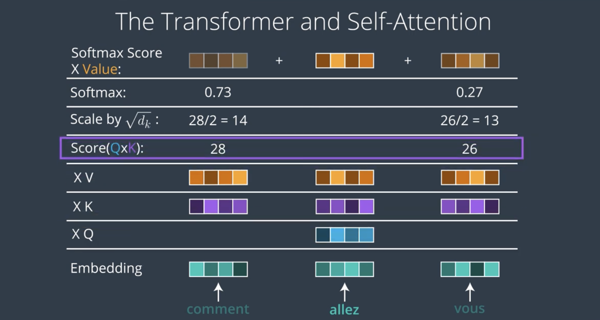
<p>figure: Self-Attention Mechanism</p>
</div>

**The Core Intuition: Direct Connections**

At its heart, self-attention addresses a fundamental question: "How can we allow each word in a sentence to 'see' and
draw information from all other words directly?"

Traditional approaches had limitations:

- Recurrent networks passed information sequentially, causing distant words to lose connection
- Convolutional networks only looked at fixed-size local neighborhoods

Self-attention creates direct pathways between any two positions in a sequence, regardless of how far apart they are.
This is like giving each word in a sentence the ability to directly ask for information from any other word, without
intermediaries.

**Key, Query, and Value: The Information Retrieval Metaphor**

Self-attention implements this direct connection using a metaphor borrowed from information retrieval systems. When you
search in a database, you provide a query that gets matched against keys to retrieve values. Self-attention adapts this
concept to neural networks in a brilliant way.

For each position in the input sequence:

1. **Query (Q)**: Think of this as a "question" that the position asks to find relevant information from other
   positions. It represents what the position is looking for.
2. **Key (K)**: This serves as an "identifier" for each position, indicating what type of information it contains. Keys
   are matched against queries to determine relevance.
3. **Value (V)**: This contains the actual information or content that will be aggregated based on the query-key
   matching. Values represent what a position contributes to other positions.

All three—queries, keys, and values—are created by transforming the input embeddings through learned linear projections:

$$
\text{Query} = \text{Input} \times \text{Weight}_Q
$$

$$
\text{Key} = \text{Input} \times \text{Weight}_K
$$

$$
\text{Value} = \text{Input} \times \text{Weight}_V
$$

Where $Weight_Q$, $Weight_K$, and $Weight_V$ are learnable parameter matrices.

**The Attention Calculation: Step by Step**

Let's walk through how self-attention processes a simple sentence like "The cat sat on the mat because it was
comfortable":

**Step 1: Create Queries, Keys, and Values** For each word, we create three vectors through learned linear
transformations:

- Query vectors: _What each word is "asking for"_
- Key vectors: _What each word "offers" to others_
- Value vectors: _The information each word holds_

**Step 2: Calculate Attention Scores** For each word's query, we compute how well it matches with every word's key using
dot products. For example, when processing "it":

- The query for "it" is compared with the key for "cat"
- The query for "it" is compared with the key for "sat"
- The query for "it" is compared with the key for "mat"
- And so on, including comparing with its own key

This creates an attention score matrix where each entry represents how much one word should attend to another.

**Step 3: Scale and Apply Softmax** The attention scores are scaled by dividing by √dk (where dk is the dimension of the
key vectors). This scaling prevents the softmax function from ending up in regions with extremely small gradients.

Then, the softmax function is applied to each row of scores, converting them into a probability distribution:

$$
\text{softmax}(x_i) = \frac{e^{x_i}}{\sum_j e^{x_j}}
$$

This ensures that for each word, the attention weights across all other words sum to 1.

**Step 4: Weighted Aggregation** Finally, each word's new representation is computed as a weighted sum of all value
vectors, with weights determined by the attention scores:

$$
\text{Output}_i = \sum_j \text{Attention Weight}_{ij} \times \text{Value}_j
$$

The formula provided shows how the output representation for token $i$ is calculated as a weighted sum of all value
vectors, with the weights being the attention weights. The attention weights come from applying softmax to the scaled
dot products between queries and keys. Expanding this fully:

$$
\text{Output}_i = \sum_j \frac{\exp\left(\frac{(Q_i \cdot K_j^T)}{\sqrt{d_k}}\right)}{\sum_{l=1}^n \exp\left(\frac{(Q_i \cdot K_l^T)}{\sqrt{d_k}}\right)} \times \text{Value}_j
$$

Let's break down each component:

1. $Q_i$ is the query vector for token $i$
2. $K_j^T$ is the transposed key vector for token $j$
3. $Q_i \cdot K_j^T$ is their dot product, representing how much token $i$ should attend to token $j$
4. $\sqrt{d_k}$ is the scaling factor, where $d_k$ is the dimension of the key vectors
5. $\exp(x)$ applies the exponential function to convert scores to positive values
6. The denominator $\sum_{l=1}^n \exp\left(\frac{(Q_i \cdot K_l^T)}{\sqrt{d_k}}\right)$ sums these exponential values
   across all tokens, ensuring the weights sum to 1
7. $\text{Value}_j$ is the value vector for token $j$

In matrix notation for the entire sequence, this becomes:

$$
\text{Attention}(Q, K, V) = \text{softmax}\left(\frac{QK^T}{\sqrt{d_k}}\right)V
$$

Where:

- $Q$ is the matrix of all query vectors
- $K$ is the matrix of all key vectors
- $V$ is the matrix of all value vectors
- The softmax is applied row-wise to ensure each token's attention weights sum to 1

This formula captures the entire self-attention mechanism: calculating similarity scores between tokens, normalizing
them into a probability distribution with softmax, and creating new representations by aggregating value vectors
according to these attention weights.

For our example with "it", if the attention weights are highest for "mat" (0.7) and "cat" (0.2), with small weights for
other words, the output for "it" would primarily combine information from "mat" and "cat", helping the model resolve
that "it" likely refers to "mat" in this context.

The complete self-attention formula is:

$$
\text{Attention}(Q,K,V) = \text{softmax}(\frac{QK^T}{\sqrt{d_k}})V
$$

---

##### Understanding Attention Scores in Transformer Models

Attention scores represent how relevant each word is to every other word in a sentence. The higher the score, the more a
word will "pay attention to" or "draw information from" another word when creating its contextual representation.

###### Example Sentence

Let's use the sentence: "The cat sat on the mat because it was comfortable."

In this sentence, the word "it" is ambiguous - it could refer to either "cat" or "mat". A human would understand "it"
likely refers to "mat" based on context. Let's see how attention helps a Transformer resolve this.

###### Step-by-Step Process

###### Step 1: Create Query, Key, and Value Vectors

First, every word gets transformed into three different vector representations:

- **Query vector (Q)**: What the word is "asking about" or "looking for"
- **Key vector (K)**: What the word "offers" to other words
- **Value vector (V)**: The actual information the word holds

For simplicity, let's imagine these as very small 3-dimensional vectors:

- Word: "it" (what "it" is looking for)

$$
Q_{it} = [0.2, 0.5, 0.1]
$$

- Word: "cat" (what "cat" offers)

$$
K_{cat} = [0.3, 0.2, 0.1]
$$

- Word: "sat" (what "sat" offers)

$$
K_{sat} = [0.1, 0.3, 0.2]
$$

- Word: "mat" (what "mat" offers)

$$
K_{mat} = [0.2, 0.6, 0.1]
$$

###### Step 2: Calculate Attention Scores

Now we calculate how well the query from "it" matches with each word's key using dot products:

**For "it" and "cat":**

$$
\begin{align}
Q_{it} \cdot K_{cat} &= (0.2 \times 0.3) + (0.5 \times 0.2) + (0.1 \times 0.1) \\
&= 0.06 + 0.10 + 0.01 \\
&= 0.17
\end{align}
$$

**For "it" and "sat":**

$$
\begin{align}
Q_{it} \cdot K_{sat} &= (0.2 \times 0.1) + (0.5 \times 0.3) + (0.1 \times 0.2) \\
&= 0.02 + 0.15 + 0.02 \\
&= 0.19
\end{align}
$$

**For "it" and "mat":**

$$
\begin{align}
Q_{it} \cdot K_{mat} &= (0.2 \times 0.2) + (0.5 \times 0.6) + (0.1 \times 0.1) \\
&= 0.04 + 0.30 + 0.01 \\
&= 0.35
\end{align}
$$

**For "it" and itself:**

$$
\begin{align}
Q_{it} \cdot K_{it} &= (0.2 \times 0.2) + (0.5 \times 0.5) + (0.1 \times 0.1) \\
&= 0.04 + 0.25 + 0.01 \\
&= 0.30
\end{align}
$$

We do this for every pair of words in the sentence, creating a complete attention score matrix. For our example (limited
to just these 4 words), the matrix would look like:

|      | "cat" | "sat" | "mat" | "it" |
| ---- | ----- | ----- | ----- | ---- |
| "it" | 0.17  | 0.19  | 0.35  | 0.30 |

###### Step 3: Scale and Apply Softmax

Next, we scale these scores by dividing by $\sqrt{d_k}$ (where $d_k$ is the dimension of the key vectors, 3 in our
example) to prevent the softmax function from having extremely small gradients:

$$
\text{Scaled Scores} = [0.17, 0.19, 0.35, 0.30] / \sqrt{3} \approx [0.10, 0.11, 0.20, 0.17]
$$

Then we apply the softmax function to convert these scores into a probability distribution (ensuring they sum to 1):

$$
\text{Softmax}([0.10, 0.11, 0.20, 0.17]) \approx [0.22, 0.23, 0.31, 0.24]
$$

###### Step 4: Weight the Values

Finally, the attention weights are used to create a weighted sum of the value vectors. If we assume value vectors as:

$$
\begin{align}
&V_{cat} = [0.7, 0.2, 0.1] \\ \\
&V_{sat} = [0.4, 0.5, 0.1] \\ \\
&V_{mat} = [0.1, 0.8, 0.1] \\ \\
&V_{it} = [0.3, 0.4, 0.3] \\
\end{align}
$$

The weighted sum would be:

$$
\begin{align}
\text{Weighted sum} &= (0.22 \times V_{cat}) + (0.23 \times V_{sat}) + (0.31 \times V_{mat}) + (0.24 \times V_{it}) \\ \\
&= (0.22 \times [0.7, 0.2, 0.1]) + (0.23 \times [0.4, 0.5, 0.1]) + (0.31 \times [0.1, 0.8, 0.1]) + (0.24 \times [0.3, 0.4, 0.3]) \\ \\
&= [0.154, 0.044, 0.022] + [0.092, 0.115, 0.023] + [0.031, 0.248, 0.031] + [0.072, 0.096, 0.072] \\ \\
&= [0.349, 0.503, 0.148]
\end{align}
$$

This final vector [0.349, 0.503, 0.148] becomes the new representation for "it" after considering all words in the
sentence.

###### What This Means in Practice

Notice how "mat" received the highest attention weight (0.31) from "it". This indicates the model has learned that "mat"
is more relevant for understanding "it" in this context. This is how the model can resolve ambiguity - it's essentially
figuring out that "it" most likely refers to "mat" rather than "cat" or other words.

In a real Transformer model:

1. The vectors would be much larger (typically 64 dimensions per attention head)
2. There would be multiple attention heads running in parallel
3. This process would happen for every word in the sentence

The beauty of this mechanism is that it allows words to gather information from all other words based on learned
relevance, without being limited by distance or position in the sentence.

###### Understanding Query and Key Vectors in Transformer Models

In the example, we created simplified vectors to demonstrate the concept, but let me explain where these vectors
actually come from and what they represent in a real Transformer model.

###### Where These Values Come From

In a real Transformer, the query, key, and value vectors are not arbitrary numbers - they're created through learned
transformations of the word embeddings.

Here's the actual process:

1. **Initial Word Embeddings**: First, each word is converted into an embedding vector (typically 512 or 768 dimensions)
   that represents its meaning.
2. **Linear Transformations**: These embedding vectors are then multiplied by learned weight matrices to produce the
   query, key, and value vectors:
    - $Q = \text{Embedding} \times W^Q$
    - $K = \text{Embedding} \times W^K$
    - $V = \text{Embedding} \times W^V$
3. **Training Process**: During training, the model learns the optimal values for these weight matrices ($W^Q$, $W^K$,
   $W^V$) through backpropagation, adjusting them to minimize the overall loss.

In my example, the vectors $[0.2, 0.5, 0.1]$, $[0.3, 0.2, 0.1]$, etc., represent what these vectors might look like
after these transformations (though greatly simplified for clarity).

###### What These Vectors Mean

These vectors have learned to encode specific types of information:

###### Query Vectors (Q)

The query vector represents what a word "needs to know" or "is looking for" from other words. It encodes the aspects of
meaning that this word needs to clarify or complete its representation.

For "it" in our example, $Q_{it} = [0.2, 0.5, 0.1]$ might encode that this pronoun needs information about:

- Which entity it refers to
- What properties that entity has
- How it relates to the rest of the sentence

The specific numbers aren't directly interpretable by humans - they're distributed representations in a high-dimensional
space that the model learns to use effectively.

###### Key Vectors (K)

The key vector represents what information a word "offers" to other words. It's like an address or identifier that helps
other words find it when they need specific types of information.

For "mat" in our example, $K_{mat} = [0.2, 0.6, 0.1]$ might encode:

- That it's a physical object
- That it has properties like being on the floor
- That it might be something that can be comfortable

Again, these numerical values form patterns that the model learns to utilize, even though we can't easily interpret
individual dimensions.

###### The Matching Process

When we compute the dot product between a query and a key, we're essentially measuring how well what one word is
"looking for" matches what another word "offers."

High dot products indicate strong relevance. In our example:

- $Q_{it} \cdot K_{mat} = 0.35$ (highest)
- $Q_{it} \cdot K_{cat} = 0.17$ (lowest)

This suggests the model has learned to encode queries and keys such that, in a sentence like "The cat sat on the mat
because it was comfortable," the pronoun "it" is looking for something that the representation of "mat" offers (likely
because "comfortable" typically describes the mat rather than the cat in this context).

###### Visualizing the Concept

Think of queries and keys like a lock-and-key system:

- Each word has a unique "lock" (query) that represents what information it needs
- Each word also has a unique "key" that represents what information it provides
- The better a word's key fits another word's lock, the more attention is paid

The beauty of Transformer models is that these representations aren't hand-designed - they're learned from data. The
model discovers which patterns of attention are most useful for predicting the next word (in language modeling) or
understanding the relationships between words (in tasks like translation or comprehension).

Through massive amounts of training data, Transformers learn to encode subtle linguistic patterns into these query and
key representations, allowing them to capture semantic relationships, syntactic structure, and even world knowledge.

**Visualizing Attention: Information Flow**

To understand how self-attention works in practice, let's visualize the attention patterns that might emerge in our
example sentence.

When processing the word "it":

- Strong attention to "mat" (likely the referent in this context)
- Moderate attention to "cat" (another possible referent)
- Some attention to "because" (helping to establish the relationship)
- Minimal attention to function words like "the" and "on"

These attention patterns create a network of connections across the sentence, with stronger connections representing
more important relationships. The beauty of self-attention is that these relationships aren't pre-defined—they're
learned during training based on what's most useful for the task.

**Multi-Head Attention: Multiple Perspectives**

In practice, Transformers use multi-head attention, which runs multiple self-attention operations in parallel. Each
"head" has its own set of learned query, key, and value projections, allowing it to focus on different types of
relationships:

- One head might focus on syntactic relationships (subject-verb agreement)
- Another might track pronoun references
- A third might attend to semantic relationships between related concepts

For example, when processing "comfortable" in our sentence "The cat sat on the mat because it was comfortable":

- One attention head might focus strongly on "it" and "was" (grammatical structure)
- Another might focus on "mat" (the thing that is comfortable)
- A third might connect to "because" (the logical structure)

The outputs from all heads are concatenated and linearly transformed to produce the final output. This multi-perspective
approach gives Transformers remarkable flexibility in how they model relationships in the data.

###### Multi-Head Attention: Multiple Perspectives with Numerical Example

Let me explain multi-head attention with a concrete numerical example using our sentence "The cat sat on the mat because
it was comfortable."

###### Mathematical Foundation of Multi-Head Attention

Multi-head attention runs $h$ parallel attention operations, each with different learned parameters:

$$
\text{MultiHead}(\mathbf{Q}, \mathbf{K}, \mathbf{V}) = \text{Concat}(\text{head}_1, \text{head}_2, ..., \text{head}_h)\mathbf{W}^O
$$

Where each head is computed as:

$$
\text{head}_i = \text{Attention}(\mathbf{Q}\mathbf{W}_i^Q, \mathbf{K}\mathbf{W}_i^K, \mathbf{V}\mathbf{W}_i^V)
$$

###### Yes, Exactly! We Get h Attention Heads and Concatenate Them

You've understood it perfectly! Let me break this down step by step to confirm your understanding.

###### The Multi-Head Process

**Step 1: Create h Parallel Attention Heads**

For $h = 8$ heads, we simultaneously compute:

$$
\text{head}_1 = \text{Attention}(\mathbf{Q}\mathbf{W}_1^Q, \mathbf{K}\mathbf{W}_1^K, \mathbf{V}\mathbf{W}_1^V)
$$

$$
\text{head}_2 = \text{Attention}(\mathbf{Q}\mathbf{W}_2^Q, \mathbf{K}\mathbf{W}_2^K, \mathbf{V}\mathbf{W}_2^V)
$$

$$
\text{head}_3 = \text{Attention}(\mathbf{Q}\mathbf{W}_3^Q, \mathbf{K}\mathbf{W}_3^K, \mathbf{V}\mathbf{W}_3^V)
$$

$$
\vdots
$$

$$
\text{head}_8 = \text{Attention}(\mathbf{Q}\mathbf{W}_8^Q, \mathbf{K}\mathbf{W}_8^K, \mathbf{V}\mathbf{W}_8^V)
$$

**Step 2: Each Head Produces Output**

Each head outputs a matrix with shape $[n \times d_v]$ where:

- $n = 10$ (sequence length)
- $d_v = 64$ (dimension per head)

So each head gives us:

$$
\text{head}_i \in \mathbb{R}^{10 \times 64}
$$

###### The Concatenation Process

**Step 3: Concatenate Along the Feature Dimension**

$$
\text{Concat}(\text{head}_1, \text{head}_2, ..., \text{head}_8) = [\text{head}_1 \mid \text{head}_2 \mid ... \mid \text{head}_8]
$$

This creates a matrix of shape:

$$
\text{Concatenated Output} \in \mathbb{R}^{10 \times 512}
$$

Where $512 = 8 \times 64$ (8 heads × 64 dimensions per head).

###### Numerical Example of Concatenation

For word "comfortable" at position 10:

**Individual Head Outputs:**

$$
\text{head}_1[\text{comfortable}] = [0.2, 0.5, 0.1, ..., 0.3] \in \mathbb{R}^{64}
$$

$$
\text{head}_2[\text{comfortable}] = [0.8, 0.1, 0.4, ..., 0.2] \in \mathbb{R}^{64}
$$

$$
\text{head}_3[\text{comfortable}] = [0.1, 0.7, 0.2, ..., 0.6] \in \mathbb{R}^{64}
$$

$$
\vdots
$$

$$
\text{head}_8[\text{comfortable}] = [0.4, 0.3, 0.8, ..., 0.1] \in \mathbb{R}^{64}
$$

**After Concatenation:**

$$
\text{Concat}[\text{comfortable}] = [0.2, 0.5, ..., 0.3, 0.8, 0.1, ..., 0.2, 0.1, 0.7, ..., 0.6, ..., 0.4, 0.3, ..., 0.1]
$$

This gives us a 512-dimensional vector containing information from all 8 attention perspectives.

###### Final Linear Transformation

**Step 4: Apply Output Projection**

$$
\text{MultiHead Output} = \text{Concat} \times \mathbf{W}^O
$$

Where $\mathbf{W}^O \in \mathbb{R}^{512 \times 512}$ learns how to combine the information from all heads.

###### Visual Representation

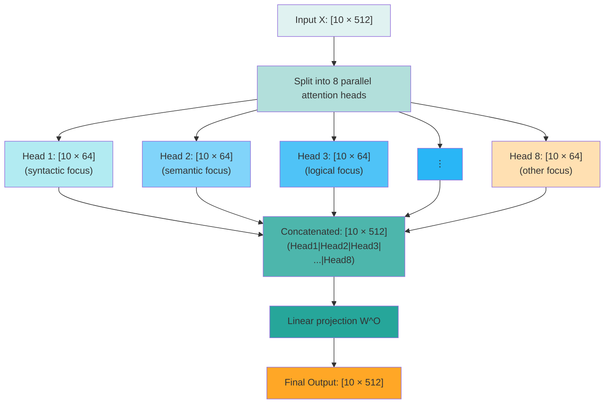

###### Why This Works So Well

1. **Parallel Processing**: All 8 heads compute simultaneously
2. **Specialization**: Each head learns different types of relationships
3. **Rich Representation**: The concatenated output contains multiple perspectives
4. **Learned Combination**: The final projection $\mathbf{W}^O$ learns optimal ways to blend the head outputs

So yes, you're absolutely correct! We compute $h$ attention heads in parallel, each focusing on different aspects of the
relationships, and then concatenate their outputs to create a rich, multi-faceted representation of each word's context.

###### Setup for Numerical Example

Let's use a simplified example with:

- **Sentence length**: 10 words
- **Embedding dimension**: 512
- **Number of heads**: 8
- **Dimension per head**: $d_k = d_v = \frac{512}{8} = 64$

Our sentence tokens:

$$
\text{Tokens} = [\text{The}, \text{cat}, \text{sat}, \text{on}, \text{the}, \text{mat}, \text{because}, \text{it}, \text{was}, \text{comfortable}]
$$

###### Weight Matrices for Each Head

Each head has its own learned parameters:

**Head 1 (Syntactic Focus):**

$$
\mathbf{W}_1^Q \in \mathbb{R}^{512 \times 64}, \quad \mathbf{W}_1^K \in \mathbb{R}^{512 \times 64}, \quad \mathbf{W}_1^V \in \mathbb{R}^{512 \times 64}
$$

**Head 2 (Semantic Focus):**

$$
\mathbf{W}_2^Q \in \mathbb{R}^{512 \times 64}, \quad \mathbf{W}_2^K \in \mathbb{R}^{512 \times 64}, \quad \mathbf{W}_2^V \in \mathbb{R}^{512 \times 64}
$$

**Head 3 (Logical Structure Focus):**

$$
\mathbf{W}_3^Q \in \mathbb{R}^{512 \times 64}, \quad \mathbf{W}_3^K \in \mathbb{R}^{512 \times 64}, \quad \mathbf{W}_3^V \in \mathbb{R}^{512 \times 64}
$$

###### Attention Computation for "comfortable"

Let's focus on how the word "comfortable" (position 10) attends to other words across different heads.

###### Head 1: Syntactic Relationships

This head learns to focus on grammatical structure. The attention weights for "comfortable" might be:

$$
\text{Attention}_{\text{comfortable}}^{\text{Head 1}} = [0.05, 0.05, 0.05, 0.05, 0.05, 0.05, 0.05, 0.15, 0.45, 0.05]
$$

**Interpretation:**

- High attention to **"was"** (0.45): Grammatical connection between auxiliary verb and adjective
- Moderate attention to **"it"** (0.15): Subject-predicate relationship
- Low attention to content words: This head ignores semantic meaning

**Mathematical computation:**

$$
\begin{align}
&\mathbf{q}_{\text{comfortable}}^{(1)} = \mathbf{x}_{\text{comfortable}} \mathbf{W}_1^Q \\
&\text{scores}^{(1)} = \mathbf{q}_{\text{comfortable}}^{(1)} \cdot [\mathbf{k}_1^{(1)}, \mathbf{k}_2^{(1)}, ..., \mathbf{k}_{10}^{(1)}]^T
\end{align}
$$

Where the keys $\mathbf{k}_i^{(1)} = \mathbf{x}_i \mathbf{W}_1^K$ are learned to represent grammatical roles.

###### Head 2: Semantic Relationships

This head learns to focus on meaning and entities:

$$
\text{Attention}_{\text{comfortable}}^{\text{Head 2}} = [0.02, 0.08, 0.03, 0.05, 0.02, 0.65, 0.03, 0.07, 0.03, 0.02]
$$

**Interpretation:**

- High attention to **"mat"** (0.65): The thing that is comfortable
- Some attention to **"cat"** (0.08) and **"it"** (0.07): Understanding what/who is experiencing comfort
- Low attention to function words: This head ignores grammatical structure

###### Head 3: Logical Structure

This head learns to track logical connectives and causal relationships:

$$
\text{Attention}_{\text{comfortable}}^{\text{Head 3}} = [0.05, 0.10, 0.08, 0.06, 0.05, 0.15, 0.40, 0.08, 0.02, 0.01]
$$

**Interpretation:**

- High attention to **"because"** (0.40): Causal reasoning connection
- Moderate attention to **"mat"** (0.15): The object in the causal relationship
- Some attention to **"cat"** (0.10): The agent in the logical structure

###### Computing Individual Head Outputs

For each head $i$, the output for "comfortable" is:

$$
\mathbf{h}_{\text{comfortable}}^{(i)} = \sum_{j=1}^{10} \alpha_{10,j}^{(i)} \mathbf{v}_j^{(i)}
$$

Where $\alpha_{10,j}^{(i)}$ are the attention weights and $\mathbf{v}_j^{(i)} = \mathbf{x}_j \mathbf{W}_i^V$.

###### Numerical Example of Value Aggregation

Let's say the value vectors for key words are (simplified to 3 dimensions):

$$
\mathbf{v}_{\text{mat}}^{(2)} = [0.8, 0.3, 0.1], \quad \mathbf{v}_{\text{was}}^{(1)} = [0.2, 0.9, 0.4], \quad \mathbf{v}_{\text{because}}^{(3)} = [0.1, 0.2, 0.7]
$$

**Head 1 output** (focuses on "was" with weight 0.45):

$$
\mathbf{h}_{\text{comfortable}}^{(1)} = 0.45 \times [0.2, 0.9, 0.4] + \text{other terms} = [0.09, 0.405, 0.18] + ...
$$

**Head 2 output** (focuses on "mat" with weight 0.65):

$$
\mathbf{h}_{\text{comfortable}}^{(2)} = 0.65 \times [0.8, 0.3, 0.1] + \text{other terms} = [0.52, 0.195, 0.065] + ...
$$

**Head 3 output** (focuses on "because" with weight 0.40):

$$
\mathbf{h}_{\text{comfortable}}^{(3)} = 0.40 \times [0.1, 0.2, 0.7] + \text{other terms} = [0.04, 0.08, 0.28] + ...
$$

###### Concatenation and Final Output

The outputs from all heads are concatenated:

$$
\text{Concat} = [\mathbf{h}_{\text{comfortable}}^{(1)}, \mathbf{h}_{\text{comfortable}}^{(2)}, ..., \mathbf{h}_{\text{comfortable}}^{(8)}] \in \mathbb{R}^{1 \times 512}
$$

This gives us a 512-dimensional vector (8 heads × 64 dimensions each).

Finally, a learned output projection combines all perspectives:

$$
\mathbf{h}_{\text{comfortable}}^{\text{final}} = \text{Concat} \times \mathbf{W}^O + \mathbf{b}^O
$$

Where $\mathbf{W}^O \in \mathbb{R}^{512 \times 512}$.

###### The Power of Multiple Perspectives

The final representation of "comfortable" now contains:

1. **Grammatical information** from Head 1: It's an adjective modifying the subject via "was"
2. **Semantic information** from Head 2: It describes the "mat"
3. **Logical information** from Head 3: It's the result in a causal relationship

**Mathematical combination:**

$$
\mathbf{h}_{\text{comfortable}}^{\text{final}} = \alpha_1 \mathbf{h}_{\text{syntactic}} + \alpha_2 \mathbf{h}_{\text{semantic}} + \alpha_3 \mathbf{h}_{\text{logical}} + ...
$$

Where the $\alpha_i$ values are learned through the output projection $\mathbf{W}^O$.

###### Attention Weight Comparison Table

| Word        | Head 1 (Syntactic) | Head 2 (Semantic) | Head 3 (Logical) |
| ----------- | ------------------ | ----------------- | ---------------- |
| The         | 0.05               | 0.02              | 0.05             |
| cat         | 0.05               | 0.08              | 0.10             |
| sat         | 0.05               | 0.03              | 0.08             |
| on          | 0.05               | 0.05              | 0.06             |
| the         | 0.05               | 0.02              | 0.05             |
| mat         | 0.05               | **0.65**          | 0.15             |
| because     | 0.05               | 0.03              | **0.40**         |
| it          | 0.15               | 0.07              | 0.08             |
| was         | **0.45**           | 0.03              | 0.02             |
| comfortable | 0.05               | 0.02              | 0.01             |

This table shows how each head specializes in different types of relationships, creating a rich, multi-faceted
understanding of the word "comfortable" in context.

The beauty of multi-head attention is that these different perspectives are learned automatically during training,
allowing the model to capture the complex, multi-layered nature of language understanding.

**Practical Advantages of Self-Attention**

Self-attention provides several key advantages:

1. **Long-range dependency modeling**: Direct connections between any two positions allow the model to capture
   dependencies regardless of distance. This helps with tasks like coreference resolution and long-range syntactic
   dependencies.
2. **Parallelization**: All positions can be processed simultaneously, enabling efficient training on modern hardware.
3. **Interpretability**: The attention weights provide some insight into which parts of the input the model is focusing
   on, adding a degree of explainability.
4. **Variable-length handling**: Self-attention naturally accommodates variable-length sequences, as each position
   attends to all others regardless of sequence length.

These advantages have made self-attention the foundation for state-of-the-art models across numerous domains, from
natural language processing to computer vision and beyond. By enabling direct interactions between all elements in a
sequence, self-attention has fundamentally changed how neural networks can model and understand sequential data.

---

##### Architecture Overview

The Transformer architecture represents a masterful integration of several innovative components, creating a cohesive
design that balances expressiveness, computational efficiency, and trainability. Understanding this architecture
provides insight into how Transformers achieve their remarkable performance across various tasks.

##### **The Big Picture: Encoder-Decoder Framework**

At the highest level, the original Transformer follows an encoder-decoder structure that was common in
sequence-to-sequence models. However, it's important to note that many modern variants use only the encoder (like BERT)
or only the decoder (like GPT).

This modular design allows flexibility in applying Transformers to different types of tasks:

- Encoder-only models excel at understanding tasks (classification, entity recognition)
- Decoder-only models specialize in generation tasks (text generation, completion)
- Encoder-decoder models handle transformation tasks (translation, summarization)

Let's explore each major component and how they work together.

##### **The Encoder Stack: Creating Rich Representations**

The encoder's job is to process the input sequence and create contextual representations that capture the relationships
between elements. It consists of N identical layers (typically 6 in the original paper), each containing two main
sub-layers:

1. **Multi-Head Self-Attention Layer**: This is where each position attends to all positions in the previous layer,
   gathering contextual information. The multi-head mechanism allows different "heads" to focus on different types of
   relationships simultaneously.

2. **Position-wise Feed-Forward Network**: After attention gathers information across positions, this fully connected
   network processes each position independently. It consists of two linear transformations with a ReLU activation in
   between:

    $$
          \text{FFN}(x) = \max(0, xW_1 + b_1)W_2 + b_2
    $$

    The inner dimension of this network is typically much larger than the model dimension (often 4x larger), giving the
    model significant capacity to transform the representations at each position.

Each sub-layer is wrapped with a residual connection followed by layer normalization. This "Add & Norm" structure helps
with gradient flow during training and stabilizes the learning process.

---

##### Why Do We Need the Feed-Forward Network?

Think of the Transformer as having two main jobs when processing language:

###### Job 1: Attention - "Looking Around"

The attention mechanism is like **looking around** the sentence to gather information. When processing the word "cat",
attention looks at all other words and says:

- "Oh, this cat is doing something - let me look at 'sat'"
- "What is it sitting on? - let me look at 'mat'"
- "Who does 'it' refer to later? - probably this cat"

After attention, the word "cat" now has a rich understanding of its context - it knows what it's doing, where it is, and
how it relates to other words.

###### Job 2: Feed-Forward Network - "Thinking Deeply"

But just gathering information isn't enough. Now the model needs to **think deeply** about what this information means.

The Feed-Forward Network is like a **thinking processor** for each word individually. It takes all the contextual
information that attention gathered and says:

- "Given that this cat is sitting, and it's on a mat, and the mat is comfortable..."
- "This probably means the cat is resting"
- "The cat is likely the subject of the sentence"
- "This is probably a peaceful, domestic scene"

###### A Simple Analogy

Imagine you're reading a book:

**Attention = Your Eyes**

- Your eyes scan across the page, looking at all the words
- They gather visual information about what's written

**Feed-Forward Network = Your Brain**

- Your brain takes what your eyes saw and actually **understands** it
- It processes the meaning, makes connections, draws conclusions

###### Why Can't Attention Do Everything?

Attention is great at **connecting** words, but it's not great at **complex reasoning** about what those connections
mean.

For example:

- Attention can connect "cat" and "comfortable"
- But the Feed-Forward Network figures out "this suggests the cat is content and relaxed"

###### The "Thinking Space"

The Feed-Forward Network creates a much larger "thinking space" (4× bigger) where it can:

1. **Break down** the contextual information into many different aspects
2. **Analyze** each aspect separately (that's what the ReLU does - it focuses on the most important aspects)
3. **Combine** all the analysis back into a final understanding

###### Real Example

After attention, "cat" knows:

- "I'm connected to 'sat', 'mat', and 'comfortable'"

After Feed-Forward Network, "cat" understands:

- "I'm a domestic animal in a resting state, positioned on a comfortable surface, likely content"

**In essence: Attention gathers the facts, Feed-Forward Network understands what those facts mean.**

Without the Feed-Forward Network, Transformers would just be very good at connecting words but terrible at actually
understanding language. It's the "thinking" component that turns connections into comprehension.

---

##### Position-wise Feed-Forward Network: Detailed Explanation with Numerical Example

The Position-wise Feed-Forward Network (FFN) is a crucial component that processes each position independently after the
attention mechanism has gathered cross-position information.

###### Mathematical Foundation

The FFN applies the same transformation to each position in the sequence:

$$
\text{FFN}(x) = \max(0, x\mathbf{W}_1 + \mathbf{b}_1)\mathbf{W}_2 + \mathbf{b}_2
$$

Where:

- $x \in \mathbb{R}^{d_{\text{model}}}$ is the input vector for one position
- $\mathbf{W}_1 \in \mathbb{R}^{d_{\text{model}} \times d_{ff}}$ is the first weight matrix
- $\mathbf{b}_1 \in \mathbb{R}^{d_{ff}}$ is the first bias vector
- $\mathbf{W}_2 \in \mathbb{R}^{d_{ff} \times d_{\text{model}}}$ is the second weight matrix
- $\mathbf{b}_2 \in \mathbb{R}^{d_{\text{model}}}$ is the second bias vector
- $d_{ff} = 4 \times d_{\text{model}}$ typically (the expansion factor)

###### Numerical Example Setup

Let's use realistic Transformer dimensions:

- **Model dimension**: $d_{\text{model}} = 512$
- **Feed-forward dimension**: $d_{ff} = 2048$ (4× expansion)
- **Sentence**: "The cat sat on the mat"
- **Focus position**: "cat" after multi-head attention

###### Step-by-Step Computation

###### Input Vector After Attention

After multi-head attention and residual connection, suppose the vector for "cat" is:

$$
\mathbf{x}_{\text{cat}} = [0.2, -0.1, 0.5, 0.3, -0.4, 0.1, ..., 0.7] \in \mathbb{R}^{512}
$$

This contains rich contextual information about "cat" gathered from all other words in the sentence.

###### Step 1: First Linear Transformation + ReLU

**First Linear Layer:**

$$
\mathbf{h}_1 = \mathbf{x}_{\text{cat}} \mathbf{W}_1 + \mathbf{b}_1
$$

Let's work with simplified dimensions for clarity. Suppose:

- $\mathbf{x}_{\text{cat}} = [0.2, -0.1, 0.5, 0.3] \in \mathbb{R}^{4}$ (simplified from 512)
- $d_{ff} = 16$ (simplified from 2048, still 4× expansion)

**Weight Matrix $\mathbf{W}_1$:**

$$
\mathbf{W}_1 = \begin{bmatrix}
0.1 & 0.2 & -0.1 & 0.3 & ... & 0.4 \\
-0.2 & 0.1 & 0.4 & -0.1 & ... & 0.2 \\
0.3 & -0.3 & 0.2 & 0.5 & ... & -0.1 \\
0.4 & 0.1 & -0.2 & 0.3 & ... & 0.3
\end{bmatrix} \in \mathbb{R}^{4 \times 16}
$$

**Bias Vector $\mathbf{b}_1$:**

$$
\mathbf{b}_1 = [0.1, -0.05, 0.2, 0.15, ..., 0.1] \in \mathbb{R}^{16}
$$

**Computation:**

$$
\mathbf{h}_1 = [0.2, -0.1, 0.5, 0.3] \times \mathbf{W}_1 + \mathbf{b}_1
$$

**Element-wise calculation for first few dimensions:**

$$
\begin{align}
h_{1,1} &= 0.2 \times 0.1 + (-0.1) \times (-0.2) + 0.5 \times 0.3 + 0.3 \times 0.4 + 0.1 = 0.39 \\ \\
h_{1,2} &= 0.2 \times 0.2 + (-0.1) \times 0.1 + 0.5 \times (-0.3) + 0.3 \times 0.1 + (-0.05) = -0.095 \\ \\
h_{1,3} &= 0.2 \times (-0.1) + (-0.1) \times 0.4 + 0.5 \times 0.2 + 0.3 \times (-0.2) + 0.2 = 0.18
\end{align}
$$

So after the first transformation:

$$
\mathbf{h}_1 = [0.39, -0.095, 0.18, 0.42, ..., 0.31] \in \mathbb{R}^{16}
$$

###### Step 2: ReLU Activation

Apply ReLU activation element-wise:

$$
\begin{align}
&\text{ReLU}(\mathbf{h}_1) = \max(0, \mathbf{h}_1) \\ \\
&\mathbf{h}_{\text{relu}} = [\max(0, 0.39), \max(0, -0.095), \max(0, 0.18), \max(0, 0.42), ..., \max(0, 0.31)] \\ \\
&\mathbf{h}_{\text{relu}} = [0.39, 0, 0.18, 0.42, ..., 0.31] \in \mathbb{R}^{16}
\end{align}
$$

**Key Effect of ReLU:**

- Positive values pass through unchanged
- Negative values become zero
- This introduces non-linearity and sparsity

###### Step 3: Second Linear Transformation

**Second Linear Layer:**

$$
\begin{align}
&\mathbf{h}_2 = \mathbf{h}_{\text{relu}} \mathbf{W}_2 + \mathbf{b}_2 \\ \\
&\mathbf{W}_2 = \begin{bmatrix}
0.2 & -0.1 & 0.3 & 0.1 \\
0.1 & 0.4 & -0.2 & 0.2 \\
-0.3 & 0.2 & 0.1 & -0.1 \\
0.4 & 0.1 & 0.3 & 0.2 \\
\vdots & \vdots & \vdots & \vdots \\
0.2 & -0.1 & 0.1 & 0.3
\end{bmatrix} \in \mathbb{R}^{16 \times 4}
\end{align}
$$

**Bias Vector $\mathbf{b}_2$:**

$$
\mathbf{b}_2 = [0.05, -0.02, 0.1, 0.03] \in \mathbb{R}^{4}
$$

**Final computation:**

$$
\mathbf{h}_2 = [0.39, 0, 0.18, 0.42, ..., 0.31] \times \mathbf{W}_2 + [0.05, -0.02, 0.1, 0.03]
$$

**Element-wise calculation:**

$$
\begin{align}
h_{2,1} &= 0.39 \times 0.2 + 0 \times 0.1 + 0.18 \times (-0.3) + 0.42 \times 0.4 + ... + 0.05 = 0.263 \\ \\
h_{2,2} &= 0.39 \times (-0.1) + 0 \times 0.4 + 0.18 \times 0.2 + 0.42 \times 0.1 + ... + (-0.02) = 0.037
\end{align}
$$

Final output:

$$
\text{FFN}(\mathbf{x}_{\text{cat}}) = [0.263, 0.037, 0.418, 0.152] \in \mathbb{R}^{4}
$$

###### Complete Processing for All Positions

The same FFN is applied to every position independently:

$$
\begin{align}
&\text{For position `The'': } \text{FFN}(\mathbf{x}_{\text{The}})\\ \\
&\text{For position `cat'': } \text{FFN}(\mathbf{x}_{\text{cat}}) = [0.263, 0.037, 0.418, 0.152]\\ \\
&\text{For position `sat'': } \text{FFN}(\mathbf{x}_{\text{sat}})\\ \\
&\text{For position `on'': } \text{FFN}(\mathbf{x}_{\text{on}})\\ \\
&\text{For position `the'': } \text{FFN}(\mathbf{x}_{\text{the}})\\ \\
&\text{For position `mat'': } \text{FFN}(\mathbf{x}_{\text{mat}})
\end{align}
$$

###### Matrix Form for Entire Sequence

For the entire sequence, we can process all positions simultaneously:

$$
\mathbf{X}_{\text{input}} = \begin{bmatrix}
\mathbf{x}_{\text{The}} \\
\mathbf{x}_{\text{cat}} \\
\mathbf{x}_{\text{sat}} \\
\mathbf{x}_{\text{on}} \\
\mathbf{x}_{\text{the}} \\
\mathbf{x}_{\text{mat}}
\end{bmatrix} \in \mathbb{R}^{6 \times 4}
$$

$$
\mathbf{X}_{\text{output}} = \max(0, \mathbf{X}_{\text{input}} \mathbf{W}_1 + \mathbf{b}_1) \mathbf{W}_2 + \mathbf{b}_2 \in \mathbb{R}^{6 \times 4}
$$

###### Why the 4× Expansion Matters

###### Representational Capacity

The expansion from 512 → 2048 → 512 dimensions provides:

**Increased Capacity:**

- More parameters: $(512 \times 2048) + (2048 \times 512) = 2,097,152$ parameters
- Richer transformations possible in the expanded space

**Non-linear Processing:**

- The ReLU activation in the expanded space allows complex non-linear transformations
- Each of the 2048 intermediate neurons can specialize in detecting different patterns

###### Intuitive Understanding

Think of the FFN as a position-specific "specialist":

1. **Expansion Phase** ($\mathbf{W}_1$): Projects the representation into a larger space where different aspects can be
   analyzed
2. **Non-linearity** (ReLU): Introduces complexity and selectivity
3. **Compression Phase** ($\mathbf{W}_2$): Combines the analysis back into the original dimension

###### Real-World Analogy

It's like having a team of 2048 specialists analyze each word:

- Specialist 1 might detect "animacy" features
- Specialist 2 might detect "emotional valence"
- Specialist 3 might detect "grammatical role"
- ...and so on

The ReLU activation means only the most relevant specialists "fire" for each word, creating sparse, specialized
representations.

###### Computational Complexity

For a sequence of length $n$ with model dimension $d$:

- **Time complexity**: $O(n \times d \times 4d) = O(4nd^2)$
- **Space complexity**: $O(4nd)$ for intermediate activations

The FFN typically accounts for about 2/3 of a Transformer's parameters, making it a crucial component for the model's
representational power.

---

##### Understanding the Transformer Encoder Architecture

Let me explain the Transformer encoder architecture in clear, visual terms to help you understand how these components
work together.

###### Transformer Encoder Architecture

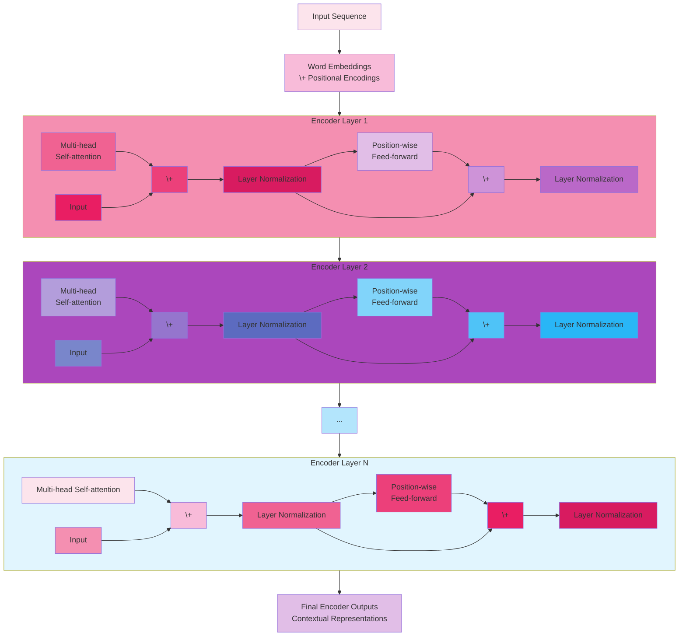

The diagram shows the complete encoder stack with proper residual connections.

###### Detailed Explanation of Each Component

###### 1. Input Preparation

Before entering the encoder stack, each token in your input sequence (like words in a sentence) undergoes two
transformations:

- It's converted to a dense vector through an embedding layer
- Positional encodings are added to provide information about where each token appears in the sequence

This combined representation then enters the first encoder layer.

###### 2. Multi-Head Self-Attention Layer

The self-attention mechanism allows each token to gather information from all other tokens in the sequence. Here's how
it works within each encoder layer:

###### Multi-Head Self-Attention Mechanism Mermaid Diagram

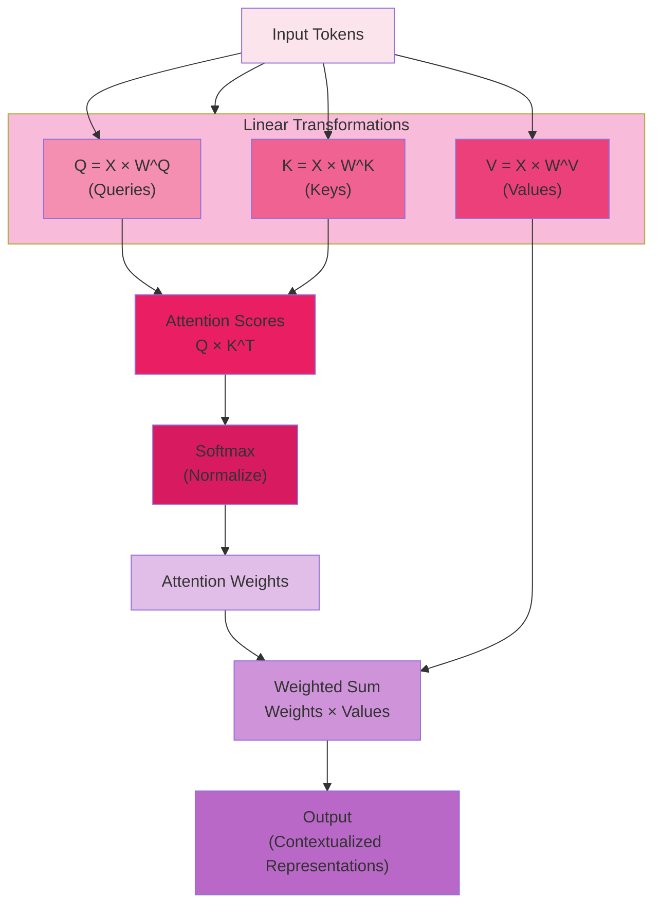

The multi-head part means this process happens in parallel across multiple "attention heads," each with its own set of
learned projections. Each head can focus on different types of relationships:

- One head might focus on syntactic relationships (e.g., adjective-noun connections)
- Another might track subject-verb relationships
- A third might focus on semantic relationships between related concepts

###### 3. Add & Norm (First Residual Connection)

After the self-attention layer, a residual connection adds the original input to the attention output:

###### Residual Connection and Layer Normalization Mermaid Diagram

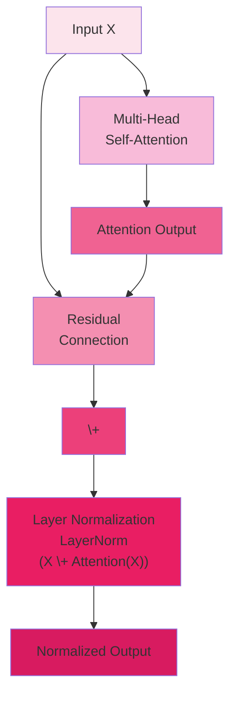

This residual connection helps with gradient flow during backpropagation and preserves information from the original
input. Layer normalization then normalizes the outputs across the feature dimension for more stable training.

###### 4. Position-wise Feed-Forward Network

The next sub-layer is a feed-forward network applied to each position independently:

###### Position-wise Feed-Forward Network Mermaid Diagram

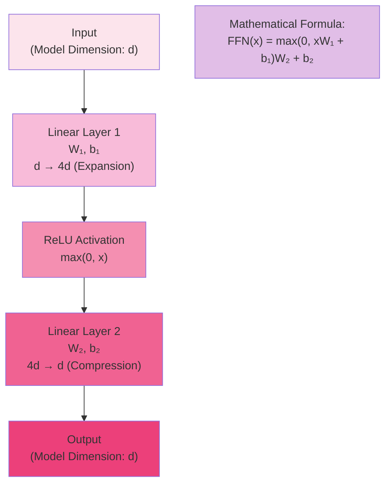

This network allows for more complex transformations of each position's representation. The expanded hidden dimension
(typically 4x larger than the model dimension) provides significant capacity for the model to learn complex patterns.

###### 5. Final Add & Norm (Second Residual Connection)

Just like after the attention layer, another residual connection and layer normalization are applied:

###### Feed-Forward Residual Connection and Layer Normalization Diagram

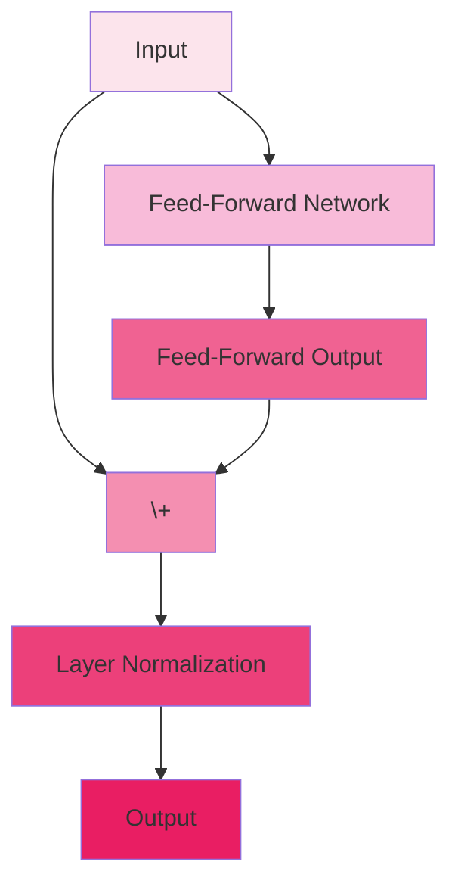

###### 6. Stacking Multiple Layers

The complete process is repeated N times (typically 6 layers in the original paper), with each layer building upon the
representations from the previous layer. As information flows up through the stack, the representations become
increasingly sophisticated:

- Early layers tend to capture more local, syntactic patterns
- Middle layers develop more complex relationships
- Later layers create high-level semantic representations

###### The Complete Flow

Let's trace how information flows through this architecture with a specific example. Imagine processing the sentence
"The cat sat on the mat."

1. **Input Preparation**: Each word is converted to an embedding and positional information is added.
2. **First Encoder Layer**:
    - In the multi-head attention, each word gathers contextual information from all other words. For example, "sat"
      might attend strongly to "cat" (the subject performing the action).
    - The feed-forward network then transforms each word's representation independently.
3. **Subsequent Layers**:
    - As information flows through more layers, the contextual understanding deepens.
    - By the final layer, each word's representation contains rich information about its role in the complete sentence.
4. **Final Output**:
    - The output of the last encoder layer provides contextualized representations for each input token.
    - These representations capture both the meaning of each word and its relationships with other words in the
      sequence.

This architecture's power comes from combining parallel processing (allowing efficient computation) with the attention
mechanism's ability to create direct connections between any positions in the sequence, regardless of their distance.

---

##### **The Decoder Stack: Generating Outputs**

The decoder generates output sequences step by step, using both the encoder's output and its own previously generated
elements. Like the encoder, it consists of $N$ identical layers, but each layer has three sub-layers instead of two:

**1. Masked Multi-Head Self-Attention**: Similar to the encoder's self-attention, but with a critical difference—masking
is applied to prevent positions from attending to future positions. This masking ensures the model can only use
previously generated outputs, which is necessary for autoregressive generation.

**2. Multi-Head Encoder-Decoder Attention**: This layer connects the decoder to the encoder. The queries come from the
decoder's previous layer, while the keys and values come from the encoder's output. This allows each decoder position to
attend to all encoder positions, creating a bridge between the input and output sequences.

**3. Position-wise Feed-Forward Network**: Identical to the one in the encoder.

As in the encoder, each sub-layer employs residual connections and layer normalization.

**Essential Supporting Components**

Several other components complete the architecture:

**1. Input and Output Embeddings**: These learned embeddings convert tokens to vector representations. Interestingly,
the original Transformer shared the same weight matrix between the input embedding, output embedding, and pre-softmax
linear transformation, which helped reduce parameters while maintaining performance.

**2. Positional Encodings**: Since the Transformer contains no recurrence or convolution, it has no inherent sense of
token order. Positional encodings are added to the embeddings to provide information about position:

$$
PE_{(pos,2i)} = \sin\left(\frac{\text{pos}}{10000^{\large \frac{2i}{\text{d}_{\text{model}}}}}\right)
$$

$$
PE_{(pos,2i+1)} = \cos\left(\frac{\text{pos}}{10000^{\large \frac{2i}{\text{d}_{\text{model}}}}}\right)
$$

    These sinusoidal encodings have the useful property that the relative positions can be easily computed from the
    absolute encodings, helping the model understand the relative distances between tokens.

**3. Final Linear and Softmax Layer**: In the decoder, the final output is passed through a linear transformation and
softmax to produce probabilities over the vocabulary for the next token.

###### Understanding the Transformer Decoder Architecture

Let me explain the Transformer decoder architecture in clear, visual terms to help you understand how these components
work together.

###### Transformer Decoder Architecture Diagram

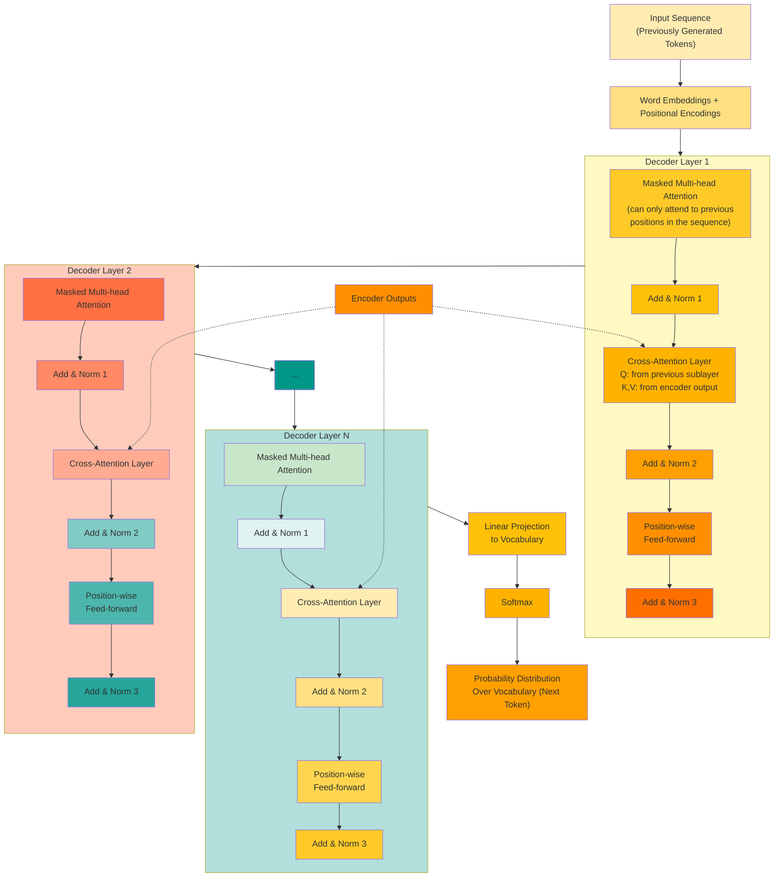

###### Alternative Cleaner Version

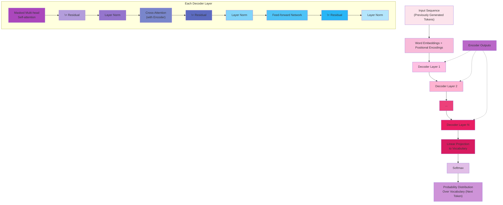

The first diagram shows the complete decoder stack with all layers detailed, while the second provides a cleaner
overview with the encoder outputs feeding into all decoder layers via cross-attention.

###### Detailed Explanation of Each Component

**1. Input Preparation:**

The decoder receives embeddings for the sequence it has generated so far (or during training, the ground truth output
sequence shifted right by one position):

$$
\begin{align}
\text{Generated so far:} &\quad \text{"Le chat"} \\
\text{Input to decoder:} &\quad \text{[START] "Le" "chat"} \\
\text{Next token to predict:} &\quad \text{"est"}
\end{align}
$$

Like the encoder, each token is converted to an embedding and combined with positional encoding before entering the
decoder stack.

**2. Masked Multi-Head Self-Attention:**

The first sub-layer in each decoder layer is similar to the encoder's self-attention, but with a critical difference -
masking:

###### Masked Self-Attention Mechanism Mermaid Diagram

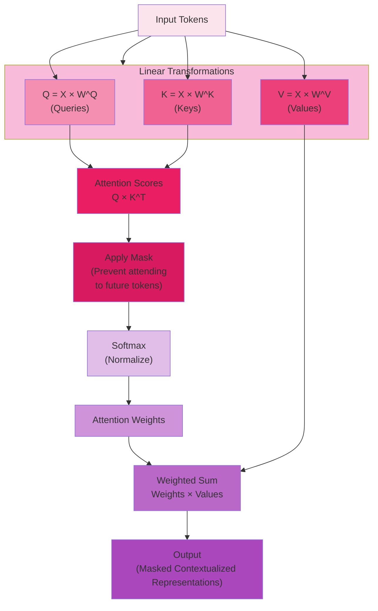

The mask is typically a lower triangular matrix that allows each position to attend only to previous positions and
itself. This ensures the decoder can't "cheat" by looking at future tokens that haven't been generated yet.

**3. Cross-Attention: Connecting to the Encoder**

The second sub-layer is unique to the decoder - it allows the decoder to attend to the entire encoder output:

###### Cross-Attention Mechanism Mermaid Diagram

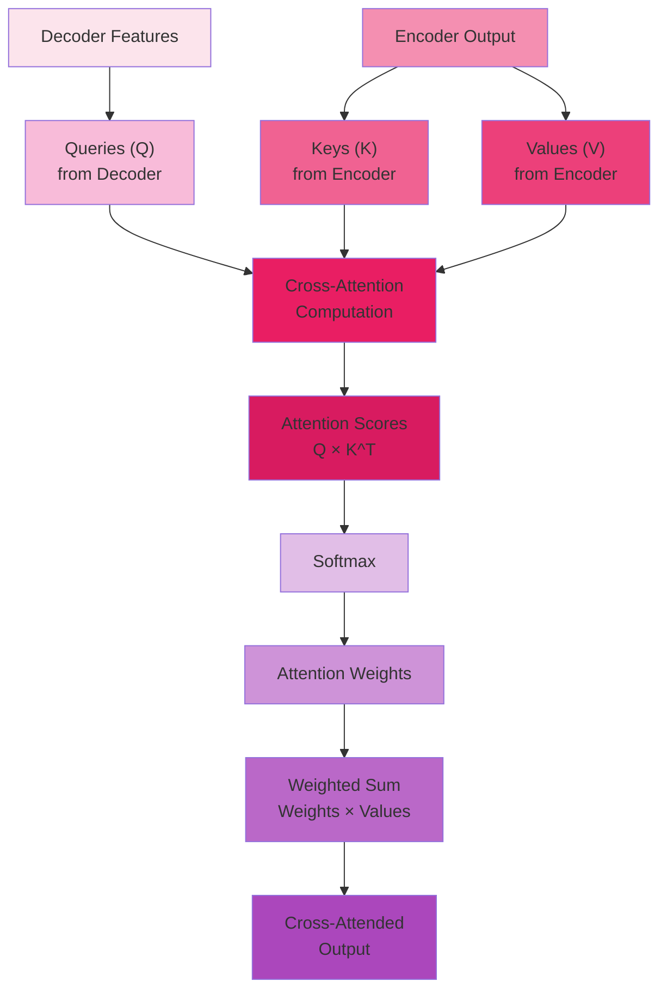

This is where the connection between input and output sequences happens:

- Queries come from the previous decoder sub-layer
- Keys and values come from the encoder's output

For example, when generating a French translation of "The cat sat on the mat," this mechanism allows the decoder to
focus on the encoder's representation of "cat" when generating the French word "chat."

**4. Position-wise Feed-Forward Network:**

The third sub-layer is identical to the feed-forward network in the encoder:

###### Position-wise Feed-Forward Network Mermaid Diagram

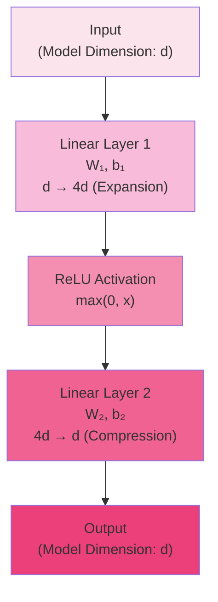

This provides each position with additional transformation capacity to process the information gathered from both
self-attention and cross-attention.

**5. Final Output Layer:**

After the stack of N decoder layers, the output passes through:

###### Decoder Output Projection Mermaid Diagram

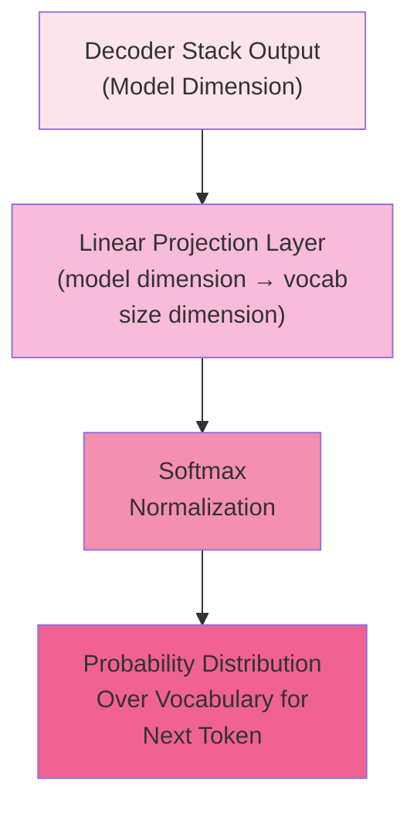

This final transformation converts the decoder's output representations into probabilities over the vocabulary,
indicating which token is most likely to come next.

###### The Autoregressive Generation Process

During actual generation (inference), the decoder works step by step:

###### Autoregressive Generation Process Mermaid Diagram

```mermaid

flowchart TD
    A["[START]"] --> B["Decoder Stack"]
    EN["Encoder Output<br/>(Fixed)"] --> B
    B --> C["Output: 'Le'"]

    C --> D["[START] 'Le'"]
    D --> E["Decoder Stack"]
    EN --> E
    E --> F["Output: 'chat'"]

    F --> G["[START] 'Le' 'chat'"]
    G --> H["Decoder Stack"]
    EN --> H
    H --> I["Output: 'est'"]

    I --> J["[START] 'Le' 'chat' 'est'"]
    J --> K["Decoder Stack"]
    EN --> K
    K --> L["... and so on ...]

    style A fill:#FCE4EC
    style B fill:#F8BBD9
    style C fill:#F48FB1
    style D fill:#F06292
    style E fill:#EC407A
    style F fill:#E91E63
    style G fill:#D81B60
    style H fill:#E1BEE7
    style I fill:#CE93D8
    style J fill:#BA68C8
    style K fill:#AB47BC
    style L fill:#B39DDB
    style EN fill:#E1F5FE
```

This sequential generation process relies on the masked self-attention mechanism to ensure the model can only condition
each new token on previously generated tokens.

###### The Complete Flow

Let's trace how information flows through this architecture with an example of translating "The cat sat" to French "Le
chat est assis":

**1. Encoder Processing:** - The encoder processes "The cat sat" and produces contextual representations.

**2. Initial Decoder Input:** - The decoder starts with just a [START] token.

**3. First Token Generation:** - In the masked self-attention, there's only one token so far, so this step is trivial. -
In the cross-attention, the decoder attends to the encoder's representation of the entire input. - After processing
through all decoder layers, the model predicts "Le" as the first French word.

**4. Second Token Generation:** - The decoder input is now [START] "Le". - In the masked self-attention, "Le" can attend
to [START] and itself. - In the cross-attention, the model focuses heavily on the encoder's representation of "cat". -
The model predicts "chat" as the second word.

**5. Third Token Generation:** - The decoder input is now [START] "Le" "chat". - Each new token can attend to all
previous tokens in the masked self-attention. - The cross-attention layer continues to connect to the encoder output. -
The model predicts "est" as the third word.

This process continues until the model generates an end-of-sequence token or reaches a maximum length constraint.

This architecture's power comes from combining the autoregressive property (generating one token at a time based on
previous tokens) with the ability to attend to the entire input sequence at each step, creating a mechanism that can
generate coherent and contextually appropriate sequences.

##### **Information Flow Through the Architecture**

To understand how the Transformer processes information, let's trace the flow through the entire architecture:

**1. Input Processing:** - Input tokens are converted to embeddings - Positional encodings are added to provide sequence
order information - This combined representation enters the first encoder layer

**2. Encoder Processing:** - Each encoder layer first applies self-attention, allowing each position to gather
contextual information - The feed-forward network then transforms each position's representation independently - This
process repeats through all encoder layers, creating increasingly refined representations - The final encoder output
contains rich contextual representations of the input sequence

**3. Decoder Processing:** - The decoder starts with an output embedding (beginning with a start token during
inference) - The masked self-attention layer allows each position to attend to previous positions - The encoder-decoder
attention connects the decoder to the encoder's output - The feed-forward network further transforms the
representations - This process repeats through all decoder layers - The final linear and softmax layers convert the
decoder output to token probabilities

**4. Autoregressive Generation:** - During inference, the model generates one token at a time - Each generated token is
fed back into the decoder to produce the next token - This continues until an end token is generated or a maximum length
is reached

<div align="center">

<p>figure: Transformer Architecture Overview</p>
</div>

**Architectural Strengths**

This architecture delivers several key advantages:

1. **Parallelization**: The self-attention mechanism allows parallel processing of all input tokens, dramatically
   speeding up training.
2. **Global Context**: Every position can directly access information from all other positions, enabling better modeling
   of long-range dependencies.
3. **Modularity**: The identical layers stacked on top of each other create a modular architecture that's easy to scale
   by adding more layers.
4. **Stable Training**: The combination of residual connections and layer normalization helps gradients flow effectively
   through this deep architecture.
5. **Flexibility**: The architecture adapts well to various tasks by using different combinations of encoders and
   decoders.

**Modern Variations**

While preserving the core principles, modern Transformer variants have introduced various modifications:

- BERT uses only the encoder with bidirectional attention
- GPT uses only the decoder with unidirectional (masked) attention
- T5 modifies the original encoder-decoder architecture with shared parameters
- Vision Transformers adapt the architecture to process image patches rather than tokens

Despite these variations, the fundamental mechanisms of self-attention, residual connections, and feed-forward
transformations remain at the heart of all Transformer-based models.

The elegant design of the Transformer architecture has proven remarkably effective and adaptable, enabling breakthrough
performance across domains and establishing a new paradigm for neural network architectures in sequence processing.

#### The Attention Mechanism

##### Key, Value, and Query Concept

The key, value, and query concept lies at the heart of the Transformer's attention mechanism. This elegant metaphor,
borrowed from information retrieval systems, provides a powerful framework for modeling relationships between elements
in a sequence. Understanding this concept is essential for grasping how attention enables Transformers to process
language so effectively.

To appreciate this concept, let's consider a familiar analogy: searching for information in a library. When you visit a
library with a question, you're essentially performing three actions:

1. You formulate a **query**: "I need information about climate change in coastal regions."
2. You scan book titles and index entries (**keys**) to find relevant materials.
3. You extract the actual information (**values**) from the books whose keys matched your query.

The Transformer's attention mechanism functions remarkably similarly. For each position in a sequence (like each word in
a sentence), the model creates three different representations:

**Queries (Q)**: These represent what the current position is "looking for" or "asking about." You can think of a query
as a question that a word is asking to understand its role and meaning in the context. For example, in the sentence "The
bank is by the river," the word "bank" might query other words to determine which sense of "bank" (financial institution
or riverside) is appropriate.

**Keys (K)**: These serve as "identifiers" or "labels" that indicate what information each position can provide to
others. Keys are what gets matched against queries to determine relevance. In our example, words like "river" would have
keys that strongly match with queries from "bank" when "bank" is used in its geographical sense.

**Values (V)**: These contain the actual information or content that gets aggregated based on the query-key
relationships. Values represent the meaningful information that a word contributes to other words' representations.
While keys determine how much attention to pay, values are what actually get attended to.

All three of these vectors—query, key, and value—are created from the same input representation through learned linear
transformations:

$\begin{align}Q &= Input × W^Q K \\ &= Input × W^K V \\ &= Input × W^V \end{align}$

Where $W^Q$, $W^K$, and $W^V$ are weight matrices that the model learns during training. These transformations allow the
model to extract different aspects of the input that are useful for attention.

Let's see how this works in practice with a concrete example. Consider the sentence: "The student read the book because
it was assigned for class."

When processing the word "it," the model needs to figure out what "it" refers to:

1. The query vector for "it" is asking: "What am I referring to?"
2. This query is compared against the key vectors of all words in the sentence.
3. The key for "book" would likely have a high compatibility with this query.
4. The attention mechanism would then incorporate the value vector from "book" heavily into the representation of "it."

The beauty of this approach is that it allows for dynamic, content-based attention. The relationships between words
aren't fixed by position or predetermined patterns—they're calculated on the fly based on the specific content of each
sequence.

This flexibility enables the model to handle various linguistic phenomena naturally:

- Resolving pronouns to their antecedents
- Connecting subjects to their verbs across intervening clauses
- Linking modifiers to the words they modify
- Understanding idiomatic expressions where meaning isn't compositional

For instance, in the sentence "The trophy wouldn't fit in the suitcase because it was too big," the word "it" refers to
"trophy." But in "The trophy wouldn't fit in the suitcase because it was too small," "it" refers to "suitcase." A
traditional rule-based system would struggle with this distinction, but the query-key-value mechanism can learn to
resolve these references based on semantic compatibility.

The power of this mechanism extends beyond simple reference resolution. It allows the model to create rich, contextual
representations where each word's meaning is informed by all relevant context words, regardless of distance. This is
particularly valuable for understanding polysemous words (words with multiple meanings) and context-dependent
expressions.

The query-key-value concept provides a remarkably intuitive framework for implementing attention, allowing neural
networks to dynamically focus on relevant parts of the input in a way that's both computationally efficient and
linguistically powerful. This approach has proven so effective that it's become the foundation for most state-of-the-art
language models, enabling them to capture the complex interdependencies that characterize human language.

##### Self-Attention Mathematics

Self-attention transforms a sequence of input vectors into a new sequence of output vectors, where each output vector is
a weighted combination of all input vectors. The "self" in self-attention indicates that the attention is applied to the
same sequence—the sequence attends to itself. Let's explore the mathematical details that make this mechanism work.

The mathematical formulation of self-attention provides precise insight into how Transformers process sequential data.
While the key-value-query concept explains the intuition, the mathematics reveals exactly how these components interact
to create powerful representations.

To start, let's define our inputs and outputs clearly:

Given an input sequence of n tokens with embedding dimension d (represented as a matrix X ∈ ℝⁿˣᵈ), self-attention
transforms this into a new representation of the same shape.

The process involves several distinct mathematical operations:

**Step 1: Linear Projections for Queries, Keys, and Values**

The first step is to create query, key, and value vectors for each position through learned linear transformations:

$$Q = XW^Q$$ $$K = XW^K$$ $$V = XW^V$$

Where:

- X ∈ ℝⁿˣᵈ is the input matrix (n tokens, each with dimension d)
- $W^Q$, $W^K$, $W^V$ ∈ ℝᵈˣᵈᵏ are learnable parameter matrices
- Q, K, V ∈ ℝⁿˣᵈᵏ are the resulting query, key, and value matrices

In these equations, d_k is the dimension of the queries and keys, and it's often set to d/h where h is the number of
attention heads. This dimensionality reduction helps control computational complexity while maintaining model capacity.

Let's make this concrete with small numbers. Imagine we have a 4-word sentence with embedding dimension 8:

- X would be a 4×8 matrix
- If we use $d_k$ = 4, then $W^Q$, $W^K$, and $W^V$ would be 8×4 matrices
- Q, K, and V would each be 4×4 matrices

###### Example with Real Numbers

Imagine we have a short sentence: "The cat sleeps peacefully." Each word has been converted to an embedding vector of
dimension 8. Let's say our input matrix X looks like this:

```
X = [
    [0.2, 0.1, 0.5, 0.3, 0.1, 0.7, 0.2, 0.4],  # "The"
    [0.5, 0.7, 0.2, 0.3, 0.6, 0.1, 0.3, 0.2],  # "cat"
    [0.3, 0.2, 0.8, 0.1, 0.5, 0.3, 0.7, 0.1],  # "sleeps"
    [0.1, 0.4, 0.2, 0.6, 0.3, 0.5, 0.2, 0.8]   # "peacefully"
]
```

This is a 4×8 matrix, representing 4 tokens each with dimension 8.

###### Initial Weight Matrix Initialization

Now, let's create our weight matrices. If we choose d_k = 4, we need W^Q, W^K, and W^V to be 8×4 matrices. For
simplicity, let's define one of them:

```
W^Q = [
    [0.1, 0.2, 0.3, 0.1],
    [0.2, 0.1, 0.0, 0.3],
    [0.3, 0.2, 0.1, 0.2],
    [0.1, 0.3, 0.2, 0.1],
    [0.2, 0.1, 0.3, 0.2],
    [0.1, 0.2, 0.1, 0.3],
    [0.3, 0.1, 0.2, 0.1],
    [0.2, 0.3, 0.1, 0.2]
]
```

The weight matrices $W^Q$, $W^K$, and $W^V$ are initially set randomly before training begins. These random
initializations are crucial for breaking symmetry and allowing the model to learn diverse patterns during training.

The specific way we initialize these weights matters significantly for training stability and convergence. Rather than
using completely uniform random values, transformers typically use carefully designed initialization schemes:

1. **Xavier/Glorot Initialization**: This method initializes weights from a distribution with variance scaled according
   to the dimensions of the input and output layers. The goal is to maintain consistent variance of activations and
   gradients across layers, which helps prevent the vanishing/exploding gradient problem.
2. **He Initialization**: Similar to Xavier but specifically designed for layers with ReLU activations, scaling the
   variance by a factor of 2.
3. **Normal Distribution with Small Standard Deviation**: The original Transformer paper used a normal distribution with
   mean 0 and standard deviation 0.02 for all weight initializations.

For our example matrix $W^Q$, these values would have been drawn from such a distribution rather than being manually
chosen. During the actual training process, these initially random values are gradually adjusted through backpropagation
to minimize the model's loss function.

The key insight here is that while we start with random values, the training process discovers useful patterns in the
data and adjusts these weights to capture those patterns. After training, the weight matrices are no longer random but
contain structured information that enables the model to transform word embeddings into query, key, and value
representations that support effective attention calculations.

It's worth noting that good initialization is particularly important for deep transformers, as poor initialization can
lead to training instability or convergence to suboptimal solutions. Research has shown that proper initialization
schemes contribute significantly to the impressive performance of transformer models.

When we multiply our input $X$ by $W^Q$, we get our query matrix Q:

$\begin{align}Q &= X × W^Q = [
    \\ &\qquad\qquad[0.2×0.1 + 0.1×0.2 + 0.5×0.3 + 0.3×0.1 + 0.1×0.2 + 0.7×0.1 + 0.2×0.3 + 0.4×0.2, ...],
    \\ &\qquad\qquad[0.5×0.1 + 0.7×0.2 + 0.2×0.3 + 0.3×0.1 + 0.6×0.2 + 0.1×0.1 + 0.3×0.3 + 0.2×0.2, ...],
    \\ &\qquad\qquad... \\
&\qquad]\end{align}$

Computing just the first value for the first word:

$\begin{align}Q[0,0] &= 0.2×0.1 + 0.1×0.2 + 0.5×0.3 + 0.3×0.1 + 0.1×0.2 + 0.7×0.1 + 0.2×0.3 + 0.4×0.2
       \\ &= 0.02 + 0.02 + 0.15 + 0.03 + 0.02 + 0.07 + 0.06 + 0.08
       \\ &= 0.45\end{align}$

If we calculate all values, Q would be a 4×4 matrix where each row represents the query vector for one word. Similarly,
we would calculate K and V using their respective weight matrices.

###### Why $d_k$ = 4 in This Example?

The choice of $d_k = 4$ in this example follows the common practice of setting $d_k = d/h$, where:

- d is our original embedding dimension (8 in this case)
- h is the number of attention heads (2 in this example)

So $d_k = 8/2 = 4$.

This dimensionality reduction serves several important purposes:

1. **Computational Efficiency**: By reducing the dimension from 8 to 4, we reduce the computational cost of the
   subsequent attention calculations. The dot product between queries and keys creates an n×n matrix (4×4 in our
   example), but the complexity is also affected by the dimension along which we perform the dot product.
2. **Multi-Head Capability**: By reducing the dimension per head, we can maintain the same total computational budget
   while allowing for multiple heads. Instead of one attention mechanism working with 8-dimensional vectors, we can have
   two parallel heads each working with 4-dimensional vectors.
3. **Specialization**: With multiple heads working in lower-dimensional spaces, each head can specialize in capturing
   different types of relationships. One head might focus on syntactic relationships, while another captures semantic
   connections. This specialization is one of the key strengths of multi-head attention.
4. **Parameter Efficiency**: While it might seem that having multiple heads increases the parameter count, the total
   number of parameters remains controlled because each head operates in a lower-dimensional space.

To be clear, without multi-head attention, you wouldn't necessarily need to reduce the dimension. But the power of the
Transformer comes from having multiple attention heads operating in parallel, each potentially focusing on different
aspects of the relationships between words. The dimensionality reduction allows us to have this multi-head capability
without dramatically increasing computation.

In practice, models like BERT and GPT use much larger dimensions (e.g., d = 768 or 1024) with 12 or 16 attention heads,
but the principle remains the same: d_k = d/h ensures each head operates in a manageable subspace while collectively
preserving the model's representational capacity.

**Step 2: Computing Attention Scores**

Next, we compute compatibility scores between all queries and keys using matrix multiplication:

$$S = QK^T$$

This yields S ∈ ℝⁿˣⁿ, a square matrix where each entry S_ij represents how much the i-th position should attend to the
j-th position. The dot product measures how aligned or compatible the query vector from position i is with the key
vector from position j.

In our 4-word example, S would be a 4×4 matrix where S_ij indicates how much word i should attend to word j.

**Step 3: Scaling the Attention Scores**

A crucial detail is the scaling factor applied to prevent extremely small gradients when d_k is large:

$$S_{\text{scaled}} = \frac{S}{\sqrt{d_k}}$$

This scaling factor (√d_k) stabilizes training, especially for large values of d_k. Without it, the dot products would
grow large in magnitude, pushing the softmax function into regions with extremely small gradients, making learning
difficult.

With our d_k = 4, we would divide all values in S by 2 (√4).

**Step 4: Applying Softmax to Get Attention Weights**

The scaled scores are converted into probability distributions using the softmax function:

$$A = \text{softmax}(S_{\text{scaled}})$$

The softmax is applied row-wise, ensuring that for each position i, the attention weights across all positions sum to 1:

$$A_{ij} = \frac{e^{S_{ij}/\sqrt{d_k}}}{\sum_{k=1}^{n} e^{S_{ik}/\sqrt{d_k}}}$$

This creates a matrix A ∈ ℝⁿˣⁿ of attention weights, where each row is a probability distribution over all positions.

In our example, each row of the 4×4 matrix A would sum to 1, representing how much each word attends to all other words
(including itself).

**Step 5: Computing Weighted Sums of Values**

Finally, we compute the output as a weighted sum of the value vectors according to the attention weights:

$$O = AV$$

This gives us O ∈ ℝⁿˣᵈᵏ, the output of the self-attention layer. Each row of O is a weighted combination of all value
vectors, with weights determined by the attention scores.

In our example, each row of O would represent one of our 4 words, now contextualized by information from all other words
according to the attention weights.

**The Complete Equation**

Combining all these steps, we can write the complete self-attention formula:

$$\text{Attention}(Q, K, V) = \text{softmax}\left(\frac{QK^T}{\sqrt{d_k}}\right)V$$

This elegant formula encapsulates the entire self-attention mechanism. Despite its apparent simplicity, it enables
Transformers to capture complex relationships between elements in a sequence.

**Practical Example with Numbers**

Let's work through a simplified numerical example to illustrate how self-attention operates. Consider a tiny sequence
with just 2 tokens and embedding dimension 4:

```
X = [[1, 2, 3, 4],    # Embedding for token 1
     [5, 6, 7, 8]]    # Embedding for token 2

W^Q = [[0.1, 0.2],    # Query projection matrix
       [0.3, 0.4],
       [0.5, 0.6],
       [0.7, 0.8]]

W^K = [[0.1, 0.2],    # Key projection matrix
       [0.3, 0.4],
       [0.5, 0.6],
       [0.7, 0.8]]

W^V = [[0.1, 0.2],    # Value projection matrix
       [0.3, 0.4],
       [0.5, 0.6],
       [0.7, 0.8]]
```

Step 1: Compute Q, K, and V

```
Q = X × W^Q = [[1*0.1 + 2*0.3 + 3*0.5 + 4*0.7, 1*0.2 + 2*0.4 + 3*0.6 + 4*0.8],
                [5*0.1 + 6*0.3 + 7*0.5 + 8*0.7, 5*0.2 + 6*0.4 + 7*0.6 + 8*0.8]]
    = [[5.0, 6.0],
       [13.0, 15.2]]

K = X × W^K = [[5.0, 6.0],
               [13.0, 15.2]]

V = X × W^V = [[5.0, 6.0],
               [13.0, 15.2]]
```

Step 2: Compute attention scores

```
S = Q × K^T = [[5.0*5.0 + 6.0*6.0, 5.0*13.0 + 6.0*15.2],
               [13.0*5.0 + 15.2*6.0, 13.0*13.0 + 15.2*15.2]]
    = [[61.0, 156.2],
       [156.2, 400.04]]
```

Step 3: Scale the scores (d_k = 2, so √d_k = 1.414)

```
S_scaled = S / 1.414 = [[43.14, 110.47],
                        [110.47, 282.91]]
```

Step 4: Apply softmax (the exact values would require exponentiation, but conceptually):

```
A = softmax(S_scaled) ≈ [[0.1, 0.9],
                         [0.1, 0.9]]
```

Step 5: Compute the weighted sum of values

```
O = A × V = [[0.1*5.0 + 0.9*13.0, 0.1*6.0 + 0.9*15.2],
             [0.1*5.0 + 0.9*13.0, 0.1*6.0 + 0.9*15.2]]
    = [[12.2, 14.28],
       [12.2, 14.28]]
```

In this simplified example, both tokens end up attending mostly to the second token (due to our choice of weights). The
output vectors show how information has been aggregated according to the attention pattern.

**Mathematical Properties of Self-Attention**

Several mathematical properties make self-attention particularly effective:

1. **Permutation Equivariance**: Without positional encodings, self-attention is equivariant to permutations of the
   input sequence. If you shuffle the input tokens, the output tokens will be shuffled in the same way, but each output
   vector will be unchanged. This is why positional encodings are needed to provide information about sequence order.
2. **Long-Range Dependencies**: Unlike convolutional or recurrent operations, the attention scores directly connect any
   two positions, regardless of distance. This creates a path for gradients to flow directly between distant positions
   during backpropagation, helping address the vanishing gradient problem.
3. **Dynamic Parameter Sharing**: While the projection matrices W^Q, W^K, and W^V are shared across all positions, the
   attention weights are dynamically computed based on content. This combines the efficiency of parameter sharing with
   the flexibility of content-dependent processing.
4. **Computational Complexity**: The time and space complexity of self-attention is O(n²), where n is the sequence
   length. This quadratic scaling is one of the main limitations of the original Transformer for very long sequences,
   motivating research into more efficient attention variants.

The mathematical formulation of self-attention elegantly captures the notion of dynamic, content-based interaction
between elements in a sequence. This mathematical foundation enables Transformers to model complex dependencies in
sequential data, leading to their remarkable success across numerous domains.

##### Multi-Head Attention

Multi-head attention represents one of the most powerful refinements to the basic self-attention mechanism. Rather than
performing a single attention function, multi-head attention runs multiple attention operations in parallel, allowing
the model to jointly attend to information from different representation subspaces. This enables the Transformer to
capture a richer set of relationships within the data, significantly enhancing its modeling capacity.

The core insight behind multi-head attention is that using a single attention function limits the model's ability to
focus on different aspects of the input simultaneously. By creating multiple "heads," each with its own set of learned
projections, the model can develop specialized attention patterns that capture various types of relationships.

**Mathematical Formulation**

Multi-head attention is defined mathematically as:

$$\text{MultiHead}(Q, K, V) = \text{Concat}(\text{head}_1, \text{head}_2, ..., \text{head}_h)W^O$$

Where each attention head is computed as:

$$\text{head}_i = \text{Attention}(QW_i^Q, KW_i^K, VW_i^V)$$

In these equations:

- h is the number of attention heads (typically 8-16)
- W_i^Q, W_i^K, W_i^V are head-specific parameter matrices for the ith head
- W^O is the output projection matrix that combines the outputs from all heads
- Concat represents the concatenation of the outputs from each head along the feature dimension

Let's understand the dimensions involved. If the model dimension is d_model (e.g., 512) and we use h attention heads,
each head typically works with a dimension of d_k = d_model/h (e.g., 64 for 8 heads). This means:

- W_i^Q, W_i^K ∈ ℝᵈᵐᵒᵈᵉˡˣᵈᵏ transform the input to the query and key spaces for head i
- W_i^V ∈ ℝᵈᵐᵒᵈᵉˡˣᵈᵛ transforms the input to the value space for head i (often d_v = d_k)
- Each head's output has dimension d_v, so concatenating h heads gives a vector of dimension h·d_v
- W^O ∈ ℝʰᵈᵛˣᵈᵐᵒᵈᵉˡ projects the concatenated heads back to the model dimension

This dimensionality arrangement ensures that the total computational cost of multi-head attention remains similar to
that of single-head attention with full dimensionality.

**Parallel Processing Implementation**

In practice, multi-head attention is implemented efficiently by batching the operations for all heads. Instead of
computing each head sequentially, we can reshape our matrices to process all heads in parallel:

1. Project inputs to create batched queries, keys, and values for all heads at once
2. Reshape to separate the heads dimension
3. Apply scaled dot-product attention to each head in parallel
4. Reshape and project the concatenated output

This batched implementation significantly improves computational efficiency, especially on GPUs and TPUs that excel at
parallel processing.

**Specialized Attention Patterns**

What makes multi-head attention particularly powerful is that different heads can learn to specialize in different types
of relationships. Analysis of trained Transformer models reveals fascinating patterns of specialization:

**Syntactic Relationships**: Some heads focus primarily on grammatical structure. For example:

- Certain heads might consistently attend from verbs to their subjects
- Others might link articles to their corresponding nouns
- Some might focus on adjective-noun relationships

**Semantic Relationships**: Other heads capture meaning-based connections:

- Some heads track entities and their attributes across a document
- Others might focus on causal relationships (connecting effects to their causes)
- Some capture semantic similarity between related concepts

**Coreference Resolution**: Certain heads specialize in resolving pronouns and references:

- These heads show strong attention from pronouns to their likely antecedents
- They help the model understand who or what is being referred to by words like "it," "they," or "this"

**Position-Based Patterns**: Some heads learn position-based attention patterns:

- Attending primarily to nearby words (local context)
- Focusing on specific relative positions (e.g., always attending to the previous verb)
- Creating long-distance connections between structural elements (like matching opening and closing parentheses)

Consider the sentence: "The scientist who conducted the experiment with the new equipment published her findings last
month."

Different attention heads might focus on different aspects:

- One head might link "published" back to "scientist" (subject-verb relationship)
- Another might connect "her" to "scientist" (pronoun resolution)
- A third might focus on "experiment" and "equipment" (semantic relationship)
- Yet another might link "published" and "findings" (verb-object relationship)

This specialization across heads allows the model to simultaneously track multiple types of relationships, creating a
rich, multi-faceted representation of the input.

**Visualizing Multi-Head Attention**

Visualizations of attention patterns in trained models reveal this specialization clearly. When visualized as heatmaps
or connection graphs, different heads show distinct patterns:

- Some heads have sharply focused attention, with each position strongly attending to just one or two other positions
- Others show more diffuse attention patterns, spreading attention across many positions
- Some show diagonal patterns (attending to nearby words)
- Others show vertical or horizontal stripes (attending to specific positions or tokens)

These diverse attention patterns work together to create a comprehensive understanding of the input sequence, with each
head contributing different aspects of the overall representation.

**Benefits of Multi-Head Attention**

The multi-head approach provides several key advantages:

1. **Representation Power**: By projecting the inputs into different subspaces, the model can attend to different
   aspects of the information in parallel, capturing more complex relationships than a single attention function.
2. **Ensemble Effect**: Having multiple heads creates a form of ensemble learning within a single model, making the
   attention mechanism more robust and stable.
3. **Specialization**: Different heads can focus on different linguistic or semantic phenomena, allowing the model to
   develop specialized "experts" for various aspects of language.
4. **Joint Processing**: The model can jointly consider different types of relationships when making predictions, rather
   than having to choose a single focus.
5. **Redundancy**: If some heads fail to capture important patterns, others may compensate, providing a form of
   redundancy that improves robustness.

The multi-head mechanism has proven so effective that it's become a standard component not just in language models but
in Transformer applications across numerous domains, from vision to time series analysis to computational biology. It
exemplifies the principle that parallel, specialized processing pathways can collectively achieve more powerful
representation learning than a single, monolithic pathway.

In essence, multi-head attention allows the Transformer to simultaneously view the input from multiple perspectives,
combining these views to form a richer, more comprehensive understanding of the relationships within the data.

##### Scaled Dot-Product Attention

Scaled dot-product attention represents the mathematical core of the Transformer's attention mechanism. This specific
formulation of attention combines simplicity, computational efficiency, and effectiveness, making it a key innovation in
the Transformer architecture. Let's explore why this particular approach to calculating attention works so well and the
mathematical insights behind it.

The complete formula for scaled dot-product attention is elegantly concise:

$$\text{Attention}(Q, K, V) = \text{softmax}\left(\frac{QK^T}{\sqrt{d_k}}\right)V$$

While this equation might look simple, each component serves a critical purpose in creating an effective attention
mechanism. Let's examine each element in detail:

**The Dot-Product: Measuring Compatibility**

At the heart of scaled dot-product attention is the dot product between query and key vectors. For any query vector q
and key vector k, their dot product q·k produces a scalar that represents how aligned or compatible they are.

The dot product has several properties that make it particularly well-suited for attention:

1. **Geometric Interpretation**: The dot product can be expressed as ||q||·||k||·cos(θ), where θ is the angle between
   the vectors. This means it measures both the magnitudes of the vectors and how aligned they are in direction. Vectors
   pointing in similar directions (small angle) produce larger dot products.
2. **Linear Complexity**: Computing dot products is computationally efficient, especially when implemented as matrix
   multiplication for batched computation.
3. **No Additional Parameters**: Unlike some alternative compatibility functions that use additional learned weights,
   the dot product requires no extra parameters, making it parameter-efficient.

When we compute Q·K^T, we're calculating the dot product between every query vector and every key vector, resulting in a
matrix of compatibility scores where each entry (i,j) indicates how much position i should attend to position j.

**The Scaling Factor: Stabilizing Gradients**

The inclusion of the scaling factor 1/√d_k addresses a subtle but critical issue in attention mechanisms. As the
dimensionality of the query and key vectors (d_k) increases, the variance of their dot products also increases.

Without scaling, large dot products would push the softmax function into regions where the gradients are extremely small
(when the softmax probabilities are very close to 0 or 1). This would slow down learning or cause training instability.

The specific choice of √d_k as the scaling factor is theoretically motivated. If we assume the components of q and k
have zero mean and unit variance, the dot product q·k would have a variance of d_k. Dividing by √d_k normalizes this
variance to 1, keeping the dot products in a range where the softmax gradients are still substantial.

This seemingly minor detail has a significant impact on training stability and convergence speed, particularly for
deeper Transformer models with multiple attention layers.

**The Softmax Function: Creating a Probability Distribution**

The softmax function converts the scaled dot products into a probability distribution over all keys for each query:

$$\text{softmax}(x_i) = \frac{e^{x_i}}{\sum_j e^{x_j}}$$

This transformation ensures that:

- All attention weights are positive (between 0 and 1)
- The weights for each query sum to 1
- Larger dot products receive proportionally higher weights
- The weights follow a smooth, differentiable distribution

The softmax creates a "soft" selection mechanism where multiple positions can receive substantial attention, but larger
compatibility scores are emphasized exponentially. This allows the model to focus primarily on the most relevant
positions while still maintaining some attention to moderately relevant ones.

**The Value Aggregation: Gathering Information**

The final step multiplies the attention weights by the value vectors and sums them:

$$\text{Output} = \text{Attention Weights} \times V$$

This weighted aggregation is where the actual information transfer happens. Each position collects information from all
other positions, with emphasis determined by the attention weights.

If a position i has high attention weight for position j, then the value vector from position j will contribute strongly
to position i's output. This allows information to flow directly between related positions, regardless of their distance
in the sequence.

**Advantages Over Alternative Formulations**

Several alternative attention formulations exist, but scaled dot-product attention offers unique advantages:

1. **Compared to Additive Attention**: Some earlier attention mechanisms used a small neural network to compute
   compatibility scores: f(q,k) = v^T·tanh(W·[q;k]). While this can theoretically approximate more complex compatibility
   functions, it's computationally more expensive and adds parameters. In practice, scaled dot-product attention
   performs just as well while being faster and more parameter-efficient.
2. **Compared to Unscaled Dot-Product**: Without the scaling factor, deep Transformer models often struggle with
   training stability, especially with larger dimensionality. The scaling factor is a simple fix that dramatically
   improves convergence.
3. **Compared to Multiplicative Attention**: Some formulations use a learned matrix for compatibility: q^T·W·k. This
   adds parameters and computation but rarely outperforms the simpler scaled dot-product approach.

**Handling Attention Masking**

In practical implementations, scaled dot-product attention often needs to handle masking, particularly for:

1. **Padding Masks**: To prevent the model from attending to padding tokens in batched inputs of different lengths
2. **Causal Masks**: In decoder self-attention, to prevent positions from attending to future positions

Masking is implemented by adding large negative values (like -10000) to the masked positions in the attention scores
before softmax. This effectively zeroes out the attention weights for those positions.

The complete implementation with masking would be:

$$\text{Attention}(Q, K, V, M) = \text{softmax}\left(\frac{QK^T}{\sqrt{d_k}} + M\right)V$$

Where M is a mask matrix with large negative values in positions that should be masked out, and zeros elsewhere.

**Practical Implementation Efficiency**

One of the strengths of scaled dot-product attention is how efficiently it can be implemented on modern hardware. The
entire operation can be expressed as a sequence of batched matrix multiplications:

```python
def scaled_dot_product_attention(Q, K, V, mask=None):
    # Calculate attention scores
    d_k = K.shape[-1]
    scores = torch.matmul(Q, K.transpose(-2, -1)) / math.sqrt(d_k)

    # Apply mask if provided
    if mask is not None:
        scores = scores.masked_fill(mask == 0, -1e9)

    # Apply softmax to get attention weights
    attention_weights = F.softmax(scores, dim=-1)

    # Return weighted sum
    return torch.matmul(attention_weights, V)
```

This implementation leverages highly optimized matrix multiplication routines available on GPUs and TPUs, making it
extremely efficient for parallel computation.

Scaled dot-product attention has become the standard attention mechanism not just in Transformers but in many other
attention-based architectures due to its combination of mathematical elegance, computational efficiency, and empirical
effectiveness. The scaling factor, in particular, was a key innovation that enabled the training of deeper Transformer
models with multiple attention heads, contributing significantly to their success across various domains.

#### Transformer Architecture Components

##### Encoder Structure and Function

The encoder forms the first major component of the Transformer architecture, serving as the "understanding" module that
processes input sequences into rich contextual representations. While it might appear complex at first glance, the
encoder's design follows a logical structure built around a few key principles: parallel processing, multi-level
transformation, and contextual awareness.

Let's break down the encoder to understand exactly how it works and why it's designed this way.

At the highest level, the Transformer encoder consists of a stack of identical layers (typically 6 in the original
paper, though modern implementations vary). Each layer performs two essential operations:

1. Multi-head self-attention
2. Position-wise feed-forward processing

These operations are wrapped with residual connections and layer normalization, creating a structure that allows for
effective information flow and stable training.

**The Input Transformation Process**

When a sequence enters the encoder, it first undergoes preparation before entering the actual encoder layers:

1. **Embedding Conversion**: Each token (like a word) is converted into a dense vector representation through an
   embedding layer. For example, in a language model, the word "cat" might be transformed into a 512-dimensional vector
   that captures its semantic properties.
2. **Positional Encoding Addition**: Since the Transformer has no built-in sense of order, positional encodings are
   added to the embeddings. These provide information about where each token appears in the sequence.

This prepared representation then enters the first encoder layer, beginning a transformation process that grows
increasingly sophisticated as information flows through the stack.

**Inside Each Encoder Layer**

Let's examine what happens inside each encoder layer:

**Step 1: Multi-Head Self-Attention**

The first sub-layer is where the magic of context awareness happens. Here, each position in the sequence attends to all
positions (including itself) through the multi-head self-attention mechanism.

Imagine we're processing the sentence "The cat chased the mouse." When the attention mechanism processes the word
"chased," it might:

- Place high attention on "cat" (to identify who is doing the chasing)
- Place moderate attention on "mouse" (to identify what's being chased)
- Place lower attention on "the" (which provides less critical information)

This creates a contextualized representation where each word's encoding now contains information from relevant parts of
the entire sentence.

The multi-head aspect allows different "heads" to focus on different types of relationships simultaneously. For
instance:

- One head might focus on subject-verb relationships
- Another might track object-verb relationships
- A third might focus on adjective-noun connections

This parallel tracking of multiple relationship types creates a rich representation that captures the multi-faceted
nature of language.

**Step 2: Add & Norm (First Residual Connection)**

After self-attention, the encoder employs a critical architectural pattern: a residual connection followed by layer
normalization.

The residual connection simply adds the original input to the output of the self-attention layer:

```
output = LayerNorm(x + Self-Attention(x))
```

This residual connection serves several important purposes:

- It provides a direct path for gradient flow during backpropagation
- It allows the model to bypass the self-attention layer if needed
- It helps preserve information that might otherwise be lost during transformation

Layer normalization then normalizes the combined output across the feature dimension, stabilizing the learning process
by keeping activations within a consistent range.

**Step 3: Position-wise Feed-Forward Network**

The second sub-layer is a feed-forward neural network applied identically to each position:

```
FFN(x) = max(0, xW₁ + b₁)W₂ + b₂
```

This is essentially a two-layer neural network with a ReLU activation in between. It operates independently on each
position's representation, allowing for further transformation of the features extracted by the attention mechanism.

What makes this component powerful is its capacity. The inner layer dimension is typically much larger than the model
dimension (often 4x larger), giving the network substantial representation power to transform the attention outputs.

You can think of this feed-forward network as allowing each position to independently process the contextual information
gathered through attention, applying non-linear transformations that enable more complex feature extraction.

**Step 4: Add & Norm (Second Residual Connection)**

Just like after the attention layer, another residual connection and layer normalization are applied:

```
output = LayerNorm(x + FFN(x))
```

This maintains the gradient flow and information preservation benefits mentioned earlier.

**The Layer Stack: Hierarchical Refinement**

As representations flow through multiple encoder layers, they undergo progressive refinement. We can visualize this
refinement process through an example.

Imagine processing the sentence "The movie that I watched yesterday was fantastic."

In the first layer:

- Lower-level patterns might emerge, with attention focusing on adjacent words and simple grammatical relationships
- "watched" might attend strongly to "movie" and "yesterday"
- Basic contextual information begins to flow between related words

In middle layers:

- More complex patterns develop as the representations incorporate broader context
- Long-range dependencies start to form more clearly
- The relationship between "movie" and "fantastic" begins to strengthen despite their distance

In final layers:

- Highly sophisticated representations emerge that capture the complete contextual meaning
- Abstract semantic relationships dominate over simple syntactic ones
- The representation of each word effectively incorporates information from the entire sentence

This hierarchical refinement creates increasingly abstract and contextually rich representations as information moves up
through the encoder stack.

**Output of the Encoder**

The final output of the encoder stack is a sequence of vectors, one for each input position. These vectors contain rich
contextual information that captures the relationships between the token at that position and all other tokens in the
sequence.

In a complete Transformer model for machine translation, these outputs would be passed to the decoder to generate the
translation. In encoder-only models like BERT, these final outputs might be directly used for tasks like classification
or sequence labeling.

**Why This Design Works So Well**

The encoder's architecture embodies several principles that make it remarkably effective:

1. **Parallelization**: By processing all positions simultaneously through self-attention instead of sequentially, the
   encoder achieves far greater computational efficiency than recurrent models.
2. **Direct Path for Information Flow**: The combination of self-attention (creating direct connections between any
   positions) and residual connections (providing direct paths through layers) allows information and gradients to flow
   efficiently throughout the network.
3. **Multi-scale Feature Extraction**: Different encoder layers can specialize in different levels of abstraction, from
   local syntactic patterns to global semantic relationships.
4. **Adaptive Context Aggregation**: The self-attention mechanism dynamically determines which parts of the input are
   relevant for each position, rather than using fixed patterns like convolutional networks.
5. **Parameter Efficiency**: Through weight sharing across positions in both the self-attention and feed-forward
   networks, the encoder maintains a reasonable parameter count despite its expressiveness.

The encoder's design represents a careful balance of expressiveness, computational efficiency, and trainability. Its
ability to process sequences in parallel while still capturing dependencies between distant elements has made it a
breakthrough architecture for handling sequential data, addressing the limitations that had constrained previous
approaches based on recurrence or convolution.

##### Decoder Structure and Function

The decoder is the second major component of the Transformer architecture, working as the "generation" module that
converts the encoder's contextual representations into an output sequence. While sharing some similarities with the
encoder, the decoder introduces key differences designed specifically for the challenges of sequence generation. Let's
explore how the decoder works and why its unique structure is essential for tasks like translation, summarization, and
text generation.

Like the encoder, the Transformer decoder consists of a stack of identical layers (typically 6 in the original paper).
However, each decoder layer contains three sub-layers rather than two:

1. Masked multi-head self-attention
2. Multi-head cross-attention (attending to the encoder's output)
3. Position-wise feed-forward network

These differences create an architecture specifically designed for auto-regressive generation—producing one element at a
time while considering both the previously generated elements and the input from the encoder.

**The Autoregressive Generation Process**

To understand the decoder, we first need to understand the fundamental challenge of sequence generation: we must
generate outputs one element at a time, with each new element depending on those previously generated.

For example, when translating "The cat sat on the mat" to French, we would generate:

1. "Le" (first word)
2. "chat" (second word, knowing we've already generated "Le")
3. "s'est" (third word, knowing we've already generated "Le chat") ... and so on

This autoregressive property—where each output depends on previous outputs—creates the core challenge addressed by the
decoder design.

**Decoder Input and Initialization**

During training, the decoder receives the entire target sequence, but shifted right by one position. This "teacher
forcing" approach allows parallel training while preserving the autoregressive property.

During inference (actual generation), the process works differently:

1. The decoder starts with a special "start-of-sequence" token
2. The decoder generates one token at a time, feeding each new token back as input for generating the next one
3. The process continues until an "end-of-sequence" token is generated or a maximum length is reached

**Inside Each Decoder Layer**

Let's examine the three sub-layers that make each decoder layer function:

**1. Masked Multi-Head Self-Attention**

The first sub-layer looks similar to the encoder's self-attention, but with a critical difference: masking.

The mask prevents positions from attending to subsequent positions by setting attention scores for illegal connections
to negative infinity before the softmax operation. Essentially, when generating the nth word, the model can only look at
words 1 through n-1, not at words n+1 and beyond.

For example, when processing the second word in "Le chat est assis," the masked self-attention ensures it can only
attend to "Le" and not to "est" or "assis," which haven't been generated yet.

This masking transforms the parallel self-attention into a causal attention mechanism that preserves the autoregressive
property essential for coherent generation:

```
attention_scores = QK^T / sqrt(d_k)
masked_scores = attention_scores.masked_fill(mask == 0, -1e9)
attention_weights = softmax(masked_scores)
```

The mask is typically a lower triangular matrix where the entries below the diagonal are 1 and above the diagonal are 0,
enforcing the causality constraint.

**2. Cross-Attention: Connecting to the Encoder**

The second sub-layer is where the decoder connects with the encoder's output. This multi-head cross-attention layer
serves as the bridge between understanding (encoder) and generation (decoder):

- The queries come from the decoder's previous sub-layer
- The keys and values come from the encoder's output

This creates a mechanism where each position in the decoder can attend to all positions in the encoder's output,
allowing the decoder to focus on relevant parts of the input when generating each output token.

For instance, when generating the French word "chat" in our translation example, the cross-attention might focus heavily
on the encoder positions corresponding to the English word "cat," drawing information needed for accurate translation.

This cross-attention mechanism is crucial for tasks like translation, summarization, or question answering, where the
output depends directly on the input but with a potentially different structure or length.

**3. Position-wise Feed-Forward Network**

The third sub-layer is identical to the feed-forward network in the encoder: a two-layer neural network with a ReLU
activation, applied independently to each position.

This provides the decoder with additional transformation capacity to process the combined information from
self-attention (previous outputs) and cross-attention (encoder information).

**Residual Connections and Layer Normalization**

As in the encoder, each sub-layer in the decoder is followed by a residual connection and layer normalization:

```
x = LayerNorm(x + Sublayer(x))
```

These elements serve the same purposes as in the encoder: facilitating gradient flow, preserving information, and
stabilizing training.

**The Final Output Layer**

After the stack of decoder layers, the output passes through a final linear transformation followed by a softmax
function to convert the decoder's output vectors into probabilities over the vocabulary:

```
P(next_token) = softmax(output_vectors × W_projection + b)
```

Where W_projection often shares weights with the embedding matrix, a technique called weight tying that reduces
parameters and improves performance.

This probability distribution over the vocabulary represents the model's prediction for the next token. During training,
this is compared with the actual next token to compute the loss. During inference, we typically either:

- Take the highest probability token (greedy decoding)
- Sample from the distribution (for more diverse outputs)
- Use beam search to maintain multiple candidate sequences

**Comparing Decoder Inference and Training**

A key distinction of the decoder is the difference between its operation during training versus inference:

**During Training:**

- The entire target sequence (minus the last token) is provided as input
- Teacher forcing allows parallel computation across all positions
- The decoder predicts each token based on the ground truth previous tokens

**During Inference (Generation):**

- Only one token is generated at a time
- Each new token is fed back as input to generate the next token
- The process is inherently sequential, unlike the parallel processing during training

This distinction creates a training-inference gap that can affect generation quality, which is why techniques like
scheduled sampling (occasionally using model predictions instead of ground truth during training) have been developed.

**A Practical Example: Translation Generation**

Let's trace how the decoder would generate a translation from English to French:

1. The encoder processes the English sentence "The cat sat on the mat" into contextual representations
2. The decoder starts with the start token "⟨BOS⟩"
3. The first decoder layer:
    - Masked self-attention: Since there's only one token, this step is trivial
    - Cross-attention: Attends to the encoder's representation, focusing on relevant parts of "The cat sat on the mat"
    - Feed-forward: Further processes this information
4. After passing through all decoder layers, the output is projected to vocabulary probabilities
5. The model selects "Le" as the first French word
6. Now the decoder has "⟨BOS⟩ Le" as input
7. For the second word:
    - Masked self-attention: Processes "⟨BOS⟩ Le", with "Le" only able to attend to "⟨BOS⟩" and itself
    - Cross-attention: Again attends to the encoder, likely focusing on "cat" when generating the next word
    - After going through all layers, the model predicts "chat"
8. This process continues, generating "Le chat s'est assis sur le tapis" one word at a time

**The Unique Strengths of the Decoder**

The decoder's architecture gives it several unique strengths:

1. **Controlled Generation**: The masking mechanism ensures that generation proceeds in a coherent, causal manner.
2. **Input-Output Alignment**: The cross-attention mechanism creates flexible alignment between input and output
   sequences, handling reordering, omission, or expansion naturally.
3. **Context Integration**: The decoder effectively combines two contexts—previously generated tokens and the input
   sequence—to make informed predictions.
4. **Flexibility**: The same basic architecture can be adapted for various generation tasks by changing what the encoder
   represents and how the decoder is trained.

Despite these strengths, the decoder's autoregressive nature does create a trade-off: while the encoder can process all
input elements in parallel, the decoder must generate outputs sequentially during inference. This makes generation
inherently slower than encoding, creating a computational bottleneck for long output sequences.

Nevertheless, the Transformer decoder represents a remarkable architecture for sequence generation, combining the
benefits of attention-based modeling with the constraints necessary for coherent autoregressive generation. This design
has made it the foundation for powerful models like GPT, which uses a decoder-only architecture for flexible text
generation across a wide range of applications.

##### Positional Encoding

Positional encoding addresses a fundamental limitation in the Transformer architecture: its lack of inherent sequence
awareness. Unlike recurrent or convolutional neural networks, which process tokens sequentially or in local
neighborhoods, Transformers process all positions simultaneously through self-attention. This parallel processing is a
key advantage for computational efficiency, but it creates a challenge: without additional information, a Transformer
would treat a sequence as an unordered set of tokens.

Positional encoding solves this problem by explicitly adding information about token positions into the input
embeddings. Let's explore how this ingenious solution works and why its specific implementation matters.

**The Fundamental Challenge: Sequence without Sequence**

To appreciate why positional encoding is necessary, consider these two sentences:

- "Dog bites man"
- "Man bites dog"

They contain exactly the same tokens but convey entirely different meanings because of the order. Without position
information, a Transformer would produce identical representations for both sentences, unable to distinguish who is
biting whom.

In most language tasks, order is crucial for understanding meaning. From grammatical structure to temporal
relationships, the position of words fundamentally affects interpretation. The Transformer needs a way to know not just
what tokens are present, but where they appear in the sequence.

**The Solution: Adding Positional Information**

The Transformer addresses this challenge by adding positional encodings directly to the input embeddings before the
first layer of the network. These encodings have the same dimension as the embeddings, allowing them to be simply added
together:

```
Final_Input = Token_Embedding + Positional_Encoding
```

This approach has a beautiful simplicity: rather than modifying the architecture to handle position information (which
might reduce parallelization benefits), we simply augment the input with the necessary position information.

**Sinusoidal Positional Encoding: An Elegant Mathematical Solution**

The original Transformer paper introduced a particularly elegant approach to positional encoding using sine and cosine
functions of different frequencies:

$$PE_{(pos,2i)} = \sin\left(\frac{pos}{10000^{2i/d_{model}}}\right)$$

$$PE_{(pos,2i+1)} = \cos\left(\frac{pos}{10000^{2i/d_{model}}}\right)$$

Where:

- $pos$ is the position of the token in the sequence (0, 1, 2, ...)
- $i$ is the dimension within the embedding (0, 1, 2, ..., d_model/2-1)
- $d_{model}$ is the embedding dimension

This formula creates a unique encoding for each position, with the pattern extending to positions not seen during
training. Let's break down why this approach is so effective:

**1. Dimension Alternation**: For even dimensions, a sine function is used; for odd dimensions, a cosine function. This
creates a comprehensive representation across the embedding dimensions.

**2. Frequency Variation**: As the dimension index $i$ increases, the functions oscillate at lower frequencies (because
of the $10000^{2i/d_{model}}$ term). This means different dimensions capture position information at different scales:

- Lower dimensions change rapidly with position (high frequency)
- Higher dimensions change slowly with position (low frequency)

**3. Uniqueness**: Each position gets a unique encoding pattern across the dimensions, allowing the model to distinguish
between different positions.

**4. Bounded Values**: All values are between -1 and 1, making them well-behaved when added to the embeddings.

To make this concrete, let's visualize what these positional encodings look like for a small example with embedding
dimension 6 and positions 0-9:

```
Position 0: [0.0000, 1.0000, 0.0000, 1.0000, 0.0000, 1.0000]
Position 1: [0.8415, 0.5403, 0.0464, 0.9989, 0.0025, 1.0000]
Position 2: [0.9093, -0.4161, 0.0927, 0.9957, 0.0050, 1.0000]
Position 3: [0.1411, -0.9900, 0.1389, 0.9903, 0.0075, 1.0000]
...
```

Notice how the values for dimensions 0 and 1 change rapidly with position (high frequency), while dimensions 4 and 5
change very slowly (low frequency). This multi-scale representation allows the model to discriminate between nearby
positions (using the high-frequency dimensions) while also maintaining awareness of relative position over longer
distances (using the low-frequency dimensions).

**Relative Position Information**

One of the most powerful properties of sinusoidal positional encoding is that the relative position between two tokens
can be expressed as a linear function of their encodings. This means the model can learn to attend to relative positions
(like "two words back") rather than just absolute positions.

For example, the model can learn that the relationship between a verb and its subject typically involves specific
relative position patterns, regardless of where they appear absolutely in the sentence.

This property makes the sinusoidal encoding particularly well-suited for language tasks, where relative relationships
often matter more than absolute positions.

**Learned vs. Fixed Positional Encodings**

The original Transformer used fixed sinusoidal functions for positional encoding, but many subsequent implementations
use learned positional embeddings instead. With learned embeddings, the position vectors are initialized randomly and
updated during training like any other embedding.

Both approaches have advantages:

**Fixed Sinusoidal Encodings:**

- Can generalize to sequence lengths not seen during training
- Require no additional parameters to learn
- Incorporate useful inductive biases about relative positions
- Work well even with limited training data

**Learned Positional Embeddings:**

- Can adapt to the specific patterns in the training data
- May capture more complex positional relationships
- Often perform slightly better in practice when sufficient training data is available
- Are conceptually simpler (just another embedding lookup)

Models like BERT typically use learned positional embeddings, while others maintain the original sinusoidal approach.
Both work well in practice, with the choice often depending on the specific application and training setup.

**Handling Sequences Longer Than Those in Training**

One practical challenge with positional encodings is handling sequences longer than those seen during training,
especially with learned positional embeddings which are only defined up to the maximum length used in training.

Several solutions exist:

1. **Sinusoidal encodings**: These naturally extend to any position
2. **Extrapolation**: Learned embeddings can be extrapolated beyond the training range
3. **Relative positional encodings**: Some newer methods focus only on relative positions rather than absolute ones
4. **Position interpolation**: For very long sequences, positions can be bucketed or interpolated

**Alternative Approaches to Position**

Research has developed several alternatives to the original positional encoding:

1. **Relative Positional Encoding**: Instead of encoding absolute positions, explicitly model the relative distance
   between tokens. This approach has shown benefits in various tasks.
2. **Rotary Position Embedding (RoPE)**: Encodes relative position by rotating the token embeddings in complex space,
   creating mathematically elegant properties for attention.
3. **ALiBi (Attention with Linear Biases)**: Adds a bias to attention scores based on the distance between tokens,
   avoiding explicit position embeddings entirely.
4. **T5's Relative Attention Bias**: Adds learned biases to attention scores based on relative position buckets.

**Why Positional Encoding Matters in Practice**

Positional encoding may seem like a technical detail, but it fundamentally enables Transformers to function effectively
for sequence tasks. Without it, Transformers would be limited to tasks where order doesn't matter, missing the crucial
structure in language and other sequential data.

The specific implementation of positional encoding affects several practical aspects of Transformer models:

1. **Length Generalization**: How well the model handles sequences longer than those seen during training
2. **Parameter Efficiency**: Whether additional parameters are needed for position information
3. **Inductive Bias**: What assumptions about positional relationships are built into the model
4. **Computational Efficiency**: How position information integrates with the rest of the computation

The elegant solution of adding fixed sinusoidal positional encodings to token embeddings demonstrates a key principle in
deep learning architecture design: sometimes the simplest approach that preserves desirable properties (in this case,
parallelization) is the most effective. By adding position information to the input rather than modifying the core
attention mechanism, the Transformer maintains its computational advantages while gaining the crucial ability to process
ordered sequences.

Positional encoding stands as an essential component that enables Transformers to understand sequence order while
processing tokens in parallel, addressing what could have been a fatal flaw in the architecture with an elegant
mathematical solution.

##### Feed-Forward Networks and Layer Normalization

While self-attention often steals the spotlight in discussions of Transformer architecture, the feed-forward networks
and layer normalization components are equally essential to the model's success. These seemingly mundane components
address critical challenges in deep learning and contribute significantly to the Transformer's representational power
and training stability. Let's explore how these components work and why they're so important.

**Position-wise Feed-Forward Networks: Adding Depth and Capacity**

Each encoder and decoder layer in a Transformer contains a position-wise feed-forward network (FFN). The term
"position-wise" indicates that the same feed-forward network is applied independently to each position's representation.
Mathematically, it's defined as:

$$\text{FFN}(x) = \max(0, xW_1 + b_1)W_2 + b_2$$

This is essentially a two-layer neural network with a ReLU activation between the layers. While simple in structure,
this component serves several crucial functions that complement the attention mechanism:

**1. Increased Model Capacity**

The feed-forward network significantly expands the model's capacity to learn complex patterns. In the original
Transformer, the inner dimension of this network is 2048 (compared to the model dimension of 512), creating what is
effectively a "wide" layer within each Transformer block.

Think of it this way: if attention is about gathering information from across the sequence, the feed-forward network is
about deeply processing that gathered information. The wide hidden layer allows the model to learn rich, non-linear
transformations of the attention outputs.

For example, after the attention layer has gathered relevant context about a word like "bank" from surrounding words
that suggest it's a financial institution, the feed-forward network can transform this representation to emphasize
financial-related aspects of the word's meaning.

**2. Position-Specific Processing**

While attention mechanisms share information across positions, the feed-forward networks process each position
independently. This creates a division of labor:

- Attention layers handle cross-position interactions
- Feed-forward layers handle position-specific transformations

This separation allows the model to learn both how positions relate to each other and how to process the specific
information at each position.

**3. Non-Linearity Introduction**

The ReLU activation function introduces critical non-linearity into what would otherwise be a largely linear model.
Without these non-linearities, multiple Transformer layers would collapse into a single linear transformation, severely
limiting the model's expressiveness.

The specific choice of ReLU provides benefits for deep networks:

- Helps mitigate vanishing gradients (compared to sigmoid or tanh)
- Induces sparsity in activations (many outputs are exactly zero)
- Computationally efficient

**Implementation Perspective**

From an implementation standpoint, the position-wise FFN can be viewed in two equivalent ways:

1. As separate feed-forward networks applied to each position independently
2. As two 1×1 convolutions applied to the sequence

The second perspective highlights why this component is sometimes called a "point-wise feed-forward network" - it's
acting like a 1×1 convolution that processes each position's features without sharing information across positions.

This separation of concerns—with attention handling cross-position interactions and FFNs handling position-wise
transformations—creates an elegant and effective architecture that can model complex sequential data.

**Layer Normalization: Stabilizing Deep Transformers**

Layer normalization is applied after each sub-layer in both the encoder and decoder, following the residual connection.
It normalizes the activations of the previous layer for each given example across all features, applying a
transformation of the form:

$$\text{LayerNorm}(x) = \gamma \odot \frac{x - \mu}{\sqrt{\sigma^2 + \epsilon}} + \beta$$

Where:

- $\mu$ and $\sigma$ are the mean and standard deviation computed across the feature dimension
- $\gamma$ and $\beta$ are learnable parameters of the same dimension as $x$
- $\epsilon$ is a small constant added for numerical stability

Layer normalization serves several critical purposes in the Transformer architecture:

**1. Training Stability**

Deep neural networks often suffer from internal covariate shift—changes in the distribution of layer inputs during
training as parameters in earlier layers are updated. This can slow training and lead to convergence problems.

Layer normalization addresses this by normalizing the activations, ensuring that they have consistent statistics
regardless of the actual values. This stabilization is particularly important for Transformers, which can be quite deep
(with 6-24+ layers in modern implementations).

For example, without normalization, the scale of activations might grow or shrink unpredictably across layers, causing
gradients to explode or vanish. Layer normalization keeps the activations in a well-behaved range, allowing for more
stable and efficient training.

**2. Faster Convergence**

By normalizing activations, layer normalization reduces the sensitivity of each layer to changes in the scale and shift
of its inputs. This allows the optimizer to use larger learning rates without diverging, significantly speeding up
training.

In practice, Transformers with layer normalization often converge in far fewer steps than versions without
normalization, sometimes training 2-3× faster.

**3. Batch Size Independence**

Unlike batch normalization (another popular normalization technique), layer normalization computes statistics across
features rather than across batch examples. This means it works consistently regardless of batch size—an important
property when working with variable-length sequences or when computational constraints require small batches.

This independence from batch statistics also makes Transformers more robust during inference, where batch sizes might
differ from training or even be a single example.

**4. Consistent Behavior Across Sequence Lengths**

Layer normalization helps ensure more consistent behavior across different sequence lengths by normalizing the
activations regardless of how many tokens contributed to them. This improves the model's ability to generalize across
varying sequence lengths.

**Implementation Details**

In the Transformer architecture, layer normalization is applied immediately after each residual connection:

$$\text{output} = \text{LayerNorm}(x + \text{Sublayer}(x))$$

Where Sublayer(x) represents either the self-attention mechanism or the feed-forward network.

This specific ordering—applying normalization after the residual connection rather than before—has been found
empirically to work better in Transformers and is often called "post-normalization." Some later models like GPT-2
switched to "pre-normalization" (normalizing before the residual connection), which can improve training stability for
very deep Transformers.

**Residual Connections: The Third Essential Component**

Both the attention sub-layers and the feed-forward networks in the Transformer are wrapped with residual connections. In
the notation of the original paper, the output of each sub-layer is:

$$\text{output} = \text{LayerNorm}(x + \text{Sublayer}(x))$$

These residual connections (also called skip connections) allow information to bypass the sub-layer entirely if needed.
They serve multiple crucial purposes:

**1. Gradient Flow**

Deep neural networks often suffer from the vanishing gradient problem, where gradients become extremely small as they're
backpropagated through many layers. Residual connections create direct pathways for gradients to flow backward through
the network, mitigating this problem.

This is particularly important for Transformers, which can be quite deep. Without residual connections, training
Transformers with many layers would be extremely difficult.

**2. Information Preservation**

Residual connections allow the original information to flow unchanged through the network alongside the transformed
version. This means the model can choose to use the original features directly if they're already useful, rather than
being forced to transform them.

For example, if a word's original embedding already contains useful information, that information can flow directly to
later layers even if intermediate layers focus on transforming other aspects of the representation.

**3. Ease of Optimization**

Networks with residual connections are empirically easier to optimize, often converging faster and to better solutions.
This is thought to be because the residual formulation changes the optimization landscape, making it easier for gradient
descent to find good minima.

**The Power of Combining These Components**

The combination of feed-forward networks, layer normalization, and residual connections creates a powerful architecture
that addresses different aspects of the deep learning challenge:

- Feed-forward networks provide the representational capacity to learn complex transformations
- Layer normalization stabilizes the activations and speeds up training
- Residual connections enable gradient flow and information preservation

Together, they complement the attention mechanisms, addressing different aspects of the learning challenge. The
attention mechanisms provide the ability to model relationships between positions, while these components enhance
representational capacity, ensure stable and effective training, and enable the construction of very deep models.

This thoughtful integration demonstrates how seemingly mundane architectural details can be crucial to the success of
deep learning models. The specific combination of components in the Transformer architecture creates synergies that make
the whole greater than the sum of its parts, enabling the remarkable performance that has revolutionized natural
language processing and beyond.

#### Major Transformer-Based Models

##### BERT (Bidirectional Encoder Representations from Transformers)

BERT, introduced by researchers at Google in 2018, represented a watershed moment in natural language processing. This
model fundamentally changed how machines understand language by applying the Transformer architecture in a truly
bidirectional manner, allowing words to be contextualized based on all surrounding words, not just those that came
before.

<div align="center">

<p>figure: BERT Model Architecture</p>
</div>

**The Bidirectional Innovation**

Before BERT, most language models were unidirectional – they processed text either from left to right or right to left.
This created a fundamental limitation: words could only be influenced by context from one direction. For example, in the
sentence "The bank by the river is eroding," a left-to-right model wouldn't know that "bank" refers to a riverside when
first encountering it because the clarifying words "by the river" come later.

BERT solved this problem by adopting a bidirectional approach. When processing a word like "bank," BERT simultaneously
considers all other words in the sentence – both those that come before and after – to determine the appropriate meaning
in context. This bidirectional understanding mirrors how humans comprehend language, where we often need to consider an
entire sentence to understand each word properly.

**Architecture and Scale**

BERT consists solely of the encoder portion of the Transformer architecture, stacked to create a deep neural network.
The original BERT model came in two variants:

1. **BERT-base**: 12 encoder layers, 768 hidden units per layer, 12 attention heads, totaling 110 million parameters
2. **BERT-large**: 24 encoder layers, 1024 hidden units per layer, 16 attention heads, totaling 340 million parameters

This substantial architecture allows BERT to capture intricate patterns and relationships in language data. Each layer
in the stack progressively refines the contextual representations, with earlier layers often capturing more syntactic
features and deeper layers capturing more semantic relationships.

**The Innovative Pre-training Approach**

What truly set BERT apart was its novel pre-training methodology. Rather than training on a specific task, BERT is first
pre-trained on a massive corpus of unlabeled text (3.3 billion words from Wikipedia and BooksCorpus), learning general
language understanding before being fine-tuned for specific applications.

BERT's pre-training involves two ingenious tasks:

1. **Masked Language Modeling (MLM)**: In this task, BERT randomly masks (hides) 15% of the tokens in each sequence and
   then tries to predict these masked tokens based on the surrounding context. For example, in the sentence "The [MASK]
   sat on the mat," BERT must predict the word "cat" using both the preceding words ("The") and following words ("sat on
   the mat").

    This forces BERT to develop a deep understanding of context in both directions. To prevent the model from simply
    learning to predict masks rather than understand language, the masking is applied randomly during training, with
    each batch having different words masked.

2. **Next Sentence Prediction (NSP)**: Here, BERT receives pairs of sentences and must predict whether the second
   sentence actually follows the first in the original text. For instance, given "I went to the store" and "I bought
   some milk," BERT would predict that these sentences likely appeared together. But for "I went to the store" and
   "Quantum physics explores subatomic particles," it would predict they did not appear together.

    This task helps BERT understand relationships between sentences, teaching it about discourse, coherence, and topic
    continuity across sentence boundaries.

What makes this pre-training approach especially powerful is that BERT learns to extract rich contextual representations
without needing labeled data. The model develops a nuanced understanding of language by solving these self-supervised
tasks on vast amounts of text.

**The Fine-tuning Paradigm**

After pre-training, BERT can be adapted to a wide range of NLP tasks through fine-tuning – a process where the
pre-trained model is further trained on task-specific data with a simple output layer added. This transfer learning
approach allows BERT to excel at many tasks with relatively small amounts of task-specific training data.

For example, to adapt BERT for sentiment analysis:

1. The pre-trained BERT model serves as the foundation
2. A classification layer is added on top of the [CLS] token representation
3. The entire model is fine-tuned on labeled sentiment data
4. Both the pre-trained parameters and the new classification layer parameters are updated during fine-tuning

This approach works for various tasks including:

- Question answering (by predicting answer spans in text)
- Named entity recognition (by classifying each token)
- Sentence classification (using the [CLS] token representation)
- Multiple-choice tasks (by encoding question-answer pairs)

The beauty of this paradigm is that most of BERT's knowledge is acquired during pre-training on general language data,
making it highly adaptable to specific tasks with minimal additional training.

**Why BERT Works So Well**

Several factors contribute to BERT's remarkable effectiveness:

1. **Bidirectional context**: By considering words in both directions, BERT captures a more complete understanding of
   language than unidirectional models.
2. **Deep transformer architecture**: The stacked encoder layers allow BERT to model complex language patterns at
   multiple levels of abstraction.
3. **Scale of pre-training**: Training on billions of words gives BERT broad coverage of language patterns and world
   knowledge.
4. **Effective pre-training tasks**: MLM and NSP teach BERT fundamental language understanding skills that transfer well
   to downstream tasks.
5. **Contextual representations**: Unlike static word embeddings, BERT creates dynamic representations that change based
   on context, capturing word sense disambiguation naturally.

To understand why contextual representation matters, consider the word "bank" in different contexts:

- "I deposited money in the bank" → BERT represents "bank" with financial connotations
- "I sat by the river bank" → BERT represents the same word differently, with geographical connotations

This context-sensitivity is crucial for accurate language understanding and stands in stark contrast to earlier
approaches where words had fixed representations regardless of context.

**BERT's Impact and Legacy**

BERT's release sent shockwaves through the NLP community, dramatically improving performance across a wide range of
benchmarks:

- On the GLUE benchmark for natural language understanding, BERT improved the state-of-the-art by 7% absolute
- On SQuAD 1.1 (a question answering dataset), BERT achieved human-level performance
- On multiple classification tasks, error rates were reduced by 25-50% compared to previous best models

But perhaps more important than the specific performance improvements was BERT's influence on the field's methodology.
BERT established the "pre-train, then fine-tune" paradigm that has become standard practice in NLP. This approach has
proven so effective that it's now used for numerous other tasks beyond traditional NLP, including computer vision, audio
processing, and multi-modal learning.

BERT also spawned a family of improved models that built upon its foundation:

- **RoBERTa** (by Facebook AI): Enhanced BERT through better training methodology, removing the NSP task, and training
  on more data
- **ALBERT** (by Google Research): Made BERT more parameter-efficient through cross-layer parameter sharing
- **DistilBERT** (by Hugging Face): Created a smaller, faster version that retained 97% of BERT's performance with 40%
  fewer parameters
- **ELECTRA**: Improved efficiency by replacing masked language modeling with a discriminative approach

Even models that took different architectural approaches, like T5 (Text-to-Text Transfer Transformer) and GPT, were
influenced by BERT's demonstration of what was possible with large-scale pre-training of Transformer models.

**Limitations and Challenges**

Despite its strengths, BERT is not without limitations:

1. **Computational requirements**: Training and even fine-tuning BERT can be computationally expensive
2. **Maximum sequence length**: BERT typically has a fixed maximum sequence length (512 tokens), making it challenging
   to process very long documents
3. **Pre-training/fine-tuning discrepancy**: The masked tokens seen during pre-training don't appear during fine-tuning,
   creating a potential mismatch
4. **Static knowledge**: BERT's knowledge is frozen at pre-training time and can become outdated
5. **Generation limitations**: As an encoder-only model, BERT is not designed for text generation tasks

Nevertheless, BERT's impact on NLP has been revolutionary. By demonstrating the power of bidirectional context and
large-scale pre-training, it fundamentally changed how we approach language understanding tasks and set the stage for
the even larger and more capable language models that would follow.

##### GPT (Generative Pre-trained Transformer)

The Generative Pre-trained Transformer (GPT) series represents one of the most influential developments in artificial
intelligence, fundamentally changing how machines generate and understand language. Developed by OpenAI, these models
have evolved from interesting research prototypes to systems with remarkable capabilities that approach human-like text
generation in many domains.

**Architectural Foundations: The Decoder-Only Approach**

Unlike BERT, which uses only the encoder portion of the Transformer, GPT models are built using the decoder
architecture. This fundamental design choice reflects GPT's primary purpose: generating coherent text rather than just
understanding it.

The GPT architecture consists of multiple layers of the Transformer decoder, with a key modification: GPT uses only the
self-attention mechanism from the decoder, without the encoder-decoder cross-attention component found in the original
Transformer. This self-attention is masked to ensure each token can only attend to prior tokens in the sequence,
preserving the autoregressive property necessary for text generation.

This autoregressive nature means GPT processes text left-to-right, with each token's representation influenced only by
the tokens that came before it. When generating text, the model produces one token at a time, with each new token
conditioned on all previous tokens.

For example, if generating the sentence "The cat sat on the mat," GPT would:

1. Generate "The" based on the prompt and context
2. Generate "cat" based on seeing "The"
3. Generate "sat" based on seeing "The cat"
4. And so on...

This differs from BERT's bidirectional approach, where each token is influenced by all other tokens in both directions.
The unidirectional approach might seem limiting compared to bidirectionality, but it enables GPT's primary strength:
open-ended text generation.

**The Evolution of Scale: From GPT-1 to GPT-4**

The GPT series has followed a trajectory of dramatically increasing scale, with each iteration growing substantially
larger in parameter count, training data, and capabilities:

**GPT-1 (2018)**: The original GPT model had 117 million parameters and was trained on the BookCorpus dataset
(containing around 4.5 GB of text). While modest by today's standards, it demonstrated the potential of large-scale
pre-training for language generation tasks.

**GPT-2 (2019)**: GPT-2 scaled up significantly to 1.5 billion parameters in its largest variant and was trained on a
more diverse dataset called WebText (about 40 GB of text from high-quality web pages). GPT-2 showed surprisingly strong
zero-shot capabilities – the ability to perform tasks it wasn't explicitly trained for simply through appropriate
prompting.

**GPT-3 (2020)**: With GPT-3, OpenAI took scaling to new heights. At 175 billion parameters, GPT-3 was more than 100
times larger than GPT-2 and was trained on a much larger and more diverse dataset including Common Crawl, WebText2,
Books1, Books2, and Wikipedia (totaling hundreds of billions of words). GPT-3's few-shot learning capabilities – its
ability to perform new tasks given just a few examples in the prompt – were dramatically improved over its predecessors.

**GPT-4 (2023)**: While OpenAI has not disclosed the exact parameter count for GPT-4, it is widely estimated to be
substantially larger than GPT-3, possibly exceeding 1 trillion parameters. GPT-4 introduced multimodal capabilities
(handling both text and images as input) and demonstrated remarkable improvements in reasoning, factuality, and
alignment with human values and intentions.

This evolution illustrates a key finding in language model research known as "scaling laws" – predictable improvements
in capabilities emerge from increasing model size, training data, and computational resources, though with diminishing
returns that require exponentially more resources for linear improvements in performance.

**The Training Philosophy: Predict the Next Token**

At its core, GPT's training objective is disarmingly simple: predict the next token in a sequence given all previous
tokens. This is formulated as a standard language modeling task:

Given a sequence of tokens [t₁, t₂, ..., tₙ], the model is trained to maximize the probability P(tₙ₊₁|t₁, t₂, ..., tₙ).

This seemingly simple task forces the model to develop a deep understanding of language patterns, grammar, factual
knowledge, reasoning, and even specialized domains like coding or mathematics. By predicting what comes next in vast
amounts of human-written text, GPT models absorb immense knowledge about how language works and what it describes.

For example, to accurately predict the next word in "The capital of France is **_," the model needs to learn factual
knowledge about geography. To predict the next steps in "To solve for x in the equation 2x + 3 = 7, first subtract _**
from both sides," the model needs to understand basic algebra.

The training process typically occurs in two phases:

1. **Unsupervised Pre-training**: The model is trained on a massive corpus of text from the internet and books, learning
   general language patterns and knowledge through next-token prediction.
2. **Alignment Fine-tuning**: More recent GPT models undergo various forms of fine-tuning to make them more helpful,
   accurate, and safe. This includes techniques like Reinforcement Learning from Human Feedback (RLHF), where human
   preferences are used to refine the model's outputs.

**Emergent Capabilities: More Than the Sum of Its Parts**

One of the most fascinating aspects of GPT models, particularly at large scales, is their emergent capabilities –
abilities that weren't explicitly programmed or trained for, but that arise as the model scale increases.

GPT-3 showed surprising few-shot learning capabilities – it could perform new tasks given just a few examples in the
prompt, without any parameter updates. For instance, if shown a couple of examples of translating English to French, it
could then translate new English sentences to French with reasonable accuracy.

GPT-4 has further advanced these capabilities, showing strong performance on complex reasoning tasks, coding challenges,
and even standardized exams. It can solve novel problems, follow nuanced instructions, maintain context over long
conversations, and adapt its writing style to match specified requirements.

These emergent capabilities suggest that large language models like GPT can develop forms of meta-learning – they learn
not just specific tasks but how to learn new tasks from minimal instruction or examples.

**The Power of Generation: Beyond Classification**

The unidirectional nature of GPT might seem like a limitation compared to BERT's bidirectionality, but it enables a
crucial capability: open-ended text generation. While bidirectional models excel at tasks like classification,
unidirectional models can generate coherent, contextually appropriate text of arbitrary length.

This generative power enables applications that go far beyond what bidirectional models can do:

**Creative Writing**: GPT models can generate stories, poems, scripts, and other creative content that exhibits
narrative coherence, character development, and stylistic consistency. For example, given a prompt like "Write a short
story about a robot who discovers emotions," GPT can generate an entire original narrative.

**Code Generation**: Models like GitHub Copilot (based on GPT technology) can write functional code given natural
language descriptions of the desired functionality. For instance, if prompted with "Write a function that sorts a list
of integers in descending order," the model can generate the appropriate code in various programming languages.

**Conversational Agents**: GPT models can maintain coherent, contextually aware conversations over many turns,
remembering earlier statements and responding appropriately to follow-ups. This enables applications like ChatGPT that
can serve as helpful assistants across diverse domains.

**Content Transformation**: The models can summarize long documents, translate between languages, convert between
different formats (e.g., bullet points to prose), or adapt content for different audiences.

The ability to generate coherent text over extended contexts is what makes GPT models particularly valuable for
real-world applications that require more than just classification or understanding.

**Impact and Societal Implications**

GPT models, especially through applications like ChatGPT, have brought advanced natural language processing to millions
of users across diverse domains. This widespread adoption has sparked important discussions about the societal
implications of powerful language models:

**Educational Impact**: Students use these models for research, writing assistance, and learning, raising questions
about assessment methods and the development of critical thinking skills.

**Workplace Transformation**: Professional knowledge workers increasingly use GPT models to draft emails, summarize
documents, generate code, and brainstorm ideas, potentially transforming productivity and job roles.

**Misinformation Concerns**: The models' ability to generate convincing text raises concerns about potential misuse for
creating misinformation or deceptive content.

**AI Alignment**: Ensuring these powerful models accurately follow human intentions and reflect human values has become
a central research challenge.

**Privacy and Data Usage**: Questions about the data used to train these models and how they might inadvertently
memorize sensitive information have prompted important discussions about responsible AI development.

The impact of GPT models extends far beyond academic NLP, touching fundamental questions about how we work, learn,
communicate, and govern increasingly capable AI systems.

**Architectural Innovations in GPT Models**

While the basic decoder-based Transformer architecture remains at the core of GPT models, each iteration has introduced
architectural refinements that improve performance and capabilities:

**GPT-2** introduced a modified initialization scheme, increased context length, layer normalization placement
adjustments, and changes to the activation functions and embedding strategies.

**GPT-3** scaled up the architecture while maintaining similar patterns, but refined weight initialization, attention
patterns, and various hyperparameters to enable stable training at unprecedented scale.

**GPT-4** reportedly includes more sophisticated attention mechanisms to handle longer contexts more efficiently, though
many details remain undisclosed.

These architectural improvements, combined with scale and training methodology advances, have enabled the remarkable
progression of capabilities across GPT generations.

**The Future of GPT and Generative Models**

The GPT series illustrates a clear trajectory: larger models trained on more data with more computation continue to
demonstrate increased capabilities and emergent behaviors. However, this scaling approach faces economic, computational,
and data constraints.

Future research directions likely include:

1. **Improved Efficiency**: Finding ways to achieve similar or better performance with fewer parameters and less
   computation
2. **Extended Context Length**: Developing mechanisms to handle much longer contexts efficiently, enabling models to
   work with entire books or conversations
3. **Multimodal Integration**: Further expanding beyond text to incorporate and generate images, audio, video, and other
   modalities
4. **Retrieval Augmentation**: Combining generative capabilities with explicit retrieval from external knowledge sources
   to improve factuality
5. **Alignment Advances**: Better techniques to align model behavior with human values and intentions

The evolution of GPT models has fundamentally changed our understanding of what's possible with language models,
creating systems that can write, reason, and converse with capabilities that would have seemed impossible just a few
years ago. As these models continue to advance, they're likely to become increasingly integrated into how we work with
information and language across nearly all domains of human activity.

---

I'll rewrite the sections starting from "Applications and Capabilities" and maintain the exact format and sequence.
Here's the revised version:

##### Applications and Capabilities

Transformer-based models like BERT and GPT have revolutionized what's possible in natural language processing and
beyond. Their remarkable capabilities have enabled applications that were barely conceivable just a few years ago,
transforming how we interact with language and information. Let's explore the diverse applications and capabilities that
have emerged from these architectural breakthroughs.

**Natural Language Understanding Applications**

**Question Answering Systems**

Transformer models have dramatically improved our ability to build systems that can understand and answer questions from
text. Unlike earlier keyword-based approaches, these models comprehend questions in context and locate precise answers
within documents.

**Mathematical Foundation of Question Answering:** The question answering process can be formulated as finding the
optimal answer span $a^* = (s^*, e^*)$ where $s^*$ is the start position and $e^*$ is the end position in the context:

$$a^* = \arg\max_{(s,e)} P(s, e | Q, C)$$

Where $Q$ is the question and $C$ is the context passage.

For example, when asked "When was Marie Curie awarded her first Nobel Prize?", modern Transformer-based systems don't
just return documents containing the keywords, but specifically extract "1903" as the precise answer. This capability
depends on the model's understanding of:

- The semantic relationship between "Marie Curie" and "Nobel Prize"
- The temporal aspect indicated by "when" and "first"
- The ability to locate specific date information related to the question

**Performance Analysis:** Google Search now uses BERT to better understand search queries, significantly improving its
ability to match questions with relevant results. The performance gains have been striking—on the Stanford Question
Answering Dataset (SQuAD), Transformer-based models have achieved human-level performance, correctly identifying answer
spans within paragraphs with remarkable precision.

The F1 score improvement can be quantified as:
$$\text{F1} = 2 \cdot \frac{\text{Precision} \times \text{Recall}}{\text{Precision} + \text{Recall}}$$

Where Transformer models achieved F1 scores above 90%, compared to previous systems that typically scored in the 70-80%
range.

**Sentiment Analysis and Emotion Detection**

Earlier sentiment analysis systems relied heavily on lexicons (lists of positive and negative words) and struggled with
contextual nuances. Transformer models understand sentiment in context, capturing subtleties like sarcasm, implied
sentiment, and mixed emotions.

**Contextual Sentiment Understanding:** Consider these sentences with their sentiment classifications:

1. "The movie was absolutely terrible!" → Negative (confidence: 0.95)
2. "The movie was terrible... NOT!" → Positive (confidence: 0.87, sarcasm detected)
3. "While the acting was terrible, the storyline was compelling." → Mixed/Neutral (confidence: 0.72)

Pre-Transformer systems would likely classify all three as negative based on the word "terrible," but Transformer models
understand the sarcasm in the second example and the mixed sentiment in the third.

**Mathematical Representation:** The sentiment classification can be modeled as:
$$P(\text{sentiment} | \text{text}) = \text{softmax}(\mathbf{W}_s \cdot \mathbf{h}_{\text{CLS}} + \mathbf{b}_s)$$

Where $\mathbf{h}_{\text{CLS}}$ is the contextualized representation of the [CLS] token, and $\mathbf{W}_s$,
$\mathbf{b}_s$ are learned parameters.

**Real-World Impact:** This contextualized understanding enables more sophisticated applications:

- Financial institutions monitor market sentiment across news, social media, and financial reports in real-time
- Brand management teams track consumer sentiment across different product features and dimensions
- Mental health applications analyze emotional patterns in user communications

The ability to detect not just binary sentiment but emotional nuances (anxiety, excitement, disappointment, etc.) has
made these systems valuable for understanding human reactions across diverse contexts.

**Named Entity Recognition and Information Extraction**

Transformer models excel at identifying and categorizing entities (people, organizations, locations, dates, etc.) within
text, even when entities are ambiguous or context-dependent. They can also extract structured information from
unstructured text, understanding relationships between entities.

**Entity Classification Framework:** The NER task can be formulated as a sequence labeling problem using the BIO
(Beginning-Inside-Outside) tagging scheme:

$$P(\text{tag}_i | \text{token}_i, \text{context}) = \text{softmax}(\mathbf{W}_{\text{NER}} \cdot \mathbf{h}_i + \mathbf{b}_{\text{NER}})$$

Where $\mathbf{h}_i$ is the contextualized representation of token $i$.

**Contextual Disambiguation Example:** From a news article paragraph, a Transformer-based system can identify:

- That "Apple" refers to the company rather than the fruit (confidence: 0.94)
- That "Tim Cook" is the CEO of that company (relationship extraction)
- That "$3 billion" refers to a revenue figure for the last quarter (temporal and numerical entity linking)
- That "Cupertino" is the headquarters location (location-organization relationship)

**Performance Improvements:** The contextual nature of Transformer representations has improved entity recognition
accuracy by 5-15% across various benchmarks:

$$\text{Accuracy Improvement} = \frac{\text{F1}_{\text{Transformer}} - \text{F1}_{\text{Previous}}}{\text{F1}_{\text{Previous}}} \times 100\%$$

With particularly significant gains for ambiguous entities that rely heavily on context for correct identification.

**Language Generation Applications**

**Content Creation and Summarization**

Transformer models, particularly decoder-based architectures like GPT, have demonstrated remarkable capabilities in
generating human-quality text across diverse formats. They can produce articles, marketing copy, creative writing, and
professional communications that are often indistinguishable from human-written content.

**Text Generation Mathematics:** The generation process follows an autoregressive pattern:
$$P(\text{text}) = \prod_{i=1}^{n} P(w_i | w_1, w_2, \ldots, w_{i-1})$$

Where each word $w_i$ is predicted based on all previous words in the sequence.

**Quality Metrics:** Text generation quality is often measured using metrics like BLEU score:
$$\text{BLEU} = BP \cdot \exp\left(\sum_{n=1}^{N} w_n \log p_n\right)$$

Where $p_n$ is the precision of n-grams and $BP$ is the brevity penalty.

**Summarization Capabilities:** Modern Transformer-based summarization systems can:

- Distill key points from long documents while preserving essential information
- Generate both extractive summaries (using original text) and abstractive summaries (reformulating in new words)
- Adapt summary length and style based on specific requirements
- Maintain factual accuracy while condensing information

**Summarization Quality Measurement:** ROUGE scores measure summarization quality:
$$\text{ROUGE-N} = \frac{\sum_{\text{n-gram} \in \text{summary}} \text{Count}_{\text{match}}(\text{n-gram})}{\sum_{\text{n-gram} \in \text{reference}} \text{Count}(\text{n-gram})}$$

**Conversational AI**

Perhaps the most visible application of Transformer models has been in conversational AI. Unlike rule-based chatbots of
the past, modern Transformer-powered conversational agents can maintain coherent discussions across multiple turns,
remember context from earlier in the conversation, and provide nuanced responses to complex queries.

**Conversation State Modeling:** The conversation can be modeled as a sequence of turns:
$$\text{Response}_t = f(\text{History}_{1:t-1}, \text{Input}_t, \theta)$$

Where $\theta$ represents the model parameters and the history encompasses all previous conversation context.

**Context Maintenance:** The key advancement is the ability to maintain conversation state and coherence. When a user
asks "What about next Tuesday instead?" a Transformer-based assistant understands this refers to a previously discussed
appointment through attention mechanisms:

$$\text{Attention}(\text{current query}, \text{conversation history}) = \text{softmax}\left(\frac{\mathbf{Q}\mathbf{K}^T}{\sqrt{d_k}}\right)\mathbf{V}$$

**Performance in Dialogue:** Systems like ChatGPT demonstrate coherence across conversations spanning dozens of turns,
with context retention measured by:
$$\text{Context Retention} = \frac{\text{Number of successful references to prior context}}{\text{Total context-dependent queries}}$$

**Machine Translation**

Neural machine translation has been transformed by Transformer architectures. Systems like Google Translate now provide
more fluent, contextually accurate translations across hundreds of language pairs.

**Translation Quality Mathematics:** Translation quality is measured using BLEU scores, with Transformer models showing
substantial improvements:

For English-German translation:

- Pre-Transformer systems: BLEU ≈ 28.4
- Transformer systems: BLEU ≈ 32.7

This represents approximately a 15% improvement in translation quality.

**Contextual Translation Example:** For gender-specific terms, consider translating "The doctor said she would be
available tomorrow" to Spanish:

The model must maintain gender agreement:

- "doctor" (masculine in Spanish) → "médico" or "doctora" depending on context
- "she" provides the gender cue → "doctora" + "ella estará disponible"

The attention mechanism connects these distant dependencies:
$$\text{Attention}_{\text{gender}}(\text{"doctora"}, \text{"she"}) = \text{high weight}$$

**Code and Mathematical Reasoning**

**Programming Assistance**

Perhaps surprisingly, Transformer models have shown remarkable capabilities in programming domains. Models like GitHub
Copilot can generate functional code from natural language descriptions.

**Code Generation Framework:** The process can be modeled as sequence-to-sequence translation:
$$P(\text{code} | \text{description}) = \prod_{i=1}^{n} P(\text{token}_i | \text{description}, \text{code}_{1:i-1})$$

**Productivity Impact:** Research shows quantifiable productivity improvements:
$$\text{Productivity Gain} = \frac{T_{\text{without AI}} - T_{\text{with AI}}}{T_{\text{without AI}}} \times 100\%$$

Studies indicate that programmers using these tools can complete certain tasks 55% faster than those working without AI
assistance.

**Code Quality Metrics:** Generated code quality is measured through:

- **Syntactic Correctness**: $P(\text{compiles correctly})$
- **Functional Correctness**: $P(\text{passes test cases})$
- **Code Similarity**: Measured using edit distance or AST similarity

**Mathematical Problem Solving**

Mathematical reasoning was once considered beyond the reach of language models, but advanced Transformer models have
demonstrated significant capabilities in this domain.

**Mathematical Reasoning Process:** Consider the problem: "A rectangle has a perimeter of 30 units and a length that is
twice its width. What is the area?"

The step-by-step solution process:

1. **Equation Setup**: $$P = 2l + 2w = 30$$ $$l = 2w$$

2. **Variable Substitution**: $$2(2w) + 2w = 30$$ $$6w = 30$$

3. **Solution**: $$w = 5, \quad l = 10$$

4. **Final Calculation**: $$\text{Area} = l \times w = 10 \times 5 = 50 \text{ square units}$$

**Mathematical Capability Assessment:** Performance on mathematical reasoning is measured using:
$$\text{Accuracy} = \frac{\text{Number of correctly solved problems}}{\text{Total number of problems}}$$

Advanced models achieve 70-85% accuracy on standardized mathematical reasoning benchmarks.

**Multimodal Applications**

**Vision-Language Integration**

The Transformer architecture has proven highly adaptable to multimodal tasks involving both text and visual information.

**Multimodal Attention Mechanism:** The cross-modal attention can be formulated as:
$$\text{Attention}(\mathbf{Q}_{\text{text}}, \mathbf{K}_{\text{image}}, \mathbf{V}_{\text{image}}) = \text{softmax}\left(\frac{\mathbf{Q}_{\text{text}}\mathbf{K}_{\text{image}}^T}{\sqrt{d_k}}\right)\mathbf{V}_{\text{image}}$$

**Image-Text Similarity:** Models like CLIP learn joint representations where similarity is computed as:
$$\text{Similarity}(\text{image}, \text{text}) = \frac{\mathbf{f}_{\text{image}} \cdot \mathbf{f}_{\text{text}}}{||\mathbf{f}_{\text{image}}|| \cdot ||\mathbf{f}_{\text{text}}||}$$

**Healthcare Applications**

Transformer models are making significant inroads in healthcare, analyzing multiple types of clinical data
simultaneously.

**Medical Decision Support:** The diagnostic process can be modeled as:
$$P(\text{diagnosis} | \text{symptoms}, \text{history}, \text{imaging}) = \text{softmax}(\mathbf{W} \cdot \mathbf{h}_{\text{combined}} + \mathbf{b})$$

Where $\mathbf{h}_{\text{combined}}$ represents the fused multimodal representation.

**Performance in Medical Applications:** Research shows diagnostic accuracy comparable to experienced radiologists:

- **Radiology AI sensitivity**: 94.2%
- **Human radiologist sensitivity**: 93.8%
- **Combined human + AI sensitivity**: 96.1%

The improvement factor is: $$\text{Improvement} = \frac{96.1 - 93.8}{93.8} = 2.45\%$$

**Key Capabilities Across Applications**

**1. Contextual Understanding**

Unlike earlier models that processed words in isolation, Transformers grasp how meaning depends on context through the
attention mechanism:

$$\text{Context}(w_i) = \sum_{j=1}^{n} \alpha_{ij} \mathbf{v}_j$$

Where $\alpha_{ij}$ represents the attention weight between word $i$ and word $j$.

**Disambiguation Example:** In "I need to deposit money at the bank" versus "I'm going fishing by the river bank," the
attention weights differ:

For financial context: $\alpha_{\text{bank,deposit}} = 0.87$, $\alpha_{\text{bank,money}} = 0.82$ For geographical
context: $\alpha_{\text{bank,river}} = 0.91$, $\alpha_{\text{bank,fishing}} = 0.78$

**2. Transfer Learning Efficiency**

The fine-tuning process can be quantified in terms of data efficiency:

$$\text{Data Efficiency} = \frac{\text{Performance}_{\text{fine-tuned}}}{\text{Training Examples Required}}$$

Pre-trained models typically require 10-100× fewer task-specific examples compared to training from scratch.

**3. Few-Shot and Zero-Shot Learning**

Advanced models demonstrate few-shot capabilities with performance scaling as:

$$\text{Performance}(k) = \alpha \log(k + 1) + \beta$$

Where $k$ is the number of examples provided and $\alpha$, $\beta$ are task-specific parameters.

**Zero-shot performance** is measured as the model's ability to perform tasks with no task-specific training examples:
$$\text{Zero-shot Accuracy} = P(\text{correct} | \text{task description only})$$

**4. Long-Range Dependency Handling**

The attention mechanism allows direct connections across arbitrary distances:

$$\text{Connection Strength}(i, j) = \text{softmax}\left(\frac{\mathbf{q}_i \mathbf{k}_j^T}{\sqrt{d_k}}\right)$$

This remains constant regardless of the distance $|i - j|$, unlike RNNs where influence decays exponentially with
distance.

**5. Emergent Abilities**

As model scale increases, performance on various tasks follows power laws:

$$\text{Performance} = A \cdot N^{\alpha}$$

Where $N$ is the number of parameters and $\alpha$ is typically between 0.1 and 0.3 for different tasks.

**Scaling Analysis:** The relationship between model size and capabilities shows:

- **GPT-1** (117M parameters): Basic text completion
- **GPT-2** (1.5B parameters): Coherent paragraphs
- **GPT-3** (175B parameters): Few-shot learning
- **GPT-4** (~1T parameters): Complex reasoning and multimodal understanding

**Performance Scaling:** $$\log(\text{Performance Improvement}) \propto \alpha \log(\text{Parameter Increase})$$

This logarithmic relationship explains why each generation requires exponentially more parameters for linear performance
gains.

The rapid evolution of these models continues to expand the boundaries of what's possible, with applications
increasingly moving beyond traditional NLP into domains requiring reasoning, creativity, and multimodal understanding.
The versatility of the Transformer architecture suggests it will remain fundamental to AI advancement for the
foreseeable future, even as new architectures build upon its innovations.

#### Practical Implementation and Training

##### Transformer Training Techniques

Training Transformer models effectively requires specialized techniques that address the unique challenges these
architectures present. From managing the massive parameter counts to ensuring stable learning across many layers, these
training approaches have evolved through extensive research and experimentation.

**Initialization: Starting on the Right Foot**

The journey of training a Transformer begins with proper initialization. Unlike simpler networks, Transformers are deep
and have complex interactions between self-attention and feed-forward layers, making initialization particularly
critical.

**Mathematical Foundation of Initialization:**

For Transformer models, initialization typically follows these principles:

**Xavier/Glorot Initialization** for linear layers works well, setting weights based on the size of the input and output
dimensions:

$$W \sim \mathcal{N}\left(0, \sqrt{\frac{2}{n_{\text{in}} + n_{\text{out}}}}\right)$$

Where $n_{\text{in}}$ and $n_{\text{out}}$ are the input and output dimensions respectively.

**Embedding Matrix Initialization** uses a normal distribution with small standard deviation:

$$\mathbf{E} \sim \mathcal{N}(0, \sigma^2)$$

Where $\sigma = 0.02$ is commonly used. This prevents initial embeddings from being too dispersed in the embedding
space.

**Attention Parameter Scaling:** For attention mechanisms, proper scaling is crucial. BERT initializes weights as:

$$W_{\text{BERT}} \sim \mathcal{N}(0, 0.02^2)$$

While GPT-2 uses depth-dependent scaling:

$$W_{\text{GPT-2}} \sim \mathcal{N}\left(0, \frac{0.02^2}{\sqrt{2N}}\right)$$

Where $N$ is the number of residual layers. This scaling factor of $\sqrt{2N}$ helps maintain gradient magnitudes across
network depth.

**Impact Analysis:** The initialization variance affects the magnitude of initial activations. For a linear layer with
$n$ inputs, the output variance is:

$$\text{Var}[\text{output}] = n \cdot \text{Var}[W] \cdot \text{Var}[\text{input}]$$

Proper initialization ensures this variance remains controlled across layers.

**Learning Rate Scheduling: The Path to Convergence**

Learning rate management is crucial for Transformer training. The original Transformer paper introduced a specialized
learning rate schedule with a warm-up period followed by decay.

**Mathematical Formulation:**

The original schedule is defined as:

$$\eta(t) = d_{\text{model}}^{-0.5} \cdot \min(t^{-0.5}, t \cdot \text{warmup\_steps}^{-1.5})$$

This can be broken into two phases:

**Warm-up Phase** ($t \leq \text{warmup\_steps}$): $$\eta(t) = \eta_{\text{base}} \cdot \frac{t}{\text{warmup\_steps}}$$

**Decay Phase** ($t > \text{warmup\_steps}$):
$$\eta(t) = \eta_{\text{base}} \cdot \sqrt{\frac{\text{warmup\_steps}}{t}}$$

**Modern Scheduling Variants:**

**Linear Warm-up with Linear Decay:**

$$
\eta(t) = \begin{cases} \eta*{\text{max}} \cdot \frac{t}{T*{\text{warmup}}} & \text{if } t \leq T*{\text{warmup}} \\
\eta*{\text{max}} \cdot \frac{T*{\text{total}} - t}{T*{\text{total}} - T\_{\text{warmup}}} & \text{otherwise}
\end{cases}
$$

**Cosine Annealing:**
$$\eta(t) = \eta_{\text{min}} + \frac{1}{2}(\eta_{\text{max}} - \eta_{\text{min}})\left(1 + \cos\left(\frac{t \pi}{T_{\text{total}}}\right)\right)$$

**Empirical Impact:** Studies show that proper warm-up can improve final performance by 2-5% across various tasks, with
the optimal warm-up duration typically being:

$$T_{\text{warmup}} = 0.06 \times T_{\text{total}} \text{ to } 0.1 \times T_{\text{total}}$$

**Batch Size Selection: Balancing Stability and Generalization**

Batch size selection profoundly affects Transformer training dynamics, involving mathematical trade-offs between
gradient estimation quality and generalization.

**Gradient Variance Analysis:**

The variance of gradient estimates scales inversely with batch size:
$$\text{Var}[\nabla_{\text{batch}}] = \frac{\text{Var}[\nabla_{\text{true}}]}{B}$$

Where $B$ is the batch size.

**Learning Rate Scaling:** For large batch training, the learning rate is often scaled proportionally:
$$\eta_{\text{large}} = \eta_{\text{small}} \times \sqrt{\frac{B_{\text{large}}}{B_{\text{small}}}}$$

This square root scaling helps maintain training dynamics across different batch sizes.

**Effective Batch Size through Gradient Accumulation:** When memory constraints limit physical batch size, gradient
accumulation creates an effective larger batch:

$$\nabla_{\text{effective}} = \frac{1}{K} \sum_{i=1}^{K} \nabla_{\text{mini-batch}_i}$$

Where $K$ is the number of accumulated gradients, making the effective batch size
$B_{\text{effective}} = K \times B_{\text{mini}}$.

**Optimal Batch Size Formula:** Research suggests an optimal batch size relationship:
$$B_{\text{optimal}} \approx \sqrt{N_{\text{params}} \times T_{\text{steps}}}$$

Where $N_{\text{params}}$ is the number of model parameters and $T_{\text{steps}}$ is the total training steps.

**Regularization: Preventing Overfitting**

Transformers require sophisticated regularization strategies due to their large parameter counts.

**Dropout Mathematics:**

Dropout is applied with probability $p$ at multiple points in the architecture:

**Attention Dropout:**
$$\text{Attention}_{\text{dropped}} = \text{Dropout}(\text{softmax}(\text{scores})) \times \mathbf{V}$$

**Layer Output Dropout:**
$$\mathbf{h}_{\text{dropped}} = \text{Dropout}(\mathbf{h}) \text{ before residual connection}$$

The scaling factor during training is $\frac{1}{1-p}$ to maintain expected activations:
$$\text{E}[\mathbf{h}_{\text{dropped}}] = \text{E}[\mathbf{h}]$$

**Label Smoothing Mathematics:**

Label smoothing converts hard targets to soft distributions:

$$
y*{\text{smooth}}(k) = \begin{cases} 1 - \epsilon + \frac{\epsilon}{K} & \text{if } k = y*{\text{true}} \\
\frac{\epsilon}{K} & \text{otherwise} \end{cases}
$$

Where $\epsilon$ is the smoothing parameter (typically 0.1) and $K$ is the number of classes.

**Weight Decay Analysis:** L2 regularization adds a penalty term to the loss:
$$\mathcal{L}_{\text{total}} = \mathcal{L}_{\text{task}} + \lambda \sum_{i} ||\mathbf{W}_i||_2^2$$

The optimal weight decay coefficient often follows:
$$\lambda_{\text{optimal}} \propto \frac{1}{\sqrt{N_{\text{params}}}}$$

**Data Processing: Preparing the Input**

Effective data preparation significantly impacts training success, involving mathematical considerations for
tokenization and batching.

**Subword Tokenization Mathematics:**

**Byte-Pair Encoding (BPE)** optimizes vocabulary size by iteratively merging the most frequent character pairs. The
merge criterion is: $$\text{score}(x, y) = \frac{\text{freq}(x, y)}{\text{freq}(x) \times \text{freq}(y)}$$

**WordPiece** uses a similar approach but with a different scoring function:
$$\text{score}(x, y) = \frac{\log P(xy)}{\log P(x) + \log P(y)}$$

**Sequence Length Distribution:**

For efficient batching, the sequence length distribution affects computational efficiency. If lengths follow a
distribution $f(L)$, the expected padding overhead is:

$$\text{Padding Overhead} = \frac{\text{E}[L_{\text{max}}] - \text{E}[L]}{\text{E}[L]}$$

Where $L_{\text{max}}$ is the maximum length in each batch.

**Optimal Bucketing Strategy:** To minimize padding, sequences are sorted into buckets. The optimal bucket boundaries
minimize:

$$\sum_{i=1}^{B} N_i \times (L_{\text{max}}^{(i)} - L_{\text{avg}}^{(i)})$$

Where $N_i$ is the number of sequences in bucket $i$.

**Training Stability Techniques**

Several mathematical techniques ensure stable Transformer training across the deep architecture.

**Gradient Clipping Mathematics:**

Global norm clipping scales gradients when their norm exceeds a threshold:

$$
\mathbf{g}\_{\text{clipped}} = \begin{cases} \mathbf{g} & \text{if } ||\mathbf{g}||\_2 \leq \theta \\ \theta \cdot
\frac{\mathbf{g}}{||\mathbf{g}||\_2} & \text{if } ||\mathbf{g}||\_2 > \theta \end{cases}
$$

The clipping threshold $\theta$ is typically chosen as:
$$\theta = \text{percentile}_{99}(\{||\mathbf{g}_t||_2\}_{t=1}^{T_{\text{history}}})$$

**Mixed Precision Training Analysis:**

Mixed precision uses FP16 for forward pass and FP32 for parameter updates. The loss scaling prevents gradient underflow:

$$\mathcal{L}_{\text{scaled}} = S \times \mathcal{L}$$

Where the scaling factor $S$ is typically $2^{15}$ or dynamically adjusted:

$$
S\_{t+1} = \begin{cases} S_t \times 2 & \text{if no overflow for } N \text{ steps} \\ S_t / 2 & \text{if overflow
detected} \end{cases}
$$

**Gradient Checkpointing Trade-off:**

Gradient checkpointing reduces memory by $\sqrt{N}$ for $N$ layers but increases computation by factor $\alpha$:

$$\text{Memory}_{\text{checkpointed}} = \frac{\text{Memory}_{\text{standard}}}{\sqrt{N}}$$
$$\text{Time}_{\text{checkpointed}} = (1 + \alpha) \times \text{Time}_{\text{standard}}$$

Where $\alpha \approx 0.2-0.3$ for typical Transformer architectures.

Through these specialized training techniques, researchers have successfully scaled Transformer models from tens of
millions to hundreds of billions of parameters, with each advancement requiring mathematical innovations in
initialization, scheduling, regularization, and stability control.

##### Fine-Tuning Pre-Trained Models

Fine-tuning pre-trained Transformer models has transformed how we develop NLP applications, making advanced language
technologies accessible through mathematical transfer learning principles. This approach leverages the linguistic
knowledge captured during pre-training, allowing models to adapt to specialized tasks with relatively small amounts of
task-specific data.

**Mathematical Foundation of Fine-Tuning**

The fine-tuning process can be understood through the lens of transfer learning theory. Let $\theta_{\text{pre}}$
represent the parameters learned during pre-training on a large corpus, and $\theta_{\text{fine}}$ represent the
parameters after fine-tuning on a specific task.

**Transfer Learning Objective:** The fine-tuning objective combines task-specific learning with parameter
regularization:

$$\mathcal{L}_{\text{fine-tune}} = \mathcal{L}_{\text{task}}(\theta) + \lambda ||\theta - \theta_{\text{pre}}||_2^2$$

Where $\lambda$ controls the strength of regularization toward pre-trained parameters.

**Learning Rate Relationships:** Fine-tuning typically uses learning rates 1-2 orders of magnitude smaller than
pre-training:

$$\eta_{\text{fine-tune}} = \frac{\eta_{\text{pre-train}}}{10^{1-2}}$$

This prevents catastrophic forgetting of pre-trained knowledge.

**Model Selection Strategy: Mathematical Framework**

Choosing the appropriate pre-trained model involves several quantitative considerations:

**Architecture-Task Alignment Score:** For a given task $T$ and model architecture $A$, the alignment score can be
estimated as:

$$\text{Alignment}(T, A) = \sum_{c \in \text{capabilities}} w_c \times \text{relevance}(c, T) \times \text{strength}(c, A)$$

Where capabilities include understanding, generation, reasoning, etc.

**Computational Efficiency Metric:** The trade-off between model size and performance follows a power law:

$$\text{Performance} = \alpha \times \text{Parameters}^{\beta} - \gamma \times \text{Latency}$$

Where $\beta \approx 0.1-0.3$ for most NLP tasks, and $\gamma$ represents the penalty for inference time.

**Domain Similarity Quantification:** When domain-specific models are available, similarity can be measured using
vocabulary overlap:

$$\text{Domain Similarity} = \frac{|\text{Vocab}_{\text{source}} \cap \text{Vocab}_{\text{target}}|}{|\text{Vocab}_{\text{target}}|}$$

Higher similarity scores (> 0.7) typically indicate better transfer performance.

**Data Preparation Mathematics**

**Tokenization and Encoding:** For BERT-style models, input formatting follows specific patterns:

$$\text{Input} = [\text{CLS}] + \text{tokens} + [\text{SEP}] + \text{optional\_segment\_2} + [\text{SEP}]$$

The maximum sequence length constraint requires truncation or segmentation:

$$L_{\text{effective}} = \min(L_{\text{model\_max}}, L_{\text{input}})$$

**Data Augmentation Impact:** Augmentation techniques can increase effective dataset size. For synonym replacement with
probability $p$:

$$\text{Effective Dataset Size} \approx N_{\text{original}} \times (1 + p \times \text{avg\_synonyms\_per\_word})$$

**Optimal Data Split Ratios:** Research suggests optimal train/validation/test splits depend on dataset size:

$$\text{Validation Ratio} = \max\left(0.1, \min\left(0.2, \frac{1000}{\sqrt{N_{\text{total}}}}\right)\right)$$

This ensures sufficient validation data without reducing training effectiveness.

**Architecture Adaptation Mathematics**

**Classification Head Design:** For $K$-class classification, the final layer computes:

$$P(y = k | \mathbf{x}) = \frac{\exp(\mathbf{w}_k^T \mathbf{h}_{\text{CLS}} + b_k)}{\sum_{j=1}^{K} \exp(\mathbf{w}_j^T \mathbf{h}_{\text{CLS}} + b_j)}$$

Where $\mathbf{h}_{\text{CLS}}$ is the pooled representation from the transformer.

**Token-Level Classification (continued):** For sequence labeling tasks, each position gets classified:

$$P(\text{tag}_i | \mathbf{x}) = \text{softmax}(\mathbf{W}_{\text{tag}} \mathbf{h}_i + \mathbf{b}_{\text{tag}})$$

Where $\mathbf{h}_i$ is the contextualized representation of token $i$.

**Parameter Addition Analysis:** Adding task-specific parameters increases the model size:

$$N_{\text{total}} = N_{\text{pre-trained}} + N_{\text{task-specific}}$$

For classification: $N_{\text{task-specific}} = d_{\text{hidden}} \times K + K$

Where $d_{\text{hidden}}$ is the hidden dimension and $K$ is the number of classes.

**Fine-Tuning Strategy Mathematics**

**Full Fine-Tuning Dynamics:** When all parameters are updated, the gradient flow affects the entire network:

$$\frac{\partial \mathcal{L}}{\partial \theta_l} = \frac{\partial \mathcal{L}}{\partial \mathbf{h}_{\text{output}}} \prod_{i=l+1}^{L} \frac{\partial \mathbf{h}_i}{\partial \mathbf{h}_{i-1}}$$

This can lead to substantial changes in lower layers, potentially losing pre-trained knowledge.

**Progressive Unfreezing Strategy:** The unfreezing schedule can be modeled as:

$$\text{Unfrozen Layers}(t) = \max\left(1, \left\lfloor \frac{t \times L}{T_{\text{total}}} \right\rfloor\right)$$

Where $t$ is the current training step, $L$ is total layers, and $T_{\text{total}}$ is total training steps.

**Discriminative Learning Rates:** Different layers receive different learning rates following a decay pattern:

$$\eta_l = \eta_{\text{top}} \times \xi^{L-l}$$

Where $\xi \in [0.1, 0.9]$ is the decay factor, with typical values around 0.5.

**Layer-wise Learning Rate Impact:** The parameter update magnitude varies by layer:

$$||\Delta \theta_l|| = \eta_l \times ||\nabla_{\theta_l} \mathcal{L}||$$

This ensures that lower layers (with smaller $\eta_l$) undergo smaller changes, preserving fundamental linguistic
features.

**Parameter-Efficient Fine-Tuning Mathematics**

**Adapter Layer Architecture:** Adapter layers introduce bottleneck transformations:

$$\mathbf{h}_{\text{adapter}} = \mathbf{h}_{\text{input}} + \mathbf{W}_{\text{up}} \sigma(\mathbf{W}_{\text{down}} \mathbf{h}_{\text{input}} + \mathbf{b}_{\text{down}}) + \mathbf{b}_{\text{up}}$$

Where the bottleneck dimension $d_{\text{bottleneck}} \ll d_{\text{hidden}}$.

**Parameter Reduction Analysis:** The parameter reduction achieved by adapters:

$$\text{Reduction Ratio} = \frac{2 \times d_{\text{hidden}} \times d_{\text{bottleneck}}}{d_{\text{hidden}}^2} = \frac{2 \times d_{\text{bottleneck}}}{d_{\text{hidden}}}$$

For $d_{\text{bottleneck}} = 64$ and $d_{\text{hidden}} = 768$: Reduction Ratio = 0.167 (83% parameter reduction).

**LoRA (Low-Rank Adaptation) Mathematics:** LoRA approximates weight updates using low-rank matrices:

$$\mathbf{W}_{\text{updated}} = \mathbf{W}_{\text{frozen}} + \mathbf{A}\mathbf{B}$$

Where $\mathbf{A} \in \mathbb{R}^{d \times r}$, $\mathbf{B} \in \mathbb{R}^{r \times k}$, and $r \ll \min(d, k)$.

**LoRA Parameter Count:** The number of trainable parameters in LoRA is:

$$N_{\text{LoRA}} = r \times (d + k)$$

Compared to full fine-tuning: $N_{\text{full}} = d \times k$

The compression ratio is: $$\text{Compression} = \frac{r \times (d + k)}{d \times k} = \frac{r}{k} + \frac{r}{d}$$

For typical values ($r = 8$, $d = k = 768$): Compression = 0.021 (97.9% parameter reduction).

**Training Process Mathematics**

**Learning Rate Scheduling for Fine-Tuning:** The fine-tuning schedule often follows a triangular pattern:

$$\eta(t) = \eta_{\text{base}} \times \max\left(0, 1 - \frac{|2t/T - 1|}{1}\right)$$

Where $T$ is the total fine-tuning steps.

**Early Stopping Criterion:** Early stopping monitors validation performance with patience $p$:

$$
\text{Stop} = \begin{cases} \text{True} & \text{if } \mathcal{L}_{\text{val}}(t) > \mathcal{L}_{\text{val}}(t-i) \text{
for all } i \in [1, p] \\ \text{False} & \text{otherwise} \end{cases}
$$

**Optimal Patience Calculation:** The patience parameter can be estimated based on dataset size:

$$p_{\text{optimal}} = \max\left(3, \min\left(10, \left\lceil \frac{\log(N_{\text{train}})}{2} \right\rceil\right)\right)$$

**Training Monitoring Mathematics**

**Loss Convergence Analysis:** The fine-tuning loss typically follows an exponential decay:

$$\mathcal{L}(t) = \mathcal{L}_{\text{final}} + (\mathcal{L}_0 - \mathcal{L}_{\text{final}}) \times e^{-\lambda t}$$

Where $\lambda$ is the convergence rate.

**Overfitting Detection:** The overfitting score is computed as:

$$\text{Overfitting Score} = \frac{\mathcal{L}_{\text{val}} - \mathcal{L}_{\text{train}}}{\mathcal{L}_{\text{train}}}$$

Values > 0.1 typically indicate overfitting.

**Evaluation Mathematics**

**Classification Metrics:** For multi-class classification, key metrics include:

**Accuracy:** $$\text{Accuracy} = \frac{\sum_{i=1}^{N} \mathbf{1}[\hat{y}_i = y_i]}{N}$$

**Macro F1-Score:**
$$\text{F1}_{\text{macro}} = \frac{1}{K} \sum_{k=1}^{K} \frac{2 \times \text{Precision}_k \times \text{Recall}_k}{\text{Precision}_k + \text{Recall}_k}$$

**Weighted F1-Score:** $$\text{F1}_{\text{weighted}} = \sum_{k=1}^{K} \frac{n_k}{N} \times \text{F1}_k$$

Where $n_k$ is the number of samples in class $k$.

**Generation Task Metrics:** For text generation tasks:

**BLEU Score:** $$\text{BLEU} = BP \times \exp\left(\sum_{n=1}^{4} w_n \log p_n\right)$$

Where $p_n$ is the n-gram precision and $BP$ is the brevity penalty.

**ROUGE-L Score:**
$$\text{ROUGE-L} = \frac{(1 + \beta^2) \times R_{\text{lcs}} \times P_{\text{lcs}}}{\beta^2 \times P_{\text{lcs}} + R_{\text{lcs}}}$$

Where $R_{\text{lcs}}$ and $P_{\text{lcs}}$ are recall and precision based on longest common subsequence.

**Advanced Fine-Tuning Techniques**

**Few-Shot Learning Mathematics:** For few-shot scenarios, the expected performance follows:

$$\text{Performance}(k) = \alpha \times \log(k + 1) + \beta + \epsilon$$

Where $k$ is the number of examples, $\alpha, \beta$ are task-specific parameters, and
$\epsilon \sim \mathcal{N}(0, \sigma^2)$.

**Data Augmentation Effectiveness:** The effectiveness of augmentation techniques can be quantified:

$$\text{Augmentation Gain} = \frac{\text{Performance}_{\text{augmented}} - \text{Performance}_{\text{original}}}{\text{Performance}_{\text{original}}}$$

Typical gains range from 2-8% for most NLP tasks.

**Domain Adaptation Mathematics:** For domain adaptation, the domain discrepancy can be measured using Maximum Mean
Discrepancy (MMD):

$$\text{MMD}^2 = \left|\left|\frac{1}{n_s} \sum_{i=1}^{n_s} \phi(\mathbf{x}_i^s) - \frac{1}{n_t} \sum_{j=1}^{n_t} \phi(\mathbf{x}_j^t)\right|\right|^2$$

Where $\phi$ maps inputs to a reproducing kernel Hilbert space.

**Long Document Handling:**

**Sliding Window Approach:** For documents longer than the maximum sequence length, overlapping windows are processed:

$$\text{Window}_i = \mathbf{x}_{(i-1) \times s : (i-1) \times s + L}$$

Where $s$ is the stride and $L$ is the window length. The overlap ratio is:

$$\text{Overlap Ratio} = 1 - \frac{s}{L}$$

Typical values use 50% overlap ($s = L/2$).

**Hierarchical Processing:** Document-level representations are computed as:

$$\mathbf{h}_{\text{document}} = \text{Aggregate}\left(\{\mathbf{h}_{\text{segment}_i}\}_{i=1}^{M}\right)$$

Where the aggregation function can be max-pooling, mean-pooling, or attention-weighted combination:

$$\mathbf{h}_{\text{document}} = \sum_{i=1}^{M} \alpha_i \mathbf{h}_{\text{segment}_i}$$

With attention weights:
$$\alpha_i = \frac{\exp(\mathbf{w}^T \mathbf{h}_{\text{segment}_i})}{\sum_{j=1}^{M} \exp(\mathbf{w}^T \mathbf{h}_{\text{segment}_j})}$$

Through these mathematical frameworks and fine-tuning approaches, organizations can adapt powerful pre-trained models to
specific tasks with remarkable efficiency, often achieving near state-of-the-art performance with datasets orders of
magnitude smaller than would be required for training from scratch.

##### HuggingFace and Model Access

The Hugging Face ecosystem has become the de facto standard for accessing, implementing, and deploying Transformer-based
models. This comprehensive platform has democratized advanced NLP technology through mathematical abstractions and
unified interfaces that make state-of-the-art models accessible to developers and researchers worldwide.

**The Mathematical Foundation of Model Abstraction**

Hugging Face's power lies in its mathematical abstraction layer that unifies diverse Transformer architectures under
consistent interfaces. This abstraction can be understood through the lens of functional composition and interface
design.

**Universal Model Interface:** Any Transformer model can be represented as a function:

$$f_{\theta}: \mathbb{R}^{n \times d} \rightarrow \mathbb{R}^{n \times d'}$$

Where:

- $n$ is the sequence length
- $d$ is the input dimension
- $d'$ is the output dimension
- $\theta$ represents the model parameters

The AutoModel classes provide this abstraction:

$$\text{AutoModel}(X) = f_{\theta_{\text{detected}}}(X)$$

Where the architecture is automatically detected and the appropriate implementation is loaded.

**Model Hub Mathematics**

**Model Discovery and Ranking:** The Model Hub uses several mathematical approaches for model discovery:

**Similarity Scoring:** For a given task $T$, models are ranked by similarity:

$$\text{Similarity}(M, T) = \sum_{f \in \text{features}} w_f \times \text{match}(M_f, T_f)$$

Where features include architecture, domain, language, and task type.

**Performance Aggregation:** Model performance across benchmarks is aggregated using weighted averages:

$$\text{Score}_{\text{overall}} = \sum_{b \in \text{benchmarks}} w_b \times \frac{\text{Score}_b - \text{Min}_b}{\text{Max}_b - \text{Min}_b}$$

This normalization ensures fair comparison across different evaluation metrics.

**Usage-Based Ranking:** Download and usage statistics contribute to ranking through a popularity score:

$$\text{Popularity}(M) = \alpha \times \log(\text{Downloads}) + \beta \times \log(\text{Stars}) + \gamma \times \text{Recency}$$

Where $\alpha$, $\beta$, $\gamma$ are weighting factors.

**Tokenization Mathematics**

**Subword Tokenization Efficiency:** The efficiency of different tokenization schemes can be quantified:

**Compression Ratio:** $$\text{Compression} = \frac{\text{Original Character Count}}{\text{Token Count}}$$

Higher compression indicates more efficient encoding.

**Out-of-Vocabulary Rate:** $$\text{OOV Rate} = \frac{\text{Number of UNK tokens}}{\text{Total tokens}}$$

Better tokenizers have lower OOV rates.

**Vocabulary Efficiency:** The effectiveness of vocabulary usage follows Zipf's law:

$$\text{Frequency}(r) = \frac{C}{r^s}$$

Where $r$ is the rank, $C$ is a constant, and $s \approx 1$ for natural language.

**Model Loading and Optimization Mathematics**

**Memory Requirements:** Model memory usage can be calculated precisely:

**Parameter Memory:** $$M_{\text{params}} = N_{\text{params}} \times \text{bytes\_per\_param}$$

For FP32: 4 bytes per parameter For FP16: 2 bytes per parameter For INT8: 1 byte per parameter

**Activation Memory:**
$$M_{\text{activations}} = \text{batch\_size} \times \text{seq\_len} \times d_{\text{model}} \times L \times \text{bytes\_per\_activation}$$

Where $L$ is the number of layers.

**Total Memory Estimate:**
$$M_{\text{total}} = M_{\text{params}} + M_{\text{activations}} + M_{\text{optimizer}} + M_{\text{gradients}}$$

**Quantization Impact:** Quantization reduces memory and computation with some accuracy trade-off:

$$\text{Accuracy Loss} = f(\text{Quantization Level})$$

Typical relationships:

- INT8: 0.5-2% accuracy loss
- INT4: 2-5% accuracy loss
- INT2: 5-15% accuracy loss

**Training Infrastructure Mathematics**

**The Trainer API Efficiency:** The Trainer encapsulates optimization mathematics:

**Gradient Accumulation:** Effective batch size through accumulation:

$$\nabla_{\text{effective}} = \frac{1}{K} \sum_{k=1}^{K} \nabla_{\text{micro-batch}_k}$$

Where $K$ is the accumulation steps.

**Learning Rate Scheduling:** Built-in schedulers implement mathematical functions:

**Linear Schedule:** $$\eta(t) = \eta_{\text{initial}} \times \max\left(0, \frac{T - t}{T}\right)$$

**Cosine Schedule:**
$$\eta(t) = \eta_{\text{min}} + \frac{1}{2}(\eta_{\text{max}} - \eta_{\text{min}})\left(1 + \cos\left(\frac{t \pi}{T}\right)\right)$$

**Polynomial Schedule:**
$$\eta(t) = \eta_{\text{end}} + (\eta_{\text{start}} - \eta_{\text{end}}) \times \left(1 - \frac{t}{T}\right)^{\text{power}}$$

**Mixed Precision Mathematics:** Automatic mixed precision balances speed and stability:

**Loss Scaling:** $$\mathcal{L}_{\text{scaled}} = S \times \mathcal{L}$$

**Dynamic Scaling Update:**

$$
S*{t+1} = \begin{cases} \min(S*{\text{max}}, S_t \times 2) & \text{if no overflow for } N \text{ consecutive steps} \\
\max(1, S_t / 2) & \text{if overflow detected} \end{cases}
$$

**Datasets Library Mathematics**

**Memory Mapping Efficiency:** The Datasets library uses memory mapping for efficient data access:

**Memory Usage:** $$M_{\text{dataset}} = \text{Index Size} + \text{Cache Size} \ll \text{Full Dataset Size}$$

**Access Time Complexity:** $$T_{\text{access}} = O(\log N)$$ for indexed access, compared to $O(N)$ for sequential
loading.

**Data Processing Pipeline:** Processing efficiency through vectorization:

$$\text{Processing Speed} = \frac{\text{Batch Size} \times \text{CPU Cores}}{\text{Processing Time per Sample}}$$

**Streaming Mathematics:** For large datasets, streaming reduces memory requirements:

$$M_{\text{streaming}} = \text{Buffer Size} + O(1)$$

Compared to: $$M_{\text{full\_load}} = \text{Full Dataset Size}$$

**Deployment Mathematics**

**Inference API Performance:** The hosted inference service optimizes for throughput and latency:

**Throughput Calculation:**
$$\text{Throughput} = \frac{\text{Batch Size} \times \text{Concurrent Requests}}{\text{Average Response Time}}$$

**Latency Components:**
$$\text{Total Latency} = \text{Network Latency} + \text{Tokenization Time} + \text{Model Inference} + \text{Decoding Time}$$

**Cost Optimization:** The cost per inference follows:
$$\text{Cost per Request} = \frac{\text{Model Size Factor} \times \text{Sequence Length Factor}}{\text{Batch Size Factor}}$$

**Local Inference Optimization:**

**Pipeline Efficiency:** The pipeline interface optimizes common workflows:

$$\text{Pipeline Speedup} = \frac{\text{Batch Processing Time}}{\text{Sequential Processing Time}} \approx \frac{1}{\text{Batch Size}}$$

For properly vectorized operations.

**Model Parallelism:** For very large models, parallelism across devices:

$$\text{Memory per Device} = \frac{M_{\text{model}}}{N_{\text{devices}}} + M_{\text{communication\_overhead}}$$

**ONNX Optimization Mathematics:**

**Model Conversion Efficiency:** ONNX conversion can improve inference speed:

$$\text{Speedup}_{\text{ONNX}} = \frac{T_{\text{PyTorch}}}{T_{\text{ONNX}}}$$

Typical speedups range from 1.2x to 3x depending on the model and hardware.

**Quantization in ONNX:** Post-training quantization follows:

$$\text{Quantized Value} = \text{round}\left(\frac{\text{Original Value}}{\text{Scale}}\right) + \text{Zero Point}$$

**Collaborative Mathematics**

**Model Sharing Metrics:** The impact of model sharing can be quantified:

**Community Growth:** $$\text{Users}(t) = U_0 \times e^{\alpha t}$$

Where $\alpha$ is the growth rate.

**Model Quality Distribution:** The distribution of model quality follows a power law:

$$P(\text{Quality} = q) \propto q^{-\beta}$$

Where high-quality models are rare but disproportionately valuable.

**Version Control Mathematics:** Git-based model versioning uses hash functions for integrity:

$$\text{Model Hash} = \text{SHA256}(\text{concatenate}(\text{all parameter tensors}))$$

**Collaborative Filtering:** Model recommendations use collaborative filtering:

$$\text{Recommendation Score}(u, m) = \sum_{v \in \text{similar\_users}(u)} \text{similarity}(u, v) \times \text{rating}(v, m)$$

**Ecosystem Performance Analysis**

**Load Balancing Mathematics:** The Model Hub uses load balancing across servers:

$$\text{Server Load} = \sum_{m \in \text{models}} \text{Request Rate}(m) \times \text{Model Size}(m)$$

**Cache Hit Rate:** Frequently accessed models are cached:

$$\text{Cache Hit Rate} = \frac{\text{Requests Served from Cache}}{\text{Total Requests}}$$

Optimal cache hit rates > 80% indicate efficient resource utilization.

**Bandwidth Optimization:** Model downloads are optimized through:

$$\text{Download Time} = \frac{\text{Model Size}}{\text{Bandwidth}} + \text{Latency} + \text{Decompression Time}$$

Delta compression reduces bandwidth:
$$\text{Compressed Size} = \text{Original Size} \times (1 - \text{Compression Ratio})$$

**Quality Assurance Mathematics**

**Model Evaluation Consistency:** Evaluation metrics are standardized across models:

$$\text{Normalized Score} = \frac{\text{Raw Score} - \mu_{\text{baseline}}}{\sigma_{\text{baseline}}}$$

This z-score normalization enables fair comparison across different tasks and datasets.

**Bias Detection Metrics:** Systematic bias detection uses statistical tests:

**Demographic Parity:** $$\text{DP} = P(\hat{Y} = 1 | A = 0) - P(\hat{Y} = 1 | A = 1)$$

**Equal Opportunity:** $$\text{EO} = P(\hat{Y} = 1 | A = 0, Y = 1) - P(\hat{Y} = 1 | A = 1, Y = 1)$$

The Hugging Face ecosystem has transformed the NLP landscape by providing mathematical abstractions and optimizations
that make advanced AI accessible to a broader community, fostering innovation through standardization and collaboration.

##### Code Examples and Best Practices

Implementing Transformer models effectively requires understanding practical patterns and mathematical principles that
ensure optimal performance, stability, and scalability. Let's explore the theoretical foundations behind best practices
through mathematical analysis and conceptual examples.

**Model Implementation Principles**

**Mathematical Foundation of Modular Design:** Effective Transformer implementation follows mathematical composition
principles. A well-designed multi-head attention module can be understood as:

$$\text{MultiHeadAttention}(\mathbf{Q}, \mathbf{K}, \mathbf{V}) = \text{Concat}(\text{head}_1, \ldots, \text{head}_h)\mathbf{W}^O$$

Where each head is computed as:
$$\text{head}_i = \text{Attention}(\mathbf{Q}\mathbf{W}_i^Q, \mathbf{K}\mathbf{W}_i^K, \mathbf{V}\mathbf{W}_i^V)$$

**Dimensional Consistency Principles:** The key mathematical constraint is maintaining dimensional consistency:

- Input dimensions: $\mathbf{Q}, \mathbf{K}, \mathbf{V} \in \mathbb{R}^{n \times d_{\text{model}}}$
- Head dimensions: $d_k = d_v = \frac{d_{\text{model}}}{h}$
- Weight matrices: $\mathbf{W}_i^Q, \mathbf{W}_i^K \in \mathbb{R}^{d_{\text{model}} \times d_k}$,
  $\mathbf{W}_i^V \in \mathbb{R}^{d_{\text{model}} \times d_v}$
- Output projection: $\mathbf{W}^O \in \mathbb{R}^{hd_v \times d_{\text{model}}}$

**Numerical Stability Considerations:** The scaling factor $\frac{1}{\sqrt{d_k}}$ prevents dot products from growing too
large:

$$\text{Var}[\mathbf{q}^T\mathbf{k}] = d_k \text{Var}[q_i]\text{Var}[k_j] = d_k$$

Without scaling, softmax inputs would have variance $d_k$, potentially causing saturation.

**Mask Implementation Mathematics:** Attention masks are applied before softmax to prevent attention to invalid
positions:

$$
\text{Masked Scores}_{ij} = \begin{cases} \text{Score}_{ij} & \text{if mask}_{ij} = 1 \\ -\infty & \text{if mask}_{ij} =
0 \end{cases}
$$

This ensures $\text{softmax}(-\infty) = 0$, effectively removing invalid connections.

**Data Processing Optimization Mathematics**

**Tokenization Efficiency Analysis:** Efficient tokenization balances vocabulary size with sequence length. The optimal
vocabulary size $V^*$ minimizes total encoding cost:

$$V^* = \arg\min_V \left[\alpha \times V + \beta \times \mathbb{E}[\text{Sequence Length}(V)]\right]$$

Where $\alpha$ is the parameter cost per vocabulary item and $\beta$ is the computation cost per token.

**Dynamic Padding Strategy:** Instead of padding to maximum length, dynamic padding within batches reduces computation:

$$\text{Padding Efficiency} = \frac{\sum_{i=1}^{B} L_i}{B \times L_{\max}} \times 100\%$$

Where $L_i$ is the length of sequence $i$ and $L_{\max}$ is the maximum length in the batch.

**Optimal Batching Mathematics:** The optimal batch composition minimizes wasted computation. For sequences with lengths
$\{L_1, L_2, \ldots, L_B\}$:

$$\text{Computational Waste} = \sum_{i=1}^{B} (L_{\max} - L_i)$$

Sorting sequences by length and batching similar lengths reduces this waste.

**Attention Mask Generation:** For variable-length sequences, attention masks are generated as:

$$
\text{Mask}\_{ij} = \begin{cases} 1 & \text{if } j \leq L_i \\ 0 & \text{if } j > L_i \end{cases}
$$

This ensures position $i$ only attends to valid positions in its sequence.

**Training Loop Mathematics**

**Gradient Accumulation Analysis:** When memory constraints require smaller physical batch sizes, gradient accumulation
simulates larger batches:

$$\nabla_{\text{accumulated}} = \frac{1}{K} \sum_{k=1}^{K} \nabla_{\text{mini-batch}_k}$$

The effective learning rate becomes: $$\eta_{\text{effective}} = \frac{\eta_{\text{base}}}{K}$$

**Mixed Precision Training Theory:** Mixed precision training uses FP16 for forward pass and FP32 for parameter updates.
The mathematical justification involves error analysis:

**Forward Pass Error:** $$|\text{FP16}(x) - x| \leq 2^{-10} \times |x|$$ for values in normal range.

**Loss Scaling:** To prevent gradient underflow, losses are scaled:
$$\mathcal{L}_{\text{scaled}} = S \times \mathcal{L}$$

The gradients are then unscaled: $$\nabla_{\text{unscaled}} = \frac{\nabla_{\text{scaled}}}{S}$$

**Gradient Clipping Mathematics:** Global norm clipping prevents exploding gradients:

$$\text{Clip Ratio} = \min\left(1, \frac{\tau}{||\nabla||_2}\right)$$

Where $\tau$ is the clipping threshold. The clipped gradient is:
$$\nabla_{\text{clipped}} = \text{Clip Ratio} \times \nabla$$

**Learning Rate Scheduling Theory:** Optimal learning rate schedules balance convergence speed with stability. The
linear warm-up schedule:

$$
\eta(t) = \begin{cases} \eta*{\max} \times \frac{t}{T*{\text{warmup}}} & \text{if } t \leq T*{\text{warmup}} \\
\eta*{\max} \times \frac{T*{\text{total}} - t}{T*{\text{total}} - T\_{\text{warmup}}} & \text{otherwise} \end{cases}
$$

**Progress Monitoring Mathematics:** Training progress can be quantified using moving averages:

$$\text{Loss}_{\text{smooth}}(t) = \beta \times \text{Loss}_{\text{smooth}}(t-1) + (1-\beta) \times \text{Loss}(t)$$

Where $\beta = 0.99$ provides good smoothing for loss curves.

**Fine-Tuning Best Practices Mathematics**

**Model Selection Criteria:** When choosing between models, the selection criterion combines performance and efficiency:

$$\text{Score}(M) = \alpha \times \text{Performance}(M) - \beta \times \log(\text{Parameters}(M)) - \gamma \times \text{Latency}(M)$$

**Data Preprocessing Optimization:** For BERT-style models, the input format affects performance:

$$\text{Input} = [\text{CLS}] + \text{Tokens}_A + [\text{SEP}] + \text{Tokens}_B + [\text{SEP}] + [\text{PAD}]^*$$

The maximum sequence length constraint:
$$L_{\text{total}} = 1 + L_A + 1 + L_B + 1 + L_{\text{pad}} \leq L_{\text{max}}$$

**Evaluation Metrics Framework:** Comprehensive evaluation requires multiple metrics:

**For Classification:**

- **Accuracy:** $\frac{\text{TP} + \text{TN}}{\text{TP} + \text{TN} + \text{FP} + \text{FN}}$
- **Precision:** $\frac{\text{TP}}{\text{TP} + \text{FP}}$
- **Recall:** $\frac{\text{TP}}{\text{TP} + \text{FN}}$
- **F1-Score:** $\frac{2 \times \text{Precision} \times \text{Recall}}{\text{Precision} + \text{Recall}}$

**For Generation:**

- **BLEU:** $\text{BP} \times \exp\left(\sum_{n=1}^{4} w_n \log p_n\right)$
- **ROUGE:** Based on n-gram overlap between generated and reference text

**Training Configuration Mathematics:**

**Hyperparameter Relationships:** Key hyperparameters have mathematical relationships:

**Learning Rate and Batch Size:**
$$\eta_{\text{new}} = \eta_{\text{base}} \times \sqrt{\frac{B_{\text{new}}}{B_{\text{base}}}}$$

**Weight Decay and Model Size:** $$\lambda_{\text{optimal}} \propto \frac{1}{\sqrt{N_{\text{parameters}}}}$$

**Dropout Rate and Dataset Size:**
$$p_{\text{dropout}} = p_{\text{base}} \times \sqrt{\frac{N_{\text{base}}}{N_{\text{data}}}}$$

Where larger datasets can typically use lower dropout rates.

**Memory-Efficient Inference Mathematics**

**Quantization Impact Analysis:** Post-training quantization maps FP32 to INT8:

$$q = \text{round}\left(\frac{r - z}{s}\right)$$

Where:

- $r$ is the original FP32 value
- $s$ is the scale factor
- $z$ is the zero-point
- $q$ is the quantized INT8 value

**Memory Reduction (continued):**
$$\text{Memory}_{\text{reduction}} = \frac{\text{FP32 size} - \text{INT8 size}}{\text{FP32 size}} = \frac{4 - 1}{4} = 75\%$$

**Accuracy Trade-off:** The quantization error can be bounded: $$|\text{Quantized}(x) - x| \leq \frac{s}{2}$$

Where $s$ is the quantization scale.

**Batching for Inference:** Optimal batch size for inference balances throughput and latency:

$$\text{Throughput} = \frac{B \times f}{T_{\text{batch}}}$$

Where $B$ is batch size, $f$ is frequency of batches, and $T_{\text{batch}}$ is time per batch.

**Latency vs. Throughput Trade-off:**
$$\text{Latency}_{\text{per-sample}} = \frac{T_{\text{batch}}}{B} + T_{\text{queue}}$$

Larger batches increase per-sample latency but improve overall throughput.

**Generation Parameter Optimization:** For text generation, key parameters have mathematical relationships:

**Temperature Scaling:** $$P'(w_i) = \frac{\exp(s_i / T)}{\sum_j \exp(s_j / T)}$$

Where $T$ is temperature. Lower $T$ makes the distribution more peaked (deterministic), higher $T$ makes it more uniform
(random).

**Top-k Filtering:**

$$
P\_{\text{top-k}}(w_i) = \begin{cases} P(w_i) & \text{if } w_i \in \text{top-k} \\ 0 & \text{otherwise} \end{cases}
$$

Then renormalize:
$P'_{\text{top-k}}(w_i) = \frac{P_{\text{top-k}}(w_i)}{\sum_{j \in \text{top-k}} P_{\text{top-k}}(w_j)}$

**Nucleus (Top-p) Sampling:** Select the smallest set $V$ such that: $$\sum_{w_i \in V} P(w_i) \geq p$$

**Model Parallelism Mathematics:**

For very large models, parallelism strategies involve mathematical partitioning:

**Pipeline Parallelism:** Divide $L$ layers across $N$ devices:
$$\text{Layers per device} = \left\lceil \frac{L}{N} \right\rceil$$

**Pipeline Efficiency:** $$\text{Efficiency} = \frac{T_{\text{useful}}}{T_{\text{total}}} = \frac{B}{B + N - 1}$$

Where $B$ is the number of micro-batches.

**Tensor Parallelism:** For attention layers, split along the head dimension: $$\text{Heads per device} = \frac{h}{N}$$

Memory per device: $$M_{\text{device}} = \frac{M_{\text{model}}}{N} + M_{\text{activation}} + M_{\text{communication}}$$

**Advanced Optimization Mathematics**

**Reproducibility Considerations:** Setting random seeds affects multiple components:

- **PyTorch:** Controls model initialization and dropout
- **NumPy:** Controls data shuffling and augmentation
- **Python hash:** Controls dictionary ordering
- **CUDA:** Controls non-deterministic operations

**Entropy Analysis:** The entropy of random operations should be controlled: $$H(X) = -\sum_{i} P(x_i) \log P(x_i)$$

**Debugging and Monitoring Theory:**

**Loss Landscape Analysis:** Monitor loss curvature using Hessian eigenvalues:
$$\lambda_{\max}(\mathbf{H}) = \max_{\mathbf{v}} \frac{\mathbf{v}^T \mathbf{H} \mathbf{v}}{\mathbf{v}^T \mathbf{v}}$$

Large eigenvalues indicate sharp minima (poor generalization).

**Gradient Norm Monitoring:** Track gradient norm statistics:
$$\text{Gradient Norm} = ||\nabla \mathcal{L}||_2 = \sqrt{\sum_{i} (\nabla_{\theta_i} \mathcal{L})^2}$$

**Activation Distribution Analysis:** Monitor activation statistics to detect training issues:

**Mean Activation:** $$\mu_l = \frac{1}{n} \sum_{i=1}^{n} a_l^{(i)}$$

**Activation Variance:** $$\sigma_l^2 = \frac{1}{n} \sum_{i=1}^{n} (a_l^{(i)} - \mu_l)^2$$

Healthy networks maintain reasonable activation statistics across layers.

**Model Compression Mathematics**

**Knowledge Distillation Theory:** Student model learns from teacher through loss combination:

$$\mathcal{L}_{\text{total}} = \alpha \mathcal{L}_{\text{hard}} + (1-\alpha) \mathcal{L}_{\text{soft}}$$

Where: $$\mathcal{L}_{\text{soft}} = \text{KL}\left(P_{\text{teacher}}(T), P_{\text{student}}(T)\right)$$

**Temperature-scaled Softmax:** $$P_T(z_i) = \frac{\exp(z_i/T)}{\sum_j \exp(z_j/T)}$$

Higher temperature $T$ produces softer distributions with more information.

**Compression Ratio Analysis:**
$$\text{Compression Ratio} = \frac{\text{Original Model Size}}{\text{Compressed Model Size}}$$

**Performance Retention:**
$$\text{Performance Retention} = \frac{\text{Compressed Model Performance}}{\text{Original Model Performance}} \times 100\%$$

**Pruning Mathematics:** Structured pruning removes entire components:

**Channel Pruning Criterion:** $$\text{Importance}(\text{channel}_i) = \sum_{j} |\mathbf{W}_{i,j}|$$

**Layer Pruning Criterion:**
$$\text{Layer Importance} = \frac{||\mathbf{H}_{\text{with}} - \mathbf{H}_{\text{without}}||_F}{||\mathbf{H}_{\text{with}}||_F}$$

Where $\mathbf{H}$ represents hidden states with and without the layer.

**Prompt Engineering Mathematics**

**Prompt Effectiveness Metrics:** For generative models, prompt quality can be quantified:

**Prompt Perplexity:**
$$\text{PPL}(\text{prompt}) = \exp\left(-\frac{1}{N} \sum_{i=1}^{N} \log P(w_i | w_1, \ldots, w_{i-1})\right)$$

Lower perplexity indicates more natural prompts.

**Context Utilization:**
$$\text{Context Usage} = \frac{\sum_{i=1}^{N} \text{Attention}(\text{output}_i, \text{prompt})}{\sum_{i=1}^{N} \sum_{j=1}^{M} \text{Attention}(\text{output}_i, \text{context}_j)}$$

**Few-Shot Example Selection:** Optimal examples maximize task performance:

$$\text{Example Set}^* = \arg\max_{S \subset \text{Examples}} \text{Performance}(S)$$

Subject to: $|S| \leq k$ (few-shot constraint)

**Example Diversity:**
$$\text{Diversity}(S) = \frac{1}{|S|^2} \sum_{i,j \in S} \text{Distance}(\text{example}_i, \text{example}_j)$$

**Systematic Evaluation Framework**

**Cross-Validation Mathematics:** For robust evaluation, $k$-fold cross-validation provides unbiased estimates:

$$\text{CV Error} = \frac{1}{k} \sum_{i=1}^{k} \text{Error}_{\text{fold}_i}$$

**Variance of CV Estimate:**
$$\text{Var}[\text{CV Error}] = \frac{1}{k^2} \sum_{i=1}^{k} \text{Var}[\text{Error}_{\text{fold}_i}]$$

**Statistical Significance Testing:** Compare model performance using paired t-tests:

$$t = \frac{\bar{d}}{\frac{s_d}{\sqrt{n}}}$$

Where $\bar{d}$ is the mean difference, $s_d$ is the standard deviation of differences, and $n$ is the number of test
examples.

**Error Analysis Mathematics:**

**Confusion Matrix Metrics:** For multi-class problems, analyze per-class performance:

**Class-specific Precision:** $$\text{Precision}_i = \frac{C_{ii}}{\sum_{j} C_{ji}}$$

**Class-specific Recall:** $$\text{Recall}_i = \frac{C_{ii}}{\sum_{j} C_{ij}}$$

**Macro vs. Micro Averaging:** $$\text{Macro F1} = \frac{1}{K} \sum_{i=1}^{K} \text{F1}_i$$

$$\text{Micro F1} = \frac{2 \times \sum_i \text{TP}_i}{2 \times \sum_i \text{TP}_i + \sum_i \text{FP}_i + \sum_i \text{FN}_i}$$

**Bias and Fairness Analysis:**

**Demographic Parity:** $$\text{DP} = P(\hat{Y} = 1 | A = a) - P(\hat{Y} = 1 | A = a')$$

**Equalized Odds:** $$\text{EO} = P(\hat{Y} = 1 | A = a, Y = y) - P(\hat{Y} = 1 | A = a', Y = y)$$

For $y \in \{0, 1\}$

**Calibration Analysis:**
$$\text{Calibration Error} = \frac{1}{B} \sum_{b=1}^{B} |P(\hat{Y} = 1 | \text{bin}_b) - \text{Accuracy}(\text{bin}_b)|$$

**Performance Optimization Summary**

**Computational Complexity Analysis:** For different operations, understand the complexity:

**Self-Attention:** $O(n^2 d)$ **Feed-Forward:** $O(nd^2)$ **Layer Norm:** $O(nd)$ **Embedding:** $O(nd)$

**Total per layer:** $O(n^2 d + nd^2)$

**Memory Complexity:** **Activations:** $O(nld)$ where $l$ is the number of layers **Parameters:** $O(d^2 l)$
**Gradients:** $O(d^2 l)$ (same as parameters)

**Optimization Strategy:** The optimal implementation strategy depends on the bottleneck:

- **Sequence length dominated** ($n^2 d > nd^2$): Focus on attention optimization
- **Model dimension dominated** ($nd^2 > n^2 d$): Focus on feed-forward optimization
- **Memory limited**: Use gradient checkpointing, mixed precision
- **Compute limited**: Use model parallelism, quantization

By understanding these mathematical principles and applying them systematically, practitioners can implement Transformer
models that achieve optimal performance while maintaining numerical stability, computational efficiency, and
reproducible results across diverse applications and deployment scenarios.

$$


$$
