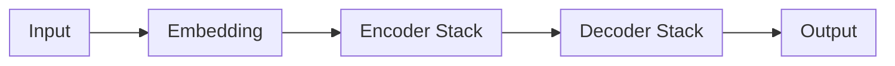
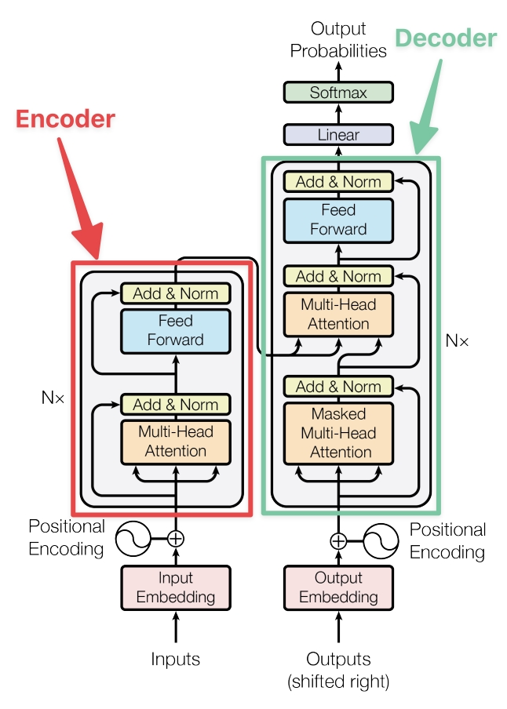
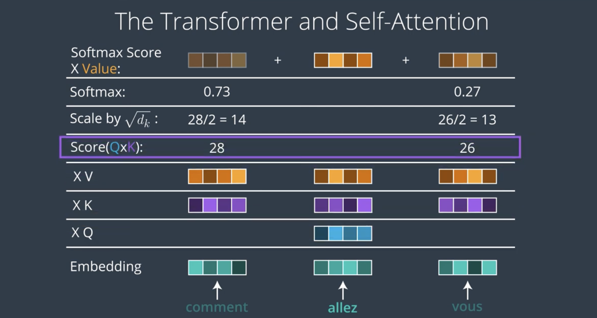
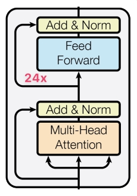

<br>
<br>

# C-3: Introduction to Transformers

<br>
<br>

Transformers revolutionized how computers process language and other sequential data. Think of it like having multiple
readers looking at a book simultaneously, where each reader focuses on different parts of the text and can instantly
connect related information, no matter how far apart it appears. Unlike older models (like RNNs and LSTMs) that read
text word by word like a human, Transformers can look at an entire sequence at once through a mechanism called
"attention." This attention mechanism allows the model to weigh the importance of different words in relation to each
other, similar to how we understand that "the dog chased its tail" connects "its" to "dog"automatically. The real power
comes from having multiple "attention heads" that can each focus on different types of relationships in the text
simultaneously - some might focus on grammar, others on subject-object relationships, and others on broader context.
This parallel processing and ability to handle long-range dependencies made Transformers the foundation for powerful
language models like BERT and GPT.

Transformers are a type of neural network architecture introduced in the paper "Attention is All You Need" (Vaswamalan
et al., 2017). Originally introduced in 2017 by Google researchers led by Ashish Vaswani, transformer models are a type
of neural network architecture. They are designed to process sequential data (e.g., words in a sentence), such as
natural language text. But here is why transformer models are revolutionary - they use a self-attention mechanism.

This self-attention mechanism allows them to focus on different parts of the input sequence and adjust their importance
when making predictions about the output. In contrast Recurring Neural Networks (RNNs)/ Long Short-Term Memory (LSTM)/
Gated recurrent units (GRUs) are other types of Neural Networks that process a sequence one element at a time. Unlike
self-attention, RNNs process the sequence in a linear fashion, with each element being processed sequentially based on
its position in the sequence. As a result, these have a limited attention span and cannot “remember” the context from an
earlier part of the sequence or conversation. Let’s see this with a visual.

While LSTMs have been very effective in handling sequential data, they do have some limitations:

Limited attention span - They struggle to capture long term dependencies in sequences as they maintain a limited amount
of information in memory. Computation efficiency - LSTMs are computationally expensive to train. Handling multiple
sequences - LSTMs are designed to handle one sequence at a time.

Transformers overcome all these limitations of LSTM by using self-attention and parallel processing. Transformer models
have been shown to achieve state-of-the-art performance on a wide range of NLP tasks, including:

- language translation
- text generation
- question answering
- sentiment analysis
- named-entity recognition

This has led to their widespread adoption in industry and academia, and they are now the dominant approach for many NLP
applications. Their impact has been particularly significant in the development of large-scale language models, such as
Bidirectional Encoder Representation Transformer (BERT), and Generative Pre-trained Transformer (GPT), which have
revolutionized the field of NLP across a wide range of tasks.

#### Attention Mechanism

Attention mechanism in neural networks works like human attention - imagine you're at a busy party trying to focus on
one conversation. Even though you hear many voices, you focus on specific speakers while being aware of others. In
neural networks, attention allows the model to focus on relevant parts of the input data while processing information.
Instead of treating all input equally, it "pays attention" to the most important parts for the current task, just like
how you focus on specific speakers at the party while still maintaining awareness of your surroundings.

Think of attention like a smart highlighter when reading a complex document. When you see the word "it" in a sentence
like "The cat chased the mouse until it got tired," your brain automatically figures out what "it" refers to by paying
attention to relevant words in the sentence. In neural networks, attention works similarly: for each word being
processed, the mechanism calculates a score (like a relevance score) for how much it should "focus" on every other word
in the sequence. These scores are then converted into weights (using softmax), creating a weighted sum of all words'
representations, where higher weights mean more attention is paid to those words. So when processing "it" in our
example, the model might assign higher attention weights to "cat" and "mouse," helping it understand which one "it"
refers to, just like how our brain connects these references naturally.

#### Components



1. **Encoder**

    - Multiple identical layers
    - Each layer has:
        - Multi-head attention
        - Feed-forward network
        - Layer normalization
        - Residual connections

2. **Decoder**
    - Similar to encoder but with additional layer
    - Components:
        - Masked multi-head attention
        - Encoder-decoder attention
        - Feed-forward network

#### Architecture

Transformers are a type of deep learning architecture that has become increasingly popular in natural language
processing (NLP) tasks such as language translation and text generation. Transformers were introduced in a 2017 paper
titled "Attention Is All You Need" by Vaswani et al., and have since become a cornerstone of many state-of-the-art NLP
models.

At a high level, the transformer architecture consists of an encoder and a decoder. The encoder takes in a sequence of
input tokens and produces a sequence of hidden representations The decoder takes in the encoder's output and generates a
sequence of output tokens. The key innovation of transformers is the use of self-attention mechanisms, which allow the
model to selectively focus on different parts of the input sequence when computing the hidden representations.

The self-attention mechanism works by computing attention weights between each input token and all other input tokens
and using these weights to compute a weighted sum of the input token embeddings. The attention weights are computed
using a softmax function applied to the dot product of a query vector, a key vector, and a scaling factor. The query
vector is derived from the previous layer's hidden representation, while the key and value vectors are derived from the
input embeddings. The resulting weighted sum is fed into a multi-layer perceptron (MLP) to produce the next layer's
hidden representation. More specifically, given an input sequence of length L, the encoder can be represented by a
series of L identical layers, each consisting of a self-attention mechanism and a feedforward neural network:

$$\text{EncoderLayer}(x) = \text{LayerNorm}(x + \text{SelfAttention}(x) + \text{FeedForward}(x))$$

<br>

<div align="center">
<p>

</p>
<p>figure: Transformer Architecture Overview</p>
</div>

<br>

##### Key, Value, and Query

Let's try to understand the Key, Value, and Query before discussing the Decoder.

The key, value, and query vectors are used in the self-attention mechanism to help the model selectively attend to
different parts of the input sequence.

- Key: You can think of the key vectors as a set of reference points the model uses to decide which parts of the input
  sequence are important.
- Value: The value vectors are the actual information that the model associates with each key vector.
- Query: Query vectors are used to determine how much attention to give to each key-value pair. Example: imagine you are
  trying to summarize a long article. The key vectors could represent the most important

sentences or phrases in the article, while the value vectors could represent the actual content of those sentences. The
query vectors would then be used to decide which of these key-value pairs are most relevant to the task of
summarization.

The self-attention mechanism works by computing a dot product between the query vector and each key vector, which
produces a set of attention weights that indicate how much attention to give to each value vector. The resulting
weighted sum of the value vectors represents the attended information for that particular query. In summary, key, value,
and query vectors are used in transformers to help the model focus on important parts of the input sequence and produce
more accurate and relevant output.

##### Mathematics behind Transformers

The mathematics behind transformers can be quite complex, but at a high level, it involves matrix multiplications, dot
products, and non-linear activations. The key equations for the self-attention mechanism can be expressed as follows:

$$\text{Attention}(Q,K,V) = \text{softmax}(\frac{QK^T}{\sqrt{d_k}})V$$

where Q, K, and V are the query, key, and value matrices, respectively, and $d_k$ is the dimension of the key vectors.
The softmax function is applied row-wise to the dot product of Q and K, which produces a set of attention weights that
are used to weight the values in V. The output of the self-attention mechanism is then given by:

$$\text{MultiHead}(Q,K,V) = \text{Concat}(\text{head}_1,...,\text{head}_h)W^O$$

<br>

<div align="center">
<p>

</p>
<p>figure: Self-Attention Mechanism</p>
</div>

<br>

##### Decoder

The decoder is similar to the encoder but also includes an additional attention mechanism that allows it to attend to
the encoder's output. Overall, the transformer architecture has several advantages over previous NLP models. First, it
is highly parallelizable, which makes it more efficient to train on modern hardware. Second, it does not rely on any
explicit notion of sequence order, which allows it to better capture long-term dependencies in the input sequence.
Finally, the attention mechanisms allow the model to selectively attend to different parts of the input sequence, which
helps it handle tasks such as language translation where the input and output sequences may have different lengths.

#### Key Features

- Based entirely on attention mechanisms
- Eliminates recurrence and convolutions
- Enables parallel processing
- Better handling of long-range dependencies

#### Key Mechanisms

##### Multi-Head Attention

```python
def multihead_attention(query, key, value, num_heads):
    # Split processing into h heads
    attention_per_head = []
    for i in range(num_heads):
        head = scaled_dot_product_attention(
            Q=query,
            K=key,
            V=value
        )
        attention_per_head.append(head)
    return concatenate(attention_per_head)
```

##### Formula

$$\text{Attention}(Q,K,V) = \text{softmax}(\frac{QK^T}{\sqrt{d_k}})V$$

##### Positional Encoding

- Adds position information to embeddings
- Uses sine and cosine functions:

$$PE_{(pos,2i)} = \sin(\frac{pos}{10000^{2i/d_{model}}})$$ $$PE_{(pos,2i+1)} = \cos(\frac{pos}{10000^{2i/d_{model}}})$$

#### Training Process

1. Input Processing

    - Tokenization
    - Embedding
    - Positional encoding

2. Loss Calculation

    ```python
    loss = cross_entropy(predictions, targets)
    ```

3. Optimization
    - Adam optimizer
    - Learning rate with warmup

#### Training Techniques

1. Label Smoothing
2. Dropout
3. Layer Normalization
4. Residual Connections

#### Advanced Concepts

##### Self-Attention

- Allows input to attend to itself
- Formula: $$\text{SelfAttention}(X) = \text{Attention}(XW^Q, XW^K, XW^V)$$

##### Cross-Attention

- Connects encoder and decoder
- Used in encoder-decoder attention layer

#### Practical Applications

1. Machine Translation
2. Text Generation
3. Document Summarization
4. Question Answering

#### Implementation Example

```python
class TransformerModel(nn.Module):
    def __init__(self, num_layers, d_model, num_heads):
        self.encoder = TransformerEncoder(num_layers, d_model)
        self.decoder = TransformerDecoder(num_layers, d_model)
        self.attention = MultiHeadAttention(num_heads, d_model)

    def forward(self, src, tgt):
        enc_output = self.encoder(src)
        dec_output = self.decoder(tgt, enc_output)
        return dec_output
```

#### Variants and Improvements

1. BERT

    - Bidirectional encoder
    - Pre-training + Fine-tuning

2. GPT

    - Decoder-only architecture
    - Autoregressive training

3. T5
    - Text-to-text framework
    - Unified approach to NLP tasks

#### Performance

##### Advantages

- Parallel processing
- Better long-range dependencies
- Scalable architecture

##### Limitations

- Quadratic complexity
- High memory requirements
- Position encoding limitations

#### Optimization Strategies

```python
# Learning rate schedule
def get_lr(step, d_model, warmup_steps):
    return d_model ** (-0.5) * min(
        step ** (-0.5),
        step * warmup_steps ** (-1.5)
    )
```

#### Basic Components

##### Query, Key, and Value (QKV)

```python
# Basic attention mechanism
def attention(query, key, value):
    # Computing attention scores
    scores = dot_product(query, key) / sqrt(key_dimension)
    # Softmax to get attention weights
    weights = softmax(scores)
    # Final attention output
    output = weights * value
```

- **Query (Q)**: What we're looking for
- **Key (K)**: What we're comparing against
- **Value (V)**: The actual information we want to extract

##### Types of Attention

###### Self-Attention

- Each element in a sequence attends to all other elements
- Formula: $$\text{Attention}(Q,K,V) = \text{softmax}(\frac{QK^T}{\sqrt{d_k}})V$$

###### Multi-Head Attention

```python
def multi_head_attention(query, key, value, num_heads=8):
    # Split into heads
    heads = []
    for i in range(num_heads):
        head = attention(
            linear_transform(query),
            linear_transform(key),
            linear_transform(value)
        )
        heads.append(head)
    return concatenate(heads)
```

###### Scaled Dot-Product Attention

- Scaling factor: $\sqrt{d_k}$ prevents vanishing gradients
- More stable training behavior

```python
scores = torch.matmul(Q, K.transpose(-2, -1)) / math.sqrt(d_k)
attention = torch.softmax(scores, dim=-1)
output = torch.matmul(attention, V)
```

#### Benefits

1. Handles variable-length sequences
2. Captures long-range dependencies
3. Enables parallel processing
4. Provides interpretable weights

#### Applications

##### Machine Translation

- Source language attention
- Target language generation

##### Document Summarization

- Focus on key sentences
- Context-aware processing

#### Advanced Concepts

##### Masked Attention

- Used in decoder self-attention
- Prevents looking at future tokens

```python
mask = torch.triu(torch.ones(seq_len, seq_len), diagonal=1).bool()
scores = scores.masked_fill(mask, float('-inf'))
```

##### Cross-Attention

- Connects encoder and decoder
- Enables sequence-to-sequence tasks

#### Common Issues and Solutions

##### Memory Complexity

- Quadratic with sequence length
- Solutions:
    - Sparse attention
    - Linear attention
    - Local attention

#### Implementation Tips

1. Proper initialization
2. Gradient clipping
3. Layer normalization
4. Residual connections

#### Code Example

```python
class AttentionLayer(nn.Module):
    def __init__(self, d_model, num_heads):
        super().__init__()
        self.d_model = d_model
        self.num_heads = num_heads
        self.head_dim = d_model // num_heads

        self.q_linear = nn.Linear(d_model, d_model)
        self.k_linear = nn.Linear(d_model, d_model)
        self.v_linear = nn.Linear(d_model, d_model)
        self.out_linear = nn.Linear(d_model, d_model)

    def forward(self, query, key, value, mask=None):
        batch_size = query.size(0)

        # Linear transformations and reshape
        Q = self.q_linear(query).view(batch_size, -1, self.num_heads, self.head_dim)
        K = self.k_linear(key).view(batch_size, -1, self.num_heads, self.head_dim)
        V = self.v_linear(value).view(batch_size, -1, self.num_heads, self.head_dim)

        # Scaled dot-product attention
        scores = torch.matmul(Q, K.transpose(-2, -1)) / math.sqrt(self.head_dim)
        if mask is not None:
            scores = scores.masked_fill(mask == 0, float('-inf'))
        attention = torch.softmax(scores, dim=-1)

        # Apply attention to values
        output = torch.matmul(attention, V)
        output = output.reshape(batch_size, -1, self.d_model)
        return self.out_linear(output)
```

##### Q#1: You are working on a natural language processing project and you are considering using a transformer model

for your task. What is multi-head attention and how does it help improve the performance of a transformer model?

**Options:**

1. Multi-head attention is the ability of the transformer model to process multiple input sequences simultaneously,
   allowing it to handle longer sequences more effectively.

2. ✅ Multi-head attention is a technique for allowing the model to focus on different parts of the input sequence at
   different levels of abstraction, allowing it to capture more complex relationships between the words.

3. Multi-head attention is a mechanism for combining information from different layers of the model, allowing it to
   leverage information from multiple levels of abstraction.

**Correct Answer:** Option 2

**Explanation:**

Multi-head attention is a mechanism for allowing the model to focus on different parts of the input sequence at
different levels of abstraction. This can help it capture more complex relationships between words in a sentence. It
will allow the model to attend to multiple parts of the input sequence simultaneously, so multi-head attention can help
it handle longer sequences more effectively.

Multi-head attention works by:

1. **Multiple Attention Perspectives**

    - Creates multiple sets of Query (Q), Key (K), and Value (V) matrices
    - Each head learns different aspects of relationships
    - Formal representation: $$\text{MultiHead}(Q,K,V) = \text{Concat}(\text{head}_1,...,\text{head}_h)W^O$$

2. **Parallel Processing**

    ```textmate
    def multi_head_attention(query, key, value, num_heads):
        # Split into heads
        Q = split_into_heads(query, num_heads)
        K = split_into_heads(key, num_heads)
        V = split_into_heads(value, num_heads)

        # Calculate attention for each head
        attention_per_head = []
        for i in range(num_heads):
            attention_per_head.append(
                scaled_dot_product_attention(Q[i], K[i], V[i])
            )

        return concatenate_heads(attention_per_head)
    ```

3. **Benefits**
    - Captures different types of relationships
    - Models both local and global dependencies
    - Improves model's understanding of context
    - Enhances feature representation

Why other options are incorrect:

1. Option 1 is incorrect because:

    - Multi-head attention isn't about processing multiple sequences
    - It's about multiple viewpoints of the same sequence

2. Option 3 is incorrect because:
    - Confuses multi-head attention with skip connections
    - Layer information combination is a different mechanism

The key advantage is the model's ability to:

- Learn multiple types of relationships simultaneously
- Capture both fine and coarse-grained patterns
- Process information at different representation subspaces

#### Transformer Architecture Benefits

##### Faster to Train

The replacement of recurrent cells with feedforward networks improves the parallelization of Transformers. Current
high-performance computing systems are designed to work well with this type of parallelization.

##### Better Performance

Transformers offer better performance than RNNs across most natural language tasks. Therefore, we can use them to solve
new problems.

##### Versatility

The Transformer architecture can move between different domains like NLP and Computer Vision.

#### BERT

BERT (Bidirectional Encoder Representations from Transformers) is a Machine Learning (ML) model for natural language
processing developed by Google in 2018. BERT is a versatile model that can handle a range of natural language processing
(NLP) tasks, including but not limited to:

- Sentiment analysis
- Named entity recognition
- Question answering
- Language inference
- Text classification
- Paraphrasing
- Text summarization
- Machine translation
- Language modeling
- Text completion
- Entity linking
- Coreference resolution

BERT's ability to perform well on these tasks makes it a valuable tool for many NLP applications.

##### BERT Architecture

The above table provides some key specifications of two different versions of the BERT model: BERTbase and BERTlarge.

<br>

<div align="center">
<p>

</p>
<p>figure: BERT Model Architecture</p>
</div>

<br>

Transformer Layers: This refers to the number of transformer layers in the BERT model. Transformer layers are a key
component of BERT and are responsible for processing the input text. Hidden Size: This refers to the number of hidden
units in each layer of the BERT model. This is an important parameter as it determines the capacity of the model to
learn complex patterns in the input data.

Attention Heads: This refers to the number of attention heads used in each transformer layer. Attention heads are
responsible for computing the attention scores between different parts of the input sequence, which allows the model to
focus on the most relevant parts of the input. Parameters: This refers to the total number of parameters in the BERT
model. The number of parameters is directly proportional to the complexity of the model and determines how well it can
fit the training data.

##### Finetune BERT

First, we need to import all the necessary packages. We will use the datasets library to load data and functions to
compute metrics. From HuggingFace's transformers package, we will import tokenizers, trainers, and models for sentence
classification.

```python
from datasets import load_dataset
from transformers import AutoTokenizer
from transformers import AutoModelForSequenceClassification
from transformers import TrainingArguments, Trainer
import numpy as np
from datasets import load_metric
```

Next, we will define some functions to compute our metrics and tokenize our sentences.

```python
def compute_metrics(eval_pred):
    logits, labels = eval_pred
    predictions = np.argmax(logits, axis=-1)
    return metric.compute(predictions=predictions, references=labels)

def tokenize_function(examples):
    return tokenizer(examples["text"], padding="max_length", truncation=True)
```

Now, we can load and preprocess our dataset. Remember that we will use the datasets package to load data. The datasets
package has many inbuilt datasets available, and you can find a list here

The tokenizer we select needs to be the same as the model we are using. There are many pre-trained models available in
transformers and you can find a list of them here. In the code below, you can see that I am using the bert-base-cased
model. Once we have selected the model, we need to tokenize our dataset. I have also added code to use a small subset of
the data to make training faster. However, you may choose to use the whole dataset by uncommenting the last two lines.

```python
tokenizer = AutoTokenizer.from_pretrained("bert-base-cased")
tokenized_datasets = raw_datasets.map(tokenize_function, batched=True)

small_train_dataset = tokenized_datasets["train"].shuffle(seed=42).select(range(1000))
small_eval_dataset = tokenized_datasets["test"].shuffle(seed=42).select(range(1000))

# full_train_dataset = tokenized_datasets["train"]
# full_eval_dataset = tokenized_datasets["test"]
```

Now that we have written our data preprocessing code, we can download our model and start to train it. We will use the
AutoModelForSequenceClassification API to fetch the pre-trained bert-base-cased model. We also need to specify the
number of classes in our data. Finally, we can train and evaluate the model using a Trainer object.

```python
model = AutoModelForSequenceClassification.from_pretrained("bert-base-cased", num_labels=<your labels>)
metric = load_metric("accuracy")

training_args = TrainingArguments("test_trainer", evaluation_strategy="epoch")

trainer = Trainer(
    model=model,
    args=training_args,
    train_dataset=small_train_dataset,
    eval_dataset=small_eval_dataset,
    compute_metrics=compute_metrics,
)
trainer.train()
trainer.evaluate()
```

Note: Fine-tuning BERT takes a long time (even on GPUs), hence we are not providing a workspace for this demo. Please
try this on your local machine.

##### Learning and Processing

To achieve its remarkable performance, BERT utilizes the following components:

###### Extensive training data

BERT was trained on a colossal dataset of 3.3 billion words, which is one of the main factors that contributed to its
success. Specifically, it was trained on two vast datasets: Wikipedia (about 2.5 billion words) and Google's BooksCorpus
(about 800 million words). By using these vast and varied datasets, BERT gained a deep understanding of natural
language.

###### MLM (Masked Language Modeling)

MLM is a technique used by BERT to learn about the relationships between words in a sentence. In this process, BERT is
trained to predict what a masked word should be based on the other words in the sentence.

Example: Let's say we have the following sentence: "The cat sat on the [MASK]".

During pre-training, BERT may randomly mask one of the words in the sentence. In this case, let's say BERT masks the
word "mat". The sentence would then look like this: "The cat sat on the [MASK]".

BERT is then trained to predict what the masked word should be based on the other words in the sentence. In this case,
the correct answer is "mat". By considering the other words in the sentence, such as "cat" and "sat", BERT is able to
make an educated guess that the missing word is "mat". This process is repeated many times over with different sentences
and different masked words, allowing BERT to learn about the relationships between words in a sentence and build a deep
understanding of language.

###### NSP (Next Sentence Prediction)

NSP is another technique used by BERT during pre-training to help it better understand the overall structure and flow of
language. In this process, BERT is trained to predict whether two sentences are likely to appear together in a piece of
text.

Example: Let's say we have two sentences:

"The cat sat on the mat." "It was a beautiful day outside." During pre-training, BERT may be given these two sentences
and asked to predict whether they are likely to appear together in a piece of text. In this case, the answer would be
"no" since the two sentences do not seem to be related to each other.

BERT is trained using many different pairs of sentences, some of which are related and some of which are not. By
learning to predict whether pairs of sentences are related or not, BERT gains a better understanding of the overall
structure and flow of language.

This technique is important because it helps BERT understand the context in which sentences appear, which is crucial for
many natural language processing tasks such as question answering and text classification.

#### GPT

GPT, or Generative Pre-trained Transformer, is an advanced autoregressive language model built on the transformer
architecture, which leverages self-attention mechanisms for efficiently handling long-range dependencies in sequence
data. The primary goal of GPT models is to predict the next token in a given sequence by learning a probability
distribution over a vast vocabulary. This is achieved through unsupervised pre-training on large-scale text corpora,
followed by fine-tuning on specific tasks to generate human-like text, perform translation, answer questions, and more.

The evolution of GPT began with GPT-1, which demonstrated the potential of unsupervised pre-training followed by
task-specific fine-tuning. GPT-2, the successor, utilized a much larger dataset and model size, leading to substantially
improved performance across various NLP tasks. However, its release was initially limited due to concerns about
potential misuse. GPT-3 took the concept further, scaling up to 175 billion parameters and introducing the "few-shot
learning" paradigm, which allowed the model to perform tasks with very limited task-specific training data.

GPT-4 builds upon the advancements of its predecessors, featuring an even larger model size and enhanced pre-training
techniques. This latest iteration benefits from architectural improvements, such as sparsity and attention mechanisms
that facilitate more efficient training and inference. GPT-4's greater capacity enables it to learn more sophisticated
language patterns and generate higher-quality output across a broader range of tasks. Additionally, GPT-4 can be
fine-tuned with smaller datasets, making it a powerful tool for specialized applications in various domains. Despite its
impressive capabilities, GPT-4 still faces challenges in controlling generated content, ensuring factual accuracy, and
mitigating biases present in training data.

<br>
<div align="center">
<p>

</p>
<p>figure: BERT Pre-training Process</p>
</div>
<br>

#### HuggingFace

Hugging Face is an open-source company that provides NLP tools and models for developers and researchers. Learn more at
their website. Their flagship product is the Hugging Face Transformers library, which is a Python-based framework for
building, training, and deploying state-of-the-art NLP models. Explore the library on GitHub Hugging Face Transformers
provides pre-trained models for a variety of NLP tasks, such as text classification, question answering, machine
translation, and text generation. Check out their model hub to browse pre-trained models.

The library allows developers to quickly and easily integrate powerful NLP models into their applications using a simple
API for loading pre-trained models. See the documentation for more details. The library includes a range of tools for
fine-tuning models on custom datasets, making it easy to adapt models to specific tasks. Hugging Face has a large and
active community that provides support, documentation, and a range of resources to help developers and researchers get
the most out of the library. Join the community on their forums. In addition to pre-trained models and tools, Hugging
Face also provides datasets, evaluation metrics, and benchmarking tools for NLP. Explore their datasets and evaluation
tools on their website. Hugging Face is a valuable resource for anyone working with NLP models, whether you are a
developer looking to integrate models into your applications or a researcher looking to explore the state of the art in
NLP. See how Hugging Face models have been used in various applications on their blog.

#### Pre-trained Models

Pre-trained models are already trained on vast amounts of data and have learned to perform well on a wide range of NLP
tasks. This saves a lot of time and resources that would otherwise be spent on data collection, pre-processing, and
model training.

Hugging Face provides access to a large collection of pre-trained models for various NLP tasks, which are continually
updated and improved. This allows developers and researchers to choose the best model for their specific use case and
avoid the risk of building a suboptimal model from scratch. The Hugging Face Transformers library provides a simple API
for loading and using pre-trained models, making it easy to integrate them into custom applications without requiring
deep knowledge of NLP or machine learning.
