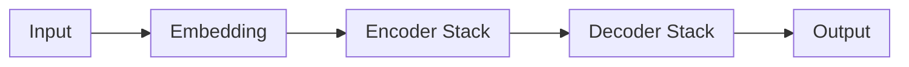

<br>
<br>

# C-3: Introduction to Transformers

<br>
<br>

1. Transformer Fundamentals and Innovations
    - From RNNs/LSTMs to Transformers: Key Differences
    - Parallel Processing Advantage
    - Self-Attention Mechanism
    - Architecture Overview
2. The Attention Mechanism
    - Key, Value, and Query Concept
    - Self-Attention Mathematics
    - Multi-Head Attention
    - Scaled Dot-Product Attention
3. Transformer Architecture Components
    - Encoder Structure and Function
    - Decoder Structure and Function
    - Positional Encoding
    - Feed-Forward Networks and Layer Normalization
4. Major Transformer-Based Models
    - BERT (Bidirectional Encoder Representations from Transformers)
    - GPT (Generative Pre-trained Transformer)
    - Applications and Capabilities
5. Practical Implementation and Training
    - Transformer Training Techniques
    - Fine-Tuning Pre-Trained Models
    - HuggingFace and Model Access
    - Code Examples and Best Practices

#### Transformer Fundamentals and Innovations

##### From RNNs/LSTMs to Transformers: Key Differences

Transformers represent a fundamental paradigm shift in how neural networks process sequential data. Unlike their
predecessors (RNNs and LSTMs), which process information sequentially and maintain internal states, Transformers employ
a radically different approach that addresses several critical limitations of recurrent architectures.

The most fundamental difference between RNNs/LSTMs and Transformers is their processing approach. RNNs and LSTMs process
data sequentially, element by element (such as word by word in a sentence), with each element's processing dependent on
the completed processing of all previous elements. This sequential nature creates a computational bottleneck that limits
parallelization. In contrast, Transformers process the entire sequence simultaneously, attending to all elements at once
through their self-attention mechanism.

RNNs and LSTMs maintain hidden states that serve as the network's memory, carrying information forward through the
sequence. This state-based memory creates implicit connections between distant elements but suffers from the vanishing
gradient problem, where information from earlier in the sequence gradually fades as it's passed through many time steps.
Transformers eliminate this hidden state entirely, replacing it with direct connections between all positions in the
sequence through self-attention. This approach allows for explicit modeling of dependencies regardless of distance.

A defining characteristic of RNNs/LSTMs is their inherent sequential nature, which creates a temporal dependency chain.
Each element's processing must wait for all previous elements to be processed, making these networks challenging to
parallelize effectively. Transformers break this chain completely, as their architecture permits all sequence positions
to be processed simultaneously. This design choice dramatically improves training efficiency on modern hardware like
GPUs and TPUs.

RNNs and LSTMs inherently model sequences with a strong positional bias—elements that are closer to the current position
have a stronger influence than distant ones due to how information flows through the hidden state. Transformers remove
this intrinsic bias, treating all positions equally through self-attention. To maintain awareness of position,
Transformers add explicit positional encodings to input embeddings, giving the model information about the sequence
order while still allowing equal access to all positions.

For instance, in a sentence like "The cat, which was sleeping on the mat, jumped suddenly when the dog barked," an LSTM
might struggle to maintain the connection between "cat" and "jumped" due to the intervening clause. A Transformer,
however, can directly attend to "cat" when processing "jumped," regardless of distance, making it better at handling
long-range dependencies.

This architectural shift from sequential processing with implicit memory to parallel processing with direct attention
has enabled Transformers to outperform RNNs and LSTMs across a wide range of NLP tasks, particularly those involving
long sequences or complex dependencies.

##### Parallel Processing Advantage

The parallel processing capability of Transformers represents one of their most significant advantages over recurrent
models, fundamentally changing how sequential data can be processed by neural networks.

In traditional RNNs and LSTMs, computation happens sequentially—each token's processing depends on the completed
processing of all previous tokens. This creates a computational dependency chain that cannot be parallelized within a
sequence. For example, when processing a sentence, the computation for the fifth word cannot begin until the computation
for the fourth word is complete, which in turn depends on the third word, and so on. This sequential bottleneck
significantly limits training speed and scalability.

Transformers break this dependency chain through their self-attention mechanism. Rather than processing tokens one after
another, Transformers compute attention scores for all tokens simultaneously. This means that for a sentence with 100
words, a Transformer can process all 100 words in parallel rather than one at a time. The mathematical formulation
behind this is the attention matrix calculation:

$$\text{Attention}(Q,K,V) = \text{softmax}(\frac{QK^T}{\sqrt{d_k}})V$$

This single matrix operation computes attention weights for all sequence positions simultaneously, enabling massive
parallelization.

The practical impact of this parallelization is profound. Training time for large models decreases
significantly—operations that would take days or weeks with recurrent architectures can be completed in hours with
Transformers. This efficiency has enabled the development of increasingly larger models like BERT, GPT, and T5, which
would be prohibitively expensive to train with recurrent architectures.

The parallel nature of Transformers also aligns perfectly with modern hardware accelerators like GPUs and TPUs, which
are designed for massive parallel computation. These devices can process thousands of operations simultaneously, but
their power is underutilized by sequential models like RNNs. Transformers leverage the full computational capability of
these accelerators, achieving orders of magnitude faster training and inference.

This parallelization extends beyond just the self-attention mechanism. The entire Transformer architecture is designed
for parallel processing—each sub-layer within the encoder and decoder can operate independently on all sequence
positions at once. Even the multi-head attention mechanism further enhances parallelism by allowing different "heads" to
focus on different aspects of the sequence simultaneously.

The impact of this parallel processing advantage extends beyond just speed—it has enabled researchers to train larger
models on more data, leading to significant advances in model capability and performance. Models like GPT-3 with 175
billion parameters would simply not be feasible without the parallelism afforded by the Transformer architecture.

This shift to parallel processing represents a fundamental rethinking of how neural networks can handle sequential data,
moving away from the assumption that sequential data must be processed sequentially. By processing all elements of a
sequence in parallel while using attention to maintain awareness of relationships between elements, Transformers achieve
both efficiency and effectiveness.

##### Self-Attention Mechanism

The self-attention mechanism stands as the core innovation of Transformer models, fundamentally changing how neural
networks can process sequential information. Unlike convolutional or recurrent operations, self-attention allows each
position in a sequence to directly interact with every other position, creating a rich, context-aware representation for
each element.

At its heart, self-attention operates on a simple yet powerful principle: determining how much each position in a
sequence should "attend to" every other position. This is accomplished through the interaction of three vectors derived
from each position's representation: queries (Q), keys (K), and values (V).

The process begins by transforming each input element into three different vectors—a query, a key, and a value—through
linear projections (matrix multiplications):

- **Query (Q)**: What the current position is looking for
- **Key (K)**: What the other positions have to offer
- **Value (V)**: The actual information at each position

For each position's query, the model calculates how well it matches with every position's key (including its own)
through a dot product operation, resulting in attention scores. These scores are then scaled, softmaxed to create a
probability distribution, and used to weight the corresponding value vectors. The weighted sum of these values becomes
the output of the self-attention layer for that position.

Mathematically, this process is represented as:

$$\text{Attention}(Q,K,V) = \text{softmax}(\frac{QK^T}{\sqrt{d_k}})V$$

The scaling factor $\sqrt{d_k}$ (where $d_k$ is the dimension of the key vectors) is crucial for stable training,
preventing the softmax function from entering regions with extremely small gradients when dot products grow large.

This mechanism enables several powerful capabilities:

1. **Direct long-range dependencies**: Unlike RNNs where information from distant tokens must pass through intermediate
   states, self-attention allows direct interaction between any two positions, regardless of their distance in the
   sequence.
2. **Dynamic focus**: The attention weights are computed dynamically based on the content of the sequence, allowing the
   model to focus on relevant parts of the input for each specific task and context.
3. **Interpretable relationships**: The attention weights reveal which parts of the input are being focused on when
   generating each output element, providing a degree of interpretability.

The true power of self-attention becomes even more apparent with multi-head attention, where multiple sets of queries,
keys, and values are learned in parallel. Each "head" can focus on different aspects of the sequence—some might attend
to syntactic relationships, others to semantic relationships, and others to specific linguistic patterns. These
different perspectives are then combined to create a rich representation that captures multiple types of relationships
simultaneously.

For example, in processing the sentence "The animal didn't cross the street because it was too wide," some attention
heads might focus on linking "it" to "street" (understanding what "it" refers to), while others might focus on the
relationship between "cross," "street," and "wide" (understanding the causality).

Self-attention also handles variable-length inputs naturally, as each position attends to all other positions regardless
of sequence length. This flexibility, combined with its powerful representational capability and computational
efficiency, has made self-attention the foundation for state-of-the-art performance across numerous natural language
processing tasks.

##### Architecture Overview

The Transformer architecture integrates its innovative components into a cohesive design that balances expressiveness,
computational efficiency, and trainability. Understanding this architecture provides insight into how Transformers
achieve their remarkable performance across various tasks.

At a high level, the original Transformer consists of an encoder-decoder structure, though many modern variants use only
the encoder (like BERT) or only the decoder (like GPT). This modular design allows flexibility in applying Transformers
to different tasks.

**The Encoder Stack**

The encoder processes the input sequence and converts it into a continuous representation that captures the contextual
relationships within the data. It consists of N identical layers (typically 6 in the original paper), each containing
two main sub-layers:

1. **Multi-Head Self-Attention**: This layer allows each position to attend to all positions in the previous layer,
   capturing relationships between different elements of the sequence.
2. **Position-wise Feed-Forward Network**: A simple fully connected network applied to each position independently,
   consisting of two linear transformations with a ReLU activation in between:
   $$\text{FFN}(x) = \max(0, xW_1 + b_1)W_2 + b_2$$

Each sub-layer is followed by a residual connection and layer normalization. The residual connections help with training
deeper networks by providing shortcuts for gradient flow, while layer normalization stabilizes the learning process by
normalizing the activations.

**The Decoder Stack**

The decoder generates output sequences element by element, using both the encoder's output and previously generated
elements. Like the encoder, it consists of N identical layers, but each layer has three sub-layers:

1. **Masked Multi-Head Self-Attention**: Similar to the encoder's self-attention but with masking to prevent positions
   from attending to future positions, ensuring the model can only use previously generated outputs.
2. **Multi-Head Encoder-Decoder Attention**: This layer allows each position in the decoder to attend to all positions
   in the encoder's output, connecting the decoder to the input sequence.
3. **Position-wise Feed-Forward Network**: Identical to the one in the encoder.

As in the encoder, each sub-layer is followed by residual connections and layer normalization.

**Additional Components**

Several other components complete the architecture:

1. **Embeddings**: Input tokens are converted to vectors of dimension d_model through learned embeddings.
2. **Positional Encodings**: Since the model contains no recurrence or convolution, positional encodings are added to
   the embeddings to provide information about the position of tokens in the sequence. These are typically sine and
   cosine functions of different frequencies: $$PE_{(pos,2i)} = \sin(pos/10000^{2i/d_{model}})$$
   $$PE_{(pos,2i+1)} = \cos(pos/10000^{2i/d_{model}})$$
3. **Final Linear and Softmax Layer**: In the decoder, a linear transformation followed by a softmax function converts
   the decoder output to probabilities over the output vocabulary.

**Information Flow**

The flow of information through a Transformer is distinctly different from recurrent models:

1. Input tokens are embedded and combined with positional encodings.
2. The encoder processes these inputs in parallel, with each layer updating the representations based on attention to
   all positions.
3. The decoder receives the encoder's output and, for each output position, attends to all encoder positions and all
   previous decoder positions.
4. Each output token is generated based on this rich contextual information.

This architecture delivers several key advantages:

- **Parallelization**: Most operations can be performed simultaneously across all sequence positions.
- **Flexible attention**: Each position can attend differently to all other positions, capturing complex relationships.
- **Modularity**: The encoder and decoder components can be used independently or together depending on the task.
- **Scalability**: The architecture scales effectively with more layers and wider dimensions.

These architectural choices have made Transformers the foundation for most state-of-the-art models in natural language
processing and increasingly in other domains like computer vision, audio processing, and reinforcement learning.

#### The Attention Mechanism

##### Key, Value, and Query Concept

The key, value, and query concept forms the foundation of the attention mechanism in Transformers, borrowing ideas from
information retrieval systems to create a powerful framework for modeling relationships between elements in a sequence.
Understanding this concept is crucial for grasping how attention works.

In traditional information retrieval, when you search for information (your query) in a database, the system matches
your query against keys (like index terms) to determine which documents or information (values) are most relevant.
Transformer attention adapts this paradigm to neural networks.

In the attention mechanism, every position in the input sequence generates three vectors through learned linear
transformations:

1. **Query vectors (Q)**: Think of these as "questions" that each position asks to find relevant information from other
   positions. The query represents what a position is looking for or needs to know.
2. **Key vectors (K)**: These are like "identifiers" that indicate what information each position contains or offers.
   Keys are matched against queries to determine relevance.
3. **Value vectors (V)**: These contain the actual information or content at each position that will be aggregated based
   on the query-key relevance. Values represent what a position actually contributes to other positions.

When a position in the sequence (with its query) wants to gather information, it "asks" every position (checking their
keys) how relevant they are, and then collects their values weighted by this relevance.

To illustrate this with a concrete example, let's consider how this works in a sentence like "The cat sat on the mat
because it was comfortable."

When the Transformer processes the word "it", the system needs to figure out what "it" refers to. In this process:

- The query vector for "it" represents the model asking, "What am I referring to?"
- The key vector for each word in the sentence represents how likely that word is to be referenced by other words.
- The value vector for each word contains the semantic information about that word that would be useful to other words.

The query for "it" would likely have a high compatibility with the keys for "cat" and "mat" (the potential referents).
The attention scores would determine which is more likely the referent (probably "cat" in this case), and the model
would then incorporate the value vector from "cat" more heavily when constructing the contextualized representation of
"it".

This mechanism provides several advantages:

1. **Dynamic context modeling**: The relevance between positions is computed dynamically based on content rather than
   being fixed by position or structure.
2. **Content-based interactions**: Words interact based on their meaning and relevance, not just their position in the
   sequence.
3. **Flexible information routing**: Information can flow directly between any two positions without going through
   intermediate steps.
4. **Interpretable attention patterns**: The weights from query-key matching reveal which parts of the input are being
   focused on, providing some interpretability.

The mathematical implementation of this concept involves three weight matrices (Wᵠ, Wᵏ, Wᵛ) that transform the input
embeddings into queries, keys, and values. These matrices are learned during training, allowing the model to discover
which types of queries, keys, and values are most useful for the task at hand.

The key-value-query concept provides the Transformer with a remarkably flexible and powerful way to model relationships
between elements in a sequence, going beyond the fixed patterns captured by convolutional and recurrent networks, and
enabling the rich contextual understanding that has made these models so effective across a wide range of natural
language tasks.

##### Self-Attention Mathematics

The mathematical formulation of self-attention provides a precise understanding of how Transformers process sequential
data. While the key-value-query concept explains the intuition behind attention, the mathematics reveals how these
components interact to create powerful representations.

At its core, self-attention is a weighted sum operation, where the weights are determined by the compatibility between
queries and keys. Let's walk through the complete mathematical process:

Given an input sequence of n tokens with embedding dimension d, represented as a matrix X ∈ ℝⁿˣᵈ, the self-attention
mechanism proceeds as follows:

1. **Linear projections** to obtain queries, keys, and values:

    Q = XW^Q where W^Q ∈ ℝᵈˣᵈᵏ

    K = XW^K where W^K ∈ ℝᵈˣᵈᵏ

    V = XW^V where W^V ∈ ℝᵈˣᵈᵛ

    Here, d_k and d_v are the dimensions of the key/query and value vectors, respectively. Often, d_k = d_v = d/h, where
    h is the number of attention heads.

2. **Compute attention scores** by taking the dot product of queries with all keys:

    S = QK^T ∈ ℝⁿˣⁿ

    This results in an n×n matrix where each entry S_ij represents how much the i-th position should attend to the j-th
    position.

3. **Scale the attention scores** to prevent extremely small gradients when d_k is large:

    S_scaled = S / √d_k

    This scaling factor stabilizes gradients during training, especially for large values of d_k.

4. **Apply softmax** to obtain attention weights:

    A = softmax(S_scaled) ∈ ℝⁿˣⁿ

    The softmax function is applied row-wise, ensuring that the attention weights for each position sum to 1. This
    creates a probability distribution over all positions for each query.

5. **Compute the weighted sum** of values according to the attention weights:

    Output = AV ∈ ℝⁿˣᵈᵛ

    This gives us the final output of the self-attention layer, where each position's representation is a weighted sum
    of all value vectors, with weights determined by the attention scores.

Combining these steps, the complete self-attention formula is:

$$\text{Attention}(Q,K,V) = \text{softmax}(\frac{QK^T}{\sqrt{d_k}})V$$

This seemingly simple formula encapsulates the power of self-attention. Let's consider what happens mathematically when
processing our example sentence "The cat sat on the mat because it was comfortable":

When computing attention for the word "it", its query vector is compared with the key vectors of all words in the
sentence through dot products. Words that are semantically relevant (like "cat") will likely have keys that align well
with the query for "it", resulting in higher dot products and thus higher attention scores after softmax normalization.
This means the value vector for "cat" will contribute more strongly to the output representation for "it".

The self-attention mechanism also has some interesting properties from a mathematical perspective:

1. **Permutation equivariance**: The output of self-attention is equivariant to permutations of the input sequence when
   positional encodings are not included. This means the model doesn't inherently know about sequence order, making
   positional encodings necessary.
2. **Computational complexity**: The attention matrix multiplication has a time and space complexity of O(n²), where n
   is the sequence length. This quadratic scaling is one of the main computational bottlenecks of Transformers for very
   long sequences.
3. **Gradient flow**: The direct connections between any two positions allow gradients to flow without attenuation,
   helping to address the vanishing gradient problem that affects recurrent networks.
4. **Parallel computation**: All the matrix multiplications can be performed in parallel across the entire sequence,
   enabling efficient implementation on modern hardware.

The mathematical formulation of self-attention elegantly captures the notion of dynamic, content-based interaction
between elements in a sequence, providing the foundation for the Transformer's ability to model complex relationships in
sequential data.

##### Multi-Head Attention

Multi-head attention represents a powerful extension to the basic self-attention mechanism, allowing Transformers to
jointly attend to information from different representation subspaces at different positions. This enables the model to
capture various types of relationships simultaneously, significantly enhancing its modeling capacity.

The core insight behind multi-head attention is that using a single attention function limits the model's ability to
focus on different aspects of the input. By projecting the queries, keys, and values into multiple independent subspaces
and applying separate attention functions, the model can capture different relationship patterns in parallel.

Mathematically, multi-head attention is formulated as follows:

$$\text{MultiHead}(Q, K, V) = \text{Concat}(\text{head}_1, \text{head}_2, ..., \text{head}_h)W^O$$

Where each attention head is computed as:

$$\text{head}_i = \text{Attention}(QW^Q_i, KW^K_i, VW^V_i)$$

In this formulation:

- h is the number of attention heads (typically 8 to 16)
- W^Q_i, W^K_i, W^V_i are head-specific parameter matrices that project the input into different subspaces
- W^O is an output projection matrix that combines the outputs from all heads
- Concat represents the concatenation of the outputs from each head

The dimensionality of each projection is typically d_k = d_v = d/h, where d is the model dimension. This ensures the
computational cost of multi-head attention remains similar to that of single-head attention with full dimensionality.

The power of multi-head attention can be understood through several perspectives:

1. **Multiple viewpoints**: Each head learns to focus on different aspects of the relationships between tokens. For
   example, in language processing:
    - Some heads might focus on syntactic relationships (subject-verb agreement)
    - Others might attend to semantic relationships (word sense disambiguation)
    - Some might track coreference (linking pronouns to their antecedents)
    - Others might focus on phrase-level or sentence-level structures
2. **Ensemble effect**: By combining multiple independent attention mechanisms, multi-head attention creates an
   ensemble-like effect, making the model more robust and expressive.
3. **Increased representation power**: The multiple projections allow the model to attend to different subspace
   representations of the same tokens, capturing more nuanced relationships than would be possible with a single
   attention function.

Let's illustrate with our example sentence, "The cat sat on the mat because it was comfortable":

With multi-head attention, when processing the word "it":

- One head might strongly focus on "cat" as the likely referent (coreference relationship)
- Another head might attend to "sat" to understand the action context (verb-pronoun relationship)
- Another might attend to "comfortable" to capture the causal relationship
- Yet another might focus on "because" to understand the logical structure

These diverse attention patterns are then combined to create a rich, multi-faceted representation of the word "it" in
context.

Analysis of trained Transformer models has revealed fascinating specializations among attention heads. Researchers have
found heads that consistently track specific linguistic phenomena, such as:

- Heads that attend primarily to the previous or next word (capturing local context)
- Heads that link articles to their corresponding nouns
- Heads that connect verbs to their subjects across intervening words
- Heads that follow coreference chains through pronouns

This heterogeneity of attention patterns across heads allows Transformers to model the complex, multi-layered nature of
language structure and meaning. The model doesn't need to encode all relevant context into a single attention pattern
but can distribute different aspects of the task across specialized heads.

The multi-head mechanism has proven so effective that it has become a standard component not just in language models but
in Transformer applications across other domains like computer vision, time series analysis, and computational biology.

##### Scaled Dot-Product Attention

Scaled dot-product attention represents the mathematical core of the Transformer's attention mechanism, combining
simplicity, efficiency, and effectiveness. This specific formulation of attention addresses several key challenges in
designing attention mechanisms for deep learning models.

The complete formula for scaled dot-product attention is:

$$\text{Attention}(Q, K, V) = \text{softmax}(\frac{QK^T}{\sqrt{d_k}})V$$

Let's break down each component of this formula to understand why it's designed this way:

1. **Dot-Product Attention (QK^T)**: The compatibility between queries and keys is measured using a dot product. For
   each query vector q_i and key vector k_j, their dot product q_i·k_j produces a scalar that represents how well they
   align. This operation can be efficiently implemented as a matrix multiplication between Q and the transpose of K.

    The dot product has several advantages as a compatibility function:

    - Computational efficiency (can be implemented as highly optimized matrix multiplication)
    - Parameter efficiency (requires no additional learned parameters)
    - Effective at capturing similarity in high-dimensional spaces

2. **Scaling Factor (1/√d_k)**: The critical innovation in scaled dot-product attention is the scaling factor. As the
   dimensionality of the query and key vectors (d_k) increases, the variance of their dot products also increases. This
   can lead to regions where the softmax function has extremely small gradients, slowing down learning.

    The scaling factor 1/√d_k normalizes the dot products to have approximately unit variance, assuming the components
    of q and k have mean 0 and variance 1. This ensures the softmax operates in a regime with reasonable gradients,
    making training more stable.

3. **Softmax Function**: Applying softmax to the scaled dot products converts them into a probability distribution over
   all keys for each query:

    $$\text{softmax}(x_i) = \frac{e^{x_i}}{\sum_j e^{x_j}}$$

    This ensures that attention weights for each query sum to 1, allowing the model to focus on the most relevant keys
    while still potentially distributing attention across multiple positions.

4. **Value Aggregation (·V)**: The final step multiplies the attention weights by the value vectors and sums them. This
   weighted aggregation allows each position to collect information from all other positions, with emphasis determined
   by the attention weights.

The entire operation can be visualized as a weighted message-passing system where each position collects information
from all other positions, with the weights determined dynamically based on content.

Let's work through a simplified numerical example to illustrate how scaled dot-product attention works:

Consider a tiny sequence with just 3 tokens and embedding dimension d_k = 4:

```
Q = [[1, 0, 1, 0],    # Query for token 1
     [0, 1, 0, 1],    # Query for token 2
     [1, 1, 0, 0]]    # Query for token 3

K = [[1, 0, 1, 0],    # Key for token 1
     [0, 1, 0, 1],    # Key for token 2
     [1, 0, 0, 1]]    # Key for token 3

V = [[0.5, 0.6],      # Value for token 1
     [0.8, 0.2],      # Value for token 2
     [0.1, 0.4]]      # Value for token 3
```

Step 1: Compute dot products QK^T:

```
QK^T = [[2, 0, 1],
        [0, 2, 1],
        [1, 1, 1]]
```

Step 2: Apply scaling factor 1/√d_k = 1/2:

```
QK^T/√d_k = [[1.0, 0.0, 0.5],
             [0.0, 1.0, 0.5],
             [0.5, 0.5, 0.5]]
```

Step 3: Apply softmax to get attention weights:

```
softmax(QK^T/√d_k) ≈ [[0.57, 0.21, 0.22],
                       [0.21, 0.57, 0.22],
                       [0.33, 0.33, 0.33]]
```

Step 4: Multiply by values to get outputs:

```
Output = [[0.57×0.5 + 0.21×0.8 + 0.22×0.1, 0.57×0.6 + 0.21×0.2 + 0.22×0.4],
          [0.21×0.5 + 0.57×0.8 + 0.22×0.1, 0.21×0.6 + 0.57×0.2 + 0.22×0.4],
          [0.33×0.5 + 0.33×0.8 + 0.33×0.1, 0.33×0.6 + 0.33×0.2 + 0.33×0.4]]

       ≈ [[0.46, 0.45],
          [0.56, 0.32],
          [0.46, 0.40]]
```

This example shows how token 1 attends more to itself and token 3, token 2 attends more to itself and token 3, and token
3 attends equally to all tokens. The final output for each token is a weighted combination of all value vectors, with
weights determined by the attention mechanism.

Scaled dot-product attention has become the standard attention mechanism not just in Transformers but in many other
attention-based architectures due to its efficiency, effectiveness, and mathematical elegance. The scaling factor, in
particular, was a key innovation that enabled the training of deeper Transformer models with multiple attention heads,
contributing significantly to their success across various domains.

#### Transformer Architecture Components

##### Encoder Structure and Function

The encoder forms a critical half of the Transformer architecture, serving as the component that processes and
contextualizes the input sequence. Unlike encoders in recurrent neural networks that process tokens sequentially, the
Transformer encoder processes the entire sequence in parallel, while still capturing the relationships between all
elements.

The Transformer encoder consists of a stack of identical layers, typically six in the original architecture. Each layer
performs two main operations: multi-head self-attention followed by a position-wise feed-forward network. These
operations are wrapped with residual connections and layer normalization, creating a structure that allows for effective
information flow and stable training.

When an input sequence enters the encoder, it first passes through an embedding layer that converts each token (like a
word) into a dense vector representation. These embeddings are then combined with positional encodings to incorporate
information about the position of each token in the sequence. This combined representation serves as the input to the
first encoder layer.

Within each encoder layer, the first sub-layer is the multi-head self-attention mechanism. This is where the magic of
Transformers happens—each position in the sequence can attend to all positions in the previous layer. For the first
layer, this means attending to all positions in the input embeddings. The self-attention mechanism allows each token to
gather information from all other tokens, with attention weights determining how much information to collect from each
position.

For example, in the sentence "The dog, which has brown fur, chased the cat," when processing the word "chased," the
self-attention mechanism might put high attention weights on "dog" (to identify the subject) and lower weights on less
relevant words like "the" or "brown." This creates a contextual representation of "chased" that incorporates information
about who is doing the chasing.

After the self-attention mechanism, each position's output passes through a position-wise feed-forward network. This is
a simple neural network applied identically to each position independently. The feed-forward network typically consists
of two linear transformations with a ReLU activation in between:

$$\text{FFN}(x) = \max(0, xW_1 + b_1)W_2 + b_2$$

This feed-forward network allows the model to transform the representations further, introducing non-linearity and
increasing the model's capacity to learn complex patterns. Since it operates on each position independently, it can be
thought of as a way for the model to process the information gathered by the attention mechanism.

Both the self-attention sub-layer and the feed-forward network sub-layer employ residual connections. The output of each
sub-layer is LayerNorm(x + Sublayer(x)), where Sublayer(x) represents the function implemented by the sub-layer itself.
These residual connections help with training deep networks by providing direct pathways for gradient flow during
backpropagation.

As the input progresses through the stack of encoder layers, the representations become increasingly refined. Each layer
can capture different levels of linguistic or semantic information—lower layers might focus on more syntactic features,
while higher layers might capture more abstract semantic relationships.

The final output of the encoder stack is a sequence of vectors, one for each input position. These vectors contain rich
contextual information that captures the relationships between the token at that position and all other tokens in the
sequence. In a machine translation task, these vectors would then be passed to the decoder to generate the translation.
In other applications like BERT, which uses only the encoder portion of the Transformer, these final encoder outputs
might be directly used for tasks like classification or sequence labeling.

The Transformer encoder's ability to process all positions in parallel while still capturing dependencies between them
represents a significant advancement over previous sequential architectures. This parallel processing enables much
faster training and inference, while the self-attention mechanism allows for modeling complex relationships between
distant elements in the sequence, addressing the limitations of recurrent and convolutional approaches.

##### Decoder Structure and Function

The Transformer decoder complements the encoder by taking the encoded representations and generating an output sequence.
While the encoder processes the entire input sequence in parallel, the decoder operates in an autoregressive manner,
generating one token at a time while considering both the encoder's output and the previously generated tokens.

Like the encoder, the decoder consists of a stack of identical layers (typically six in the original architecture).
However, each decoder layer contains three sub-layers instead of two: a masked multi-head self-attention mechanism, a
multi-head attention mechanism that attends to the encoder's output, and a position-wise feed-forward network.

When generating a sequence, the decoder starts with a special "start of sequence" token. The decoder then generates each
subsequent token one at a time, feeding each new token back into the decoder to generate the next one, until a special
"end of sequence" token is produced or a maximum length is reached.

The first sub-layer in each decoder layer is a masked multi-head self-attention mechanism. This is similar to the
self-attention in the encoder, but with a critical difference: it includes masking to prevent positions from attending
to subsequent positions. This masking ensures that the prediction for position i can depend only on the known outputs at
positions less than i. For example, when generating the third word in a translation, the decoder can only look at the
first and second words it has already generated, not at future words it hasn't produced yet.

The masking is implemented by setting attention scores for illegal connections to negative infinity before the softmax
operation, effectively zeroing out these attention weights. This masking transforms the self-attention mechanism into a
causal attention mechanism that preserves the autoregressive property essential for sequence generation.

The second sub-layer is a multi-head attention mechanism that performs cross-attention between the decoder's
representations and the encoder's outputs. Each position in the decoder attends to all positions in the encoder,
allowing the decoder to incorporate information from the entire input sequence when generating each output token.

This cross-attention mechanism serves as the bridge between the encoder and decoder. For each position in the decoder:

- The query vectors come from the previous decoder sub-layer
- The key and value vectors come from the encoder's output

This allows each decoder position to focus on relevant parts of the input sequence. For example, in a translation task,
when generating the word "chat" (cat in French), the cross-attention mechanism might focus heavily on the encoder
positions corresponding to the word "cat" in the English input.

After the cross-attention, each decoder position passes through a position-wise feed-forward network identical to the
one used in the encoder. As in the encoder, both the self-attention and cross-attention sub-layers employ residual
connections followed by layer normalization, with the feed-forward network doing the same.

At the top of the decoder stack, a linear transformation followed by a softmax function converts the decoder's output
vectors into probabilities over the vocabulary. The token with the highest probability is selected as the next generated
token (during inference) or used to compute the loss (during training).

The decoder's autoregressive nature creates a trade-off. While it enables the model to generate coherent sequences by
conditioning each token on previously generated ones, it also introduces a sequential dependency that prevents the
parallelization of the generation process during inference. This is why Transformer inference for generation tasks like
translation or text generation is slower than the encoding process, which can be fully parallelized.

Despite this limitation, the Transformer decoder remains remarkably powerful due to its ability to attend directly to
any part of the input sequence and any previously generated tokens, without the information bottlenecks present in
recurrent architectures. The combination of self-attention, cross-attention, and feed-forward processing creates a
flexible architecture that can handle complex sequence-to-sequence tasks while maintaining computational efficiency
during training.

##### Positional Encoding

Positional encoding addresses a fundamental limitation of the Transformer architecture: its inherent lack of information
about the order of elements in a sequence. Unlike recurrent neural networks, which process tokens sequentially and
inherently track position, Transformers process all positions in parallel. This parallelization is a key advantage for
computational efficiency, but it means the model has no built-in sense of position or order.

Without some form of positional information, a Transformer would treat a sequence as an unordered set of tokens, which
would be problematic for tasks where order matters—which includes almost all language tasks. For example, the sentences
"John saw Mary" and "Mary saw John" contain exactly the same tokens but have different meanings because of their order.

To address this, positional encodings are added to the input embeddings at the bottom of the encoder and decoder stacks.
These encodings have the same dimension as the embeddings, allowing them to be summed directly with the embeddings
before being fed into the first attention layer.

In the original Transformer paper, the authors used sine and cosine functions of different frequencies to create these
positional encodings:

$$PE_{(pos,2i)} = \sin\left(\frac{pos}{10000^{2i/d_{model}}}\right)$$

$$PE_{(pos,2i+1)} = \cos\left(\frac{pos}{10000^{2i/d_{model}}}\right)$$

Where:

- $pos$ is the position of the token in the sequence (0, 1, 2, ...)
- $i$ is the dimension index (0, 1, 2, ..., d_model/2)
- $d_{model}$ is the embedding dimension

This formulation might look complex, but it creates a specific pattern of values across the embedding dimensions for
each position. For even dimensions, a sine function is used; for odd dimensions, a cosine function is used. The
frequency of these sine/cosine waves decreases as i increases, meaning different dimensions encode position information
at different scales.

This approach has several elegant properties:

1. **Uniqueness**: Each position gets a unique encoding, allowing the model to distinguish between different positions.
2. **Fixed offset relationship**: For any fixed offset k, the positional encoding at position pos+k can be represented
   as a linear function of the encoding at position pos. This means the model can potentially learn to attend to
   relative positions easily.
3. **Boundedness**: The values are bounded between -1 and 1, making them well-behaved when added to the embeddings.
4. **Deterministic**: No parameters need to be learned, simplifying the model.
5. **Extrapolation**: The sinusoidal pattern can theoretically extend to sequences longer than those seen during
   training, though in practice, performance may degrade.

Let's visualize what these positional encodings look like. If we were to plot the values across the embedding dimensions
for different positions, we would see wave patterns of varying frequencies. The first few dimensions would show
high-frequency waves that change rapidly as position changes, while later dimensions would show lower-frequency waves
that change more slowly.

When these positional encodings are added to the token embeddings, they effectively "tag" each token with its position
information. As the combined embeddings flow through the self-attention layers, the model can learn to use this
positional information to understand the sequence structure.

While the sinusoidal positional encoding was used in the original Transformer, other approaches have been explored:

1. **Learned positional embeddings**: Instead of using a fixed function, the positional embeddings can be learned during
   training. This approach has been used in models like BERT.
2. **Relative positional encoding**: Rather than encoding absolute positions, some models encode the relative distance
   between tokens, which can be more effective for certain tasks.
3. **Rotary position embedding (RoPE)**: A more recent approach that encodes relative position by rotating the token
   embeddings in a way that mathematically simplifies attention calculation.

Positional encoding is a crucial component that enables Transformers to understand sequence order despite their parallel
processing nature. It demonstrates how a relatively simple modification—adding fixed patterns to the input—can solve a
fundamental limitation of the architecture, allowing Transformers to effectively process ordered sequences while
maintaining their computational advantages.

##### Feed-Forward Networks and Layer Normalization

The feed-forward networks and layer normalization components might seem less glamorous than attention mechanisms, but
they play crucial roles in the Transformer architecture's effectiveness. These components address specific challenges in
deep learning and contribute significantly to the model's representational power and training stability.

**Position-wise Feed-Forward Networks**

Each encoder and decoder layer in a Transformer contains a position-wise feed-forward network (FFN). The term
"position-wise" indicates that the same feed-forward network is applied independently to each position's representation.
Mathematically, it's defined as:

$$\text{FFN}(x) = \max(0, xW_1 + b_1)W_2 + b_2$$

This is essentially a two-layer neural network with a ReLU activation function between the layers. While simple in
structure, this component serves several important functions:

1. **Increased model capacity**: The FFN introduces non-linearity and additional parameters, increasing the model's
   capacity to learn complex patterns. In the original Transformer, the inner layer of the FFN has a dimension of 2048
   (compared to the model dimension of 512), creating a wide layer that can represent diverse transformations.
2. **Position-specific processing**: While the attention mechanism aggregates information across positions, the FFN
   processes each position independently, allowing the model to apply position-specific transformations to the
   representations.
3. **Feature transformation**: The FFN can be viewed as transforming the features that were aggregated by the attention
   mechanism, analogous to how convolutional neural networks combine spatial aggregation (convolution) with point-wise
   transformations.

The position-wise nature of the FFN means it's effectively a 1x1 convolution over the sequence length, processing each
position's features without sharing information across positions. This separation of concerns—with attention handling
cross-position interactions and FFNs handling position-wise transformations—creates an elegant and effective
architecture.

**Layer Normalization**

Layer normalization is applied after each sub-layer in both the encoder and decoder, following the residual connection.
It normalizes the activations of the previous layer for each given example across all features, applying a
transformation of the form:

$$\text{LayerNorm}(x) = \gamma \odot \frac{x - \mu}{\sqrt{\sigma^2 + \epsilon}} + \beta$$

Where:

- $\mu$ and $\sigma$ are the mean and standard deviation computed across the feature dimension
- $\gamma$ and $\beta$ are learnable parameters of the same dimension as $x$
- $\epsilon$ is a small constant added for numerical stability

Layer normalization serves several critical purposes in the Transformer:

1. **Training stability**: Normalization helps control the scale of activations as they flow through the deep network,
   preventing exploding or vanishing gradients and allowing for more stable training.
2. **Reduced covariate shift**: By normalizing activations, layer normalization reduces the internal covariate shift
   (changes in the distribution of layer inputs during training), potentially enabling higher learning rates and faster
   convergence.
3. **Independence from batch size**: Unlike batch normalization, layer normalization computes statistics across features
   rather than across batch examples, making it effective even with small or variable batch sizes.
4. **Consistent behavior**: The normalization process creates more consistent behavior across different sequence lengths
   and positions, helping the model generalize better.

**Residual Connections**

Both the attention sub-layers and the feed-forward networks are wrapped with residual connections. In the notation of
the original paper, the output of each sub-layer is:

$$\text{LayerNorm}(x + \text{Sublayer}(x))$$

Where Sublayer(x) represents either the self-attention mechanism or the feed-forward network. These residual connections
serve multiple purposes:

1. **Gradient flow**: They create direct paths for gradients to flow backward through the network, mitigating the
   vanishing gradient problem in deep models.
2. **Information preservation**: Residual connections allow original information to flow unchanged through the network,
   helping preserve important features that might otherwise be lost through multiple transformations.
3. **Ease of optimization**: Networks with residual connections are empirically easier to optimize, often converging
   faster and to better solutions.

The combination of residual connections and layer normalization is particularly effective. The residual connection
allows information to bypass the sub-layer entirely if needed, while layer normalization ensures the combined signal has
a controlled scale, preventing the accumulation of extremely large values through the deep network.

Together, the feed-forward networks, layer normalization, and residual connections complement the attention mechanisms
in the Transformer, addressing different aspects of the learning challenge. The attention mechanisms provide the ability
to model relationships between positions, while these components enhance representational capacity, ensure stable and
effective training, and enable the construction of very deep models. Their thoughtful integration demonstrates how
seemingly mundane architectural details can be crucial to the success of deep learning models.

#### Major Transformer-Based Models

##### BERT (Bidirectional Encoder Representations from Transformers)

BERT, introduced by researchers at Google in 2018, represents a watershed moment in natural language processing. While
previous models processed text in a unidirectional manner (either left-to-right or right-to-left), BERT's innovation was
to apply the Transformer architecture to create truly bidirectional representations where each word is influenced by all
other words in the sentence, regardless of their position.

At its core, BERT consists solely of the encoder portion of the Transformer architecture. The original BERT model came
in two sizes: BERT-base (12 layers, 768 hidden units, 12 attention heads, 110 million parameters) and BERT-large (24
layers, 1024 hidden units, 16 attention heads, 340 million parameters). This substantial size allowed BERT to capture
intricate patterns and relationships in language data.

BERT's training process involves two innovative pre-training tasks that help it learn general language understanding
before being fine-tuned for specific applications:

The first task, Masked Language Modeling (MLM), involves randomly masking 15% of the tokens in each sequence and
training the model to predict these masked tokens. This forces BERT to develop a deep understanding of context in both
directions. For example, in the sentence "The cat sat on the [MASK]," BERT must use both the preceding context ("The cat
sat on the") and any following context to predict the masked word.

The second task, Next Sentence Prediction (NSP), trains BERT to understand relationships between sentences. The model
receives pairs of sentences and must predict whether the second sentence actually follows the first in the original
text. This helps BERT understand discourse relationships and coherence across sentences.

These pre-training tasks are performed on an enormous corpus of text – 3.3 billion words from Wikipedia and BooksCorpus
– giving BERT extensive exposure to language patterns before it tackles specific tasks.

After pre-training, BERT can be fine-tuned for a wide range of NLP tasks by adding a simple output layer and training on
task-specific data. This transfer learning approach allows BERT to achieve state-of-the-art results with relatively
small amounts of task-specific training data.

What makes BERT particularly powerful is its bidirectional nature. Unlike previous models that processed text in one
direction, BERT's attention mechanism allows each word to attend to all other words in the sentence during processing.
This bidirectionality captures contextual nuances more effectively. For instance, in "The bank by the river is eroding"
versus "The bank approved my loan," BERT can disambiguate the word "bank" by attending to relevant context words in both
directions.

BERT's impact on the field was immediate and profound. It dramatically improved performance on a wide range of NLP
benchmarks, including question answering (Stanford Question Answering Dataset), natural language inference (MultiNLI),
and sentiment analysis. Many tasks saw improvements of 7-10% over previous state-of-the-art results, representing one of
the largest single jumps in NLP performance history.

The success of BERT spawned numerous variants and refinements. RoBERTa, developed by Facebook AI, improved on BERT by
modifying key hyperparameters and training on more data. ALBERT, created by Google Research, introduced
parameter-sharing techniques to create more efficient models. DistilBERT, developed by Hugging Face, created a smaller,
faster version that retained 97% of BERT's performance while using 40% fewer parameters.

BERT's architecture and training approach have become foundational to modern NLP, establishing the paradigm of
pre-training large language models on vast amounts of text data and then fine-tuning them for specific tasks. This
approach has become standard practice in the field, with BERT serving as the blueprint for many subsequent models.

##### GPT (Generative Pre-trained Transformer)

The Generative Pre-trained Transformer (GPT) series, developed by OpenAI, represents a fundamentally different approach
to Transformer-based models compared to BERT. While BERT focuses on bidirectional understanding using the encoder
architecture, GPT models are built on the decoder architecture and process text in a unidirectional, autoregressive
manner—generating one token at a time while considering only the previous context.

The GPT series began with the original GPT model in 2018, followed by progressively larger and more capable versions:
GPT-2 (2019), GPT-3 (2020), and GPT-4 (2023). Each iteration has dramatically scaled up model size and capabilities,
with GPT-3 containing 175 billion parameters and GPT-4's exact parameter count remaining undisclosed but estimated to be
substantially larger.

The architecture of GPT models consists of multiple layers of the Transformer decoder, with a key modification: they use
only the self-attention mechanism from the decoder, without the encoder-decoder attention component found in the
original Transformer. This self-attention is masked to ensure each token can only attend to prior tokens in the
sequence, preserving the autoregressive property required for text generation.

GPT's training approach differs significantly from BERT's. Rather than using explicit tasks like masked language
modeling, GPT models are trained with a straightforward autoregressive language modeling objective: predicting the next
token in a sequence given all previous tokens. This seemingly simple task forces the model to develop a deep
understanding of language patterns, grammar, factual knowledge, reasoning, and even specialized domains like coding or
mathematics.

The training process occurs in two phases. First, there's unsupervised pre-training on a massive corpus of text from the
internet and books. For GPT-3, this corpus contained hundreds of billions of words. Second, the model undergoes various
forms of fine-tuning and alignment to make it more helpful, accurate, and safe. Recent GPT models incorporate
reinforcement learning from human feedback (RLHF), where human preferences are used to refine the model's outputs.

What makes GPT models particularly remarkable is their emergent capabilities. As these models have scaled up, they've
demonstrated abilities that weren't explicitly trained for. GPT-3 showed surprising few-shot learning capabilities—it
could perform new tasks given just a few examples in the prompt, without any parameter updates. GPT-4 has further
advanced these capabilities, showing strong performance on complex reasoning tasks, coding challenges, and even
standardized exams.

The unidirectional nature of GPT might seem like a limitation compared to BERT's bidirectionality, but it enables a
crucial capability: open-ended text generation. GPT models can continue a given prompt with coherent, contextually
appropriate text of arbitrary length. This generative power enables applications that go far beyond what bidirectional
models can do, including creative writing, code generation, conversational agents, content summarization, and
translation.

For example, given the prompt "Write a short story about a robot who discovers emotions," a GPT model can generate an
entire original narrative with character development, plot, and thematic elements. Similarly, it can write functional
code given natural language descriptions of the desired functionality, or engage in back-and-forth conversations that
maintain context over many turns.

GPT's impact has extended far beyond academic NLP. GPT-3 and GPT-4, through applications like ChatGPT, have brought
advanced natural language processing to millions of users across diverse domains including education, programming,
business, creative writing, and personal assistance. This widespread adoption has sparked discussions about the societal
implications of powerful language models, including their educational impact, potential for misuse, and questions of AI
alignment with human values.

The evolution of the GPT series illustrates a key trend in modern AI development: scaling laws. Researchers have
observed that predictable improvements in capabilities emerge simply by increasing model size, training data, and
computational resources. This insight has driven a race to build ever-larger models, though recent research also focuses
on making these models more efficient, controllable, and aligned with human values.

##### Applications and Capabilities

Transformer-based models like BERT and GPT have revolutionized what's possible in natural language processing and
beyond, enabling applications that were barely conceivable just a few years ago. Their impact spans numerous domains,
with capabilities that continue to expand as these models evolve.

**Natural Language Understanding Applications**

In question answering systems, Transformer models have achieved human-level performance on many benchmarks. Models like
BERT can comprehend complex questions and locate relevant information in documents, powering advanced search features in
products like Google Search. For instance, when asked "When was Marie Curie awarded her first Nobel Prize?", these
systems can extract the specific year rather than just returning documents containing the relevant keywords.

Sentiment analysis and emotion detection have been transformed by these models' contextual understanding. Unlike earlier
approaches that relied on keyword spotting or simple statistical methods, Transformer-based systems can detect subtle
expressions of sentiment, sarcasm, and emotional nuance. Financial institutions use these capabilities to monitor market
sentiment in real time, analyzing news articles, social media, and financial reports to inform investment decisions.

Named entity recognition and information extraction have reached new levels of accuracy with Transformer models. Legal
and healthcare organizations use these capabilities to automatically extract and categorize relevant information from
contracts, medical records, and research papers. For example, a pharmaceutical company might analyze thousands of
research papers to identify all mentions of specific protein interactions related to a disease pathway.

**Language Generation Applications**

Content creation and summarization tools powered by GPT and similar models can generate human-quality articles,
marketing copy, and creative writing. News organizations use them to draft initial versions of straightforward stories
like financial reports or sports recaps. These models can also condense long documents into concise summaries while
preserving key information, helping professionals manage information overload.

Conversational AI has been revolutionized by Transformer models. Unlike rule-based chatbots of the past, modern
conversational agents can maintain coherent discussions across multiple turns, remember context from earlier in the
conversation, and provide nuanced responses to complex queries. These capabilities power customer service automation,
virtual assistants, and even therapeutic applications like mental health support chatbots.

Machine translation has seen dramatic improvements through Transformer models. Systems like Google Translate now provide
more fluent, contextually accurate translations across hundreds of language pairs. The attention mechanism allows these
models to handle idiomatic expressions and maintain consistency across long passages, enabling more effective
cross-cultural communication.

**Code and Mathematical Reasoning**

Perhaps surprisingly, Transformer models have shown remarkable capabilities in programming domains. Models like GitHub
Copilot (based on GPT technology) can generate functional code from natural language descriptions, complete partially
written functions, and suggest fixes for bugs. This augments developer productivity by handling routine coding tasks and
allowing programmers to focus on higher-level problem-solving.

Mathematical reasoning was once considered beyond the reach of language models, but advanced Transformer models have
demonstrated significant capabilities here too. They can solve complex math word problems, perform step-by-step
derivations, and even assist with formal proofs. While not matching specialized mathematical systems, their ability to
combine natural language understanding with mathematical operations creates unique capabilities for education and
research assistance.

**Multimodal Applications**

The Transformer architecture has also proven highly adaptable to multimodal tasks involving both text and other data
types. Vision-language models like CLIP (Contrastive Language-Image Pre-training) can understand the relationship
between images and text, enabling applications like advanced image search, automatic captioning, and visual question
answering.

Healthcare applications of Transformer models include analyzing medical imaging alongside clinical notes, extracting
insights from electronic health records, and even assisting with diagnostic processes. For example, models can analyze
radiological images together with patient history to suggest potential diagnoses or flag cases for urgent review.

**Key Capabilities Across Applications**

Several fundamental capabilities make Transformer models so versatile across these diverse applications:

1. **Contextual understanding**: Unlike earlier models that processed words in isolation, Transformers grasp how meaning
   depends on context. The word "bank" is understood differently in "river bank" versus "investment bank" because the
   model attends to the surrounding words.
2. **Transfer learning efficiency**: Pre-trained models can be adapted to specific tasks with relatively small amounts
   of task-specific data. A model pre-trained on general language can be fine-tuned for legal document analysis with
   just thousands of legal texts, rather than millions.
3. **Few-shot and zero-shot learning**: Advanced models like GPT-3 and GPT-4 can perform entirely new tasks given just a
   few examples or even just a description of the task, without any additional training. This allows them to be flexibly
   deployed across diverse use cases.
4. **Long-range dependency handling**: The attention mechanism allows Transformers to connect related information across
   long distances in text. In a lengthy document, these models can maintain coherence and consistency, referring back to
   entities and concepts introduced many paragraphs earlier.
5. **Emergent abilities**: As these models scale up in size and training data, they demonstrate capabilities that
   weren't explicitly programmed or trained for, such as basic reasoning, following complex instructions, and even
   limited forms of planning.

Despite these impressive capabilities, Transformer models still face significant limitations, including potential for
generating inaccurate information, vulnerability to biases in training data, computational intensity, and challenges
with transparency and explainability. Ongoing research focuses on addressing these limitations while further extending
the models' capabilities across increasingly diverse applications.

The rapid evolution of these models continues to expand the boundaries of what's possible, with applications
increasingly moving beyond traditional NLP into domains requiring reasoning, creativity, and multimodal understanding.
The versatility of the Transformer architecture suggests it will remain fundamental to AI advancement for the
foreseeable future, even as new architectures build upon its innovations.

#### Practical Implementation and Training

##### Transformer Training Techniques

Training Transformer models effectively requires specialized techniques that address the unique challenges these
architectures present. From managing the computational demands of self-attention to ensuring stable learning across many
layers, these techniques have evolved through extensive research and experimentation.

The training process typically begins with careful initialization of model parameters. For Transformers, proper
initialization is particularly important due to their depth and the interaction between self-attention and feed-forward
layers. Common approaches include Xavier/Glorot initialization for linear layers and normal distribution initialization
for embedding matrices. The initialization scale is carefully chosen to prevent exploding or vanishing gradients during
the initial training steps.

Learning rate scheduling plays a crucial role in Transformer training. The original Transformer paper introduced a
specialized learning rate schedule with a warm-up period followed by decay:

```
lr = d_model^(-0.5) * min(step_num^(-0.5), step_num * warmup_steps^(-1.5))
```

This schedule increases the learning rate linearly for a fixed number of warm-up steps and then decreases it
proportionally to the inverse square root of the step number. The warm-up phase helps stabilize early training by
preventing too-large updates before the model begins to converge. Modern implementations often use simpler schedules
like linear warm-up followed by constant or linear decay, which are easier to tune yet still effective.

Batch size selection significantly impacts Transformer training dynamics. Larger batch sizes enable more stable gradient
estimates and better hardware utilization but may lead to poorer generalization. Researchers have found that gradual
batch size increase during training can provide benefits of both small and large batches. For very large models like
GPT-3, enormous effective batch sizes (sometimes millions of tokens) are achieved through gradient accumulation across
many smaller batches.

Regularization techniques help prevent overfitting and improve generalization. Dropout is extensively used in
Transformers, typically applied to attention weights, outputs of attention layers, and feed-forward networks. The
standard dropout rate in the original Transformer was 0.1, though this varies across implementations and model sizes.
For very large models, lower dropout rates (or even none) may be used as these models are less prone to overfitting due
to their capacity relative to the vast training data.

Label smoothing represents another important regularization technique. By softening the hard targets (converting a
one-hot encoded target of [0,0,1,0] to something like [0.01,0.01,0.97,0.01]), label smoothing prevents the model from
becoming too confident in its predictions. This helps create more robust models that generalize better to unseen data.
The original Transformer used a label smoothing value of 0.1.

Data preprocessing plays a vital role in effective training. Text is typically tokenized using subword tokenization
methods like Byte-Pair Encoding (BPE), WordPiece, or SentencePiece. These approaches balance vocabulary size with token
efficiency and handle out-of-vocabulary words gracefully. For instance, BPE starts with single characters and
iteratively merges the most frequent pairs to create a vocabulary of desired size.

Training stability can be improved through gradient clipping, which prevents occasional large gradient values from
destabilizing training. This is implemented by scaling down gradient norms that exceed a threshold:

```python
if grad_norm > max_norm:
    gradients = gradients * (max_norm / grad_norm)
```

Mixed precision training has become standard practice for efficient Transformer training. By using 16-bit floating-point
(FP16) or bfloat16 formats for most operations while maintaining master weights in 32-bit precision, training speed can
often double with minimal impact on accuracy. Specialized techniques like loss scaling help prevent underflow issues
with lower precision arithmetic.

Handling variable-length sequences efficiently is accomplished through batching with padding and attention masking.
Sequences are padded to the length of the longest sequence in a batch, and attention masks prevent the model from
attending to padding tokens. More sophisticated approaches include bucketing, where sequences of similar lengths are
grouped together to minimize wasted computation on padding.

For extremely large models, additional techniques become necessary. Gradient checkpointing trades computation for memory
by recomputing intermediate activations during the backward pass rather than storing them. This can reduce memory
requirements significantly at the cost of some computational overhead. Model parallelism distributes different layers
across multiple devices, while tensor parallelism splits individual operations across devices, enabling training of
models that wouldn't fit on a single GPU.

Optimizers designed specifically for large language models have emerged, with Adam and its variants (AdamW, AdaFactor)
being particularly popular. These adaptive methods handle the varying scales of gradients across different parts of the
model more effectively than simple SGD. AdaFactor specifically addresses memory constraints by approximating the second
moments using factorized matrices rather than storing the full matrix.

The evolution of these training techniques has enabled the scaling of Transformer models from the original 65 million
parameters to today's models with hundreds of billions of parameters, each step requiring innovations in how these
complex models are efficiently and effectively trained.

##### Fine-Tuning Pre-Trained Models

Fine-tuning pre-trained Transformer models has revolutionized how we develop NLP applications, dramatically reducing the
data and computational requirements for achieving state-of-the-art performance on specific tasks. This approach
leverages the linguistic knowledge and patterns captured during pre-training on vast text corpora, allowing the model to
adapt to specialized tasks with relatively little task-specific data.

The fine-tuning process begins with selecting an appropriate pre-trained model. The choice depends on several factors:
the specific task requirements, computational constraints, and the model's pre-training approach. For
understanding-focused tasks like classification, sentiment analysis, or named entity recognition, encoder models like
BERT or RoBERTa typically perform well. For generative tasks like summarization, translation, or creative writing,
decoder models like GPT or encoder-decoder models like T5 are more appropriate.

Once a model is selected, the next step involves preparing the task-specific dataset. This typically requires formatting
the data to match the model's expected input structure. For BERT-style models, this might involve creating token type
IDs to distinguish between different segments, adding special tokens like [CLS] and [SEP], and generating attention
masks. For decoder models like GPT, inputs need to be formatted as prompts that guide the model toward the desired
output format.

Adapting the model architecture for the downstream task is a critical step. This usually involves adding task-specific
layers on top of the pre-trained model. For classification tasks with BERT, this typically means adding a simple
classification head (a linear layer) on top of the [CLS] token representation. For token-level tasks like named entity
recognition, outputs for each token position are fed into a task-specific classifier. For generative tasks, the
pre-trained model might be used directly with appropriate prompting, or fine-tuned on pairs of inputs and desired
outputs.

When it comes to the actual training process, several specialized approaches have proven effective:

Progressive unfreezing can improve results by gradually allowing more of the pre-trained model to be updated. This
typically starts by freezing all pre-trained layers and training only the newly added task-specific layers. Then, the
model is gradually unfrozen from top to bottom, allowing deeper layers to adapt to the task while preserving the general
language knowledge in the lower layers. This approach can be particularly helpful with smaller datasets where aggressive
fine-tuning might lead to catastrophic forgetting of the pre-trained knowledge.

Discriminative learning rates apply different learning rates to different parts of the model. Typically, higher layers
(closer to the output) receive higher learning rates than lower layers, which contain more general language
representations that should change less. This might be implemented as a learning rate that gradually increases from
bottom to top layers:

```python
for i, layer in enumerate(model.layers):
    layer_lr = base_lr * lr_multiplier ** (num_layers - i - 1)
    optimizer.param_groups.append({'params': layer.parameters(), 'lr': layer_lr})
```

Learning rate scheduling during fine-tuning often differs from pre-training. A common approach is to use a linear
schedule with a warm-up period followed by linear decay to zero:

```python
if step < warmup_steps:
    lr = max_lr * (step / warmup_steps)
else:
    lr = max_lr * (1 - (step - warmup_steps) / (total_steps - warmup_steps))
```

Early stopping is crucial to prevent overfitting, especially with smaller datasets. Validation performance is monitored,
and training stops when this performance begins to degrade. This is particularly important because fine-tuning can
quickly lead to overfitting if continued too long.

For especially small datasets or when adapting to very specific domains, several advanced techniques have proven
effective:

Parameter-efficient fine-tuning methods modify only a small subset of the model's parameters, reducing memory
requirements and the risk of overfitting. These include:

1. Adapter layers: Small bottleneck layers inserted within the pre-trained architecture that adapt the model while
   leaving most parameters frozen.
2. Prompt tuning: Only the continuous prompt embeddings are learned while keeping the entire language model frozen.
3. LoRA (Low-Rank Adaptation): Approximates weight updates using low-rank matrices, dramatically reducing the number of
   trainable parameters.

Few-shot learning approaches use a small number of examples to guide the model without traditional gradient-based
training. This can be particularly effective with very large pre-trained models like GPT-3, which can often perform
tasks simply by seeing a few examples in the prompt.

In-context learning represents an extreme form of adaptation where no parameters are updated at all. Instead, examples
are provided within the context window to demonstrate the task, and the model generates responses based on pattern
recognition within this context. This approach works surprisingly well with large models but depends on their inherent
capabilities and prompt engineering.

Evaluating the fine-tuned model properly is essential. This involves not just measuring performance on a test set but
also considering:

1. Robustness to slight variations in input formatting
2. Performance across different subgroups in the data
3. Generalization to real-world inputs that may differ from the training distribution
4. Potential biases that might have been amplified during fine-tuning

The remarkable effectiveness of fine-tuning pre-trained Transformers has completely changed the NLP development
landscape. Tasks that once required massive datasets and computational resources can now be accomplished with modest
resources, making advanced NLP accessible to a much broader range of practitioners and applications. This paradigm has
also shifted research focus toward developing better pre-trained models and more efficient fine-tuning techniques,
rather than task-specific architectures.

##### HuggingFace and Model Access

The Hugging Face ecosystem has emerged as the de facto standard for accessing, implementing, and deploying
Transformer-based models, dramatically lowering the barriers to working with state-of-the-art NLP technology. What began
as a simple library for pre-trained models has evolved into a comprehensive platform that has transformed how
researchers and practitioners engage with natural language processing.

At the center of the Hugging Face ecosystem is the Transformers library, a Python package that provides thousands of
pre-trained models with a unified API. This standardization means that working with diverse models like BERT, GPT, T5,
or RoBERTa follows consistent patterns, allowing developers to easily experiment with different architectures. The
library handles the complexity of different model implementations, tokenization schemes, and configuration options,
presenting a clean interface for common operations.

The Model Hub represents perhaps the most valuable component of the Hugging Face ecosystem. This centralized repository
hosts over 120,000 pre-trained models contributed by the community, research labs, and companies. Models range from
general-purpose large language models to specialized models trained for specific domains (legal, medical, scientific) or
tasks (sentiment analysis, named entity recognition, summarization). Each model on the Hub includes:

1. Model weights and configuration files
2. Documentation on model architecture and training
3. Performance metrics on standard benchmarks
4. Example code for usage
5. Information about limitations and biases

This democratization of access has transformed the field by allowing anyone to use state-of-the-art models without the
massive computational resources required to train them from scratch.

Loading and using models from Hugging Face requires minimal code. The AutoModel classes automatically detect the model
architecture and load the appropriate implementation:

```python
from transformers import AutoTokenizer, AutoModelForSequenceClassification

# Load pre-trained model and tokenizer
tokenizer = AutoTokenizer.from_pretrained("distilbert-base-uncased-finetuned-sst-2-english")
model = AutoModelForSequenceClassification.from_pretrained("distilbert-base-uncased-finetuned-sst-2-english")

# Tokenize input and predict
inputs = tokenizer("I love this movie!", return_tensors="pt")
outputs = model(**inputs)
```

This simplicity has been revolutionary for the field, enabling practitioners to focus on their applications rather than
implementation details.

Beyond just accessing models, Hugging Face provides tools for the complete model lifecycle:

The Datasets library offers a standardized way to access and process hundreds of public NLP datasets. It handles
downloading, caching, and preprocessing, with memory-efficient streaming for large datasets. The library's
interoperability with popular frameworks like PyTorch and TensorFlow streamlines the workflow from data to training.

Training and fine-tuning are simplified through the Trainer API, which encapsulates best practices for training
Transformer models:

```python
from transformers import Trainer, TrainingArguments

training_args = TrainingArguments(
    output_dir="./results",
    num_train_epochs=3,
    per_device_train_batch_size=16,
    warmup_steps=500,
    weight_decay=0.01,
    logging_dir="./logs",
)

trainer = Trainer(
    model=model,
    args=training_args,
    train_dataset=train_dataset,
    eval_dataset=eval_dataset,
)

trainer.train()
```

This high-level API handles the complexity of distributed training, mixed precision, gradient accumulation, and other
advanced techniques that would otherwise require substantial implementation effort.

For deployment, Hugging Face provides multiple solutions. The Inference API offers a managed service for running models
in the cloud with a simple REST interface. For self-hosted deployments, Hugging Face Accelerated Inference offers
optimized containers for efficient model serving. The recently introduced Text Generation Inference (TGI) specifically
addresses the challenges of serving large language models efficiently, with features like continuous batching and flash
attention implementations.

The collaborative nature of the platform extends beyond model sharing. The Spaces feature allows developers to create
and share interactive demos of their models, complete with customizable web interfaces. This capability has fostered a
culture of open demonstration and benchmarking, where model capabilities and limitations can be publicly explored.

Several advanced features make Hugging Face particularly valuable for production use cases:

1. **Quantization support**: Models can be compressed through techniques like 8-bit or 4-bit quantization, dramatically
   reducing memory requirements with minimal performance impact.
2. **Model distillation**: Smaller, faster "student" models can be trained to mimic the behavior of larger "teacher"
   models, making deployment more efficient.
3. **ONNX export**: Models can be exported to the ONNX format for deployment in production environments that prioritize
   inference speed.
4. **Hardware optimization**: The library includes optimizations for various hardware accelerators, from consumer GPUs
   to specialized AI hardware.

The impact of Hugging Face extends beyond its technical offerings. By creating a collaborative ecosystem where
researchers and practitioners openly share models, datasets, and code, it has accelerated the pace of innovation in NLP.
The standardization it provides has also made benchmarking and reproducibility more straightforward, addressing
significant challenges in the research community.

For organizations building NLP applications, Hugging Face has transformed the build-vs-buy decision. Rather than facing
a binary choice between developing custom models or purchasing black-box commercial solutions, they can now leverage
open pre-trained models and focus their resources on adaptation and deployment for their specific needs.

The meteoric rise of Hugging Face—from a small library to the central hub for Transformer models—reflects both the
technical quality of its offerings and its community-centered approach. By making state-of-the-art NLP accessible to
everyone from researchers to hobbyists, it has played a pivotal role in the democratization of artificial intelligence.

##### Code Examples and Best Practices

Implementing Transformer models effectively requires not just understanding their architecture but also mastering
practical coding patterns and best practices. Let's explore concrete code examples alongside recommendations that help
ensure successful implementation, training, and deployment of these powerful models.

**Basic Model Implementation**

When implementing a Transformer from scratch, organizing the architecture into clean, modular components helps with
debugging and extension. Here's an example of implementing a multi-head attention module:

```python
import torch
import torch.nn as nn
import math

class MultiHeadAttention(nn.Module):
    def __init__(self, d_model, num_heads, dropout=0.1):
        super().__init__()
        assert d_model % num_heads == 0, "d_model must be divisible by num_heads"

        self.d_model = d_model
        self.num_heads = num_heads
        self.d_k = d_model // num_heads

        # Create single projection matrices for Q, K, V
        self.wq = nn.Linear(d_model, d_model)
        self.wk = nn.Linear(d_model, d_model)
        self.wv = nn.Linear(d_model, d_model)
        self.wo = nn.Linear(d_model, d_model)

        self.dropout = nn.Dropout(dropout)

    def forward(self, q, k, v, mask=None):
        batch_size = q.size(0)

        # Project and reshape to allow for multi-heads
        q = self.wq(q).view(batch_size, -1, self.num_heads, self.d_k).transpose(1, 2)
        k = self.wk(k).view(batch_size, -1, self.num_heads, self.d_k).transpose(1, 2)
        v = self.wv(v).view(batch_size, -1, self.num_heads, self.d_k).transpose(1, 2)

        # Compute attention scores
        scores = torch.matmul(q, k.transpose(-2, -1)) / math.sqrt(self.d_k)

        # Apply mask if provided
        if mask is not None:
            scores = scores.masked_fill(mask == 0, -1e9)

        # Apply softmax and dropout
        attention_weights = F.softmax(scores, dim=-1)
        attention_weights = self.dropout(attention_weights)

        # Apply attention weights to values
        output = torch.matmul(attention_weights, v)

        # Reshape and project back to original dimensions
        output = output.transpose(1, 2).contiguous().view(batch_size, -1, self.d_model)
        return self.wo(output)
```

**Best practice**: Separate logical components into distinct modules, implement shape checks, and include documentation
about tensor dimensions to make complex operations like attention more understandable.

**Efficient Data Processing**

Properly preparing and batching data is crucial for training efficiency. Here's an example of a dataset class that
handles tokenization and preparation of tensors for a BERT-like model:

```python
class TransformerDataset(torch.utils.data.Dataset):
    def __init__(self, texts, labels, tokenizer, max_length=512):
        self.texts = texts
        self.labels = labels
        self.tokenizer = tokenizer
        self.max_length = max_length

    def __len__(self):
        return len(self.texts)

    def __getitem__(self, idx):
        text = self.texts[idx]
        label = self.labels[idx]

        # Tokenize with padding and truncation
        encoding = self.tokenizer(
            text,
            max_length=self.max_length,
            padding='max_length',
            truncation=True,
            return_tensors='pt'
        )

        # Remove batch dimension added by tokenizer
        input_ids = encoding['input_ids'].squeeze(0)
        attention_mask = encoding['attention_mask'].squeeze(0)

        return {
            'input_ids': input_ids,
            'attention_mask': attention_mask,
            'label': torch.tensor(label, dtype=torch.long)
        }
```

**Best practice**: Pre-compute as much as possible (like tokenization) to minimize work during training loops. Use
dynamic padding within batches rather than global padding to maximize computational efficiency.

**Training Loop with Best Practices**

A well-structured training loop incorporates gradient accumulation, mixed precision, and proper evaluation:

```python
from torch.cuda.amp import autocast, GradScaler

def train(model, train_loader, val_loader, optimizer, scheduler, device, num_epochs=3,
          accumulation_steps=2, fp16=True):

    scaler = GradScaler() if fp16 else None
    model.to(device)
    best_val_loss = float('inf')

    for epoch in range(num_epochs):
        model.train()
        train_loss = 0
        optimizer.zero_grad()

        for step, batch in enumerate(train_loader):
            # Move batch to device
            input_ids = batch['input_ids'].to(device)
            attention_mask = batch['attention_mask'].to(device)
            labels = batch['label'].to(device)

            # Forward pass with optional mixed precision
            with autocast(enabled=fp16):
                outputs = model(input_ids, attention_mask=attention_mask, labels=labels)
                loss = outputs.loss / accumulation_steps

            # Backward pass with gradient scaling if using fp16
            if fp16:
                scaler.scale(loss).backward()
            else:
                loss.backward()

            train_loss += loss.item() * accumulation_steps

            # Update weights after accumulation steps
            if (step + 1) % accumulation_steps == 0:
                if fp16:
                    scaler.unscale_(optimizer)
                    torch.nn.utils.clip_grad_norm_(model.parameters(), max_norm=1.0)
                    scaler.step(optimizer)
                    scaler.update()
                else:
                    torch.nn.utils.clip_grad_norm_(model.parameters(), max_norm=1.0)
                    optimizer.step()

                optimizer.zero_grad()
                scheduler.step()

        # Validation
        model.eval()
        val_loss = 0
        with torch.no_grad():
            for batch in val_loader:
                input_ids = batch['input_ids'].to(device)
                attention_mask = batch['attention_mask'].to(device)
                labels = batch['label'].to(device)

                outputs = model(input_ids, attention_mask=attention_mask, labels=labels)
                val_loss += outputs.loss.item()

        val_loss /= len(val_loader)
        train_loss /= len(train_loader)

        print(f"Epoch {epoch+1}/{num_epochs} - Train Loss: {train_loss:.4f} - Val Loss: {val_loss:.4f}")

        # Save checkpoint if best model
        if val_loss < best_val_loss:
            best_val_loss = val_loss
            torch.save(model.state_dict(), "best_model.pt")
```

**Best practices**:

1. Use gradient accumulation to simulate larger batch sizes
2. Implement mixed precision training for efficiency
3. Apply gradient clipping to prevent exploding gradients
4. Monitor validation metrics and save checkpoints of best models
5. Use learning rate schedulers appropriate for Transformers

**Fine-Tuning with Hugging Face**

For most practical applications, leveraging Hugging Face's ecosystem is more efficient than implementing from scratch.
Here's a complete example of fine-tuning a pre-trained model for text classification:

```python
from transformers import AutoModelForSequenceClassification, AutoTokenizer
from transformers import Trainer, TrainingArguments
from datasets import load_dataset
import evaluate
import numpy as np

# Load pre-trained model and tokenizer
model_name = "distilbert-base-uncased"
model = AutoModelForSequenceClassification.from_pretrained(model_name, num_labels=2)
tokenizer = AutoTokenizer.from_pretrained(model_name)

# Load and prepare dataset
dataset = load_dataset("glue", "sst2")
metric = evaluate.load("accuracy")

def tokenize_function(examples):
    return tokenizer(examples["sentence"], padding="max_length", truncation=True)

tokenized_datasets = dataset.map(tokenize_function, batched=True)

# Define compute_metrics function for evaluation
def compute_metrics(eval_pred):
    logits, labels = eval_pred
    predictions = np.argmax(logits, axis=-1)
    return metric.compute(predictions=predictions, references=labels)

# Define training arguments
training_args = TrainingArguments(
    output_dir="./results",
    learning_rate=2e-5,
    per_device_train_batch_size=16,
    per_device_eval_batch_size=16,
    num_train_epochs=3,
    weight_decay=0.01,
    evaluation_strategy="epoch",
    save_strategy="epoch",
    load_best_model_at_end=True,
    push_to_hub=False,
    fp16=True,
)

# Create Trainer
trainer = Trainer(
    model=model,
    args=training_args,
    train_dataset=tokenized_datasets["train"],
    eval_dataset=tokenized_datasets["validation"],
    tokenizer=tokenizer,
    compute_metrics=compute_metrics,
)

# Train the model
trainer.train()

# Save the model
model.save_pretrained("./fine_tuned_model")
tokenizer.save_pretrained("./fine_tuned_model")
```

**Best practices**:

1. Leverage pre-trained models instead of training from scratch
2. Use datasets library for efficient data handling
3. Define appropriate evaluation metrics
4. Configure training arguments based on your computational resources and dataset size

**Memory-Efficient Inference**

For deployment, optimizing memory usage is critical. Here's an example of efficient inference with a large language
model:

```python
from transformers import AutoModelForCausalLM, AutoTokenizer
import torch

# Load model in 8-bit quantization for memory efficiency
model_name = "gpt2-large"
tokenizer = AutoTokenizer.from_pretrained(model_name)
model = AutoModelForCausalLM.from_pretrained(
    model_name,
    device_map="auto",  # Automatically distribute model across available GPUs
    load_in_8bit=True,  # Use 8-bit quantization for memory efficiency
)

def generate_text(prompt, max_length=100, temperature=0.7):
    inputs = tokenizer(prompt, return_tensors="pt").to(model.device)

    # Generate with memory-efficient settings
    with torch.no_grad():
        outputs = model.generate(
            inputs.input_ids,
            max_length=max_length,
            do_sample=True,
            temperature=temperature,
            top_p=0.95,
            num_return_sequences=1,
            pad_token_id=tokenizer.eos_token_id,
            # Memory-efficient beam search if needed
            use_cache=True,
        )

    return tokenizer.decode(outputs[0], skip_special_tokens=True)

# Example usage
result = generate_text("Artificial intelligence will")
print(result)
```

**Best practices**:

1. Use quantization (8-bit or 4-bit) for large models
2. Implement proper batching for multiple requests
3. Leverage model parallelism for very large models
4. Use efficient attention implementations like Flash Attention when available

**Additional General Best Practices**

1. **Reproducibility**: Set random seeds at the beginning of your code:

    ```python
    def set_seed(seed):
        torch.manual_seed(seed)
        torch.cuda.manual_seed_all(seed)
        np.random.seed(seed)
        random.seed(seed)
        torch.backends.cudnn.deterministic = True

    set_seed(42)  # Choose any fixed number
    ```

2. **Debugging and Monitoring**: Implement proper logging and monitoring:

    ```python
    from torch.utils.tensorboard import SummaryWriter

    writer = SummaryWriter("./logs")

    # During training
    writer.add_scalar("Loss/train", train_loss, global_step)
    writer.add_scalar("Loss/validation", val_loss, global_step)
    writer.add_scalar("Learning_rate", scheduler.get_last_lr()[0], global_step)
    ```

3. **Model Compression**: For deployment, consider knowledge distillation:

    ```python
    # Computing distillation loss between teacher and student
    def distillation_loss(student_logits, teacher_logits, temperature=2.0):
        soft_targets = F.softmax(teacher_logits / temperature, dim=-1)
        student_log_probs = F.log_softmax(student_logits / temperature, dim=-1)
        return F.kl_div(student_log_probs, soft_targets, reduction='batchmean') * (temperature ** 2)
    ```

4. **Prompt Engineering**: For generative models, structure prompts effectively:

    ```python
    prompt = """
    Classify the following text as positive or negative sentiment.

    Text: "The movie was absolutely terrible."
    Sentiment:
    """

    # This clear instruction format often yields better results
    ```

5. **Evaluation Beyond Metrics**: Implement systematic error analysis:

    ```python
    def analyze_errors(model, dataset, tokenizer, device):
        model.eval()
        error_examples = []

        with torch.no_grad():
            for item in dataset:
                inputs = tokenizer(item["text"], return_tensors="pt").to(device)
                labels = torch.tensor([item["label"]]).to(device)

                outputs = model(**inputs)
                predicted = torch.argmax(outputs.logits, dim=-1)

                if predicted != labels:
                    error_examples.append({
                        "text": item["text"],
                        "true_label": item["label"],
                        "predicted": predicted.item(),
                        "confidence": F.softmax(outputs.logits, dim=-1).max().item()
                    })

        # Group errors by type, length, specific words, etc.
        return error_examples
    ```

By combining these code examples and best practices, developers can implement, train, and deploy Transformer models more
effectively, avoiding common pitfalls and leveraging established patterns that enhance performance and efficiency.
Whether building from scratch or using existing libraries, these approaches help realize the full potential of
Transformer architectures in practical applications.

---

Transformers revolutionized how computers process language and other sequential data. Think of it like having multiple
readers looking at a book simultaneously, where each reader focuses on different parts of the text and can instantly
connect related information, no matter how far apart it appears. Unlike older models (like RNNs and LSTMs) that read
text word by word like a human, Transformers can look at an entire sequence at once through a mechanism called
"attention." This attention mechanism allows the model to weigh the importance of different words in relation to each
other, similar to how we understand that "the dog chased its tail" connects "its" to "dog"automatically. The real power
comes from having multiple "attention heads" that can each focus on different types of relationships in the text
simultaneously - some might focus on grammar, others on subject-object relationships, and others on broader context.
This parallel processing and ability to handle long-range dependencies made Transformers the foundation for powerful
language models like BERT and GPT.

Transformers are a type of neural network architecture introduced in the paper "Attention is All You Need" (Vaswamalan
et al., 2017). Originally introduced in 2017 by Google researchers led by Ashish Vaswani, transformer models are a type
of neural network architecture. They are designed to process sequential data (e.g., words in a sentence), such as
natural language text. But here is why transformer models are revolutionary - they use a self-attention mechanism.

This self-attention mechanism allows them to focus on different parts of the input sequence and adjust their importance
when making predictions about the output. In contrast Recurring Neural Networks (RNNs)/ Long Short-Term Memory (LSTM)/
Gated recurrent units (GRUs) are other types of Neural Networks that process a sequence one element at a time. Unlike
self-attention, RNNs process the sequence in a linear fashion, with each element being processed sequentially based on
its position in the sequence. As a result, these have a limited attention span and cannot “remember” the context from an
earlier part of the sequence or conversation. Let’s see this with a visual.

While LSTMs have been very effective in handling sequential data, they do have some limitations:

Limited attention span - They struggle to capture long term dependencies in sequences as they maintain a limited amount
of information in memory. Computation efficiency - LSTMs are computationally expensive to train. Handling multiple
sequences - LSTMs are designed to handle one sequence at a time.

Transformers overcome all these limitations of LSTM by using self-attention and parallel processing. Transformer models
have been shown to achieve state-of-the-art performance on a wide range of NLP tasks, including:

- language translation
- text generation
- question answering
- sentiment analysis
- named-entity recognition

This has led to their widespread adoption in industry and academia, and they are now the dominant approach for many NLP
applications. Their impact has been particularly significant in the development of large-scale language models, such as
Bidirectional Encoder Representation Transformer (BERT), and Generative Pre-trained Transformer (GPT), which have
revolutionized the field of NLP across a wide range of tasks.

#### Attention Mechanism

Attention mechanism in neural networks works like human attention - imagine you're at a busy party trying to focus on
one conversation. Even though you hear many voices, you focus on specific speakers while being aware of others. In
neural networks, attention allows the model to focus on relevant parts of the input data while processing information.
Instead of treating all input equally, it "pays attention" to the most important parts for the current task, just like
how you focus on specific speakers at the party while still maintaining awareness of your surroundings.

Think of attention like a smart highlighter when reading a complex document. When you see the word "it" in a sentence
like "The cat chased the mouse until it got tired," your brain automatically figures out what "it" refers to by paying
attention to relevant words in the sentence. In neural networks, attention works similarly: for each word being
processed, the mechanism calculates a score (like a relevance score) for how much it should "focus" on every other word
in the sequence. These scores are then converted into weights (using softmax), creating a weighted sum of all words'
representations, where higher weights mean more attention is paid to those words. So when processing "it" in our
example, the model might assign higher attention weights to "cat" and "mouse," helping it understand which one "it"
refers to, just like how our brain connects these references naturally.

#### Components



1. **Encoder**

    - Multiple identical layers
    - Each layer has:
        - Multi-head attention
        - Feed-forward network
        - Layer normalization
        - Residual connections

2. **Decoder**
    - Similar to encoder but with additional layer
    - Components:
        - Masked multi-head attention
        - Encoder-decoder attention
        - Feed-forward network

#### Architecture

Transformers are a type of deep learning architecture that has become increasingly popular in natural language
processing (NLP) tasks such as language translation and text generation. Transformers were introduced in a 2017 paper
titled "Attention Is All You Need" by Vaswani et al., and have since become a cornerstone of many state-of-the-art NLP
models.

At a high level, the transformer architecture consists of an _encoder_ and a _decoder_. The encoder takes in a sequence
of input tokens and produces a sequence of hidden representations The decoder takes in the encoder's output and
generates a sequence of output tokens. The key innovation of transformers is the use of self-attention mechanisms, which
allow the model to selectively focus on different parts of the input sequence when computing the hidden representations.

The self-attention mechanism works by computing attention weights between each input token and all other input tokens
and using these weights to compute a weighted sum of the input token embeddings. The attention weights are computed
using a _softmax_ function applied to the dot product of a _query_ vector, a _key_ vector, and a _scaling_ factor. The
query vector is derived from the previous layer's hidden representation, while the key and value vectors are derived
from the input embeddings. The resulting weighted sum is fed into a multi-layer perceptron (MLP) to produce the next
layer's hidden representation. More specifically, given an input sequence of length L, the encoder can be represented by
a series of L identical layers, each consisting of a self-attention mechanism and a feedforward neural network:

$$\text{EncoderLayer}(x) = \text{LayerNorm}(x + \text{SelfAttention}(x) + \text{FeedForward}(x))$$

<br>

<div align="center">
<p>

</p>
<p>figure: Transformer Architecture Overview</p>
</div>

<br>

##### Key, Value, and Query

Let's try to understand the Key, Value, and Query before discussing the Decoder.

The key, value, and query vectors are used in the self-attention mechanism to help the model selectively attend to
different parts of the input sequence.

- _Key_: You can think of the key vectors as a set of reference points the model uses to decide which parts of the input
  sequence are important.
- _Value_: The value vectors are the actual information that the model associates with each key vector.
- _Query_: Query vectors are used to determine how much attention to give to each key-value pair. Example: imagine you
  are trying to summarize a long article. The key vectors could represent the most important

Sentences or phrases in the article, while the value vectors could represent the actual content of those sentences. The
query vectors would then be used to decide which of these key-value pairs are most relevant to the task of
summarization.

The self-attention mechanism works by computing a dot product between the query vector and each key vector, which
produces a set of attention weights that indicate how much attention to give to each value vector. The resulting
weighted sum of the value vectors represents the attended information for that particular query. In summary, key, value,
and query vectors are used in transformers to help the model focus on important parts of the input sequence and produce
more accurate and relevant output.

##### Encoder

The Encoder in Transformers is a fundamental component that processes input sequences through multiple identical layers.
Each encoder layer consists of two main sub-components: a multi-head attention mechanism and a feed-forward neural
network, both complemented by layer normalization and residual connections. The multi-head attention allows the encoder
to focus on different parts of the input sequence simultaneously, while the feed-forward network processes this attended
information further. Through these components, the encoder can effectively capture complex relationships and
dependencies within the input sequence, regardless of how far apart related elements might be. This architecture enables
the encoder to create rich, contextual representations of the input data that can be used by subsequent parts of the
transformer model, particularly for tasks like machine translation, text summarization, or sentiment analysis.

##### Decoder

The decoder is similar to the encoder but also includes an additional attention mechanism that allows it to attend to
the encoder's output. Overall, the transformer architecture has several advantages over previous NLP models. First, it
is highly parallelizable, which makes it more efficient to train on modern hardware. Second, it does not rely on any
explicit notion of sequence order, which allows it to better capture long-term dependencies in the input sequence.
Finally, the attention mechanisms allow the model to selectively attend to different parts of the input sequence, which
helps it handle tasks such as language translation where the input and output sequences may have different lengths.

##### Mathematics

The mathematics behind transformers can be quite complex, but at a high level, it involves matrix multiplications, dot
products, and non-linear activations. The key equations for the self-attention mechanism can be expressed as follows:

$$\text{Attention}(Q,K,V) = \text{softmax}(\frac{QK^T}{\sqrt{d_k}})V$$

where Q, K, and V are the query, key, and value matrices, respectively, and $d_k$ is the dimension of the key vectors.
The softmax function is applied row-wise to the dot product of Q and K, which produces a set of attention weights that
are used to weight the values in V. The output of the self-attention mechanism is then given by:

$$\text{MultiHead}(Q,K,V) = \text{Concat}(\text{head}_1,...,\text{head}_h)W^O$$

<br>

<div align="center">
<p>

</p>
<p>figure: Self-Attention Mechanism</p>
</div>
<br>

#### Key Features

- Based entirely on attention mechanisms
- Eliminates recurrence and convolutions
- Enables parallel processing
- Better handling of long-range dependencies

#### Key Mechanisms

##### Multi-Head Attention

```python
def multihead_attention(query, key, value, num_heads):
    # Split processing into h heads
    attention_per_head = []
    for i in range(num_heads):
        head = scaled_dot_product_attention(
            Q=query,
            K=key,
            V=value
        )
        attention_per_head.append(head)
    return concatenate(attention_per_head)
```

##### Formula

$$\text{Attention}(Q,K,V) = \text{softmax}(\frac{QK^T}{\sqrt{d_k}})V$$

##### Positional Encoding

- Adds position information to embeddings
- Uses sine and cosine functions:

$$PE_{(pos,2i)} = \sin(\frac{pos}{10000^{2i/d_{model}}})$$ $$PE_{(pos,2i+1)} = \cos(\frac{pos}{10000^{2i/d_{model}}})$$

#### Training Process

1. Input Processing

    - Tokenization
    - Embedding
    - Positional encoding

2. Loss Calculation

    ```python
    loss = cross_entropy(predictions, targets)
    ```

3. Optimization
    - Adam optimizer
    - Learning rate with warmup

#### Training Techniques

1. Label Smoothing
2. Dropout
3. Layer Normalization
4. Residual Connections

#### Advanced Concepts

##### Self-Attention

- Allows input to attend to itself
- Formula: $$\text{SelfAttention}(X) = \text{Attention}(XW^Q, XW^K, XW^V)$$

##### Cross-Attention

- Connects encoder and decoder
- Used in encoder-decoder attention layer

#### Practical Applications

1. Machine Translation
2. Text Generation
3. Document Summarization
4. Question Answering

#### Implementation Example

```python
class TransformerModel(nn.Module):
    def __init__(self, num_layers, d_model, num_heads):
        self.encoder = TransformerEncoder(num_layers, d_model)
        self.decoder = TransformerDecoder(num_layers, d_model)
        self.attention = MultiHeadAttention(num_heads, d_model)

    def forward(self, src, tgt):
        enc_output = self.encoder(src)
        dec_output = self.decoder(tgt, enc_output)
        return dec_output
```

#### Variants and Improvements

1. BERT

    - Bidirectional encoder
    - Pre-training + Fine-tuning

2. GPT

    - Decoder-only architecture
    - Autoregressive training

3. T5
    - Text-to-text framework
    - Unified approach to NLP tasks

#### Performance

##### Advantages

- Parallel processing
- Better long-range dependencies
- Scalable architecture

##### Limitations

- Quadratic complexity
- High memory requirements
- Position encoding limitations

#### Optimization Strategies

```python
# Learning rate schedule
def get_lr(step, d_model, warmup_steps):
    return d_model ** (-0.5) * min(
        step ** (-0.5),
        step * warmup_steps ** (-1.5)
    )
```

#### Basic Components

##### Query, Key, and Value (QKV)

```python
# Basic attention mechanism
def attention(query, key, value):
    # Computing attention scores
    scores = dot_product(query, key) / sqrt(key_dimension)
    # Softmax to get attention weights
    weights = softmax(scores)
    # Final attention output
    output = weights * value
```

- **Query (Q)**: What we're looking for
- **Key (K)**: What we're comparing against
- **Value (V)**: The actual information we want to extract

##### Types of Attention

###### Self-Attention

- Each element in a sequence attends to all other elements
- Formula: $$\text{Attention}(Q,K,V) = \text{softmax}(\frac{QK^T}{\sqrt{d_k}})V$$

###### Multi-Head Attention

```python
def multi_head_attention(query, key, value, num_heads=8):
    # Split into heads
    heads = []
    for i in range(num_heads):
        head = attention(
            linear_transform(query),
            linear_transform(key),
            linear_transform(value)
        )
        heads.append(head)
    return concatenate(heads)
```

###### Scaled Dot-Product Attention

- Scaling factor: $\sqrt{d_k}$ prevents vanishing gradients
- More stable training behavior

```python
scores = torch.matmul(Q, K.transpose(-2, -1)) / math.sqrt(d_k)
attention = torch.softmax(scores, dim=-1)
output = torch.matmul(attention, V)
```

#### Benefits

1. Handles variable-length sequences
2. Captures long-range dependencies
3. Enables parallel processing
4. Provides interpretable weights

#### Applications

##### Machine Translation

- Source language attention
- Target language generation

##### Document Summarization

- Focus on key sentences
- Context-aware processing

#### Advanced Concepts

##### Masked Attention

- Used in decoder self-attention
- Prevents looking at future tokens

```python
mask = torch.triu(torch.ones(seq_len, seq_len), diagonal=1).bool()
scores = scores.masked_fill(mask, float('-inf'))
```

##### Cross-Attention

- Connects encoder and decoder
- Enables sequence-to-sequence tasks

#### Common Issues and Solutions

##### Memory Complexity

- Quadratic with sequence length
- Solutions:
    - Sparse attention
    - Linear attention
    - Local attention

#### Implementation Tips

1. Proper initialization
2. Gradient clipping
3. Layer normalization
4. Residual connections

#### Code Example

```python
class AttentionLayer(nn.Module):
    def __init__(self, d_model, num_heads):
        super().__init__()
        self.d_model = d_model
        self.num_heads = num_heads
        self.head_dim = d_model // num_heads

        self.q_linear = nn.Linear(d_model, d_model)
        self.k_linear = nn.Linear(d_model, d_model)
        self.v_linear = nn.Linear(d_model, d_model)
        self.out_linear = nn.Linear(d_model, d_model)

    def forward(self, query, key, value, mask=None):
        batch_size = query.size(0)

        # Linear transformations and reshape
        Q = self.q_linear(query).view(batch_size, -1, self.num_heads, self.head_dim)
        K = self.k_linear(key).view(batch_size, -1, self.num_heads, self.head_dim)
        V = self.v_linear(value).view(batch_size, -1, self.num_heads, self.head_dim)

        # Scaled dot-product attention
        scores = torch.matmul(Q, K.transpose(-2, -1)) / math.sqrt(self.head_dim)
        if mask is not None:
            scores = scores.masked_fill(mask == 0, float('-inf'))
        attention = torch.softmax(scores, dim=-1)

        # Apply attention to values
        output = torch.matmul(attention, V)
        output = output.reshape(batch_size, -1, self.d_model)
        return self.out_linear(output)
```

Multi-head attention works by:

1. **Multiple Attention Perspectives**

    - Creates multiple sets of Query (Q), Key (K), and Value (V) matrices
    - Each head learns different aspects of relationships
    - Formal representation: $$\text{MultiHead}(Q,K,V) = \text{Concat}(\text{head}_1,...,\text{head}_h)W^O$$

2. **Parallel Processing**

    ```python
    def multi_head_attention(query, key, value, num_heads):
        # Split into heads
        Q = split_into_heads(query, num_heads)
        K = split_into_heads(key, num_heads)
        V = split_into_heads(value, num_heads)

        # Calculate attention for each head
        attention_per_head = []
        for i in range(num_heads):
            attention_per_head.append(
                scaled_dot_product_attention(Q[i], K[i], V[i])
            )

        return concatenate_heads(attention_per_head)
    ```

3. **Benefits**
    - Captures different types of relationships
    - Models both local and global dependencies
    - Improves model's understanding of context
    - Enhances feature representation

Why other options are incorrect:

1. Option 1 is incorrect because:

    - Multi-head attention isn't about processing multiple sequences
    - It's about multiple viewpoints of the same sequence

2. Option 3 is incorrect because:
    - Confuses multi-head attention with skip connections
    - Layer information combination is a different mechanism

The key advantage is the model's ability to:

- Learn multiple types of relationships simultaneously
- Capture both fine and coarse-grained patterns
- Process information at different representation subspaces

#### Benefits

##### Faster to Train

The replacement of recurrent cells with feedforward networks improves the parallelization of Transformers. Current
high-performance computing systems are designed to work well with this type of parallelization.

##### Better Performance

Transformers offer better performance than RNNs across most natural language tasks. Therefore, we can use them to solve
new problems.

##### Versatility

The Transformer architecture can move between different domains like NLP and Computer Vision.

#### BERT

BERT (Bidirectional Encoder Representations from Transformers) is a Machine Learning (ML) model for natural language
processing developed by Google in 2018. BERT is a versatile model that can handle a range of natural language processing
(NLP) tasks, including but not limited to:

- Sentiment analysis
- Named entity recognition
- Question answering
- Language inference
- Text classification
- Paraphrasing
- Text summarization
- Machine translation
- Language modeling
- Text completion
- Entity linking
- Coreference resolution

BERT's ability to perform well on these tasks makes it a valuable tool for many NLP applications.

##### BERT Architecture

The above table provides some key specifications of two different versions of the BERT model: BERTbase and BERTlarge.

<br>

<div align="center">
<p>

</p>
<p>figure: BERT Model Architecture</p>
</div>

<br>

Transformer Layers: This refers to the number of transformer layers in the BERT model. Transformer layers are a key
component of BERT and are responsible for processing the input text. Hidden Size: This refers to the number of hidden
units in each layer of the BERT model. This is an important parameter as it determines the capacity of the model to
learn complex patterns in the input data.

Attention Heads: This refers to the number of attention heads used in each transformer layer. Attention heads are
responsible for computing the attention scores between different parts of the input sequence, which allows the model to
focus on the most relevant parts of the input. Parameters: This refers to the total number of parameters in the BERT
model. The number of parameters is directly proportional to the complexity of the model and determines how well it can
fit the training data.

##### Finetune BERT

First, we need to import all the necessary packages. We will use the datasets library to load data and functions to
compute metrics. From HuggingFace's transformers package, we will import tokenizers, trainers, and models for sentence
classification.

```python
from datasets import load_dataset
from transformers import AutoTokenizer
from transformers import AutoModelForSequenceClassification
from transformers import TrainingArguments, Trainer
import numpy as np
from datasets import load_metric
```

Next, we will define some functions to compute our metrics and tokenize our sentences.

```python
def compute_metrics(eval_pred):
    logits, labels = eval_pred
    predictions = np.argmax(logits, axis=-1)
    return metric.compute(predictions=predictions, references=labels)

def tokenize_function(examples):
    return tokenizer(examples["text"], padding="max_length", truncation=True)
```

Now, we can load and preprocess our dataset. Remember that we will use the datasets package to load data. The datasets
package has many inbuilt datasets available, and you can find a list here

The tokenizer we select needs to be the same as the model we are using. There are many pre-trained models available in
transformers and you can find a list of them here. In the code below, you can see that I am using the bert-base-cased
model. Once we have selected the model, we need to tokenize our dataset. I have also added code to use a small subset of
the data to make training faster. However, you may choose to use the whole dataset by uncommenting the last two lines.

```python
tokenizer = AutoTokenizer.from_pretrained("bert-base-cased")
tokenized_datasets = raw_datasets.map(tokenize_function, batched=True)

small_train_dataset = tokenized_datasets["train"].shuffle(seed=42).select(range(1000))
small_eval_dataset = tokenized_datasets["test"].shuffle(seed=42).select(range(1000))

# full_train_dataset = tokenized_datasets["train"]
# full_eval_dataset = tokenized_datasets["test"]
```

Now that we have written our data preprocessing code, we can download our model and start to train it. We will use the
AutoModelForSequenceClassification API to fetch the pre-trained bert-base-cased model. We also need to specify the
number of classes in our data. Finally, we can train and evaluate the model using a Trainer object.

```python
model = AutoModelForSequenceClassification.from_pretrained("bert-base-cased", num_labels=<your labels>)
metric = load_metric("accuracy")

training_args = TrainingArguments("test_trainer", evaluation_strategy="epoch")

trainer = Trainer(
    model=model,
    args=training_args,
    train_dataset=small_train_dataset,
    eval_dataset=small_eval_dataset,
    compute_metrics=compute_metrics,
)
trainer.train()
trainer.evaluate()
```

Note: Fine-tuning BERT takes a long time (even on GPUs), hence we are not providing a workspace for this demo. Please
try this on your local machine.

##### Learning and Processing

To achieve its remarkable performance, BERT utilizes the following components:

###### Extensive training data

BERT was trained on a colossal dataset of 3.3 billion words, which is one of the main factors that contributed to its
success. Specifically, it was trained on two vast datasets: Wikipedia (about 2.5 billion words) and Google's BooksCorpus
(about 800 million words). By using these vast and varied datasets, BERT gained a deep understanding of natural
language.

###### MLM (Masked Language Modeling)

MLM is a technique used by BERT to learn about the relationships between words in a sentence. In this process, BERT is
trained to predict what a masked word should be based on the other words in the sentence.

Example: Let's say we have the following sentence: "The cat sat on the [MASK]".

During pre-training, BERT may randomly mask one of the words in the sentence. In this case, let's say BERT masks the
word "mat". The sentence would then look like this: "The cat sat on the [MASK]".

BERT is then trained to predict what the masked word should be based on the other words in the sentence. In this case,
the correct answer is "mat". By considering the other words in the sentence, such as "cat" and "sat", BERT is able to
make an educated guess that the missing word is "mat". This process is repeated many times over with different sentences
and different masked words, allowing BERT to learn about the relationships between words in a sentence and build a deep
understanding of language.

###### NSP (Next Sentence Prediction)

NSP is another technique used by BERT during pre-training to help it better understand the overall structure and flow of
language. In this process, BERT is trained to predict whether two sentences are likely to appear together in a piece of
text.

Example: Let's say we have two sentences:

"The cat sat on the mat." "It was a beautiful day outside." During pre-training, BERT may be given these two sentences
and asked to predict whether they are likely to appear together in a piece of text. In this case, the answer would be
"no" since the two sentences do not seem to be related to each other.

BERT is trained using many different pairs of sentences, some of which are related and some of which are not. By
learning to predict whether pairs of sentences are related or not, BERT gains a better understanding of the overall
structure and flow of language.

This technique is important because it helps BERT understand the context in which sentences appear, which is crucial for
many natural language processing tasks such as question answering and text classification.

#### GPT

GPT, or Generative Pre-trained Transformer, is an advanced autoregressive language model built on the transformer
architecture, which leverages self-attention mechanisms for efficiently handling long-range dependencies in sequence
data. The primary goal of GPT models is to predict the next token in a given sequence by learning a probability
distribution over a vast vocabulary. This is achieved through unsupervised pre-training on large-scale text corpora,
followed by fine-tuning on specific tasks to generate human-like text, perform translation, answer questions, and more.

The evolution of GPT began with GPT-1, which demonstrated the potential of unsupervised pre-training followed by
task-specific fine-tuning. GPT-2, the successor, utilized a much larger dataset and model size, leading to substantially
improved performance across various NLP tasks. However, its release was initially limited due to concerns about
potential misuse. GPT-3 took the concept further, scaling up to 175 billion parameters and introducing the "few-shot
learning" paradigm, which allowed the model to perform tasks with very limited task-specific training data.

GPT-4 builds upon the advancements of its predecessors, featuring an even larger model size and enhanced pre-training
techniques. This latest iteration benefits from architectural improvements, such as sparsity and attention mechanisms
that facilitate more efficient training and inference. GPT-4's greater capacity enables it to learn more sophisticated
language patterns and generate higher-quality output across a broader range of tasks. Additionally, GPT-4 can be
fine-tuned with smaller datasets, making it a powerful tool for specialized applications in various domains. Despite its
impressive capabilities, GPT-4 still faces challenges in controlling generated content, ensuring factual accuracy, and
mitigating biases present in training data.

<br>
<div align="center">
<p>

</p>
<p>figure: BERT Pre-training Process</p>
</div>
<br>

#### Pre-trained Models

Pre-trained models are already trained on vast amounts of data and have learned to perform well on a wide range of NLP
tasks. This saves a lot of time and resources that would otherwise be spent on data collection, pre-processing, and
model training.

Hugging Face provides access to a large collection of pre-trained models for various NLP tasks, which are continually
updated and improved. This allows developers and researchers to choose the best model for their specific use case and
avoid the risk of building a suboptimal model from scratch. The Hugging Face Transformers library provides a simple API
for loading and using pre-trained models, making it easy to integrate them into custom applications without requiring
deep knowledge of NLP or machine learning.

#### HuggingFace

Hugging Face is an open-source company that provides NLP tools and models for developers and researchers. Learn more at
their website. Their flagship product is the Hugging Face Transformers library, which is a Python-based framework for
building, training, and deploying state-of-the-art NLP models. Explore the library on GitHub Hugging Face Transformers
provides pre-trained models for a variety of NLP tasks, such as text classification, question answering, machine
translation, and text generation. Check out their model hub to browse pre-trained models.

The library allows developers to quickly and easily integrate powerful NLP models into their applications using a simple
API for loading pre-trained models. See the documentation for more details. The library includes a range of tools for
fine-tuning models on custom datasets, making it easy to adapt models to specific tasks. Hugging Face has a large and
active community that provides support, documentation, and a range of resources to help developers and researchers get
the most out of the library. Join the community on their forums. In addition to pre-trained models and tools, Hugging
Face also provides datasets, evaluation metrics, and benchmarking tools for NLP. Explore their datasets and evaluation
tools on their website. Hugging Face is a valuable resource for anyone working with NLP models, whether you are a
developer looking to integrate models into your applications or a researcher looking to explore the state of the art in
NLP. See how Hugging Face models have been used in various applications on their blog.
