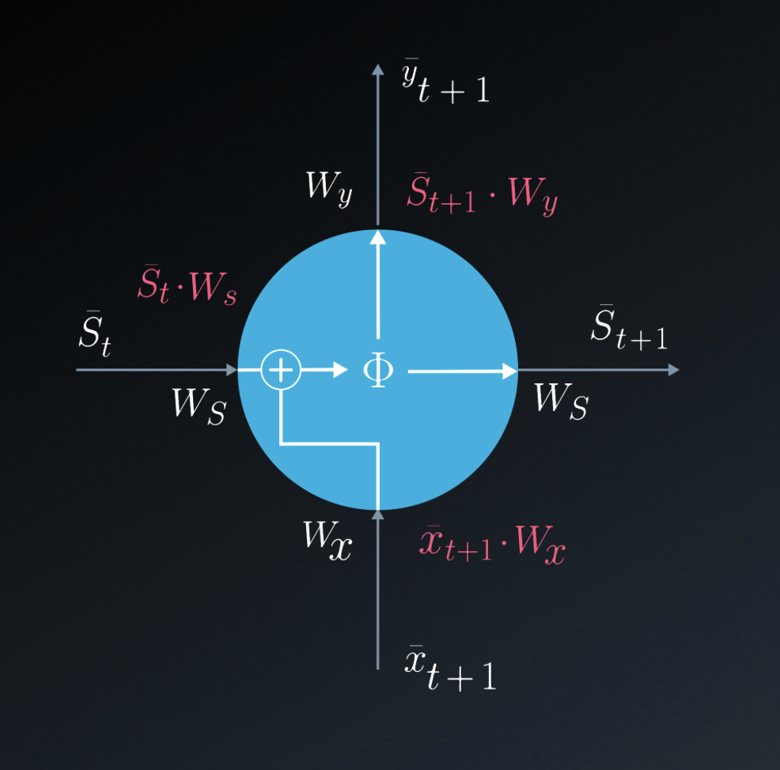
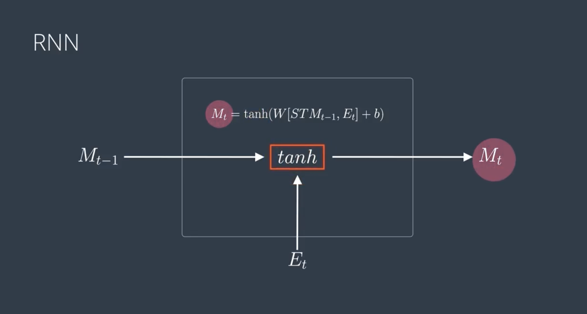
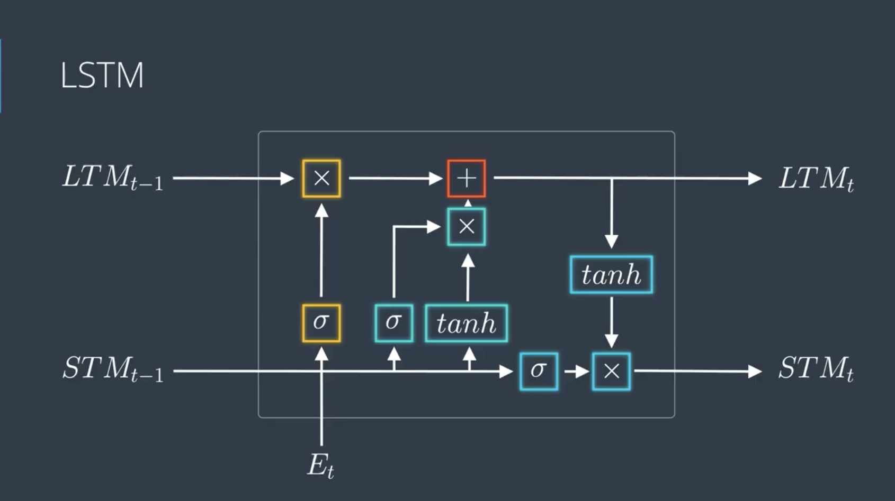
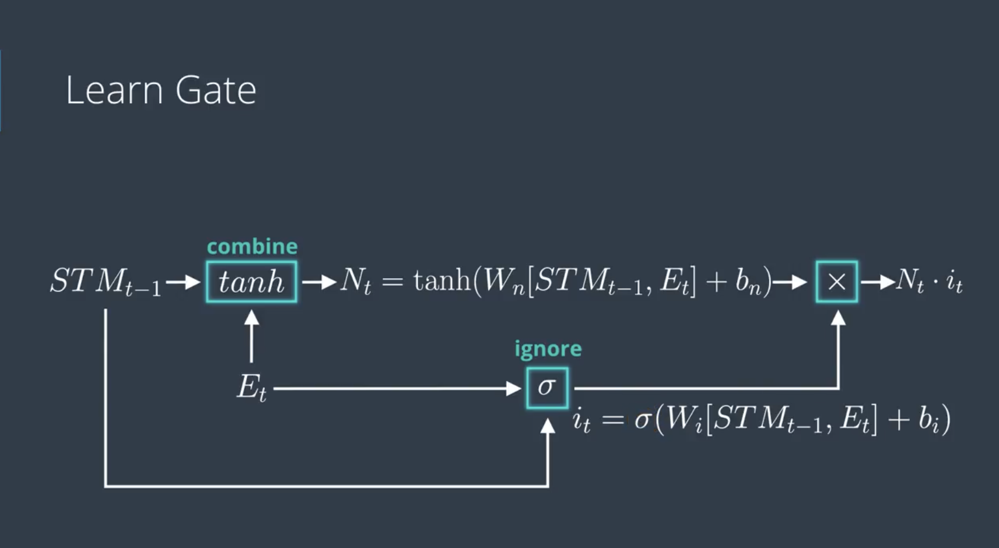
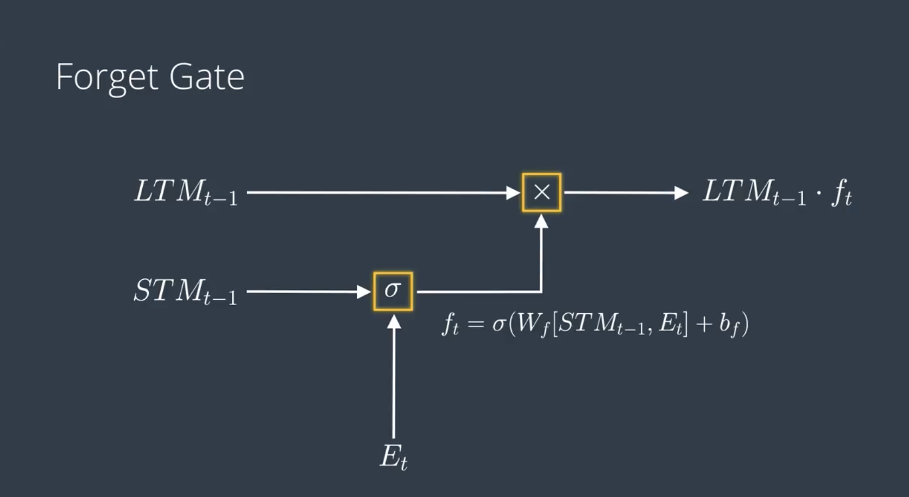
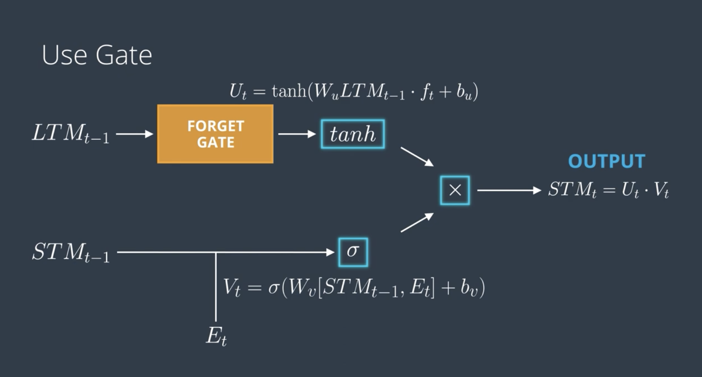
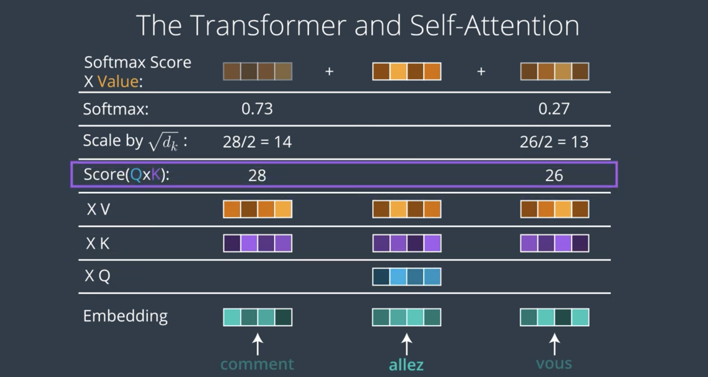

# RNNs and Transformers

<br>
<br>

# C-1: Intro to RNN

## 1. Introduction

Recurrent Neural Networks (RNNs) are a class of artificial neural networks designed specifically for processing
sequential data. Unlike feedforward neural networks, RNNs can use their internal state (memory) to process sequences of
inputs.

## 2. Key Concepts

### 2.1 Sequential Data Processing

RNNs are ideal for:

- Natural Language Processing
- Time Series Analysis
- Speech Recognition
- DNA Sequence Analysis
- Video Processing

### 2.2 Basic RNN Architecture

The fundamental RNN equation:

```textmate
ht = tanh(Whh * ht-1 + Wxh * xt + bh)
yt = Why * ht + by
```

Where:

- ht: Hidden state at time t
- xt: Input at time t
- yt: Output at time t
- W: Weight matrices
- b: Bias terms
- tanh: Hyperbolic tangent activation function

## 3. Types of RNNs

### 3.1 One-to-One

- Standard neural network
- Single input → Single output

### 3.2 One-to-Many

- Image captioning
- Single input → Sequence output

### 3.3 Many-to-One

- Sentiment analysis
- Sequence input → Single output

### 3.4 Many-to-Many

- Machine translation
- Sequence input → Sequence output

## 4. Training RNNs

### 4.1 Backpropagation Through Time (BPTT)

The loss function is:

```textmate
L = Σ Lt(yt, yt_target)
```

Where:

- Lt: Loss at time step t
- yt: Predicted output
- yt_target: Target output

### 4.2 Gradient Problems

#### Vanishing Gradients

- Problem: Gradients become extremely small as they're propagated back through time
- Caused by repeated multiplication of small numbers
- Makes learning long-term dependencies difficult

#### Exploding Gradients

- Problem: Gradients become extremely large
- Solution: Gradient clipping

```textmate
if ||gradient|| > threshold:
    gradient = (threshold * gradient) / ||gradient||
```

## 5. Advanced RNN Architectures

### 5.1 LSTM (Long Short-Term Memory)

Key equations:

```textmate
ft = σ(Wf · [ht-1, xt] + bf)
it = σ(Wi · [ht-1, xt] + bi)
c̃t = tanh(Wc · [ht-1, xt] + bc)
ct = ft * ct-1 + it * c̃t
ot = σ(Wo · [ht-1, xt] + bo)
ht = ot * tanh(ct)
```

Where:

- ft: Forget gate
- it: Input gate
- ct: Cell state
- ot: Output gate
- σ: Sigmoid function

### 5.2 GRU (Gated Recurrent Unit)

Simplified version of LSTM with fewer parameters:

```textmate
zt = σ(Wz · [ht-1, xt])
rt = σ(Wr · [ht-1, xt])
h̃t = tanh(W · [rt * ht-1, xt])
ht = (1 - zt) * ht-1 + zt * h̃t
```

## 6. Practical Applications

### 6.1 Language Modeling

- Predicting next word in sequence
- Character-level text generation

### 6.2 Machine Translation

- Encoder-decoder architecture
- Attention mechanisms

### 6.3 Speech Recognition

- Converting audio signals to text
- Real-time processing

## 7. Best Practices

### 7.1 Architecture Selection

- Use LSTM/GRU for long sequences
- Bidirectional RNNs for context in both directions
- Stack multiple layers for complex tasks

### 7.2 Optimization

- Proper learning rate selection
- Gradient clipping
- Batch normalization
- Dropout for regularization

## 8. Implementation Tips

```textmate
# Basic PyTorch RNN implementation
class SimpleRNN(nn.Module):
    def __init__(self, input_size, hidden_size, output_size):
        super(SimpleRNN, self).__init__()
        self.hidden_size = hidden_size
        self.rnn = nn.RNN(input_size, hidden_size, batch_first=True)
        self.fc = nn.Linear(hidden_size, output_size)

    def forward(self, x):
        rnn_out, hidden = self.rnn(x)
        output = self.fc(rnn_out[:, -1, :])
        return output
```

## 9. Common Challenges and Solutions

### 9.1 Memory Requirements

- Use truncated BPTT
- Implement batch processing
- Apply sequence bucketing

### 9.2 Performance Optimization

- Use GPU acceleration
- Implement attention mechanisms
- Apply layer normalization

## 10. Recent Developments

### 10.1 Attention Mechanisms

```textmate
attention = softmax(QK^T/√d)V
```

Where:

- Q: Query matrix
- K: Key matrix
- V: Value matrix
- d: Dimension of keys

### 10.2 Transformers

- Self-attention based architecture
- Parallel processing capability
- State-of-the-art performance

## Summary

RNNs are powerful architectures for sequential data processing, with various specialized versions (LSTM, GRU) addressing
specific challenges. Understanding their mathematics, architecture, and practical implementation is crucial for
successful applications in real-world problems.

As mentioned in this video, RNNs have a key flaw, as capturing relationships that span more than 8 or 10 steps back is
practically impossible. This flaw stems from the "vanishing gradient" problem in which the contribution of information
decays geometrically over time.

As you may recall, while training our network, we use backpropagation. In the backpropagation process, we adjust our
weight matrices using a gradient. In the process, gradients are calculated by continuous multiplications of derivatives.
The value of these derivatives may be so small that these continuous multiplications may cause the gradient to
practically "vanish." LSTM is one option to overcome the Vanishing Gradient problem in RNNs.

As mentioned in the video, Long Short-Term Memory Cells (LSTMs) and Gated Recurrent Units (GRUs) give a solution to the
vanishing gradient problem by helping us apply networks that have temporal dependencies.

# The Vanishing Gradient Problem in Neural Networks

## Introduction

The vanishing gradient problem is a fundamental challenge in training deep neural networks using gradient-based learning
methods and backpropagation. During training, each neural network weight is updated proportionally to the partial
derivative of the loss function with respect to the current weight. As networks become deeper or sequence lengths
increase, gradient magnitudes tend to decrease exponentially, severely slowing or halting learning.

## Prototypical Models

### 1. Recurrent Network Model

Basic evolution equation:
$$(h_t, x_t) = F(h_{t-1}, u_t, \theta)$$

Where:

- $h_t$: Hidden states
- $x_t$: Outputs
- $u_t$: Inputs
- $\theta$: Parameters

#### Example: RNN with Sigmoid Activation

Network definition:
$$x_t = F(x_{t-1}, u_t, \theta) = W_{rec}\sigma(x_{t-1}) + W_{in}u_t + b$$

Gradient analysis:
$$\nabla_x F(x_{t-1}, u_t, \theta) = W_{rec}diag(\sigma'(x_{t-1}))$$

### 2. Dynamical Systems Model

One-neuron recurrent network with sigmoid activation:
$$\frac{dx}{dt} = -x(t) + \sigma(wx(t) + b) + w'u(t)$$

For autonomous case ($u = 0$), stable points are:
$$\left(x, \ln\left(\frac{x}{1-x}\right)-5x\right)$$

### 3. Geometric Model

Loss function example:
$$L(x(T)) = (0.855 - x(T))^2$$

## Solutions

### 1. LSTM Architecture

Key equations:

```textmate
ft = σ(Wf·[ht - 1, xt] + bf)  # Forget gate
it = σ(Wi·[ht - 1, xt] + bi)  # Input gate
c̃t = tanh(Wc·[ht - 1, xt] + bc)  # Candidate state
ct = ft * ct - 1 + it * c̃t  # Cell state update
ot = σ(Wo·[ht - 1, xt] + bo)  # Output gate
ht = ot * tanh(ct)  # Hidden state
```

### 2. Batch Normalization

For mini-batch:
$$\hat{x} = \frac{x - E[x]}{\sqrt{Var[x] + \epsilon}}$$
$$y = \gamma\hat{x} + \beta$$

### 3. Residual Connections

Function transformation:
$$x \mapsto f(x) + x$$

Gradient becomes:
$$\nabla f + I$$

### 4. Weight Initialization

For logistic activation function:

- Gaussian distribution with mean = 0
- Standard deviation = $\frac{3.6}{\sqrt{N}}$ where N is neurons per layer

### 5. Gradient Clipping

For exploding gradients:
$$g_{clipped} = g_{max}\frac{g}{\|g\|} \text{ if } \|g\| > g_{max}$$

## Advanced Considerations

1. **Deep Belief Networks**: Pre-training through unsupervised learning followed by supervised fine-tuning

2. **Alternative Activation Functions**: ReLU and variants that reduce gradient vanishing

3. **Multi-level Hierarchy**: Layer-wise pre-training through unsupervised learning

Would you like me to expand on any of these sections or provide more detailed mathematical derivations?

# Understanding LSTM and GRU

## What's the Problem They Solve?

Imagine you're reading a book. By the time you reach page 100, you might forget some details from page 1. Regular RNNs
have this same problem - they struggle to remember information from far back. LSTM and GRU are like giving our neural
network a notepad to write down important things to remember.

## Long Short-Term Memory (LSTM)

Think of LSTM as a smart safe box with three keys:

1. **Forget Gate** (First Key)

   - Decides what to throw away
   - Like cleaning your room: "Do I still need this?"

2. **Input Gate** (Second Key)

   - Decides what new information to save
   - Like taking notes: "This is important, let me write it down"

3. **Output Gate** (Third Key)
   - Decides what to share/use
   - Like deciding what to tell someone: "From everything I know, here's what's relevant"

### Real-world Analogy

Imagine you're watching a TV series:

- Forget Gate: Forgetting irrelevant subplots
- Input Gate: Remembering major plot points
- Output Gate: Deciding what to tell your friend about the show

## Gated Recurrent Unit (GRU)

GRU is like LSTM's younger sibling - simpler but still effective. Instead of three keys, it has two:

1. **Update Gate**

   - Decides how much of the old information to keep
   - Like updating your to-do list: combining old and new tasks

2. **Reset Gate**
   - Decides how much past information to forget
   - Like starting a new page in your notebook

### Real-world Analogy

Think of it as taking notes in class:

- Update Gate: Deciding whether to add to your existing notes or start fresh
- Reset Gate: Choosing when to start a new topic

## When to Use Which?

### Use LSTM When:

- You need to remember things for a very long time
- You have lots of computing power
- Your task is complex (like language translation)

### Use GRU When:

- You need something simpler and faster
- You have limited computing resources
- Your task is relatively straightforward

## Simple Example in Code

```textmate
# Simple LSTM-like pseudocode
def LSTM(input):
    forget = decide_what_to_forget(input)
    store = decide_what_to_store(input)
    output = decide_what_to_output(input)

    memory = update_memory(forget, store)
    return output_filtered_memory(memory, output)

# Simple GRU-like pseudocode
def GRU(input):
    update = decide_update_level(input)
    reset = decide_reset_level(input)

    new_memory = combine_memory(update, reset, input)
    return new_memory
```

## Practical Applications

1. **Text Generation**

   - Writing assistant
   - Auto-completion

2. **Translation**

   - Google Translate
   - Real-time translation apps

3. **Speech Recognition**

   - Siri
   - Alexa

4. **Music Generation**
   - Creating melodies
   - Continuing musical patterns

# Technical Deep-Dive into LSTM and GRU

## Long Short-Term Memory (LSTM)

LSTMs revolutionized sequence modeling by introducing a sophisticated gating mechanism that controls information flow
through the network. The architecture maintains two states: a cell state (Ct) that acts as a memory conveyor belt, and a
hidden state (ht) that functions as the working memory. The cell state is regulated by three gates - forget gate (ft),
input gate (it), and output gate (ot), each implemented as a sigmoid neural network layer. These gates produce values
between 0 and 1, determining how much information should flow through. The forget gate examines the previous hidden
state (ht-1) and current input (xt) to decide what information to discard from the cell state, while the input gate
determines what new information should be stored.

The LSTM's power lies in its ability to maintain constant error flow through its constant error carousel (CEC),
effectively addressing the vanishing gradient problem. When the forget gate is open (close to 1) and the input gate is
closed (close to 0), the cell state maintains its values without degradation, allowing the network to preserve
information over hundreds or even thousands of time steps. The key equation governing the cell state update is Ct = ft _
Ct-1 + it _ C̃t, where C̃t is the candidate cell state computed using a tanh layer. This multiplicative gating mechanism
allows for precise control over the memory content, making LSTMs particularly effective for tasks requiring long-term
dependencies like machine translation or complex sequence generation.

## Gated Recurrent Unit (GRU)

GRUs represent a streamlined alternative to LSTMs, combining the forget and input gates into a single "update gate" and
merging the cell state and hidden state. The update gate (zt) determines how much of the previous hidden state should be
retained versus how much of the new candidate state should be used. This is complemented by a reset gate (rt) that
controls access to the previous hidden state when computing the new candidate state. The mathematical elegance of GRUs
lies in their ability to achieve similar performance to LSTMs with fewer parameters and simpler computation.

The core innovation of GRUs is their interpolation mechanism for updating the hidden state: ht = (1 - zt) _ ht-1 + zt _
h̃t, where h̃t is the candidate activation. This formulation ensures that the network can effectively learn to keep
existing information or replace it with new content. The reset gate operates earlier in the pipeline, controlling how
much of the previous state contributes to the candidate activation, allowing the network to effectively "forget" when
needed. This architecture makes GRUs particularly efficient at capturing medium-range dependencies while being
computationally less intensive than LSTMs, making them an attractive choice for many practical applications where
computational resources are constrained.

Both architectures represent significant advancements in sequence modeling, with the choice between them often depending
on specific task requirements and computational constraints. I can provide more detailed mathematical formulations or
specific implementation examples if you're interested.

# Long Short-Term Memory (LSTM) and Gated Recurrent Units (GRU)

## 1. Introduction to Gated Units

### 1.1 Motivation

- Traditional RNNs suffer from vanishing/exploding gradients
- Need for long-term dependency learning
- Requirement for controlled information flow

## 2. Long Short-Term Memory (LSTM)

### 2.1 Core Concepts

- Introduced by Hochreiter & Schmidhuber (1997)
- Maintains separate cell state and hidden state
- Uses gates to control information flow

### 2.2 LSTM Architecture Components

#### A. Gates

1. Forget Gate (ft):

```textmate
ft = σ(Wf[ht-1, xt] + bf)
```

- Controls what information to discard from cell state
- Outputs values between 0 (forget) and 1 (keep)

2. Input Gate (it):

```textmate
it = σ(Wi[ht-1, xt] + bi)
```

- Controls what new information to store in cell state

3. Output Gate (ot):

```textmate
ot = σ(Wo[ht-1, xt] + bo)
```

- Controls what parts of cell state to output

#### B. Cell State Update

```textmate
c̃t = tanh(Wc[ht-1, xt] + bc)  # New candidate values
ct = ft * ct-1 + it * c̃t      # Cell state update
```

#### C. Hidden State Update

```textmate
ht = ot * tanh(ct)
```

### 2.3 LSTM Information Flow

1. Forget: Decide what to forget from cell state
2. Store: Decide what new information to store
3. Update: Update cell state
4. Output: Create filtered output

## 3. Gated Recurrent Units (GRU)

### 3.1 Overview

- Introduced by Cho et al. (2014)
- Simplified version of LSTM
- Combines cell state and hidden state
- Uses two gates instead of three

### 3.2 GRU Architecture Components

#### A. Gates

1. Reset Gate (rt):

```textmate
rt = σ(Wr[ht-1, xt] + br)
```

- Controls how much past information to forget

2. Update Gate (zt):

```textmate
zt = σ(Wz[ht-1, xt] + bz)
```

- Controls how much new information to add

#### B. Hidden State Update

```textmate
h̃t = tanh(W[rt * ht-1, xt] + b)   # Candidate update
ht = (1 - zt) * ht-1 + zt * h̃t    # Final update
```

## 4. Comparison: LSTM vs GRU

### 4.1 Structural Differences

- LSTM: 3 gates (forget, input, output)
- GRU: 2 gates (reset, update)
- LSTM: Separate cell state and hidden state
- GRU: Combined state

### 4.2 Advantages and Disadvantages

#### LSTM

Pros:

- More expressive
- Better for longer sequences
- More control over memory

Cons:

- More parameters to train
- More computational complexity
- Higher memory requirements

#### GRU

Pros:

- Simpler architecture
- Faster training
- Fewer parameters
- Good for smaller datasets

Cons:

- Might not capture long-term dependencies as well as LSTM
- Less control over memory flow

## 5. Implementation Examples

### 5.1 PyTorch LSTM Implementation

```textmate
class CustomLSTM(nn.Module):
    def __init__(self, input_size, hidden_size):
        super(CustomLSTM, self).__init__()
        self.hidden_size = hidden_size

        # Gates
        self.forget_gate = nn.Linear(input_size + hidden_size, hidden_size)
        self.input_gate = nn.Linear(input_size + hidden_size, hidden_size)
        self.output_gate = nn.Linear(input_size + hidden_size, hidden_size)
        self.cell_gate = nn.Linear(input_size + hidden_size, hidden_size)

    def forward(self, x, hidden, cell):
        combined = torch.cat((x, hidden), dim=1)

        forget = torch.sigmoid(self.forget_gate(combined))
        input = torch.sigmoid(self.input_gate(combined))
        output = torch.sigmoid(self.output_gate(combined))
        cell_candidate = torch.tanh(self.cell_gate(combined))

        cell = forget * cell + input * cell_candidate
        hidden = output * torch.tanh(cell)

        return hidden, cell
```

### 5.2 PyTorch GRU Implementation

```textmate
class CustomGRU(nn.Module):
    def __init__(self, input_size, hidden_size):
        super(CustomGRU, self).__init__()
        self.hidden_size = hidden_size

        # Gates
        self.reset_gate = nn.Linear(input_size + hidden_size, hidden_size)
        self.update_gate = nn.Linear(input_size + hidden_size, hidden_size)
        self.cell_gate = nn.Linear(input_size + hidden_size, hidden_size)

    def forward(self, x, hidden):
        combined = torch.cat((x, hidden), dim=1)

        reset = torch.sigmoid(self.reset_gate(combined))
        update = torch.sigmoid(self.update_gate(combined))

        combined_reset = torch.cat((x, reset * hidden), dim=1)
        cell_candidate = torch.tanh(self.cell_gate(combined_reset))

        hidden = (1 - update) * hidden + update * cell_candidate

        return hidden
```

## 6. Best Practices

### 6.1 When to Use Which

- LSTM: Complex sequences, long-term dependencies
- GRU: Smaller datasets, simpler sequences, limited computational resources

### 6.2 Optimization Tips

- Use gradient clipping
- Initialize forget gate biases to 1.0 (LSTM)
- Apply layer normalization
- Use dropout between layers
- Stack multiple layers for complex tasks

## 7. Advanced Topics

### 7.1 Variants

- Bidirectional LSTM/GRU
- Attention-augmented LSTM/GRU
- Convolutional LSTM
- Peephole connections

### 7.2 Modern Applications

- Machine translation
- Speech recognition
- Time series prediction
- Music generation
- Video analysis

## Summary

Both LSTM and GRU are powerful solutions to the vanishing gradient problem in RNNs. While LSTM offers more control
through its three-gate architecture, GRU provides a simpler, often equally effective alternative. Choice between them
depends on specific use case requirements.

# RNN vs Feed-Forward Neural Networks: Key Differences

## 1. Architecture and Memory

- **Feed-Forward Networks**

  - Unidirectional flow: Information flows only forward
  - No memory of previous inputs
  - Fixed input size
  - Each input is processed independently

  ```textmate
  Output = f(W * Input + b)
  ```

- **Recurrent Neural Networks**

  - Cyclic connections: Information can flow in cycles
  - Has memory through hidden states
  - Variable input size
  - Sequential processing with memory:

  ```textmate
  ht = tanh(Whh * ht-1 + Wxh * xt + bh)
  yt = Why * ht + by
  ```

  Where:

  - ht: Current hidden state
  - ht-1: Previous hidden state
  - xt: Current input
  - W: Weight matrices
  - b: Bias terms

## 2. Application Domains

- **Feed-Forward Networks**

  - Image classification
  - Single-frame prediction
  - Pattern recognition
  - Fixed-size input problems

- **Recurrent Networks**
  - Time series analysis
  - Natural language processing
  - Speech recognition
  - Sequential data prediction
  - Variable-length sequences

## 3. Training Process

- **Feed-Forward Networks**

  - Standard backpropagation
  - Each sample trained independently
  - Simpler gradient computation
  - Faster training generally

- **Recurrent Networks**
  - Backpropagation through time (BPTT)
  - Sequential dependency in training
  - More complex gradient computation:
  ```
  ∂L/∂W = Σt (∂L/∂yt * ∂yt/∂ht * ∂ht/∂W)
  ```
  - More prone to vanishing/exploding gradients
  - Generally slower training

## 4. Memory and Context

- **Feed-Forward Networks**

  - No internal memory
  - Each input-output pair is independent
  - Context must be explicitly provided
  - Fixed context window

- **Recurrent Networks**

  - Internal state maintains memory
  - Hidden state equation:

  ```
  h(t) = f(h(t-1), x(t))
  ```

  - Can learn long-term dependencies
  - Dynamic context window
  - Variants like LSTM handle long-term dependencies:

  ```textmate
  ft = σ(Wf·[ht-1, xt] + bf)
  it = σ(Wi·[ht-1, xt] + bi)
  ct = ft * ct-1 + it * tanh(Wc·[ht-1, xt] + bc)
  ot = σ(Wo·[ht-1, xt] + bo)
  ht = ot * tanh(ct)
  ```

This fundamental architectural difference makes RNNs more suitable for sequential data processing while feed-forward
networks excel at fixed-input pattern recognition tasks.

### Recurrent Neural Networks

RNNs are based on the same principles as those behind FFNNs, which is why we spent so much time reminding ourselves of
the feedforward and backpropagation steps used in the training phase.

There are two main differences between FFNNs and RNNs. The Recurrent Neural Network uses:

sequences as inputs in the training phase, and
memory elements
Memory is defined as the output of hidden layer neurons, which will serve as additional input to the network during the
next training step.

The basic three layer neural network with feedback that serve as memory inputs is called the Elman Network.

The text describes the fundamental difference between Feed-Forward Neural Networks (FFNN) and Recurrent Neural
Networks (RNN):

1. For FFNN:
   The output at any time t is a function of the current input and weights:
   $$\bar{y_t} = F(\bar{x_t}, W)$$
   [Equation 1]

2. For RNN:
   The output at time t depends not only on current input and weight, but also on previous inputs:
   $$\bar{y_t} = F(\bar{x_t}, \bar{x_{t-1}}, \bar{x_{t-2}}, \cdots, \bar{x_{t-t_0}}, W)$$

The text explains the notation:

- $\bar{x}$ represents the input vector
- $\bar{y}$ represents the output vector
- $\bar{s}$ denotes the state vector

Weight matrices:

- $W_x$ connects inputs to state layer
- $W_y$ connects state layer to output layer
- $W_s$ connects state from previous timestep to current timestep

The text mentions that the model can be "unfolded in time" and this unfolded model is typically used when working with
RNNs.

The text explains the Unfolded Model and provides equations:

State calculation:
$$\bar{s_t} = \Phi(\bar{x_t}W_x + \bar{s_{t-1}}W_s)$$
[Equation 3]

Output calculation can be either:
$$\bar{y_t} = \bar{s_t}W_y$$
or
$$\bar{y_t} = \sigma(\bar{s_t}W_y)$$

The text emphasizes that this unfolded model:

- Separates State Vector from Input Vector
- Shows interactions between State Vector and Input Vector
- Makes it easier to understand how State at T-1 and Input Vector at T produce Output at T

The output vector calculation remains similar to FFNNs, using either a linear combination or softmax function of the
inputs with corresponding weight matrix $W_y$.

### RNN Example

In this example, we will illustrate how RNNs can help detect sequences. When detecting a sequence, the system must
remember the previous inputs, so it makes sense to use a recurrent network.

If you are unfamiliar with sequence detection, the idea is to see if a specific pattern of inputs has entered the
system. In our example, the pattern will be the word U,D,A,C,I,T,Y.

# Backpropagation Through Time (BPTT) Explanation

## Core Concept

BPTT is an extension of standard backpropagation designed specifically for RNNs. The key difference is that in RNNs, we
need to account for the temporal dependencies in the network.

## Mathematical Formulation

### 1. Forward Pass

```textmate
For each time step t:
- Input state: ht = tanh(Wx * xt + Wh * ht-1 + bh)
- Output: yt = Why * ht + by
- Error: Et = (dt - yt)²
```

Where:

- $x_t$ is input at time t
- $h_t$ is hidden state at time t
- $W_x$, $W_h$, $W_{hy}$ are weight matrices
- $b_h$, $b_y$ are bias terms

### 2. Backward Pass

The total loss is sum of losses over all time steps:
$$E_{total} = \sum_{t=1}^{T} E_t$$

Gradient calculations:

1. Output layer:

   $$
   \frac{\partial E}{\partial W_{hy}} = \sum_{t=1}^{T} \frac{\partial E_t}{\partial y_t} \frac{\partial y_t}{\partial
   W_{hy}}
   $$

2. Hidden layer:
   $$
   \frac{\partial E}{\partial W_h} = \sum_{t=1}^{T} \sum_{k=1}^{t} \frac{\partial E_t}{\partial h_t} \frac{\partial
   h_t}{\partial h_k} \frac{\partial h_k}{\partial W_h}
   $$

## Key Steps in BPTT

1. **Forward Pass**

   - Run the RNN forward for all time steps
   - Store all hidden states and outputs
   - Calculate error at each time step

2. **Backward Pass**

   - Start from the last time step
   - Compute gradients at each time step
   - Accumulate gradients through time

3. **Weight Updates**
   ```textmate
   Wx_new = Wx - learning_rate * ∂E/∂Wx
   Wh_new = Wh - learning_rate * ∂E/∂Wh
   Why_new = Why - learning_rate * ∂E/∂Why
   ```

## Challenges

1. **Vanishing Gradients**

   - When backpropagating through many time steps
   - Gradients become very small
   - Solution: LSTM/GRU cells

2. **Exploding Gradients**
   - Gradients become very large
   - Solution: Gradient clipping
   ```textmate
   if gradient > threshold:
       gradient = gradient * (threshold/gradient_magnitude)
   ```

## Practical Implementation

```textmate
def bptt(inputs, targets, hidden_state):
    # Forward pass
    states = []
    outputs = []
    for t in range(len(inputs)):
        hidden_state = tanh(dot(Wx, inputs[t]) + dot(Wh, hidden_state))
        output = dot(Why, hidden_state)
        states.append(hidden_state)
        outputs.append(output)

    # Backward pass
    total_loss = sum((target - output) ** 2 for target, output in zip(targets, outputs))
    gradients = initialize_gradients()

    for t in reversed(range(len(inputs))):
        # Calculate gradients at each timestep
        dWhy += outer(error[t], states[t])
        dWh += calculate_hidden_gradients(t, states)
        dWx += calculate_input_gradients(t, inputs)

    return gradients, total_loss
```

## Best Practices

1. Use truncated BPTT for long sequences
2. Implement gradient clipping
3. Use adaptive learning rates
4. Consider bidirectional RNNs for better context
5. Monitor gradient magnitudes during training

## Variants

1. **Truncated BPTT**

   - Limit the number of timesteps to backpropagate through
   - More computationally efficient
   - May miss long-term dependencies

2. **Full BPTT**
   - Backpropagate through entire sequence
   - More accurate but computationally expensive
   - Better for capturing long-term dependencies

# Training RNNs: Backpropagation Through Time (BPTT)

When training RNNs, we use backpropagation with a conceptual change. While the process is similar to FFNNs, we must
consider previous time steps due to the system's memory. This process is called Backpropagation Through Time (BPTT).

## MSE Loss Function

The Mean Squared Error (MSE) loss function is used to explain BPTT:

$$E_t = (d_t - \bar{y_t})^2$$

Where:

- $E_t$ represents the output error at time t
- $d_t$ represents the desired output at time t
- $y_t$ represents the calculated output at time t

## BPTT Process

In BPTT, we train the network at timestep t while considering all previous timesteps. For example, at timestep t=3:

- Loss function: $E_3 = (\bar{d_3} - \bar{y_3})^2$
- Need to adjust three weight matrices: $W_x$, $W_s$, and $W_y$
- Must consider timesteps 3, 2, and 1

To update each weight matrix, we calculate partial derivatives of the Loss Function at time 3 for all weight matrices,
using gradient descent while considering previous timesteps.

The unfolded model helps visualize the number of steps (multiplications) needed in the BPTT process. These
multiplications come from the chain rule and are more easily understood using this model.

The Folded Model at Timestep 3 shows:

- Input vector ($\bar{x_3}$)
- State vector ($\bar{s_3}$)
- Weight matrices ($W_x$, $W_s$, $W_y$)
- Error ($E_3$)

# Unfolding the Model in Time: BPTT Weight Matrix Adjustments

## Weight Matrices to Adjust

- $W_y$ - the weight matrix connecting the state of the output
- $W_s$ - the weight matrix connecting one state to the next state

## Gradient Calculations for $W_y$

The partial derivative of the Loss Function concerning $W_y$ is found by a simple one-step chain rule:

For timestep 3:
$$\frac{\partial E_3}{\partial W_y} = \frac{\partial E_3}{\partial \bar{y_3}} \frac{\partial \bar{y_3}}{\partial W_y}$$

For N steps:
$$\frac{\partial E_N}{\partial W_y} = \frac{\partial E_N}{\partial y_N} \frac{\partial \bar{y_N}}{\partial W_y}$$

## Gradient Calculations for $W_s$

When calculating the partial derivative of the Loss Function for $W_s$, we need to consider all of the states
contributing to the output. In the case of this example, it will be states $\bar{s_3}$ which depends on its predecessor
$\bar{s_2}$ which depends on its predecessor $\bar{s_1}$, the first state.

In BPTT, we will consider every gradient stemming from each state, accumulating all of these contributions.

At timestep t=3, the contribution to the gradient stemming from $\bar{s_3}$, $\bar{s_2}$, and $\bar{s_1}$ is:

$$
\frac{\partial E_3}{\partial W_s} = \frac{\partial E_3}{\partial \bar{y_3}} \frac{\partial \bar{s_3}}{\partial W_s} +
\frac{\partial E_3}{\partial \bar{y_3}} \frac{\partial \bar{s_3}}{\partial \bar{s_2}} \frac{\partial \bar{s_2}}{\partial
W_s} + \frac{\partial E_3}{\partial \bar{y_3}} \frac{\partial \bar{s_3}}{\partial \bar{s_2}} \frac{\partial
\bar{s_2}}{\partial \bar{s_1}} \frac{\partial \bar{s_1}}{\partial W_s}
$$

For N timesteps:

$$
\frac{\partial E_N}{\partial W_s} = \sum_{i=1}^{N} \frac{\partial E_N}{\partial \bar{y_N}} \frac{\partial
\bar{s_i}}{\partial W_s}
$$

## Adjusting/Updating $W_x$

When calculating the partial derivative of the Loss Function concerning $W_x$, we need to consider, again, all of the
states contributing to the output. As we saw before, in the case of this example, it will be states $\bar{s_3}$, which
depends on its predecessor $\bar{s_2}$, which depends on its predecessor $\bar{s_1}$, the first state.

After considering the contributions from all three states: $\bar{s_3}$, $\bar{s_2}$ and $\bar{s_1}$, we will accumulate
them to find the final gradient calculation.

# RNN Equations and Weight Matrices

As you have seen, in RNNs the current state depends on the input and the previous states, with an activation function.

Equation showing the current state as a function of input and the previous state:

$$\bar{s_t} = \Phi(\bar{x_t}W_x + \bar{s_{t-1}}W_s)$$

The current output is a simple linear combination of the current state elements with the corresponding weight matrix.

Equation showing the current output:

Without the use of an activation function:

$$\bar{y_t} = \bar{s_t}W_y \text{ (without the use of an activation function)}$$

With the use of an activation function:

$$\bar{y_t} = \sigma(\bar{s_t}W_y) \text{ (with the use of an activation function)}$$

We can represent the recurrent network with the use of a folded model or an unfolded model:

We will have three weight matrices to consider in the case of a single hidden (state) layer. Here we use the following
notations:

$W_x$ - represents the weight matrix connecting the inputs to the state layer.

$W_y$ - represents the weight matrix connecting the state to the output.

$W_s$ - represents the weight matrix connecting the state from the previous timestep to the state in the following
timestep.

The gradient calculations for the purpose of adjusting the weight matrices are the following:

Equation 1:
$$\frac{\partial E_N}{\partial W_y} = \frac{\partial E_N}{\partial \bar{y_N}} \frac{\partial \bar{y_N}}{\partial W_y}$$

Equation 2:

$$
\frac{\partial E_N}{\partial W_s} = \sum_{i=1}^N \frac{\partial E_N}{\partial \bar{y_N}} \frac{\partial
\bar{s_i}}{\partial W_s}
$$

Equation 3:

$$
\frac{\partial E_N}{\partial W_x} = \sum_{i=1}^N \frac{\partial E_N}{\partial \bar{y_N}} \frac{\partial
\bar{s_i}}{\partial W_x}
$$

When training RNNs using BPTT, we can choose to use mini-batches, where we update the weights in batches periodically (
as opposed to once every inputs sample). We calculate the gradient for each step but do not update the weights
immediately. Instead, we update the weights once every fixed number of steps. This helps reduce the complexity of the
training process and helps remove noise from the weight updates.

The following is the equation used for Mini-Batch Training Using Gradient Descent:
(where $\delta_{ij}$ represents the gradient calculated once every inputs sample, and M represents the number of
gradients we accumulate in the process).

Equation 4:
$$\delta_{ij} = \frac{1}{M} \sum_{k=1}^M \delta_{ijk}$$

If we backpropagate more than ~10 timesteps, the gradient will become too small. This phenomenon is known as the
vanishing gradient problem, where the contribution of information decays geometrically over time. Therefore, the network
will effectively discard temporal dependencies that span many time steps. Long Short-Term Memory (LSTM) cells were
designed to solve this problem specifically.

In RNNs we can also have the opposite problem, called the exploding gradient problem, in which the value of the gradient
grows uncontrollably. A simple solution for the exploding gradient problem is Gradient Clipping.

More information about Gradient Clipping can be found here.

You can concentrate on Algorithm 1 which describes the gradient clipping idea in simplicity.

## Natural Language Processing (NLP)

We have use different techniques for texual data processing such as

1. Normalization
2. Tokenization
3. Stop Word Removal
4. Stemming and Lemmatization

# Natural Language Processing (NLP) Core Concepts

## 1. Normalization

Normalization is the process of transforming text into a single canonical form to ensure consistency. It's typically the
first step in any NLP pipeline.

Key aspects:

- Converting text to lowercase/uppercase
- Removing special characters, punctuation
- Handling contractions (e.g., "don't" → "do not")
- Managing numbers and dates
- Removing extra whitespace

Importance:

- Reduces text redundancy
- Improves consistency
- Makes subsequent processing more effective

## 2. Tokenization

The process of breaking down text into smaller units called tokens. These tokens can be words, characters, or subwords.

Types:

1. **Word Tokenization**

   - Splits text into words
   - Handles punctuation and special cases
   - Considers language-specific rules

2. **Sentence Tokenization**

   - Splits text into sentences
   - Handles abbreviations
   - Manages multiple punctuation marks

3. **Subword Tokenization**
   - Creates tokens smaller than words
   - Useful for handling unknown words
   - Common in modern NLP systems

## 3. Stop Word Removal

Stop words are common words that typically don't carry significant meaning in text analysis.

Characteristics:

- High frequency words (a, an, the, in, at)
- Context-dependent importance
- Language-specific
- May need customization based on use case

Benefits:

- Reduces noise in text analysis
- Decreases processing time
- Focuses on meaningful content
- Saves storage space

## 4. Stemming

A rule-based process of reducing words to their root or base form by removing affixes.

Key Points:

- Fast but aggressive approach
- May produce non-dictionary words
- Language-dependent rules
- Multiple algorithms available (Porter, Lancaster)

Limitations:

- Can produce incorrect stems
- Loses word context
- May reduce accuracy in some applications

## 5. Lemmatization

A more sophisticated approach that converts words to their dictionary base form (lemma) while considering context.

Features:

- Uses morphological analysis
- Produces valid dictionary words
- Considers word context and part of speech
- More accurate than stemming

Considerations:

- Computationally more intensive
- Requires part-of-speech information
- More accurate for meaning preservation

## Practical Considerations

### When to Use Which Technique:

1. **Normalization**

   - Always use as first step
   - Crucial for consistency
   - Adapt to specific needs

2. **Tokenization**

   - Essential for most NLP tasks
   - Choose level based on application
   - Consider language specifics

3. **Stop Word Removal**

   - Use for document classification
   - Skip for sentiment analysis
   - Customize list per application

4. **Stemming**

   - Use when speed is priority
   - Good for search applications
   - Accept some inaccuracy

5. **Lemmatization**
   - Use when accuracy is crucial
   - Better for meaning preservation
   - Accept slower processing

### Common Challenges:

1. **Language Dependency**

   - Different rules for different languages
   - Varying effectiveness of techniques
   - Need for language-specific tools

2. **Context Sensitivity**

   - Word meaning changes with context
   - Impact on accuracy
   - Trade-offs between speed and precision

3. **Processing Speed**
   - Balancing accuracy vs performance
   - Resource constraints
   - Scalability considerations

### Word Embeddings

Word embeddings are a type of distributed representation used in natural language processing (NLP) that allow words to
be represented as dense vectors of real numbers. Each word is mapped to a unique vector, and the vector space is
designed such that words that are semantically similar are located close to each other in the vector space.

Word embeddings are typically learned through unsupervised learning techniques, such as neural network models like
Word2Vec(opens in a new tab) and GloVe(opens in a new tab), which are trained on large corpora of text. During training,
the model learns to predict the context in which a word appears, such as the surrounding words in a sentence, and uses
this information to assign a vector representation to each word.

Why word embeddings are important?
Word embeddings have revolutionized the field of natural language processing by providing a way to represent words as
dense vectors that capture semantic and syntactic relationships between words. These representations are particularly
useful for downstream NLP tasks, such as text classification, sentiment analysis, and machine translation, where
traditional techniques may struggle to capture the underlying structure of the text.

For example, in a sentiment analysis task, word embeddings can be used to capture the sentiment of a sentence by summing
the vector representations of the words in the sentence and passing the result through a neural network. In a machine
translation task, word embeddings can be used to map words from one language to another by finding the closest vector
representation in the target language.

Models for word embedding in Pytorch

GloVe (Global Vectors): It is a method for generating word embeddings, which are dense vector representations of words
that capture their semantic meaning. The main idea behind GloVe is to use co-occurrence statistics to generate
embeddings that reflect the words' semantic relationships. GloVe embeddings are generated by factorizing a co-occurrence
matrix. The co-occurrence matrix is a square matrix where each row and column represents a word in the vocabulary, and
the cell at position (i, j) represents the number of times word i and word j appear together in a context window. The
context window is a fixed-size window of words surrounding the target word. The factorization of the co-occurrence
matrix results in two smaller matrices: one representing the words, and the other representing the contexts. Each row of
the word matrix represents a word in the vocabulary, and the entries in that row are the weights assigned to each
dimension of the embedding. Similarly, each row of the context matrix represents a context word, and the entries in that
row are the weights assigned to each dimension of the context embedding. The GloVe embeddings are computed by
multiplying the word and context embeddings together and summing them up. This produces a single scalar value that
represents the strength of the relationship between the two words. The resulting scalar is used as the value of the (i,
j) entry in the word-context co-occurrence matrix. In PyTorch, you can use the torchtext package to load pre-trained
GloVe embeddings. The torchtext.vocab.GloVe class allows you to specify the dimensionality of the embeddings (e.g. 50,
100, 200, or 300), and the pre-trained embeddings are downloaded automatically.

FastText: FastText is a popular method for generating word embeddings that extends the concept of word embeddings to
subword units, rather than just whole words. The main idea behind FastText is to represent each word as a bag of
character n-grams, which are contiguous sequences of n characters. FastText embeddings are generated by training a
shallow neural network on the subword units of the corpus. The input to the network is a bag of character n-grams for
each word in the vocabulary, and the output is a dense vector representation of the word. During training, the network
uses a negative sampling objective to learn the embeddings. The objective is to predict whether or not a given word is
in the context of a target word. The model learns to predict the context of a word by computing the dot product between
the target word's embedding and the embedding of each subword unit in the context. FastText embeddings have several
advantages over traditional word embeddings. For example, they can handle out-of-vocabulary words, as long as their
character n-grams are present in the training corpus. They can also capture morphological information and handle
misspellings, since they are based on subword units. In PyTorch, you can use the torchtext package to load pre-trained
FastText embeddings. The torchtext.vocab.FastText class allows you to specify the language and the dimensionality of the
embeddings (e.g. 300).

CharNgram: It refers to a method of generating character-level embeddings for words. The idea behind charNgram is to
represent each word as a sequence of character n-grams (substrings of length n), and then use these n-grams to generate
a fixed-length embedding for the word. For example, if we use CharNGram with n=3, the word "hello" would be represented
as a sequence of 3-character n-grams: "hel", "ell", "llo". We would then use these n-grams to generate a fixed-length
embedding for the word "hello". This embedding would be a concatenation of the embeddings of each n-gram. The benefit of
using charNgram embeddings is that they can capture information about the morphology of words (i.e. how the word is
formed from its constituent parts), which can be useful for certain NLP tasks. However, charNgram embeddings may not
work as well for tasks that rely heavily on semantic meaning, since they do not capture the full meaning of a word. In
PyTorch, you can generate charNgram embeddings using the torchtext package. The torchtext.vocab.CharNGram class allows
you to generate character n-grams for a given text corpus, and the resulting n-grams can be used to generate charNgram
embeddings for individual words.

<br>
<br>

# C-2: Introduction to LSTM

<br>
<br>

Lesson Outline
In this lesson, we will cover the following topics:

LSTM Overview
LSTM Architecture and Gates

By the end of the lesson, you'll be able to:

1. Explain how LSTMs overcome the limitations of RNNs
2. Implement the LSTM architecture

The problem with RNNs is that memory stored in an RNN can be effective short-term memory. This is due to the "Vanishing
Gradient Problem." The Vanishing Gradient Problem happens when the gradient of a deep layer of the neural network is "
diluted" and has a reduced effect on the network. This is due to the nature of the activation functions of the RNN that
can diminish the effect of the gradients of the deeper layer over time.

The LSTM solves the problem by introducing an operation to maintain the long-term memory of the network. We will learn
about these gates in subsequent lessons.

Long Short-Term Memory Cells, (LSTM)(opens in a new tab) give a solution to the vanishing gradient problem, by helping
us apply networks that have temporal dependencies. They were proposed in 1997 by Sepp Hochreiter(opens in a new tab) and
Jürgen Schmidhuber(opens in a new tab)

If we look closely at the RNN neuron, we see that we have simple linear combinations (with or without an activation
function). We can also see that we have a single addition.

Zooming in on the neuron, we can graphically see this in the following configuration:

RNN Neuron Explanation
At the center, there is a large blue circle representing the RNN cell with the label "Phi," indicating a non-linear
activation function. Surrounding the circle are inputs and outputs.

To the left, "S-bar-t" represents the previous hidden state multiplied by the weight matrix "W-S" and combines with an
addition operation, shown by a plus sign inside the cell.

Below, "x-bar-t-plus-1" represents the next input state, multiplied by the weight matrix "W-X." These values feed into
the cell to produce the next hidden state, labeled as "x-bar-t-plus-1," which exits to the right and is multiplied by "
W-S."

<br>



<br>

At the top, "y-bar-t-plus-1" shows the next output, computed from the current state using the weight matrix "W-Y."

The diagram highlights the flow of information and the transformation of values within the RNN structure through various
mathematical operations, focusing on how input states, hidden states, and output states interact with weights.

The LSTM cell is a bit more complicated. If we zoom in on the cell, we can see that the mathematical configuration is
the following:

LSTM Cell Explanation
The diagram is enclosed within a dark rectangle representing the LSTM unit. On the left, the input "x-sub-t" enters the
cell from the bottom left. Several key operations occur within the cell, including the use of the sigmoid function,
represented by "sigma," and the hyperbolic tangent function, represented by "tanh," both essential for controlling
information flow.

At the top, the previous cell state "S-sub-t" is depicted flowing through, being modified by operations involving
multiplication and addition. The cell has several gates: the forget gate, input gate, and output gate, each interacting
with the input "x-sub-t" and the previous state to control which information to store or discard. There are arrows
showing information flow through the LSTM, including multiplications and additions, with multiple paths converging or
splitting based on the gate operations.

<br>


<br>

The activation functions are visually separated, with "tanh" applied towards the right side and "sigma" present in the
input pathways. The output of the LSTM, represented by arrows exiting to the right, combines information from the gates
and the cell state, forming the cell’s output. The entire structure illustrates the complex interplay between the gates
and the hidden state within an LSTM network.

The LSTM cell allows a recurrent system to learn over many time steps without the fear of losing information due to the
vanishing gradient problem. It is fully differentiable, therefore allowing us to use backpropagation when updating the
weights easily.

### Basics of LSTM

In this video, we learned the basics of the LSTM. We have listed them below.

Inputs

1. Long Term Memory
2. Short Term Memory
3. Input Vector (Event)

Gates

1. Forget Gate
2. Learn Gate
3. Remember Gate
4. Use Gate

Outputs

1. New Long-Term Memory
2. New Short-Term Memory

<br>


<br>

<br>


<br>

<br>


<br>

# RNN Lecture Notes: Gates in LSTM Architecture

## Introduction to LSTM Gates

Long Short-Term Memory (LSTM) networks use a system of gates to control information flow. These gates help solve the
vanishing gradient problem and allow the network to learn long-term dependencies.

## 1. Forget Gate

The forget gate decides what information to discard from the cell state.

### Mathematical Representation:

```textmate
ft = σ(Wf · [ht-1, xt] + bf)
```

Where:

- ft: Forget gate output (0-1)
- σ: Sigmoid function
- Wf: Weight matrix
- ht-1: Previous hidden state
- xt: Current input
- bf: Bias term

### Purpose:

- Filters information from cell state
- Values close to 0: forget
- Values close to 1: keep

## 2. Learn Gate (Input Gate)

Determines which new information will be stored in the cell state.

### Mathematical Representation:

```textmate
it = σ(Wi · [ht-1, xt] + bi)
C̃t = tanh(Wc · [ht-1, xt] + bc)
```

Where:

- it: Input gate output
- C̃t: Candidate values
- Wi, Wc: Weight matrices
- bi, bc: Bias terms

### Purpose:

- Controls new information flow
- Creates candidate values
- Scales new information importance

## 3. Remember Gate (Cell State Update)

Updates the cell state by combining forget gate and learn gate outputs.

### Mathematical Representation:

```textmate
Ct = ft * Ct-1 + it * C̃t
```

Where:

- Ct: New cell state
- Ct-1: Previous cell state
- \*: Element-wise multiplication

### Purpose:

- Maintains long-term memory
- Combines old and new information
- Controls information flow through time

## 4. Use Gate (Output Gate)

Controls what parts of the cell state will be output.

### Mathematical Representation:

```textmate
ot = σ(Wo · [ht-1, xt] + bo)
ht = ot * tanh(Ct)
```

Where:

- ot: Output gate values
- ht: Hidden state output
- Wo: Weight matrix
- bo: Bias term

### Purpose:

- Filters cell state output
- Creates final output
- Controls information visibility

## Gate Interactions

### Complete LSTM Step:

1. Forget: Remove irrelevant information
2. Learn: Add new information
3. Remember: Update cell state
4. Use: Create output

```textmate
# Complete LSTM Forward Pass
def lstm_forward(x_t, h_prev, c_prev):
    # Forget Gate
    f_t = sigmoid(dot(W_f, concat(h_prev, x_t)) + b_f)

    # Input Gate
    i_t = sigmoid(dot(W_i, concat(h_prev, x_t)) + b_i)
    c_tilde = tanh(dot(W_c, concat(h_prev, x_t)) + b_c)

    # Cell State Update
    c_t = f_t * c_prev + i_t * c_tilde

    # Output Gate
    o_t = sigmoid(dot(W_o, concat(h_prev, x_t)) + b_o)
    h_t = o_t * tanh(c_t)

    return h_t, c_t
```

## Practical Considerations

### Advantages:

1. Solves vanishing gradient
2. Better long-term memory
3. Selective information retention

### Challenges:

1. Computational complexity
2. More parameters to train
3. Memory requirements

### Best Practices:

1. Use proper initialization
2. Apply dropout carefully
3. Consider bidirectional LSTM
4. Use gradient clipping

## Applications:

- Sequence prediction
- Machine translation
- Speech recognition
- Time series forecasting

## Code Example for Gate Visualization:

```textmate
def visualize_gates(lstm_layer, input_sequence):
    # Get gate activations
    forget_acts = lstm_layer.get_forget_gate_values(input_sequence)
    input_acts = lstm_layer.get_input_gate_values(input_sequence)
    cell_acts = lstm_layer.get_cell_state_values(input_sequence)
    output_acts = lstm_layer.get_output_gate_values(input_sequence)

    # Plot activations
    plt.figure(figsize=(15, 10))
    plt.subplot(4,1,1)
    plt.title('Gate Activations Over Time')
    plt.plot(forget_acts, label='Forget Gate')
    plt.plot(input_acts, label='Input Gate')
    plt.plot(cell_acts, label='Cell State')
    plt.plot(output_acts, label='Output Gate')
    plt.legend()
    plt.show()
```

# Quiz Question: LSTM Memory Update Mechanism

**Question:**
The Long Term Memory and Short Term Memory are updated by a method where...
(Select the response that best completes the sentence)

**Options:**

1. The Remember Gate takes in the LTM & STM to determine the new LTM. The USE gate performs the same operation for the
   STM. ✅
2. The USE takes in the LTM & STM to determine the new LTM. The Remember gate performs the same operation for the LTM.
3. The Long Term Memory is multiplied against the Short Term Memory using a weight matrix.

**Correct Answer:** Option 1: The Remember Gate takes in the LTM & STM to determine the new LTM. The USE gate performs
the same operation for the STM. ✅

**Explanation:**

In LSTM networks, the memory update process works as follows:

1. **Remember Gate (Cell State Update)**:

   - Takes both Long Term Memory (LTM/Cell State) and Short Term Memory (STM/Hidden State)
   - Formula: `Ct = ft * Ct-1 + it * C̃t`
   - Determines what information to keep and what to update in the LTM

2. **USE Gate (Output Gate)**:
   - Controls the Short Term Memory update
   - Formula: `ht = ot * tanh(Ct)`
   - Filters the cell state to create the new hidden state (STM)

The process is sequential:

1. Remember Gate updates LTM first
2. USE Gate then uses the updated LTM to create new STM

This is why Option 1 is correct - it accurately describes how:

- Remember Gate handles LTM updates
- USE Gate handles STM updates
- Both gates work together but have distinct roles in memory management

Option 2 is incorrect because it reverses the roles of the gates, and Option 3 oversimplifies the complex gating
mechanism of LSTMs.

# Quiz Question: Important Components of LSTM Architecture

**Question:**
Check the important pieces of an LSTM architecture. (Multiple correct responses)

**Options and Their Status:**

1. ✅ The inputs of the input vector, LTM, and STM
2. ❌ The modulation factor
3. ✅ Forget, Learn, Remember and Use Gates
4. ❌ The normalization gate
5. ✅ The Hidden State
6. ✅ The outputs of the LTM and STM
7. ✅ The Cell State

**Explanation:**

Let's analyze each component and why it's correct or incorrect:

**Correct Components:**

1. **Input Vector, LTM, and STM**

   - Essential inputs for LSTM processing
   - LTM (Long-Term Memory) stores long-term dependencies
   - STM (Short-Term Memory) handles immediate context

2. **Four Gates (Forget, Learn, Remember, Use)**

   - Forget Gate: Decides what to discard
   - Learn Gate: Determines new information to store
   - Remember Gate: Updates cell state
   - Use Gate: Controls output information

3. **Hidden State**

   - Represents short-term memory
   - Carries immediate context information
   - Essential for sequence processing

4. **LTM and STM Outputs**

   - Critical for information flow
   - Enables both short and long-term memory retention
   - Necessary for next time step processing

5. **Cell State**
   - Core component for maintaining long-term dependencies
   - Acts as the memory highway through time
   - Essential for solving vanishing gradient problem

**Incorrect Components:**

1. **Modulation Factor**

   - Not a standard LSTM component
   - Might be confused with gate multipliers

2. **Normalization Gate**
   - Not part of standard LSTM architecture
   - While normalization can be used in LSTMs, it's not a gate component

This distinction shows that LSTM's power comes from its carefully designed memory and gate mechanisms, not from
additional processing components.

<br>



<br>

<br>



<br>

### Learn Gate

The output of the _Learn Gate_ is $N_ti_t$ where:

Equation 1:

$N_t = \tanh(W_n[STM_{t-1}, E_t] + b_n)$

$i_t = \sigma(W_i[STM_{t-1}, E_t] + b_i)$

Note: The equation shows a Learn Gate equation where:

- $N_t$ is computed using hyperbolic tangent (tanh) activation
- $i_t$ is computed using sigmoid ($\sigma$) activation
- Both use weights ($W$) and biases ($b$) with previous short-term memory ($STM_{t-1}$) and current input ($E_t$)

<br>



<br>

### Forget Gate

## Forget Gate

The output of the Forget Gate is $LTM_{t-1}f_t$ where:

**Equation 2:**
$$f_t = \sigma(W_f[STM_{t-1}, E_t] + b_f)$$

<br>



<br>

### Remember Gate

## Remember Gate

The output of the Remember Gate is:

**Equation 3:**
$$LTM_{t-1}f_t + N_ti_t$$

$(N_t, i_t \text{ and } f_t \text{ are calculated in equations 1 and 2})$

<br>


<br>

### Use Gate

## Use Gate

The output of the Use Gate is $U_tV_t$ where:

**Equation 4:**
$$U_t = \tanh(W_uLTM_{t-1}f_t + b_u)$$
$$V_t = \sigma(W_v[STM_{t-1}, E_t] + b_v)$$

These equations represent the mathematical formulation of how information flows through each gate in an LSTM cell, with:

- $\sigma$ representing the sigmoid function
- $\tanh$ representing the hyperbolic tangent function
- $W$ terms representing weight matrices
- $b$ terms representing bias vectors
- $LTM$ representing Long Term Memory
- $STM$ representing Short Term Memory
- $E_t$ representing the input at time t

<br>



<br>

# Quiz: LSTM Gate Functions

**Question:** Match each LSTM gate to its function.

| Gate              | Function                                                  | Explanation                                                                                                                                                                   |
| ----------------- | --------------------------------------------------------- | ----------------------------------------------------------------------------------------------------------------------------------------------------------------------------- |
| The Forget Gate   | Chooses which parts of the long-term memory are important | Controls what information should be discarded from the cell state using a sigmoid function to output values between 0 (forget) and 1 (keep)                                   |
| The Learn Gate    | Updates the short-term memory with new information        | Creates and controls what new information should be stored in the cell state, using both a sigmoid layer to decide what to update and a tanh layer to create candidate values |
| The Remember Gate | Outputs the long-term memory                              | Combines the filtered old memory (from Forget Gate) with potential new memories (from Learn Gate) to update the cell state                                                    |
| The Use Gate      | Outputs the short-term memory                             | Decides what parts of the cell state will be output as the hidden state, using a filtered version through tanh and sigmoid functions                                          |

**Detailed Explanation:**

1. **Forget Gate**

   - Primary function: Information filtering
   - Equation: $f_t = \sigma(W_f[STM_{t-1}, E_t] + b_f)$
   - Acts as the memory "clearance" mechanism

2. **Learn Gate**

   - Primary function: Information acquisition
   - Updates STM with new data
   - Essential for incorporating new information

3. **Remember Gate**

   - Primary function: Memory persistence
   - Equation: $LTM_{t-1}f_t + N_ti_t$
   - Manages long-term information storage

4. **Use Gate**
   - Primary function: Output control
   - Equation: $U_tV_t$ where $U_t = \tanh(W_uLTM_{t-1}f_t + b_u)$
   - Controls information flow to the next layer

These gates work together to create LSTM's ability to maintain and manage both short-term and long-term dependencies in
sequential data.

<br>
<br>

# C-3: Introduction to Transformers

<br>
<br>

# Transformer Model Neural Networks Lecture Notes

## 1. Introduction to Transformers

Transformers are a type of neural network architecture introduced in the paper "Attention is All You Need" (Vaswamalan
et al., 2017).

A Transformer is a type of neural network that revolutionized how computers process language and other sequential data.
Think of it like having multiple readers looking at a book simultaneously, where each reader focuses on different parts
of the text and can instantly connect related information, no matter how far apart it appears. Unlike older models (like
RNNs and LSTMs) that read text word by word like a human, Transformers can look at an entire sequence at once through a
mechanism called "attention." This attention mechanism allows the model to weigh the importance of different words in
relation to each other, similar to how we understand that "the dog chased its tail" connects "its" to "dog"
automatically. The real power comes from having multiple "attention heads" that can each focus on different types of
relationships in the text simultaneously - some might focus on grammar, others on subject-object relationships, and
others on broader context. This parallel processing and ability to handle long-range dependencies made Transformers the
foundation for powerful language models like BERT and GPT.

### Key Features

- Based entirely on attention mechanisms
- Eliminates recurrence and convolutions
- Enables parallel processing
- Better handling of long-range dependencies

## 2. Architecture Components

### 2.1 Overall Structure

```text
Input -> Embedding -> Encoder Stack -> Decoder Stack -> Output
```

### 2.2 Main Components

1. **Encoder**

   - Multiple identical layers
   - Each layer has:
     - Multi-head attention
     - Feed-forward network
     - Layer normalization
     - Residual connections

2. **Decoder**
   - Similar to encoder but with additional layer
   - Components:
     - Masked multi-head attention
     - Encoder-decoder attention
     - Feed-forward network

## 3. Key Mechanisms

### 3.1 Multi-Head Attention

```textmate
def multihead_attention(query, key, value, num_heads):
    # Split processing into h heads
    attention_per_head = []
    for i in range(num_heads):
        head = scaled_dot_product_attention(
            Q=query,
            K=key,
            V=value
        )
        attention_per_head.append(head)
    return concatenate(attention_per_head)
```

#### Formula:

$$Attention(Q,K,V) = softmax(\frac{QK^T}{\sqrt{d_k}})V$$

### 3.2 Positional Encoding

- Adds position information to embeddings
- Uses sine and cosine functions:

```textmate
PE(pos, 2
i) = sin(pos / 10000 ^ (2i / d_model))
PE(pos, 2
i + 1) = cos(pos / 10000 ^ (2i / d_model))
```

## 4. Training Process

### 4.1 Training Components

1. Input Processing

   - Tokenization
   - Embedding
   - Positional encoding

2. Loss Calculation

   ```textmate
   loss = cross_entropy(predictions, targets)
   ```

3. Optimization
   - Adam optimizer
   - Learning rate with warmup

### 4.2 Training Techniques

1. Label Smoothing
2. Dropout
3. Layer Normalization
4. Residual Connections

## 5. Advanced Concepts

### 5.1 Self-Attention

- Allows input to attend to itself
- Formula:
  $$SelfAttention(X) = Attention(XW^Q, XW^K, XW^V)$$

### 5.2 Cross-Attention

- Connects encoder and decoder
- Used in encoder-decoder attention layer

## 6. Practical Applications

### 6.1 Common Use Cases

1. Machine Translation
2. Text Generation
3. Document Summarization
4. Question Answering

### 6.2 Implementation Example

```textmate
class TransformerModel(nn.Module):
    def __init__(self, num_layers, d_model, num_heads):
        self.encoder = TransformerEncoder(num_layers, d_model)
        self.decoder = TransformerDecoder(num_layers, d_model)
        self.attention = MultiHeadAttention(num_heads, d_model)

    def forward(self, src, tgt):
        enc_output = self.encoder(src)
        dec_output = self.decoder(tgt, enc_output)
        return dec_output
```

## 7. Variants and Improvements

### 7.1 Popular Variants

1. BERT

   - Bidirectional encoder
   - Pre-training + Fine-tuning

2. GPT

   - Decoder-only architecture
   - Autoregressive training

3. T5
   - Text-to-text framework
   - Unified approach to NLP tasks

### 7.2 Recent Improvements

1. Sparse Attention
2. Linear Attention
3. Efficient Transformers

## 8. Performance Considerations

### 8.1 Advantages

- Parallel processing
- Better long-range dependencies
- Scalable architecture

### 8.2 Limitations

- Quadratic complexity
- High memory requirements
- Position encoding limitations

## 9. Best Practices

### 9.1 Implementation Tips

1. Use proper initialization
2. Implement warmup steps
3. Apply gradient clipping
4. Use appropriate batch size

### 9.2 Optimization Strategies

```textmate
# Learning rate schedule
def get_lr(step, d_model, warmup_steps):
    return d_model ** (-0.5) * min(
        step ** (-0.5),
        step * warmup_steps ** (-1.5)
    )
```

## 10. Future Directions

1. Efficient attention mechanisms
2. Improved positional encodings
3. Task-specific architectures
4. Resource optimization

# Attention Mechanism in Neural Networks

## Brief Overview

Attention mechanism in neural networks works like human attention - imagine you're at a busy party trying to focus on
one conversation. Even though you hear many voices, you focus on specific speakers while being aware of others. In
neural networks, attention allows the model to focus on relevant parts of the input data while processing information.
Instead of treating all input equally, it "pays attention" to the most important parts for the current task, just like
how you focus on specific speakers at the party while still maintaining awareness of your surroundings.

Think of attention like a smart highlighter when reading a complex document. When you see the word "it" in a sentence
like "The cat chased the mouse until it got tired," your brain automatically figures out what "it" refers to by paying
attention to relevant words in the sentence. In neural networks, attention works similarly: for each word being
processed, the mechanism calculates a score (like a relevance score) for how much it should "focus" on every other word
in the sequence. These scores are then converted into weights (using softmax), creating a weighted sum of all words'
representations, where higher weights mean more attention is paid to those words. So when processing "it" in our
example, the model might assign higher attention weights to "cat" and "mouse," helping it understand which one "it"
refers to, just like how our brain connects these references naturally.

## Detailed Technical Content

### 1. Basic Components of Attention

#### Query, Key, and Value (QKV)

```textmate
# Basic attention mechanism
def attention(query, key, value):
    # Computing attention scores
    scores = dot_product(query, key) / sqrt(key_dimension)
    # Softmax to get attention weights
    weights = softmax(scores)
    # Final attention output
    output = weights * value
```

- **Query (Q)**: What we're looking for
- **Key (K)**: What we're comparing against
- **Value (V)**: The actual information we want to extract

### 2. Types of Attention

#### 2.1 Self-Attention

- Each element in a sequence attends to all other elements
- Formula: $Attention(Q,K,V) = softmax(\frac{QK^T}{\sqrt{d_k}})V$

#### 2.2 Multi-Head Attention

```textmate
def multi_head_attention(query, key, value, num_heads=8):
    # Split into heads
    heads = []
    for i in range(num_heads):
        head = attention(
            linear_transform(query),
            linear_transform(key),
            linear_transform(value)
        )
        heads.append(head)
    return concatenate(heads)
```

### 3. Attention Mechanisms in Practice

#### 3.1 Scaled Dot-Product Attention

- Scaling factor: $\sqrt{d_k}$ prevents vanishing gradients
- More stable training behavior

```textmate
scores = torch.matmul(Q, K.transpose(-2, -1)) / math.sqrt(d_k)
attention = torch.softmax(scores, dim=-1)
output = torch.matmul(attention, V)
```

#### 3.2 Benefits

1. Handles variable-length sequences
2. Captures long-range dependencies
3. Enables parallel processing
4. Provides interpretable weights

### 4. Applications

#### 4.1 Machine Translation

- Source language attention
- Target language generation

#### 4.2 Document Summarization

- Focus on key sentences
- Context-aware processing

### 5. Advanced Concepts

#### 5.1 Masked Attention

- Used in decoder self-attention
- Prevents looking at future tokens

```textmate
mask = torch.triu(torch.ones(seq_len, seq_len), diagonal=1).bool()
scores = scores.masked_fill(mask, float('-inf'))
```

#### 5.2 Cross-Attention

- Connects encoder and decoder
- Enables sequence-to-sequence tasks

### 6. Common Issues and Solutions

#### 6.1 Memory Complexity

- Quadratic with sequence length
- Solutions:
  - Sparse attention
  - Linear attention
  - Local attention

#### 6.2 Implementation Tips

1. Proper initialization
2. Gradient clipping
3. Layer normalization
4. Residual connections

## Code Example

```textmate
class AttentionLayer(nn.Module):
    def __init__(self, d_model, num_heads):
        super().__init__()
        self.d_model = d_model
        self.num_heads = num_heads
        self.head_dim = d_model // num_heads

        self.q_linear = nn.Linear(d_model, d_model)
        self.k_linear = nn.Linear(d_model, d_model)
        self.v_linear = nn.Linear(d_model, d_model)
        self.out_linear = nn.Linear(d_model, d_model)

    def forward(self, query, key, value, mask=None):
        batch_size = query.size(0)

        # Linear transformations and reshape
        Q = self.q_linear(query).view(batch_size, -1, self.num_heads, self.head_dim)
        K = self.k_linear(key).view(batch_size, -1, self.num_heads, self.head_dim)
        V = self.v_linear(value).view(batch_size, -1, self.num_heads, self.head_dim)

        # Scaled dot-product attention
        scores = torch.matmul(Q, K.transpose(-2, -1)) / math.sqrt(self.head_dim)
        if mask is not None:
            scores = scores.masked_fill(mask == 0, float('-inf'))
        attention = torch.softmax(scores, dim=-1)

        # Apply attention to values
        output = torch.matmul(attention, V)
        output = output.reshape(batch_size, -1, self.d_model)
        return self.out_linear(output)
```

Originally introduced in 2017 by Google researchers led by Ashish Vaswani, transformer models are a type of neural
network architecture. They are designed to process sequential data (e.g., words in a sentence), such as natural language
text. But here is why transformer models are revolutionary - they use a self-attention mechanism.

This self-attention mechanism allows them to focus on different parts of the input sequence and adjust their importance
when making predictions about the output. In contrast Recurring Neural Networks (RNNs)/ Long Short-Term Memory (LSTM)/
Gated recurrent units (GRUs) are other types of Neural Networks that process a sequence one element at a time. Unlike
self-attention, RNNs process the sequence in a linear fashion, with each element being processed sequentially based on
its position in the sequence. As a result, these have a limited attention span and cannot “remember” the context from an
earlier part of the sequence or conversation. Let’s see this with a visual.

Summary
So while LSTMs have been very effective in handling sequential data, they do have some limitations:

Limited attention span - They struggle to capture long term dependencies in sequences as they maintain a limited amount
of information in memory.
Computation efficiency - LSTMs are computationally expensive to train.
Handling multiple sequences - LSTMs are designed to handle one sequence at a time.
Transformers overcome all these limitations of LSTM by using self-attention and parallel processing.

Transformer models have been shown to achieve state-of-the-art performance on a wide range of NLP tasks, including:

language translation
text generation
question answering
sentiment analysis
named-entity recognition
This has led to their widespread adoption in industry and academia, and they are now the dominant approach for many NLP
applications. Their impact has been particularly significant in the development of large-scale language models, such as
Bidirectional Encoder Representation Transformer (BERT), and Generative Pre-trained Transformer (GPT), which have
revolutionized the field of NLP across a wide range of tasks.

Open-source APIs for Transformers
The availability of these powerful transformer models can be found in numerous open-source APIs are currently accessible
from various companies, including OpenAI, TensorFlow Hub, AWS, Google Cloud AI Platform, and Hugging Face Transformers.
These APIs offer convenient integration into the data pipelines of businesses, allowing them to take advantage of
pre-existing transformer models in deep learning and data science.

# Quiz: Multi-Head Attention in Transformer Models

**Question:**
You are working on a natural language processing project and you are considering using a transformer model for your
task. What is multi-head attention and how does it help improve the performance of a transformer model?

**Options:**

1. Multi-head attention is the ability of the transformer model to process multiple input sequences simultaneously,
   allowing it to handle longer sequences more effectively.

2. ✅ Multi-head attention is a technique for allowing the model to focus on different parts of the input sequence at
   different levels of abstraction, allowing it to capture more complex relationships between the words.

3. Multi-head attention is a mechanism for combining information from different layers of the model, allowing it to
   leverage information from multiple levels of abstraction.

**Correct Answer:** Option 2

**Explanation:**

Multi-head attention is a mechanism for allowing the model to focus on different parts of the input sequence at
different levels of abstraction. This can help it capture more complex relationships between words in a sentence. It
will allow the model to attend to multiple parts of the input sequence simultaneously, so multi-head attention can help
it handle longer sequences more effectively.

Multi-head attention works by:

1. **Multiple Attention Perspectives**

   - Creates multiple sets of Query (Q), Key (K), and Value (V) matrices
   - Each head learns different aspects of relationships
   - Formal representation: $MultiHead(Q,K,V) = Concat(head_1,...,head_h)W^O$

2. **Parallel Processing**

   ```textmate
   def multi_head_attention(query, key, value, num_heads):
       # Split into heads
       Q = split_into_heads(query, num_heads)
       K = split_into_heads(key, num_heads)
       V = split_into_heads(value, num_heads)

       # Calculate attention for each head
       attention_per_head = []
       for i in range(num_heads):
           attention_per_head.append(
               scaled_dot_product_attention(Q[i], K[i], V[i])
           )

       return concatenate_heads(attention_per_head)
   ```

3. **Benefits**
   - Captures different types of relationships
   - Models both local and global dependencies
   - Improves model's understanding of context
   - Enhances feature representation

Why other options are incorrect:

1. Option 1 is incorrect because:

   - Multi-head attention isn't about processing multiple sequences
   - It's about multiple viewpoints of the same sequence

2. Option 3 is incorrect because:
   - Confuses multi-head attention with skip connections
   - Layer information combination is a different mechanism

The key advantage is the model's ability to:

- Learn multiple types of relationships simultaneously
- Capture both fine and coarse-grained patterns
- Process information at different representation subspaces

### Transformer Architecture

Transformers are a type of deep learning architecture that has become increasingly popular in natural language
processing (NLP) tasks such as language translation and text generation. Transformers were introduced in a 2017 paper
titled "Attention Is All You Need" by Vaswani et al., and have since become a cornerstone of many state-of-the-art NLP
models.

At a high level, the transformer architecture consists of an encoder and a decoder.

The encoder takes in a sequence of input tokens and produces a sequence of hidden representations
The decoder takes in the encoder's output and generates a sequence of output tokens.
The key innovation of transformers is the use of self-attention mechanisms, which allow the model to selectively focus
on different parts of the input sequence when computing the hidden representations.

The self-attention mechanism works by computing attention weights between each input token and all other input tokens
and using these weights to compute a weighted sum of the input token embeddings. The attention weights are computed
using a softmax function applied to the dot product of a query vector, a key vector, and a scaling factor. The query
vector is derived from the previous layer's hidden representation, while the key and value vectors are derived from the
input embeddings. The resulting weighted sum is fed into a multi-layer perceptron (MLP) to produce the next layer's
hidden representation.

More specifically, given an input sequence of length L, the encoder can be represented by a series of L identical
layers, each consisting of a self-attention mechanism and a feedforward neural network:

EncoderLayer(x)=LayerNorm(x+SelfAttention(x)+FeedForward(x))

<br>


<br>

Key, Value, and Query
Let's try to understand the Key, Value, and Query before discussing the Decoder.

The key, value, and query vectors are used in the self-attention mechanism to help the model selectively attend to
different parts of the input sequence.

Key: You can think of the key vectors as a set of reference points the model uses to decide which parts of the input
sequence are important.
Value: The value vectors are the actual information that the model associates with each key vector.
Query: Query vectors are used to determine how much attention to give to each key-value pair.
Example: imagine you are trying to summarize a long article. The key vectors could represent the most important
sentences or phrases in the article, while the value vectors could represent the actual content of those sentences. The
query vectors would then be used to decide which of these key-value pairs are most relevant to the task of
summarization.

The self-attention mechanism works by computing a dot product between the query vector and each key vector, which
produces a set of attention weights that indicate how much attention to give to each value vector. The resulting
weighted sum of the value vectors represents the attended information for that particular query.

In summary, key, value, and query vectors are used in transformers to help the model focus on important parts of the
input sequence and produce more accurate and relevant output.

# The Mathematics behind Transformers

The mathematics behind transformers can be quite complex, but at a high level, it involves matrix multiplications, dot
products, and non-linear activations. The key equations for the self-attention mechanism can be expressed as follows:

$$Attention(Q, K, V) = softmax(\frac{QK^T}{\sqrt{d_k}})V$$

where Q, K, and V are the query, key, and value matrices, respectively, and $d_k$ is the dimension of the key vectors.
The softmax function is applied row-wise to the dot product of Q and K, which produces a set of attention weights that
are used to weight the values in V. The output of the self-attention mechanism is then given by:

$$MultiHead(Q, K, V) = Concat(head_1, ..., head_h)W^O$$

<br>



<br>

### Decoder

The decoder is similar to the encoder but also includes an additional attention mechanism that allows it to attend to
the encoder's output.

Overall, the transformer architecture has several advantages over previous NLP models. First, it is highly
parallelizable, which makes it more efficient to train on modern hardware. Second, it does not rely on any explicit
notion of sequence order, which allows it to better capture long-term dependencies in the input sequence. Finally, the
attention mechanisms allow the model to selectively attend to different parts of the input sequence, which helps it
handle tasks such as language translation where the input and output sequences may have different lengths.

### HuggingFace

Hugging Face is an open-source company that provides NLP tools and models for developers and researchers. Learn more at
their website(opens in a new tab).
Their flagship product is the Hugging Face Transformers library, which is a Python-based framework for building,
training, and deploying state-of-the-art NLP models. Explore the library on GitHub(opens in a new tab)
Hugging Face Transformers provides pre-trained models for a variety of NLP tasks, such as text classification, question
answering, machine translation, and text generation. Check out their model hub(opens in a new tab) to browse pre-trained
models.
The library allows developers to quickly and easily integrate powerful NLP models into their applications using a simple
API for loading pre-trained models. See the documentation(opens in a new tab) for more details.
The library includes a range of tools for fine-tuning models on custom datasets, making it easy to adapt models to
specific tasks.
Hugging Face has a large and active community that provides support, documentation, and a range of resources to help
developers and researchers get the most out of the library. Join the community on their forums(opens in a new tab).
In addition to pre-trained models and tools, Hugging Face also provides datasets, evaluation metrics, and benchmarking
tools for NLP. Explore their datasets(opens in a new tab) and evaluation tools(opens in a new tab) on their website.
Hugging Face is a valuable resource for anyone working with NLP models, whether you are a developer looking to integrate
models into your applications or a researcher looking to explore the state of the art in NLP. See how Hugging Face
models have been used in various applications on their blog(opens in a new tab).

### Benefits of using pre-trained models

Pre-trained models are already trained on vast amounts of data and have learned to perform well on a wide range of NLP
tasks. This saves a lot of time and resources that would otherwise be spent on data collection, pre-processing, and
model training.
Hugging Face provides access to a large collection of pre-trained models for various NLP tasks, which are continually
updated and improved. This allows developers and researchers to choose the best model for their specific use case and
avoid the risk of building a suboptimal model from scratch.
The Hugging Face Transformers library provides a simple API for loading and using pre-trained models, making it easy to
integrate them into custom applications without requiring deep knowledge of NLP or machine learning.

### Transformer Architecture Benefits

Faster to Train
The replacement of recurrent cells with feedforward networks improves the parallelization of Transformers. Current
high-performance computing systems are designed to work well with this type of parallelization.

Better Performance
Transformers offer better performance than RNNs across most natural language tasks. Therefore, we can use them to solve
new problems.

Versatility
The Transformer architecture can move between different domains like NLP and Computer Vision.

BERT Overview
BERT (Bidirectional Encoder Representations from Transformers) is a Machine Learning (ML) model for natural language
processing developed by Google in 2018. BERT is a versatile model that can handle a range of natural language
processing (NLP) tasks, including but not limited to:

Sentiment analysis
Named entity recognition
Question answering
Language inference
Text classification
Paraphrasing
Text summarization
Machine translation
Language modeling
Text completion
Entity linking
Coreference resolution
BERT's ability to perform well on these tasks makes it a valuable tool for many NLP applications.

Steps to Finetune BERT

1. First, we need to import all the necessary packages. We will use the datasets(opens in a new tab) library to load
   data and functions to compute metrics. From HuggingFace's transformers(opens in a new tab) package, we will import
   tokenizers, trainers, and models for sentence classification.

```textmate
from datasets import load_dataset
from transformers import AutoTokenizer
from transformers import AutoModelForSequenceClassification
from transformers import TrainingArguments, Trainer
import numpy as np
from datasets import load_metric
```

2. Next, we will define some functions to compute our metrics and tokenize our sentences.

```textmate
def compute_metrics(eval_pred):
    logits, labels = eval_pred
    predictions = np.argmax(logits, axis=-1)
    return metric.compute(predictions=predictions, references=labels)

def tokenize_function(examples):
    return tokenizer(examples["text"], padding="max_length", truncation=True)
```

3. Now, we can load and preprocess our dataset. Remember that we will use the datasets package to load data. The
   datasets
   package has many inbuilt datasets available, and you can find a list here

4. The tokenizer we select needs to be the same as the model we are using. There are many pre-trained models available
   in transformers and you can find a list of them here(opens in a new tab). In the code below, you can see that I am
   using the bert-base-cased model. Once we have selected the model, we need to tokenize our dataset. I have also added
   code to use a small subset of the data to make training faster. However, you may choose to use the whole dataset by
   uncommenting the last two lines.

```textmate
tokenizer = AutoTokenizer.from_pretrained("bert-base-cased")
tokenized_datasets = raw_datasets.map(tokenize_function, batched=True)

small_train_dataset = tokenized_datasets["train"].shuffle(seed=42).select(range(1000))
small_eval_dataset = tokenized_datasets["test"].shuffle(seed=42).select(range(1000))

# full_train_dataset = tokenized_datasets["train"]
# full_eval_dataset = tokenized_datasets["test"]
```

5. Now that we have written our data preprocessing code, we can download our model and start to train it. We will use the AutoModelForSequenceClassification API to fetch the pre-trained bert-base-cased model. We also need to specify the number of classes in our data.
   Finally, we can train and evaluate the model using a Trainer object.

```textmate
model = AutoModelForSequenceClassification.from_pretrained("bert-base-cased", num_labels=<your labels>)
metric = load_metric("accuracy")

training_args = TrainingArguments("test_trainer", evaluation_strategy="epoch")

trainer = Trainer(
    model=model,
    args=training_args,
    train_dataset=small_train_dataset,
    eval_dataset=small_eval_dataset,
    compute_metrics=compute_metrics,
)
trainer.train()
trainer.evaluate()
```

Note: Fine tuning BERT takes a long time (even on GPUs), hence we are not providing a workspace for this demo. Please try this on your local machine.

### The Science Behind BERT: How it Learns and Processes Language

To achieve its remarkable performance, BERT utilizes the following components:

Extensive training data

BERT was trained on a colossal dataset of 3.3 billion words, which is one of the main factors that contributed to its
success. Specifically, it was trained on two vast datasets: Wikipedia (about 2.5 billion words) and Google's
BooksCorpus (about 800 million words). By using these vast and varied datasets, BERT gained a deep understanding of
natural language.

MLM (Masked Language Modeling)

MLM is a technique used by BERT to learn about the relationships between words in a sentence. In this process, BERT is
trained to predict what a masked word should be based on the other words in the sentence.

Example:
Let's say we have the following sentence: "The cat sat on the [MASK]".

During pre-training, BERT may randomly mask one of the words in the sentence. In this case, let's say BERT masks the
word "mat". The sentence would then look like this: "The cat sat on the [MASK]".

BERT is then trained to predict what the masked word should be based on the other words in the sentence. In this case,
the correct answer is "mat". By considering the other words in the sentence, such as "cat" and "sat", BERT is able to
make an educated guess that the missing word is "mat".

This process is repeated many times over with different sentences and different masked words, allowing BERT to learn
about the relationships between words in a sentence and build a deep understanding of language.

NSP (Next Sentence Prediction)

NSP is another technique used by BERT during pre-training to help it better understand the overall structure and flow of
language. In this process, BERT is trained to predict whether two sentences are likely to appear together in a piece of
text.

Example:
Let's say we have two sentences:

"The cat sat on the mat."
"It was a beautiful day outside."
During pre-training, BERT may be given these two sentences and asked to predict whether they are likely to appear
together in a piece of text. In this case, the answer would be "no" since the two sentences do not seem to be related to
each other.

BERT is trained using many different pairs of sentences, some of which are related and some of which are not. By
learning to predict whether pairs of sentences are related or not, BERT gains a better understanding of the overall
structure and flow of language.

This technique is important because it helps BERT understand the context in which sentences appear, which is crucial for
many natural language processing tasks such as question answering and text classification.

### BERT Architecture

The above table provides some key specifications of two different versions of the BERT model: BERTbase and BERTlarge.

<br>


<br>

Transformer Layers: This refers to the number of transformer layers in the BERT model. Transformer layers are a key
component of BERT and are responsible for processing the input text.

Hidden Size: This refers to the number of hidden units in each layer of the BERT model. This is an important parameter
as it determines the capacity of the model to learn complex patterns in the input data.

Attention Heads: This refers to the number of attention heads used in each transformer layer. Attention heads are
responsible for computing the attention scores between different parts of the input sequence, which allows the model to
focus on the most relevant parts of the input.

Parameters: This refers to the total number of parameters in the BERT model. The number of parameters is directly
proportional to the complexity of the model and determines how well it can fit the training data.

### GPT

GPT, or Generative Pre-trained Transformer, is an advanced autoregressive(opens in a new tab) language model built on
the transformer architecture, which leverages self-attention mechanisms for efficiently handling long-range dependencies
in sequence data. The primary goal of GPT models is to predict the next token in a given sequence by learning a
probability distribution over a vast vocabulary. This is achieved through unsupervised pre-training on large-scale text
corpora, followed by fine-tuning on specific tasks to generate human-like text, perform translation, answer questions,
and more.

The evolution of GPT began with GPT-1, which demonstrated the potential of unsupervised pre-training followed by
task-specific fine-tuning. GPT-2, the successor, utilized a much larger dataset and model size, leading to substantially
improved performance across various NLP tasks. However, its release was initially limited due to concerns about
potential misuse. GPT-3 took the concept further, scaling up to 175 billion parameters and introducing the "few-shot
learning(opens in a new tab)" paradigm, which allowed the model to perform tasks with very limited task-specific
training data.

GPT-4 builds upon the advancements of its predecessors, featuring an even larger model size and enhanced pre-training
techniques. This latest iteration benefits from architectural improvements, such as sparsity and attention mechanisms
that facilitate more efficient training and inference. GPT-4's greater capacity enables it to learn more sophisticated
language patterns and generate higher-quality output across a broader range of tasks. Additionally, GPT-4 can be
fine-tuned with smaller datasets, making it a powerful tool for specialized applications in various domains. Despite its
impressive capabilities, GPT-4 still faces challenges in controlling generated content, ensuring factual accuracy, and
mitigating biases present in training data.
––––––––––––––––––––––––––––––––––––––––––––––––––––––––––––––––––––––––––––––––––––––––––––––––––––––––––––––––––––––––
<br>


<br>
