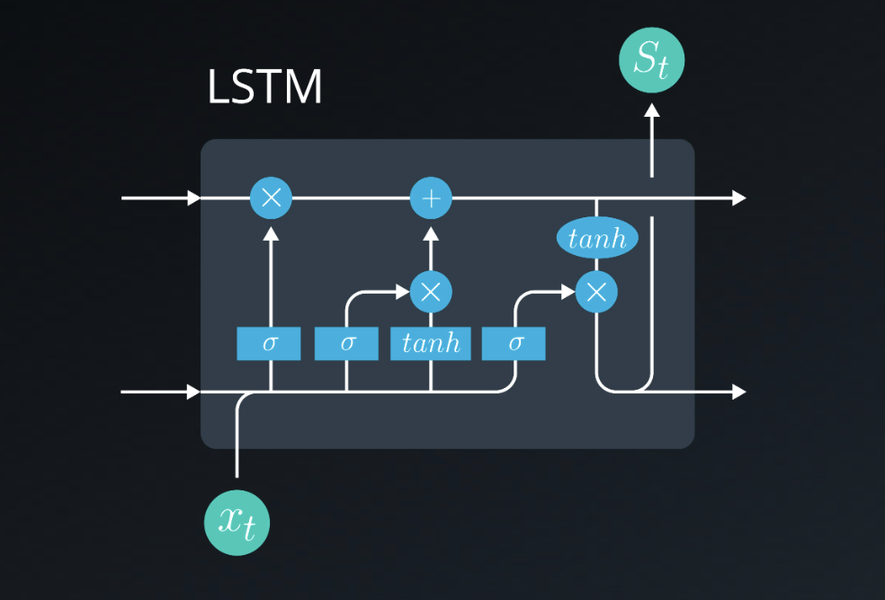
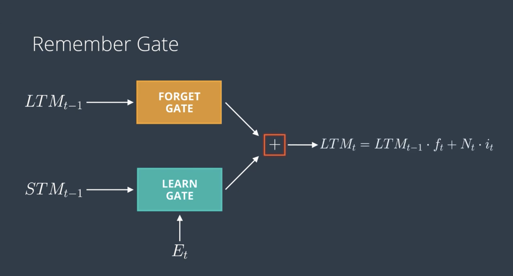
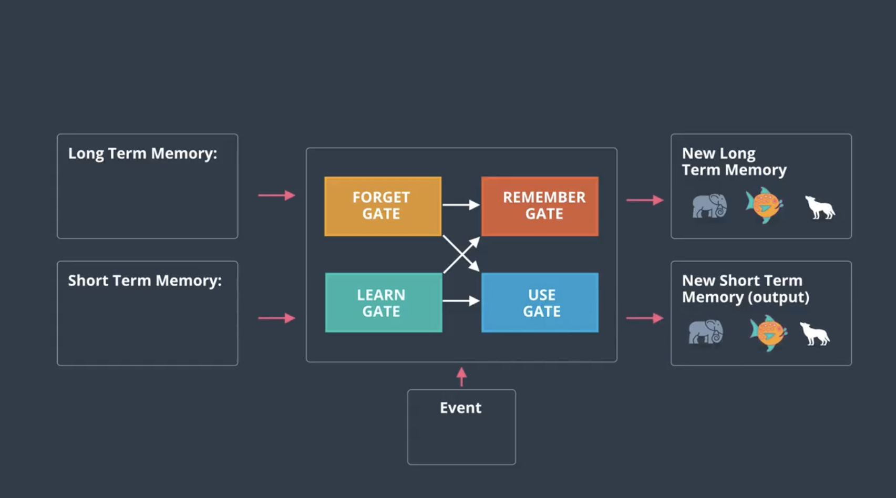

# S-3: RNNs and Transformers

# C-1: Intro to RNN

1. Fundamentals of Recurrent Neural Networks
    - RNN Architecture and Core Concepts
    - Sequential Data Processing Applications
    - Basic RNN Mathematical Formulation
    - Types of RNN Architectures (One-to-One, One-to-Many, Many-to-One, Many-to-Many)
2. The Gradient Problem in RNNs
    - Vanishing Gradient Problem Explained
    - Exploding Gradient Problem and Solutions
    - Mathematical Models (Recurrent Network, Dynamical Systems, Geometric)
    - Gradient Clipping Techniques
3. Advanced RNN Architectures
    - Long Short-Term Memory (LSTM) Networks
    - Gated Recurrent Units (GRU)
    - LSTM vs GRU Comparison
4. Backpropagation Through Time (BPTT)
    - Mathematical Formulation of BPTT
    - Forward and Backward Pass Calculations
    - Truncated BPTT and Implementation Considerations
    - Mini-Batch Training Using Gradient Descent
5. RNNs vs Feed-Forward Neural Networks
    - Architectural Differences and Memory Capabilities
    - Application Domain Comparison
    - Training Process Distinctions
    - Memory and Context Handling
6. Natural Language Processing with RNNs
    - Text Preprocessing Techniques
        - Normalization
        - Tokenization
        - Stop Word Removal
        - Stemming and Lemmatization
    - Word Embedding Methods
        - GloVe (Global Vectors)
        - FastText
        - CharNgram

#### Fundamentals of Recurrent Neural Networks

##### RNN Architecture and Core Concepts

Recurrent Neural Networks (RNNs) represent a fundamental shift in how neural networks process information. Unlike
traditional feedforward networks, RNNs introduce a critical innovation: **memory**.

Think of a regular neural network as someone who meets you for the first time every single day—they process each input
independently with no recollection of previous interactions. In contrast, an RNN is like someone who remembers your past
conversations, allowing each interaction to be informed by what came before.

This memory capability comes from **recurrent connections** in the network architecture. Imagine a loop where
information can travel back into the network, creating a path for information to persist. This simple modification
transforms the network from a static processor into a dynamic system that can work with sequences and maintain context
over time.

The core concept behind RNNs can be understood through this analogy: If a standard neural network is like a single
photograph, an RNN is like a movie—a sequence of frames where each one relates to those that came before it.

In practical terms, RNNs maintain a **hidden state** that acts as the network's memory. This hidden state is updated
with each new input, combining fresh information with the accumulated context from previous steps. This mechanism allows
RNNs to:

1. Process inputs sequentially, one element at a time
2. Maintain a memory of what they've seen before
3. Make decisions informed by both current input and historical context

This architecture creates a profound capability: the ability to learn patterns across time. Whether processing words in
a sentence, notes in a melody, or frames in a video, RNNs can capture how elements relate to each other in
sequence—something fundamentally impossible for traditional neural networks.

For example, consider the sentence: "The clouds are in the \_\_\_." To predict "sky" correctly, a network needs to
remember the earlier words. An RNN maintains this context in its hidden state, allowing it to make predictions based on
the entire sequence history.

The true power of RNNs becomes apparent when we realize that many real-world phenomena are inherently
sequential—language, music, video, sensor readings, stock prices—making RNNs applicable across an extraordinarily wide
range of problems.

##### Sequential Data Processing Applications

The ability of RNNs to process sequential data has opened up solutions to problems that were previously intractable for
neural networks. Let's explore the diverse application domains where RNNs excel:

**Natural Language Processing (NLP)** represents perhaps the most prominent application area for RNNs. Language is
inherently sequential—the meaning of a word depends on the words around it, and the meaning of a sentence depends on the
order of its words. RNNs have revolutionized:

- **Language Modeling**: Predicting the next word in a sequence, enabling applications like predictive text and
  autocomplete
- **Machine Translation**: Translating text from one language to another by understanding sequential dependencies in
  both languages
- **Sentiment Analysis**: Determining the emotional tone of text by tracking how sentiment evolves through a document
- **Text Generation**: Creating coherent paragraphs of text by learning the patterns and structure of language

Consider how "I'm going to the bank" could refer to a financial institution or a riverside, depending on context. RNNs
excel at disambiguating such meanings by maintaining context through their hidden state.

**Time Series Analysis** forms another critical application area. Any data collected over time—from stock prices to
weather measurements—contains temporal patterns that RNNs can learn:

- **Stock Market Prediction**: Learning patterns in financial time series to forecast future movements
- **Weather Forecasting**: Predicting upcoming weather by learning from historical patterns in temperature, pressure,
  and other variables
- **Energy Load Forecasting**: Anticipating electricity demand based on usage patterns, helping power companies optimize
  resources

For example, an RNN analyzing electricity consumption might learn that usage typically spikes at certain hours or
correlates with temperature, allowing it to predict future demand patterns.

**Speech Processing** leverages RNNs' ability to process acoustic signals as sequences:

- **Speech Recognition**: Converting spoken language to text by identifying patterns in audio waveforms
- **Speaker Identification**: Determining who is speaking by learning characteristic patterns in different voices
- **Voice Synthesis**: Generating natural-sounding speech by learning the sequential patterns of human vocalization

**Bioinformatics** has adopted RNNs for analyzing biological sequences:

- **Protein Structure Prediction**: Forecasting how proteins fold by analyzing amino acid sequences
- **DNA Sequence Analysis**: Identifying genes or predicting gene expression from nucleotide sequences
- **Drug Discovery**: Generating potential drug molecules by learning patterns in effective compounds

**Anomaly Detection** in sequential data benefits from RNNs' ability to learn normal patterns and identify deviations:

- **Fraud Detection**: Identifying unusual transaction patterns that might indicate fraud
- **Network Security**: Detecting abnormal traffic patterns that could signal cyber attacks
- **Industrial Equipment Monitoring**: Identifying unusual sensor readings that might indicate impending failure

The versatility of RNNs stems from a key insight: many real-world phenomena involve sequential dependencies where the
past influences the present. By design, RNNs capture this fundamental aspect of reality, making them applicable across
seemingly disparate domains.

What unifies all these applications is that they involve data where order matters and context needs to be
maintained—precisely the strengths that RNNs bring to the table.

##### Basic RNN Mathematical Formulation

To truly understand RNNs, we need to look under the hood at their mathematical formulation. While the equations might
seem intimidating at first, they express a surprisingly intuitive idea: combining new information with remembered
context.

Let's start with the basic recurrent unit. At each time step $t$, an RNN processes an input $x_t$ and updates its hidden
state $h_t$ using the following equation:

$$h_t = \tanh(W_{hh}h_{t-1} + W_{xh}x_t + b_h)$$

This equation might look complex, but we can break it down into intuitive components:

1. $h_{t-1}$ represents the **previous hidden state**—the network's memory of everything it has seen up to this point.
2. $W_{hh}$ is the **recurrent weight matrix** that determines how much of the previous state should influence the
   current state.
3. $x_t$ is the **current input** at time step $t$.
4. $W_{xh}$ is the **input weight matrix** that determines how much the current input should influence the state.
5. $b_h$ is a **bias term** that allows the network to learn baseline activations.
6. The $\tanh$ function squashes the result between -1 and 1, keeping the hidden state values controlled.

Think of this equation as a recipe for mixing memory and new information: the network takes its previous state (memory),
combines it with the new input (fresh information), and produces an updated state that incorporates both.

After updating the hidden state, the RNN can generate an output for the current time step:

$$y_t = W_{hy}h_t + b_y$$

Here, $W_{hy}$ is the output weight matrix, and $b_y$ is the output bias term. This equation transforms the hidden state
into the desired output format.

To make this concrete, let's visualize a simple RNN processing a sequence of words. For the word "cat" in a sentence:

1. The network receives the word embedding for "cat" as input $x_t$
2. It combines this with its memory of previous words (hidden state $h_{t-1}$)
3. It produces an updated hidden state $h_t$ that now incorporates information about "cat"
4. From this updated state, it can generate predictions about the next word

The power of these equations lies in three key properties:

**1. Parameter Sharing:** The same weights ($W_{hh}$, $W_{xh}$, $W_{hy}$) are used at each time step, allowing the
network to learn patterns that can apply anywhere in a sequence.

**2. Variable-length Sequences:** Because the recurrent equation can be applied indefinitely, RNNs can process sequences
of any length using a fixed number of parameters.

**3. Information Integration:** Each hidden state contains a compressed representation of everything the network has
seen so far, allowing it to make decisions based on the entire context.

To visualize how information flows through an RNN over time, think of unrolling the network across time steps:

- At time step 1: $h_1 = \tanh(W_{hh}h_0 + W_{xh}x_1 + b_h)$
- At time step 2: $h_2 = \tanh(W_{hh}h_1 + W_{xh}x_2 + b_h)$
- At time step 3: $h_3 = \tanh(W_{hh}h_2 + W_{xh}x_3 + b_h)$

Each state depends on the previous state, creating a chain of influence that allows information to flow from the
beginning of a sequence all the way to the end.

However, this mathematical formulation also reveals the Achilles' heel of basic RNNs: as the chain grows longer,
information from early steps must pass through many transformations to reach later steps. This can lead to the vanishing
(or exploding) gradient problem, which we'll explore in later sections.

##### Types of RNN Architectures

RNNs come in several architectural variants, each designed to handle different relationships between input and output
sequences. Understanding these architectures is crucial for selecting the right approach for a specific problem.

###### One-to-One Architecture

The One-to-One architecture is the simplest case and actually corresponds to a standard feedforward neural network
without recurrence. In this architecture:

- A single input produces a single output
- No sequential processing occurs
- Mathematical representation: $y = f(x)$

For example, image classification falls into this category—a single image (input) is classified as a single label
(output). This architecture serves as our baseline for comparison, highlighting what traditional networks can do before
we introduce recurrence.

###### One-to-Many Architecture

The One-to-Many architecture takes a single input and produces a sequence of outputs:

- One input → Multiple outputs in sequence
- The hidden state is initialized based on the input, then evolves to generate each output element
- Mathematical representation: $(y_1, y_2, ..., y_n) = f(x)$

Think of this architecture as a storyteller that takes a single prompt and then tells an entire story. Real-world
applications include:

**Image Captioning:** A single image (input) generates a sequence of words describing the image (outputs).

```
Input: [Image of a dog playing in a park]
Outputs: "A", "brown", "dog", "playing", "frisbee", "in", "the", "park"
```

**Music Generation:** A musical style or seed note (input) produces a sequence of notes (outputs).

The key insight: the initial input sets the context, and the network then generates sequential outputs by updating its
hidden state without receiving new external inputs.

###### Many-to-One Architecture

The Many-to-One architecture processes a sequence of inputs to produce a single output:

- Multiple sequential inputs → One output
- The network updates its hidden state with each input, but only produces an output after seeing the entire sequence
- Mathematical representation: $y = f(x_1, x_2, ..., x_n)$

This is like a judge who listens to an entire argument before making a decision. Applications include:

**Sentiment Analysis:** A sequence of words (inputs) produces a single sentiment classification (output).

```
Inputs: "This", "movie", "was", "absolutely", "incredible"
Output: Positive Sentiment (0.95)
```

**Time Series Classification:** A sequence of sensor readings (inputs) results in an activity classification (output).

**Anomaly Detection:** A sequence of system logs (inputs) determines whether the pattern is normal or anomalous
(output).

The power of this architecture lies in its ability to compress information from an entire sequence into a single
decision, focusing on the collective meaning rather than individual elements.

###### Many-to-Many Architecture

The Many-to-Many architecture comes in two important variants, both processing sequences to produce sequences:

**Synchronized Many-to-Many:**

- Each input immediately produces a corresponding output
- The hidden state carries context from previous steps
- Mathematical representation: $(y_1, y_2, ..., y_n) = f(x_1, x_2, ..., x_n)$
- Input and output sequences have the same length

This works like a simultaneous translator who translates each word as it's spoken. Applications include:

**Part-of-Speech Tagging:** Each word in a sentence (input) is assigned its grammatical role (output).

```
Inputs: "The", "cat", "sat", "on", "the", "mat"
Outputs: "DET", "NOUN", "VERB", "PREP", "DET", "NOUN"
```

**Named Entity Recognition:** Each word is classified as a person, organization, location, or none.

**Encoder-Decoder Many-to-Many:**

- Processes the entire input sequence first, then generates the output sequence
- Uses two RNNs: an encoder to process inputs and a decoder to generate outputs
- Mathematical representation: $(y_1, y_2, ..., y_m) = f(x_1, x_2, ..., x_n)$
- Input and output sequences can have different lengths

This is similar to a translator who listens to a complete sentence before translating it. Applications include:

**Machine Translation:** A sequence of words in English (inputs) produces a sequence of words in French (outputs).

```
Inputs: "The", "house", "is", "beautiful"
Outputs: "La", "maison", "est", "belle"
```

**Text Summarization:** A long document (inputs) generates a concise summary (outputs).

**Sequence-to-Sequence Tasks:** Any task where both input and output are sequences of potentially different lengths.

The key distinction between these variants is whether outputs are generated in lockstep with inputs (synchronized) or
after processing the entire input sequence (encoder-decoder).

---

Understanding these architectural patterns provides a framework for approaching sequential problems. When facing a new
task, ask yourself:

1. Is the input a single item or a sequence?
2. Is the output a single item or a sequence?
3. If both are sequences, do they need to have the same length?

The answers guide you to the appropriate RNN architecture, setting the foundation for designing effective solutions to
sequential problems.

#### The Gradient Problem in RNNs

##### Vanishing Gradient Problem Explained

The vanishing gradient problem represents one of the most fundamental challenges in training recurrent neural networks,
effectively limiting their ability to learn long-range dependencies in sequential data. To understand this problem, we
need to examine what happens during the training of RNNs through backpropagation through time (BPTT).

When we train an RNN, we calculate the gradient of the loss function with respect to the weights by applying the chain
rule across time steps. For a sequence of length T, the gradient flows backward from the output through each time step
all the way to the beginning of the sequence. This can be visualized as unfolding the RNN into a very deep feedforward
network with T layers, all sharing the same weights.

The mathematical expression for backpropagating through an RNN illustrates the issue:

$$\frac{\partial L}{\partial W} = \sum_{t=1}^{T} \frac{\partial L_t}{\partial y_t} \frac{\partial y_t}{\partial h_t} \frac{\partial h_t}{\partial h_1} \frac{\partial h_1}{\partial W}$$

The crucial term here is $\frac{\partial h_t}{\partial h_1}$, which represents how the hidden state at time t depends on
the hidden state at time 1. This term can be expanded as:

$$\frac{\partial h_t}{\partial h_1} = \prod_{i=2}^{t} \frac{\partial h_i}{\partial h_{i-1}}$$

This equation reveals the heart of the vanishing gradient problem. We're multiplying many Jacobian matrices together -
one for each time step. In a standard RNN, each of these matrices involves the weight matrix and the derivative of the
activation function:

$$\frac{\partial h_i}{\partial h_{i-1}} = W_{hh}^T \cdot \text{diag}(f'(h_{i-1}))$$

Where $W_{hh}$ is the recurrent weight matrix and $f'$ is the derivative of the activation function (typically tanh or
sigmoid).

Now consider what happens with these common activation functions:

- The derivative of tanh is at most 1.0 and typically much smaller
- The derivative of sigmoid is at most 0.25 and typically smaller

Furthermore, if the largest eigenvalue of the recurrent weight matrix $W_{hh}$ is less than 1, each multiplication
further reduces the gradient magnitude.

This creates a compounding effect. Imagine if each of these terms has a norm of 0.5. After just 10 time steps, the
gradient is reduced by a factor of $0.5^{10} \approx 0.001$ – effectively making it vanish.

To understand this intuitively, think of the gradient as a signal that needs to travel backward through time. With each
step it takes, the signal weakens. By the time it reaches the distant past, the signal has become so faint that it's
practically nonexistent – like trying to hear a whisper across a noisy room.

The consequences of this vanishing gradient are severe:

1. **Limited Memory Horizon**: The network effectively can't learn dependencies that span more than a few time steps,
   typically 8-10 steps in practice.
2. **Bias Toward Recent Information**: The model gives much more weight to recent inputs while largely ignoring early
   parts of the sequence.
3. **Training Difficulties**: The network's parameters receive extremely small updates for long-range dependencies,
   making training slow or impossible.
4. **Underutilization of Network Capacity**: Despite having the theoretical architecture to handle long sequences, the
   network can't effectively use this capacity.

This limitation is particularly problematic in tasks like language modeling, where understanding the context often
requires considering words that appeared many steps earlier. For instance, in the sentence "The person who spoke
multiple languages fluently applied for the translator position," the connection between "person" and "applied" spans
several words but is crucial for understanding.

The vanishing gradient problem is not merely a numerical issue but a fundamental limitation on what traditional RNNs can
learn from sequential data. This recognition led to the development of specialized architectures like LSTM and GRU,
which we'll discuss later, specifically designed to address this problem by creating more stable gradient paths across
time.

##### Exploding Gradient Problem and Solutions

While the vanishing gradient problem gets more attention, the exploding gradient problem can be equally destructive to
the training of RNNs. This phenomenon occurs when, instead of diminishing toward zero, gradients grow exponentially as
they're propagated backward through time.

The exploding gradient problem happens under conditions opposite to those causing vanishing gradients:

1. When the largest eigenvalue of the recurrent weight matrix $W_{hh}$ is greater than 1
2. When repeated multiplication of Jacobian matrices leads to exponential growth rather than decay

Mathematically, looking at the same expansion we examined for vanishing gradients:

$$\frac{\partial h_t}{\partial h_1} = \prod_{i=2}^{t} \frac{\partial h_i}{\partial h_{i-1}}$$

If each factor in this product has a norm greater than 1, the gradient magnitude explodes. For example, if each term has
a norm of 1.5, after just 10 time steps, the gradient increases by a factor of $1.5^{10} \approx 57.7$.

The symptoms of exploding gradients are dramatic and often immediately visible during training:

1. **Numerical Overflow**: Gradient values become so large that they result in NaN (Not a Number) or infinity values.
2. **Erratic Training Dynamics**: Loss values jump wildly from one iteration to the next.
3. **Catastrophic Weight Updates**: Extremely large gradient values cause massive weight changes that destroy any
   learning the network had achieved.
4. **Model Divergence**: Instead of converging toward a solution, the model's parameters move further away from optimal
   values.

Imagine a child learning to ride a bike who overcompensates for every small mistake, swinging wildly from one extreme to
another and never finding balance. This is analogous to what happens when gradients explode in an RNN.

Fortunately, unlike the vanishing gradient problem, which requires architectural changes to fully address, the exploding
gradient problem has a relatively straightforward solution: gradient clipping.

**Gradient Clipping Solutions:**

Gradient clipping is a technique that limits the magnitude of gradients before applying weight updates. It effectively
places a ceiling on how large gradient values can become, preventing the explosive growth that destabilizes training.
There are two main approaches:

1. **Norm Clipping**: This method rescales gradients when their norm exceeds a threshold:

$$\text{if } |\nabla| > \text{threshold}: \nabla = \text{threshold} \cdot \frac{\nabla}{|\nabla|}$$

Where $|\nabla|$ represents the L2 norm of the gradient vector.

This approach preserves the direction of the gradient while limiting its magnitude, like preserving the steering
direction but limiting the speed.

1. **Value Clipping**: This simpler approach clips individual gradient values to a range:

$$\nabla_{\text{clipped}} = \text{max}(\text{min}(\nabla, \text{threshold}), -\text{threshold})$$

While value clipping is simpler to implement, norm clipping is generally preferred as it preserves the relative
proportions between gradient components.

Beyond gradient clipping, several other techniques can help prevent or mitigate exploding gradients:

- **Proper Weight Initialization**: Techniques like Xavier/Glorot or orthogonal initialization can help keep gradient
  magnitudes stable during the initial phase of training.
- **Regularization**: L1 or L2 regularization can discourage the model from learning weight configurations that might
  lead to gradient explosion.
- **Batch Normalization**: Though less common in RNNs than in feedforward networks, batch normalization can help
  stabilize the distribution of activations, indirectly addressing gradient issues.
- **Learning Rate Scheduling**: Starting with a small learning rate and gradually increasing it can help avoid the large
  weight updates that exacerbate exploding gradients.

The exploding gradient problem, while disruptive, is considered more manageable than the vanishing gradient problem.
Gradient clipping provides an effective bandage that allows training to proceed, whereas vanishing gradients require
fundamental redesigns of the network architecture to create paths for gradients to flow unimpeded across many time
steps.

In practice, detecting exploding gradients is straightforward—the loss becomes NaN, or training becomes wildly unstable.
Many modern deep learning frameworks even implement automatic gradient clipping as a safeguard, allowing practitioners
to focus on other aspects of model development with confidence that exploding gradients won't derail their work.

##### Mathematical Models (Recurrent Network, Dynamical Systems, Geometric)

To gain deeper insight into gradient problems in RNNs, we can view them through three complementary mathematical lenses:
the recurrent network model, dynamical systems theory, and geometric interpretation. Each perspective illuminates
different aspects of why gradients vanish or explode and suggests different approaches to addressing these issues.

###### Recurrent Network Model

The recurrent network perspective examines how information and gradients flow through the network's explicit
computational architecture.

In this view, we consider the basic evolution equation of an RNN:

$$(h_t, x_t) = F(h_{t-1}, u_t, \theta)$$

Where:

- $h_t$ represents hidden states
- $x_t$ represents outputs
- $u_t$ represents inputs
- $\theta$ represents parameters

For a simple RNN with sigmoid activation, this becomes:

$$h_t = F(h_{t-1}, u_t, \theta) = W_{rec}\sigma(h_{t-1}) + W_{in}u_t + b$$

The gradient analysis in this framework involves examining the Jacobian matrix:

$$\nabla_h F(h_{t-1}, u_t, \theta) = W_{rec}\text{diag}(\sigma'(h_{t-1}))$$

This Jacobian matrix describes how small changes in the hidden state at time t-1 affect the hidden state at time t.
During backpropagation, this matrix (or its transpose) is multiplied repeatedly as gradients flow backward through time.

The eigenvalues of this Jacobian determine whether gradients will vanish or explode:

- If the largest eigenvalue is less than 1, gradients will vanish over time
- If the largest eigenvalue is greater than 1, gradients will explode over time

This model clearly illustrates how the choice of activation function ($\sigma$) and the recurrent weight matrix
($W_{rec}$) directly influence whether gradients vanish or explode.

###### Dynamical Systems Model

The dynamical systems perspective treats RNNs as continuous-time systems governed by differential equations. This view
helps understand the long-term behavior of the network as a dynamical system evolving over time.

A one-neuron recurrent network with sigmoid activation can be represented as:

$$\frac{dh}{dt} = -h(t) + \sigma(wh(t) + b) + w'u(t)$$

This differential equation describes how the hidden state evolves continuously. For autonomous cases (with no input,
$u = 0$), stable points occur where:

$$h = \sigma(wh + b)$$

These stable points act as attractors in the state space. If a hidden state falls within the basin of attraction of one
of these points, it will eventually converge to that point, effectively "forgetting" its initial state.

The dynamical systems view provides crucial insights:

- Vanishing gradients correspond to strong attractors that cause different initial states to converge rapidly
- Exploding gradients correspond to repellers or unstable regions where small differences in initial states grow rapidly
- Effective long-term memory requires systems that balance between these extremes, creating metastable states or slow
  dynamics

This perspective helps explain why RNNs struggle with long-term dependencies: the dynamical system tends to either lose
information rapidly (vanishing) or amplify small differences chaotically (exploding).

###### Geometric Model

The geometric perspective focuses on the shape of the loss landscape that the optimization algorithm traverses during
training.

With a sample loss function:

$$L(h(T)) = (0.855 - h(T))^2$$

The gradient of this loss with respect to the parameters determines the direction and magnitude of weight updates during
training.

In this geometric view:

- Vanishing gradients correspond to extremely flat regions in the loss landscape, where the gradient provides little
  guidance for optimization
- Exploding gradients correspond to extremely steep regions, where small steps in parameter space cause large jumps in
  the loss
- Ideal training conditions occur in regions with moderate slopes, providing clear direction without excessive steepness

This visualization helps explain why vanishing gradients make learning so difficult—it's like trying to find your way
across a vast, nearly flat plateau with no discernible slope to indicate the correct direction. Conversely, exploding
gradients are like trying to balance on a razor-sharp ridge where the slightest movement causes you to fall
precipitously.

###### Unified Understanding

These three models complement each other to provide a comprehensive understanding of the gradient problems in RNNs:

1. The recurrent network model shows the direct mathematical cause in terms of matrix operations and parameter values
2. The dynamical systems model reveals how the network's behavior evolves over time and how it naturally tends toward
   certain stability patterns
3. The geometric model illustrates why these problems make optimization difficult in terms of navigating the loss
   landscape

This multi-perspective understanding has driven the development of solutions like:

- LSTM and GRU architectures, which create alternative paths for gradient flow (network perspective)
- Gating mechanisms that allow controlled information persistence without vanishing or exploding (dynamical systems
  perspective)
- Optimization techniques like gradient clipping that make navigating the loss landscape more manageable (geometric
  perspective)

By viewing the gradient problems through these complementary lenses, researchers have developed increasingly
sophisticated approaches to training recurrent networks for long-term dependencies, culminating in the advanced
architectures we use today.

##### Gradient Clipping Techniques

Gradient clipping is a straightforward yet effective technique for addressing the exploding gradient problem in RNNs. It
serves as a safeguard during training, preventing extremely large gradient values from destabilizing the optimization
process. Let's explore the various approaches to implementing gradient clipping, along with their mathematical
formulation and practical considerations.

###### Global Norm Clipping

This is the most common form of gradient clipping, where the gradient vector's norm is scaled down if it exceeds a
threshold:

$$g_{\text{clipped}} = \begin{cases} g & \text{if } ||g|| \leq \text{threshold} \ \text{threshold} \cdot \frac{g}{||g||} & \text{if } ||g|| > \text{threshold} \end{cases}$$

Where:

- $g$ is the original gradient vector across all parameters
- $||g||$ is the L2 norm (Euclidean length) of the gradient vector
- $\text{threshold}$ is a hyperparameter that sets the maximum allowed gradient norm

Conceptually, this approach is like putting a speed limit on how quickly the model can change in any direction. It
preserves the direction of the gradient while limiting its magnitude, ensuring that weight updates remain reasonable
even when the computed gradients are extreme.

For example, if the calculated gradient has a norm of 15.0 and our threshold is 5.0, we would scale the entire gradient
vector by a factor of 5/15 = 1/3, preserving its direction but reducing its magnitude to the threshold value.

```python
# Pseudocode for global norm clipping
def clip_by_global_norm(gradients, threshold):
    global_norm = sqrt(sum([sum(g**2) for g in gradients]))
    if global_norm > threshold:
        scale = threshold / global_norm
        return [g * scale for g in gradients]
    return gradients
```

The key advantage of global norm clipping is that it maintains the relative proportions between gradient components,
preserving the underlying directional information while controlling the overall magnitude of the update.

###### Per-Parameter Value Clipping

In this simpler approach, individual gradient values are clipped to a specified range:

$$g_{\text{clipped},i} = \max(\min(g_i, \text{threshold}), -\text{threshold})$$

Where:

- $g_i$ is the gradient for parameter i
- $\text{threshold}$ defines the allowable range [-threshold, threshold]

This method is more straightforward to implement but has a significant drawback: it changes the direction of the
gradient, potentially leading to suboptimal optimization paths. It's like forcing a diagonal movement to become a square
one by limiting each component independently.

```python
# Pseudocode for per-parameter clipping
def clip_by_value(gradients, threshold):
    return [np.clip(g, -threshold, threshold) for g in gradients]
```

While simpler, this approach is generally less preferred in practice because it distorts the relative importance of
different gradient components.

###### Adaptive Clipping

More sophisticated approaches adapt the clipping threshold based on the history of gradient norms:

$$\text{threshold}*t = \alpha \cdot \text{threshold}*{t-1} + (1-\alpha) \cdot ||g_t||$$

Where:

- $\alpha$ is a smoothing factor (typically close to 1)
- $\text{threshold}_t$ is the adaptive threshold at time t
- $||g_t||$ is the norm of the current gradient

This adaptive approach automatically adjusts to different phases of training and various layer types within the network.
During the initial phases of training when gradients might naturally be larger, the threshold adapts upward. As training
progresses and gradients typically become smaller, the threshold follows suit.

###### Implementation Considerations

When implementing gradient clipping, several important factors should be considered:

1. **Threshold Selection**: The clipping threshold is a critical hyperparameter. Too small a value can slow down
   learning by restricting legitimate gradients, while too large a value might not effectively prevent explosions.
   Typical values range from 1.0 to 10.0, but the optimal value depends on the specific model architecture and task.
2. **Clipping Timing**: Clipping can be applied either before or after gradient averaging in mini-batch training.
   Clipping before averaging clips individual examples' gradients, while clipping after averaging clips the batch
   gradient. The latter approach is more common and computationally efficient.
3. **Monitoring**: Tracking the frequency and magnitude of clipping operations provides valuable insights into training
   stability:
    - If clipping rarely occurs, consider increasing the threshold
    - If clipping happens frequently, the model might have fundamental instabilities that should be addressed through
      architectural changes
    - The pattern of clipping across layers can identify problematic components of the network
4. **Complementary Techniques**: Gradient clipping works best when combined with:
    - Proper weight initialization (e.g., orthogonal initialization for recurrent weights)
    - Batch normalization or layer normalization
    - Appropriate activation functions
    - Learning rate scheduling

It's important to note that while gradient clipping effectively addresses the exploding gradient problem, it does not
solve the vanishing gradient problem. For that, architectural solutions like LSTM and GRU are required, as they create
paths for gradients to flow more easily across time steps.

Most modern deep learning frameworks provide built-in functions for gradient clipping:

```python
# TensorFlow example
optimizer = tf.keras.optimizers.Adam(learning_rate=0.001)
optimizer = tf.keras.optimizers.experimental.clip_by_global_norm(optimizer, clip_norm=5.0)

# PyTorch example
optimizer = torch.optim.Adam(model.parameters(), lr=0.001)
torch.nn.utils.clip_grad_norm_(model.parameters(), max_norm=5.0)
```

In practice, gradient clipping is often applied as a default safety mechanism when training RNNs, LSTMs, and GRUs. Even
with advanced architectures designed to mitigate gradient problems, the additional stability provided by clipping can
improve training reliability with minimal computational overhead.

The elegance of gradient clipping lies in its simplicity and effectiveness - it requires minimal computational overhead
while providing significant stability benefits, making it a standard practice in training recurrent neural networks for
complex sequential tasks.

#### Advanced RNN Architectures

##### Long Short-Term Memory (LSTM) Networks

Long Short-Term Memory (LSTM) networks represent a revolutionary advancement in recurrent neural network design.
Introduced by Hochreiter and Schmidhuber in 1997, LSTMs were specifically created to address the vanishing gradient
problem that prevents standard RNNs from learning long-range dependencies.

The fundamental insight behind LSTMs is that we need a more controlled way for information to flow through the network
across time steps. Rather than forcing all information to pass through the same transformation at each step (as in
standard RNNs), LSTMs create a separate pathway—a "memory cell"—that can maintain information with minimal interference.

To understand LSTMs, imagine a conveyor belt (the cell state) moving through a factory. At various points, workers
(gates) can decide to add items to the belt, remove items, or let items pass through unchanged. This controlled flow
allows important information to travel long distances without degradation.

The LSTM architecture consists of three primary components:

1. **Cell State (C)**: This is the "conveyor belt" that runs through the entire sequence, carrying information with
   minimal distortion. It provides a direct pathway for information to flow across many time steps.
2. **Hidden State (h)**: This is the "working memory" that gets updated at each step and is used for making predictions.
   It interacts with the current input and the cell state.
3. **Gates**: These are neural network layers that control what information enters, exits, or is forgotten from the cell
   state. There are three gates in a standard LSTM:
    - **Forget Gate**: Decides what information to discard from the cell state
    - **Input Gate**: Decides what new information to store in the cell state
    - **Output Gate**: Decides what information from the cell state to use for the hidden state

Let's walk through the mathematical formulation of an LSTM, step by step:

**1. Forget Gate**: This gate determines what information should be thrown away from the cell state. It looks at the
previous hidden state and current input, outputting values between 0 (completely forget) and 1 (completely keep).

$$f_t = \sigma(W_f \cdot [h_{t-1}, x_t] + b_f)$$

Where $\sigma$ is the sigmoid function, which outputs values between 0 and 1.

**2. Input Gate**: This mechanism controls what new information will be stored in the cell state. It consists of two
parts:

- The input gate itself, which decides which values to update: $$i_t = \sigma(W_i \cdot [h_{t-1}, x_t] + b_i)$$
- A candidate cell state created through a tanh layer: $$\tilde{C}*t = \tanh(W_C \cdot [h*{t-1}, x_t] + b_C)$$

**3. Cell State Update**: The old cell state is updated with the results from the forget and input gates:

$$C_t = f_t \times C_{t-1} + i_t \times \tilde{C}_t$$

This equation performs the core memory operation of an LSTM. It first scales the old cell state by the forget gate
(removing information we want to forget), then adds the scaled new candidate values (adding information we want to
remember).

**4. Output Gate**: This gate controls what parts of the cell state will be output to the hidden state:

$$o_t = \sigma(W_o \cdot [h_{t-1}, x_t] + b_o)$$

**5. Hidden State Update**: Finally, the hidden state is computed as a filtered version of the cell state:

$$h_t = o_t \times \tanh(C_t)$$

The tanh function squashes the cell state values between -1 and 1, and the output gate decides which parts of this to
output.

To visualize the flow of information, let's consider a concrete example:

Imagine an LSTM processing the sentence "The cat, which was very old, sat on the mat." When the network encounters
"was," the forget gate might assign a high value (close to 1) for information about "the cat," as this is the subject
that "was" refers to. The input gate might add information about the age attribute ("very old"). Later, when processing
"sat," the network still has access to "the cat" information in its cell state because the forget gate allowed that
information to persist.

This ability to selectively remember and forget is what gives LSTMs their power to handle long-range dependencies. When
the forget gate is mostly open (values close to 1) and the input gate is mostly closed (values close to 0), the cell
state provides a clear path for information to flow unimpeded across many time steps—a property often called the
"constant error carousel" (CEC).

The CEC addresses the vanishing gradient problem directly. During backpropagation, gradients can flow backward through
the cell state with minimal attenuation, allowing the network to learn dependencies that span hundreds or even thousands
of time steps. This is impossible for standard RNNs, which typically can't learn dependencies spanning more than 8-10
steps.

LSTMs have transformed the landscape of sequence modeling, enabling breakthroughs in machine translation, speech
recognition, text generation, and many other domains where understanding long-range context is crucial. Their ability to
maintain relevant information over extended sequences while forgetting irrelevant details gives them a form of adaptive
memory that closely mirrors how humans process sequential information.

##### Gated Recurrent Units (GRU)

Gated Recurrent Units (GRUs) emerged as a streamlined alternative to LSTMs, introduced by Cho et al. in 2014. They
maintain the essential ability to capture long-term dependencies while using a simpler architecture with fewer
parameters, making them computationally more efficient.

The GRU can be thought of as a more efficient redesign of the LSTM. If the LSTM is like a factory with three specialized
workers controlling the conveyor belt, the GRU is like a factory that has merged roles to have just two workers handling
similar tasks more efficiently.

The key simplification in GRUs is that they combine the cell state and hidden state into a single state vector and use
only two gates instead of three. Let's explore how these components work together:

**1. Update Gate**: This gate determines how much of the previous hidden state should be kept versus how much of the new
candidate state should be used. It functions similarly to a combined forget and input gate from LSTMs:

$$z_t = \sigma(W_z \cdot [h_{t-1}, x_t] + b_z)$$

The update gate produces values between 0 and 1. Values close to 1 indicate "update with new information," while values
close to 0 mean "keep the old information."

**2. Reset Gate**: This gate controls how much of the previous hidden state should be used when computing the new
candidate state, allowing the unit to effectively "forget" when necessary:

$$r_t = \sigma(W_r \cdot [h_{t-1}, x_t] + b_r)$$

When the reset gate outputs values close to 0, it effectively makes the unit "forget" the previous state and reset
itself, focusing only on the current input.

**3. Candidate Hidden State**: The reset gate helps create a candidate hidden state that combines the current input with
a selectively filtered version of the previous hidden state:

$$\tilde{h}*t = \tanh(W_h \cdot [r_t \times h*{t-1}, x_t] + b_h)$$

The element-wise multiplication of the reset gate with the previous hidden state determines how much of the past
information to forget before using it to compute the new candidate state.

**4. Final Hidden State Update**: The update gate then decides how much of the previous hidden state to keep versus how
much of the candidate state to incorporate:

$$h_t = (1 - z_t) \times h_{t-1} + z_t \times \tilde{h}_t$$

This equation is the core of the GRU's memory mechanism. It performs an interpolation between the previous state and the
candidate state, controlled by the update gate.

To illustrate how a GRU processes information, let's consider an example:

Imagine a GRU processing a news article about climate change. When encountering a sentence like "Global temperatures
have risen by 1 degree since 1900," the update gate might assign high values when processing "risen," indicating that
this information about temperature change is important to remember. The reset gate might be more active when the article
shifts to a new subtopic, helping the network to focus on new information rather than being influenced too much by
previous contexts.

The mathematical design of GRUs presents several elegant properties:

1. **Complementary Weighting**: The use of $(1-z_t)$ for weighting the previous state and $z_t$ for the candidate state
   ensures that the total influence sums to 1, creating a well-behaved interpolation.
2. **Adaptive Time Scales**: GRUs can learn to operate at different time scales for different features. Some units might
   have update gates that frequently open, creating "fast" features that change rapidly, while others might have update
   gates that rarely open, creating "slow" features that maintain information for many time steps.
3. **Dynamic Reset**: The reset gate allows the network to temporarily ignore previous states when necessary, helping it
   to handle abrupt transitions in sequences.

The GRU's ability to selectively update its hidden state makes it particularly effective at capturing medium to
long-range dependencies while remaining computationally efficient. It offers an attractive balance between the
expressive power of LSTMs and the simplicity of standard RNNs.

Through its carefully designed gating mechanisms, the GRU provides paths for gradients to flow backward through time
with minimal vanishing, allowing it to learn temporal patterns that standard RNNs cannot capture. This capability,
combined with its more streamlined design, has made GRUs popular for many sequence modeling tasks, especially when
computational efficiency is a concern.

##### LSTM vs GRU Comparison

When choosing between LSTM and GRU architectures for a sequential modeling task, understanding their relative strengths,
weaknesses, and practical differences becomes crucial. Both successfully address the vanishing gradient problem, but
they differ in several important aspects that can impact their performance and suitability for specific applications.

**Structural Differences**

The most fundamental distinction lies in architectural complexity:

1. **State Representation**:
    - LSTMs maintain separate cell state (C) and hidden state (h) vectors
    - GRUs combine these into a single hidden state vector
2. **Gating Mechanisms**:
    - LSTMs employ three gates: forget, input, and output
    - GRUs use only two gates: update and reset
3. **Information Flow**:
    - LSTMs use additive updates to the cell state: $C_t = f_t \times C_{t-1} + i_t \times \tilde{C}_t$
    - GRUs use interpolation between states: $h_t = (1 - z_t) \times h_{t-1} + z_t \times \tilde{h}_t$
4. **Output Control**:
    - LSTMs have an explicit output gate controlling what information reaches the next layer
    - GRUs lack this separate output control mechanism

These architectural differences translate into practical considerations that affect how these models perform in
real-world applications:

**Parameter Efficiency and Computational Cost**

GRUs are more efficient in terms of parameters and computation:

1. **Parameter Count**:
    - GRUs typically have about 25% fewer parameters than LSTMs with the same hidden state size
    - For a hidden state of size h and input of size d, an LSTM requires 4 weight matrices of size h×(h+d), while a GRU
      needs 3 such matrices
2. **Computational Requirements**:
    - Training and inference with GRUs is approximately 30% faster than with equivalent LSTMs
    - GRUs require less memory during training and deployment
    - The reduced complexity makes GRUs easier to parallelize in some hardware implementations

Let's quantify this with an example: For a hidden state size of 256 and input size of 100, an LSTM would have
approximately 365,568 parameters in its gates, while a GRU would have about 274,176—a significant reduction.

**Memory Capacity and Expressiveness**

LSTMs often have an edge in memory capacity:

1. **Separate Memory Cell**:
    - LSTMs' separate cell state provides a cleaner memory pathway with less interference
    - The output gate gives LSTMs more control over what information influences the next layer
    - This separation can help LSTMs store more fine-grained information
2. **Output Filtering**:
    - LSTMs can choose to output only specific parts of their memory via the output gate
    - GRUs expose their entire memory content (modulated by the update gate)
3. **Complex Sequence Handling**:
    - For very long sequences or those with complex dependencies, the additional expressiveness of LSTMs can be
      beneficial
    - LSTMs can maintain multiple pieces of information more distinctly in their memory

**Training Dynamics and Performance**

The architectures show different behaviors during training:

1. **Convergence Speed**:
    - GRUs often converge faster during training due to their simpler structure
    - This faster convergence can be particularly valuable during hyperparameter tuning
2. **Final Performance**:
    - LSTMs may achieve better final performance on complex tasks given sufficient training time
    - The performance gap is often task-dependent and sometimes negligible
3. **Overfitting Tendencies**:
    - GRUs can be less prone to overfitting on smaller datasets due to their reduced parameter count
    - LSTMs' additional capacity sometimes requires more regularization

**Task-Specific Performance Patterns**

Research has shown that the relative performance depends significantly on the specific task:

1. **Language Modeling and Translation**:
    - LSTMs often perform slightly better when given sufficient data and training time
    - Their separate memory pathway seems particularly suited to language tasks
2. **Speech Recognition**:
    - GRUs frequently achieve comparable or sometimes better results with greater efficiency
    - The simpler structure may be sufficient for the patterns in audio data
3. **Time Series Forecasting**:
    - For financial or sensor data, GRUs often provide competitive performance with fewer resources
    - The choice depends on the complexity and periodicity of the time series
4. **Sequence Length Considerations**:
    - For very long sequences (thousands of steps), LSTMs' separate memory cell can provide advantages
    - For shorter sequences, GRUs often perform equally well at lower computational cost

**Gradient Flow Properties**

Both architectures create paths for gradients to flow backward through time, but with subtle differences:

1. **LSTM's Constant Error Carousel**:
    - The cell state provides a direct pathway with minimal transformation
    - When the forget gate is open (close to 1) and input gate is closed (close to 0), gradients flow almost unchanged
2. **GRU's Update Gate Mechanism**:
    - The interpolation between states via the update gate provides a similar but slightly different mechanism
    - When the update gate is close to 0, information persists with minimal change
3. **Reset Mechanism Differences**:
    - The LSTM's forget gate completely erases information by multiplication with values near 0
    - The GRU's reset gate modulates how much past information affects the candidate state computation

**Implementation Considerations**

When implementing these architectures:

1. **State Initialization**:
    - LSTMs require initializing both hidden and cell states
    - GRUs need only a single hidden state, simplifying implementation
2. **Bias Initialization**:
    - LSTM implementations often benefit from initializing the forget gate bias to 1.0 (encouraging remembering by
      default)
    - GRUs typically work well with standard initialization techniques
3. **Framework Support**:
    - Both architectures are well-supported in modern deep learning frameworks
    - Some frameworks optimize GRUs more aggressively due to their simpler structure

**Practical Guidance for Selection**

As a general rule of thumb:

1. **Start with GRUs when**:
    - Working with limited computational resources
    - Dealing with smaller datasets
    - Needing faster training cycles
    - The sequence length is moderate
    - Simple implementation is preferred
2. **Consider LSTMs when**:
    - Modeling very long-range dependencies
    - Working with complex, large datasets
    - Maximum performance is more important than computational efficiency
    - You have sufficient computational resources available
    - The task involves multiple types of information that need to be tracked separately

A comparative table highlights key differences:

| Aspect            | LSTM                            | GRU                 |
| ----------------- | ------------------------------- | ------------------- |
| States            | Separate cell and hidden states | Single hidden state |
| Gates             | Three (forget, input, output)   | Two (update, reset) |
| Parameters        | More                            | ~25% fewer          |
| Computation       | More intensive                  | More efficient      |
| Memory Capacity   | Potentially higher              | Somewhat limited    |
| Training Speed    | Slower                          | Faster              |
| Implementation    | More complex                    | Simpler             |
| Long Dependencies | Excellent                       | Very good           |
| Small Datasets    | May overfit                     | Often better        |

In practice, the best approach is to try both architectures and let empirical results guide the final decision. The
optimal choice depends on the specific characteristics of the task, dataset, and available resources. Modern deep
learning frameworks make it relatively straightforward to experiment with both architectures to determine which works
best for a particular application.

Both LSTMs and GRUs represent tremendous advances over standard RNNs. Whichever you choose, you'll benefit from their
ability to learn long-range dependencies and capture temporal patterns in sequential data—capabilities that have
revolutionized how we approach sequence modeling tasks across numerous domains.

#### Backpropagation Through Time (BPTT)

##### Mathematical Formulation of BPTT

Backpropagation Through Time (BPTT) extends standard backpropagation to handle the temporal dynamics of recurrent neural
networks. While traditional backpropagation works with feedforward networks by computing gradients layer by layer, BPTT
must account for how information flows across time steps through recurrent connections.

To understand BPTT, let's first recall how an RNN processes a sequence. For a sequence of inputs $x_1, x_2, ..., x_T$,
the RNN computes a sequence of hidden states $h_1, h_2, ..., h_T$ and outputs $y_1, y_2, ..., y_T$ using these
recurrence relations:

$$h_t = \tanh(W_{hh}h_{t-1} + W_{xh}x_t + b_h)$$ $$y_t = W_{hy}h_t + b_y$$

Where:

- $W_{hh}$ is the recurrent weight matrix
- $W_{xh}$ is the input-to-hidden weight matrix
- $W_{hy}$ is the hidden-to-output weight matrix
- $b_h$ and $b_y$ are bias terms

The key insight of BPTT is that we can "unfold" the RNN across time steps, effectively treating it as a very deep
feedforward network where each layer corresponds to a time step. The crucial difference is that the same weights
($W_{hh}$, $W_{xh}$, $W_{hy}$) are reused at each time step.

When we train an RNN, we need to compute how changes in these weights affect the overall loss. Given a loss function
$L$, the total loss over the sequence is:

$$L_{total} = \sum_{t=1}^{T} L_t(y_t, \hat{y}_t)$$

Where $\hat{y}_t$ is the target output at time $t$.

The gradients for the weight matrices are computed by summing contributions across all time steps:

$$\frac{\partial L_{total}}{\partial W_{hy}} = \sum_{t=1}^{T} \frac{\partial L_t}{\partial W_{hy}}$$

$$\frac{\partial L_{total}}{\partial W_{xh}} = \sum_{t=1}^{T} \frac{\partial L_t}{\partial W_{xh}}$$

The most complex case is computing the gradient for the recurrent weight matrix $W_{hh}$, because changes in this matrix
at an early time step affect all subsequent time steps. The gradient is:

$$\frac{\partial L_{total}}{\partial W_{hh}} = \sum_{t=1}^{T} \sum_{k=1}^{t} \frac{\partial L_t}{\partial y_t} \frac{\partial y_t}{\partial h_t} \frac{\partial h_t}{\partial h_k} \frac{\partial h_k}{\partial W_{hh}}$$

This equation captures a fundamental aspect of BPTT: the gradient at each time step depends not just on the current time
step, but on all future time steps as well. The term $\frac{\partial h_t}{\partial h_k}$ represents how the hidden state
at time $t$ depends on the hidden state at an earlier time $k$.

For $t > k$, this dependency is calculated as:

$$\frac{\partial h_t}{\partial h_k} = \prod_{i=k+1}^{t} \frac{\partial h_i}{\partial h_{i-1}}$$

Each term in this product is:

$$\frac{\partial h_i}{\partial h_{i-1}} = \text{diag}(1 - \tanh^2(W_{hh}h_{i-1} + W_{xh}x_i + b_h)) \cdot W_{hh}$$

This reveals why vanishing and exploding gradients occur: as we multiply many such terms together, the product either
shrinks toward zero (vanishing) or grows explosively (exploding).

Think of BPTT as tracing the ripple effects of a change in weights through time. If we adjust $W_{hh}$ at time step 1,
this affects $h_1$, which affects $h_2$, which affects $h_3$, and so on, creating a cascade of effects that must all be
accounted for in the gradient calculation.

The temporal dependencies in RNNs make BPTT more complex than standard backpropagation, but the core principle remains
the same: compute how changes in parameters affect the loss through the chain rule of calculus, and use these gradients
to update the parameters to minimize the loss.

##### Forward and Backward Pass Calculations

The BPTT algorithm consists of two main phases: the forward pass and the backward pass. Let's examine each phase in
detail, with concrete calculations to illustrate how information flows through the network and how gradients are
computed.

**Forward Pass:**

During the forward pass, the RNN processes the input sequence chronologically, from the first time step to the last:

1. Initialize the first hidden state, typically to zeros: $h_0 = \vec{0}$
2. For each time step $t$ from 1 to $T$:
    - Compute the hidden state: $h_t = \tanh(W_{hh}h_{t-1} + W_{xh}x_t + b_h)$
    - Compute the output: $y_t = W_{hy}h_t + b_y$
    - Calculate the loss: $L_t = L(y_t, \hat{y}_t)$
3. Compute the total loss: $L_{total} = \sum_{t=1}^{T} L_t$

Throughout this process, we store all intermediate values ($h_t$ and $y_t$ for all $t$), as they'll be needed during the
backward pass.

Let's illustrate with a simplified numerical example. Consider an RNN with:

- Hidden state size: 2
- Input size: 3
- Output size: 1
- Sequence length: 3

With example weight matrices:

- $W_{hh} = \begin{bmatrix} 0.1 & 0.2 \ 0.3 & 0.1 \end{bmatrix}$
- $W_{xh} = \begin{bmatrix} 0.4 & 0.5 & 0.6 \ 0.7 & 0.8 & 0.9 \end{bmatrix}$
- $W_{hy} = \begin{bmatrix} 0.5 & 0.5 \end{bmatrix}$
- $b_h = \begin{bmatrix} 0.1 \ 0.1 \end{bmatrix}$
- $b_y = \begin{bmatrix} 0.1 \end{bmatrix}$

For time step 1, with input $x_1 = \begin{bmatrix} 1 & 0 & 1 \end{bmatrix}^T$ and
$h_0 = \begin{bmatrix} 0 & 0 \end{bmatrix}^T$:

$h_1 = \tanh\left(W_{hh}h_0 + W_{xh}x_1 + b_h\right) = \tanh\left(\begin{bmatrix} 0 \ 0 \end{bmatrix} + \begin{bmatrix} 0.4 + 0 + 0.6 \ 0.7 + 0 + 0.9 \end{bmatrix} + \begin{bmatrix} 0.1 \ 0.1 \end{bmatrix}\right) = \tanh\left(\begin{bmatrix} 1.1 \ 1.7 \end{bmatrix}\right) \approx \begin{bmatrix} 0.80 \ 0.94 \end{bmatrix}$

$y_1 = W_{hy}h_1 + b_y = \begin{bmatrix} 0.5 & 0.5 \end{bmatrix} \begin{bmatrix} 0.80 \ 0.94 \end{bmatrix} + 0.1 \approx 0.97$

If the target output is $\hat{y}_1 = 1$, and we use squared error loss:
$L_1 = (y_1 - \hat{y}_1)^2 = (0.97 - 1)^2 \approx 0.0009$

We would continue similarly for time steps 2 and 3, storing all intermediate values.

**Backward Pass:**

The backward pass propagates error gradients backward through time, from the last time step to the first:

1. Initialize gradients for all parameters to zero:
    - $\nabla W_{hh} = 0$, $\nabla W_{xh} = 0$, $\nabla W_{hy} = 0$
    - $\nabla b_h = 0$, $\nabla b_y = 0$
2. Initialize the error gradient for the final hidden state: $\delta h_T = \vec{0}$
3. For each time step $t$ from $T$ down to 1:
    - Compute the output error gradient: $$\delta y_t = \frac{\partial L_t}{\partial y_t}$$
    - Compute the hidden state error gradient, including error flowing from the output and from the next time step (if
      any):
      $$\delta h_t = W_{hy}^T \delta y_t + \delta h_{t+1} \odot (1 - \tanh^2(W_{hh}h_{t-1} + W_{xh}x_t + b_h)) \cdot W_{hh}^T$$
    - Accumulate gradients for the parameters: $$\nabla W_{hy} += \delta y_t h_t^T$$
      $$\nabla W_{hh} += \delta h_t h_{t-1}^T$$ $$\nabla W_{xh} += \delta h_t x_t^T$$ $$\nabla b_h += \delta h_t$$
      $$\nabla b_y += \delta y_t$$
4. Update the parameters using gradient descent:
    - $W_{hh} = W_{hh} - \alpha \nabla W_{hh}$
    - $W_{xh} = W_{xh} - \alpha \nabla W_{xh}$
    - $W_{hy} = W_{hy} - \alpha \nabla W_{hy}$
    - $b_h = b_h - \alpha \nabla b_h$
    - $b_y = b_y - \alpha \nabla b_y$

Where $\alpha$ is the learning rate and $\odot$ represents element-wise multiplication.

Let's continue our numerical example for the backward pass at time step 3, assuming we've already computed the forward
pass through all three time steps.

If the final output is $y_3 = 0.85$ and the target is $\hat{y}_3 = 1$, then:

$\delta y_3 = \frac{\partial L_3}{\partial y_3} = 2(y_3 - \hat{y}_3) = 2(0.85 - 1) = -0.3$

Since this is the last time step, $\delta h_4$ doesn't exist, so it's treated as a zero vector. The hidden state
gradient becomes:

$\delta h_3 = W_{hy}^T \delta y_3 = \begin{bmatrix} 0.5 \ 0.5 \end{bmatrix} \cdot (-0.3) = \begin{bmatrix} -0.15 \ -0.15 \end{bmatrix}$

We then accumulate gradients for the parameters related to time step 3:

$\nabla W_{hy} += \delta y_3 h_3^T = -0.3 \cdot \begin{bmatrix} h_{3,1} & h_{3,2} \end{bmatrix}$

Similarly, we would calculate $\nabla W_{hh}$, $\nabla W_{xh}$, $\nabla b_h$, and $\nabla b_y$.

Moving to time step 2, the calculation becomes more complex because error flows from both the output at time 2 and from
the hidden state at time 3:

$\delta h_2 = W_{hy}^T \delta y_2 + \delta h_3 \odot (1 - \tanh^2(W_{hh}h_{2} + W_{xh}x_3 + b_h)) \cdot W_{hh}^T$

This equation captures how errors propagate backward through the network: errors from the current output ($\delta y_2$)
combine with errors from future time steps that were influenced by the current hidden state ($\delta h_3$).

The key insight of BPTT is that each hidden state affects both:

1. The immediate output at that time step
2. All future hidden states (and consequently, all future outputs)

By working backward through time, BPTT efficiently computes how changes in the weights at each time step impact the
total loss across the entire sequence.

##### Truncated BPTT and Implementation Considerations

While full BPTT provides the exact gradients for optimizing RNNs, it becomes computationally prohibitive for very long
sequences. The memory requirements scale linearly with sequence length, as we need to store all hidden states.
Additionally, the computational cost of backpropagating through many time steps can be substantial. Truncated BPTT
offers a practical solution to these challenges.

**Truncated BPTT:**

Truncated BPTT limits the number of time steps through which gradients are backpropagated, effectively approximating the
full gradient by considering only a fixed number of previous time steps. Here's how it works:

1. Divide the sequence into chunks of length k (the truncation length)
2. For each chunk:
    - Perform the forward pass through the entire chunk
    - Perform the backward pass, but only backpropagate gradients up to k steps back
    - Update the weights based on these truncated gradients
    - Continue the forward pass on the next chunk, using the final hidden state from the previous chunk

Mathematically, for a chunk starting at time step t and ending at t+k, the gradient of the loss with respect to $W_{hh}$
is approximated as:

$$\frac{\partial L_{chunk}}{\partial W_{hh}} \approx \sum_{i=t}^{t+k} \sum_{j=\max(t,i-k)}^{i} \frac{\partial L_i}{\partial y_i} \frac{\partial y_i}{\partial h_i} \frac{\partial h_i}{\partial h_j} \frac{\partial h_j}{\partial W_{hh}}$$

This approximation reduces the computational complexity from O(T²) to O(Tk), where T is the total sequence length and k
is the truncation length.

Imagine reading a very long book and periodically stopping to reflect on the most recent chapters rather than trying to
keep the entire book in mind at once. Truncated BPTT works similarly—it updates the network based on recent context
rather than the entire history.

For example, with a truncation length of 10 time steps:

- Process time steps 1-10, backpropagate through these steps, update weights
- Process time steps 11-20 (using the hidden state from step 10), backpropagate through these steps, update weights
- Continue this process for the entire sequence

**Implementation Considerations:**

Several practical considerations arise when implementing BPTT:

1. **Hidden State Initialization:**

    The initial hidden state $h_0$ affects the entire sequence. Common initialization approaches include:

    - Zeros initialization: Set $h_0 = \vec{0}$
    - Random initialization: Sample $h_0$ from a distribution like $\mathcal{N}(0, 0.01)$
    - Learned initialization: Make $h_0$ a trainable parameter

    For truncated BPTT, it's crucial to carry the final hidden state from one chunk to the next to maintain the temporal
    dependencies. For example, if chunk 1 ends with hidden state $h_{50}$, chunk 2 would begin with this state rather
    than reinitializing.

2. **Gradient Clipping:**

    To prevent the exploding gradient problem, implement gradient clipping:

    $$\text{if } ||\nabla|| > \text{threshold}: \nabla = \text{threshold} \cdot \frac{\nabla}{||\nabla||}$$

    This keeps gradients within a reasonable range while preserving their direction. Typical threshold values range from
    1.0 to 10.0, depending on the application.

3. **Sequence Padding and Masking:**

    When training on batches of sequences with different lengths:

    - Pad shorter sequences with zeros or special tokens to match the longest sequence
    - Use a binary mask to ensure padded elements don't contribute to the loss or gradients

    For example, with a loss mask $m_t$ (1 for real tokens, 0 for padding):

    $$L_{total} = \sum_{t=1}^{T} m_t \cdot L_t$$

4. **Memory Management:**

    For very long sequences, storing all hidden states can exhaust memory. Techniques to address this include:

    - Checkpointing: Store only selected hidden states and recompute others during backpropagation
    - Reversible architectures: Design networks where the hidden states can be reconstructed during the backward pass
    - Gradient approximation: Use stochastic approximations of the gradient that require less memory

    These approaches trade computation time for memory efficiency.

5. **Parallelization:**

    RNNs are inherently sequential, which can limit parallelization:

    - The forward pass must process time steps sequentially
    - Within each time step, operations can be parallelized across batch dimensions and features
    - Truncated BPTT allows some parallelization across chunks

    Modern implementations use vectorized operations to process multiple examples simultaneously:

    $$H_t = \tanh(H_{t-1}W_{hh}^T + X_tW_{xh}^T + b_h)$$

    Where $H_t$ and $X_t$ have shape [batch_size, hidden_size] and [batch_size, input_size] respectively.

6. **Choosing the Truncation Length:**

    The truncation length k in truncated BPTT significantly impacts learning and efficiency:

    - Too small: Unable to capture long-term dependencies
    - Too large: Computational inefficiency and potential instability

    Common values range from 5 to 100, depending on the task. For language modeling, values around 20-50 are common. For
    tasks with longer dependencies, larger truncation lengths are necessary.

    To determine an appropriate value, consider:

    - The natural time scale of dependencies in your data
    - Available computational resources
    - Stability of training

7. **Learning Rate Scheduling:**

    BPTT benefits from careful learning rate management:

    - Start with a small learning rate to avoid instability
    - Use adaptive learning rate methods like Adam or RMSprop
    - Consider learning rate decay over time

    For truncated BPTT, smaller learning rates are often necessary to prevent large oscillations when updating based on
    partial information.

8. **Layer Normalization:**

    Adding layer normalization between time steps can significantly stabilize training:

    $$h_t = \tanh(\text{LayerNorm}(W_{hh}h_{t-1} + W_{xh}x_t + b_h))$$

    This normalizes hidden states before applying the recurrent transformation, preventing internal covariate shift and
    making training more stable.

By addressing these implementation considerations, BPTT becomes feasible for training RNNs on practical tasks with long
sequences. Truncated BPTT, in particular, offers a pragmatic compromise between computational efficiency and the ability
to capture temporal dependencies.

For example, when training a language model on books, we might use a truncation length of 50 words. While this means the
model can't directly learn dependencies beyond this window, the carried-over hidden state still contains compressed
information about earlier text, allowing some longer-range information to influence predictions.

##### Mini-Batch Training Using Gradient Descent

Mini-batch training combines the stability of batch gradient descent with the computational efficiency of stochastic
gradient descent. When applied to RNNs with BPTT, mini-batch training introduces additional considerations due to the
sequential nature of the data. Let's explore how to effectively implement mini-batch training for RNNs.

**Mathematical Formulation of Mini-Batch BPTT:**

In mini-batch training, we process multiple sequences simultaneously. For a mini-batch of size M, the total loss is:

$$L_{batch} = \frac{1}{M} \sum_{m=1}^{M} \sum_{t=1}^{T} L_t^{(m)}$$

Where $L_t^{(m)}$ is the loss for the m-th sequence at time step t.

The gradient for each parameter is averaged across all sequences in the mini-batch. For example, the gradient for the
recurrent weight matrix $W_{hh}$ becomes:

$$\frac{\partial L_{batch}}{\partial W_{hh}} = \frac{1}{M} \sum_{m=1}^{M} \frac{\partial L_{total}^{(m)}}{\partial W_{hh}}$$

This averaging provides more stable and representative updates compared to processing a single sequence at a time, while
still being more computationally efficient than processing the entire dataset at once.

**Processing Steps for Mini-Batch Training:**

Let's walk through the steps of implementing mini-batch training for RNNs:

1. **Data Organization:**

    First, organize your sequences into mini-batches. For sequences of equal length, this is straightforward—simply
    group M sequences together. For variable-length sequences, you have two main options:

    - **Bucketing**: Group sequences of similar lengths together to minimize padding
    - **Padding**: Add padding tokens to make all sequences in a batch the same length

    For example, with a batch size of 3 and sequences of different lengths:

    ```
    Sequence 1: [A, B, C, D, E]
    Sequence 2: [F, G, H]
    Sequence 3: [I, J, K, L]
    ```

    After padding:

    ```
    Sequence 1: [A, B, C, D, E]
    Sequence 2: [F, G, H, pad, pad]
    Sequence 3: [I, J, K, L, pad]
    ```

    With a corresponding mask:

    ```
    Mask 1: [1, 1, 1, 1, 1]
    Mask 2: [1, 1, 1, 0, 0]
    Mask 3: [1, 1, 1, 1, 0]
    ```

2. **Batched Forward Pass:**

    Process all sequences in the batch simultaneously, taking advantage of parallelization:

    - Initialize hidden states for all sequences in the batch: $H_0$ of shape [batch_size, hidden_size]
    - For each time step t from 1 to T:
        - Get inputs for this time step across all sequences: $X_t$ of shape [batch_size, input_size]
        - Compute hidden states for all sequences: $H_t = \tanh(H_{t-1}W_{hh}^T + X_tW_{xh}^T + b_h)$
        - Compute outputs: $Y_t = H_tW_{hy}^T + b_y$
        - Calculate losses: $L_t = L(Y_t, \hat{Y}_t) \odot M_t$, where $M_t$ is the mask at time t
    - Compute the batch loss: $L_{batch} = \frac{1}{M} \sum_{m=1}^{M} \sum_{t=1}^{T} L_t^{(m)}$

3. **Batched Backward Pass:**

    Propagate errors backward through time for all sequences simultaneously:

    - Initialize gradient accumulators to zero
    - Initialize error gradients for the final hidden states: $\delta H_T = \vec{0}$
    - For each time step t from T down to 1:
        - Compute output gradients for all sequences: $\delta Y_t = \frac{\partial L_t}{\partial Y_t} \odot M_t$
        - Compute hidden state gradients:
          $\delta H_t = \delta Y_t W_{hy} + \delta H_{t+1} \odot (1 - \tanh^2(H_{t-1}W_{hh}^T + X_tW_{xh}^T + b_h)) \cdot W_{hh}$
        - Accumulate gradients for all parameters:
            - $\nabla W_{hy} += \frac{1}{M} \sum_{m=1}^{M} \delta Y_t^{(m)} (H_t^{(m)})^T$
            - $\nabla W_{hh} += \frac{1}{M} \sum_{m=1}^{M} \delta H_t^{(m)} (H_{t-1}^{(m)})^T$
            - $\nabla W_{xh} += \frac{1}{M} \sum_{m=1}^{M} \delta H_t^{(m)} (X_t^{(m)})^T$
            - $\nabla b_h += \frac{1}{M} \sum_{m=1}^{M} \delta H_t^{(m)}$
            - $\nabla b_y += \frac{1}{M} \sum_{m=1}^{M} \delta Y_t^{(m)}$
    - Apply gradient clipping if necessary
    - Update parameters using the averaged gradients

4. **Optimizing with Mini-Batch Gradient Descent:**

    Update the model parameters using the mini-batch gradients:

    $$\theta_{t+1} = \theta_t - \alpha \cdot \nabla_{\theta} L_{batch}$$

    Where $\theta$ represents all parameters, $\alpha$ is the learning rate, and $\nabla_{\theta} L_{batch}$ is the
    gradient of the batch loss with respect to the parameters.

**Advantages of Mini-Batch Training for RNNs:**

Mini-batch training offers several key benefits for RNN training:

1. **Computational Efficiency:**

    By processing multiple sequences in parallel, we better utilize modern hardware:

    - GPUs and TPUs are designed for batch operations
    - Vector and matrix operations are highly optimized
    - The overhead of computing gradients is amortized across multiple examples

2. **More Stable Gradients:**

    Averaging gradients across multiple sequences provides:

    - Better approximation of the true gradient direction
    - Reduced variance in updates
    - More stable convergence trajectories
    - Resilience to outliers or unusually difficult sequences

3. **Efficient Learning:**

    Mini-batch training combines benefits of both stochastic and batch methods:

    - More frequent updates than full-batch training
    - More stable updates than per-sequence training
    - Better escape from poor local minima than full-batch methods
    - Faster convergence in many practical scenarios

**Practical Considerations for Mini-Batch RNN Training:**

1. **Batch Size Selection:**

    The batch size significantly impacts training dynamics:

    - **Small batches (8-32)**: More stochastic updates, potentially better generalization, but higher variance
    - **Medium batches (32-128)**: Good balance of stability and computation
    - **Large batches (128+)**: More stable updates but diminishing returns and potential generalization issues

    For RNNs specifically, memory constraints often limit batch sizes, as each sequence requires storing hidden states
    for all time steps.

2. **Handling Variable-Length Sequences:**

    When sequences in a batch have different lengths:

    - Use masking to ensure padded elements don't contribute to gradients
    - Consider sorting datasets by sequence length and creating batches of similar-length sequences
    - Implement dynamic computation graphs that process only the actual sequence elements

    For example, in PyTorch:

    ```python
    # Assuming sequences are padded and we have a binary mask
    # mask shape: [batch_size, max_seq_length]
    loss = loss_function(predictions, targets) * mask
    loss = loss.sum() / mask.sum()  # Normalize by actual sequence elements
    ```

3. **State Reset Between Sequences:**

    In a mini-batch, each sequence needs its own independent hidden state:

    - Initialize hidden states to zeros or learned values for each sequence
    - For truncated BPTT, carry over the appropriate hidden states for each sequence
    - Ensure no leakage of information between unrelated sequences

    When processing a continuous text with truncated BPTT:

    ```python
    # Detach hidden states to prevent backpropagation beyond chunk boundaries
    hidden = hidden.detach()  # Detach but preserve values for the next chunk
    ```

4. **Gradient Accumulation:**

    For very large models or long sequences, gradient accumulation can help overcome memory limitations:

    - Process smaller mini-batches (even single sequences)
    - Accumulate gradients without updating weights
    - Update weights after accumulating gradients from several mini-batches

    This simulates larger batch sizes while staying within memory constraints.

5. **Adaptive Learning Rates:**

    RNN training benefits from adaptive optimization methods:

    - Adam, RMSprop, or AdamW typically outperform standard SGD
    - These methods adapt learning rates based on gradient statistics
    - They help mitigate the effects of varying gradient magnitudes across parameters

    Example with Adam:

    ```python
    optimizer = torch.optim.Adam(model.parameters(), lr=0.001)
    ```

6. **Batch Normalization and Layer Normalization:**

    Normalization techniques improve training stability:

    - Layer normalization is typically preferred for RNNs (normalizes across feature dimensions)
    - Batch normalization must be applied carefully in RNNs due to the sequential nature
    - These techniques help reduce internal covariate shift and improve gradient flow

7. **Multi-GPU Training:**

    For large datasets, distributing training across multiple GPUs:

    - Split mini-batches across devices (data parallelism)
    - Synchronize gradients before updates
    - Consider pipeline parallelism for very deep models

A typical implementation of mini-batch BPTT with truncation might look like:

```python
def train_rnn_with_truncated_bptt(model, sequences, batch_size, truncation_length, num_epochs):
    # Organize sequences into batches
    batches = create_batches(sequences, batch_size)

    for epoch in range(num_epochs):
        for batch in batches:
            # Initialize hidden states
            hidden = initialize_hidden_state(batch_size)

            # Split sequence into chunks for truncated BPTT
            chunks = split_into_chunks(batch, truncation_length)

            for chunk in chunks:
                # Forward pass
                outputs, hidden = model(chunk, hidden)
                loss = compute_loss(outputs, targets, mask)

                # Backward pass
                loss.backward()

                # Gradient clipping
                clip_grad_norm_(model.parameters(), max_norm=5.0)

                # Update weights
                optimizer.step()
                optimizer.zero_grad()

                # Detach hidden states to prevent backpropagation beyond chunk boundaries
                hidden = hidden.detach()
```

Mini-batch training with BPTT is essential for making RNN training feasible on modern hardware and large datasets. By
processing multiple sequences in parallel and averaging their gradients, we obtain more stable and efficient training
while still capturing the sequential nature of the data.

The equation for mini-batch training using gradient descent captures the essence of this approach:

$$\theta_{t+1} = \theta_t - \alpha \cdot \frac{1}{M} \sum_{m=1}^{M} \nabla_{\theta} L^{(m)}(\theta_t)$$

This combination of batched processing with the temporal unfolding of BPTT makes it possible to train recurrent networks
efficiently on large-scale sequential data.

#### RNNs vs Feed-Forward Neural Networks

##### Architectural Differences and Memory Capabilities

At their core, Recurrent Neural Networks (RNNs) and Feed-Forward Neural Networks (FFNNs) represent two fundamentally
different approaches to processing information, each with its own strengths and limitations.

The most defining characteristic that separates these architectures is the presence or absence of cycles in their
computational graphs. Feed-forward networks, as their name suggests, allow information to flow in only one
direction—from input to output—without any loops or feedback. In contrast, RNNs introduce recurrent connections that
create cycles, allowing information to persist and influence future computations.

To understand this distinction more concretely, imagine reading a book. A feed-forward network would be like a reader
who considers each word in isolation, with no memory of what came before. An RNN would be like a reader who remembers
previous words and sentences, using that context to interpret each new word they encounter.

This architectural difference manifests mathematically in their core equations. A standard feed-forward network computes
its output as:

$$\text{Output} = f(W \cdot \text{Input} + b)$$

Where $f$ is an activation function, $W$ is a weight matrix, and $b$ is a bias term. Crucially, this calculation depends
only on the current input and learned parameters.

In contrast, an RNN computes its hidden state using:

$$h_t = f(W_{hh}h_{t-1} + W_{xh}x_t + b_h)$$

And its output as:

$$y_t = W_{hy}h_t + b_y$$

The key difference appears in the hidden state equation, where $h_{t-1}$ (the previous hidden state) influences the
current hidden state $h_t$. This recurrent connection creates a form of memory that persists across time steps.

When we visualize these networks, a feed-forward network appears as a straight line or series of layers with connections
always moving forward:

```
Input → Hidden Layer(s) → Output
```

An RNN, when unfolded across time, looks like this:

```
      ↑         ↑         ↑
      y₁        y₂        y₃
      ↑         ↑         ↑
h₀ → h₁ → h₂ → h₃ → ...
      ↑         ↑         ↑
      x₁        x₂        x₃
```

This diagram illustrates how information flows not just from input to output but also horizontally across time steps
through the hidden states.

This architectural distinction leads to profound differences in memory capabilities:

**Feed-forward Networks: No Intrinsic Memory**

Feed-forward networks are inherently memoryless—they process each input independently without any notion of temporal
context. When presented with sequential data, an FFNN can only "see" the current input in isolation. Any temporal
patterns or dependencies must be explicitly encoded in the input representation.

For example, if we want a feed-forward network to predict the next word in "The cat sat on the \_\_\_", we would need to
provide all preceding words as a fixed-size input vector simultaneously. The network has no built-in mechanism to
remember previous inputs it processed.

To address this limitation, we might use a sliding window approach, where we include a fixed number of past inputs along
with the current one:

$$y_t = f_{\text{FFNN}}([x_{t-n}, x_{t-n+1}, ..., x_{t-1}, x_t])$$

But this approach has significant drawbacks:

- It requires knowing in advance how far back relevant context might extend
- It increases input dimensionality for larger context windows
- It can't handle variable-length contexts
- The network must learn patterns anew for each position in the window

**RNNs: Dynamic Memory Through Recurrence**

RNNs, by contrast, maintain an internal state vector that serves as an adaptive memory, capturing information from all
past inputs. This state vector is updated with each new input, allowing the network to maintain and use historical
context adaptively.

The RNN's output depends not just on the current input but on all previous inputs through the hidden state:

$$h_t = f_{\text{RNN}}(h_{t-1}, x_t)$$ $$y_t = g(h_t)$$

This fundamental difference gives RNNs several advantages in memory capability:

1. **Adaptive Memory Focus**: RNNs can learn to selectively retain important information and discard irrelevant details,
   effectively deciding what's worth remembering.
2. **Variable Context Length**: RNNs can maintain context over variable and potentially very long sequences, without
   needing to predefine how far back to look.
3. **Parameter Efficiency**: Rather than having separate parameters for each position in a context window, RNNs share
   parameters across time steps, making them more efficient for learning sequential patterns.
4. **Dynamic Adaptation**: The context representation evolves as new information arrives, allowing the network to
   continuously update its understanding of the sequence.

However, standard RNNs do face challenges in maintaining long-term memory due to the vanishing gradient problem. In
practice, their effective memory is limited to about 8-10 time steps. This limitation led to the development of
specialized architectures like LSTM and GRU, which we explored earlier.

To illustrate this memory distinction, consider the task of translating the sentence "The man who wrote the book entered
the room." In English, we know "entered" refers to "the man," not "the book," but making this connection requires
remembering the subject across several intervening words. A feed-forward network would struggle with this unless
explicitly designed to take the entire sentence as input, while an RNN could potentially maintain the subject in its
hidden state across the phrase "who wrote the book."

The architectural differences between FFNNs and RNNs reflect different philosophical approaches to computation:
feed-forward networks embody a stateless, point-in-time computational paradigm, while recurrent networks embrace
stateful, temporally-extended computation that more closely resembles how many natural processes unfold in the world.

##### Application Domain Comparison

The architectural differences between RNNs and feed-forward networks naturally lead them to excel in different
application domains. Understanding where each architecture shines can help us make informed choices when approaching new
problems.

**Feed-Forward Neural Network Domains**

Feed-forward networks excel in scenarios where:

1. **Inputs have fixed dimensionality**: FFNNs require inputs of consistent size and format. This makes them well-suited
   for problems where each example can be represented as a fixed-length feature vector.
2. **Temporal relationships are not critical**: When the order and timing of features don't matter, FFNNs provide a
   simpler and more efficient solution.
3. **Independent decision-making is sufficient**: For tasks where each instance should be evaluated independently
   without referring to previous instances.

The most successful applications of feed-forward networks include:

**Image Classification and Computer Vision**

Convolutional Neural Networks (CNNs), a specialized type of feed-forward network, have revolutionized computer vision.
They excel at tasks like:

- Classifying images into categories (e.g., determining if a photo contains a dog, cat, or other object)
- Object detection and localization
- Facial recognition
- Medical image analysis

CNNs work well for these tasks because they can capture spatial patterns and hierarchies within a single image, without
needing to consider temporal sequences.

**Tabular Data Analysis**

For structured data with fixed features, such as:

- Customer churn prediction
- Credit scoring
- Product recommendation based on user profiles
- Medical diagnosis from patient records

Feed-forward networks can identify complex non-linear relationships between features, often outperforming traditional
statistical methods.

**Single-Instance Classification/Regression**

When predicting outcomes based on a snapshot of information:

- House price prediction based on property features
- Manufacturing quality control
- Material property prediction

These tasks benefit from FFNNs' ability to model complex relationships between input features and target variables
without needing sequential context.

**Pattern Recognition in Non-Sequential Data**

Identifying patterns where relationships are spatial rather than temporal:

- Anomaly detection in static data
- Clustering and dimensionality reduction
- Signal processing for spectral data

**Recurrent Neural Network Domains**

RNNs dominate in domains where:

1. **Data is inherently sequential**: When the order of inputs matters fundamentally to their meaning and
   interpretation.
2. **Variable-length inputs and outputs**: Tasks where inputs and outputs can vary in length from example to example.
3. **Temporal dependencies are crucial**: Applications where understanding the relationship between events over time is
   essential.
4. **Context from previous inputs influences current processing**: When past information is needed to correctly
   interpret current inputs.

The natural application domains for RNNs include:

**Natural Language Processing**

Text is inherently sequential, with meaning dependent on word order and context. RNNs excel at:

- Language modeling and text generation
- Machine translation
- Sentiment analysis
- Named entity recognition
- Question answering
- Text summarization

Consider the sentence "The bank by the river is steep" versus "The bank approved my loan application." The word "bank"
has completely different meanings based on context. RNNs can capture this context dependence through their hidden state.

**Time Series Analysis**

For data collected over time, where patterns and trends matter:

- Stock market prediction
- Weather forecasting
- Energy load prediction
- Anomaly detection in sensor data
- Traffic flow prediction

RNNs can learn to identify seasonal patterns, trends, and complex dependencies across time. For example, electricity
consumption might follow daily and weekly patterns, while also responding to holidays and weather conditions –
relationships that RNNs can learn to recognize.

**Speech Processing**

Audio signals unfold over time, making them naturally suited to RNN processing:

- Speech recognition
- Speaker identification
- Voice command systems
- Emotion recognition from speech
- Music generation and analysis

The ability to maintain context helps RNNs disambiguate similar-sounding words based on surrounding context.

**Video Analysis**

Understanding how scenes evolve over time:

- Action recognition
- Video captioning
- Object tracking
- Anomaly detection in surveillance footage

RNNs can track objects and actions across frames, understanding activities that take place over time.

**Sequential Decision Making**

Tasks where decisions depend on a sequence of observations:

- Reinforcement learning for sequential environments
- Game playing
- Robotics control
- Dialog systems

**Comparative Examples**

To illustrate the domain differences, consider how each architecture might approach the same problem:

**Example 1: Product Recommendation**

- A feed-forward approach would look at a user's static profile and preferences to recommend products
- An RNN approach would consider the sequence of items a user has viewed or purchased over time, capturing evolving
  interests

**Example 2: Healthcare Monitoring**

- A feed-forward approach might classify a patient's current health status based on present vital signs
- An RNN approach could track patterns in vital signs over hours or days, detecting subtle deteriorations or
  improvements that only become apparent through temporal analysis

**Example 3: Financial Fraud Detection**

- A feed-forward approach would examine individual transactions in isolation
- An RNN approach would analyze sequences of transactions, detecting unusual patterns that might indicate account
  takeover or identity theft

**Hybrid Approaches**

In practice, many modern systems combine both architectures to leverage their complementary strengths:

- Using CNNs to extract features from images, then feeding these features into an RNN to generate captions
- Processing each time step of a sequence with a feed-forward network, then passing the sequence of outputs to an RNN
- Using an RNN to process sequential data, then passing the final hidden state to a feed-forward network for
  classification

The choice between RNNs and FFNNs ultimately comes down to whether temporal relationships and sequential context are
fundamental to the problem at hand. When time, order, and evolving context matter, RNNs provide the architectural
foundations needed to capture these critical dimensions. When individual instances can be meaningfully processed without
reference to what came before or after, feed-forward networks offer a simpler and often more computationally efficient
solution.

##### Training Process Distinctions

The training processes for feed-forward and recurrent neural networks differ significantly in complexity, computational
requirements, and optimization challenges. These differences stem directly from their architectural disparities and have
profound implications for implementation.

**Backpropagation vs. Backpropagation Through Time**

The core distinction lies in how gradients flow through these networks during training. In feed-forward networks,
standard backpropagation is relatively straightforward:

1. **Forward pass**: Input data is processed layer by layer, from input to output
2. **Loss calculation**: The network's output is compared to the target using a loss function
3. **Backward pass**: Gradients flow backward through the network, layer by layer
4. **Weight updates**: Parameters are adjusted based on the calculated gradients

For a feed-forward network with L layers, the gradient calculation for a weight in layer l depends only on the
activations from layer l and the gradient from layer l+1. This localized calculation makes standard backpropagation
computationally efficient.

For recurrent networks, we need Backpropagation Through Time (BPTT), which is considerably more complex:

1. **Forward pass through time**: Process the entire sequence, computing and storing hidden states at each time step
2. **Loss calculation**: Calculate loss at each time step (or at the end of the sequence)
3. **Backward pass through time**: Propagate gradients backward through time steps
4. **Accumulate gradients**: Combine gradients from all time steps for each shared weight
5. **Weight updates**: Adjust parameters based on accumulated gradients

Let's visualize the difference with a simple example. Imagine we have:

- A feed-forward network with 3 layers processing a single image
- An RNN processing a sequence of 5 words

The feed-forward network performs one forward pass through 3 layers, then one backward pass to compute gradients:

```
Input → Layer 1 → Layer 2 → Layer 3 → Output → Loss
                                         ↓
                                       Gradients
                                         ↓
Input ← Layer 1 ← Layer 2 ← Layer 3 ← Output
```

The RNN, when unfolded, processes 5 time steps with the same weights, then backpropagates through all time steps:

```
x₁ → h₁ → y₁ → L₁     x₂ → h₂ → y₂ → L₂     ...  x₅ → h₅ → y₅ → L₅
     ↑                     ↑                          ↑
     h₀                    h₁                         h₄
```

During backpropagation, gradients flow not just from outputs to inputs at each time step, but also across time steps:

```
      ∂L/∂h₁                 ∂L/∂h₂                   ∂L/∂h₅
      ↑  ↖                   ↑  ↖                     ↑
      ∂L/∂y₁                 ∂L/∂y₂                   ∂L/∂y₅
```

The gradient for the recurrent weight matrix $W_{hh}$ must account for its effect across all time steps:

$$\frac{\partial L}{\partial W_{hh}} = \sum_{t=1}^{T} \sum_{k=1}^{t} \frac{\partial L_t}{\partial y_t} \frac{\partial y_t}{\partial h_t} \frac{\partial h_t}{\partial h_k} \frac{\partial h_k}{\partial W_{hh}}$$

This expanded computation reveals why training RNNs is more complex than training FFNNs.

**Computational Complexity Differences**

The computational requirements for these training processes differ substantially:

1. **Time Complexity**:
    - FFNNs: O(N), where N is the number of layers
    - RNNs: O(T), where T is the sequence length, which can be much larger than the network depth
2. **Memory Requirements**:
    - FFNNs: Need to store activations and gradients for each layer
    - RNNs: Need to store states and gradients for each time step, which becomes prohibitive for long sequences
3. **Parallelization Possibilities**:
    - FFNNs: Easy to parallelize across examples in a batch and across layers
    - RNNs: Can parallelize across batch examples but not easily across time steps due to sequential dependencies

To put this in perspective, training an RNN on sequences of 1,000 steps can be computationally equivalent to training a
1,000-layer feed-forward network, but with the additional challenge that the same weights affect all layers/time steps.

**The Gradient Problems: Vanishing and Exploding**

The extended backpropagation path in RNNs leads to the infamous vanishing and exploding gradient problems:

1. **Vanishing Gradients**: As gradients are propagated backward through many time steps, they tend to become extremely
   small, effectively preventing the network from learning long-range dependencies. This occurs because:
    - The derivative of activation functions like tanh is always ≤ 1
    - Repeated multiplication by values ≤ 1 leads to exponential shrinking
2. **Exploding Gradients**: Conversely, in some cases, gradients can grow exponentially large, causing training
   instability and wild parameter updates.

These issues are much more severe in RNNs than in typical feed-forward networks because:

- The same weights are reused at each time step, amplifying any tendency toward vanishing or exploding
- The number of time steps is often much larger than the typical depth of a feed-forward network

This is why specialized architectures like LSTM and GRU were developed specifically for RNNs, while feed-forward
networks can often use simpler activation functions without encountering such severe gradient issues.

**Training Stability and Hyperparameter Sensitivity**

These differences translate into practical challenges:

1. **Learning Rate Selection**:
    - FFNNs: Often tolerate a wider range of learning rates
    - RNNs: Require more careful tuning; too high can cause divergence, too low can make learning from long-range
      dependencies impossible
2. **Initialization Strategies**:
    - FFNNs: Standard initialization methods like Xavier/Glorot often work well
    - RNNs: May require specialized initialization, particularly for recurrent weights (e.g., orthogonal initialization)
3. **Regularization Needs**:
    - FFNNs: Standard regularization techniques like dropout can be applied straightforwardly
    - RNNs: Require adapted techniques; naive dropout between time steps can disrupt the flow of information
4. **Convergence Behavior**:
    - FFNNs: Often show steady convergence with well-behaved loss curves
    - RNNs: May exhibit more erratic training dynamics, with plateaus followed by sudden improvements

**Training Time Considerations**

The practical impact of these differences is substantial:

1. **Wall-Clock Training Time**:
    - FFNNs: Faster training due to simpler computations and better parallelization
    - RNNs: Slower training due to sequential nature and more complex gradient calculations
2. **Epochs Required**:
    - FFNNs: Often reach good performance in fewer epochs
    - RNNs: May require more epochs to learn temporal dependencies effectively
3. **Early Stopping Strategies**:
    - FFNNs: Standard early stopping based on validation loss usually works well
    - RNNs: May need more patience as performance improvements can occur after apparent plateaus

**Practical Example: Training Time Comparison**

Consider training a model to classify images versus training a model to classify text documents:

For 10,000 image samples with a CNN (feed-forward):

- Each sample is processed once per epoch
- Parallelization allows processing many samples simultaneously
- Training might take minutes to hours depending on complexity

For 10,000 text documents of 500 words each with an RNN:

- Each sample requires 500 sequential computations
- Limited parallelization across time steps
- Training might take hours to days for the same batch size

This dramatic difference in training time is one reason why attention-based models like Transformers, which allow more
parallelization, have become popular alternatives to RNNs for many sequence tasks.

**Optimization Techniques and Adaptations**

Due to these challenges, different optimization approaches have evolved:

1. **For Feed-Forward Networks**:
    - Standard optimizers like SGD, Adam, or RMSprop work well
    - Techniques like batch normalization significantly improve training
    - Learning rate schedules are helpful but not always critical
2. **For Recurrent Networks**:
    - Gradient clipping is often essential to prevent exploding gradients
    - Truncated BPTT limits backpropagation to a fixed number of time steps
    - Adaptive optimizers like Adam or RMSprop are strongly preferred
    - Layer normalization often works better than batch normalization
    - Careful learning rate scheduling is usually critical

The training process distinctions between feed-forward and recurrent networks reflect their fundamentally different
approaches to processing information. While feed-forward networks process data as independent instances, recurrent
networks must maintain coherence across time steps, leading to more complex training dynamics that require specialized
techniques and greater computational resources. Understanding these differences is crucial for effectively implementing
and training these architectures for their respective application domains.

##### Memory and Context Handling

The most profound distinction between feed-forward and recurrent neural networks lies in how they handle memory and
context—their ability to retain and utilize information across inputs. This capability fundamentally determines what
kinds of patterns and relationships they can learn from data.

**Feed-Forward Networks: Explicit Context Representation**

Feed-forward networks have no built-in memory mechanism. They process each input in isolation, without any notion of
what came before or after. This "amnesia" means that FFNNs can only respond to the specific information presented at
their input layer at one moment.

Mathematically, a feed-forward network always produces the same output for a given input:

$$y = f_{\text{FFNN}}(x)$$

Regardless of what inputs the network processed previously, given the same input $x$, it will always produce the same
output $y$.

To handle sequential data with feed-forward networks, we must explicitly encode temporal context in the input. Several
approaches are possible:

1. **Window-Based Methods**: Include a window of past inputs alongside the current one.
   $$y_t = f_{\text{FFNN}}([x_{t-n}, x_{t-n+1}, ..., x_{t-1}, x_t])$$

    While functional, this approach:

    - Requires pre-determining the window size
    - Greatly increases input dimensionality
    - Treats each position in the window as entirely separate
    - Cannot adapt to variable context lengths

2. **Feature Engineering**: Manually create features that capture temporal patterns.

    For example, in time series analysis, we might compute:

    - Rolling averages over different time windows
    - Rates of change (first differences)
    - Frequency-domain features through Fourier transforms
    - Explicit lag features

3. **Embedding Previous Outcomes**: Feed the network's previous outputs back as inputs.
   $$y_t = f_{\text{FFNN}}([x_t, y_{t-1}])$$

    This creates a form of recurrence through external feedback, but doesn't integrate as deeply as true RNNs.

The common thread in these approaches is that any context must be explicitly designed into the input representation. The
network itself has no inherent ability to remember or accumulate information across time steps.

**RNNs: Implicit, Learnable Context Representation**

Recurrent networks, by contrast, maintain an internal state vector that serves as an adaptive memory, capturing
information from all past inputs. This state vector is updated with each new input, creating an evolving summary of the
sequence history.

The RNN's output depends not just on the current input but on this accumulated state:

$$h_t = f_{\text{RNN}}(h_{t-1}, x_t)$$ $$y_t = g(h_t)$$

This recurrent formulation creates several powerful memory capabilities:

1. **Implicit History Compression**: The hidden state $h_t$ compresses the entire history of the sequence
   $x_1, x_2, ..., x_t$ into a fixed-size vector. This is a learned summarization that can adapt to different types of
   sequences.
2. **Adaptive Focus**: Unlike the rigid window approach of FFNNs, RNNs can learn to selectively attend to important past
   events while ignoring irrelevant ones. This adaptability means they don't waste capacity on unimportant details.
3. **Variable-Length Memory**: RNNs can theoretically maintain information for arbitrary sequence lengths, without
   needing to predefine a context window size.
4. **Shared Parametrization**: By using the same weights across time steps, RNNs learn general principles for updating
   their state based on new information, rather than position-specific rules.

To understand the practical impact of these different memory mechanisms, consider how each architecture might handle
this sequence of text:

"John, who had grown up in France but moved to Spain when he was a teenager, speaks fluent French and Spanish."

**Feed-Forward Approach (with 5-word window):** When processing "speaks fluent French and Spanish," the network sees
only "John who had grown up" at the beginning of the sentence. It misses the connection between John growing up in
France and speaking French because that information is outside its fixed context window.

**RNN Approach:** As the RNN processes the sentence word by word, it can maintain information about John's connection to
France in its hidden state. When it reaches "speaks fluent French," this context allows it to understand why John speaks
French, even though this information appeared many words earlier.

This example illustrates how RNNs can capture long-range dependencies that feed-forward networks struggle with unless
explicitly designed to handle the specific context length needed.

**Memory Implementations in Advanced RNN Architectures**

The basic RNN has theoretical limitations in its memory capabilities due to the vanishing gradient problem. This led to
the development of specialized architectures with enhanced memory mechanisms:

1. **LSTM (Long Short-Term Memory)**: Introduces a dedicated "cell state" that provides a straight path for information
   flow across many time steps, controlled by three gates:

    - Forget gate: Controls what to remove from memory
    - Input gate: Controls what new information to add to memory
    - Output gate: Controls what parts of memory to expose

    This explicit gating mechanism gives LSTMs fine-grained control over information retention and forgetting.

2. **GRU (Gated Recurrent Unit)**: Provides similar capabilities with a simplified architecture using two gates:

    - Update gate: Controls the balance between maintaining old information and adding new information
    - Reset gate: Controls how much past information to forget when computing the new candidate state

3. **Attention Mechanisms**: Allow the network to selectively focus on specific parts of the input sequence history:

    - RNNs with attention store the entire sequence of hidden states
    - When producing each output, they compute weighted averages of these states
    - The weights determine which past states are most relevant for the current decision

These advanced mechanisms demonstrate an important principle: as sequence modeling has evolved, increasingly
sophisticated memory strategies have been developed to better capture how information persists and transforms over time.

**Practical Implications of Memory Differences**

These architectural differences in memory handling have profound practical implications:

1. **Data Preprocessing Requirements**:
    - FFNNs require explicit feature engineering to capture temporal patterns
    - RNNs can work with raw sequential data, learning to extract relevant patterns automatically
2. **Handling Variable-Length Inputs**:
    - FFNNs require fixed-size inputs, necessitating padding or truncation for variable-length data
    - RNNs naturally handle variable-length inputs without modification
3. **Transfer Learning Across Sequence Lengths**:
    - FFNNs trained on sequences of a certain length may not generalize to longer sequences
    - RNNs can often generalize to sequences longer than those seen during training
4. **Memory Efficiency**:
    - FFNNs with large context windows have input sizes that scale linearly with context length
    - RNNs maintain fixed-size hidden states regardless of sequence length, though they need to store intermediate
      states during training
5. **Information Retrieval**:
    - FFNNs can directly access any position in their context window
    - Basic RNNs must propagate information forward sequentially, potentially leading to information loss
    - Advanced RNNs like LSTMs and attention mechanisms provide more direct access to past information

**Conceptual Understanding of Context**

The difference in memory handling reflects different conceptual models of context:

- Feed-forward networks treat context as a static, pre-defined window of previous inputs. Context is explicit, fixed,
  and externally provided.
- Recurrent networks treat context as a dynamic, learned summary that evolves with each new input. Context is implicit,
  adaptive, and internally maintained.

This distinction parallels how humans process sequential information. We don't recall every detail of what we've
experienced, but rather maintain a continuously updated mental model that incorporates new information while preserving
important aspects of the past. RNNs attempt to capture this more human-like approach to handling sequential data.

The memory capabilities of RNNs make them fundamentally more suited to tasks where understanding evolving context is
crucial. While feed-forward networks can be adapted to handle sequential data through careful engineering, recurrent
networks provide an architectural foundation specifically designed for learning from sequences, capturing the temporal
dependencies and patterns that characterize many real-world phenomena.

In this way, the distinction between feed-forward and recurrent networks isn't merely technical—it reflects different
philosophies about how to model and understand sequential processes in the world around us.

#### Natural Language Processing with RNNs

##### Text Preprocessing Techniques

Before feeding text to recurrent neural networks, we need to transform raw text into a format that neural networks can
process effectively. Text preprocessing is crucial—it directly affects what patterns the model can discover and how well
it will learn from data. Let's explore the essential preprocessing steps that prepare text for RNN-based analysis.

###### Normalization

Text normalization is the process of transforming text into a consistent, standard form. Imagine trying to have a
conversation where the same word is spoken with different accents or volumes each time—it would be confusing!
Normalization helps our models avoid this confusion by standardizing text variations.

Text normalization typically involves several key operations:

**Case Conversion**

Converting all text to lowercase (or occasionally uppercase) ensures that words like "Apple" and "apple" are treated as
the same entity. Consider this example:

Original: "The Quick Brown Fox Jumps Over The Lazy Dog" Normalized: "the quick brown fox jumps over the lazy dog"

This simple transformation dramatically reduces the vocabulary size the model needs to learn. Without it, the model
would treat "The" and "the" as completely different words, effectively doubling the vocabulary size just for
capitalization variations.

For mathematical context, if a vocabulary has V unique words, case-sensitive treatment could potentially increase this
to nearly 2V in the worst case. By normalizing case, we keep the vocabulary manageable while preserving meaning.

**Punctuation Handling**

Depending on the task, punctuation might be removed, standardized, or treated specially:

Original: "Hello, world! How are you? I'm fine; thanks." Normalized: "hello world how are you im fine thanks"

However, for tasks like sentiment analysis, punctuation often carries meaningful signals:

"I love this movie!!!" (multiple exclamation marks suggest strong positive sentiment) "The service was good?" (question
mark might indicate uncertainty)

In these cases, we might preserve punctuation but standardize it. For example, multiple consecutive exclamation points
might be reduced to a single one, or special tokens might be created for common punctuation patterns.

**Special Character Removal**

Characters like emojis, symbols, and non-standard characters might be removed or replaced:

Original: "I ♥ natural language processing 😊 #NLP rocks!" Normalized: "i natural language processing nlp rocks"

Again, for some applications like social media analysis, these special characters carry important meaning and would be
preserved or encoded specially.

**Whitespace Normalization**

Multiple spaces, tabs, newlines, and other whitespace characters are standardized:

Original: "text with irregular spacing" Normalized: "text with irregular spacing"

This ensures consistent tokenization in later steps.

**Contraction Expansion**

In English and other languages, contractions can be expanded to their full form:

Original: "don't can't won't I'm they're" Expanded: "do not cannot will not I am they are"

This reduces vocabulary size and creates more consistent representations.

**Number Handling**

Numbers might be normalized to a standard format, spelled out as words, or replaced with placeholder tokens:

Original: "I have 25 apples and $3.14 was spent on 42 oranges" Normalized: "i have NUM apples and MONEY was spent on NUM
oranges"

The mathematical impact of normalization is significant. By reducing the vocabulary size from potentially hundreds of
thousands of unique tokens to a much smaller set of normalized forms, we decrease the dimensionality of the problem
space. For an RNN, this means fewer parameters to learn in the embedding layer, more efficient training, and better
generalization to unseen text.

When implementing normalization, it's important to consider the specific NLP task. For tasks like sentiment analysis,
preserving elements like uppercase words (which might indicate emphasis) or punctuation (which might signal emotion)
could be beneficial. For tasks like topic classification, aggressive normalization might be more appropriate to focus on
core content words.

###### Tokenization

Tokenization is the process of breaking text into smaller units (tokens) that will serve as the basic elements processed
by the neural network. This step is crucial—it determines the granularity at which the model understands language.
Choosing the right tokenization strategy can significantly impact a model's ability to capture linguistic patterns.

Let's explore different tokenization approaches and their implications:

**Word Tokenization**

Word tokenization divides text into individual words, which is often the most intuitive approach:

"Natural language processing is fascinating." ↓ ["Natural", "language", "processing", "is", "fascinating", "."]

This approach feels natural because words are meaningful linguistic units that often carry semantic meaning
independently. However, word tokenization faces several challenges:

1. **Handling punctuation**: Should "word." become ["word", "."] or stay as ["word."]? Different tokenizers make
   different choices.
2. **Dealing with contractions**: Should "don't" become ["don", "'", "t"], ["don't"], or ["do", "n't"]? Each option
   affects how the model processes negations.
3. **Compound words**: In languages like German, compound words are common (e.g., "Freundschaftsbezeugung" meaning
   "demonstration of friendship"). Should these be split or kept whole?

Word tokenization creates a token vocabulary based on the unique words in the training corpus. For large datasets, this
vocabulary can grow very large, potentially including hundreds of thousands of tokens. This presents challenges for the
embedding layer, which needs parameters for each token.

**Sentence Tokenization**

Before word tokenization, we often need to split text into sentences:

"Hello world. How are you today? I am fine." ↓ ["Hello world.", "How are you today?", "I am fine."]

This step matters because many NLP tasks operate at the sentence level, and sentence boundaries provide important
context for understanding words. Sentence tokenization requires handling ambiguous punctuation (e.g., periods in
abbreviations like "Dr." versus sentence-ending periods).

**Subword Tokenization**

Subword tokenization breaks words into meaningful subunits, helping handle rare words and morphologically rich
languages:

"unhappiness" → ["un", "happiness"] or ["un", "happy", "ness"]

This approach offers several advantages:

1. **Handling out-of-vocabulary words**: If the model encounters a new word composed of familiar subwords, it can still
   process it meaningfully.
2. **Vocabulary efficiency**: A relatively small vocabulary of subwords can compose a much larger effective vocabulary
   of whole words.
3. **Morphological awareness**: The model can learn patterns in prefixes, suffixes, and word stems.

Popular subword tokenization methods include:

- **Byte-Pair Encoding (BPE)**: Starts with individual characters and iteratively merges the most frequent pairs of
  tokens. For example, BPE might start with ["u", "n", "h", "a", "p", "p", "y"] and progressively merge frequent pairs
  to reach ["un", "ha", "ppy"].
- **WordPiece**: Similar to BPE but uses likelihood rather than frequency for merges, prioritizing pairs that maximize
  the probability of the training data.
- **SentencePiece**: Treats the text as a sequence of Unicode characters and applies BPE or unigram language model
  tokenization, handling language-specific tokenization challenges uniformly.

Subword tokenization offers an excellent compromise between character and word-level approaches, providing better
handling of rare words and out-of-vocabulary terms. This is why models like BERT, GPT, and many modern NLP systems use
subword tokenization.

**Character Tokenization**

Character tokenization treats each character as a separate token:

"Hello" → ["H", "e", "l", "l", "o"]

This approach:

- Creates very long sequences (5x longer than word tokenization for English)
- Handles any word, including unknown ones
- Works well for languages with large character sets like Chinese or Japanese
- Is effective for tasks like spelling correction or character-level language modeling

The choice of tokenization affects how RNNs process text in several key ways:

1. **Sequence Length**: Character tokenization creates longer sequences, which can be challenging for RNNs due to the
   vanishing gradient problem.
2. **Vocabulary Size**: Word tokenization typically results in larger vocabularies, requiring more parameters in the
   embedding layer.
3. **Out-of-Vocabulary Handling**: Subword tokenization provides better coverage for rare or unseen words.

The output of tokenization is typically a sequence of token indices, where each token is mapped to a unique integer:

"The cat sat on the mat." → [1, 2, 3, 4, 1, 5]

This creates a discrete sequence that can be fed into the embedding layer of an RNN, which transforms these indices into
dense vector representations that the network can process.

Choosing the right tokenization strategy depends on your specific task, language, and model architecture. For modern
RNN-based models processing English text, subword tokenization often provides the best balance between vocabulary size,
sequence length, and handling of unknown words.

###### Stop Word Removal

Stop word removal is the process of filtering out common words that typically add little semantic value to the analysis.
These high-frequency words—such as "the," "is," "at," "which," and "on"—often serve grammatical functions rather than
conveying significant meaning on their own.

Let's understand why stop word removal might be beneficial and when it might not be the right approach:

**The Rationale for Removing Stop Words**

1. **Dimensionality Reduction**: By removing these frequent but low-information words, we reduce the length of the
   sequences the RNN must process, making training more efficient.
2. **Focus on Content**: Removing stop words helps the model concentrate on the meaningful content words that carry the
   primary message of the text.
3. **Reducing Noise**: In some NLP tasks, stop words can introduce noise, potentially obscuring the more significant
   patterns in the data.

Here's a typical example of stop word removal:

Original: "The cat sat on the mat while the dog watched from the corner." After stop word removal: "cat sat mat dog
watched corner."

Notice how the resulting text is shorter but still conveys the main action and entities in the sentence.

Standard English stop word lists typically contain approximately 100-400 words, including:

- Articles: a, an, the
- Prepositions: in, on, at, with
- Conjunctions: and, but, or
- Common pronouns: I, you, he, she, they
- Forms of "to be": am, is, are, was, were

From a mathematical perspective, stop word removal creates a sparse representation of text by eliminating predictable,
high-frequency terms. For an RNN, this can simplify the learning task, as the model can focus on relationships between
content words rather than spending capacity learning grammatical patterns.

**When Stop Word Removal Is Not Advisable**

However, stop word removal isn't always beneficial for RNN-based NLP tasks:

1. **Preserving Grammatical Structure**: For tasks like parsing, machine translation, or text generation, stop words
   carry crucial grammatical information that helps determine the correct structure of sentences.
2. **Maintaining Contextual Meaning**: In sentiment analysis, phrases like "not good" have significantly different
   meanings than just "good." Removing "not" would completely change the sentiment.
3. **Modern Deep Learning Approaches**: Contemporary RNN architectures often have sufficient capacity to learn which
   words are informative for a specific task, making manual removal unnecessary.

For example, consider these sentences:

- "The movie was not very good."
- "The movie was very good."

Removing stop words would yield:

- "movie not good."
- "movie good."

The critical word "not" would be preserved because it's not typically in stop word lists, but other important context
might be lost.

**Contextual Decision Making**

The decision to remove stop words should be guided by:

1. **The specific task**: Classification tasks might benefit more from stop word removal than generation tasks.
2. **The model's capacity**: Smaller models might perform better with the reduced input dimensionality that comes from
   stop word removal.
3. **Available training data**: With limited data, removing stop words can help the model focus on learning patterns
   among content words.
4. **Language characteristics**: Stop word removal techniques vary by language due to different grammatical structures.

In contemporary NLP with RNNs and especially with transformer-based models, the trend has shifted away from explicit
stop word removal. Instead, models are allowed to learn the relative importance of different words through attention
mechanisms or through the patterns they discover during training.

This reflects a broader shift in NLP from manual feature engineering toward letting models learn optimal representations
directly from data. Many modern practitioners skip stop word removal entirely, trusting the model to appropriately
weight word importance during training.

If you do implement stop word removal for an RNN-based model, it's worth experimenting with both approaches (with and
without stop words) to determine which yields better performance for your specific task and dataset.

###### Stemming and Lemmatization

Stemming and lemmatization are techniques that reduce words to their base or root form, helping to unify different
variations of the same word. These methods address the morphological richness of language, where a single concept might
be expressed through multiple word forms.

Both techniques aim to normalize words, but they use different approaches with distinct trade-offs. Let's explore each
in detail:

**Stemming: Quick and Rule-Based**

Stemming is a heuristic process that removes suffixes (and sometimes prefixes) from words to obtain a stem. It operates
using rule-based algorithms without considering the linguistic context or part of speech.

Think of stemming as a rough-and-ready approach—it chops off word endings according to predefined rules, often producing
non-dictionary words as a result. The process is computationally efficient but sometimes yields stems that aren't actual
words.

Common stemming algorithms include:

1. **Porter Stemmer**: A widely used algorithm for English that applies a series of rules in phases:
    - "running" → "run"
    - "argument" → "argument" (unchanged)
    - "happiness" → "happi" (not a dictionary word)
2. **Snowball Stemmer** (Porter2): An improved version of the Porter stemmer that handles more cases and supports
   multiple languages:
    - "conditional" → "condition"
    - "easily" → "easi" (not a dictionary word)
3. **Lancaster Stemmer**: A more aggressive algorithm that produces shorter stems:
    - "maximum" → "maxim"
    - "presumably" → "presum" (not a dictionary word)

Here are some stemming examples showing how related words get reduced to the same stem:

- "argue", "argued", "argues", "arguing", "argus" → "argu"
- "retrieval", "retrieved", "retrieving", "retrieves" → "retriev"

Notice that the stems aren't always valid English words ("argu", "retriev"), but they capture the core of the word that
carries the primary meaning.

**Lemmatization: Sophisticated and Dictionary-Based**

Lemmatization is a more sophisticated approach that considers the morphological analysis of words, reducing them to
their dictionary form (lemma) based on their part of speech and linguistic context. Unlike stemming, lemmatization
always produces valid dictionary words.

Lemmatization requires:

1. Part-of-speech tagging to identify the word's role in the sentence
2. A dictionary or database of word forms and their canonical lemmas
3. Morphological analysis to understand the word structure

For example, lemmatization can understand that:

- "better" → "good" (adjective)
- "running" → "run" (verb)
- "mice" → "mouse" (noun)
- "was", "were", "am", "is", "are" → "be" (verb)

These transformations require understanding the word's part of speech and its role in the sentence, making lemmatization
more complex but also more accurate.

**Comparing Stemming and Lemmatization**

The key differences between these approaches are:

| Aspect            | Stemming                   | Lemmatization                             |
| ----------------- | -------------------------- | ----------------------------------------- |
| Output            | Often non-dictionary words | Valid dictionary words                    |
| Complexity        | Simple, rule-based         | Complex, requires linguistic knowledge    |
| Speed             | Fast                       | Slower                                    |
| Accuracy          | Lower                      | Higher                                    |
| Context-awareness | None                       | Considers word context and part of speech |

To understand the practical difference, consider these examples:

- "caring" → "car" (stemming with Porter) vs. "care" (lemmatization)
- "studies" → "studi" (stemming with Porter) vs. "study" (lemmatization)
- "worse" → "wors" (stemming with Porter) vs. "bad" (lemmatization)

In the last example, lemmatization correctly identifies "worse" as a form of "bad," which stemming cannot do because it
only applies pattern-based rules.

**Benefits for RNN-Based NLP Tasks**

Both techniques offer several benefits for RNN-based NLP tasks:

1. **Vocabulary Reduction**: By mapping multiple word forms to the same stem or lemma, we reduce the vocabulary size the
   model needs to learn. This makes the embedding layer more efficient and helps address the sparse data problem.
2. **Data Sparsity Mitigation**: Words that occur rarely in their full form might have stems or lemmas that occur more
   frequently, allowing better statistical learning. For example, "democratization" might be rare, but its lemma
   "democratize" could appear more often.
3. **Generalization**: The model can more easily generalize patterns across different forms of the same word. For
   instance, if "running" and "runs" are mapped to the same token, the model can learn from both examples when
   encountering either form.

**Choosing the Right Approach for RNNs**

The decision to use stemming, lemmatization, or neither depends on the specific NLP task and the characteristics of the
RNN model:

- For simple frequency-based analysis or search applications, stemming might be sufficient and computationally
  efficient.
- For tasks requiring precise understanding of word meanings, lemmatization may be preferable despite its higher
  computational cost.
- For modern deep learning approaches with large models and subword tokenization, neither technique may be necessary, as
  the model can learn morphological relationships directly from data through embeddings.

In practice, many contemporary RNN and transformer-based NLP systems skip explicit stemming and lemmatization, instead
relying on their ability to learn word relationships through distributed representations (embeddings) that capture
morphological similarities implicitly.

If you do implement stemming or lemmatization for an RNN-based model, it's worth experimenting with both approaches to
determine which yields better performance for your specific task and dataset.

##### Word Embedding Methods

Word embeddings represent one of the most significant advances in natural language processing, transforming discrete
symbolic representations of words into continuous vector spaces that capture semantic and syntactic relationships. For
RNNs processing textual data, these embeddings serve as the critical first layer, converting tokens into dense numerical
representations that the network can process.

The fundamental insight behind word embeddings is that "a word is characterized by the company it keeps"—words with
similar meanings tend to occur in similar contexts. By encoding this distributional information in vector form,
embeddings place semantically similar words close together in a multidimensional space, creating a rich representation
that RNNs can leverage to understand language.

###### GloVe (Global Vectors)

GloVe, developed by researchers at Stanford, represents a significant approach to generating word embeddings by directly
leveraging the statistical information in global word-word co-occurrence matrices. The method combines the advantages of
two major paradigms in word embedding: global matrix factorization and local context window methods.

**The Foundational Insight of GloVe**

The key insight of GloVe is that ratios of word co-occurrence probabilities encode meaningful semantic relationships.
Rather than focusing solely on predicting context words (as in Word2Vec), GloVe directly fits vectors to represent these
ratios.

Let me explain this with an intuitive example. Consider the words "ice" and "steam" and their relationships to "solid"
and "gas." In a corpus of text, "ice" is more likely to co-occur with "solid" than with "gas," while "steam" is more
likely to co-occur with "gas" than with "solid." These co-occurrence ratios capture the semantic relationships between
these words.

GloVe aims to encode these relationships in the vector space, such that:

- The difference between the vector for "ice" and the vector for "steam" should in some way encode the difference
  between solid and gaseous states
- These semantic relationships should be reflected in the vector operations

**Mathematical Foundation**

GloVe's mathematical foundation starts with constructing a co-occurrence matrix $X$, where each element $X_{ij}$
represents how often word $i$ appears in the context of word $j$.

The training objective is to learn word vectors $w_i$ and context vectors $\tilde{w}_j$ such that their dot product
approximates the logarithm of their co-occurrence probability:

$$w_i^T \tilde{w}_j + b_i + \tilde{b}*j = \log(X*{ij})$$

Where $b_i$ and $\tilde{b}_j$ are bias terms for the respective vectors.

The actual loss function incorporates a weighting function $f(X_{ij})$ that prevents rare co-occurrences from being
weighted too heavily:

$$J = \sum_{i,j=1}^{V} f(X_{ij}) (w_i^T \tilde{w}_j + b_i + \tilde{b}*j - \log(X*{ij}))^2$$

Where:

- $V$ is the vocabulary size
- $f(X_{ij})$ is a weighting function that assigns lower weights to rare co-occurrences

This formulation allows GloVe to capture both global statistics and local context information.

**Remarkable Properties of GloVe Embeddings**

GloVe embeddings demonstrate several fascinating properties that make them particularly valuable for RNN-based NLP:

1. **Linear Substructures**: Vector arithmetic works meaningfully with GloVe embeddings. The classic example is:

    vector("king") - vector("man") + vector("woman") ≈ vector("queen")

    This isn't just a party trick—it demonstrates that the embeddings have captured deep semantic relationships between
    concepts.

2. **Hierarchical Relationships**: The embeddings capture various types of relationships:

    - Hypernymy (is-a relationships): "animal" relates to "dog" as a broader category
    - Hyponymy (specific types): "spaniel" relates to "dog" as a specific type
    - Meronymy (part-of relationships): "wheel" relates to "car" as a part

3. **Semantic Clustering**: Words with similar meanings naturally cluster together in the vector space. For example,
   colors cluster together, days of the week cluster together, and so on.

To visualize this, imagine using dimensionality reduction techniques like t-SNE or PCA to project the high-dimensional
GloVe vectors to 2D space. You would see clear clustering of semantically related words, with smooth transitions between
related concepts.

**Practical Implementation with RNNs**

When using GloVe embeddings as input representations for RNNs, several practical considerations apply:

1. **Dimensionality**: GloVe embeddings are available in various dimensions (50d, 100d, 200d, 300d). Higher dimensions
   capture more nuanced relationships but require more parameters. For most RNN applications, 100d or 300d vectors
   provide a good balance.

2. **Pre-training Corpus**: GloVe embeddings trained on different corpora capture different relationships. Options
   include:

    - Wikipedia + Gigaword (general knowledge)
    - Twitter (social media language)
    - Common Crawl (broad web content)

    Choose a corpus that aligns with your task domain.

3. **Fine-tuning vs. Frozen**: You can either:

    - Keep GloVe embeddings fixed (frozen) during RNN training
    - Allow them to be fine-tuned through backpropagation

    Frozen embeddings work well with smaller datasets where overfitting is a concern, while fine-tuning can adapt the
    embeddings to your specific task.

4. **Handling Out-of-Vocabulary Words**: For words not in the GloVe vocabulary, options include:

    - Using a special <UNK> token with randomly initialized embedding
    - Creating embeddings from subword information
    - Initializing with the average of known word embeddings

GloVe embeddings provide several advantages for RNN-based NLP:

1. They initialize the network with rich semantic knowledge acquired from large corpora without task-specific
   supervision.
2. They reduce the number of parameters the RNN needs to learn from scratch.
3. They help the network generalize better, especially when training data is limited.

These pre-trained representations give your RNN a significant head start in understanding language, providing a
foundation of semantic knowledge that would be impossible to learn from smaller task-specific datasets alone.

###### FastText

FastText, developed by Facebook Research, extends the word embedding concept by representing each word as a bag of
character n-grams rather than treating words as atomic units. This subword approach helps address limitations of
traditional word embeddings when dealing with morphologically rich languages and out-of-vocabulary words.

**The Character-Based Innovation**

The fundamental innovation of FastText is that it learns representations for character n-grams and represents words as
the sum of these subword vectors. Imagine breaking words down into overlapping puzzle pieces and then reconstructing
their meaning from these pieces.

For example, the word "apple" with n-grams of length 3 to 6 might be represented as:

{"<ap", "app", "ppl", "ple", "le>", "<app", "appl", "pple", "ple>", "<appl", "apple", "pple>", "<apple", "apple>"}

Where `<` and `>` are special boundary symbols marking the beginning and end of the word.

**Mathematical Formulation**

Mathematically, FastText represents a word $w$ as:

$$v_w = \frac{1}{|G_w|} \sum_{g \in G_w} z_g$$

Where:

- $G_w$ is the set of n-grams appearing in word $w$
- $z_g$ is the vector representation of n-gram $g$
- $|G_w|$ is the number of n-grams in word $w$

The training objective is similar to Word2Vec's skip-gram model, predicting context words based on a target word, but
with the target word represented by its subword components.

**Why Character N-grams Matter**

This approach has profound implications for how language is modeled. Consider these examples:

1. **Morphological Awareness**: The word "unhappiness" shares n-grams with "unhappy," "happiness," and "happily." This
   allows the model to understand relationships between words that share morphological components—prefixes, roots, and
   suffixes—even if some specific word forms are rare.
2. **Out-of-Vocabulary Handling**: If the model encounters a word it never saw during training, it can still generate a
   meaningful embedding by combining the vectors of its character n-grams. For instance, even if "precomputing" wasn't
   in the training data, it shares n-grams with "computing," "precompute," etc.
3. **Handling Misspellings**: Since character n-grams are shared between similar spellings, FastText is less sensitive
   to minor typographical errors. "Applw" would share most n-grams with "apple," resulting in similar vector
   representations.

**Practical Advantages for RNN-Based NLP**

FastText offers several key advantages that make it particularly valuable for RNN-based NLP:

1. **Robust Vocabulary Coverage**: By deriving embeddings from subword information, FastText dramatically reduces the
   problem of out-of-vocabulary words. This is especially valuable in:
    - User-generated content with typos and informal spellings
    - Technical domains with specialized terminology
    - Low-resource languages with limited training data
2. **Morphologically Rich Languages**: Languages like Finnish, Turkish, or Hungarian, which create complex words through
   extensive affixation, benefit significantly from FastText's subword approach. For example, in Finnish, a single word
   "talossanikin" means "also in my house"—FastText can capture the relationships with other words sharing roots.
3. **Cross-Lingual Transfer**: The character-level patterns captured by FastText can sometimes transfer across related
   languages, helping with multilingual models.

Let's see a concrete example of how FastText handles words not seen during training:

Imagine FastText never saw the word "unhappiest" during training, but it did see "unhappy" and "happiest." When it
encounters "unhappiest," it breaks it down into n-grams, many of which appeared in other words:

- "unhappiest" → {"<un", "unh", "nha", ..., "est>"}

Even though the complete word is new, many of its n-grams have associated vectors from training, allowing the model to
generate a reasonable embedding for "unhappiest" that places it near semantically related words in the vector space.

**Implementation Considerations for RNNs**

When implementing RNN models with FastText embeddings, several practical considerations apply:

1. **N-gram Range Selection**: The range of n-gram lengths (typically 3 to 6 characters) can be tuned based on the
   language and task. Shorter n-grams capture more character-level patterns but might create more ambiguity.
2. **Dimensionality Balance**: The dimensionality of FastText embeddings (typically between 100 and 300) offers a
   trade-off between expressiveness and computational efficiency. For RNNs processing long sequences, lower dimensions
   might be preferred for efficiency.
3. **Pre-Training vs. Task-Specific Training**: You can either:
    - Use pre-trained FastText embeddings available in 157 languages
    - Train FastText embeddings on your domain-specific corpus before RNN training
    - Integrate FastText's subword mechanism directly into your model's embedding layer
4. **Handling Special Characters**: For domain-specific text with unusual characters or symbols, consider extending the
   character vocabulary or applying custom normalization.

FastText embeddings are particularly valuable for RNN-based NLP in scenarios with:

- Diverse or noisy text input
- Many rare words or specialized terminology
- Applications where robustness to spelling variations is important
- Morphologically rich languages

By leveraging subword information, FastText provides a more resilient foundation for RNNs processing real-world text
data, where vocabulary limitations and unexpected inputs are common challenges.

###### CharNgram

CharNgram (Character N-gram) embeddings offer yet another approach to word representation, focusing exclusively on
character-level patterns within words. This method represents each word as a collection of overlapping character
n-grams, capturing morphological and orthographic features directly.

**Fundamental Approach**

Unlike FastText, which combines subword representations with a skip-gram objective, CharNgram embeddings are typically
derived from a predictive model trained to capture word similarity based on character-level patterns alone. These
embeddings are particularly effective at capturing morphological relationships and handling out-of-vocabulary words.

The mathematical foundation of CharNgram embeddings involves representing a word as a set of overlapping character
sequences of varying lengths. For instance, the word "cat" with n-grams of length 1 to 4 might include:

{"<c", "c", "a", "t", "t>", "<ca", "ca", "at", "t>", "<cat", "cat", "cat>", "<cat>"}

Where `<` and `>` denote word boundaries.

Each n-gram is assigned a vector, and the word's representation is computed as an aggregation (typically the sum or
average) of its constituent n-gram vectors:

$$v_{\text{word}} = \text{aggregate}(v_{g_1}, v_{g_2}, ..., v_{g_n})$$

Where $v_{g_i}$ is the vector for the i-th character n-gram in the word.

**Learning from Character Patterns**

The power of CharNgram embeddings comes from their ability to learn from the internal structure of words rather than
just their usage contexts. This provides several unique advantages:

1. **Orthographic Similarity Capture**: Words that look similar have similar representations, even if they don't appear
   in similar contexts. This can help with:
    - Spelling variations (color/colour)
    - Technical terms with common prefixes (hyperlink/hypertext)
    - Proper nouns with distinctive patterns
2. **Language-Agnostic Operation**: The character-level approach works across different languages and writing systems
   without requiring language-specific tokenization.
3. **Compression Efficiency**: CharNgram models can often represent large vocabularies with relatively compact models,
   as the number of unique character n-grams is far smaller than the number of possible words.

Consider how CharNgram embeddings might handle morphologically related words:

- "play", "plays", "player", "playing" would share many character n-grams, resulting in similar vector representations
  that capture their semantic relatedness despite different suffixes.
- The names "Johnson", "Johnston", and "Johnstone" would likewise receive similar representations due to their shared
  character patterns, even if some variants were rare in the training data.

**Practical Applications with RNNs**

For RNNs processing text with specialized terminology, technical jargon, or user-generated content with non-standard
spellings, CharNgram embeddings provide several benefits:

1. **Handling Specialized Vocabulary**: In domains like medicine or law with extensive specialized terminology,
   character-level patterns can help the model handle rare terms by leveraging similarities to more common words.
2. **Cross-Domain Transfer**: Character patterns often transfer well across domains, allowing models to adapt to new
   contexts more easily.
3. **Misspelling Robustness**: For applications processing user-generated content, the resilience to spelling variations
   can significantly improve performance.
4. **Computational Efficiency**: The relatively small number of unique character n-grams compared to words means these
   embeddings often require fewer parameters.

**Implementation Considerations**

When implementing CharNgram embeddings in RNN models, consider these factors:

1. **N-gram Range Selection**: The range of n-gram lengths affects the granularity of the morphological patterns
   captured. Typical ranges include 2-4 or 3-6 characters.
2. **Embedding Dimensionality**: Lower dimensions (50-100) are often sufficient compared to word-level embeddings, as
   the fundamental patterns being captured are simpler.
3. **Aggregation Method**: How you combine the n-gram vectors affects the final word representation:
    - Simple summing is computationally efficient
    - Weighted averaging can emphasize more distinctive n-grams
    - Learned attention mechanisms can dynamically focus on relevant n-grams
4. **Handling of Special Characters**: Decisions about treating punctuation, digits, and special symbols affect how the
   model generalizes.

**Comparing Embedding Approaches**

The three embedding approaches we've examined—

Let me continue explaining the comparison of word embedding approaches:

**Comparing Embedding Approaches**

The three embedding approaches we've examined—GloVe, FastText, and CharNgram—represent different points on a spectrum
from purely word-level to increasingly granular subword representations. Each captures different aspects of language
structure and offers distinct advantages for RNN-based natural language processing.

GloVe focuses on capturing semantic relationships between whole words through global co-occurrence statistics. This
approach excels at learning rich semantic relationships and abstract concepts, placing words in a vector space where
distance and direction have meaningful interpretations. GloVe's strength lies in its ability to represent word-level
semantics, but it struggles with out-of-vocabulary words and morphological variations.

FastText strikes a balance by representing words as bags of character n-grams. This approach maintains word-level
training objectives while incorporating subword information, allowing it to handle morphological variations and
out-of-vocabulary words. FastText effectively bridges the gap between semantic understanding and morphological
awareness, making it versatile for many languages and domains.

CharNgram takes the subword approach furthest by focusing exclusively on character-level patterns. This approach excels
at capturing morphological and orthographic similarities, making it particularly resilient to spelling variations and
specialized vocabulary. While CharNgram might capture less semantic nuance than word-level approaches, its robustness to
vocabulary limitations makes it valuable for certain applications.

To illustrate these differences, consider how each approach would handle these related words:

**For the words "happy," "unhappy," and the rare word "hyperhappiness":**

- **GloVe** would learn distinct representations for "happy" and "unhappy" that capture their semantic opposition.
  However, if "hyperhappiness" wasn't in the training vocabulary, it would have no representation.
- **FastText** would represent these words using overlapping character n-grams, capturing the shared root "happy". Even
  if "hyperhappiness" was never seen during training, FastText could generate a reasonable embedding for it by combining
  vectors for n-grams like "happy", "hyper", etc.
- **CharNgram** would represent all three words based on their character patterns alone. "Hyperhappiness" would receive
  a representation similar to "happy" due to their orthographic similarity, even without contextual training.

**Practical Selection Guidelines for RNNs**

When implementing RNNs for NLP tasks, the choice of embedding method should be guided by:

1. **Language Characteristics**: For morphologically rich languages like Finnish or Turkish, subword approaches
   (FastText or CharNgram) typically outperform word-level embeddings.
2. **Vocabulary Stability**: When vocabulary is constantly evolving (as in social media or technical domains),
   character-based approaches offer better adaptability.
3. **Semantic Depth Required**: For tasks requiring deep semantic understanding (like sentiment analysis or question
   answering), GloVe or hybrid approaches may be preferable.
4. **Data Size**: With smaller datasets, pre-trained embeddings like GloVe offer valuable transfer learning. With larger
   datasets, FastText might learn more domain-specific representations.
5. **Computational Constraints**: CharNgram and FastText can often use lower dimensionality effectively, reducing memory
   and computation requirements.

Many modern approaches combine these techniques, sometimes using multi-channel architectures that leverage both
word-level and character-level information. For example, you might use:

- GloVe embeddings for known words plus character-based embeddings for unknown words
- FastText for primary word representation plus attention over character sequences
- Ensemble methods that combine predictions from models using different embedding types

The right embedding foundation can dramatically improve an RNN's ability to capture the rich, hierarchical patterns that
characterize human language. By understanding the strengths and limitations of each approach, you can select the most
appropriate embedding method for your specific NLP task, language, and dataset characteristics.

In practical implementations, experimenting with different embedding approaches—or combinations of approaches—often
yields valuable insights about which representations best capture the patterns relevant to your particular application.

# C-2: Introduction to LSTM

1. LSTM Fundamentals and Motivation
    - The Vanishing Gradient Problem in RNNs
    - How LSTMs Solve Long-Term Dependencies
    - LSTM Cell Architecture vs Standard RNN Cells
    - Memory Types in LSTM Networks
2. LSTM Cell Structure and Components
    - Basic Inputs and Outputs
    - Cell State and Hidden State Concept
    - Activation Functions in LSTM (Sigmoid and Tanh)
    - Information Flow Within the LSTM Cell
3. LSTM Gating Mechanisms
    - Forget Gate: Operation and Mathematical Formulation
    - Learn Gate: Operation and Mathematical Formulation
    - Remember Gate: Operation and Mathematical Formulation
    - Use Gate: Operation and Mathematical Formulation
4. LSTM Forward Pass Computation
    - Complete Mathematical Representation
    - Step-by-Step Information Processing
    - Practical Implementation Considerations
    - Updating Long-Term and Short-Term Memory
5. Advantages and Applications of LSTM Networks
    - Comparison with Standard RNNs
    - Practical Considerations and Best Practices
    - Common Challenges and Solutions
    - Application Domains and Use Cases

#### LSTM Fundamentals and Motivation

##### The Vanishing Gradient Problem in RNNs

Imagine trying to remember something important someone told you at the beginning of a very long conversation. By the
end, that crucial detail might be lost among all the other information that came after it. Standard Recurrent Neural
Networks (RNNs) face a similar challenge called the **vanishing gradient problem**.

At its core, this problem occurs during the training of RNNs when we're trying to connect information across many time
steps. To understand why this happens, let's first understand how RNNs learn.

When an RNN processes a sequence, it updates its hidden state at each time step:

$$h_t = \tanh(W_{hh} \cdot h_{t-1} + W_{xh} \cdot x_t + b_h)$$

During training, the network learns by adjusting its weights through a process called backpropagation through time
(BPTT). This involves calculating how much each weight contributed to any errors in the network's predictions, then
updating those weights accordingly.

<div align="center">
<p>

</p>
<p>figure: LSTM Gate Operations</p>
</div>

For long sequences, this calculation requires multiplying many derivatives together as we move backward through time.
Here's where the trouble begins. Mathematically, the gradient at a given time step depends on gradients from future time
steps, creating a chain of multiplications:

$$\frac{\partial h_t}{\partial h_{t-n}} = \prod_{i=t-n+1}^{t} \frac{\partial h_i}{\partial h_{i-1}}$$

Each term in this product involves the derivative of the activation function (like tanh or sigmoid) and the recurrent
weight matrix. For common activation functions, these derivatives fall between 0 and 1 for most input values. When we
multiply many small numbers together, the result gets exponentially smaller—this is the "vanishing" in the vanishing
gradient problem.

**Why this matters:** When gradients become extremely small, the weight updates during training also become negligibly
small. This effectively prevents the network from learning patterns that span many time steps, as the learning signal
becomes too weak to influence the weights that would capture these long-range connections.

Think of it like trying to whisper a message through 50 people in a line. By the time it reaches the end, the message
has become distorted or lost entirely. Similarly, the learning signal in an RNN becomes too faint to be useful after
backpropagating through many time steps.

This limitation creates several practical problems:

1. **Limited memory horizon:** An RNN can typically only learn dependencies spanning about 5-10 time steps, making it
   ineffective for tasks requiring longer-term memory.
2. **Context blindness:** Important information from the distant past essentially vanishes from the network's
   consideration.
3. **Training difficulties:** Learning stalls as gradients become too small to drive meaningful weight updates.

Consider a practical example: A language model trying to complete the sentence "I grew up in France... I speak fluent
**\_**." A human would easily predict "French," making a connection between "France" and the language spoken. But if
these words are separated by many other words, a standard RNN would struggle to maintain this connection because the
gradient signal from "French" would vanish before reaching back to "France" during training.

This limitation helps explain why, despite their theoretical capability to process sequences of arbitrary length,
traditional RNNs often fail at tasks requiring long-term memory—creating the need for more sophisticated architectures
like LSTMs.

##### How LSTMs Solve Long-Term Dependencies

Long Short-Term Memory (LSTM) networks were specifically designed to overcome the vanishing gradient problem. Rather
than making small modifications to the standard RNN architecture, LSTMs introduce a fundamentally different approach to
how information flows through the network.

**The Cell State: A Highway for Information**

The key innovation in LSTMs is the introduction of a **cell state** (sometimes called long-term memory). Think of this
cell state as an express highway running straight through the network, allowing information to flow forward with minimal
interference.

While a standard RNN forces all information through repeated transformations that can distort or lose information, the
LSTM provides this separate pathway—the cell state—where information can travel relatively unchanged across many time
steps.

Mathematically, the cell state update in an LSTM is:

$$C_t = f_t \odot C_{t-1} + i_t \odot \tilde{C}_t$$

Where:

- $C_t$ is the cell state at time $t$
- $f_t$ is the forget gate output (values between 0 and 1)
- $i_t$ is the input gate output (values between 0 and 1)
- $\tilde{C}_t$ is the candidate cell state
- $\odot$ represents element-wise multiplication

**Solving the Vanishing Gradient: The Constant Error Carousel**

The cell state solves the vanishing gradient problem through what researchers call a "constant error carousel" (CEC).
Here's how it works:

When the forget gate $f_t$ outputs values close to 1 and the input gate $i_t$ outputs values close to 0, the cell state
remains almost unchanged:

$$C_t \approx C_{t-1}$$

This creates a direct path for gradients to flow backward during training with minimal reduction in magnitude. Unlike
the standard RNN where gradients are repeatedly multiplied by small numbers, causing them to vanish, the LSTM allows
gradients to flow back through the cell state with little attenuation.

**The Gating Mechanism: Selective Memory**

Another brilliant aspect of LSTMs is their gating mechanism, which consists of three main gates:

1. **Forget gate:** Decides what information to discard from the cell state
2. **Input gate:** Controls what new information to add to the cell state
3. **Output gate:** Determines what parts of the cell state to expose as output

Each gate consists of a sigmoid neural network layer and a pointwise multiplication operation. The sigmoid function
outputs values between 0 and 1, determining how much of each component should pass through. You can think of these gates
as "quality control officers" deciding what information is worth remembering, updating, or sharing.

**Practical Example: Language Understanding**

To understand how these mechanisms help with long-term dependencies, consider an LSTM processing this text:

"Jane grew up in Germany. She moved to France for college. After graduation, she returned to Germany and now she
speaks..."

When the LSTM encounters the final part about speaking, it can predict "German" because:

1. The cell state has preserved information about Jane's connection to Germany across many time steps.
2. The forget gate has selectively retained this important context while discarding less relevant details.
3. The output gate now exposes this long-term memory of Germany when it's relevant for predicting the language she
   speaks.

A standard RNN would likely predict "French" because it's the most recent country mentioned—the connection to Germany
from earlier would have been lost due to the vanishing gradient problem.

**Why This Works Better Than Standard RNNs**

LSTMs overcome the limitations of standard RNNs through:

1. **Protected pathways for gradient flow:** The cell state provides a highway where gradients can travel back through
   many time steps without vanishing.
2. **Selective memory management:** The gates learn when to preserve information and when to update it, focusing memory
   resources on what's actually important.
3. **Separation of storage and computation:** By separating the cell state (storage) from the hidden state (working
   memory), LSTMs can maintain long-term information while still remaining responsive to new inputs.

These innovations enable LSTMs to capture dependencies spanning hundreds of time steps, drastically outperforming
standard RNNs on tasks requiring long-term memory.

##### LSTM Cell Architecture vs Standard RNN Cells

To fully appreciate how LSTMs overcome the limitations of standard RNNs, let's compare their architectural differences
and understand why these differences matter for sequence processing tasks.

**Standard RNN Cell: Simple but Limited**

A standard RNN cell has a straightforward structure. At each time step, it:

1. Takes the current input and the previous hidden state
2. Combines them through a weight matrix
3. Applies a nonlinear activation function (typically tanh)
4. Produces a new hidden state

This process can be represented by a single equation:

$$h_t = \tanh(W_{hh} \cdot h_{t-1} + W_{xh} \cdot x_t + b_h)$$

The simplicity of this architecture is both a strength and a weakness. It's computationally efficient but offers limited
control over information flow. Every aspect of the hidden state is updated at each time step, making it difficult to
preserve information over long sequences.

**LSTM Cell: Complex but Powerful**

In contrast, an LSTM cell has a much more elaborate architecture built around controlled information flow. The key
components include:

1. **Cell state ($C_t$):** A separate memory channel that runs through the cell, allowing information to flow unchanged
   across many time steps.
2. **Hidden state ($h_t$):** Serves as the working memory and output of the cell.
3. **Three gating mechanisms:**
    - Forget gate: Controls what to discard from the cell state
    - Input gate: Controls what new information to add
    - Output gate: Controls what to expose in the hidden state
4. **Candidate cell state:** Creates potential new values to add to the cell state

This architecture creates distinct pathways for memory storage (cell state) and output generation (hidden state),
enabling more fine-grained control over information processing.

**Visual Comparison**

Imagine the difference between:

- A standard RNN cell: Like a single room where all information processing happens together
- An LSTM cell: Like a building with specialized rooms for different functions—storage, filtering, processing—with
  controlled doorways (gates) between them

**Key Architectural Differences**

| Feature             | Standard RNN                                 | LSTM                                       | Why It Matters                                                              |
| ------------------- | -------------------------------------------- | ------------------------------------------ | --------------------------------------------------------------------------- |
| Memory structure    | Single hidden state                          | Separate cell state and hidden state       | Allows LSTMs to maintain long-term memory while still processing new inputs |
| Information control | Complete state overwrite at each step        | Selective update through gating mechanisms | Enables preservation of important information over many time steps          |
| Gradient flow       | Single pathway with multiple transformations | Direct pathway through cell state          | Helps prevent vanishing gradients during training                           |
| Parameter count     | Relatively few parameters                    | ~4x more parameters than equivalent RNN    | Greater capacity but more computationally expensive                         |

**Computational Complexity**

The LSTM's sophisticated architecture comes at a computational cost. An LSTM cell requires computing four different
neural network layers (for the three gates and the candidate cell state), compared to just one in a standard RNN. This
makes LSTMs more parameter-intensive and computationally expensive.

For an input of dimension $d_x$ and hidden state of dimension $d_h$, the parameter counts are:

- Standard RNN: $d_h \times (d_x + d_h + 1)$ parameters
- LSTM: $4 \times d_h \times (d_x + d_h + 1)$ parameters

Despite the increased complexity, the additional parameters enable LSTMs to learn more sophisticated patterns in
sequential data, particularly when long-term dependencies are important.

**Practical Advantages of LSTM Architecture**

The architectural differences between LSTMs and standard RNNs create several practical advantages:

1. **Controlled information retention:** Unlike RNNs which must overwrite their entire state at each step, LSTMs can
   selectively update portions of their memory.
2. **Multi-timescale processing:** LSTMs can simultaneously track both fast-changing patterns (through the hidden state)
   and slow-changing patterns (through the cell state).
3. **Adaptive memory focus:** The gating mechanisms learn to focus memory resources on important information while
   discarding irrelevant details.
4. **Protection against vanishing gradients:** The direct pathway through the cell state allows gradients to flow
   backward with minimal diminishing.

Consider a practical example: An RNN and an LSTM both analyzing a patient's medical history to predict future health
risks. The RNN might focus primarily on recent symptoms, having "forgotten" important events from the patient's past due
to its limited memory. The LSTM, however, could maintain awareness of critical factors like childhood illnesses or
genetic predispositions from much earlier in the sequence while still processing current symptoms effectively.

These architectural differences explain why LSTMs consistently outperform standard RNNs on tasks requiring memory of
events across many time steps.

##### Memory Types in LSTM Networks

One of the most distinctive features of LSTM networks is their sophisticated dual-memory system. Understanding how these
different types of memory work together gives us insight into why LSTMs are so effective at processing sequential
information.

**The Two-Track Memory System**

LSTMs maintain two primary types of memory, each serving a different purpose:

1. **Long-Term Memory (LTM)** - represented by the cell state ($C_t$)
2. **Short-Term Memory (STM)** - represented by the hidden state ($h_t$)

Think of this like the difference between your general knowledge (long-term memory) and what you're actively thinking
about right now (short-term or working memory). Both are important, but they serve different functions in how you
process information.

<div align="center">
<p>

</p>
<p>figure: LSTM Prediction Flow</p>
</div>

**Long-Term Memory: The Cell State**

The cell state functions as the network's long-term memory storage system. Visualized as a horizontal line running
through the top of the LSTM cell diagram, it serves as a protected reservoir of information that can persist across many
time steps.

**Key characteristics of the cell state:**

1. **Persistence:** Information can flow through the cell state relatively unchanged across many time steps, especially
   when the forget gate is open (values close to 1) and the input gate is closed (values close to 0).
2. **Protected storage:** Unlike the hidden state, which is directly exposed to other layers of the network, the cell
   state is internal to the LSTM. This protection allows information to be stored without immediately affecting
   predictions or outputs.
3. **Selective modification:** The cell state is carefully regulated by the forget and input gates, which determine what
   information to discard and what new information to store.

**Short-Term Memory: The Hidden State**

The hidden state serves as the network's working memory or short-term memory, focusing on immediate processing tasks
while the cell state maintains longer-term context.

**Key characteristics of the hidden state:**

1. **Output generation:** The hidden state is what gets passed to subsequent layers in the network or used for
   predictions.
2. **Recurrent input:** The hidden state from the previous time step is used as input for all gate calculations at the
   current time step.
3. **Filtered view of memory:** The hidden state contains information from the cell state that has been filtered through
   the output gate, exposing only what's relevant for the current time step.

**How the Two Memory Types Interact**

The relationship between long-term and short-term memory creates a sophisticated information processing system:

1. **Information flow path:** Typically, information flows:
    - From input to gates
    - Through gates to cell state for storage
    - From cell state through output gate to hidden state
    - From hidden state to subsequent layers or time steps
2. **Memory specialization:** Long-term memory (cell state) specializes in preserving important context over extended
   periods, while short-term memory (hidden state) handles immediate processing and output generation.
3. **Temporal multi-scale processing:** This dual-memory system allows LSTMs to simultaneously track patterns at
   different time scales—rapid changes through the hidden state and slower trends through the cell state.

**A Real-World Analogy**

Think of the LSTM's memory system as similar to how you might write a research paper:

- **Long-term memory (cell state):** Your notes and reference materials that persist throughout the writing process. You
  don't need to access all of them constantly, but they're there when needed.
- **Short-term memory (hidden state):** The specific notes and ideas you're actively using to write the current
  paragraph. This changes frequently as you move through different sections.
- **Forget gate:** Your decision to discard certain references or notes that are no longer relevant to your current
  section.
- **Input gate:** Your choice to add new information to your collection of notes as you discover it.
- **Output gate:** Your decision about which specific notes to consult for the paragraph you're currently writing.

**Practical Example: Language Processing**

When an LSTM processes text, this dual memory system allows it to maintain both local and global context:

For the sentence "The cat, which had been missing for days and had the entire neighborhood searching everywhere, finally
returned home," an LSTM might use:

- **Cell state (LTM):** Maintains awareness that we're talking about "the cat" throughout the long clause about being
  missing.
- **Hidden state (STM):** Focuses on processing the current part of the sentence, like "had been missing" or "returned
  home."

When the sentence reaches "returned home," the LSTM can still access the subject "cat" from its cell state, even though
many words have intervened. This allows it to maintain grammatical agreement and semantic coherence across the entire
sentence.

This distinction between long-term and short-term memory, with carefully controlled information flow between them, is
what gives LSTMs their remarkable ability to learn dependencies across varying time scales, from immediate context to
information presented hundreds of time steps earlier.

#### LSTM Cell Structure and Components

##### Basic Inputs and Outputs

An LSTM cell is like a sophisticated processing unit designed specifically to handle sequential information while
preserving important context over time. To understand how LSTMs work, let's first look at what goes into and comes out
of these remarkable cells.

**The Three Essential Inputs**

Every LSTM cell processes three fundamental inputs at each time step:

1. **Current Input Vector** (often denoted as $x_t$ or $E_t$): This represents the new information arriving at the
   current time step. Depending on your application, this could be:
    - A word embedding if you're processing text
    - A feature vector if you're analyzing time series data
    - A frame representation if you're working with video
    - Any other form of sequential data
2. **Previous Hidden State** (denoted as $h_{t-1}$ or $STM_{t-1}$): This is the short-term memory from the previous time
   step. Think of this as the network's immediate working memory—what it was just thinking about or focusing on at the
   last time step.
3. **Previous Cell State** (denoted as $C_{t-1}$ or $LTM_{t-1}$): This is the long-term memory from the previous time
   step. This acts as the network's longer-term memory storage, maintaining information that might be relevant across
   many time steps.

<div align="center">
<p>

</p>
<p>figure: LSTM Cell Structure and Components</p>
</div>

You can think of these inputs like the different information sources you use when continuing a conversation: what the
other person just said (current input), what you were just talking about (previous hidden state), and the broader
context of your relationship or the topic you've been discussing (previous cell state).

**The Two Critical Outputs**

After processing these inputs through its internal mechanisms, the LSTM cell produces two primary outputs:

1. **New Hidden State** (denoted as $h_t$ or $STM_t$): This updated short-term memory serves two important purposes:
    - It's used as input to whatever comes next in the network (output layers or the next layer in a stacked LSTM)
    - It's passed to the next time step as part of the recurrent connection
2. **New Cell State** (denoted as $C_t$ or $LTM_t$): This updated long-term memory is passed exclusively to the next
   time step of the same LSTM cell, maintaining the continuity of the long-term memory.

This dual output nature is one of the key distinctions between LSTMs and standard RNNs. Standard RNNs produce only a
single output (the hidden state), while LSTMs maintain both a hidden state and a separate cell state.

**Dimensions and Practical Implementation**

In practice, these inputs and outputs have specific dimensions:

- For an LSTM with a hidden size of $n$, both the short-term memory ($h_t$) and long-term memory ($C_t$) will be vectors
  of dimension $n$.
- The input vector ($x_t$) dimension depends on how you represent your data. For word embeddings, this might be 100-300
  dimensions; for other applications, it could be any appropriate size.

For instance, if you're building an LSTM for sentiment analysis with word embeddings of dimension 200 and a hidden size
of 128, then at each time step:

- Input vector: 200 dimensions (one embedding per word)
- Hidden state: 128 dimensions
- Cell state: 128 dimensions

**The Continuous Chain of Processing**

What makes recurrent networks special is how they create a continuous chain of processing across time steps. The outputs
of one step become inputs to the next, establishing a memory that spans the entire sequence:

Time step 1: ($x_1$, initial $h_0$, initial $C_0$) → LSTM → ($h_1$, $C_1$) Time step 2: ($x_2$, $h_1$, $C_1$) → LSTM →
($h_2$, $C_2$) Time step 3: ($x_3$, $h_2$, $C_2$) → LSTM → ($h_3$, $C_3$) And so on...

This recurrent connection is what allows the LSTM to maintain context across a sequence, with each new input being
processed in light of all previous inputs (as summarized in the current state vectors).

Understanding this basic input-output structure lays the foundation for exploring how the internal components of the
LSTM cell manipulate this information to achieve its remarkable memory capabilities.

##### Cell State and Hidden State Concept

The heart of the LSTM's power lies in its sophisticated dual-memory system—the cell state and hidden state. These two
memory vectors serve different but complementary roles, working together to give LSTMs their remarkable ability to
maintain information across both short and long time spans.

**The Cell State: Long-Term Memory Highway**

The cell state (denoted as $C_t$ or $LTM$) functions as the network's long-term memory. You can visualize it as a
horizontal line running straight through the top of the LSTM cell diagram—like a highway that allows information to flow
through the network with minimal interference.

**Why the cell state is special:**

1. **Information Persistence**: The cell state is designed to allow information to flow through the network relatively
   unchanged if needed. When the "forget gate" is open (values close to 1) and the "input gate" is closed (values close
   to 0), the cell state can carry information virtually unchanged across many time steps.
2. **Protected Information Storage**: Unlike the hidden state, which is directly exposed to other parts of the network,
   the cell state is internal to the LSTM. This protection means information can be stored without being forced to
   immediately affect predictions or outputs.
3. **Selective Memory Control**: The cell state is carefully regulated by the forget and input gates, which determine
   what information should be discarded and what new information should be stored. This selective memory allows the LSTM
   to distinguish between transient information and important context.

Think of the cell state like a secure vault where important information is stored. Not everything gets access to this
vault, and not everything in the vault is shown to others—it's a protected storage system with carefully controlled
access.

Mathematically, the cell state update follows this equation:

$$C_t = f_t \odot C_{t-1} + i_t \odot \tilde{C}_t$$

Where:

- $f_t$ is the forget gate output (controlling what to keep from the previous cell state)
- $i_t$ is the input gate output (controlling what new information to add)
- $\tilde{C}_t$ is the candidate values created from the current input and previous hidden state
- $\odot$ represents element-wise multiplication

This equation shows how the cell state combines filtered old information with carefully selected new information.

**The Hidden State: Working Memory and Output**

The hidden state (denoted as $h_t$ or $STM$) serves as the LSTM's working memory or short-term memory. It fulfills
several essential functions:

1. **Output Generation**: The hidden state is what gets passed to subsequent layers in the network, making it the LSTM's
   "public face" to the rest of the model. If you're predicting the next word in a sentence, for instance, the hidden
   state would be used to make that prediction.
2. **Recurrent Input**: The hidden state from the previous time step ($h_{t-1}$) is used as input to all gate
   calculations at the current time step, providing immediate context for processing new information.
3. **Filtered Information View**: The hidden state contains a filtered view of the cell state, with the output gate
   determining what aspects of the long-term memory should be exposed at the current time step.

You can think of the hidden state like your active thoughts or working memory—what you're currently focused on and what
you're sharing with others, as opposed to everything you know (which would be more like the cell state).

The hidden state is calculated as:

$$h_t = o_t \odot \tanh(C_t)$$

Where:

- $o_t$ is the output gate activation
- $\tanh(C_t)$ is a transformed version of the cell state
- $\odot$ represents element-wise multiplication

This equation reveals that the hidden state is essentially a controlled view of the cell state, filtered through the
output gate to determine what's relevant for the current output and next time step.

**A Real-World Analogy**

To better understand the relationship between these two types of memory, consider a writer working on a novel:

- **Cell State (Long-term memory)**: This is like all the background information, character details, plot points, and
  world-building elements the writer has developed. They don't need to actively think about all of it at once, but it's
  preserved and available when needed.
- **Hidden State (Short-term memory)**: This is like what the writer is actively focusing on while writing the current
  paragraph—perhaps the immediate dialogue, the current scene's mood, or a specific character's reaction. It's what's
  actively being worked with and what influences the immediate output (the words being written).
- **The gates control**:
    - What background information to remember or forget (forget gate)
    - What new developments to add to the overall story knowledge (input gate)
    - What specific elements to focus on right now for the current paragraph (output gate)

**How They Work Together**

The relationship between cell state and hidden state creates a sophisticated memory hierarchy:

1. **Division of Labor**: The cell state specializes in long-term memory retention, while the hidden state handles
   immediate processing and output generation.
2. **Information Control Flow**: Information typically flows from input to hidden state to cell state for storage, and
   then from cell state back to hidden state for output—all regulated by the gates.
3. **Temporal Multi-scale Processing**: This dual-state architecture allows LSTMs to simultaneously track patterns at
   different time scales—rapid changes through the hidden state and slower trends through the cell state.
4. **Protection with Access**: Important information can be preserved in the cell state without necessarily affecting
   current outputs, but can be accessed when relevant.

For example, when processing a long document, an LSTM might store important subject matter or thematic information in
its cell state, while keeping track of grammatical structure and recent words in its hidden state. This allows it to
maintain coherence across long passages while still handling local linguistic patterns correctly.

This conceptual separation between short-term and long-term memory is directly implemented in the LSTM architecture
through the gating mechanisms and separate state vectors. This explicit separation creates a model that more closely
mimics how humans process sequential information, managing both immediate context and longer-term dependencies.

##### Activation Functions in LSTM (Sigmoid and Tanh)

The LSTM architecture relies heavily on two specific activation functions: the sigmoid function and the hyperbolic
tangent (tanh) function. These functions play distinct and critical roles in controlling how information flows through
the cell. Understanding these activation functions helps us see how LSTMs achieve their sophisticated memory management.

**The Sigmoid Function: The Gatekeeper**

The sigmoid function, denoted as σ(x), is mathematically defined as:

$$\sigma(x) = \frac{1}{1 + e^{-x}}$$

This function takes any input value and squeezes it into an output between 0 and 1, creating a smooth S-shaped curve.
Let's think about why this particular range is so useful in LSTMs.

**Why the 0-to-1 range matters:** When we need to decide how much of something to let through—how much information to
keep, add, or output—we need values between 0 and 1 to represent the proportion. A value of 0 means "let nothing
through" (completely close the gate), while a value of 1 means "let everything through" (completely open the gate).

**Where sigmoid appears in LSTMs:**

1. **Forget Gate**: The sigmoid determines what proportion of the previous cell state should be retained or discarded.
    - A value of 0 means "forget everything about this feature"
    - A value of 1 means "remember everything about this feature"
    - Values in between allow for partial forgetting, like remembering 70% of some information
2. **Input Gate**: The sigmoid controls how much of the newly computed information should be added to the cell state.
    - A value of 0 means "ignore this new information completely"
    - A value of 1 means "add all of this new information"
    - Values in between allow partial updates, like adding 30% of some new information
3. **Output Gate**: The sigmoid decides how much of the cell state should be exposed in the hidden state output.
    - A value of 0 means "output nothing about this feature"
    - A value of 1 means "output everything about this feature"
    - Values in between create a partial view of the cell state

The sigmoid's output range makes it perfect for these gating operations, as they require proportional control rather
than all-or-nothing decisions. The gates can partially open or close, creating nuanced control over information flow.

**The Hyperbolic Tangent (tanh) Function: The Content Creator**

The tanh function is defined as:

$$\tanh(x) = \frac{e^x - e^{-x}}{e^x + e^{-x}}$$

This function maps input values to outputs between -1 and 1, creating a symmetric S-shaped curve around the origin.
Unlike sigmoid, tanh's range includes negative values, which serves a different purpose in LSTMs.

**Why the -1-to-1 range matters:** When we're creating or transforming content (not just filtering it), we need to
represent both positive and negative relationships. The tanh function's range from -1 to 1 allows the network to express
bidirectional influences and maintain a balanced, normalized representation.

**Where tanh appears in LSTMs:**

1. **Candidate Cell State Creation**: A tanh activation is used to create the candidate values ($\tilde{C}_t$) that
   might be added to the cell state.

    $$\tilde{C}*t = \tanh(W_c \cdot [h*{t-1}, x_t] + b_c)$$

    The tanh function ensures these values are normalized between -1 and 1, helping to regulate the cell state and
    prevent explosive growth. This normalization creates consistent scales for the information being potentially added
    to memory.

2. **Cell State Output Transformation**: Another tanh function is applied to the cell state before it's filtered by the
   output gate to create the hidden state.

    $$h_t = o_t \odot \tanh(C_t)$$

    This transforms the cell state values to be between -1 and 1, creating a standardized representation for the hidden
    state outputs.

**Visual Comparison of Sigmoid and Tanh**

Imagine sigmoid as a function that answers the question "How much should I let through?" (0% to 100%), while tanh
answers "What values should I create?" (-100% to +100%).

**Working Together: The Perfect Partnership**

The sigmoid and tanh functions work together in the LSTM to create a carefully controlled information flow:

1. **Sigmoid Gates + Tanh Values**: The sigmoid gates determine how much information to let through, while the
   tanh-transformed values determine what that information should be.

    For example, in the cell state update:

    - $\tilde{C}_t$ (created with tanh) proposes what values to potentially add (ranging from -1 to +1)
    - $i_t$ (created with sigmoid) decides how much of these proposed values to actually add (ranging from 0 to 1)

2. **Complementary Ranges**: The sigmoid's 0-to-1 range makes it perfect for proportional filtering, while tanh's
   -1-to-1 range allows for representing both positive and negative relationships.

3. **Balanced Normalization**: Together, they help keep values within the network stable and normalized, preventing the
   exponential growth or decay that can occur in standard RNNs.

**A Practical Example**

Consider an LSTM processing text to predict the next word in a sentence. When it encounters the word "not" in "I am not
happy":

1. The tanh function might generate strongly negative candidate values to represent the negation of the upcoming
   emotional state
2. The sigmoid input gate might open wide (values close to 1) to let this important negation information into the cell
   state
3. Later, when predicting the sentiment, the tanh transformation of the cell state would provide a properly scaled
   representation of the negative sentiment
4. The sigmoid output gate would open to expose this sentiment information when generating the prediction

Understanding these activation functions and their specific roles helps explain how LSTMs achieve their carefully
regulated information flow, allowing them to selectively remember or forget information as needed to process sequential
data effectively.

##### Information Flow Within the LSTM Cell

Understanding the flow of information through an LSTM cell is like watching a well-choreographed dance, where each step
builds upon the last to create a sophisticated memory management system. Let's trace this information flow step by step,
seeing how all the components work together to process, store, and utilize information.

**The Complete Information Pathway**

When an LSTM cell receives its three inputs (current input $x_t$, previous hidden state $h_{t-1}$, and previous cell
state $C_{t-1}$), information flows through the cell in a carefully orchestrated sequence:

**Step 1: Input Analysis and Gate Activation**

The first phase involves analyzing the current input and previous hidden state to make decisions about memory
management. All gates compute their values simultaneously:

1. **Forget Gate**: The forget gate examines the current input and previous hidden state to decide what to discard from
   the cell state.

    $$f_t = \sigma(W_f \cdot [h_{t-1}, x_t] + b_f)$$

    This produces a vector of values between 0 and 1, essentially asking: "For each piece of information in our memory,
    how relevant is it now?"

2. **Input Gate**: The input gate determines what new information should be stored in the cell state.

    $$i_t = \sigma(W_i \cdot [h_{t-1}, x_t] + b_i)$$

    This also outputs values between 0 and 1, asking: "For each piece of new information, how important is it to
    remember?"

3. **Candidate Cell State**: Simultaneously, the cell creates potential new memory content.

    $$\tilde{C}*t = \tanh(W_C \cdot [h*{t-1}, x_t] + b_C)$$

    These values between -1 and 1 represent the actual content that might be added to memory.

4. **Output Gate**: The output gate decides what parts of the cell state to reveal as output.

    $$o_t = \sigma(W_o \cdot [h_{t-1}, x_t] + b_o)$$

    Again outputting values between 0 and 1, this gate answers: "What parts of our memory are relevant to share right
    now?"

In these equations, $[h_{t-1}, x_t]$ represents the concatenation of the previous hidden state and current input,
combining context with new information. Each gate has its own weight matrix ($W_f$, $W_i$, $W_C$, $W_o$) and bias vector
($b_f$, $b_i$, $b_C$, $b_o$).

**Step 2: Cell State Update (Memory Management)**

Once all gates have computed their values, the LSTM updates its long-term memory through a two-part process:

1. **Selective Forgetting**: First, the forget gate filters the previous cell state, removing information deemed no
   longer relevant.

    $$C_{t-1} \odot f_t$$

    Think of this as erasing parts of your memory that aren't useful anymore. If $f_t$ has values close to 0 for certain
    elements, those memories fade away.

2. **Selective Addition**: Then, the input gate filters the candidate values, determining what new information to add.

    $$\tilde{C}_t \odot i_t$$

    This is like writing new information into your memory, but only the parts deemed important by the input gate.

3. **Cell State Update**: These operations combine to create the new cell state.

    $$C_t = (C_{t-1} \odot f_t) + (\tilde{C}_t \odot i_t)$$

    This balanced update allows the LSTM to maintain a selective memory that preserves important past information while
    incorporating relevant new details.

**Step 3: Hidden State Calculation (Output Generation)**

Finally, the LSTM generates its output and short-term memory through another two-stage process:

1. **Cell State Transformation**: The cell state is passed through a tanh function to normalize its values between -1
   and 1.

    $$\tanh(C_t)$$

    This creates a standardized representation of the memory content.

2. **Selective Output**: The output gate then filters this transformed cell state to produce the hidden state.

    $$h_t = o_t \odot \tanh(C_t)$$

    This determines what information from the cell state is relevant for the current output and next processing step.

**Visualizing the Information Flow**

Imagine data flowing through these steps like water through a sophisticated filtration system:

1. The input ($x_t$) and previous context ($h_{t-1}$) enter the system together
2. They pass through three different filters (gates) that determine what to forget, what to add, and what to output
3. The existing memory ($C_{t-1}$) gets selectively cleared and updated
4. The updated memory ($C_t$) passes through a final output filter
5. The filtered output ($h_t$) becomes both the cell's output and part of the next input

**Key Information Pathways**

This sequence of operations creates several important information pathways:

1. **Direct Memory Highway**: The cell state provides a path where information can flow horizontally across time steps
   with minimal interference. When the forget gate outputs 1's and the input gate outputs 0's, information passes
   unchanged through the cell state, creating a perfect memory highway.
2. **Contextual Update Mechanism**: New information is always processed in light of previous context, since all gate
   calculations depend on both $x_t$ and $h_{t-1}$.
3. **Selective Memory Integration**: The parallel computation of what to forget and what to add allows the cell to
   simultaneously discard irrelevant information while incorporating new relevant information.
4. **Filtered Output Exposure**: The output gate provides a way to expose only relevant parts of memory, allowing the
   cell to maintain comprehensive internal memory while sharing only what's needed.

**A Practical Example**

Let's walk through an example of an LSTM processing words in a sentence: "Germany has a strong economy because its
manufacturing sector..."

1. **When processing "Germany":**
    - The input gate might open wide to store information about Germany in the cell state
    - The forget gate might clear previous country information if any existed
    - The output gate would expose this country information in the hidden state
2. **When reaching "because":**
    - The forget gate would likely keep information about Germany and its economy
    - The input gate would add information about a causal relationship coming up
    - The output gate would focus on exposing the expectation of a reason
3. **When processing "manufacturing":**
    - The cell state still contains information about Germany from many steps back
    - The forget gate preserves this country context while perhaps forgetting some intermediate details
    - The input gate adds information about manufacturing
    - The output gate exposes the connection between Germany and manufacturing

This example shows how information can persist in the cell state across many time steps, allowing the network to make
connections between distant elements in the sequence.

The carefully orchestrated information flow within LSTM cells enables them to perform complex sequential processing
tasks that require both sensitivity to new inputs and memory of past context. The gates learn to open and close at
appropriate times based on the data, creating an adaptive memory system that can handle dependencies across varying time
scales.

#### LSTM Gating Mechanisms

##### Forget Gate: Operation and Mathematical Formulation

The Forget Gate is the first critical decision-making component in an LSTM cell. Its fundamental purpose is to determine
what information should be discarded from the cell's long-term memory. Think of it as a filter that decides which parts
of your memories are worth keeping and which can be safely forgotten.

Let's explore why this gate is so important. Without the ability to forget, the LSTM's memory would become cluttered
with outdated or irrelevant information. The Forget Gate provides a mechanism to continuously refresh the memory by
removing information that's no longer needed, allowing the network to stay focused on what matters in the current
context.

At its core, the Forget Gate answers a fundamental question: "Given what I'm seeing now and what I've seen before, what
aspects of my previous memory are still relevant?" This question is answered by analyzing both the current input and the
previous short-term memory.

<div align="center">
<p>

</p>
<p>figure: LSTM Forget Gate Operation</p>
</div>

**Mathematical Formulation:**

The Forget Gate is implemented as a neural network layer with a sigmoid activation function:

$$f_t = \sigma(W_f[h_{t-1}, x_t] + b_f)$$

Where:

- $f_t$ is the output of the Forget Gate at time step $t$
- $\sigma$ is the sigmoid activation function that squeezes values between 0 and 1
- $W_f$ is the weight matrix for the Forget Gate
- $h_{t-1}$ is the previous hidden state (Short-Term Memory)
- $x_t$ is the current input (Event)
- $b_f$ is the bias vector
- $[h_{t-1}, x_t]$ represents the concatenation of these two vectors

Let's break down what this equation actually means in practice:

1. We combine the previous hidden state $h_{t-1}$ and the current input $x_t$ by concatenating them.
2. We multiply this combined vector by a weight matrix $W_f$ and add a bias term $b_f$.
3. We pass the resulting values through a sigmoid function, which outputs values between 0 and 1.

The output $f_t$ is a vector with the same dimensions as the cell state. Each element in this vector is a number between
0 and 1 that acts as a filter for the corresponding element in the cell state. A value close to 1 means "keep this
information," while a value close to 0 means "forget this information."

**How the Forget Gate Works in Practice:**

Let's visualize the operation of the Forget Gate with a concrete example. Imagine an LSTM processing a text about a
character named John who initially appears in New York but then moves to Boston:

When the LSTM reads "John moved from New York to Boston", the Forget Gate might work as follows:

1. When processing "John": The Forget Gate has no previous information about John, so it might not forget much.
2. When processing "moved from New York": The Forget Gate recognizes that John's previous location is important and
   keeps this information.
3. When processing "to Boston": Now the Forget Gate might output values close to 0 for memory cells storing John's
   previous location (New York), as this information is being superseded by the new location (Boston). Meanwhile, it
   would output values close to 1 for memory cells storing information about John himself, as the subject of the
   sentence remains relevant.

The beauty of the Forget Gate is that it doesn't make binary decisions—it can partially forget information. For
instance, it might keep 90% of the information about John, 10% of the information about New York, and allocate new
memory for Boston.

**The Filtering Operation:**

Once the Forget Gate has produced its output $f_t$, this vector is applied to the previous cell state through
element-wise multiplication:

$$C_{t-1} \odot f_t$$

Where $\odot$ represents element-wise multiplication and $C_{t-1}$ is the previous cell state (Long-Term Memory).

This multiplication operation is where the actual "forgetting" happens. Each element of the cell state is multiplied by
the corresponding element from the Forget Gate output:

- If the Forget Gate outputs a 1 for a particular element, that element in the cell state remains unchanged (100%
  retained).
- If the Forget Gate outputs a 0, that element in the cell state becomes 0 (completely forgotten).
- If the Forget Gate outputs 0.7, that element is scaled down to 70% of its original value (partially forgotten).

The Forget Gate learns over time which information is worth keeping based on the patterns in your data. For example,
when processing text, it might learn to forget gender information when it's no longer relevant to the sentence
structure, or to retain subject information across multiple sentences when it remains the topic of discussion.

This selective memory mechanism is what enables LSTMs to maintain a clean, relevant memory state that focuses on
information crucial to the current context, while discarding noise and outdated information. It's a key factor in the
LSTM's ability to process long sequences effectively, creating a foundation for the other gates to build upon.

##### Learn Gate: Operation and Mathematical Formulation

The Learn Gate (often called the Input Gate in technical literature) has the crucial responsibility of updating the
LSTM's long-term memory with new information. While the Forget Gate decides what to discard from memory, the Learn Gate
determines what new information should be stored. These two gates work together to maintain a relevant and up-to-date
memory state.

The Learn Gate addresses two fundamental questions:

1. "What new information is worth remembering?"
2. "How should this new information be represented in our memory?"

To answer these questions thoroughly, the LSTM uses two separate mechanisms that work together to control the addition
of new information to memory.

<div align="center">
<p>

</p>
<p>figure: LSTM Learn Gate Operation</p>
</div>

**Mathematical Formulation:**

The Learn Gate consists of two main components:

1. **Input Gate ($i_t$)**: Determines which values in the cell state will be updated
   $$i_t = \sigma(W_i[h_{t-1}, x_t] + b_i)$$
2. **Candidate Values ($N_t$)**: Creates potential new values to add to the cell state
   $$N_t = \tanh(W_N[h_{t-1}, x_t] + b_N)$$

Where:

- $\sigma$ is the sigmoid activation function (outputs between 0 and 1)
- $\tanh$ is the hyperbolic tangent activation function (outputs between -1 and 1)
- $W_i$ and $W_N$ are weight matrices
- $h_{t-1}$ is the previous hidden state (Short-Term Memory)
- $x_t$ is the current input (Event)
- $b_i$ and $b_N$ are bias vectors

The final output of the Learn Gate is the element-wise product of these two components: $$N_t \odot i_t$$

This combined output represents the new information that will be added to the cell state.

**Understanding the Two Components:**

Let's break down what each component does:

**1. Candidate Values Generation ($N_t$):**

The tanh layer creates a vector of new candidate values that could potentially be added to the cell state. These values
range from -1 to 1, representing new information extracted from the current input and context.

Think of this step as drafting new entries for your memory. For example, if the LSTM is reading "Jane visited Paris,"
the candidate values might encode information about:

- A new character named Jane
- An action of visiting
- A location called Paris

The tanh activation normalizes these values and allows for representing both positive and negative relationships in the
data.

**2. Update Filtering ($i_t$):**

The sigmoid layer outputs values between 0 and 1, determining how much of each candidate value should actually be added
to the cell state. This creates a selective update mechanism that can focus on specific aspects of the new information.

Think of this as deciding which parts of your draft are actually important enough to commit to memory. For the sentence
"Jane visited Paris," the Input Gate might:

- Open wide (values close to 1) for memory cells representing the new character and location
- Remain partially open for cells representing the visiting action
- Stay mostly closed (values close to 0) for cells representing other unrelated concepts

**The Combined Effect:**

When these two components are multiplied together, we get a filtered version of the new information: $$N_t \odot i_t$$

This multiplication operation means that:

- Only candidate values corresponding to "open" input gates will actually contribute to the cell state
- The more "open" an input gate is (closer to 1), the more of that candidate value will be added
- If an input gate is "closed" (close to 0), the corresponding candidate value will be mostly ignored

This dual-component design allows the Learn Gate to be highly selective about what new information enters the memory,
focusing on relevant details while ignoring noise or irrelevant information.

**How the Learn Gate Works in Practice:**

Let's use a concrete example to illustrate how the Learn Gate operates. Imagine an LSTM processing a weather forecast:

When the LSTM reads "Tomorrow will be sunny with a high of 75°F":

1. **Candidate Values Generation**: The tanh layer might create a vector encoding information about:
    - The time reference ("tomorrow")
    - The weather condition ("sunny")
    - The temperature ("75°F")
2. **Update Filtering**: The sigmoid layer might:
    - Open wide for memory cells related to tomorrow's weather and temperature
    - Keep mostly closed for cells representing historical weather patterns or unrelated concepts
3. **Combined Effect**: After multiplication, the Learn Gate produces a vector that contains:
    - Strong signals about tomorrow being sunny and 75°F
    - Minimal information about other weather aspects not mentioned

When this filtered information is later added to the cell state, the LSTM effectively remembers the forecast for
tomorrow while not overwriting other information about weather on different days or locations that might already be
stored in memory.

The Learn Gate's ability to selectively update different aspects of the cell state allows the LSTM to incorporate new
information in a nuanced way, focusing on what's important in the current context while preserving independent
information streams within its memory. This capability is essential for learning complex temporal patterns where
different factors evolve at different rates or have different levels of importance depending on the context.

##### Remember Gate: Operation and Mathematical Formulation

The Remember Gate (sometimes called the Cell State Update) is where the LSTM actually updates its long-term memory,
combining the decisions from the Forget Gate and Learn Gate. Unlike the other gates, the Remember Gate doesn't have its
own learnable parameters. Instead, it implements the memory update rule that integrates information selection from the
previous gates.

The Remember Gate answers the fundamental question: "How do we combine our filtered old memory with new information to
create an updated memory?" It represents the crucial point where the LSTM balances continuity and change, preserving
relevant past information while integrating new insights.

<div align="center">
<p>

</p>
<p>figure: LSTM Remember Gate Operation</p>
</div>

**Mathematical Formulation:**

The Remember Gate implements the cell state update equation:

$$C_t = C_{t-1} \odot f_t + N_t \odot i_t$$

Where:

- $C_t$ is the new cell state (Long-Term Memory) at time $t$
- $C_{t-1}$ is the previous cell state
- $f_t$ is the output from the Forget Gate
- $N_t$ is the candidate values from the tanh component of the Learn Gate
- $i_t$ is the output from the sigmoid component of the Learn Gate (Input Gate)
- $\odot$ represents element-wise multiplication

This equation might look simple, but it captures the essence of memory management in LSTMs through two main operations:

1. **Selective Memory Retention**: $C_{t-1} \odot f_t$ This term represents the information from the previous cell state
   that passes through the Forget Gate's filter. Elements of the previous memory are scaled by values between 0 and 1,
   determining how much of each element is retained.
2. **Selective Memory Addition**: $N_t \odot i_t$ This term represents the new information that passes through the Learn
   Gate's filter. Candidate values are scaled by values between 0 and 1, determining how much of each new element is
   added to the memory.

These two components are then added together to create the new cell state.

**Understanding the Update Mechanism:**

Let's break down how this update mechanism works step-by-step:

**Step 1: Preparing Old Memory** First, the previous cell state is filtered by the Forget Gate: $$C_{t-1} \odot f_t$$

This operation selectively preserves information from the previous cell state. For each element in the cell state:

- If the corresponding Forget Gate value is close to 1, that element is mostly preserved
- If the Forget Gate value is close to 0, that element is mostly erased
- In-between values result in partial preservation

Think of this as reviewing your existing notes and erasing parts that are no longer relevant.

**Step 2: Preparing New Information** Simultaneously, potential new information is created by the Learn Gate:
$$N_t \odot i_t$$

This operation selectively filters the candidate values. For each candidate value:

- If the corresponding Input Gate value is close to 1, that new information is mostly added
- If the Input Gate value is close to 0, that new information is mostly ignored
- In-between values result in partial addition

Think of this as preparing new notes that you might want to add to your notebook.

**Step 3: Memory Fusion** Finally, these two prepared information streams are added together:
$$C_t = C_{t-1} \odot f_t + N_t \odot i_t$$

This addition combines what was selectively preserved from the old memory with what was selectively prepared from the
new information, creating an updated memory state.

Think of this as merging your edited old notes with your new notes to create an updated notebook.

**Why This Approach Is Powerful:**

The additive update mechanism of the Remember Gate provides several important benefits:

1. **Gradual Memory Evolution**: Rather than completely overwriting the cell state at each step (as standard RNNs do),
   LSTMs can make small, targeted updates to specific parts of memory.
2. **Information Stream Separation**: Different dimensions of the cell state can evolve independently, allowing the LSTM
   to track multiple aspects of the input data simultaneously.
3. **Gradient Flow**: The additive nature of the update creates a direct path for gradient flow during backpropagation,
   helping to address the vanishing gradient problem. When the Forget Gate is mostly open (values close to 1), gradients
   can flow back through time with minimal diminishing.
4. **Selective Integration**: The network can learn to focus updates on relevant parts of the cell state while leaving
   other parts relatively unchanged.

**A Practical Example:**

Let's see how the Remember Gate might work in a specific scenario. Imagine an LSTM processing text about a character in
a story:

When the LSTM reads "Mary was born in Ireland but moved to Canada as a teenager":

1. **Forget Gate Operation**:
    - For memory cells tracking the character's name, the Forget Gate outputs values close to 1 (keep this information)
    - For memory cells tracking any previous characters, the Forget Gate might output values closer to 0 (forget
      previous characters)
2. **Learn Gate Operation**:
    - The candidate values encode information about "Mary," "born in Ireland," and "moved to Canada as teenager"
    - The Input Gate opens wide for memory cells representing these new pieces of information
3. **Remember Gate Operation**:
    - The filtered old memory preserves information about the current narrative flow while forgetting previous
      characters
    - The filtered new information about Mary and her background is added
    - The updated cell state now contains integrated information about Mary being from Ireland but living in Canada

Later, when the LSTM reads "She speaks with a slight Irish accent":

1. **Forget Gate Operation**:
    - For memory cells tracking Mary and her origins, the Forget Gate outputs values close to 1 (keep this information)
    - For some details about her move to Canada, it might output slightly lower values (partially forget some details)
2. **Learn Gate Operation**:
    - The candidate values encode information about "speaking with Irish accent"
    - The Input Gate opens for memory cells representing this new information
3. **Remember Gate Operation**:
    - The filtered old memory preserves most information about Mary, including her Irish origin
    - The new information about her accent is added
    - The updated cell state now contains cohesive information about Mary, connecting her accent to her Irish background

This example illustrates how the Remember Gate allows the LSTM to maintain a coherent representation of entities and
their attributes across multiple time steps, selectively preserving important context while incorporating new details in
a way that maintains narrative consistency.

The Remember Gate, though conceptually simple, is the linchpin of the LSTM's memory system—implementing the actual
memory update that balances persistence and adaptation across time steps. Its additive nature allows for gradual,
controlled changes to the cell state, enabling the LSTM to maintain stable memory representations while still adapting
to new information.

##### Use Gate: Operation and Mathematical Formulation

The Use Gate (commonly called the Output Gate) is the final gate in the LSTM architecture and plays a crucial role in
determining what information from the cell's long-term memory should be exposed as output and passed to the next time
step as short-term memory. This gate allows the LSTM to be selective about what aspects of its memory are relevant for
the current situation, creating a filtered view of its internal state.

The Use Gate addresses a critical question: "Given our updated memory, what information is relevant right now for our
output and the next processing step?" This selective exposure mechanism allows the network to focus on different aspects
of its memory at different points in a sequence.

<div align="center">
<p>

</p>
<p>figure: LSTM Use Gate Operation</p>
</div>

**Mathematical Formulation:**

The Use Gate operates through a two-step process:

1. **Output Gate Calculation**: $$o_t = \sigma(W_o[h_{t-1}, x_t] + b_o)$$
2. **Cell State Transformation**: $$\tanh(C_t)$$
3. **Hidden State Generation**: $$h_t = o_t \odot \tanh(C_t)$$

Where:

- $o_t$ is the output gate activation
- $\sigma$ is the sigmoid activation function
- $W_o$ is the weight matrix for the output gate
- $h_{t-1}$ is the previous hidden state (Short-Term Memory)
- $x_t$ is the current input (Event)
- $b_o$ is the bias vector
- $C_t$ is the current cell state (Long-Term Memory)
- $\tanh$ is the hyperbolic tangent activation function
- $h_t$ is the new hidden state
- $\odot$ represents element-wise multiplication

Let's break down what each step accomplishes:

**Step 1: Determining Relevance**

The first step calculates the output gate values: $$o_t = \sigma(W_o[h_{t-1}, x_t] + b_o)$$

This calculation looks at both the previous hidden state and the current input to determine what information is relevant
at this moment. The sigmoid function ensures that each value in $o_t$ is between 0 and 1, representing how much of each
corresponding element in the cell state should be exposed.

Think of this as deciding which parts of your memory you want to actively think about or share right now. For example:

- Values close to 1 mean "this information is highly relevant right now"
- Values close to 0 mean "this information isn't relevant right now"
- Values in between represent partial relevance

**Step 2: Normalizing the Cell State**

The second step transforms the cell state: $$\tanh(C_t)$$

This applies the tanh function to the cell state, squeezing its values to be between -1 and 1. This normalization
creates a consistent range for the output and helps maintain stable dynamics in the network.

Think of this as preparing your memories in a standardized format before deciding which ones to use.

**Step 3: Creating a Filtered View**

The final step combines the output gate and transformed cell state: $$h_t = o_t \odot \tanh(C_t)$$

This element-wise multiplication applies the relevance filter (output gate) to the normalized memory (transformed cell
state), creating a selective view that becomes the new hidden state.

Think of this as focusing your attention on specific parts of your memory based on what's relevant to the current
context.

**How the Use Gate Works in Practice:**

Let's explore a practical example to see how the Use Gate operates in context. Imagine an LSTM processing a text about
different meanings of the word "bank":

When the LSTM reads "I need to go to the bank to deposit money":

1. **Cell State Contents**: The cell state contains information about both potential meanings of "bank":
    - Financial institution
    - River edge
2. **Output Gate Calculation**: Based on the context of "deposit money":
    - The output gate opens wide (values close to 1) for memory elements related to financial institutions
    - The output gate remains mostly closed (values close to 0) for elements related to river banks
3. **Hidden State Generation**: The resulting hidden state strongly represents the financial meaning of "bank" and
   suppresses the river-related meaning

This selective exposure allows the LSTM to disambiguate the word "bank" based on context and focus on the relevant
meaning when generating its output or making predictions.

Later, if the LSTM reads "I want to sit by the river bank and fish":

1. **Cell State Contents**: The cell state might still contain both meanings of "bank"
2. **Output Gate Calculation**: Based on the context of "river" and "fish":
    - The output gate now opens for memory elements related to rivers
    - The output gate closes for elements related to financial institutions
3. **Hidden State Generation**: The resulting hidden state now represents the riverside meaning and suppresses the
   financial meaning

**The Power of Selective Exposure:**

The Use Gate provides several important capabilities to the LSTM:

1. **Context-Dependent Output**: By selectively exposing different aspects of memory based on context, the LSTM can
   generate different outputs from the same underlying memory state.
2. **Information Hiding**: Some information can be maintained in the cell state without affecting the current output,
   creating a form of protected memory.
3. **Attention-Like Mechanism**: The output gate functions somewhat like an attention mechanism, focusing on relevant
   parts of memory while ignoring irrelevant parts.
4. **Dynamic Representation**: The same memory can be interpreted differently at different points in a sequence,
   allowing for flexible processing of ambiguous inputs.

**Practical Applications:**

The selective exposure capability of the Use Gate is particularly valuable in:

1. **Language Processing**: Handling ambiguous words and context-dependent meanings, as in our "bank" example.
2. **Time Series Analysis**: Focusing on different patterns based on current context—for instance, in stock price
   prediction, paying attention to seasonal patterns during certain periods and global trends during others.
3. **Music Generation**: Exposing different thematic elements at appropriate points in a composition.
4. **Speech Recognition**: Highlighting different phonetic features based on surrounding sounds.

The Use Gate completes the LSTM's sophisticated memory management system. While the Forget Gate determines what to
discard, the Learn Gate decides what to add, and the Remember Gate combines old and new information, the Use Gate
determines what aspects of this carefully maintained memory should be exposed at each moment. Together, these gates
enable the remarkable capabilities of LSTMs for processing sequential data with complex, long-term dependencies.

<div align="center">
<p>

</p>
<p>figure: LSTM Gate Structure</p>
</div>

#### LSTM Forward Pass Computation

##### Complete Mathematical Representation

The forward pass through an LSTM cell represents the heart of how these networks process sequential information. Let's
develop a complete mathematical picture of this process, showing how all the components we've discussed work together to
transform inputs into outputs while maintaining memory.

When an LSTM cell receives information at time step t, it processes three inputs:

- Current input vector: $x_t$ (also sometimes denoted as $E_t$)
- Previous hidden state: $h_{t-1}$ (the short-term memory from the previous step)
- Previous cell state: $C_{t-1}$ (the long-term memory from the previous step)

The complete forward pass can be represented through the following equations, which we'll examine in detail:

**Gate Computations:**

First, the LSTM computes all of its gate values using the current input and previous hidden state:

Forget Gate: $$f_t = \sigma(W_f \cdot [h_{t-1}, x_t] + b_f)$$

Input Gate: $$i_t = \sigma(W_i \cdot [h_{t-1}, x_t] + b_i)$$

Candidate Cell State: $$\tilde{C}*t = \tanh(W_C \cdot [h*{t-1}, x_t] + b_C)$$

Output Gate: $$o_t = \sigma(W_o \cdot [h_{t-1}, x_t] + b_o)$$

**State Updates:**

Using these gate values, the LSTM then updates its states:

Cell State Update: $$C_t = f_t \odot C_{t-1} + i_t \odot \tilde{C}_t$$

Hidden State Update: $$h_t = o_t \odot \tanh(C_t)$$

In these equations:

- $\sigma$ represents the sigmoid function: $\sigma(x) = \frac{1}{1 + e^{-x}}$, which outputs values between 0 and 1
- $\tanh$ represents the hyperbolic tangent function: $\tanh(x) = \frac{e^x - e^{-x}}{e^x + e^{-x}}$, which outputs
  values between -1 and 1
- $\odot$ represents the Hadamard product (element-wise multiplication)
- $[h_{t-1}, x_t]$ represents the concatenation of the previous hidden state and current input
- $W_f$, $W_i$, $W_C$, and $W_o$ are weight matrices for the different gates
- $b_f$, $b_i$, $b_C$, and $b_o$ are bias vectors for the different gates

**Understanding the Dimensions:**

To make this concrete, let's consider the dimensions of these variables in a typical LSTM implementation:

If we have:

- Input size (dimensionality of $x_t$): $d_x$
- Hidden size (dimensionality of $h_t$ and $C_t$): $d_h$

Then:

- Each weight matrix $W$ has dimensions $(d_h, d_h+d_x)$ because it multiplies the concatenated vector $[h_{t-1}, x_t]$
  which has $d_h+d_x$ elements
- Each bias vector $b$ has dimensions $(d_h,)$
- The cell state $C_t$ and hidden state $h_t$ both have dimensions $(d_h,)$
- All gate activations ($f_t$, $i_t$, $o_t$) and the candidate cell state $\tilde{C}_t$ have dimensions $(d_h,)$

For example, in an LSTM with input size 300 (e.g., word embeddings) and hidden size 512:

- Each weight matrix would be of size (512, 812)
- Each bias vector would be of size (512,)
- All internal states and gate activations would be of size (512,)

**The Unified View:**

What's remarkable about these equations is how they create a carefully balanced system where:

1. The forget gate ($f_t$) controls how much of the previous memory is retained
2. The input gate ($i_t$) and candidate values ($\tilde{C}_t$) control what new information is added
3. The cell state ($C_t$) combines these decisions to maintain a long-term memory
4. The output gate ($o_t$) controls what parts of this memory are exposed
5. The hidden state ($h_t$) represents the filtered memory that's passed forward

This mathematical framework enables LSTMs to learn sophisticated patterns in sequential data by maintaining and
selectively updating their internal memory state. The careful balancing of forgetting old information and adding new
information allows LSTMs to capture dependencies across many time steps, addressing the limitations of simpler recurrent
architectures.

##### Step-by-Step Information Processing

The LSTM forward pass transforms inputs into outputs through a sequence of carefully designed operations. Let's walk
through this process step by step, following the journey of information as it flows through the cell.

**Step 1: Prepare the Combined Input**

The first operation is to combine the current input with the previous hidden state:

```
combined_input = concatenate(h_{t-1}, x_t)
```

This concatenation creates a single vector that contains both:

- New information from the current input ($x_t$)
- Context from previous processing (in $h_{t-1}$)

Think of this as gathering all the relevant information before making any decisions. It's like reading a new sentence
while keeping in mind what you've read so far.

**Step 2: Compute All Gates Simultaneously**

The LSTM then uses this combined input to compute all of its gates in parallel:

**Forget Gate Calculation:**

```
z_f = matmul(W_f, combined_input) + b_f
f_t = sigmoid(z_f)
```

Each element in $f_t$ will be between 0 and 1, indicating how much of each component in the cell state should be
preserved. Values close to 1 mean "keep this information," while values close to 0 mean "forget this information."

**Input Gate Calculation:**

```
z_i = matmul(W_i, combined_input) + b_i
i_t = sigmoid(z_i)
```

Each element in $i_t$ will be between 0 and 1, controlling how much of each candidate value should be added to the cell
state. Values close to 1 mean "add this new information," while values close to 0 mean "ignore this new information."

**Candidate Cell State Calculation:**

```
z_C = matmul(W_C, combined_input) + b_C
C̃_t = tanh(z_C)
```

Each element in $\tilde{C}_t$ will be between -1 and 1, representing potential new values for the cell state. These are
the actual content values that might be added to memory.

**Output Gate Calculation:**

```
z_o = matmul(W_o, combined_input) + b_o
o_t = sigmoid(z_o)
```

Each element in $o_t$ will be between 0 and 1, determining how much of each element in the transformed cell state should
be exposed in the hidden state. Values close to 1 mean "expose this information," while values close to 0 mean "hide
this information."

It's important to understand that all four of these calculations happen in parallel, using the same combined input but
different weight matrices and biases. This parallel computation is part of what makes LSTMs both powerful and efficient.

**Step 3: Update the Cell State**

Now that we have all the gate values, the LSTM updates its cell state through a two-stage process:

**First, apply the forget gate to the previous cell state:**

```
forget_contribution = elementwise_multiply(f_t, C_{t-1})
```

This operation selectively preserves information from the previous cell state. Elements with corresponding forget gate
values close to 1 are largely preserved, while those with values close to 0 are mostly erased.

**Second, compute the new information to add:**

```
input_contribution = elementwise_multiply(i_t, C̃_t)
```

This operation selectively adds new information to the cell state. The candidate values ($\tilde{C}_t$) are filtered by
the input gate ($i_t$), so only the important new information gets through.

**Finally, combine these to update the cell state:**

```
C_t = forget_contribution + input_contribution
```

The new cell state is the sum of what was selectively preserved from the old state and what was selectively added from
the candidate values. This additive update allows the cell state to evolve gradually over time, maintaining important
information while incorporating new insights.

**Step 4: Compute the Hidden State**

The last major step is to compute the hidden state, which serves as both the output of this time step and part of the
input for the next time step:

**First, transform the cell state:**

```
C_transformed = tanh(C_t)
```

This transforms the cell state values to be between -1 and 1, creating a normalized representation.

**Then, apply the output gate:**

```
h_t = elementwise_multiply(o_t, C_transformed)
```

The output gate filters this transformed cell state, allowing only selected parts of the memory to be exposed in the
hidden state. Elements with corresponding output gate values close to 1 are largely exposed, while those with values
close to 0 are mostly hidden.

**Step 5: Produce Outputs and Prepare for Next Step**

The final products of this process are:

```
cell_state_output = C_t    # To be passed to the next time step
hidden_state_output = h_t  # Both used as output and passed to next time step
```

The hidden state $h_t$ serves two purposes:

- It becomes the output of the LSTM cell for this time step, used by subsequent layers or for prediction
- It will be used as an input (the previous hidden state $h_{t-1}$) in the next time step

**A Concrete Example of Information Flow**

Let's illustrate this process with a simple example of an LSTM processing a sentence word by word: "The cat sat on the
mat."

When processing the word "sat":

1. The input $x_t$ would be the embedding vector for "sat"
2. The previous hidden state $h_{t-1}$ would contain context from processing "The cat"
3. The previous cell state $C_{t-1}$ would contain longer-term information about the subject ("cat")

The LSTM would then:

- Use the forget gate to decide how much of the information about "The cat" to keep
- Use the input gate and candidate values to decide what information about "sat" to add
- Update the cell state to maintain a representation of "The cat sat"
- Use the output gate to expose relevant parts of this memory
- Output a hidden state that could be used to predict the next word "on"

This step-by-step process repeats for each word in the sequence, with the LSTM maintaining and updating its memory as it
progresses. The beauty of this design is that it allows the network to selectively remember important information while
still adapting to new inputs, creating a dynamic but stable memory system.

##### Practical Implementation Considerations

When implementing LSTMs in real-world applications, several practical considerations can significantly impact
performance, efficiency, and stability. Understanding these nuances is crucial for building effective LSTM-based systems
that work well in practice.

**Initialization Strategies**

How you initialize an LSTM's parameters can dramatically affect training dynamics and convergence:

**Weight Initialization:** Different initialization schemes offer various benefits:

- **Uniform initialization** in a small range (e.g., [-0.1, 0.1]) provides a simple starting point but may not be
  optimal for deep networks.

- **Xavier/Glorot initialization** scales the weights based on the number of inputs and outputs:

    ```python
    # In PyTorch
    nn.init.xavier_uniform_(weight_tensor)
    ```

    This helps maintain the variance of activations across layers, preventing them from exploding or vanishing.

- **He initialization** is similar to Xavier but with a factor of 2 adjustment, often beneficial for layers with
  ReLU-like activations:

    ```python
    # In PyTorch
    nn.init.kaiming_uniform_(weight_tensor, nonlinearity='relu')
    ```

**Bias Initialization:** The forget gate bias deserves special attention:

- **Forget gate bias** is often initialized to positive values (1.0 or even 2.0) to encourage the network to remember
  information early in training:

    ```python
    # In PyTorch, for LSTM specifically
    for name, param in lstm.named_parameters():
        if 'bias' in name:
            n = param.size(0)
            start, end = n//4, n//2
            param.data[start:end].fill_(1.)  # Set forget gate biases to 1
    ```

    This bias initialization helps address the "training paradox" where the network needs to learn when to forget, but
    initially it's better to remember most information until it learns what's important.

- **Other biases** are typically initialized to zero, though some practitioners use small positive values.

**Numerical Stability Techniques**

LSTMs can encounter numerical stability issues during training, especially with long sequences or complex patterns:

**Gradient Clipping:** This prevents exploding gradients by scaling them when their norm exceeds a threshold:

```python
# In PyTorch
torch.nn.utils.clip_grad_norm_(model.parameters(), max_norm=5.0)
```

Without gradient clipping, gradients can occasionally explode, causing erratic training or NaN values. Clipping provides
a safety mechanism without significantly affecting normal training.

**Layer Normalization:** Normalizing activations across features helps stabilize training:

```python
# Adding layer normalization to an LSTM in PyTorch
class LayerNormLSTM(nn.Module):
    def __init__(self, input_size, hidden_size):
        super().__init__()
        self.lstm = nn.LSTM(input_size, hidden_size)
        self.layer_norm = nn.LayerNorm(hidden_size)

    def forward(self, x, state=None):
        output, state = self.lstm(x, state)
        return self.layer_norm(output), state
```

Layer normalization can be applied to the input, cell state, or hidden state, reducing sensitivity to parameter
initialization and allowing for more stable and sometimes faster training.

**Activation Function Variants:** Some implementations use modified activation functions:

- **Hard sigmoid** provides faster computation and less vanishing gradient than the standard sigmoid
- **Leaky ReLU** can be used for non-gate activations in LSTM variants
- **Clamping** extremely small or large values can prevent underflow or overflow

**Memory and Computational Efficiency**

LSTMs are more computationally intensive than standard RNNs, so efficiency matters:

**Batch Processing:** Processing multiple sequences simultaneously improves parallelism:

```python
# In PyTorch
batch_size = 32
sequence_length = 100
input_size = 300
hidden_size = 512

# Input shape: [batch_size, sequence_length, input_size]
input_batch = torch.randn(batch_size, sequence_length, input_size)

lstm_layer = nn.LSTM(input_size, hidden_size, batch_first=True)
output, (hn, cn) = lstm_layer(input_batch)
```

Batch processing increases GPU utilization and reduces the overall computation time, but requires handling sequences of
different lengths through padding or packed sequences.

**Optimized Matrix Operations:** Modern LSTM implementations compute all gate values simultaneously:

```python
# Conceptually, instead of separate computations for each gate:
combined_weights = torch.cat([W_f, W_i, W_C, W_o], dim=0)
combined_biases = torch.cat([b_f, b_i, b_C, b_o], dim=0)

z = F.linear(combined_input, combined_weights, combined_biases)
z_chunks = torch.chunk(z, 4, dim=-1)
f_t, i_t, C_tilde, o_t = [activation(chunk) for chunk, activation in
                          zip(z_chunks, [torch.sigmoid, torch.sigmoid, torch.tanh, torch.sigmoid])]
```

This approach reduces overhead and enables optimized matrix multiplication using highly efficient BLAS libraries.

**Sequence Packing:** For variable-length sequences, using packed sequences avoids wasted computation:

```python
# In PyTorch
from torch.nn.utils.rnn import pack_padded_sequence, pad_packed_sequence

# Assume x_padded is padded sequences and lengths contains the original lengths
packed_input = pack_padded_sequence(x_padded, lengths, batch_first=True, enforce_sorted=False)
packed_output, (hn, cn) = lstm(packed_input)
output, _ = pad_packed_sequence(packed_output, batch_first=True)
```

Sequence packing tells the LSTM to ignore padded values, improving both efficiency and correctness.

**Half-Precision Training:** Using FP16 (half-precision) can significantly speed up training on modern GPUs:

```python
# In PyTorch with automatic mixed precision
from torch.cuda.amp import autocast, GradScaler

scaler = GradScaler()
optimizer = torch.optim.Adam(model.parameters())

with autocast():
    output = model(input)
    loss = criterion(output, target)

scaler.scale(loss).backward()
scaler.step(optimizer)
scaler.update()
```

Mixed precision training can provide a 2-3x speedup on supporting hardware, but requires careful scaling to maintain
numeric stability.

**Architectural Optimizations**

Several architectural decisions can improve LSTM implementation:

**Bidirectional LSTMs:** Processing sequences in both directions captures context from both past and future:

```python
# In PyTorch
bilstm = nn.LSTM(input_size, hidden_size, bidirectional=True)
# Output hidden size will be doubled
```

Bidirectional LSTMs are particularly useful for tasks where future context helps, like named entity recognition or
part-of-speech tagging, but they can't be used for real-time sequence generation.

**Dropout Strategies:** Different dropout approaches help with regularization:

```python
# Standard dropout applied to inputs and outputs
lstm = nn.LSTM(input_size, hidden_size, dropout=0.2)

# For recurrent dropout, you may need custom implementations or specific frameworks
# In PyTorch, here's a simplified example
def apply_recurrent_dropout(h, dropout_mask, p=0.2):
    if self.training:
        return h * dropout_mask
    return h
```

- **Input/output dropout** applies dropout between LSTM layers
- **Recurrent dropout** applies the same dropout mask across time steps
- **Variational dropout** applies the same dropout mask within a sequence but different masks across batches

**Implementation Trade-offs**

Real-world LSTM implementations involve several trade-offs:

**Stateful vs. Stateless LSTMs:** Stateful LSTMs maintain state across batches, which can be useful for continuous
sequences:

```python
# In PyTorch, manually maintaining state
state = None  # Initial state is None
for i in range(num_batches):
    batch = get_batch(i)
    output, state = lstm(batch, state)
    # state is carried over to the next batch
```

Stateful LSTMs can capture very long-range dependencies but require careful batch construction to ensure continuity.

**Unrolling vs. Dynamic Computation:** Some frameworks allow setting a fixed unroll length for backpropagation:

```python
# In some frameworks, you might specify unroll length
lstm = LSTM(unroll_length=20)  # Truncated BPTT after 20 steps
```

This controls the trade-off between capturing long dependencies and computational efficiency.

**Hardware Considerations:** Different hardware may favor different implementations:

- GPUs benefit from large matrix multiplications (process many time steps at once)
- CPUs may perform better with optimized sequential processing
- Specialized hardware like Google's TPUs may have specific optimal patterns

Understanding these practical considerations allows for implementing LSTMs that not only capture the theoretical
capabilities of the architecture but also perform efficiently on real-world hardware with real-world data constraints.

##### Updating Long-Term and Short-Term Memory

At the heart of an LSTM's functionality lies its sophisticated mechanisms for updating and maintaining both long-term
memory (cell state) and short-term memory (hidden state). Understanding the nuances of these memory updates provides
insight into how LSTMs achieve their remarkable ability to capture long-range dependencies.

**Long-Term Memory Update Mechanism**

The cell state serves as the LSTM's long-term memory, designed to preserve information over many time steps. Its update
mechanism combines careful forgetting with selective addition of new information.

**Stage 1: Selective Forgetting**

The first operation in updating long-term memory is determining what information should be discarded:

```
selective_forget = f_t ⊙ C_{t-1}
```

Where:

- $f_t$ is the forget gate output (values between 0 and 1)
- $C_{t-1}$ is the previous cell state
- $\odot$ represents element-wise multiplication

This operation has several important properties that make it powerful:

**Element-wise Control**: Each dimension of the cell state is independently controlled, allowing the network to forget
different types of information selectively.

For example, in a language model, some dimensions of the cell state might track grammatical structure, others might
track subject matter, and others might track speaker identity. The forget gate can learn to reset the grammatical
structure at the end of a sentence while preserving information about the topic being discussed.

**Gradual Forgetting**: With values between 0 and 1, the forget gate can implement partial forgetting, gradually
diminishing the influence of certain information over time rather than abruptly erasing it.

Imagine tracking a moving object - the forget gate might output values like 0.9, 0.8, 0.7... over successive time steps
for information about previous positions, gradually giving less weight to older positions while not immediately
discarding them.

**Adaptive Decay**: Unlike fixed decay in traditional RNNs, the forget gate learns data-dependent patterns of
forgetting, adapting to the specific requirements of the sequence.

Consider an LSTM processing financial data - it might learn to maintain information about interest rate changes for many
time steps because they have long-term impact, while quickly forgetting daily noise or fluctuations that don't predict
future trends.

**Stage 2: Selective Addition**

The second operation determines what new information to add to the cell state:

```
selective_addition = i_t ⊙ C̃_t
```

Where:

- $i_t$ is the input gate output (values between 0 and 1)
- $\tilde{C}_t$ is the candidate cell state (values between -1 and 1)

This operation allows the network to:

**Content-Based Updates**: The candidate cell state $\tilde{C}_t$ proposes specific content to add, based on the current
input and context. It represents the actual information that might be added to memory.

For a speech recognition system, $\tilde{C}_t$ might encode features of the current phoneme, relationships to previous
phonemes, and potential word identifications based on the sound pattern.

**Selective Integration**: The input gate $i_t$ determines how much of each candidate value should actually be added,
focusing updates on relevant dimensions.

Continuing the speech example, if the system detects a pause or silence, the input gate might close (values near 0) for
dimensions representing phonetic content, indicating there's no new sound information to add.

**Bidirectional Changes**: With $\tilde{C}_t$ values ranging from -1 to 1, the network can both increase and decrease
values in the cell state, allowing for nuanced updates.

This allows not just adding new information, but also potentially correcting or adjusting existing information - for
example, revising a preliminary interpretation of an ambiguous word as more context becomes available.

**Stage 3: Memory Combination**

The final cell state update combines both operations:

```
C_t = selective_forget + selective_addition
```

This additive update has several significant benefits:

**Gradient Flow**: The additive nature creates a direct path for gradient flow during backpropagation, helping to
address the vanishing gradient problem. When the forget gate outputs values close to 1, derivatives can flow back
through time with minimal diminishing.

This is like having an express highway for gradients to travel backward through time, making it possible to learn
relationships spanning many time steps.

**Information Preservation**: Important information can be maintained in the cell state virtually unchanged if the
forget gate is open and the input gate is closed for those dimensions.

For instance, an LSTM translating a long document might preserve information about the document's topic or style across
many paragraphs, only modifying aspects related to the current sentence.

**Temporal Integration**: New information is integrated with existing memory rather than replacing it, allowing the
network to build cumulative representations over time.

Think of how we understand stories - we don't start from scratch with each new sentence but rather integrate new
information with our existing understanding of the narrative. The cell state update mimics this incremental
comprehension process.

**Short-Term Memory Update Mechanism**

The hidden state serves as the LSTM's short-term working memory and output. Its update depends on the newly updated cell
state and the output gate.

**Stage 1: Cell State Transformation**

The first step in computing the new hidden state is transforming the cell state:

```
C_transformed = tanh(C_t)
```

This transformation serves several purposes:

**Value Normalization**: The tanh function constrains all values to the range [-1, 1], creating a standardized
representation that helps maintain stable dynamics in the network.

Without this normalization, cell state values could grow very large over time, leading to instability in the hidden
state.

**Enhanced Contrast**: The tanh function has a steeper slope near zero, which can enhance the contrast between different
values, making patterns more distinct.

This is similar to how image processing might enhance contrast to make features more distinguishable.

**Stage 2: Selective Output Filtering**

The output gate then determines what information from this transformed cell state should be exposed:

```
h_t = o_t ⊙ C_transformed
```

Where:

- $o_t$ is the output gate activation (values between 0 and 1)
- $h_t$ is the new hidden state

This filtering operation enables:

**Task-Relevant Exposure**: The network can expose only those aspects of memory relevant to the current processing step
or output requirements.

For instance, a chatbot LSTM might focus its hidden state on response-relevant information when generating an answer,
even though its cell state contains much more context about the conversation.

**Information Hiding**: Some information can be maintained in the cell state without affecting the current output,
creating a form of protected memory.

This is like keeping certain knowledge "in the back of your mind" without actively thinking about it or expressing it at
every moment.

**Context-Dependent Representation**: The same cell state can produce different hidden states depending on context,
allowing for adaptive output generation.

Consider an LSTM generating music that has learned a recurring theme - its cell state might maintain the complete theme,
but the output gate might focus on different aspects of it at different points in the composition.

**The Memory Ecosystem**

The relationship between long-term and short-term memory in LSTMs creates a sophisticated information processing system:

**Memory Hierarchy**: Long-term memory (cell state) preserves information across many time steps, while short-term
memory (hidden state) provides a working representation for immediate processing.

This mimics human memory systems, where we maintain both general knowledge (long-term) and immediate awareness of our
current situation (short-term).

**Controlled Information Flow**: Information typically flows from input to hidden state to cell state for storage, and
then from cell state back to hidden state for output—all regulated by the gates.

This controlled flow allows for careful filtering at multiple stages, ensuring that only relevant information enters
long-term memory and only appropriate aspects of that memory are exposed at any given time.

**Temporal Multi-scale Processing**: This dual-memory system allows LSTMs to simultaneously track patterns at different
time scales—rapid changes through the hidden state and slower trends through the cell state.

For example, when analyzing music, the cell state might track the overall key and theme of a piece, while the hidden
state follows the rapid evolution of individual notes and phrases.

**Cyclical Processing**: The hidden state serves as both output and input to the next time step, creating a recurrent
cycle where current outputs influence future processing.

This recurrence creates a continuous chain of processing that allows the network to build upon its previous
computations, much like how our thoughts build upon each other in a continuous stream of consciousness.

**A Concrete Example: Text Understanding**

To make these abstract mechanisms more concrete, let's see how they might operate when an LSTM processes this text:
"Jane, who was born in France but moved to Canada as a child, speaks fluent French with a slight Canadian accent."

1. When processing "Jane":
    - The input gate opens to store information about this new entity
    - The forget gate might clear previous subject information
    - The cell state now contains information about Jane
    - The output gate exposes this subject information in the hidden state
2. When processing "who was born in France":
    - The forget gate keeps information about Jane
    - The input gate adds information about France as Jane's birthplace
    - The cell state now contains information about both Jane and her origin
    - The output gate might focus on the relative clause structure in the hidden state
3. When processing "but moved to Canada as a child":
    - The forget gate continues to maintain information about Jane
    - It may partially reduce the relevance of France as current location
    - The input gate adds information about Canada as Jane's new location
    - The cell state now represents Jane's complex background
    - The output gate might highlight the contrast indicated by "but"
4. When reaching "speaks fluent French":
    - The cell state still maintains all the background information about Jane
    - The forget gate preserves this contextual information
    - The input gate adds information about Jane's language ability
    - The output gate now exposes the connection between Jane's origin (France) and her language skill
5. When processing "with a slight Canadian accent":
    - The cell state contains Jane's entire history
    - The network can connect the accent to the information about moving to Canada
    - This association is possible because the cell state has preserved this background information across many time
      steps

This example illustrates how the intricate memory update mechanisms of LSTMs allow them to maintain coherent entity
representations, track complex attributes, and make connections between events mentioned far apart in the text.

The dual-memory system with its carefully controlled updates forms the foundation of LSTM's ability to process
sequential data with awareness of both immediate context and long-range dependencies.

#### Advantages and Applications of LSTM Networks

##### Comparison with Standard RNNs

Long Short-Term Memory (LSTM) networks represent a revolutionary advancement over standard Recurrent Neural Networks
(RNNs). To appreciate why LSTMs have become so prevalent in modern deep learning applications, we need to understand how
their architectural differences translate into significant functional advantages.

At their core, both LSTMs and standard RNNs process sequential data by maintaining a form of memory about previous
inputs. However, the way they implement this memory creates profound differences in their capabilities.

In a standard RNN, information flows through a simple recurrent connection where the hidden state is completely
overwritten at each time step:

$$h_t = \tanh(W_{hh} \cdot h_{t-1} + W_{xh} \cdot x_t + b_h)$$

This simple architecture creates a fundamental limitation. When you look at this equation, you can see that at each time
step, the previous hidden state ($h_{t-1}$) is transformed by multiplication with weights and then passed through a tanh
function. This means that information from many steps ago must survive repeated transformations to remain influential in
the current step.

When training an RNN through backpropagation through time, gradients flow backward through these same transformations.
Each step involves multiplying by the weight matrix and by the derivative of tanh, which is always less than or equal
to 1. Multiplying many numbers less than 1 together results in an exponentially shrinking product – this is the infamous
"vanishing gradient problem."

Think of it like playing a game of telephone, where a message gets whispered from person to person. After passing
through many people, the message becomes distorted or lost entirely. Similarly, in a standard RNN, information from
early in a sequence becomes progressively diluted and eventually lost as it passes through many time steps.

LSTMs address this fundamental limitation through their innovative cell architecture:

$$C_t = f_t \odot C_{t-1} + i_t \odot \tilde{C}_t$$ $$h_t = o_t \odot \tanh(C_t)$$

This architecture creates several key advantages:

**1. Superior Long-Term Memory**

The most significant advantage of LSTMs is their ability to maintain information over extended sequences. Standard RNNs
typically struggle to learn dependencies beyond about 5-10 time steps, while LSTMs can capture relationships spanning
hundreds or even thousands of steps.

To understand why, imagine you're reading a novel where a character's action in chapter 20 depends on information
revealed in chapter 2. A standard RNN would have "forgotten" that earlier information, but an LSTM's cell state provides
a direct pathway for important information to flow across many chapters unchanged.

This is possible because when the forget gate outputs values close to 1 and the input gate outputs values close to 0,
the cell state maintains its values almost unchanged. For example, in a language model, an LSTM might preserve
information about the subject of a document across paragraphs, where a standard RNN would lose track and potentially
switch to discussing a different subject inappropriately.

**2. Controlled Information Flow**

Standard RNNs have no mechanism to distinguish between important and unimportant information – everything must pass
through the same transformation. LSTMs, with their gating mechanisms, can selectively remember relevant information
while discarding irrelevant details.

For instance, when processing text about a conversation between two people, an LSTM might learn to preserve information
about who is speaking while updating what is being said. A standard RNN would struggle to maintain this separation,
often confusing speakers or attributes as the sequence progresses.

The gates allow LSTMs to adapt their memory updates based on context:

- The forget gate discards irrelevant information
- The input gate selectively incorporates new information
- The output gate exposes only relevant parts of memory

**3. Superior Gradient Flow**

The cell state in LSTMs creates a direct path for gradient flow during backpropagation. When the forget gate is mostly
open (values close to 1), gradients can flow back through time with minimal vanishing, allowing the network to learn
from errors attributed to inputs from much earlier in the sequence.

This is similar to modern highways that allow travelers to bypass local roads, creating a direct path from one distant
point to another. The cell state provides a "gradient highway" that helps signals travel back effectively during
training.

**4. Greater Resistance to Noise**

Standard RNNs are highly susceptible to noise and irrelevant information in sequences. Each input gets incorporated into
the hidden state, potentially disrupting important information carried from previous steps.

LSTMs, through their selective updating, can learn to ignore noisy or irrelevant inputs. For instance, in speech
recognition, an LSTM might learn to ignore background noise while maintaining focus on the speaker's voice, where a
standard RNN would let the noise disturb its memory of previous phonemes.

**5. Enhanced Training Stability**

LSTMs typically demonstrate more stable training dynamics than standard RNNs. Their gating mechanisms help regulate the
flow of information and gradients, reducing the likelihood of exploding activations or vanishing gradients.

This stability often allows for higher learning rates and faster convergence. While standard RNNs might require careful
tuning of learning rates and gradient clipping to train successfully, LSTMs are more forgiving and robust to
hyperparameter choices.

**Trade-offs: Complexity vs. Capacity**

These advantages come with certain trade-offs. LSTMs are more complex than standard RNNs, requiring about four times as
many parameters for the same hidden size:

- A standard RNN with hidden size n and input size m has approximately n(n+m) parameters
- An LSTM with the same dimensions has approximately 4n(n+m) parameters

This increased complexity translates to:

- Higher computational requirements
- Greater memory usage
- Potentially longer training times

However, this trade-off is frequently worthwhile. The additional capacity allows LSTMs to learn more sophisticated
patterns, and their ability to maintain long-term dependencies often makes them more effective with fewer hidden units
than would be required for a standard RNN attempting (and likely failing) to learn the same patterns.

**Empirical Performance Differences**

The effectiveness of these architectural differences is evident in performance across numerous benchmark tasks. For
example:

- In language modeling, LSTMs typically achieve significantly lower perplexity scores than standard RNNs, indicating
  better prediction accuracy
- In machine translation, LSTM-based sequence-to-sequence models captured contextual nuances that standard RNNs missed
  entirely
- In speech recognition, LSTMs reduced word error rates by maintaining awareness of phonetic context across longer time
  spans

The performance gap widens as sequences get longer and as the importance of long-range dependencies increases. For very
short sequences with minimal long-term dependencies, standard RNNs might perform adequately, but for most real-world
sequential data, LSTMs provide substantial benefits.

These advantages have made LSTMs the foundation for many state-of-the-art systems in sequential data processing, at
least until the recent rise of attention-based architectures like Transformers. Even now, LSTMs remain relevant for many
applications due to their efficient handling of temporal dependencies and their relatively smaller computational
requirements compared to some of the larger Transformer models.

##### Practical Considerations and Best Practices

Successfully implementing and training LSTM networks requires attention to numerous practical considerations that can
significantly impact their performance. These insights, derived from years of research and practical experience, help
practitioners navigate common challenges and optimize LSTM-based systems for real-world applications.

**Architecture Design Decisions**

The design of an LSTM-based architecture involves several critical choices that affect both capability and efficiency:

**Hidden Size Selection**

The dimensionality of the LSTM's hidden and cell states fundamentally determines its representational capacity. Think of
this as deciding how much working memory your network will have for processing sequences.

Typical values range from 128 to 1024, with larger sizes offering more capacity at the cost of increased computation and
potential overfitting. As a general guideline:

- For simple sequence tasks with limited complexity (like basic sentiment analysis), 128-256 hidden units often suffice
- For moderate complexity tasks (like language modeling or basic translation), 512 units frequently represent a good
  balance
- For complex tasks requiring fine-grained representations (like acoustic modeling), 1024 or more units may be necessary

Rather than guessing, it's often best to start with a moderate size (512) and adjust based on validation performance. If
your model underfits (high training and validation error), consider increasing capacity. If it overfits (low training
error but high validation error), consider reducing capacity or adding regularization.

**Layer Depth**

While single-layer LSTMs are sufficient for many tasks, deeper architectures can model more complex patterns through
hierarchical representations:

- For simple sequence tasks, a single layer is often sufficient
- For complex tasks like machine translation, 2-4 layers typically work well
- Beyond 4 layers, returns diminish and training stability becomes challenging

When building multi-layer LSTMs, consider these patterns:

- Decreasing layer sizes as you go deeper (e.g., 512→256→128) often works well
- Residual connections between layers help gradient flow in deeper networks
- Layer normalization between stacked LSTM layers can improve stability

**Bidirectional vs. Unidirectional**

The choice between processing sequences in one or both directions has significant implications:

Bidirectional LSTMs process sequences both forward and backward, capturing context from both past and future. They're
ideal for:

- Text classification where the entire document is available
- Named entity recognition where surrounding context helps identification
- Any task where future information improves understanding

Unidirectional LSTMs process sequences in only one direction (typically forward) and are necessary for:

- Real-time applications where future information isn't available
- Generative tasks like text generation or translation
- Predictive modeling where the goal is to forecast future values

**Sequence Handling**

How you prepare and feed sequences to your LSTM can dramatically affect both performance and computational efficiency:

**Sequence Length Considerations**

Very long sequences present both memory challenges and gradient flow issues. Consider these approaches:

- **Truncated Backpropagation Through Time**: For very long sequences, backpropagate gradients over manageable windows
  (e.g., 100-200 time steps) while carrying hidden states forward:

```python
# Pseudocode for truncated BPTT
state = initial_state
for chunk in sequence_chunks:
    output, state = lstm(chunk, state.detach())  # Detach breaks gradient flow
    loss = criterion(output, targets)
    loss.backward()
```

- **Hierarchical Processing**: Break long sequences into smaller units, process them individually, then combine their
  representations:

```python
# Process sentences, then combine for document representation
sentence_vectors = []
for sentence in document:
    # Process each sentence
    outputs, _ = sentence_lstm(sentence)
    sentence_vectors.append(outputs[-1])  # Last hidden state

# Process the sentence vectors to get document representation
document_vector, _ = document_lstm(torch.stack(sentence_vectors))
```

**Padding and Masking**

When processing batches of variable-length sequences, proper handling of padding is crucial:

- Sort sequences by length and batch similar-length sequences to minimize padding
- Use masking to ensure padding doesn't contribute to state updates or loss:

```python
# PyTorch example with padding and masking
def forward(self, x, lengths):
    # x: padded sequences [batch_size, max_seq_len, input_size]
    # lengths: actual sequence lengths [batch_size]

    # Pack padded sequence
    packed_x = pack_padded_sequence(x, lengths, batch_first=True)

    # Process with LSTM
    packed_output, (h_n, c_n) = self.lstm(packed_x)

    # Unpack output
    output, _ = pad_packed_sequence(packed_output, batch_first=True)

    # Create mask
    mask = torch.arange(output.size(1)).unsqueeze(0) < lengths.unsqueeze(1)
    mask = mask.to(output.device).unsqueeze(-1)

    # Apply mask
    masked_output = output * mask.float()

    return masked_output, (h_n, c_n)
```

**Training Methodology**

Effective training of LSTM networks requires attention to several factors that influence convergence and generalization:

**Batch Size Selection**

LSTM training benefits from careful batch size tuning:

- Smaller batches (8-32) provide more stochastic updates that can help escape poor local minima and often work better
  for tasks with high variability between sequences
- Larger batches (64-256) provide more stable gradient estimates and better utilize GPU parallelism
- Consider dynamic batch sizing, starting small and gradually increasing, which can combine the benefits of both
  approaches

**Learning Rate Scheduling**

LSTMs often benefit from learning rate adjustments during training:

- Start with a moderate learning rate (e.g., 0.001 for Adam optimizer)
- Implement learning rate decay when validation performance plateaus
- Consider learning rate warmup for the first few epochs, gradually increasing from a small value
- Time-based or step-based decay, reducing by a factor of 0.1-0.5 when performance plateaus, often works well

**State Initialization**

Proper initialization of LSTM states can impact early training dynamics:

- Zero initialization works well for most applications and is the standard approach
- For some specialized applications where initial state might carry meaning, consider learnable initial states:

```python
class LSTM_with_learnable_states(nn.Module):
    def __init__(self, input_size, hidden_size):
        super().__init__()
        self.lstm = nn.LSTM(input_size, hidden_size, batch_first=True)
        self.h0 = nn.Parameter(torch.zeros(1, 1, hidden_size))
        self.c0 = nn.Parameter(torch.zeros(1, 1, hidden_size))

    def forward(self, x, batch_size):
        h0 = self.h0.repeat(1, batch_size, 1)
        c0 = self.c0.repeat(1, batch_size, 1)
        output, _ = self.lstm(x, (h0, c0))
        return output
```

**Regularization Techniques**

LSTMs, with their large parameter count, require specialized regularization approaches:

**Dropout Implementation**

Standard dropout can disrupt the recurrent connections; instead:

- Apply dropout only to non-recurrent connections (inputs and outputs)
- Use recurrent dropout that maintains the same dropout mask across time steps:

```python
class RecurrentDropout(nn.Module):
    def __init__(self, dropout=0.2):
        super().__init__()
        self.dropout = dropout
        self.mask = None

    def forward(self, x):
        if not self.training:
            return x
        if self.mask is None or self.mask.size(0) != x.size(0):
            self.mask = torch.bernoulli(torch.ones_like(x) * (1 - self.dropout)) / (1 - self.dropout)
        return x * self.mask
```

- Typical dropout rates of 0.2-0.5 work well for input and output connections
- Recurrent dropout typically uses lower rates (0.1-0.3)

**Weight Regularization**

L2 regularization (weight decay) helps prevent large weights and improves generalization:

- Smaller coefficients (1e-6 to 1e-4) than typical feedforward networks
- Consider separate regularization strengths for different parameter matrices

**Optimization Choices**

LSTM training benefits from appropriate optimizer selection:

**Optimizer Selection**

While SGD with momentum can work, adaptive methods often perform better:

- Adam with default parameters (β₁=0.9, β₂=0.999) works well for most applications
- RMSprop can be effective for some recurrent network tasks
- For very deep LSTM networks, ADAMW (Adam with decoupled weight decay) often provides better generalization

**Gradient Handling**

Proper gradient treatment is essential for stable LSTM training:

- Global norm clipping with a threshold of 1.0-5.0 works well for most applications:

```python
torch.nn.utils.clip_grad_norm_(model.parameters(), max_norm=5.0)
```

- Monitor gradient norms during training; frequent clipping suggests potential architecture or learning rate issues
- For large models or limited memory, consider gradient accumulation over multiple mini-batches before updating

**Implementation Efficiency**

Efficient implementation can significantly impact both training time and inference performance:

**Batching and Vectorization**

Always process multiple sequences in parallel when possible:

- Use vectorized operations instead of loops
- Leverage GPU acceleration for matrix operations
- Process batches of sequences rather than individual sequences

**Mixed Precision Training**

Use half-precision (FP16) arithmetic with careful scaling for modern GPUs:

```python
# PyTorch example with automatic mixed precision
from torch.cuda.amp import autocast, GradScaler

scaler = GradScaler()
optimizer = torch.optim.Adam(model.parameters())

with autocast():
    output = model(input)
    loss = criterion(output, target)

scaler.scale(loss).backward()
scaler.step(optimizer)
scaler.update()
```

This approach can provide 2-3x speedup on modern GPUs while maintaining accuracy.

**Model Execution Strategy**

Consider different execution strategies based on your deployment constraints:

- For maximum throughput, process sequences in large batches
- For minimum latency, optimize for single-sequence processing
- For deployment on edge devices, consider model quantization and pruning

**Pre-training and Transfer Learning**

For many applications, starting with pre-trained LSTM models can significantly improve performance:

- Language modeling pre-training often transfers well to other NLP tasks
- Use domain adaptation techniques when transferring between different domains
- Fine-tune with decreasing learning rates to preserve pre-trained knowledge

By applying these practical considerations and best practices, practitioners can develop more effective LSTM-based
systems while avoiding common pitfalls that can impede performance or stability. Remember that most of these
recommendations should be treated as starting points rather than rigid rules; the optimal approach often depends on the
specific characteristics of your data and task.

##### Common Challenges and Solutions

Despite their effectiveness, LSTM networks present several challenges that practitioners frequently encounter.
Understanding these challenges and their potential solutions is essential for successful implementation and training of
LSTM-based systems.

**Vanishing and Exploding Gradients**

Although LSTMs were specifically designed to address the vanishing gradient problem, they can still suffer from gradient
issues, especially in very deep networks or extremely long sequences.

**The Challenge**: Even with their gating mechanisms, gradients can still vanish when propagated through many layers or
time steps, particularly when the forget gate consistently outputs values close to zero. Conversely, gradients can
occasionally explode, leading to unstable training.

Imagine trying to backpropagate an error signal through a 1000-time-step sequence. Even if each step preserves 99% of
the gradient (forget gate value of 0.99), by the time the signal reaches the beginning of the sequence, it would have
diminished to about 0.00004 of its original strength (0.99^1000).

**Solutions**:

1. **Gradient Clipping**: Implementing norm-based gradient clipping prevents explosion by scaling gradients when their
   norm exceeds a threshold:

```python
# Calculate gradient norm
grad_norm = torch.norm(torch.stack([torch.norm(p.grad) for p in model.parameters() if p.grad is not None]))

# Clip if norm exceeds threshold
if grad_norm > threshold:
    scaling_factor = threshold / grad_norm
    for p in model.parameters():
        if p.grad is not None:
            p.grad.mul_(scaling_factor)
```

Rather than setting an arbitrary threshold, monitor gradient norms during initial training and set the threshold to a
value slightly above the typical observed norms.

1. **Proper Forget Gate Bias Initialization**: Initialize forget gate biases to positive values (typically 1.0 or 2.0)
   to encourage information preservation early in training:

```python
# In PyTorch
for name, param in lstm.named_parameters():
    if 'bias' in name:
        n = param.size(0)
        start, end = n//4, n//2
        param.data[start:end].fill_(1.)  # Set forget gate biases to 1
```

This initialization helps address the "training paradox" where the network needs to learn when to forget, but initially,
it's better to remember most information until it learns what's important.

1. **Skip Connections**: Implement residual connections between layers to provide alternative gradient paths:

```python
class ResidualLSTM(nn.Module):
    def __init__(self, input_size, hidden_size):
        super().__init__()
        self.lstm = nn.LSTM(input_size, hidden_size, batch_first=True)
        # Projection if input and hidden sizes differ
        self.proj = nn.Linear(input_size, hidden_size) if input_size != hidden_size else nn.Identity()

    def forward(self, x):
        output, (h_n, c_n) = self.lstm(x)
        return output + self.proj(x), (h_n, c_n)
```

This creates a path for gradients to bypass the LSTM layers, helping mitigate vanishing gradients, especially in deep
networks.

**Memory Constraints**

LSTMs are memory-intensive due to their state vectors and the need to store activations for backpropagation.

**The Challenge**: When processing long sequences or using large batch sizes, memory requirements can exceed available
GPU memory, particularly during training. This is because backpropagation through time requires storing activations at
each time step.

For instance, an LSTM with hidden size 1024 processing 100 sequences of length 500 would need to store:

- Hidden states: 100 × 500 × 1024 × 4 bytes ≈ 200MB
- Cell states: 100 × 500 × 1024 × 4 bytes ≈ 200MB
- Gate activations: 100 × 500 × 1024 × 3 × 4 bytes ≈ 600MB Plus additional memory for gradients and intermediate
  computations.

**Solutions**:

1. **Truncated Backpropagation Through Time**: Process long sequences in chunks while maintaining state consistency:

```python
# Initialize states
h_state, c_state = None, None

# Process sequence in chunks
for i in range(0, sequence_length, chunk_size):
    # Get current chunk
    chunk = sequence[i:i+chunk_size]

    # Process chunk
    if h_state is not None:
        # Detach states to prevent backprop beyond current chunk
        h_state = h_state.detach()
        c_state = c_state.detach()

    output, (h_state, c_state) = lstm(chunk, (h_state, c_state))

    # Compute loss and backpropagate
    loss = criterion(output, targets[i:i+chunk_size])
    loss.backward()
    optimizer.step()
    optimizer.zero_grad()
```

This approach trades off the ability to learn very long-term dependencies for the ability to process longer sequences
with limited memory.

1. **Gradient Checkpointing**: Save memory by recomputing intermediate activations during backpropagation rather than
   storing them:

```python
# PyTorch example with checkpoint_sequential
from torch.utils.checkpoint import checkpoint_sequential

def forward(self, x):
    # Divide LSTM operations into chunks and checkpoint
    return checkpoint_sequential(self.lstm_layers, chunks=4, input=x)
```

This technique can reduce memory usage by 2-5x at the cost of additional computation during the backward pass.

1. **Reversible Architectures**: Consider alternative architectures like reversible RNNs that allow reconstruction of
   intermediate states during backpropagation:

```python
class ReversibleRNN(nn.Module):
    def __init__(self, hidden_size):
        super().__init__()
        # Split the hidden state into two parts
        self.f_cell = nn.LSTMCell(hidden_size//2, hidden_size//2)
        self.g_cell = nn.LSTMCell(hidden_size//2, hidden_size//2)

    def forward(self, x):
        # Implementation of reversible recurrent computation
        # Allows reconstructing intermediate states rather than storing them
```

These architectures are more complex to implement but offer significant memory savings.

**Training Instability**

LSTMs can exhibit training instability, particularly with improper hyperparameters or poor initialization.

**The Challenge**: Training can diverge, oscillate, or plateau prematurely due to unstable gradient updates or poor
optimization dynamics. This is especially common with deep LSTM networks or when processing sequences with widely
varying characteristics.

**Solutions**:

1. **Learning Rate Warmup**: Gradually increase the learning rate from a small value:

```python
def get_lr_multiplier(current_step, warmup_steps):
    """Linear warmup followed by constant learning rate."""
    if current_step < warmup_steps:
        return float(current_step) / float(max(1, warmup_steps))
    return 1.0

# In training loop
for epoch in range(num_epochs):
    for step, batch in enumerate(dataloader):
        lr_multiplier = get_lr_multiplier(global_step, warmup_steps)
        for param_group in optimizer.param_groups:
            param_group['lr'] = base_lr * lr_multiplier

        # Regular training step
        global_step += 1
```

This helps stabilize early training by preventing large, potentially destructive updates before the model has learned
reasonable parameter values.

1. **Layer Normalization**: Apply normalization to stabilize hidden state dynamics:

```python
class LayerNormLSTMCell(nn.Module):
    def __init__(self, input_size, hidden_size):
        super().__init__()
        self.input_size = input_size
        self.hidden_size = hidden_size
        self.lstm_cell = nn.LSTMCell(input_size, hidden_size)
        self.ln_h = nn.LayerNorm(hidden_size)
        self.ln_c = nn.LayerNorm(hidden_size)

    def forward(self, x, state):
        h, c = state
        h, c = self.lstm_cell(x, (h, c))
        h = self.ln_h(h)
        c = self.ln_c(c)
        return h, c
```

Layer normalization helps maintain stable activations by normalizing the mean and variance, making training less
sensitive to parameter initialization and learning rate.

1. **Gradient Noise**: Add small Gaussian noise to gradients to help escape poor local minima and saddle points:

```python
# After computing gradients but before applying them
for p in model.parameters():
    if p.grad is not None:
        noise = torch.randn_like(p.grad) * noise_scale * current_lr
        p.grad.add_(noise)
```

The noise scale should be small (e.g., 0.01) and can be annealed over time as training progresses.

**Overfitting**

LSTMs with their large parameter count are prone to overfitting, especially with limited training data.

**The Challenge**: The model memorizes training data rather than learning generalizable patterns, resulting in poor
performance on unseen data. This is particularly problematic for tasks with high-dimensional inputs but limited training
examples.

**Solutions**:

1. **Recurrent Dropout**: Apply consistent dropout across time steps to prevent co-adaptation:

```python
class LSTMWithRecurrentDropout(nn.Module):
    def __init__(self, input_size, hidden_size, dropout=0.2):
        super().__init__()
        self.lstm_cell = nn.LSTMCell(input_size, hidden_size)
        self.dropout = dropout
        self.training = True

    def forward(self, x):
        # x shape: [batch_size, seq_len, input_size]
        batch_size, seq_len, _ = x.size()
        h = torch.zeros(batch_size, self.hidden_size, device=x.device)
        c = torch.zeros(batch_size, self.hidden_size, device=x.device)
        outputs = []

        # Create recurrent dropout masks - same across time steps
        if self.training:
            h_mask = torch.bernoulli(torch.ones(batch_size, self.hidden_size, device=x.device) * (1 - self.dropout)) / (1 - self.dropout)
        else:
            h_mask = torch.ones(batch_size, self.hidden_size, device=x.device)

        for t in range(seq_len):
            h, c = self.lstm_cell(x[:, t, :], (h, c))
            if self.training:
                h = h * h_mask  # Apply same dropout mask at each time step
            outputs.append(h)

        return torch.stack(outputs, dim=1)
```

This form of dropout helps prevent overfitting while preserving the recurrent dynamics of the network.

1. **Weight Tying**: Share embedding weights with output projection for language models:

```python
class LanguageModel(nn.Module):
    def __init__(self, vocab_size, embedding_dim, hidden_size):
        super().__init__()
        self.embedding = nn.Embedding(vocab_size, embedding_dim)
        self.lstm = nn.LSTM(embedding_dim, hidden_size, batch_first=True)
        self.decoder = nn.Linear(hidden_size, vocab_size)

        # Tie weights between embedding and output layer
        self.decoder.weight = self.embedding.weight
```

This significantly reduces parameter count and acts as a strong regularizer, forcing the model to use consistent
representations for input and output.

1. **Data Augmentation**: Generate additional training examples through techniques like:

```python
def augment_sequence(sequence, noise_prob=0.1):
    """Add noise to sequence by randomly replacing tokens."""
    augmented = sequence.clone()
    mask = torch.rand_like(augmented.float()) < noise_prob
    random_tokens = torch.randint_like(augmented, 0, vocab_size)
    augmented = torch.where(mask, random_tokens, augmented)
    return augmented
```

Other augmentation techniques include:

- Adding Gaussian noise to continuous inputs
- Creating synthetic examples through interpolation
- Applying domain-specific transformations (like word substitution in text)

**Long-Term Dependency Limitations**

While LSTMs handle long-term dependencies better than standard RNNs, they still struggle with very long sequences.

**The Challenge**: Even LSTMs may fail to capture dependencies spanning hundreds or thousands of time steps, as
information must still pass through many gating operations that can gradually distort or dilute it.

**Solutions**:

1. **Attention Mechanisms**: Augment LSTMs with attention to create direct connections across time:

```python
class AttentionLSTM(nn.Module):
    def __init__(self, input_size, hidden_size):
        super().__init__()
        self.lstm = nn.LSTM(input_size, hidden_size, batch_first=True)
        self.attention = nn.Linear(hidden_size, 1)

    def forward(self, x):
        # Run LSTM
        outputs, _ = self.lstm(x)  # outputs: [batch, seq_len, hidden_size]

        # Calculate attention weights
        attention_scores = self.attention(outputs)  # [batch, seq_len, 1]
        attention_weights = F.softmax(attention_scores, dim=1)  # [batch, seq_len, 1]

        # Apply attention to create context vector
        context = torch.sum(outputs * attention_weights, dim=1)  # [batch, hidden_size]

        return context
```

Attention allows the model to directly access information from any previous time step, bypassing the potential dilution
that occurs when information must flow through many LSTM cells.

2. **Hierarchical Architectures**: Process sequences at multiple time scales:

```python
class HierarchicalLSTM(nn.Module):
    def __init__(self, input_size, hidden_size):
        super().__init__()
        self.word_lstm = nn.LSTM(input_size, hidden_size, batch_first=True)
        self.sentence_lstm = nn.LSTM(hidden_size, hidden_size, batch_first=True)

    def forward(self, document):
        # document: list of sentence tensors
        # Each sentence: [seq_len, input_size]

        sentence_vectors = []
        for sentence in document:
            # Process each sentence
            outputs, (h_n, _) = self.word_lstm(sentence.unsqueeze(0))
            sentence_vectors.append(h_n.squeeze(0))

        # Process the sentence vectors
        document_output, _ = self.sentence_lstm(torch.stack(sentence_vectors, dim=0).unsqueeze(0))
        return document_output
```

This approach breaks long sequences into manageable chunks, processing them first at a local level, then combining their
representations at a higher level. It's particularly effective for structured data like documents composed of paragraphs
and sentences.

3. **External Memory**: Augment LSTMs with explicit memory structures:

```python
class LSTMWithExternalMemory(nn.Module):
    def __init__(self, input_size, hidden_size, memory_size, num_memory_slots):
        super().__init__()
        self.lstm = nn.LSTM(input_size, hidden_size, batch_first=True)
        self.memory_size = memory_size
        self.num_slots = num_memory_slots

        # Memory addressing components
        self.read_attention = nn.Linear(hidden_size, num_memory_slots)
        self.write_attention = nn.Linear(hidden_size, num_memory_slots)
        self.memory_update = nn.Linear(hidden_size, memory_size)

    def forward(self, x, memory=None):
        # Initialize memory if not provided
        batch_size = x.size(0)
        if memory is None:
            memory = torch.zeros(batch_size, self.num_slots, self.memory_size, device=x.device)

        # Process sequence with LSTM
        outputs, (h_n, c_n) = self.lstm(x)

        all_reads = []
        for t in range(outputs.size(1)):
            # Read from memory
            read_weights = F.softmax(self.read_attention(outputs[:, t]), dim=1)
            read_vector = torch.bmm(read_weights.unsqueeze(1), memory).squeeze(1)
            all_reads.append(read_vector)

            # Write to memory
            write_weights = F.softmax(self.write_attention(outputs[:, t]), dim=1)
            write_content = self.memory_update(outputs[:, t]).unsqueeze(1)
            memory_write = write_weights.unsqueeze(2) * write_content
            memory = memory + memory_write

        # Combine reads with outputs
        memory_output = torch.stack(all_reads, dim=1)
        combined_output = outputs + memory_output

        return combined_output, memory
```

This approach creates a separate memory matrix that can store information over very long sequences, with content-based
addressing allowing the model to retrieve relevant information regardless of when it was stored. This is inspired by
memory networks and allows for much longer-term dependencies than even standard LSTMs can handle.

1. **Hybrid Architectures**: Combine LSTMs with Transformers to leverage the strengths of both approaches:

```python
class TransformerLSTM(nn.Module):
    def __init__(self, input_size, hidden_size, nhead=8):
        super().__init__()
        self.lstm = nn.LSTM(input_size, hidden_size, batch_first=True)
        self.transformer_layer = nn.TransformerEncoderLayer(
            d_model=hidden_size,
            nhead=nhead
        )

    def forward(self, x):
        # First process with LSTM for sequential encoding
        lstm_output, _ = self.lstm(x)

        # Then apply transformer for direct attention across sequence
        transformer_output = self.transformer_layer(lstm_output)

        return transformer_output
```

This combines the sequential processing capabilities of LSTMs with the direct access to past information provided by
transformer attention mechanisms.

By understanding these common challenges and implementing appropriate solutions, practitioners can overcome the
limitations of LSTM networks and build more effective systems for sequential data processing. The richness of available
techniques allows for tailoring solutions to specific application requirements, balancing complexity, performance, and
computational efficiency.

##### Application Domains and Use Cases

LSTMs have revolutionized how we process sequential data across numerous domains. Their ability to capture temporal
patterns and dependencies makes them exceptionally well-suited for tasks where context and history matter. Let's explore
the major application areas where LSTMs have made significant impacts, examining specific use cases and their unique
advantages.

**Natural Language Processing**

NLP represents perhaps the most prominent application area for LSTMs, where they've enabled numerous breakthroughs by
capturing the sequential and contextual nature of language.

**Language Modeling and Text Generation**

LSTMs excel at predicting the next word in a sequence, making them powerful tools for language modeling. Their ability
to maintain context across sentences allows for coherent text generation that standard RNNs simply cannot achieve.

_Example Use Case: Advanced Autocomplete Systems_

When you type "I'll meet you at the" in your smartphone, an LSTM-based system can suggest contextually appropriate
completions like "office," "airport," or "restaurant" based on previous conversation history. Unlike simpler n-gram
models that only consider the last few words, LSTMs can refer back to the beginning of a conversation to maintain
context about locations previously discussed.

The long-term memory in LSTMs allows them to maintain thematic consistency and subject-verb agreement across paragraphs.
For instance, when generating a story about a female character, an LSTM can correctly maintain gender-appropriate
pronouns throughout, even across many sentences that don't explicitly mention the character's gender.

Consider this code snippet for text generation with an LSTM:

```python
def generate_text(model, seed_text, length=100):
    current_text = seed_text
    model.eval()

    # Convert seed text to tensor
    input_sequence = tokenize_and_encode(seed_text)

    # Generate one word at a time
    for _ in range(length):
        with torch.no_grad():
            # Get model prediction for next word
            output, (h, c) = model(input_sequence)

            # Sample from the output distribution
            next_word_idx = sample_from_distribution(output[:, -1, :])
            next_word = idx_to_word(next_word_idx)

            # Add to generated text
            current_text += " " + next_word

            # Update input sequence
            input_sequence = append_word_to_sequence(input_sequence, next_word_idx)

    return current_text
```

This generation process maintains coherence because the LSTM's cell state preserves important contextual information
throughout the sequence.

**Sentiment Analysis and Text Classification**

LSTMs capture the sequential nature of text, allowing them to understand how the ordering of words affects meaning,
which is crucial for sentiment analysis and classification tasks.

_Example Use Case: Social Media Monitoring_

Companies use LSTM-based sentiment analysis to monitor customer feedback across social media platforms. Unlike
bag-of-words approaches, LSTMs understand how negations, intensifiers, and context modify sentiment. For example,
recognizing that "not bad" is positive despite containing the negative word "bad," or that "the service was good but..."
likely precedes a complaint.

In one industrial application, a retail company implemented an LSTM model that reduced false positives in urgent
complaint detection by 38% compared to their previous keyword-based system, allowing customer service teams to focus on
truly urgent issues.

What makes LSTMs particularly valuable here is their ability to handle:

1. Long-range dependencies: "Despite the long wait at the beginning, I was ultimately very satisfied with the service"
   requires understanding the relationship between clauses separated by many words
2. Order sensitivity: "The movie started great but ended terribly" has different sentiment than "The movie started
   terribly but ended great"
3. Contextual modifiers: The same words can have different sentiment depending on context (e.g., "sick beats" vs. "sick
   patient")

**Speech Recognition and Audio Processing**

The temporal nature of audio signals makes them well-suited for LSTM processing, which has led to breakthroughs in
speech recognition and audio analysis.

**Automatic Speech Recognition (ASR)**

LSTMs can process the sequential nature of speech signals and convert them to text, handling the contextual dependencies
that make speech recognition challenging.

_Example Use Case: Voice Assistants_

Voice assistants like Siri, Google Assistant, and Alexa rely heavily on LSTM-based models (often combined with other
architectures) to convert spoken commands to text. The temporal dynamics of speech contain dependencies at multiple
scales—phonemes, words, phrases—which LSTMs can capture effectively.

For example, in the phrase "recognize speech," the "s" in "speech" sounds different from the "s" in "recognize."
Standard pattern recognition would struggle with this, but LSTMs can use the surrounding phonetic context to correctly
identify each sound. Their bidirectional variants are particularly useful for ASR, as understanding a phoneme often
requires both preceding and following context.

A major smartphone manufacturer reported that switching from HMM-based models to LSTM-based recognition reduced word
error rates by 23%, particularly for accented speech and noisy environments.

**Music Generation and Analysis**

LSTMs can learn musical patterns and structures across various time scales, from individual notes to broader melodic
themes.

_Example Use Case: AI Composition Tools_

AI composition platforms use LSTMs to generate musical pieces in particular styles. Music contains patterns at multiple
timescales—from rapid note sequences to broader melodic themes—which LSTMs can capture hierarchically.

Consider a system generating classical piano music: The LSTM can maintain awareness of the key signature and overall
harmonic progression (in its cell state) while generating appropriate note-by-note transitions (via its hidden state).
This dual-memory system allows it to create music that maintains both local coherence and global structure.

One music technology startup used a specialized 3-layer LSTM architecture to generate musical accompaniment that adapts
to a performer in real-time, analyzing the musician's tempo and style to provide contextually appropriate backing
tracks.

**Time Series Analysis and Prediction**

The ability of LSTMs to track patterns across time makes them exceptionally well-suited for time series data, with
applications ranging from financial forecasting to energy management.

**Financial Market Prediction**

LSTMs can analyze historical price data to identify patterns that might predict future movements, capturing both
short-term fluctuations and longer-term trends.

_Example Use Case: Algorithmic Trading Systems_

Quantitative trading firms use LSTM models to forecast stock price movements based on historical price data and other
financial indicators. Financial markets exhibit both short-term patterns (daily fluctuations) and long-term trends
(economic cycles), which LSTMs can track simultaneously through their dual-memory system.

A hedge fund reported that their LSTM-based predictive model outperformed traditional time series methods (ARIMA, GARCH)
by 18% in predicting major currency pair movements, particularly during periods of high volatility. The LSTM's ability
to remember relevant market events from weeks earlier proved especially valuable during earnings seasons and central
bank announcements.

The model architecture typically looks something like this:

```python
class FinancialLSTM(nn.Module):
    def __init__(self, input_features, hidden_size, output_horizon):
        super().__init__()
        self.lstm = nn.LSTM(input_features, hidden_size,
                          num_layers=2, dropout=0.2, batch_first=True)
        self.norm = nn.LayerNorm(hidden_size)
        self.regressor = nn.Linear(hidden_size, output_horizon)

    def forward(self, x):
        # x shape: [batch_size, sequence_length, features]
        output, _ = self.lstm(x)

        # Use only the last output for prediction
        last_output = output[:, -1]
        normalized = self.norm(last_output)

        # Predict future price movements
        prediction = self.regressor(normalized)
        return prediction
```

**Energy Load Forecasting**

Predicting future energy demand is crucial for grid management and resource allocation, and LSTMs have proven
particularly effective for this task.

_Example Use Case: Utility Grid Management_

Utility companies use LSTMs to forecast electricity demand hours or days in advance based on historical usage patterns,
weather forecasts, and seasonal factors. This helps optimize power generation and prevent outages.

Energy consumption patterns involve multiple seasonal cycles (daily, weekly, annual) which LSTMs can learn and
incorporate into predictions. For example, an LSTM can learn that air conditioning usage spikes in late afternoon summer
days or that heating demand increases on winter mornings.

One regional utility provider implemented an LSTM forecasting system that reduced their prediction error by 31% compared
to their previous statistical models, saving approximately $3.2 million annually through more efficient resource
allocation.

What makes LSTMs particularly valuable for energy forecasting is their ability to:

1. Capture multiple seasonal patterns simultaneously
2. Incorporate exogenous variables like weather forecasts
3. Adapt to changing patterns (like COVID-19's impact on commercial vs. residential energy usage)

**Anomaly Detection in Sensor Data**

LSTMs can learn normal patterns in sequential data and identify deviations, making them powerful tools for anomaly
detection.

_Example Use Case: Industrial Equipment Monitoring_

Manufacturing plants use LSTM-based systems to monitor equipment health and detect potential failures before they occur.
By processing streams of sensor data (vibration, temperature, pressure), LSTMs can identify subtle patterns that precede
equipment failure.

A semiconductor fabrication plant implemented an LSTM-based monitoring system that reduced unplanned downtime by 37% by
detecting anomalous vibration patterns in cooling pumps up to 14 hours before failure would have occurred.

The LSTM approach is particularly powerful because it can:

1. Learn complex normal operating patterns that vary based on production stage
2. Detect subtle deviations that might be missed by threshold-based systems
3. Maintain awareness of historical context when assessing current readings

**Healthcare and Biomedical Applications**

The temporal nature of physiological data and healthcare processes makes them ideal candidates for LSTM analysis,
leading to significant advancements in medical applications.

**Patient Monitoring and Disease Prediction**

LSTMs can analyze time series of vital signs and lab results to predict adverse events, often before conventional
warning signs appear.

_Example Use Case: ICU Early Warning Systems_

Hospitals use LSTM networks to process patient vital signs and lab results, predicting clinical deterioration hours
before conventional warning systems. Physiological systems exhibit complex temporal dynamics where trends and patterns
over time are often more informative than instantaneous readings.

A major hospital system implemented an LSTM-based early warning system that reduced unexpected ICU transfers by 29% by
identifying subtle patterns of deterioration in postoperative patients 6-8 hours earlier than traditional monitoring
systems.

The model processed multiple vital sign streams (heart rate, blood pressure, respiratory rate, oxygen saturation) and
was able to learn complex interrelationships between these parameters, such as how a slight increase in heart rate
coupled with a minor decrease in blood pressure might indicate developing sepsis, even when both values remained within
normal ranges individually.

**Electronic Health Record (EHR) Analysis**

LSTMs can process patient histories to predict future health events or recommend treatments, accounting for the complex
temporal relationships in medical data.

_Example Use Case: Readmission Risk Prediction_

Healthcare systems use LSTM models to analyze patient records and predict readmission risk, helping allocate follow-up
care resources more effectively. Patient histories contain events across various timescales—from rapid changes during
acute illness to slow progressions of chronic conditions.

One healthcare network reported that their LSTM-based readmission prediction model improved identification of high-risk
patients by 42% compared to logistic regression approaches, particularly for patients with multiple chronic conditions
where complex interaction effects were present.

The LSTM advantage comes from its ability to:

1. Integrate information across different timescales (recent lab results, medication changes, long-term diagnosis
   history)
2. Handle irregular time intervals between medical events
3. Capture complex interactions between medical conditions, treatments, and outcomes

**Computer Vision and Video Analysis**

While CNNs dominate in static image processing, LSTMs excel when temporal dimensions become important, particularly in
video analysis.

**Action Recognition in Videos**

LSTMs can analyze sequences of video frames to recognize human actions and activities, understanding how movements
evolve over time.

_Example Use Case: Security Surveillance Systems_

Security systems use LSTM-based action recognition to detect suspicious activities in surveillance footage. Actions
unfold over time, with the meaning of movements depending on their sequence. LSTMs capture this temporal context,
distinguishing between similar-looking actions based on their dynamic patterns.

A commercial security provider implemented an LSTM-CNN hybrid system that reduced false alarms by 68% while improving
detection of actual security incidents by 41% compared to their previous motion-based detection system.

The model architecture typically combines CNN feature extraction with LSTM temporal analysis:

```python
class VideoActionRecognition(nn.Module):
    def __init__(self, num_classes):
        super().__init__()
        # CNN for feature extraction from individual frames
        self.cnn = nn.Sequential(
            # Convolutional layers to extract spatial features
            # Typically a pretrained CNN like ResNet
        )

        # LSTM for temporal relationships across frames
        self.lstm = nn.LSTM(cnn_output_dim, hidden_size=512,
                          num_layers=2, batch_first=True)

        # Classification layer
        self.classifier = nn.Linear(512, num_classes)

    def forward(self, x):
        # x shape: [batch_size, sequence_length, channels, height, width]
        batch_size, seq_len = x.size(0), x.size(1)

        # Process each frame with CNN
        cnn_features = []
        for t in range(seq_len):
            frame_features = self.cnn(x[:, t])
            cnn_features.append(frame_features)

        # Stack features and process with LSTM
        cnn_features = torch.stack(cnn_features, dim=1)
        lstm_output, _ = self.lstm(cnn_features)

        # Use final output for classification
        prediction = self.classifier(lstm_output[:, -1])
        return prediction
```

**Video Captioning**

LSTMs can generate natural language descriptions of video content, requiring understanding of both spatial and temporal
relationships.

_Example Use Case: Accessibility Tools_

Accessibility applications use LSTM-based video captioning to provide audio descriptions of video content for visually
impaired users. Creating coherent captions requires understanding how scenes evolve over time and maintaining narrative
consistency.

A video platform's LSTM-based captioning system improved described content accuracy by 57% for action sequences compared
to frame-by-frame captioning approaches, particularly for activities where the sequence of actions was crucial to
understanding (like cooking tutorials or sports).

The LSTM's ability to track objects and participants across frames, remembering who did what even when temporarily
off-screen or obscured, makes these systems far more useful than approaches that treat each frame independently.

**Robotics and Control Systems**

The sequential nature of control tasks makes LSTMs valuable for robotics applications, enabling more sophisticated
behavior than reactive controllers.

**Sequence-to-Sequence Control**

LSTMs can learn to generate appropriate control sequences in response to sensory inputs, maintaining state information
about task progress.

_Example Use Case: Robotic Manipulation_

Robotic arm controllers use LSTM networks to perform complex manipulation tasks based on visual input. Control tasks
often require planning sequences of actions while adapting to changing conditions. LSTMs can learn these control
policies while maintaining state information about the task progress.

A manufacturing robotics company reported that their LSTM-based controller improved success rates on complex assembly
tasks by 63% compared to their previous reactive control system, particularly for operations requiring adaptation to
part positioning variability.

The key advantages of LSTMs in this domain include:

1. State maintenance across multiple steps of a complex task
2. Ability to learn from demonstration by processing sequences of expert actions
3. Integration of feedback from multiple sensory modalities over time

**Human-Robot Interaction**

LSTMs can process and generate natural language or gestures for human-robot communication, enabling more natural
interactions.

_Example Use Case: Social Robots_

Assistive robots use LSTM-based conversation models to engage in natural interactions with humans. Natural interaction
requires maintaining conversation context and generating contextually appropriate responses.

A healthcare robotics company implemented an LSTM-based dialogue system for their elder care companion robot, which
increased engagement times by 47% compared to their template-based system, particularly for multi-turn conversations
where context from earlier exchanges was important.

The system maintained awareness of topics discussed earlier in the conversation, allowing it to make relevant references
and avoid repeating information, creating a more natural and engaging interaction experience.

**Beyond Traditional Applications**

LSTMs have found applications in numerous other specialized domains:

**Game AI and Reinforcement Learning**

LSTMs help game AI systems maintain memory of past game states and player actions, enabling more sophisticated strategic
behavior than purely reactive agents.

_Example Use Case: Adaptive Game Opponents_

Video games use LSTM-based AI to create opponents that adapt to player strategies over time. By maintaining memory of a
player's past tactics, these systems can develop counter-strategies that provide more engaging challenges.

A major game studio implemented LSTM-based opponents in their fighting game that learned from player patterns across
matches, adapting defensive strategies based on the player's attack preferences and timing patterns.

**Cybersecurity and Network Monitoring**

LSTMs can identify unusual patterns in network traffic or system logs that might indicate security breaches.

_Example Use Case: Intrusion Detection Systems_

Security operations centers use LSTM networks to analyze system logs and network traffic, identifying potential
intrusions by detecting unusual sequence patterns. Unlike simple rule-based systems, LSTMs can identify complex attack
patterns that evolve over time.

A financial institution reported that their LSTM-based monitoring system detected 28% more attempted intrusions than
their previous system, with a 64% reduction in false positives, by learning normal usage patterns for individual users
and identifying subtle deviations.

**Weather and Climate Modeling**

LSTMs can process complex atmospheric time series data to improve weather predictions.

_Example Use Case: Precipitation Forecasting_

Meteorological agencies use LSTM models to improve rainfall predictions by capturing complex temporal dependencies in
atmospheric conditions. Traditional physics-based models struggle with precipitation forecasting due to the chaotic
nature of atmospheric systems.

A regional weather service augmented their physical models with LSTM-based precipitation forecasting, reducing
prediction error by 18% for 24-48 hour forecasts, particularly for predicting the onset and intensity of convective
rainfall events.

These application domains represent areas where LSTMs have demonstrated particular effectiveness, but the versatility of
these architectures extends to many other fields where sequential data processing is important. As hybrid architectures
continue to evolve, combining LSTMs with attention mechanisms or transformer components, their application range
continues to expand, leveraging their strengths in capturing temporal dependencies while addressing some of their
limitations.

# C-3: Introduction to Transformers

1. Transformer Fundamentals and Innovations
    - From RNNs/LSTMs to Transformers: Key Differences
    - Parallel Processing Advantage
    - Self-Attention Mechanism
    - Architecture Overview
2. The Attention Mechanism
    - Key, Value, and Query Concept
    - Self-Attention Mathematics
    - Multi-Head Attention
    - Scaled Dot-Product Attention
3. Transformer Architecture Components
    - Encoder Structure and Function
    - Decoder Structure and Function
    - Positional Encoding
    - Feed-Forward Networks and Layer Normalization
4. Major Transformer-Based Models
    - BERT (Bidirectional Encoder Representations from Transformers)
    - GPT (Generative Pre-trained Transformer)
    - Applications and Capabilities
5. Practical Implementation and Training
    - Transformer Training Techniques
    - Fine-Tuning Pre-Trained Models
    - HuggingFace and Model Access
    - Code Examples and Best Practices

#### Transformer Fundamentals and Innovations

##### From RNNs/LSTMs to Transformers: Key Differences

Imagine you're trying to understand a complex story. Traditional Recurrent Neural Networks (RNNs) and Long Short-Term
Memory networks (LSTMs) process this story like a person reading with a small flashlight in a dark room—one word at a
time, trying to remember everything important that came before. This approach creates fundamental limitations that
Transformers were designed to overcome.

The key differences between these architectures stem from their fundamentally different approaches to handling
sequential data.

**Processing Approach: Sequential vs. Parallel**

RNNs and LSTMs process information sequentially, word by word. Each word can only be processed after all previous words
have been analyzed. This is like reading a book one word at a time and having to wait until you finish processing one
word before moving to the next.

For example, in the sentence "The cat sat on the mat," an RNN would:

1. Process "The"
2. Then use the hidden state from processing "The" to help process "cat"
3. Then use the hidden state from processing "cat" to help process "sat" ...and so on.

Transformers, however, ingest the entire sequence at once. They process "The cat sat on the mat" simultaneously,
examining all words in parallel. This is like being able to see the entire page of a book at once rather than reading
through a tiny window.

This difference has profound implications for both computation speed and learning capabilities.

**Memory Mechanism: Hidden States vs. Direct Attention**

RNNs and LSTMs maintain an internal memory called a "hidden state" that gets updated with each new word. This hidden
state is like a summary of everything seen so far, carrying information forward as the network reads through the
sequence.

The problem with this approach is that information from earlier in the sequence must be continuously carried forward
through many processing steps. Imagine trying to remember the beginning of a long paragraph while reading the
end—details often get lost or distorted.

Transformers completely reimagine this memory approach. Instead of compressing all previous information into a
fixed-size hidden state, Transformers use a mechanism called "self-attention" that allows each word to directly look at
every other word in the sequence. It's as if each word can ask questions like "Which other words are most relevant to
understanding me?" and get answers by directly examining all other words.

In our sentence "The cat sat on the mat," when processing the word "sat":

- An LSTM would rely on its hidden state, which contains compressed information about "The cat"
- A Transformer would directly look at both "cat" (to identify what's doing the sitting) and "mat" (to see where the
  sitting happened)

**Long-Range Dependencies: The Information Flow Problem**

One of the biggest challenges in processing language is capturing relationships between words that are far apart.
Consider this sentence:

"The woman who bought the red car that was parked near the old building on Main Street drove to work."

To correctly process "drove," a model needs to know that "the woman" is the subject doing the driving, despite the 13
words in between.

In RNNs and LSTMs, information from "The woman" must travel through each intermediate word to reach "drove." This
creates a long path where information can be diluted or lost—like playing a game of telephone where the message gets
distorted as it passes through more people.

Transformers solve this problem elegantly. Thanks to self-attention, the word "drove" can directly attend to "woman"
regardless of distance. This creates a direct shortcut that allows information to flow without degradation, making
Transformers much better at capturing long-range dependencies.

**Position Awareness: Implicit vs. Explicit**

RNNs and LSTMs inherently understand position because they process words in order. The hidden state for the third word
naturally contains information processed after the first and second words.

Transformers, which process all words simultaneously, lose this built-in sense of order. To compensate, Transformers add
explicit "positional encodings" to word embeddings. These encodings are patterns of numbers that indicate each word's
position, allowing the model to know whether "dog" comes before or after "chased" in "The dog chased the cat."

**Practical Impact**

These architectural differences translate to significant practical advantages:

- **Computational Efficiency**: Transformers can be massively parallelized, allowing them to train much faster on modern
  hardware like GPUs.
- **Scalability**: The efficient processing enables training much larger models on much more data, leading to
  breakthroughs like BERT, GPT, and T5.
- **Performance on Long Sequences**: The direct connections through self-attention allow Transformers to handle much
  longer sequences effectively.
- **Flexible Attention**: Rather than attending equally to all past information (as RNNs tend to do), Transformers can
  learn to focus attention precisely where it's needed.

These advantages have made Transformers the foundation for most state-of-the-art language models, revolutionizing
natural language processing and extending into domains like computer vision, audio processing, and even protein
structure prediction.

By reimagining how sequential information can be processed, Transformers addressed fundamental limitations of recurrent
architectures and opened new frontiers in artificial intelligence.

##### Parallel Processing Advantage

The parallel processing capability of Transformers represents a revolutionary breakthrough in how neural networks handle
sequential data. This innovation has transformed what's computationally possible with large language models and
fundamentally changed the economics of training advanced AI systems.

**The Sequential Bottleneck of RNNs**

To understand why Transformers' parallel processing is so revolutionary, we need to first appreciate the fundamental
limitation of recurrent neural networks (RNNs).

In traditional RNNs and LSTMs, the processing of each element in a sequence depends on the completed processing of all
previous elements. This creates an unavoidable sequential bottleneck. If we're processing a 1,000-word document, we must
calculate 1,000 sequential steps, each waiting for the previous one to finish.

Let's visualize this sequential dependency with a concrete example. Imagine an LSTM processing the sentence "The weather
is beautiful today":

```
Step 1: Process "The" → Output h₁
Step 2: Wait for step 1 to complete, then process "weather" using h₁ → Output h₂
Step 3: Wait for step 2 to complete, then process "is" using h₂ → Output h₃
Step 4: Wait for step 3 to complete, then process "beautiful" using h₃ → Output h₄
Step 5: Wait for step 4 to complete, then process "today" using h₄ → Output h₅
```

This sequential nature creates a processing time that scales linearly with sequence length. If each word takes 10
milliseconds to process, a 1,000-word document would require at least 10 seconds—and that's just for a single forward
pass through the network.

**The Transformer's Parallel Approach**

Transformers fundamentally reimagine this process. Rather than processing tokens one by one, they ingest the entire
sequence at once and process all elements simultaneously through their self-attention mechanism.

For the same sentence, a Transformer would:

```
Step 1: Ingest the entire sentence "The weather is beautiful today"
Step 2: Compute attention scores between all word pairs simultaneously
Step 3: Create contextual representations for all words in parallel
```

This parallel computation is possible because the self-attention mechanism calculates how each word relates to every
other word through direct matrix operations:

$$\text{Attention}(Q,K,V) = \text{softmax}(\frac{QK^T}{\sqrt{d_k}})V$$

In this equation, Q, K, and V are matrices containing representations of all words in the sequence. The matrix
multiplication QK^T calculates attention scores between all pairs of words at once, and the final multiplication with V
creates updated representations for all words simultaneously.

**The Mathematics of Time Complexity**

This difference in processing approach leads to dramatically different time complexity:

- For an RNN/LSTM processing a sequence of length n, the time complexity is O(n) — it scales linearly with sequence
  length.
- For a Transformer, while the attention calculation has a computational complexity of O(n²), all operations can be
  parallelized. This means that with sufficient computational resources, the actual wall-clock time doesn't increase
  with sequence length in the same way.

The practical impact is that Transformers can process much longer sequences in far less time, given appropriate
hardware.

**Hardware Alignment and Acceleration**

The parallel nature of Transformers aligns perfectly with modern hardware accelerators like GPUs and TPUs, which excel
at batched matrix operations.

Consider these numbers to appreciate the magnitude of the advantage:

- A modern GPU might have 5,000+ cores that can operate in parallel
- With RNNs, most of these cores sit idle while sequential processing occurs
- With Transformers, all cores can be engaged simultaneously, utilizing the full computational capacity

This hardware alignment has enabled remarkable acceleration in training times. Models that would take weeks to train
with recurrent architectures can often be trained in days or even hours with Transformers.

**Batch Processing Enhancement**

The parallelization advantage extends beyond processing individual sequences. Transformers can efficiently process
batches of multiple sequences simultaneously, further increasing throughput.

For example, a Transformer can process 32 different sentences at once, with all words across all sentences being
processed in parallel. This batch-level parallelism combines with the within-sequence parallelism to create
multiplicative efficiency gains.

**Scaling to Unprecedented Sizes**

Perhaps the most significant impact of this parallel processing advantage has been the ability to train dramatically
larger models. The GPT (Generative Pre-trained Transformer) series illustrates this scaling:

- GPT-1 (2018): 117 million parameters
- GPT-2 (2019): 1.5 billion parameters
- GPT-3 (2020): 175 billion parameters
- GPT-4 (2023): Estimated to be over 1 trillion parameters

This exponential scaling would be practically impossible with recurrent architectures due to the time constraints
imposed by sequential processing. Training GPT-3 with an LSTM architecture would likely take years rather than weeks.

**Real-World Impact on AI Capabilities**

The parallel processing advantage has directly enabled the remarkable capabilities of modern language models. By
allowing researchers to train much larger models on vastly more data, Transformers have led to qualitative leaps in AI
capabilities:

- Models that can write coherent, contextually appropriate text over long passages
- Few-shot learning abilities where models can adapt to new tasks with minimal examples
- Emergent capabilities like basic reasoning and problem-solving that weren't explicitly programmed

These capabilities emerge largely from scale, which is made possible by the Transformer's parallel processing
architecture.

**The Trade-Off: Memory Requirements**

This parallel processing advantage does come with a trade-off: increased memory requirements. Because Transformers
process all elements simultaneously and compute attention between all pairs of elements, they require O(n²) memory for a
sequence of length n.

This quadratic memory scaling creates challenges for very long sequences, spurring research into more efficient
attention mechanisms that preserve the parallel processing advantage while reducing memory requirements.

Nevertheless, the parallel processing capability of Transformers has fundamentally changed what's possible in natural
language processing and beyond, enabling models of unprecedented scale and capability that continue to push the
boundaries of artificial intelligence.

##### Self-Attention Mechanism

The self-attention mechanism represents the core innovation of the Transformer architecture and has revolutionized how
neural networks process sequential data. Unlike previous approaches that relied on recurrence or convolution,
self-attention allows each element in a sequence to directly interact with every other element, creating rich contextual
representations based on the full sequence context.

<div align="center">
<p>

</p>
<p>figure: Self-Attention Mechanism</p>
</div>

**The Core Intuition: Direct Connections**

At its heart, self-attention addresses a fundamental question: "How can we allow each word in a sentence to 'see' and
draw information from all other words directly?"

Traditional approaches had limitations:

- Recurrent networks passed information sequentially, causing distant words to lose connection
- Convolutional networks only looked at fixed-size local neighborhoods

Self-attention creates direct pathways between any two positions in a sequence, regardless of how far apart they are.
This is like giving each word in a sentence the ability to directly ask for information from any other word, without
intermediaries.

**Key, Query, and Value: The Information Retrieval Metaphor**

Self-attention implements this direct connection using a metaphor borrowed from information retrieval systems. When you
search in a database, you provide a query that gets matched against keys to retrieve values. Self-attention adapts this
concept to neural networks in a brilliant way.

For each position in the input sequence:

1. **Query (Q)**: Think of this as a "question" that the position asks to find relevant information from other
   positions. It represents what the position is looking for.
2. **Key (K)**: This serves as an "identifier" for each position, indicating what type of information it contains. Keys
   are matched against queries to determine relevance.
3. **Value (V)**: This contains the actual information or content that will be aggregated based on the query-key
   matching. Values represent what a position contributes to other positions.

All three—queries, keys, and values—are created by transforming the input embeddings through learned linear projections:

```
Query = Input × Weight_Q
Key = Input × Weight_K
Value = Input × Weight_V
```

Where Weight_Q, Weight_K, and Weight_V are learnable parameter matrices.

**The Attention Calculation: Step by Step**

Let's walk through how self-attention processes a simple sentence like "The cat sat on the mat because it was
comfortable":

**Step 1: Create Queries, Keys, and Values** For each word, we create three vectors through learned linear
transformations:

- Query vectors: What each word is "asking for"
- Key vectors: What each word "offers" to others
- Value vectors: The information each word holds

**Step 2: Calculate Attention Scores** For each word's query, we compute how well it matches with every word's key using
dot products. For example, when processing "it":

- The query for "it" is compared with the key for "cat"
- The query for "it" is compared with the key for "sat"
- The query for "it" is compared with the key for "mat"
- And so on, including comparing with its own key

This creates an attention score matrix where each entry represents how much one word should attend to another.

**Step 3: Scale and Apply Softmax** The attention scores are scaled by dividing by √dk (where dk is the dimension of the
key vectors). This scaling prevents the softmax function from ending up in regions with extremely small gradients.

Then, the softmax function is applied to each row of scores, converting them into a probability distribution:

$$\text{softmax}(x_i) = \frac{e^{x_i}}{\sum_j e^{x_j}}$$

This ensures that for each word, the attention weights across all other words sum to 1.

**Step 4: Weighted Aggregation** Finally, each word's new representation is computed as a weighted sum of all value
vectors, with weights determined by the attention scores:

$$\text{Output}*i = \sum_j \text{Attention Weight}*{ij} \times \text{Value}_j$$

For our example with "it", if the attention weights are highest for "mat" (0.7) and "cat" (0.2), with small weights for
other words, the output for "it" would primarily combine information from "mat" and "cat", helping the model resolve
that "it" likely refers to "mat" in this context.

The complete self-attention formula is:

$$\text{Attention}(Q,K,V) = \text{softmax}(\frac{QK^T}{\sqrt{d_k}})V$$

**Visualizing Attention: Information Flow**

To understand how self-attention works in practice, let's visualize the attention patterns that might emerge in our
example sentence.

When processing the word "it":

- Strong attention to "mat" (likely the referent in this context)
- Moderate attention to "cat" (another possible referent)
- Some attention to "because" (helping to establish the relationship)
- Minimal attention to function words like "the" and "on"

These attention patterns create a network of connections across the sentence, with stronger connections representing
more important relationships. The beauty of self-attention is that these relationships aren't pre-defined—they're
learned during training based on what's most useful for the task.

**Multi-Head Attention: Multiple Perspectives**

In practice, Transformers use multi-head attention, which runs multiple self-attention operations in parallel. Each
"head" has its own set of learned query, key, and value projections, allowing it to focus on different types of
relationships:

- One head might focus on syntactic relationships (subject-verb agreement)
- Another might track pronoun references
- A third might attend to semantic relationships between related concepts

For example, when processing "comfortable" in our sentence:

- One attention head might focus strongly on "it" and "was" (grammatical structure)
- Another might focus on "mat" (the thing that is comfortable)
- A third might connect to "because" (the logical structure)

The outputs from all heads are concatenated and linearly transformed to produce the final output. This multi-perspective
approach gives Transformers remarkable flexibility in how they model relationships in the data.

**Practical Advantages of Self-Attention**

Self-attention provides several key advantages:

1. **Long-range dependency modeling**: Direct connections between any two positions allow the model to capture
   dependencies regardless of distance. This helps with tasks like coreference resolution and long-range syntactic
   dependencies.
2. **Parallelization**: All positions can be processed simultaneously, enabling efficient training on modern hardware.
3. **Interpretability**: The attention weights provide some insight into which parts of the input the model is focusing
   on, adding a degree of explainability.
4. **Variable-length handling**: Self-attention naturally accommodates variable-length sequences, as each position
   attends to all others regardless of sequence length.

These advantages have made self-attention the foundation for state-of-the-art models across numerous domains, from
natural language processing to computer vision and beyond. By enabling direct interactions between all elements in a
sequence, self-attention has fundamentally changed how neural networks can model and understand sequential data.

##### Architecture Overview

The Transformer architecture represents a masterful integration of several innovative components, creating a cohesive
design that balances expressiveness, computational efficiency, and trainability. Understanding this architecture
provides insight into how Transformers achieve their remarkable performance across various tasks.

**The Big Picture: Encoder-Decoder Framework**

At the highest level, the original Transformer follows an encoder-decoder structure that was common in
sequence-to-sequence models. However, it's important to note that many modern variants use only the encoder (like BERT)
or only the decoder (like GPT).

This modular design allows flexibility in applying Transformers to different types of tasks:

- Encoder-only models excel at understanding tasks (classification, entity recognition)
- Decoder-only models specialize in generation tasks (text generation, completion)
- Encoder-decoder models handle transformation tasks (translation, summarization)

Let's explore each major component and how they work together.

**The Encoder Stack: Creating Rich Representations**

The encoder's job is to process the input sequence and create contextual representations that capture the relationships
between elements. It consists of N identical layers (typically 6 in the original paper), each containing two main
sub-layers:

1. **Multi-Head Self-Attention Layer**: This is where each position attends to all positions in the previous layer,
   gathering contextual information. The multi-head mechanism allows different "heads" to focus on different types of
   relationships simultaneously.

2. **Position-wise Feed-Forward Network**: After attention gathers information across positions, this fully connected
   network processes each position independently. It consists of two linear transformations with a ReLU activation in
   between:

    $$\text{FFN}(x) = \max(0, xW_1 + b_1)W_2 + b_2$$

    The inner dimension of this network is typically much larger than the model dimension (often 4x larger), giving the
    model significant capacity to transform the representations at each position.

Each sub-layer is wrapped with a residual connection followed by layer normalization. This "Add & Norm" structure helps
with gradient flow during training and stabilizes the learning process.

**The Decoder Stack: Generating Outputs**

The decoder generates output sequences step by step, using both the encoder's output and its own previously generated
elements. Like the encoder, it consists of N identical layers, but each layer has three sub-layers instead of two:

1. **Masked Multi-Head Self-Attention**: Similar to the encoder's self-attention, but with a critical difference—masking
   is applied to prevent positions from attending to future positions. This masking ensures the model can only use
   previously generated outputs, which is necessary for autoregressive generation.
2. **Multi-Head Encoder-Decoder Attention**: This layer connects the decoder to the encoder. The queries come from the
   decoder's previous layer, while the keys and values come from the encoder's output. This allows each decoder position
   to attend to all encoder positions, creating a bridge between the input and output sequences.
3. **Position-wise Feed-Forward Network**: Identical to the one in the encoder.

As in the encoder, each sub-layer employs residual connections and layer normalization.

**Essential Supporting Components**

Several other components complete the architecture:

1. **Input and Output Embeddings**: These learned embeddings convert tokens to vector representations. Interestingly,
   the original Transformer shared the same weight matrix between the input embedding, output embedding, and pre-softmax
   linear transformation, which helped reduce parameters while maintaining performance.

2. **Positional Encodings**: Since the Transformer contains no recurrence or convolution, it has no inherent sense of
   token order. Positional encodings are added to the embeddings to provide information about position:

    $$PE_{(pos,2i)} = \sin(pos/10000^{2i/d_{model}})$$ $$PE_{(pos,2i+1)} = \cos(pos/10000^{2i/d_{model}})$$

    These sinusoidal encodings have the useful property that the relative positions can be easily computed from the
    absolute encodings, helping the model understand the relative distances between tokens.

3. **Final Linear and Softmax Layer**: In the decoder, the final output is passed through a linear transformation and
   softmax to produce probabilities over the vocabulary for the next token.

<div align="center">
<p>

</p>
<p>figure: Transformer Architecture Overview</p>
</div>

**Information Flow Through the Architecture**

To understand how the Transformer processes information, let's trace the flow through the entire architecture:

1. **Input Processing**:
    - Input tokens are converted to embeddings
    - Positional encodings are added to provide sequence order information
    - This combined representation enters the first encoder layer
2. **Encoder Processing**:
    - Each encoder layer first applies self-attention, allowing each position to gather contextual information
    - The feed-forward network then transforms each position's representation independently
    - This process repeats through all encoder layers, creating increasingly refined representations
    - The final encoder output contains rich contextual representations of the input sequence
3. **Decoder Processing**:
    - The decoder starts with an output embedding (beginning with a start token during inference)
    - The masked self-attention layer allows each position to attend to previous positions
    - The encoder-decoder attention connects the decoder to the encoder's output
    - The feed-forward network further transforms the representations
    - This process repeats through all decoder layers
    - The final linear and softmax layers convert the decoder output to token probabilities
4. **Autoregressive Generation**:
    - During inference, the model generates one token at a time
    - Each generated token is fed back into the decoder to produce the next token
    - This continues until an end token is generated or a maximum length is reached

**Architectural Strengths**

This architecture delivers several key advantages:

1. **Parallelization**: The self-attention mechanism allows parallel processing of all input tokens, dramatically
   speeding up training.
2. **Global Context**: Every position can directly access information from all other positions, enabling better modeling
   of long-range dependencies.
3. **Modularity**: The identical layers stacked on top of each other create a modular architecture that's easy to scale
   by adding more layers.
4. **Stable Training**: The combination of residual connections and layer normalization helps gradients flow effectively
   through this deep architecture.
5. **Flexibility**: The architecture adapts well to various tasks by using different combinations of encoders and
   decoders.

**Modern Variations**

While preserving the core principles, modern Transformer variants have introduced various modifications:

- BERT uses only the encoder with bidirectional attention
- GPT uses only the decoder with unidirectional (masked) attention
- T5 modifies the original encoder-decoder architecture with shared parameters
- Vision Transformers adapt the architecture to process image patches rather than tokens

Despite these variations, the fundamental mechanisms of self-attention, residual connections, and feed-forward
transformations remain at the heart of all Transformer-based models.

The elegant design of the Transformer architecture has proven remarkably effective and adaptable, enabling breakthrough
performance across domains and establishing a new paradigm for neural network architectures in sequence processing.

#### The Attention Mechanism

##### Key, Value, and Query Concept

The key, value, and query concept lies at the heart of the Transformer's attention mechanism. This elegant metaphor,
borrowed from information retrieval systems, provides a powerful framework for modeling relationships between elements
in a sequence. Understanding this concept is essential for grasping how attention enables Transformers to process
language so effectively.

To appreciate this concept, let's consider a familiar analogy: searching for information in a library. When you visit a
library with a question, you're essentially performing three actions:

1. You formulate a **query**: "I need information about climate change in coastal regions."
2. You scan book titles and index entries (**keys**) to find relevant materials.
3. You extract the actual information (**values**) from the books whose keys matched your query.

The Transformer's attention mechanism functions remarkably similarly. For each position in a sequence (like each word in
a sentence), the model creates three different representations:

**Queries (Q)**: These represent what the current position is "looking for" or "asking about." You can think of a query
as a question that a word is asking to understand its role and meaning in the context. For example, in the sentence "The
bank is by the river," the word "bank" might query other words to determine which sense of "bank" (financial institution
or riverside) is appropriate.

**Keys (K)**: These serve as "identifiers" or "labels" that indicate what information each position can provide to
others. Keys are what gets matched against queries to determine relevance. In our example, words like "river" would have
keys that strongly match with queries from "bank" when "bank" is used in its geographical sense.

**Values (V)**: These contain the actual information or content that gets aggregated based on the query-key
relationships. Values represent the meaningful information that a word contributes to other words' representations.
While keys determine how much attention to pay, values are what actually get attended to.

All three of these vectors—query, key, and value—are created from the same input representation through learned linear
transformations:

Q = Input × W^Q K = Input × W^K V = Input × W^V

Where W^Q, W^K, and W^V are weight matrices that the model learns during training. These transformations allow the model
to extract different aspects of the input that are useful for attention.

Let's see how this works in practice with a concrete example. Consider the sentence: "The student read the book because
it was assigned for class."

When processing the word "it," the model needs to figure out what "it" refers to:

1. The query vector for "it" is asking: "What am I referring to?"
2. This query is compared against the key vectors of all words in the sentence.
3. The key for "book" would likely have a high compatibility with this query.
4. The attention mechanism would then incorporate the value vector from "book" heavily into the representation of "it."

The beauty of this approach is that it allows for dynamic, content-based attention. The relationships between words
aren't fixed by position or predetermined patterns—they're calculated on the fly based on the specific content of each
sequence.

This flexibility enables the model to handle various linguistic phenomena naturally:

- Resolving pronouns to their antecedents
- Connecting subjects to their verbs across intervening clauses
- Linking modifiers to the words they modify
- Understanding idiomatic expressions where meaning isn't compositional

For instance, in the sentence "The trophy wouldn't fit in the suitcase because it was too big," the word "it" refers to
"trophy." But in "The trophy wouldn't fit in the suitcase because it was too small," "it" refers to "suitcase." A
traditional rule-based system would struggle with this distinction, but the query-key-value mechanism can learn to
resolve these references based on semantic compatibility.

The power of this mechanism extends beyond simple reference resolution. It allows the model to create rich, contextual
representations where each word's meaning is informed by all relevant context words, regardless of distance. This is
particularly valuable for understanding polysemous words (words with multiple meanings) and context-dependent
expressions.

The query-key-value concept provides a remarkably intuitive framework for implementing attention, allowing neural
networks to dynamically focus on relevant parts of the input in a way that's both computationally efficient and
linguistically powerful. This approach has proven so effective that it's become the foundation for most state-of-the-art
language models, enabling them to capture the complex interdependencies that characterize human language.

##### Self-Attention Mathematics

Self-attention transforms a sequence of input vectors into a new sequence of output vectors, where each output vector is
a weighted combination of all input vectors. The "self" in self-attention indicates that the attention is applied to the
same sequence—the sequence attends to itself. Let's explore the mathematical details that make this mechanism work.

The mathematical formulation of self-attention provides precise insight into how Transformers process sequential data.
While the key-value-query concept explains the intuition, the mathematics reveals exactly how these components interact
to create powerful representations.

To start, let's define our inputs and outputs clearly:

Given an input sequence of n tokens with embedding dimension d (represented as a matrix X ∈ ℝⁿˣᵈ), self-attention
transforms this into a new representation of the same shape.

The process involves several distinct mathematical operations:

**Step 1: Linear Projections for Queries, Keys, and Values**

The first step is to create query, key, and value vectors for each position through learned linear transformations:

$$Q = XW^Q$$ $$K = XW^K$$ $$V = XW^V$$

Where:

- X ∈ ℝⁿˣᵈ is the input matrix (n tokens, each with dimension d)
- W^Q, W^K, W^V ∈ ℝᵈˣᵈᵏ are learnable parameter matrices
- Q, K, V ∈ ℝⁿˣᵈᵏ are the resulting query, key, and value matrices

In these equations, d_k is the dimension of the queries and keys, and it's often set to d/h where h is the number of
attention heads. This dimensionality reduction helps control computational complexity while maintaining model capacity.

Let's make this concrete with small numbers. Imagine we have a 4-word sentence with embedding dimension 8:

- X would be a 4×8 matrix
- If we use d_k = 4, then W^Q, W^K, and W^V would be 8×4 matrices
- Q, K, and V would each be 4×4 matrices

**Step 2: Computing Attention Scores**

Next, we compute compatibility scores between all queries and keys using matrix multiplication:

$$S = QK^T$$

This yields S ∈ ℝⁿˣⁿ, a square matrix where each entry S_ij represents how much the i-th position should attend to the
j-th position. The dot product measures how aligned or compatible the query vector from position i is with the key
vector from position j.

In our 4-word example, S would be a 4×4 matrix where S_ij indicates how much word i should attend to word j.

**Step 3: Scaling the Attention Scores**

A crucial detail is the scaling factor applied to prevent extremely small gradients when d_k is large:

$$S_{\text{scaled}} = \frac{S}{\sqrt{d_k}}$$

This scaling factor (√d_k) stabilizes training, especially for large values of d_k. Without it, the dot products would
grow large in magnitude, pushing the softmax function into regions with extremely small gradients, making learning
difficult.

With our d_k = 4, we would divide all values in S by 2 (√4).

**Step 4: Applying Softmax to Get Attention Weights**

The scaled scores are converted into probability distributions using the softmax function:

$$A = \text{softmax}(S_{\text{scaled}})$$

The softmax is applied row-wise, ensuring that for each position i, the attention weights across all positions sum to 1:

$$A_{ij} = \frac{e^{S_{ij}/\sqrt{d_k}}}{\sum_{k=1}^{n} e^{S_{ik}/\sqrt{d_k}}}$$

This creates a matrix A ∈ ℝⁿˣⁿ of attention weights, where each row is a probability distribution over all positions.

In our example, each row of the 4×4 matrix A would sum to 1, representing how much each word attends to all other words
(including itself).

**Step 5: Computing Weighted Sums of Values**

Finally, we compute the output as a weighted sum of the value vectors according to the attention weights:

$$O = AV$$

This gives us O ∈ ℝⁿˣᵈᵏ, the output of the self-attention layer. Each row of O is a weighted combination of all value
vectors, with weights determined by the attention scores.

In our example, each row of O would represent one of our 4 words, now contextualized by information from all other words
according to the attention weights.

**The Complete Equation**

Combining all these steps, we can write the complete self-attention formula:

$$\text{Attention}(Q, K, V) = \text{softmax}\left(\frac{QK^T}{\sqrt{d_k}}\right)V$$

This elegant formula encapsulates the entire self-attention mechanism. Despite its apparent simplicity, it enables
Transformers to capture complex relationships between elements in a sequence.

**Practical Example with Numbers**

Let's work through a simplified numerical example to illustrate how self-attention operates. Consider a tiny sequence
with just 2 tokens and embedding dimension 4:

```
X = [[1, 2, 3, 4],    # Embedding for token 1
     [5, 6, 7, 8]]    # Embedding for token 2

W^Q = [[0.1, 0.2],    # Query projection matrix
       [0.3, 0.4],
       [0.5, 0.6],
       [0.7, 0.8]]

W^K = [[0.1, 0.2],    # Key projection matrix
       [0.3, 0.4],
       [0.5, 0.6],
       [0.7, 0.8]]

W^V = [[0.1, 0.2],    # Value projection matrix
       [0.3, 0.4],
       [0.5, 0.6],
       [0.7, 0.8]]
```

Step 1: Compute Q, K, and V

```
Q = X × W^Q = [[1*0.1 + 2*0.3 + 3*0.5 + 4*0.7, 1*0.2 + 2*0.4 + 3*0.6 + 4*0.8],
                [5*0.1 + 6*0.3 + 7*0.5 + 8*0.7, 5*0.2 + 6*0.4 + 7*0.6 + 8*0.8]]
    = [[5.0, 6.0],
       [13.0, 15.2]]

K = X × W^K = [[5.0, 6.0],
               [13.0, 15.2]]

V = X × W^V = [[5.0, 6.0],
               [13.0, 15.2]]
```

Step 2: Compute attention scores

```
S = Q × K^T = [[5.0*5.0 + 6.0*6.0, 5.0*13.0 + 6.0*15.2],
               [13.0*5.0 + 15.2*6.0, 13.0*13.0 + 15.2*15.2]]
    = [[61.0, 156.2],
       [156.2, 400.04]]
```

Step 3: Scale the scores (d_k = 2, so √d_k = 1.414)

```
S_scaled = S / 1.414 = [[43.14, 110.47],
                        [110.47, 282.91]]
```

Step 4: Apply softmax (the exact values would require exponentiation, but conceptually):

```
A = softmax(S_scaled) ≈ [[0.1, 0.9],
                         [0.1, 0.9]]
```

Step 5: Compute the weighted sum of values

```
O = A × V = [[0.1*5.0 + 0.9*13.0, 0.1*6.0 + 0.9*15.2],
             [0.1*5.0 + 0.9*13.0, 0.1*6.0 + 0.9*15.2]]
    = [[12.2, 14.28],
       [12.2, 14.28]]
```

In this simplified example, both tokens end up attending mostly to the second token (due to our choice of weights). The
output vectors show how information has been aggregated according to the attention pattern.

**Mathematical Properties of Self-Attention**

Several mathematical properties make self-attention particularly effective:

1. **Permutation Equivariance**: Without positional encodings, self-attention is equivariant to permutations of the
   input sequence. If you shuffle the input tokens, the output tokens will be shuffled in the same way, but each output
   vector will be unchanged. This is why positional encodings are needed to provide information about sequence order.
2. **Long-Range Dependencies**: Unlike convolutional or recurrent operations, the attention scores directly connect any
   two positions, regardless of distance. This creates a path for gradients to flow directly between distant positions
   during backpropagation, helping address the vanishing gradient problem.
3. **Dynamic Parameter Sharing**: While the projection matrices W^Q, W^K, and W^V are shared across all positions, the
   attention weights are dynamically computed based on content. This combines the efficiency of parameter sharing with
   the flexibility of content-dependent processing.
4. **Computational Complexity**: The time and space complexity of self-attention is O(n²), where n is the sequence
   length. This quadratic scaling is one of the main limitations of the original Transformer for very long sequences,
   motivating research into more efficient attention variants.

The mathematical formulation of self-attention elegantly captures the notion of dynamic, content-based interaction
between elements in a sequence. This mathematical foundation enables Transformers to model complex dependencies in
sequential data, leading to their remarkable success across numerous domains.

##### Multi-Head Attention

Multi-head attention represents one of the most powerful refinements to the basic self-attention mechanism. Rather than
performing a single attention function, multi-head attention runs multiple attention operations in parallel, allowing
the model to jointly attend to information from different representation subspaces. This enables the Transformer to
capture a richer set of relationships within the data, significantly enhancing its modeling capacity.

The core insight behind multi-head attention is that using a single attention function limits the model's ability to
focus on different aspects of the input simultaneously. By creating multiple "heads," each with its own set of learned
projections, the model can develop specialized attention patterns that capture various types of relationships.

**Mathematical Formulation**

Multi-head attention is defined mathematically as:

$$\text{MultiHead}(Q, K, V) = \text{Concat}(\text{head}_1, \text{head}_2, ..., \text{head}_h)W^O$$

Where each attention head is computed as:

$$\text{head}_i = \text{Attention}(QW_i^Q, KW_i^K, VW_i^V)$$

In these equations:

- h is the number of attention heads (typically 8-16)
- W_i^Q, W_i^K, W_i^V are head-specific parameter matrices for the ith head
- W^O is the output projection matrix that combines the outputs from all heads
- Concat represents the concatenation of the outputs from each head along the feature dimension

Let's understand the dimensions involved. If the model dimension is d_model (e.g., 512) and we use h attention heads,
each head typically works with a dimension of d_k = d_model/h (e.g., 64 for 8 heads). This means:

- W_i^Q, W_i^K ∈ ℝᵈᵐᵒᵈᵉˡˣᵈᵏ transform the input to the query and key spaces for head i
- W_i^V ∈ ℝᵈᵐᵒᵈᵉˡˣᵈᵛ transforms the input to the value space for head i (often d_v = d_k)
- Each head's output has dimension d_v, so concatenating h heads gives a vector of dimension h·d_v
- W^O ∈ ℝʰᵈᵛˣᵈᵐᵒᵈᵉˡ projects the concatenated heads back to the model dimension

This dimensionality arrangement ensures that the total computational cost of multi-head attention remains similar to
that of single-head attention with full dimensionality.

**Parallel Processing Implementation**

In practice, multi-head attention is implemented efficiently by batching the operations for all heads. Instead of
computing each head sequentially, we can reshape our matrices to process all heads in parallel:

1. Project inputs to create batched queries, keys, and values for all heads at once
2. Reshape to separate the heads dimension
3. Apply scaled dot-product attention to each head in parallel
4. Reshape and project the concatenated output

This batched implementation significantly improves computational efficiency, especially on GPUs and TPUs that excel at
parallel processing.

**Specialized Attention Patterns**

What makes multi-head attention particularly powerful is that different heads can learn to specialize in different types
of relationships. Analysis of trained Transformer models reveals fascinating patterns of specialization:

**Syntactic Relationships**: Some heads focus primarily on grammatical structure. For example:

- Certain heads might consistently attend from verbs to their subjects
- Others might link articles to their corresponding nouns
- Some might focus on adjective-noun relationships

**Semantic Relationships**: Other heads capture meaning-based connections:

- Some heads track entities and their attributes across a document
- Others might focus on causal relationships (connecting effects to their causes)
- Some capture semantic similarity between related concepts

**Coreference Resolution**: Certain heads specialize in resolving pronouns and references:

- These heads show strong attention from pronouns to their likely antecedents
- They help the model understand who or what is being referred to by words like "it," "they," or "this"

**Position-Based Patterns**: Some heads learn position-based attention patterns:

- Attending primarily to nearby words (local context)
- Focusing on specific relative positions (e.g., always attending to the previous verb)
- Creating long-distance connections between structural elements (like matching opening and closing parentheses)

Consider the sentence: "The scientist who conducted the experiment with the new equipment published her findings last
month."

Different attention heads might focus on different aspects:

- One head might link "published" back to "scientist" (subject-verb relationship)
- Another might connect "her" to "scientist" (pronoun resolution)
- A third might focus on "experiment" and "equipment" (semantic relationship)
- Yet another might link "published" and "findings" (verb-object relationship)

This specialization across heads allows the model to simultaneously track multiple types of relationships, creating a
rich, multi-faceted representation of the input.

**Visualizing Multi-Head Attention**

Visualizations of attention patterns in trained models reveal this specialization clearly. When visualized as heatmaps
or connection graphs, different heads show distinct patterns:

- Some heads have sharply focused attention, with each position strongly attending to just one or two other positions
- Others show more diffuse attention patterns, spreading attention across many positions
- Some show diagonal patterns (attending to nearby words)
- Others show vertical or horizontal stripes (attending to specific positions or tokens)

These diverse attention patterns work together to create a comprehensive understanding of the input sequence, with each
head contributing different aspects of the overall representation.

**Benefits of Multi-Head Attention**

The multi-head approach provides several key advantages:

1. **Representation Power**: By projecting the inputs into different subspaces, the model can attend to different
   aspects of the information in parallel, capturing more complex relationships than a single attention function.
2. **Ensemble Effect**: Having multiple heads creates a form of ensemble learning within a single model, making the
   attention mechanism more robust and stable.
3. **Specialization**: Different heads can focus on different linguistic or semantic phenomena, allowing the model to
   develop specialized "experts" for various aspects of language.
4. **Joint Processing**: The model can jointly consider different types of relationships when making predictions, rather
   than having to choose a single focus.
5. **Redundancy**: If some heads fail to capture important patterns, others may compensate, providing a form of
   redundancy that improves robustness.

The multi-head mechanism has proven so effective that it's become a standard component not just in language models but
in Transformer applications across numerous domains, from vision to time series analysis to computational biology. It
exemplifies the principle that parallel, specialized processing pathways can collectively achieve more powerful
representation learning than a single, monolithic pathway.

In essence, multi-head attention allows the Transformer to simultaneously view the input from multiple perspectives,
combining these views to form a richer, more comprehensive understanding of the relationships within the data.

##### Scaled Dot-Product Attention

Scaled dot-product attention represents the mathematical core of the Transformer's attention mechanism. This specific
formulation of attention combines simplicity, computational efficiency, and effectiveness, making it a key innovation in
the Transformer architecture. Let's explore why this particular approach to calculating attention works so well and the
mathematical insights behind it.

The complete formula for scaled dot-product attention is elegantly concise:

$$\text{Attention}(Q, K, V) = \text{softmax}\left(\frac{QK^T}{\sqrt{d_k}}\right)V$$

While this equation might look simple, each component serves a critical purpose in creating an effective attention
mechanism. Let's examine each element in detail:

**The Dot-Product: Measuring Compatibility**

At the heart of scaled dot-product attention is the dot product between query and key vectors. For any query vector q
and key vector k, their dot product q·k produces a scalar that represents how aligned or compatible they are.

The dot product has several properties that make it particularly well-suited for attention:

1. **Geometric Interpretation**: The dot product can be expressed as ||q||·||k||·cos(θ), where θ is the angle between
   the vectors. This means it measures both the magnitudes of the vectors and how aligned they are in direction. Vectors
   pointing in similar directions (small angle) produce larger dot products.
2. **Linear Complexity**: Computing dot products is computationally efficient, especially when implemented as matrix
   multiplication for batched computation.
3. **No Additional Parameters**: Unlike some alternative compatibility functions that use additional learned weights,
   the dot product requires no extra parameters, making it parameter-efficient.

When we compute Q·K^T, we're calculating the dot product between every query vector and every key vector, resulting in a
matrix of compatibility scores where each entry (i,j) indicates how much position i should attend to position j.

**The Scaling Factor: Stabilizing Gradients**

The inclusion of the scaling factor 1/√d_k addresses a subtle but critical issue in attention mechanisms. As the
dimensionality of the query and key vectors (d_k) increases, the variance of their dot products also increases.

Without scaling, large dot products would push the softmax function into regions where the gradients are extremely small
(when the softmax probabilities are very close to 0 or 1). This would slow down learning or cause training instability.

The specific choice of √d_k as the scaling factor is theoretically motivated. If we assume the components of q and k
have zero mean and unit variance, the dot product q·k would have a variance of d_k. Dividing by √d_k normalizes this
variance to 1, keeping the dot products in a range where the softmax gradients are still substantial.

This seemingly minor detail has a significant impact on training stability and convergence speed, particularly for
deeper Transformer models with multiple attention layers.

**The Softmax Function: Creating a Probability Distribution**

The softmax function converts the scaled dot products into a probability distribution over all keys for each query:

$$\text{softmax}(x_i) = \frac{e^{x_i}}{\sum_j e^{x_j}}$$

This transformation ensures that:

- All attention weights are positive (between 0 and 1)
- The weights for each query sum to 1
- Larger dot products receive proportionally higher weights
- The weights follow a smooth, differentiable distribution

The softmax creates a "soft" selection mechanism where multiple positions can receive substantial attention, but larger
compatibility scores are emphasized exponentially. This allows the model to focus primarily on the most relevant
positions while still maintaining some attention to moderately relevant ones.

**The Value Aggregation: Gathering Information**

The final step multiplies the attention weights by the value vectors and sums them:

$$\text{Output} = \text{Attention Weights} \times V$$

This weighted aggregation is where the actual information transfer happens. Each position collects information from all
other positions, with emphasis determined by the attention weights.

If a position i has high attention weight for position j, then the value vector from position j will contribute strongly
to position i's output. This allows information to flow directly between related positions, regardless of their distance
in the sequence.

**Advantages Over Alternative Formulations**

Several alternative attention formulations exist, but scaled dot-product attention offers unique advantages:

1. **Compared to Additive Attention**: Some earlier attention mechanisms used a small neural network to compute
   compatibility scores: f(q,k) = v^T·tanh(W·[q;k]). While this can theoretically approximate more complex compatibility
   functions, it's computationally more expensive and adds parameters. In practice, scaled dot-product attention
   performs just as well while being faster and more parameter-efficient.
2. **Compared to Unscaled Dot-Product**: Without the scaling factor, deep Transformer models often struggle with
   training stability, especially with larger dimensionality. The scaling factor is a simple fix that dramatically
   improves convergence.
3. **Compared to Multiplicative Attention**: Some formulations use a learned matrix for compatibility: q^T·W·k. This
   adds parameters and computation but rarely outperforms the simpler scaled dot-product approach.

**Handling Attention Masking**

In practical implementations, scaled dot-product attention often needs to handle masking, particularly for:

1. **Padding Masks**: To prevent the model from attending to padding tokens in batched inputs of different lengths
2. **Causal Masks**: In decoder self-attention, to prevent positions from attending to future positions

Masking is implemented by adding large negative values (like -10000) to the masked positions in the attention scores
before softmax. This effectively zeroes out the attention weights for those positions.

The complete implementation with masking would be:

$$\text{Attention}(Q, K, V, M) = \text{softmax}\left(\frac{QK^T}{\sqrt{d_k}} + M\right)V$$

Where M is a mask matrix with large negative values in positions that should be masked out, and zeros elsewhere.

**Practical Implementation Efficiency**

One of the strengths of scaled dot-product attention is how efficiently it can be implemented on modern hardware. The
entire operation can be expressed as a sequence of batched matrix multiplications:

```python
def scaled_dot_product_attention(Q, K, V, mask=None):
    # Calculate attention scores
    d_k = K.shape[-1]
    scores = torch.matmul(Q, K.transpose(-2, -1)) / math.sqrt(d_k)

    # Apply mask if provided
    if mask is not None:
        scores = scores.masked_fill(mask == 0, -1e9)

    # Apply softmax to get attention weights
    attention_weights = F.softmax(scores, dim=-1)

    # Return weighted sum
    return torch.matmul(attention_weights, V)
```

This implementation leverages highly optimized matrix multiplication routines available on GPUs and TPUs, making it
extremely efficient for parallel computation.

Scaled dot-product attention has become the standard attention mechanism not just in Transformers but in many other
attention-based architectures due to its combination of mathematical elegance, computational efficiency, and empirical
effectiveness. The scaling factor, in particular, was a key innovation that enabled the training of deeper Transformer
models with multiple attention heads, contributing significantly to their success across various domains.

#### Transformer Architecture Components

##### Encoder Structure and Function

The encoder forms the first major component of the Transformer architecture, serving as the "understanding" module that
processes input sequences into rich contextual representations. While it might appear complex at first glance, the
encoder's design follows a logical structure built around a few key principles: parallel processing, multi-level
transformation, and contextual awareness.

Let's break down the encoder to understand exactly how it works and why it's designed this way.

At the highest level, the Transformer encoder consists of a stack of identical layers (typically 6 in the original
paper, though modern implementations vary). Each layer performs two essential operations:

1. Multi-head self-attention
2. Position-wise feed-forward processing

These operations are wrapped with residual connections and layer normalization, creating a structure that allows for
effective information flow and stable training.

**The Input Transformation Process**

When a sequence enters the encoder, it first undergoes preparation before entering the actual encoder layers:

1. **Embedding Conversion**: Each token (like a word) is converted into a dense vector representation through an
   embedding layer. For example, in a language model, the word "cat" might be transformed into a 512-dimensional vector
   that captures its semantic properties.
2. **Positional Encoding Addition**: Since the Transformer has no built-in sense of order, positional encodings are
   added to the embeddings. These provide information about where each token appears in the sequence.

This prepared representation then enters the first encoder layer, beginning a transformation process that grows
increasingly sophisticated as information flows through the stack.

**Inside Each Encoder Layer**

Let's examine what happens inside each encoder layer:

**Step 1: Multi-Head Self-Attention**

The first sub-layer is where the magic of context awareness happens. Here, each position in the sequence attends to all
positions (including itself) through the multi-head self-attention mechanism.

Imagine we're processing the sentence "The cat chased the mouse." When the attention mechanism processes the word
"chased," it might:

- Place high attention on "cat" (to identify who is doing the chasing)
- Place moderate attention on "mouse" (to identify what's being chased)
- Place lower attention on "the" (which provides less critical information)

This creates a contextualized representation where each word's encoding now contains information from relevant parts of
the entire sentence.

The multi-head aspect allows different "heads" to focus on different types of relationships simultaneously. For
instance:

- One head might focus on subject-verb relationships
- Another might track object-verb relationships
- A third might focus on adjective-noun connections

This parallel tracking of multiple relationship types creates a rich representation that captures the multi-faceted
nature of language.

**Step 2: Add & Norm (First Residual Connection)**

After self-attention, the encoder employs a critical architectural pattern: a residual connection followed by layer
normalization.

The residual connection simply adds the original input to the output of the self-attention layer:

```
output = LayerNorm(x + Self-Attention(x))
```

This residual connection serves several important purposes:

- It provides a direct path for gradient flow during backpropagation
- It allows the model to bypass the self-attention layer if needed
- It helps preserve information that might otherwise be lost during transformation

Layer normalization then normalizes the combined output across the feature dimension, stabilizing the learning process
by keeping activations within a consistent range.

**Step 3: Position-wise Feed-Forward Network**

The second sub-layer is a feed-forward neural network applied identically to each position:

```
FFN(x) = max(0, xW₁ + b₁)W₂ + b₂
```

This is essentially a two-layer neural network with a ReLU activation in between. It operates independently on each
position's representation, allowing for further transformation of the features extracted by the attention mechanism.

What makes this component powerful is its capacity. The inner layer dimension is typically much larger than the model
dimension (often 4x larger), giving the network substantial representation power to transform the attention outputs.

You can think of this feed-forward network as allowing each position to independently process the contextual information
gathered through attention, applying non-linear transformations that enable more complex feature extraction.

**Step 4: Add & Norm (Second Residual Connection)**

Just like after the attention layer, another residual connection and layer normalization are applied:

```
output = LayerNorm(x + FFN(x))
```

This maintains the gradient flow and information preservation benefits mentioned earlier.

**The Layer Stack: Hierarchical Refinement**

As representations flow through multiple encoder layers, they undergo progressive refinement. We can visualize this
refinement process through an example.

Imagine processing the sentence "The movie that I watched yesterday was fantastic."

In the first layer:

- Lower-level patterns might emerge, with attention focusing on adjacent words and simple grammatical relationships
- "watched" might attend strongly to "movie" and "yesterday"
- Basic contextual information begins to flow between related words

In middle layers:

- More complex patterns develop as the representations incorporate broader context
- Long-range dependencies start to form more clearly
- The relationship between "movie" and "fantastic" begins to strengthen despite their distance

In final layers:

- Highly sophisticated representations emerge that capture the complete contextual meaning
- Abstract semantic relationships dominate over simple syntactic ones
- The representation of each word effectively incorporates information from the entire sentence

This hierarchical refinement creates increasingly abstract and contextually rich representations as information moves up
through the encoder stack.

**Output of the Encoder**

The final output of the encoder stack is a sequence of vectors, one for each input position. These vectors contain rich
contextual information that captures the relationships between the token at that position and all other tokens in the
sequence.

In a complete Transformer model for machine translation, these outputs would be passed to the decoder to generate the
translation. In encoder-only models like BERT, these final outputs might be directly used for tasks like classification
or sequence labeling.

**Why This Design Works So Well**

The encoder's architecture embodies several principles that make it remarkably effective:

1. **Parallelization**: By processing all positions simultaneously through self-attention instead of sequentially, the
   encoder achieves far greater computational efficiency than recurrent models.
2. **Direct Path for Information Flow**: The combination of self-attention (creating direct connections between any
   positions) and residual connections (providing direct paths through layers) allows information and gradients to flow
   efficiently throughout the network.
3. **Multi-scale Feature Extraction**: Different encoder layers can specialize in different levels of abstraction, from
   local syntactic patterns to global semantic relationships.
4. **Adaptive Context Aggregation**: The self-attention mechanism dynamically determines which parts of the input are
   relevant for each position, rather than using fixed patterns like convolutional networks.
5. **Parameter Efficiency**: Through weight sharing across positions in both the self-attention and feed-forward
   networks, the encoder maintains a reasonable parameter count despite its expressiveness.

The encoder's design represents a careful balance of expressiveness, computational efficiency, and trainability. Its
ability to process sequences in parallel while still capturing dependencies between distant elements has made it a
breakthrough architecture for handling sequential data, addressing the limitations that had constrained previous
approaches based on recurrence or convolution.

##### Decoder Structure and Function

The decoder is the second major component of the Transformer architecture, working as the "generation" module that
converts the encoder's contextual representations into an output sequence. While sharing some similarities with the
encoder, the decoder introduces key differences designed specifically for the challenges of sequence generation. Let's
explore how the decoder works and why its unique structure is essential for tasks like translation, summarization, and
text generation.

Like the encoder, the Transformer decoder consists of a stack of identical layers (typically 6 in the original paper).
However, each decoder layer contains three sub-layers rather than two:

1. Masked multi-head self-attention
2. Multi-head cross-attention (attending to the encoder's output)
3. Position-wise feed-forward network

These differences create an architecture specifically designed for auto-regressive generation—producing one element at a
time while considering both the previously generated elements and the input from the encoder.

**The Autoregressive Generation Process**

To understand the decoder, we first need to understand the fundamental challenge of sequence generation: we must
generate outputs one element at a time, with each new element depending on those previously generated.

For example, when translating "The cat sat on the mat" to French, we would generate:

1. "Le" (first word)
2. "chat" (second word, knowing we've already generated "Le")
3. "s'est" (third word, knowing we've already generated "Le chat") ... and so on

This autoregressive property—where each output depends on previous outputs—creates the core challenge addressed by the
decoder design.

**Decoder Input and Initialization**

During training, the decoder receives the entire target sequence, but shifted right by one position. This "teacher
forcing" approach allows parallel training while preserving the autoregressive property.

During inference (actual generation), the process works differently:

1. The decoder starts with a special "start-of-sequence" token
2. The decoder generates one token at a time, feeding each new token back as input for generating the next one
3. The process continues until an "end-of-sequence" token is generated or a maximum length is reached

**Inside Each Decoder Layer**

Let's examine the three sub-layers that make each decoder layer function:

**1. Masked Multi-Head Self-Attention**

The first sub-layer looks similar to the encoder's self-attention, but with a critical difference: masking.

The mask prevents positions from attending to subsequent positions by setting attention scores for illegal connections
to negative infinity before the softmax operation. Essentially, when generating the nth word, the model can only look at
words 1 through n-1, not at words n+1 and beyond.

For example, when processing the second word in "Le chat est assis," the masked self-attention ensures it can only
attend to "Le" and not to "est" or "assis," which haven't been generated yet.

This masking transforms the parallel self-attention into a causal attention mechanism that preserves the autoregressive
property essential for coherent generation:

```
attention_scores = QK^T / sqrt(d_k)
masked_scores = attention_scores.masked_fill(mask == 0, -1e9)
attention_weights = softmax(masked_scores)
```

The mask is typically a lower triangular matrix where the entries below the diagonal are 1 and above the diagonal are 0,
enforcing the causality constraint.

**2. Cross-Attention: Connecting to the Encoder**

The second sub-layer is where the decoder connects with the encoder's output. This multi-head cross-attention layer
serves as the bridge between understanding (encoder) and generation (decoder):

- The queries come from the decoder's previous sub-layer
- The keys and values come from the encoder's output

This creates a mechanism where each position in the decoder can attend to all positions in the encoder's output,
allowing the decoder to focus on relevant parts of the input when generating each output token.

For instance, when generating the French word "chat" in our translation example, the cross-attention might focus heavily
on the encoder positions corresponding to the English word "cat," drawing information needed for accurate translation.

This cross-attention mechanism is crucial for tasks like translation, summarization, or question answering, where the
output depends directly on the input but with a potentially different structure or length.

**3. Position-wise Feed-Forward Network**

The third sub-layer is identical to the feed-forward network in the encoder: a two-layer neural network with a ReLU
activation, applied independently to each position.

This provides the decoder with additional transformation capacity to process the combined information from
self-attention (previous outputs) and cross-attention (encoder information).

**Residual Connections and Layer Normalization**

As in the encoder, each sub-layer in the decoder is followed by a residual connection and layer normalization:

```
x = LayerNorm(x + Sublayer(x))
```

These elements serve the same purposes as in the encoder: facilitating gradient flow, preserving information, and
stabilizing training.

**The Final Output Layer**

After the stack of decoder layers, the output passes through a final linear transformation followed by a softmax
function to convert the decoder's output vectors into probabilities over the vocabulary:

```
P(next_token) = softmax(output_vectors × W_projection + b)
```

Where W_projection often shares weights with the embedding matrix, a technique called weight tying that reduces
parameters and improves performance.

This probability distribution over the vocabulary represents the model's prediction for the next token. During training,
this is compared with the actual next token to compute the loss. During inference, we typically either:

- Take the highest probability token (greedy decoding)
- Sample from the distribution (for more diverse outputs)
- Use beam search to maintain multiple candidate sequences

**Comparing Decoder Inference and Training**

A key distinction of the decoder is the difference between its operation during training versus inference:

**During Training:**

- The entire target sequence (minus the last token) is provided as input
- Teacher forcing allows parallel computation across all positions
- The decoder predicts each token based on the ground truth previous tokens

**During Inference (Generation):**

- Only one token is generated at a time
- Each new token is fed back as input to generate the next token
- The process is inherently sequential, unlike the parallel processing during training

This distinction creates a training-inference gap that can affect generation quality, which is why techniques like
scheduled sampling (occasionally using model predictions instead of ground truth during training) have been developed.

**A Practical Example: Translation Generation**

Let's trace how the decoder would generate a translation from English to French:

1. The encoder processes the English sentence "The cat sat on the mat" into contextual representations
2. The decoder starts with the start token "⟨BOS⟩"
3. The first decoder layer:
    - Masked self-attention: Since there's only one token, this step is trivial
    - Cross-attention: Attends to the encoder's representation, focusing on relevant parts of "The cat sat on the mat"
    - Feed-forward: Further processes this information
4. After passing through all decoder layers, the output is projected to vocabulary probabilities
5. The model selects "Le" as the first French word
6. Now the decoder has "⟨BOS⟩ Le" as input
7. For the second word:
    - Masked self-attention: Processes "⟨BOS⟩ Le", with "Le" only able to attend to "⟨BOS⟩" and itself
    - Cross-attention: Again attends to the encoder, likely focusing on "cat" when generating the next word
    - After going through all layers, the model predicts "chat"
8. This process continues, generating "Le chat s'est assis sur le tapis" one word at a time

**The Unique Strengths of the Decoder**

The decoder's architecture gives it several unique strengths:

1. **Controlled Generation**: The masking mechanism ensures that generation proceeds in a coherent, causal manner.
2. **Input-Output Alignment**: The cross-attention mechanism creates flexible alignment between input and output
   sequences, handling reordering, omission, or expansion naturally.
3. **Context Integration**: The decoder effectively combines two contexts—previously generated tokens and the input
   sequence—to make informed predictions.
4. **Flexibility**: The same basic architecture can be adapted for various generation tasks by changing what the encoder
   represents and how the decoder is trained.

Despite these strengths, the decoder's autoregressive nature does create a trade-off: while the encoder can process all
input elements in parallel, the decoder must generate outputs sequentially during inference. This makes generation
inherently slower than encoding, creating a computational bottleneck for long output sequences.

Nevertheless, the Transformer decoder represents a remarkable architecture for sequence generation, combining the
benefits of attention-based modeling with the constraints necessary for coherent autoregressive generation. This design
has made it the foundation for powerful models like GPT, which uses a decoder-only architecture for flexible text
generation across a wide range of applications.

##### Positional Encoding

Positional encoding addresses a fundamental limitation in the Transformer architecture: its lack of inherent sequence
awareness. Unlike recurrent or convolutional neural networks, which process tokens sequentially or in local
neighborhoods, Transformers process all positions simultaneously through self-attention. This parallel processing is a
key advantage for computational efficiency, but it creates a challenge: without additional information, a Transformer
would treat a sequence as an unordered set of tokens.

Positional encoding solves this problem by explicitly adding information about token positions into the input
embeddings. Let's explore how this ingenious solution works and why its specific implementation matters.

**The Fundamental Challenge: Sequence without Sequence**

To appreciate why positional encoding is necessary, consider these two sentences:

- "Dog bites man"
- "Man bites dog"

They contain exactly the same tokens but convey entirely different meanings because of the order. Without position
information, a Transformer would produce identical representations for both sentences, unable to distinguish who is
biting whom.

In most language tasks, order is crucial for understanding meaning. From grammatical structure to temporal
relationships, the position of words fundamentally affects interpretation. The Transformer needs a way to know not just
what tokens are present, but where they appear in the sequence.

**The Solution: Adding Positional Information**

The Transformer addresses this challenge by adding positional encodings directly to the input embeddings before the
first layer of the network. These encodings have the same dimension as the embeddings, allowing them to be simply added
together:

```
Final_Input = Token_Embedding + Positional_Encoding
```

This approach has a beautiful simplicity: rather than modifying the architecture to handle position information (which
might reduce parallelization benefits), we simply augment the input with the necessary position information.

**Sinusoidal Positional Encoding: An Elegant Mathematical Solution**

The original Transformer paper introduced a particularly elegant approach to positional encoding using sine and cosine
functions of different frequencies:

$$PE_{(pos,2i)} = \sin\left(\frac{pos}{10000^{2i/d_{model}}}\right)$$

$$PE_{(pos,2i+1)} = \cos\left(\frac{pos}{10000^{2i/d_{model}}}\right)$$

Where:

- $pos$ is the position of the token in the sequence (0, 1, 2, ...)
- $i$ is the dimension within the embedding (0, 1, 2, ..., d_model/2-1)
- $d_{model}$ is the embedding dimension

This formula creates a unique encoding for each position, with the pattern extending to positions not seen during
training. Let's break down why this approach is so effective:

**1. Dimension Alternation**: For even dimensions, a sine function is used; for odd dimensions, a cosine function. This
creates a comprehensive representation across the embedding dimensions.

**2. Frequency Variation**: As the dimension index $i$ increases, the functions oscillate at lower frequencies (because
of the $10000^{2i/d_{model}}$ term). This means different dimensions capture position information at different scales:

- Lower dimensions change rapidly with position (high frequency)
- Higher dimensions change slowly with position (low frequency)

**3. Uniqueness**: Each position gets a unique encoding pattern across the dimensions, allowing the model to distinguish
between different positions.

**4. Bounded Values**: All values are between -1 and 1, making them well-behaved when added to the embeddings.

To make this concrete, let's visualize what these positional encodings look like for a small example with embedding
dimension 6 and positions 0-9:

```
Position 0: [0.0000, 1.0000, 0.0000, 1.0000, 0.0000, 1.0000]
Position 1: [0.8415, 0.5403, 0.0464, 0.9989, 0.0025, 1.0000]
Position 2: [0.9093, -0.4161, 0.0927, 0.9957, 0.0050, 1.0000]
Position 3: [0.1411, -0.9900, 0.1389, 0.9903, 0.0075, 1.0000]
...
```

Notice how the values for dimensions 0 and 1 change rapidly with position (high frequency), while dimensions 4 and 5
change very slowly (low frequency). This multi-scale representation allows the model to discriminate between nearby
positions (using the high-frequency dimensions) while also maintaining awareness of relative position over longer
distances (using the low-frequency dimensions).

**Relative Position Information**

One of the most powerful properties of sinusoidal positional encoding is that the relative position between two tokens
can be expressed as a linear function of their encodings. This means the model can learn to attend to relative positions
(like "two words back") rather than just absolute positions.

For example, the model can learn that the relationship between a verb and its subject typically involves specific
relative position patterns, regardless of where they appear absolutely in the sentence.

This property makes the sinusoidal encoding particularly well-suited for language tasks, where relative relationships
often matter more than absolute positions.

**Learned vs. Fixed Positional Encodings**

The original Transformer used fixed sinusoidal functions for positional encoding, but many subsequent implementations
use learned positional embeddings instead. With learned embeddings, the position vectors are initialized randomly and
updated during training like any other embedding.

Both approaches have advantages:

**Fixed Sinusoidal Encodings:**

- Can generalize to sequence lengths not seen during training
- Require no additional parameters to learn
- Incorporate useful inductive biases about relative positions
- Work well even with limited training data

**Learned Positional Embeddings:**

- Can adapt to the specific patterns in the training data
- May capture more complex positional relationships
- Often perform slightly better in practice when sufficient training data is available
- Are conceptually simpler (just another embedding lookup)

Models like BERT typically use learned positional embeddings, while others maintain the original sinusoidal approach.
Both work well in practice, with the choice often depending on the specific application and training setup.

**Handling Sequences Longer Than Those in Training**

One practical challenge with positional encodings is handling sequences longer than those seen during training,
especially with learned positional embeddings which are only defined up to the maximum length used in training.

Several solutions exist:

1. **Sinusoidal encodings**: These naturally extend to any position
2. **Extrapolation**: Learned embeddings can be extrapolated beyond the training range
3. **Relative positional encodings**: Some newer methods focus only on relative positions rather than absolute ones
4. **Position interpolation**: For very long sequences, positions can be bucketed or interpolated

**Alternative Approaches to Position**

Research has developed several alternatives to the original positional encoding:

1. **Relative Positional Encoding**: Instead of encoding absolute positions, explicitly model the relative distance
   between tokens. This approach has shown benefits in various tasks.
2. **Rotary Position Embedding (RoPE)**: Encodes relative position by rotating the token embeddings in complex space,
   creating mathematically elegant properties for attention.
3. **ALiBi (Attention with Linear Biases)**: Adds a bias to attention scores based on the distance between tokens,
   avoiding explicit position embeddings entirely.
4. **T5's Relative Attention Bias**: Adds learned biases to attention scores based on relative position buckets.

**Why Positional Encoding Matters in Practice**

Positional encoding may seem like a technical detail, but it fundamentally enables Transformers to function effectively
for sequence tasks. Without it, Transformers would be limited to tasks where order doesn't matter, missing the crucial
structure in language and other sequential data.

The specific implementation of positional encoding affects several practical aspects of Transformer models:

1. **Length Generalization**: How well the model handles sequences longer than those seen during training
2. **Parameter Efficiency**: Whether additional parameters are needed for position information
3. **Inductive Bias**: What assumptions about positional relationships are built into the model
4. **Computational Efficiency**: How position information integrates with the rest of the computation

The elegant solution of adding fixed sinusoidal positional encodings to token embeddings demonstrates a key principle in
deep learning architecture design: sometimes the simplest approach that preserves desirable properties (in this case,
parallelization) is the most effective. By adding position information to the input rather than modifying the core
attention mechanism, the Transformer maintains its computational advantages while gaining the crucial ability to process
ordered sequences.

Positional encoding stands as an essential component that enables Transformers to understand sequence order while
processing tokens in parallel, addressing what could have been a fatal flaw in the architecture with an elegant
mathematical solution.

##### Feed-Forward Networks and Layer Normalization

While self-attention often steals the spotlight in discussions of Transformer architecture, the feed-forward networks
and layer normalization components are equally essential to the model's success. These seemingly mundane components
address critical challenges in deep learning and contribute significantly to the Transformer's representational power
and training stability. Let's explore how these components work and why they're so important.

**Position-wise Feed-Forward Networks: Adding Depth and Capacity**

Each encoder and decoder layer in a Transformer contains a position-wise feed-forward network (FFN). The term
"position-wise" indicates that the same feed-forward network is applied independently to each position's representation.
Mathematically, it's defined as:

$$\text{FFN}(x) = \max(0, xW_1 + b_1)W_2 + b_2$$

This is essentially a two-layer neural network with a ReLU activation between the layers. While simple in structure,
this component serves several crucial functions that complement the attention mechanism:

**1. Increased Model Capacity**

The feed-forward network significantly expands the model's capacity to learn complex patterns. In the original
Transformer, the inner dimension of this network is 2048 (compared to the model dimension of 512), creating what is
effectively a "wide" layer within each Transformer block.

Think of it this way: if attention is about gathering information from across the sequence, the feed-forward network is
about deeply processing that gathered information. The wide hidden layer allows the model to learn rich, non-linear
transformations of the attention outputs.

For example, after the attention layer has gathered relevant context about a word like "bank" from surrounding words
that suggest it's a financial institution, the feed-forward network can transform this representation to emphasize
financial-related aspects of the word's meaning.

**2. Position-Specific Processing**

While attention mechanisms share information across positions, the feed-forward networks process each position
independently. This creates a division of labor:

- Attention layers handle cross-position interactions
- Feed-forward layers handle position-specific transformations

This separation allows the model to learn both how positions relate to each other and how to process the specific
information at each position.

**3. Non-Linearity Introduction**

The ReLU activation function introduces critical non-linearity into what would otherwise be a largely linear model.
Without these non-linearities, multiple Transformer layers would collapse into a single linear transformation, severely
limiting the model's expressiveness.

The specific choice of ReLU provides benefits for deep networks:

- Helps mitigate vanishing gradients (compared to sigmoid or tanh)
- Induces sparsity in activations (many outputs are exactly zero)
- Computationally efficient

**Implementation Perspective**

From an implementation standpoint, the position-wise FFN can be viewed in two equivalent ways:

1. As separate feed-forward networks applied to each position independently
2. As two 1×1 convolutions applied to the sequence

The second perspective highlights why this component is sometimes called a "point-wise feed-forward network" - it's
acting like a 1×1 convolution that processes each position's features without sharing information across positions.

This separation of concerns—with attention handling cross-position interactions and FFNs handling position-wise
transformations—creates an elegant and effective architecture that can model complex sequential data.

**Layer Normalization: Stabilizing Deep Transformers**

Layer normalization is applied after each sub-layer in both the encoder and decoder, following the residual connection.
It normalizes the activations of the previous layer for each given example across all features, applying a
transformation of the form:

$$\text{LayerNorm}(x) = \gamma \odot \frac{x - \mu}{\sqrt{\sigma^2 + \epsilon}} + \beta$$

Where:

- $\mu$ and $\sigma$ are the mean and standard deviation computed across the feature dimension
- $\gamma$ and $\beta$ are learnable parameters of the same dimension as $x$
- $\epsilon$ is a small constant added for numerical stability

Layer normalization serves several critical purposes in the Transformer architecture:

**1. Training Stability**

Deep neural networks often suffer from internal covariate shift—changes in the distribution of layer inputs during
training as parameters in earlier layers are updated. This can slow training and lead to convergence problems.

Layer normalization addresses this by normalizing the activations, ensuring that they have consistent statistics
regardless of the actual values. This stabilization is particularly important for Transformers, which can be quite deep
(with 6-24+ layers in modern implementations).

For example, without normalization, the scale of activations might grow or shrink unpredictably across layers, causing
gradients to explode or vanish. Layer normalization keeps the activations in a well-behaved range, allowing for more
stable and efficient training.

**2. Faster Convergence**

By normalizing activations, layer normalization reduces the sensitivity of each layer to changes in the scale and shift
of its inputs. This allows the optimizer to use larger learning rates without diverging, significantly speeding up
training.

In practice, Transformers with layer normalization often converge in far fewer steps than versions without
normalization, sometimes training 2-3× faster.

**3. Batch Size Independence**

Unlike batch normalization (another popular normalization technique), layer normalization computes statistics across
features rather than across batch examples. This means it works consistently regardless of batch size—an important
property when working with variable-length sequences or when computational constraints require small batches.

This independence from batch statistics also makes Transformers more robust during inference, where batch sizes might
differ from training or even be a single example.

**4. Consistent Behavior Across Sequence Lengths**

Layer normalization helps ensure more consistent behavior across different sequence lengths by normalizing the
activations regardless of how many tokens contributed to them. This improves the model's ability to generalize across
varying sequence lengths.

**Implementation Details**

In the Transformer architecture, layer normalization is applied immediately after each residual connection:

$$\text{output} = \text{LayerNorm}(x + \text{Sublayer}(x))$$

Where Sublayer(x) represents either the self-attention mechanism or the feed-forward network.

This specific ordering—applying normalization after the residual connection rather than before—has been found
empirically to work better in Transformers and is often called "post-normalization." Some later models like GPT-2
switched to "pre-normalization" (normalizing before the residual connection), which can improve training stability for
very deep Transformers.

**Residual Connections: The Third Essential Component**

Both the attention sub-layers and the feed-forward networks in the Transformer are wrapped with residual connections. In
the notation of the original paper, the output of each sub-layer is:

$$\text{output} = \text{LayerNorm}(x + \text{Sublayer}(x))$$

These residual connections (also called skip connections) allow information to bypass the sub-layer entirely if needed.
They serve multiple crucial purposes:

**1. Gradient Flow**

Deep neural networks often suffer from the vanishing gradient problem, where gradients become extremely small as they're
backpropagated through many layers. Residual connections create direct pathways for gradients to flow backward through
the network, mitigating this problem.

This is particularly important for Transformers, which can be quite deep. Without residual connections, training
Transformers with many layers would be extremely difficult.

**2. Information Preservation**

Residual connections allow the original information to flow unchanged through the network alongside the transformed
version. This means the model can choose to use the original features directly if they're already useful, rather than
being forced to transform them.

For example, if a word's original embedding already contains useful information, that information can flow directly to
later layers even if intermediate layers focus on transforming other aspects of the representation.

**3. Ease of Optimization**

Networks with residual connections are empirically easier to optimize, often converging faster and to better solutions.
This is thought to be because the residual formulation changes the optimization landscape, making it easier for gradient
descent to find good minima.

**The Power of Combining These Components**

The combination of feed-forward networks, layer normalization, and residual connections creates a powerful architecture
that addresses different aspects of the deep learning challenge:

- Feed-forward networks provide the representational capacity to learn complex transformations
- Layer normalization stabilizes the activations and speeds up training
- Residual connections enable gradient flow and information preservation

Together, they complement the attention mechanisms, addressing different aspects of the learning challenge. The
attention mechanisms provide the ability to model relationships between positions, while these components enhance
representational capacity, ensure stable and effective training, and enable the construction of very deep models.

This thoughtful integration demonstrates how seemingly mundane architectural details can be crucial to the success of
deep learning models. The specific combination of components in the Transformer architecture creates synergies that make
the whole greater than the sum of its parts, enabling the remarkable performance that has revolutionized natural
language processing and beyond.

#### Major Transformer-Based Models

##### BERT (Bidirectional Encoder Representations from Transformers)

BERT, introduced by researchers at Google in 2018, represented a watershed moment in natural language processing. This
model fundamentally changed how machines understand language by applying the Transformer architecture in a truly
bidirectional manner, allowing words to be contextualized based on all surrounding words, not just those that came
before.

<div align="center">
<p>

</p>
<p>figure: BERT Model Architecture</p>
</div>

**The Bidirectional Innovation**

Before BERT, most language models were unidirectional – they processed text either from left to right or right to left.
This created a fundamental limitation: words could only be influenced by context from one direction. For example, in the
sentence "The bank by the river is eroding," a left-to-right model wouldn't know that "bank" refers to a riverside when
first encountering it because the clarifying words "by the river" come later.

BERT solved this problem by adopting a bidirectional approach. When processing a word like "bank," BERT simultaneously
considers all other words in the sentence – both those that come before and after – to determine the appropriate meaning
in context. This bidirectional understanding mirrors how humans comprehend language, where we often need to consider an
entire sentence to understand each word properly.

**Architecture and Scale**

BERT consists solely of the encoder portion of the Transformer architecture, stacked to create a deep neural network.
The original BERT model came in two variants:

1. **BERT-base**: 12 encoder layers, 768 hidden units per layer, 12 attention heads, totaling 110 million parameters
2. **BERT-large**: 24 encoder layers, 1024 hidden units per layer, 16 attention heads, totaling 340 million parameters

This substantial architecture allows BERT to capture intricate patterns and relationships in language data. Each layer
in the stack progressively refines the contextual representations, with earlier layers often capturing more syntactic
features and deeper layers capturing more semantic relationships.

**The Innovative Pre-training Approach**

What truly set BERT apart was its novel pre-training methodology. Rather than training on a specific task, BERT is first
pre-trained on a massive corpus of unlabeled text (3.3 billion words from Wikipedia and BooksCorpus), learning general
language understanding before being fine-tuned for specific applications.

BERT's pre-training involves two ingenious tasks:

1. **Masked Language Modeling (MLM)**: In this task, BERT randomly masks (hides) 15% of the tokens in each sequence and
   then tries to predict these masked tokens based on the surrounding context. For example, in the sentence "The [MASK]
   sat on the mat," BERT must predict the word "cat" using both the preceding words ("The") and following words ("sat on
   the mat").

    This forces BERT to develop a deep understanding of context in both directions. To prevent the model from simply
    learning to predict masks rather than understand language, the masking is applied randomly during training, with
    each batch having different words masked.

2. **Next Sentence Prediction (NSP)**: Here, BERT receives pairs of sentences and must predict whether the second
   sentence actually follows the first in the original text. For instance, given "I went to the store" and "I bought
   some milk," BERT would predict that these sentences likely appeared together. But for "I went to the store" and
   "Quantum physics explores subatomic particles," it would predict they did not appear together.

    This task helps BERT understand relationships between sentences, teaching it about discourse, coherence, and topic
    continuity across sentence boundaries.

What makes this pre-training approach especially powerful is that BERT learns to extract rich contextual representations
without needing labeled data. The model develops a nuanced understanding of language by solving these self-supervised
tasks on vast amounts of text.

**The Fine-tuning Paradigm**

After pre-training, BERT can be adapted to a wide range of NLP tasks through fine-tuning – a process where the
pre-trained model is further trained on task-specific data with a simple output layer added. This transfer learning
approach allows BERT to excel at many tasks with relatively small amounts of task-specific training data.

For example, to adapt BERT for sentiment analysis:

1. The pre-trained BERT model serves as the foundation
2. A classification layer is added on top of the [CLS] token representation
3. The entire model is fine-tuned on labeled sentiment data
4. Both the pre-trained parameters and the new classification layer parameters are updated during fine-tuning

This approach works for various tasks including:

- Question answering (by predicting answer spans in text)
- Named entity recognition (by classifying each token)
- Sentence classification (using the [CLS] token representation)
- Multiple-choice tasks (by encoding question-answer pairs)

The beauty of this paradigm is that most of BERT's knowledge is acquired during pre-training on general language data,
making it highly adaptable to specific tasks with minimal additional training.

**Why BERT Works So Well**

Several factors contribute to BERT's remarkable effectiveness:

1. **Bidirectional context**: By considering words in both directions, BERT captures a more complete understanding of
   language than unidirectional models.
2. **Deep transformer architecture**: The stacked encoder layers allow BERT to model complex language patterns at
   multiple levels of abstraction.
3. **Scale of pre-training**: Training on billions of words gives BERT broad coverage of language patterns and world
   knowledge.
4. **Effective pre-training tasks**: MLM and NSP teach BERT fundamental language understanding skills that transfer well
   to downstream tasks.
5. **Contextual representations**: Unlike static word embeddings, BERT creates dynamic representations that change based
   on context, capturing word sense disambiguation naturally.

To understand why contextual representation matters, consider the word "bank" in different contexts:

- "I deposited money in the bank" → BERT represents "bank" with financial connotations
- "I sat by the river bank" → BERT represents the same word differently, with geographical connotations

This context-sensitivity is crucial for accurate language understanding and stands in stark contrast to earlier
approaches where words had fixed representations regardless of context.

**BERT's Impact and Legacy**

BERT's release sent shockwaves through the NLP community, dramatically improving performance across a wide range of
benchmarks:

- On the GLUE benchmark for natural language understanding, BERT improved the state-of-the-art by 7% absolute
- On SQuAD 1.1 (a question answering dataset), BERT achieved human-level performance
- On multiple classification tasks, error rates were reduced by 25-50% compared to previous best models

But perhaps more important than the specific performance improvements was BERT's influence on the field's methodology.
BERT established the "pre-train, then fine-tune" paradigm that has become standard practice in NLP. This approach has
proven so effective that it's now used for numerous other tasks beyond traditional NLP, including computer vision, audio
processing, and multi-modal learning.

BERT also spawned a family of improved models that built upon its foundation:

- **RoBERTa** (by Facebook AI): Enhanced BERT through better training methodology, removing the NSP task, and training
  on more data
- **ALBERT** (by Google Research): Made BERT more parameter-efficient through cross-layer parameter sharing
- **DistilBERT** (by Hugging Face): Created a smaller, faster version that retained 97% of BERT's performance with 40%
  fewer parameters
- **ELECTRA**: Improved efficiency by replacing masked language modeling with a discriminative approach

Even models that took different architectural approaches, like T5 (Text-to-Text Transfer Transformer) and GPT, were
influenced by BERT's demonstration of what was possible with large-scale pre-training of Transformer models.

**Limitations and Challenges**

Despite its strengths, BERT is not without limitations:

1. **Computational requirements**: Training and even fine-tuning BERT can be computationally expensive
2. **Maximum sequence length**: BERT typically has a fixed maximum sequence length (512 tokens), making it challenging
   to process very long documents
3. **Pre-training/fine-tuning discrepancy**: The masked tokens seen during pre-training don't appear during fine-tuning,
   creating a potential mismatch
4. **Static knowledge**: BERT's knowledge is frozen at pre-training time and can become outdated
5. **Generation limitations**: As an encoder-only model, BERT is not designed for text generation tasks

Nevertheless, BERT's impact on NLP has been revolutionary. By demonstrating the power of bidirectional context and
large-scale pre-training, it fundamentally changed how we approach language understanding tasks and set the stage for
the even larger and more capable language models that would follow.

##### GPT (Generative Pre-trained Transformer)

The Generative Pre-trained Transformer (GPT) series represents one of the most influential developments in artificial
intelligence, fundamentally changing how machines generate and understand language. Developed by OpenAI, these models
have evolved from interesting research prototypes to systems with remarkable capabilities that approach human-like text
generation in many domains.

**Architectural Foundations: The Decoder-Only Approach**

Unlike BERT, which uses only the encoder portion of the Transformer, GPT models are built using the decoder
architecture. This fundamental design choice reflects GPT's primary purpose: generating coherent text rather than just
understanding it.

The GPT architecture consists of multiple layers of the Transformer decoder, with a key modification: GPT uses only the
self-attention mechanism from the decoder, without the encoder-decoder cross-attention component found in the original
Transformer. This self-attention is masked to ensure each token can only attend to prior tokens in the sequence,
preserving the autoregressive property necessary for text generation.

This autoregressive nature means GPT processes text left-to-right, with each token's representation influenced only by
the tokens that came before it. When generating text, the model produces one token at a time, with each new token
conditioned on all previous tokens.

For example, if generating the sentence "The cat sat on the mat," GPT would:

1. Generate "The" based on the prompt and context
2. Generate "cat" based on seeing "The"
3. Generate "sat" based on seeing "The cat"
4. And so on...

This differs from BERT's bidirectional approach, where each token is influenced by all other tokens in both directions.
The unidirectional approach might seem limiting compared to bidirectionality, but it enables GPT's primary strength:
open-ended text generation.

**The Evolution of Scale: From GPT-1 to GPT-4**

The GPT series has followed a trajectory of dramatically increasing scale, with each iteration growing substantially
larger in parameter count, training data, and capabilities:

**GPT-1 (2018)**: The original GPT model had 117 million parameters and was trained on the BookCorpus dataset
(containing around 4.5 GB of text). While modest by today's standards, it demonstrated the potential of large-scale
pre-training for language generation tasks.

**GPT-2 (2019)**: GPT-2 scaled up significantly to 1.5 billion parameters in its largest variant and was trained on a
more diverse dataset called WebText (about 40 GB of text from high-quality web pages). GPT-2 showed surprisingly strong
zero-shot capabilities – the ability to perform tasks it wasn't explicitly trained for simply through appropriate
prompting.

**GPT-3 (2020)**: With GPT-3, OpenAI took scaling to new heights. At 175 billion parameters, GPT-3 was more than 100
times larger than GPT-2 and was trained on a much larger and more diverse dataset including Common Crawl, WebText2,
Books1, Books2, and Wikipedia (totaling hundreds of billions of words). GPT-3's few-shot learning capabilities – its
ability to perform new tasks given just a few examples in the prompt – were dramatically improved over its predecessors.

**GPT-4 (2023)**: While OpenAI has not disclosed the exact parameter count for GPT-4, it is widely estimated to be
substantially larger than GPT-3, possibly exceeding 1 trillion parameters. GPT-4 introduced multimodal capabilities
(handling both text and images as input) and demonstrated remarkable improvements in reasoning, factuality, and
alignment with human values and intentions.

This evolution illustrates a key finding in language model research known as "scaling laws" – predictable improvements
in capabilities emerge from increasing model size, training data, and computational resources, though with diminishing
returns that require exponentially more resources for linear improvements in performance.

**The Training Philosophy: Predict the Next Token**

At its core, GPT's training objective is disarmingly simple: predict the next token in a sequence given all previous
tokens. This is formulated as a standard language modeling task:

Given a sequence of tokens [t₁, t₂, ..., tₙ], the model is trained to maximize the probability P(tₙ₊₁|t₁, t₂, ..., tₙ).

This seemingly simple task forces the model to develop a deep understanding of language patterns, grammar, factual
knowledge, reasoning, and even specialized domains like coding or mathematics. By predicting what comes next in vast
amounts of human-written text, GPT models absorb immense knowledge about how language works and what it describes.

For example, to accurately predict the next word in "The capital of France is **_," the model needs to learn factual
knowledge about geography. To predict the next steps in "To solve for x in the equation 2x + 3 = 7, first subtract _**
from both sides," the model needs to understand basic algebra.

The training process typically occurs in two phases:

1. **Unsupervised Pre-training**: The model is trained on a massive corpus of text from the internet and books, learning
   general language patterns and knowledge through next-token prediction.
2. **Alignment Fine-tuning**: More recent GPT models undergo various forms of fine-tuning to make them more helpful,
   accurate, and safe. This includes techniques like Reinforcement Learning from Human Feedback (RLHF), where human
   preferences are used to refine the model's outputs.

**Emergent Capabilities: More Than the Sum of Its Parts**

One of the most fascinating aspects of GPT models, particularly at large scales, is their emergent capabilities –
abilities that weren't explicitly programmed or trained for, but that arise as the model scale increases.

GPT-3 showed surprising few-shot learning capabilities – it could perform new tasks given just a few examples in the
prompt, without any parameter updates. For instance, if shown a couple of examples of translating English to French, it
could then translate new English sentences to French with reasonable accuracy.

GPT-4 has further advanced these capabilities, showing strong performance on complex reasoning tasks, coding challenges,
and even standardized exams. It can solve novel problems, follow nuanced instructions, maintain context over long
conversations, and adapt its writing style to match specified requirements.

These emergent capabilities suggest that large language models like GPT can develop forms of meta-learning – they learn
not just specific tasks but how to learn new tasks from minimal instruction or examples.

**The Power of Generation: Beyond Classification**

The unidirectional nature of GPT might seem like a limitation compared to BERT's bidirectionality, but it enables a
crucial capability: open-ended text generation. While bidirectional models excel at tasks like classification,
unidirectional models can generate coherent, contextually appropriate text of arbitrary length.

This generative power enables applications that go far beyond what bidirectional models can do:

**Creative Writing**: GPT models can generate stories, poems, scripts, and other creative content that exhibits
narrative coherence, character development, and stylistic consistency. For example, given a prompt like "Write a short
story about a robot who discovers emotions," GPT can generate an entire original narrative.

**Code Generation**: Models like GitHub Copilot (based on GPT technology) can write functional code given natural
language descriptions of the desired functionality. For instance, if prompted with "Write a function that sorts a list
of integers in descending order," the model can generate the appropriate code in various programming languages.

**Conversational Agents**: GPT models can maintain coherent, contextually aware conversations over many turns,
remembering earlier statements and responding appropriately to follow-ups. This enables applications like ChatGPT that
can serve as helpful assistants across diverse domains.

**Content Transformation**: The models can summarize long documents, translate between languages, convert between
different formats (e.g., bullet points to prose), or adapt content for different audiences.

The ability to generate coherent text over extended contexts is what makes GPT models particularly valuable for
real-world applications that require more than just classification or understanding.

**Impact and Societal Implications**

GPT models, especially through applications like ChatGPT, have brought advanced natural language processing to millions
of users across diverse domains. This widespread adoption has sparked important discussions about the societal
implications of powerful language models:

**Educational Impact**: Students use these models for research, writing assistance, and learning, raising questions
about assessment methods and the development of critical thinking skills.

**Workplace Transformation**: Professional knowledge workers increasingly use GPT models to draft emails, summarize
documents, generate code, and brainstorm ideas, potentially transforming productivity and job roles.

**Misinformation Concerns**: The models' ability to generate convincing text raises concerns about potential misuse for
creating misinformation or deceptive content.

**AI Alignment**: Ensuring these powerful models accurately follow human intentions and reflect human values has become
a central research challenge.

**Privacy and Data Usage**: Questions about the data used to train these models and how they might inadvertently
memorize sensitive information have prompted important discussions about responsible AI development.

The impact of GPT models extends far beyond academic NLP, touching fundamental questions about how we work, learn,
communicate, and govern increasingly capable AI systems.

**Architectural Innovations in GPT Models**

While the basic decoder-based Transformer architecture remains at the core of GPT models, each iteration has introduced
architectural refinements that improve performance and capabilities:

**GPT-2** introduced a modified initialization scheme, increased context length, layer normalization placement
adjustments, and changes to the activation functions and embedding strategies.

**GPT-3** scaled up the architecture while maintaining similar patterns, but refined weight initialization, attention
patterns, and various hyperparameters to enable stable training at unprecedented scale.

**GPT-4** reportedly includes more sophisticated attention mechanisms to handle longer contexts more efficiently, though
many details remain undisclosed.

These architectural improvements, combined with scale and training methodology advances, have enabled the remarkable
progression of capabilities across GPT generations.

**The Future of GPT and Generative Models**

The GPT series illustrates a clear trajectory: larger models trained on more data with more computation continue to
demonstrate increased capabilities and emergent behaviors. However, this scaling approach faces economic, computational,
and data constraints.

Future research directions likely include:

1. **Improved Efficiency**: Finding ways to achieve similar or better performance with fewer parameters and less
   computation
2. **Extended Context Length**: Developing mechanisms to handle much longer contexts efficiently, enabling models to
   work with entire books or conversations
3. **Multimodal Integration**: Further expanding beyond text to incorporate and generate images, audio, video, and other
   modalities
4. **Retrieval Augmentation**: Combining generative capabilities with explicit retrieval from external knowledge sources
   to improve factuality
5. **Alignment Advances**: Better techniques to align model behavior with human values and intentions

The evolution of GPT models has fundamentally changed our understanding of what's possible with language models,
creating systems that can write, reason, and converse with capabilities that would have seemed impossible just a few
years ago. As these models continue to advance, they're likely to become increasingly integrated into how we work with
information and language across nearly all domains of human activity.

##### Applications and Capabilities

Transformer-based models like BERT and GPT have revolutionized what's possible in natural language processing and
beyond. Their remarkable capabilities have enabled applications that were barely conceivable just a few years ago,
transforming how we interact with language and information. Let's explore the diverse applications and capabilities that
have emerged from these architectural breakthroughs.

**Natural Language Understanding Applications**

**Question Answering Systems**

Transformer models have dramatically improved our ability to build systems that can understand and answer questions from
text. Unlike earlier keyword-based approaches, these models comprehend questions in context and locate precise answers
within documents.

For example, when asked "When was Marie Curie awarded her first Nobel Prize?", modern Transformer-based systems don't
just return documents containing the keywords, but specifically extract "1903" as the precise answer. This capability
depends on the model's understanding of:

- The semantic relationship between "Marie Curie" and "Nobel Prize"
- The temporal aspect indicated by "when" and "first"
- The ability to locate specific date information related to the question

Google Search now uses BERT to better understand search queries, significantly improving its ability to match questions
with relevant results. Similarly, enterprise search systems and customer support platforms have integrated these models
to provide more accurate and specific responses to user queries.

The performance gains have been striking—on the Stanford Question Answering Dataset (SQuAD), Transformer-based models
have achieved human-level performance, correctly identifying answer spans within paragraphs with remarkable precision.

**Sentiment Analysis and Emotion Detection**

Earlier sentiment analysis systems relied heavily on lexicons (lists of positive and negative words) and struggled with
contextual nuances. Transformer models understand sentiment in context, capturing subtleties like sarcasm, implied
sentiment, and mixed emotions.

Consider these sentences:

- "The movie was absolutely terrible!"
- "The movie was terrible... NOT!"
- "While the acting was terrible, the storyline was compelling."

Pre-Transformer systems would likely classify all three as negative based on the word "terrible," but Transformer models
understand the sarcasm in the second example and the mixed sentiment in the third.

This contextualized understanding enables more sophisticated applications:

- Financial institutions monitor market sentiment across news, social media, and financial reports in real-time
- Brand management teams track consumer sentiment across different product features and dimensions
- Mental health applications analyze emotional patterns in user communications

The ability to detect not just binary sentiment but emotional nuances (anxiety, excitement, disappointment, etc.) has
made these systems valuable for understanding human reactions across diverse contexts.

**Named Entity Recognition and Information Extraction**

Transformer models excel at identifying and categorizing entities (people, organizations, locations, dates, etc.) within
text, even when entities are ambiguous or context-dependent. They can also extract structured information from
unstructured text, understanding relationships between entities.

For example, from a news article paragraph, a Transformer-based system can identify:

- That "Apple" refers to the company rather than the fruit
- That "Tim Cook" is the CEO of that company
- That "$3 billion" refers to a revenue figure for the last quarter
- That "Cupertino" is the headquarters location

Legal and healthcare organizations use these capabilities to automatically extract and categorize relevant information
from contracts, medical records, and research papers. For instance, a pharmaceutical company might analyze thousands of
research papers to identify all mentions of protein interactions related to a specific disease pathway, along with the
experimental conditions and results.

The contextual nature of Transformer representations has improved entity recognition accuracy by 5-15% across various
benchmarks, with particularly significant gains for ambiguous entities that rely heavily on context for correct
identification.

**Language Generation Applications**

**Content Creation and Summarization**

Transformer models, particularly decoder-based architectures like GPT, have demonstrated remarkable capabilities in
generating human-quality text across diverse formats. They can produce articles, marketing copy, creative writing, and
professional communications that are often indistinguishable from human-written content.

News organizations use these models to draft initial versions of straightforward stories like financial reports or
sports recaps, which human editors then review and refine. Marketing teams employ them to generate product descriptions,
email campaigns, and social media content at scale.

Similarly, summarization capabilities have advanced significantly. Modern Transformer-based summarization systems can:

- Distill key points from long documents while preserving essential information
- Generate both extractive summaries (using original text) and abstractive summaries (reformulating in new words)
- Adapt summary length and style based on specific requirements
- Maintain factual accuracy while condensing information

These capabilities help professionals manage information overload by automatically generating executive summaries of
reports, meeting notes, research papers, and news articles.

**Conversational AI**

Perhaps the most visible application of Transformer models has been in conversational AI. Unlike rule-based chatbots of
the past, modern Transformer-powered conversational agents can maintain coherent discussions across multiple turns,
remember context from earlier in the conversation, and provide nuanced responses to complex queries.

These systems power:

- Customer service automation that can handle increasingly complex inquiries
- Virtual assistants that help with scheduling, information lookup, and task management
- Tutoring systems that can explain concepts and answer follow-up questions
- Mental health support applications that provide conversational therapeutic interactions

The key advancement is the ability to maintain conversation state and coherence. When a user asks "What about next
Tuesday instead?" a Transformer-based assistant understands this refers to a previously discussed appointment and
maintains all the context from earlier in the conversation.

Systems like ChatGPT demonstrate how far these capabilities have advanced, handling complex instructions, remembering
details from earlier in conversations that span dozens of turns, and adapting their responses based on user feedback.

**Machine Translation**

Neural machine translation has been transformed by Transformer architectures. Systems like Google Translate now provide
more fluent, contextually accurate translations across hundreds of language pairs. The attention mechanism allows these
models to handle idiomatic expressions and maintain consistency across long passages.

For example, translating gender-specific terms correctly often requires understanding broader context. In the sentence
"The doctor said she would be available tomorrow," a Transformer model correctly maintains the female pronoun when
translating to languages that require gender agreement, by attending to the relationship between "doctor" and "she."

The improvements in translation quality have been substantial—BLEU scores (a standard translation quality metric)
improved by 4-6 points on many language pairs when Transformers were first introduced, representing one of the largest
single jumps in translation quality in years.

**Code and Mathematical Reasoning**

**Programming Assistance**

Perhaps surprisingly, Transformer models have shown remarkable capabilities in programming domains. Models like GitHub
Copilot (based on GPT technology) can generate functional code from natural language descriptions, complete partially
written functions, and suggest fixes for bugs.

For instance, given a comment like "Sort an array of integers in descending order and return the second largest
element," these models can generate complete, syntactically correct, and functionally accurate code in various
programming languages.

These capabilities augment developer productivity by:

- Handling routine coding tasks, allowing programmers to focus on higher-level problem-solving
- Suggesting alternative implementations to consider
- Providing instant documentation and explanations of complex code
- Converting between programming languages

Research shows that programmers using these tools can complete certain tasks 55% faster than those working without AI
assistance, particularly for routine implementation work where the conceptual approach is clear but the syntax or
implementation details require effort.

**Mathematical Problem Solving**

Mathematical reasoning was once considered beyond the reach of language models, but advanced Transformer models have
demonstrated significant capabilities in this domain. They can:

- Solve complex math word problems step by step
- Perform algebraic manipulations and simplifications
- Work with calculus problems including derivatives and integrals
- Assist with formal mathematical proofs

For example, when given a problem like "A rectangle has a perimeter of 30 units and a length that is twice its width.
What is the area of the rectangle?", modern Transformer models can work through the solution systematically:

1. Setting up equations (2l + 2w = 30, l = 2w)
2. Substituting variables (2(2w) + 2w = 30)
3. Solving for values (w = 5, l = 10)
4. Calculating the final answer (Area = l × w = 50 square units)

While not matching specialized mathematical systems, the ability to combine natural language understanding with
mathematical operations creates unique capabilities for education and research assistance.

**Multimodal Applications**

**Vision-Language Integration**

The Transformer architecture has proven highly adaptable to multimodal tasks involving both text and visual information.
Vision-language models can:

- Generate detailed descriptions of images
- Answer questions about visual content
- Find images that match specific text descriptions
- Generate images from text descriptions (text-to-image models)

Models like CLIP (Contrastive Language-Image Pre-training) understand the relationship between images and text at a
sophisticated level. When asked to find "a person looking exhausted after exercise" from a set of images, these models
can identify contextual visual cues that match the description, even without explicit training on this specific concept.

This enables applications like:

- Advanced image search that understands compositional and abstract queries
- Accessibility tools that describe visual content for visually impaired users
- Content moderation systems that understand inappropriate content in context
- E-commerce platforms that match product images with natural language queries

**Healthcare Applications**

Transformer models are making significant inroads in healthcare, where they can analyze multiple types of clinical data:

- Medical imaging alongside radiology reports
- Patient symptoms and medical histories
- Medication information and potential interactions
- Scientific literature and clinical guidelines

For example, medical AI systems can analyze chest X-rays together with patient history to suggest potential diagnoses or
flag cases for urgent review. They can also summarize complex patient records to help physicians quickly grasp a
patient's medical history during time-constrained consultations.

Research shows that these systems can achieve diagnostic accuracy comparable to experienced radiologists for certain
conditions, while providing consistent performance without fatigue. When used as assistive tools rather than
replacements, they help medical professionals work more efficiently and catch potential issues that might otherwise be
missed.

**Key Capabilities Across Applications**

Several fundamental capabilities make Transformer models so versatile across these diverse applications:

**1. Contextual Understanding**

Unlike earlier models that processed words in isolation, Transformers grasp how meaning depends on context. This enables
disambiguation of polysemous words (words with multiple meanings) based on surrounding text.

For example, in "I need to deposit money at the bank" versus "I'm going fishing by the river bank," a Transformer
understands the different meanings of "bank" by attending to contextual words like "deposit" or "river." This contextual
understanding is the foundation for many of the advanced capabilities described above.

**2. Transfer Learning Efficiency**

The ability to pre-train on general language data and then fine-tune for specific tasks has dramatically reduced the
data requirements for developing specialized NLP applications. Organizations can adapt pre-trained models to specific
domains with relatively small amounts of task-specific data.

For instance, a legal AI system can be created by fine-tuning a general-purpose model like BERT on just thousands of
legal texts, rather than the millions of documents that would be needed to train from scratch. This has democratized
access to advanced NLP capabilities, allowing smaller organizations to develop specialized applications that would
previously have been prohibitively expensive.

**3. Few-Shot and Zero-Shot Learning**

Advanced models like GPT-3 and GPT-4 can perform entirely new tasks given just a few examples or even just a description
of the task, without any additional training. This allows them to be flexibly deployed across diverse use cases without
the need for extensive retraining.

For example, the same model can be prompted to:

- Classify customer feedback into categories with just a few examples of each category
- Generate different types of business documents by describing the desired format
- Translate between languages it wasn't specifically fine-tuned for
- Summarize content at different levels of detail based on simple instructions

This adaptability makes these models function more like general-purpose language assistants rather than narrowly
specialized tools.

**4. Long-Range Dependency Handling**

The attention mechanism allows Transformers to connect related information across long distances in text. In a lengthy
document, these models can maintain coherence and consistency, referring back to entities and concepts introduced many
paragraphs earlier.

For instance, when generating a long technical document, a Transformer can maintain consistent terminology, refer back
to previously defined concepts, and ensure that later sections properly build upon earlier foundations. This ability to
maintain coherence over long ranges addresses a key limitation of earlier approaches to language processing.

**5. Emergent Abilities**

As Transformer models have scaled up in size and training data, they've demonstrated capabilities that weren't
explicitly programmed or trained for, such as basic reasoning, following complex instructions, and even limited forms of
planning.

For example, large models can:

- Break complex problems into steps (chain-of-thought reasoning)
- Identify and correct their own mistakes
- Adapt their outputs based on implicit patterns in examples
- Combine concepts in novel ways to address new scenarios

These emergent abilities have expanded the boundaries of what's possible with these models, enabling applications that
move beyond pattern recognition into more sophisticated forms of language-based problem-solving.

Despite these impressive capabilities, Transformer models still face significant limitations, including potential for
generating inaccurate information, vulnerability to biases in training data, computational intensity, and challenges
with transparency and explainability. Ongoing research focuses on addressing these limitations while further extending
the models' capabilities across increasingly diverse applications.

The rapid evolution of these models continues to expand the boundaries of what's possible, with applications
increasingly moving beyond traditional NLP into domains requiring reasoning, creativity, and multimodal understanding.
The versatility of the Transformer architecture suggests it will remain fundamental to AI advancement for the
foreseeable future, even as new architectures build upon its innovations.

I'll provide an educational, step-by-step explanation of the practical aspects of implementing and training Transformer
models.

#### Practical Implementation and Training

##### Transformer Training Techniques

Training Transformer models effectively requires specialized techniques that address the unique challenges these
architectures present. From managing the massive parameter counts to ensuring stable learning across many layers, these
training approaches have evolved through extensive research and experimentation.

**Initialization: Starting on the Right Foot**

The journey of training a Transformer begins with proper initialization. Unlike simpler networks, Transformers are deep
and have complex interactions between self-attention and feed-forward layers, making initialization particularly
critical.

For Transformer models, initialization typically follows these principles:

For linear layers, Xavier/Glorot initialization works well, setting weights based on the size of the input and output
dimensions:

```python
# Xavier initialization for a linear layer
std = math.sqrt(2.0 / (in_features + out_features))
nn.init.normal_(layer.weight, mean=0.0, std=std)
```

For embedding matrices, a normal distribution initialization with a small standard deviation (e.g., 0.02) is common.
This prevents initial embeddings from being too far from each other in the embedding space.

But perhaps most important is the initialization of the parameters in the various gates of the attention mechanism. A
carefully chosen scale here can make the difference between a model that learns effectively and one that struggles with
unstable gradients.

Consider the example of BERT, which initializes its weights using a normal distribution with standard deviation of 0.02,
while GPT-2 uses a more sophisticated approach scaled by the reciprocal of the square root of the number of residual
blocks.

**Learning Rate Scheduling: The Path to Convergence**

Learning rate management is crucial for Transformer training. The original Transformer paper introduced a specialized
learning rate schedule with a warm-up period followed by decay:

```python
def transformer_lr_schedule(step, d_model, warmup_steps=4000):
    """Learning rate schedule as described in the original Transformer paper."""
    # Linear warm-up followed by inverse square root decay
    lr = d_model ** (-0.5) * min(step ** (-0.5), step * warmup_steps ** (-1.5))
    return lr
```

This schedule serves multiple purposes:

1. The warm-up phase helps stabilize early training by preventing too-large updates before the model begins to converge
2. The decay phase gradually reduces the learning rate to fine-tune the model's parameters as it approaches convergence

To understand why warm-up is necessary, imagine a Transformer just after initialization. The attention patterns are
essentially random, and large learning rates can cause the model to rapidly move in unhelpful directions. The warm-up
period allows the model to establish basic patterns before making larger updates.

Modern implementations often use simpler but equally effective schedules, such as linear warm-up followed by either
constant learning rate or linear decay:

```python
def linear_warmup_with_decay(step, peak_lr=0.0001, warmup_steps=10000, total_steps=100000):
    """Linear warm-up followed by linear decay."""
    if step < warmup_steps:
        # Linear warm-up
        return peak_lr * (step / warmup_steps)
    else:
        # Linear decay
        return peak_lr * (1 - (step - warmup_steps) / (total_steps - warmup_steps))
```

The effectiveness of appropriate learning rate scheduling can be dramatic. For instance, when training BERT, using a
warm-up period of 10,000 steps followed by linear decay significantly improved stability compared to a constant learning
rate.

**Batch Size Selection: Balancing Stability and Generalization**

Batch size selection has profound effects on Transformer training dynamics. Research shows interesting trade-offs:

Smaller batches (8-32 samples) provide more stochastic updates that can help escape poor local minima and often work
better for tasks with high variability between samples. However, they result in noisier gradient estimates.

Larger batches (64-256 samples) provide more stable gradient estimates and better utilize GPU parallelism but may lead
to poorer generalization. They allow faster training through better hardware utilization.

For very large models like GPT-3, enormous effective batch sizes (sometimes millions of tokens) are achieved through
gradient accumulation across many smaller batches:

```python
# Gradient accumulation example
optimizer.zero_grad()  # Zero gradients at the start of accumulation cycle
for i, batch in enumerate(dataloader):
    # Forward pass
    outputs = model(batch)
    loss = criterion(outputs) / accumulation_steps  # Scale loss

    # Backward pass
    loss.backward()

    # Update weights every accumulation_steps batches
    if (i + 1) % accumulation_steps == 0:
        optimizer.step()
        optimizer.zero_grad()
```

In practice, researchers have found that dynamic batch sizing strategies often work best - starting with smaller batches
to promote exploration of the parameter space, then gradually increasing batch size for stability as training
progresses.

**Regularization: Preventing Overfitting**

Transformers, with their large parameter counts, require effective regularization strategies. Several approaches have
proven particularly effective:

Dropout is extensively used throughout Transformer architectures, typically applied to:

- Attention weights
- Outputs of attention layers
- Feed-forward networks
- Embedding layers

For example, in the original Transformer, a dropout rate of 0.1 was applied to attention probabilities and to the
outputs of each sub-layer before the residual connection:

```python
# Example of applying dropout to attention weights
attention_scores = torch.matmul(query, key.transpose(-1, -2))
attention_scores = attention_scores / math.sqrt(head_dim)
attention_probs = F.softmax(attention_scores, dim=-1)
attention_probs = self.dropout(attention_probs)  # Apply dropout to attention probabilities
context = torch.matmul(attention_probs, value)
```

Label smoothing represents another important regularization technique for Transformer training. By softening the hard
targets (converting a one-hot encoded target of [0,0,1,0] to something like [0.01,0.01,0.97,0.01]), label smoothing
prevents the model from becoming too confident in its predictions.

```python
def label_smoothing_loss(logits, targets, smoothing=0.1):
    """Cross entropy loss with label smoothing."""
    log_probs = F.log_softmax(logits, dim=-1)
    n_classes = logits.size(-1)

    # Create smoothed targets
    smooth_targets = torch.full_like(log_probs, smoothing / (n_classes - 1))
    smooth_targets.scatter_(-1, targets.unsqueeze(-1), 1.0 - smoothing)

    # Calculate loss
    loss = -torch.sum(smooth_targets * log_probs, dim=-1)
    return loss.mean()
```

The original Transformer used a label smoothing value of 0.1, which prevented the model from becoming over-confident and
improved generalization.

For very large Transformer models, weight decay (L2 regularization) also proves valuable. It prevents weights from
growing too large, which can lead to unstable gradients and poor generalization.

**Data Processing: Preparing the Input**

How you prepare and feed data to Transformers significantly impacts training effectiveness. Several techniques have
become standard practice:

Subword tokenization methods like Byte-Pair Encoding (BPE), WordPiece, or SentencePiece are universally used for
processing text into tokens. These approaches balance vocabulary size with token efficiency and handle out-of-vocabulary
words gracefully:

```python
# Using the Hugging Face tokenizers library
from tokenizers import Tokenizer
from tokenizers.models import BPE
from tokenizers.trainers import BpeTrainer

# Initialize a BPE tokenizer
tokenizer = Tokenizer(BPE())
trainer = BpeTrainer(special_tokens=["[UNK]", "[CLS]", "[SEP]", "[PAD]", "[MASK]"])

# Train on a corpus
tokenizer.train(["path/to/files/*.txt"], trainer)

# Save the tokenizer
tokenizer.save("tokenizer.json")
```

For handling variable-length sequences efficiently, batching with padding and attention masking is essential. Sequences
are padded to the length of the longest sequence in a batch, and attention masks prevent the model from attending to
padding tokens:

```python
def create_attention_mask(batch_sequences, pad_token_id=0):
    """Create attention mask for padded sequences."""
    # 1 for real tokens, 0 for padding tokens
    return (batch_sequences != pad_token_id).float()
```

To maximize efficiency, sequences of similar length are often grouped together (bucketing) to minimize wasted
computation on padding:

```python
def bucket_sequences(sequences, batch_size=32):
    """Group sequences of similar length together."""
    # Sort sequences by length
    sequences.sort(key=len)

    # Create batches of sequences with similar length
    batches = []
    for i in range(0, len(sequences), batch_size):
        batches.append(sequences[i:i+batch_size])

    return batches
```

**Training Stability Techniques**

Several specialized techniques help maintain stable Transformer training:

Gradient clipping prevents occasional large gradient values from destabilizing training. This is implemented by scaling
down gradient norms that exceed a threshold:

```python
# Clip gradients by global norm
torch.nn.utils.clip_grad_norm_(model.parameters(), max_norm=1.0)
```

Mixed precision training has become standard practice for efficient Transformer training. By using 16-bit floating-point
(FP16) or bfloat16 formats for most operations while maintaining master weights in 32-bit precision, training speed can
often double with minimal impact on accuracy:

```python
# PyTorch mixed precision example using Automatic Mixed Precision
from torch.cuda.amp import autocast, GradScaler

scaler = GradScaler()

# In training loop
with autocast():
    outputs = model(inputs)
    loss = criterion(outputs, targets)

# Scale the loss and backpropagate
scaler.scale(loss).backward()

# Unscale gradients and clip if necessary
scaler.unscale_(optimizer)
torch.nn.utils.clip_grad_norm_(model.parameters(), max_norm=1.0)

# Step optimizer and update scaler
scaler.step(optimizer)
scaler.update()
```

For extremely large models, gradient checkpointing trades computation for memory by recomputing intermediate activations
during the backward pass rather than storing them:

```python
# Enable gradient checkpointing
model.gradient_checkpointing_enable()
```

Through these specialized training techniques, researchers have been able to scale Transformer models from tens of
millions of parameters to hundreds of billions, each step requiring innovations in how these complex models are
efficiently and effectively trained.

##### Fine-Tuning Pre-Trained Models

Fine-tuning pre-trained Transformer models has transformed how we develop NLP applications, making advanced language
technologies accessible to organizations that lack the massive computational resources required for pre-training from
scratch. This approach leverages the linguistic knowledge and patterns captured during pre-training on vast text
corpora, allowing models to adapt to specialized tasks with relatively little task-specific data.

**The Fine-Tuning Process: A Step-by-Step Guide**

Let's walk through the complete fine-tuning process, from selecting an appropriate model to evaluating its performance
on your specific task.

**Step 1: Selecting the Right Pre-trained Model**

The foundation of successful fine-tuning is choosing an appropriate pre-trained model. This decision involves several
considerations:

**Model Architecture**: The choice between encoder-only (like BERT), decoder-only (like GPT), or encoder-decoder models
(like T5) depends on your task:

- For classification, sentiment analysis, or named entity recognition, encoder models like BERT or RoBERTa typically
  perform best since they focus on understanding rather than generation.
- For text generation, summarization, or creative writing, decoder models like GPT are more appropriate.
- For tasks requiring both understanding and generation (like translation or question answering), encoder-decoder models
  like T5 or BART often excel.

**Model Size**: Larger models generally perform better but require more computational resources. Consider your hardware
constraints:

- Small models (e.g., DistilBERT, ALBERT): Can run on CPUs or single GPUs with limited memory
- Medium models (e.g., BERT-base, RoBERTa-base): Require a decent GPU with 8-16GB memory
- Large models (e.g., BERT-large, RoBERTa-large): Need high-end GPUs or TPUs
- Very large models (e.g., GPT-3): Usually accessed through APIs rather than fine-tuned locally

**Domain Relevance**: If available, consider models pre-trained on data similar to your target domain:

- BioBERT for biomedical text
- LegalBERT for legal documents
- FinBERT for financial text
- CodeBERT for programming code

For example, if you're building a sentiment analysis system for healthcare reviews, you might choose BioBERT as your
starting point rather than general-purpose BERT, as it already has knowledge of medical terminology.

**Step 2: Preparing Task-Specific Data**

Once a pre-trained model is selected, you need to prepare your task-specific dataset. This process includes:

**Data Formatting**: Different models expect different input formats. For BERT-style models, this typically involves:

- Adding special tokens like [CLS] and [SEP]
- Creating token type IDs to distinguish between different segments
- Generating attention masks to handle padding

```python
def prepare_bert_features(texts, tokenizer, max_length=512):
    """Prepare features for BERT-style models."""
    return tokenizer(
        texts,
        padding='max_length',
        truncation=True,
        max_length=max_length,
        return_tensors='pt'
    )
```

For encoder-decoder models like T5, inputs and outputs often need to be formatted with task-specific prefixes:

```python
# Example for T5 summarization
inputs = ["summarize: " + article for article in articles]
targets = [summary for summary in summaries]

# Tokenize inputs and targets
input_encodings = tokenizer(inputs, padding=True, truncation=True, return_tensors="pt")
target_encodings = tokenizer(targets, padding=True, truncation=True, return_tensors="pt")
```

**Data Splitting**: Typically, you'll divide your data into training, validation, and test sets (e.g., 70%/15%/15%
split):

```python
from sklearn.model_selection import train_test_split

# First split off the test set
train_texts, test_texts, train_labels, test_labels = train_test_split(
    texts, labels, test_size=0.15, random_state=42)

# Then split the remaining data into train and validation
train_texts, val_texts, train_labels, val_labels = train_test_split(
    train_texts, train_labels, test_size=0.15/0.85, random_state=42)
```

**Data Augmentation**: For small datasets, augmentation techniques can help improve generalization:

- Synonym replacement
- Back-translation
- Random deletion or swapping of words
- Mixup (creating synthetic examples by linearly interpolating features and labels)

For example, a simple synonym replacement augmentation:

```python
import nltk
from nltk.corpus import wordnet

def synonym_replacement(text, n=1):
    """Replace n words in the text with synonyms."""
    words = text.split()
    new_words = words.copy()
    random_word_indices = random.sample(range(len(words)), min(n, len(words)))

    for idx in random_word_indices:
        word = words[idx]
        synonyms = []
        for syn in wordnet.synsets(word):
            for lemma in syn.lemmas():
                if lemma.name() != word:
                    synonyms.append(lemma.name())

        if synonyms:
            new_words[idx] = random.choice(synonyms)

    return ' '.join(new_words)
```

**Step 3: Adapting the Model Architecture**

The next step involves adapting the pre-trained model's architecture for your specific task. This usually means adding
task-specific layers on top of the pre-trained model.

For classification tasks with BERT, this typically means adding a simple classification head (a linear layer) on top of
the [CLS] token representation:

```python
from transformers import BertPreTrainedModel, BertModel
import torch.nn as nn

class BertForSequenceClassification(BertPreTrainedModel):
    def __init__(self, config):
        super().__init__(config)
        self.num_labels = config.num_labels

        self.bert = BertModel(config)
        self.dropout = nn.Dropout(config.hidden_dropout_prob)
        self.classifier = nn.Linear(config.hidden_size, config.num_labels)

        self.init_weights()

    def forward(self, input_ids, attention_mask=None, token_type_ids=None, labels=None):
        # Get BERT outputs
        outputs = self.bert(
            input_ids,
            attention_mask=attention_mask,
            token_type_ids=token_type_ids
        )

        # Take the [CLS] token representation
        pooled_output = outputs[1]

        # Apply dropout and classification
        pooled_output = self.dropout(pooled_output)
        logits = self.classifier(pooled_output)

        # Calculate loss if labels are provided
        loss = None
        if labels is not None:
            loss_fct = nn.CrossEntropyLoss()
            loss = loss_fct(logits.view(-1, self.num_labels), labels.view(-1))

        return (loss, logits) if loss is not None else logits
```

For token-level tasks like named entity recognition, outputs for each token position are fed into a task-specific
classifier:

```python
class BertForTokenClassification(BertPreTrainedModel):
    def __init__(self, config):
        super().__init__(config)
        self.num_labels = config.num_labels

        self.bert = BertModel(config)
        self.dropout = nn.Dropout(config.hidden_dropout_prob)
        self.classifier = nn.Linear(config.hidden_size, config.num_labels)

        self.init_weights()

    def forward(self, input_ids, attention_mask=None, token_type_ids=None, labels=None):
        # Get BERT outputs (last hidden states)
        outputs = self.bert(
            input_ids,
            attention_mask=attention_mask,
            token_type_ids=token_type_ids
        )

        sequence_output = outputs[0]

        # Apply dropout and classification to each token
        sequence_output = self.dropout(sequence_output)
        logits = self.classifier(sequence_output)

        # Calculate loss if labels are provided
        loss = None
        if labels is not None:
            loss_fct = nn.CrossEntropyLoss()
            # Only consider active parts of the loss (ignore padding)
            if attention_mask is not None:
                active_loss = attention_mask.view(-1) == 1
                active_logits = logits.view(-1, self.num_labels)[active_loss]
                active_labels = labels.view(-1)[active_loss]
                loss = loss_fct(active_logits, active_labels)
            else:
                loss = loss_fct(logits.view(-1, self.num_labels), labels.view(-1))

        return (loss, logits) if loss is not None else logits
```

For generative tasks with decoder models, the pre-trained model might be used directly with appropriate prompting, or
fine-tuned on pairs of inputs and desired outputs.

**Step 4: Fine-Tuning Strategy**

With the model architecture prepared, you need to decide on a fine-tuning strategy. Several approaches have proven
effective:

**Full Fine-Tuning**: All parameters of the pre-trained model are updated along with the new task-specific layers. This
is the most common approach and works well when you have sufficient task-specific data (thousands of examples or more).

**Progressive Unfreezing**: This technique can improve results by gradually allowing more of the pre-trained model to be
updated:

1. First, freeze all pre-trained layers and train only the newly added task-specific layers
2. Then, gradually unfreeze the model from top to bottom, starting with the final layer of the pre-trained model
3. This allows the model to adapt higher-level features before fine-tuning lower-level features

```python
# Example of progressive unfreezing
def progressive_unfreeze(model, num_layers_to_unfreeze=1):
    """Unfreeze the specified number of top layers."""
    # First make sure all parameters are frozen
    for param in model.parameters():
        param.requires_grad = False

    # Unfreeze the task-specific classifier
    for param in model.classifier.parameters():
        param.requires_grad = True

    # Unfreeze the top layers of the transformer
    transformer_layers = list(model.bert.encoder.layer)
    for layer in transformer_layers[-num_layers_to_unfreeze:]:
        for param in layer.parameters():
            param.requires_grad = True
```

**Discriminative Learning Rates**: Apply different learning rates to different parts of the model. Typically, higher
layers (closer to the output) receive higher learning rates than lower layers:

```python
# Set up discriminative learning rates
optimizer_grouped_parameters = [
    # Apply higher learning rate to task-specific layers
    {
        'params': [p for n, p in model.named_parameters() if 'classifier' in n],
        'lr': 5e-5,
    },
    # Apply lower learning rate to top encoder layers
    {
        'params': [p for n, p in model.named_parameters() if 'encoder.layer.11' in n or 'encoder.layer.10' in n],
        'lr': 2e-5,
    },
    # Apply even lower learning rate to remaining layers
    {
        'params': [p for n, p in model.named_parameters() if 'classifier' not in n and 'encoder.layer.11' not in n and 'encoder.layer.10' not in n],
        'lr': 5e-6,
    }
]

optimizer = AdamW(optimizer_grouped_parameters)
```

**Parameter-Efficient Fine-Tuning**: For large models or limited computational resources, several techniques allow
adapting models by modifying only a small subset of parameters:

1. **Adapter Layers**: Small bottleneck layers inserted within the pre-trained architecture while keeping most
   parameters frozen:

```python
class Adapter(nn.Module):
    def __init__(self, input_dim, adapter_dim):
        super().__init__()
        self.down = nn.Linear(input_dim, adapter_dim)
        self.activation = nn.GELU()
        self.up = nn.Linear(adapter_dim, input_dim)

    def forward(self, x):
        return x + self.up(self.activation(self.down(x)))

# Insert adapters into BERT layers
for layer in model.bert.encoder.layer:
    layer.output.adapter = Adapter(config.hidden_size, adapter_dim=64)

    # Modify the output function to include adapter
    original_output = layer.output.forward
    def forward_with_adapter(hidden_states, input_tensor):
        hidden_states = original_output(hidden_states, input_tensor)
        return layer.output.adapter(hidden_states)

    layer.output.forward = forward_with_adapter
```

1. **LoRA (Low-Rank Adaptation)**: Approximates weight updates using low-rank matrices:

```python
class LoRALayer(nn.Module):
    def __init__(self, in_dim, out_dim, rank=4, alpha=1):
        super().__init__()
        self.A = nn.Parameter(torch.zeros(in_dim, rank))
        self.B = nn.Parameter(torch.zeros(rank, out_dim))
        self.alpha = alpha
        self.rank = rank

        # Initialize A with Gaussian
        nn.init.normal_(self.A, std=1/rank)

    def forward(self, x):
        return self.alpha * torch.matmul(torch.matmul(x, self.A), self.B)
```

**Step 5: Training Process**

With your strategy defined, the actual training process involves:

**Learning Rate Scheduling**: Transformers benefit from learning rate scheduling during fine-tuning. A common approach
is a linear schedule with a warm-up period followed by linear decay:

```python
from transformers import get_linear_schedule_with_warmup

# Create learning rate scheduler
scheduler = get_linear_schedule_with_warmup(
    optimizer,
    num_warmup_steps=int(0.1 * total_training_steps),  # 10% of total for warmup
    num_training_steps=total_training_steps
)
```

**Early Stopping**: To prevent overfitting, especially with smaller datasets, monitor validation performance and stop
training when this performance begins to degrade:

```python
def train_with_early_stopping(model, train_dataloader, val_dataloader,
                              optimizer, scheduler, num_epochs=10, patience=3):
    """Train with early stopping based on validation performance."""
    best_val_loss = float('inf')
    patience_counter = 0
    best_model_state = None

    for epoch in range(num_epochs):
        # Training loop
        model.train()
        train_loss = 0
        for batch in train_dataloader:
            optimizer.zero_grad()
            inputs = {k: v.to(device) for k, v in batch.items() if k != 'labels'}
            labels = batch['labels'].to(device)

            outputs = model(**inputs, labels=labels)
            loss = outputs[0]

            loss.backward()
            optimizer.step()
            scheduler.step()

            train_loss += loss.item()

        # Validation loop
        model.eval()
        val_loss = 0
        with torch.no_grad():
            for batch in val_dataloader:
                inputs = {k: v.to(device) for k, v in batch.items() if k != 'labels'}
                labels = batch['labels'].to(device)

                outputs = model(**inputs, labels=labels)
                loss = outputs[0]

                val_loss += loss.item()

        # Check for early stopping
        if val_loss < best_val_loss:
            best_val_loss = val_loss
            patience_counter = 0
            best_model_state = model.state_dict().copy()
        else:
            patience_counter += 1
            if patience_counter >= patience:
                print(f"Early stopping at epoch {epoch+1}")
                # Restore best model
                model.load_state_dict(best_model_state)
                return model

        print(f"Epoch {epoch+1}/{num_epochs} - Train loss: {train_loss/len(train_dataloader):.4f} - Val loss: {val_loss/len(val_dataloader):.4f}")

    return model
```

**Training Monitoring**: Use tools like TensorBoard or Weights & Biases to monitor training progress:

```python
from torch.utils.tensorboard import SummaryWriter

# Initialize TensorBoard writer
writer = SummaryWriter('runs/fine_tuning_experiment')

# In training loop
writer.add_scalar('Loss/train', train_loss, global_step)
writer.add_scalar('Loss/validation', val_loss, global_step)
writer.add_scalar('Learning_rate', scheduler.get_last_lr()[0], global_step)
```

**Step 6: Evaluation and Analysis**

After fine-tuning, thorough evaluation helps ensure the model meets your requirements:

**Metrics Selection**: Choose appropriate metrics for your task:

- Classification: Accuracy, F1-score, precision, recall
- Generation: BLEU, ROUGE, METEOR
- Question answering: Exact match, F1

**Error Analysis**: Examine cases where the model fails to identify patterns that might inform further improvements:

```python
def analyze_errors(model, dataset, tokenizer, label_map):
    """Analyze model errors to understand failure patterns."""
    model.eval()
    errors = []

    with torch.no_grad():
        for item in dataset:
            inputs = tokenizer(item['text'], return_tensors='pt').to(device)
            true_label = item['label']

            outputs = model(**inputs)
            predicted_label = torch.argmax(outputs.logits).item()

            if predicted_label != true_label:
                errors.append({
                    'text': item['text'],
                    'true_label': label_map[true_label],
                    'predicted_label': label_map[predicted_label],
                    'confidence': torch.softmax(outputs.logits, dim=1)[0][predicted_label].item()
                })

    # Group errors by true/predicted label combinations
    error_groups = {}
    for error in errors:
        key = f"{error['true_label']} → {error['predicted_label']}"
        if key not in error_groups:
            error_groups[key] = []
        error_groups[key].append(error)

    # Analyze and return error patterns
    return error_groups
```

**Model Probing**: Analyze what the model has learned through techniques like attention visualization:

```python
def visualize_attention(model, text, tokenizer, layer_index=11, head_index=0):
    """Visualize attention patterns from a specific layer and head."""
    # Tokenize input
    tokens = tokenizer.tokenize(text)
    token_ids = tokenizer.encode(text, return_tensors='pt').to(device)

    # Get attention weights
    with torch.no_grad():
        outputs = model(token_ids, output_attentions=True)
        attentions = outputs.attentions  # Tuple of attention tensors

    # Extract weights from specified layer and head
    layer_attentions = attentions[layer_index][0]  # [num_heads, seq_len, seq_len]
    head_attentions = layer_attentions[head_index]  # [seq_len, seq_len]

    # Create attention heatmap
    plt.figure(figsize=(10, 8))
    sns.heatmap(head_attentions.cpu(), xticklabels=tokens, yticklabels=tokens, cmap='viridis')
    plt.title(f'Attention weights: Layer {layer_index}, Head {head_index}')
    plt.tight_layout()
    plt.show()
```

**Advanced Fine-Tuning Techniques for Specific Scenarios**

For especially challenging scenarios, several advanced techniques have proven effective:

**For Very Small Datasets (hundreds of examples or fewer)**:

1. **Few-shot learning approaches**: Use demonstration examples within the prompt rather than traditional fine-tuning:

```python
# Example of few-shot prompting with GPT-3
def few_shot_classification(text, examples, openai_api_key):
    """Classify text using few-shot learning with GPT-3."""
    # Construct prompt with examples
    prompt = "Classify the following texts as positive or negative:\n\n"

    # Add examples
    for example in examples:
        prompt += f"Text: {example['text']}\nLabel: {example['label']}\n\n"

    # Add the text to classify
    prompt += f"Text: {text}\nLabel:"

    # Query GPT-3
    response = openai.Completion.create(
        engine="text-davinci-003",
        prompt=prompt,
        temperature=0.0,
        max_tokens=5,
        api_key=openai_api_key
    )

    return response.choices[0].text.strip()
```

1. **Data augmentation**: Create synthetic examples to expand your training set:

```python
def back_translation_augmentation(texts, source_lang='en', target_lang='fr'):
    """Augment data through back-translation."""
    augmented_texts = []
    translator = pipeline("translation", model=f"{source_lang}-{target_lang}-translator")
    back_translator = pipeline("translation", model=f"{target_lang}-{source_lang}-translator")

    for text in texts:
        # Translate to target language
        translated = translator(text)[0]['translation_text']

        # Translate back to source language
        back_translated = back_translator(translated)[0]['translation_text']

        augmented_texts.append(back_translated)

    return augmented_texts
```

**For Domain Adaptation** (when fine-tuning for a specific domain like medical or legal text):

1. **Domain-adaptive pre-training**: Continue pre-training on domain-specific data before task-specific fine-tuning:

```python
# Continue pre-training on domain-specific data
def domain_adaptive_pretraining(model, tokenizer, domain_corpus_path, output_dir):
    """Continue pre-training a model on domain-specific data."""
    # Create dataset from domain corpus
    dataset = LineByLineTextDataset(
        tokenizer=tokenizer,
        file_path=domain_corpus_path,
        block_size=128,
    )

    # Set up data collator for language modeling
    data_collator = DataCollatorForLanguageModeling(
        tokenizer=tokenizer,
        mlm=True,
        mlm_probability=0.15
    )

    # Set up training arguments
    training_args = TrainingArguments(
        output_dir=output_dir,
        overwrite_output_dir=True,
        num_train_epochs=3,
        per_device_train_batch_size=32,
        save_steps=10_000,
        save_total_limit=2,
        prediction_loss_only=True,
    )

    # Create trainer
    trainer = Trainer(
        model=model,
        args=training_args,
        data_collator=data_collator,
        train_dataset=dataset,
    )

    # Start training
    trainer.train()

    # Save model
    model.save_pretrained(output_dir)
    tokenizer.save_pretrained(output_dir)

    return model, tokenizer
```

1. **Gradual unfreezing with layer-specific learning rates**: Unfreeze lower layers later and with lower learning rates
   to preserve general language understanding while adapting higher layers to domain-specific patterns.

**For Handling Long Documents** (when documents exceed the model's maximum sequence length):

1. **Sliding window approach**: Process long documents in overlapping chunks:

```python
def process_long_document(document, model, tokenizer, max_length=512, stride=256):
    """Process a long document using a sliding window approach."""
    tokenized_document = tokenizer(document, return_tensors="pt", add_special_tokens=False)
    input_ids = tokenized_document.input_ids[0]

    # If document fits within max_length, process it directly
    if len(input_ids) <= max_length - 2:  # Account for [CLS] and [SEP]
        return model(**tokenizer(document, return_tensors="pt", padding=True, truncation=True))

    # Process document in chunks with overlap
    results = []
    for i in range(0, len(input_ids), stride):
        # Extract chunk
        chunk_input_ids = input_ids[i:i + max_length - 2]  # Allow space for [CLS] and [SEP]

        # Add special tokens
        chunk_input_ids = torch.cat([
            torch.tensor([tokenizer.cls_token_id]),
            chunk_input_ids,
            torch.tensor([tokenizer.sep_token_id])
        ])

        # Create attention mask
        attention_mask = torch.ones_like(chunk_input_ids)

        # Process chunk
        with torch.no_grad():
            outputs = model(
                chunk_input_ids.unsqueeze(0),
                attention_mask=attention_mask.unsqueeze(0)
            )
        results.append(outputs)

    # Combine results from chunks (depends on the specific task)
    # For classification, you might average logits or use the first chunk
    # For token classification, you might need more complex aggregation

    return aggregate_chunk_results(results)
```

1. **Hierarchical approaches**: Process document segments independently, then combine their representations:

```python
def hierarchical_document_classification(document, segment_model, document_model, tokenizer, max_segment_length=512):
    """Process a document hierarchically - first segments, then whole document."""
    # Split document into segments
    segments = [document[i:i+max_segment_length] for i in range(0, len(document), max_segment_length)]

    # Process each segment to get segment embeddings
    segment_embeddings = []
    for segment in segments:
        inputs = tokenizer(segment, return_tensors="pt", padding=True, truncation=True)
        with torch.no_grad():
            outputs = segment_model(**inputs)
        segment_embeddings.append(outputs.pooler_output)

    # Stack segment embeddings
    document_representation = torch.stack(segment_embeddings)

    # Process document representation
    with torch.no_grad():
        document_output = document_model(document_representation)

    return document_output
```

Through these fine-tuning approaches, organizations can adapt powerful pre-trained models to their specific tasks and
domains with relatively modest computational resources and data requirements. This democratization of advanced NLP
capabilities has been one of the most significant impacts of the Transformer architecture, enabling widespread adoption
of state-of-the-art language technology across diverse applications and industries.

##### HuggingFace and Model Access

The Hugging Face ecosystem has become the de facto standard for accessing, implementing, and deploying Transformer-based
models. This comprehensive platform has dramatically lowered the barriers to working with state-of-the-art NLP
technology, making advanced models accessible to developers and researchers around the world. Let's explore how this
ecosystem works and how you can leverage it for your own projects.

**The Hugging Face Ecosystem: A Complete Platform**

At its core, Hugging Face provides much more than just a library—it's a comprehensive platform for the NLP community:

1. **Transformers Library**: A Python package providing thousands of pre-trained models with a unified API
2. **Model Hub**: A centralized repository hosting over 120,000 pre-trained models
3. **Datasets Library**: Standardized access to hundreds of NLP datasets
4. **Tokenizers Library**: Fast and customizable text tokenization
5. **Spaces**: Interactive demo sharing platform
6. **Inference API**: Hosted inference for models on the Hub

This integrated ecosystem allows developers to move from experimenting with pre-trained models to building production
applications with remarkable ease.

**Accessing Pre-trained Models**

The Model Hub represents perhaps the most valuable component of the Hugging Face ecosystem. This centralized repository
hosts tens of thousands of pre-trained models contributed by the community, research labs, and companies.

These models span diverse architectures (BERT, GPT, T5, etc.), domains (general, medical, legal, financial), languages
(100+ languages supported), and tasks (classification, generation, question answering, etc.).

Accessing these models requires minimal code. The AutoModel classes automatically detect the model architecture and load
the appropriate implementation:

```python
from transformers import AutoTokenizer, AutoModelForSequenceClassification

# Load pre-trained model and tokenizer by name from the Hub
tokenizer = AutoTokenizer.from_pretrained("distilbert-base-uncased-finetuned-sst-2-english")
model = AutoModelForSequenceClassification.from_pretrained("distilbert-base-uncased-finetuned-sst-2-english")

# Use the model
inputs = tokenizer("I love this movie!", return_tensors="pt")
outputs = model(**inputs)
```

The `AutoModel` classes provide a generic interface that works across architectures:

- `AutoModel`: Base model without task-specific heads
- `AutoModelForSequenceClassification`: For classification tasks
- `AutoModelForTokenClassification`: For token-level tasks like NER
- `AutoModelForQuestionAnswering`: For question answering
- `AutoModelForCausalLM`: For generative language models like GPT
- And many more task-specific classes

This pattern allows for code that's independent of the specific model architecture, making it easy to experiment with
different models.

**Finding the Right Model**

With over 100,000 models available, finding the right one can be challenging. Hugging Face provides several ways to
discover models:

1. **Model Cards**: Each model on the Hub includes a "Model Card" that documents:
    - Its architecture and size
    - Training data and methodology
    - Performance metrics
    - Limitations and biases
    - Example usage code
2. **Tags and Filtering**: Models can be filtered by task, language, license, and other attributes through the Hub
   interface.
3. **Leaderboards**: For many common tasks, Hugging Face maintains leaderboards showing which models perform best on
   standard benchmarks.

Here's a strategy for selecting a model for your task:

```python
def find_best_model_for_task(task="text-classification", language="en", size_constraint="small"):
    """Strategy for finding an appropriate model."""
    if task == "text-classification":
        if size_constraint == "small":
            # Small, efficient model
            return "distilbert-base-uncased-finetuned-sst-2-english"
        else:
            # Larger, more accurate model
            return "roberta-large-mnli"

    elif task == "token-classification":
        if language == "en":
            return "dbmdz/bert-large-cased-finetuned-conll03-english"
        elif language == "multilingual":
            return "xlm-roberta-large-finetuned-conll03-english"

    elif task == "question-answering":
        return "deepset/roberta-base-squad2"

    elif task == "text-generation":
        if size_constraint == "small":
            return "gpt2"
        else:
            return "gpt2-xl"

    # Default to a versatile model
    return "google/t5-base"
```

**Working with the Transformers Library**

The Transformers library provides a consistent API across different model architectures. Once you've selected a model,
the workflow typically follows these steps:

1. **Loading the Model and Tokenizer**:

```python
from transformers import AutoTokenizer, AutoModel

tokenizer = AutoTokenizer.from_pretrained("bert-base-uncased")
model = AutoModel.from_pretrained("bert-base-uncased")
```

1. **Tokenizing Input**:

```python
# Single sentence
tokens = tokenizer("Hello, world!", return_tensors="pt")

# Batches of sentences
batch_tokens = tokenizer(
    ["Hello, world!", "How are you?"],
    padding=True,
    truncation=True,
    max_length=512,
    return_tensors="pt"
)

# Sentence pairs (for models like BERT)
pair_tokens = tokenizer(
    "Question?",
    "This is the context to answer the question.",
    padding=True,
    truncation=True,
    return_tensors="pt"
)
```

1. **Model Inference**:

```python
# Forward pass
outputs = model(**tokens)

# Access different outputs
last_hidden_states = outputs.last_hidden_state
pooler_output = outputs.pooler_output  # [CLS] token representation
```

1. **Task-Specific Processing**:

```python
# For classification
from transformers import AutoModelForSequenceClassification
classification_model = AutoModelForSequenceClassification.from_pretrained("bert-base-uncased", num_labels=2)
classification_outputs = classification_model(**tokens)
logits = classification_outputs.logits
predictions = torch.argmax(logits, dim=1)

# For token classification (like NER)
from transformers import AutoModelForTokenClassification
token_classifier = AutoModelForTokenClassification.from_pretrained("dbmdz/bert-large-cased-finetuned-conll03-english")
token_outputs = token_classifier(**tokens)
token_predictions = torch.argmax(token_outputs.logits, dim=2)
```

**Training and Fine-tuning with Hugging Face**

Hugging Face simplifies the training and fine-tuning process through the `Trainer` API, which encapsulates best
practices for training Transformer models:

```python
from transformers import Trainer, TrainingArguments
from datasets import load_dataset

# Load dataset
dataset = load_dataset("glue", "mrpc")

# Define training arguments
training_args = TrainingArguments(
    output_dir="./results",
    evaluation_strategy="epoch",
    learning_rate=2e-5,
    per_device_train_batch_size=16,
    per_device_eval_batch_size=16,
    num_train_epochs=3,
    weight_decay=0.01,
)

# Create Trainer
trainer = Trainer(
    model=model,
    args=training_args,
    train_dataset=dataset["train"],
    eval_dataset=dataset["validation"],
    tokenizer=tokenizer,
)

# Train the model
trainer.train()

# Save the model
model.save_pretrained("./my-fine-tuned-model")
tokenizer.save_pretrained("./my-fine-tuned-model")
```

The `Trainer` handles many details automatically, including:

- Learning rate scheduling
- Gradient accumulation
- Mixed precision training
- Distributed training
- Logging and checkpointing
- Evaluation during training

This simplifies what would otherwise be hundreds of lines of training loop code into a concise, reusable pattern.

**The Datasets Library: Standardized Data Access**

The Datasets library complements Transformers by providing standardized access to hundreds of NLP datasets. This library
makes it easy to download, prepare, and process data for training:

```python
from datasets import load_dataset

# Load a popular dataset
squad_dataset = load_dataset("squad")

# Load a dataset from the Hugging Face Hub
custom_dataset = load_dataset("username/dataset_name")

# Load a dataset from local files
local_dataset = load_dataset("json", data_files={"train": "path/to/train.json", "test": "path/to/test.json"})

# Apply preprocessing to the dataset
def preprocess_function(examples):
    return tokenizer(examples["text"], truncation=True, padding="max_length")

processed_dataset = dataset.map(preprocess_function, batched=True)
```

Key features of the Datasets library include:

- Memory-efficient processing with memory-mapping
- Streaming for very large datasets
- Built-in data splitting and shuffling
- Dataset versioning
- Caching to avoid redundant processing
- Export to various formats (PyTorch, TensorFlow, NumPy, Pandas)

**Deployment Options**

For deployment, Hugging Face provides multiple solutions:

1. **Inference API**: A managed service for running models in the cloud with a simple REST interface:

```python
from huggingface_hub.inference_api import InferenceApi

inference = InferenceApi(model_id="distilbert-base-uncased-finetuned-sst-2-english", task="sentiment-analysis")
result = inference(inputs="I love this movie!")
```

1. **Local Inference with Pipelines**: For self-hosted deployment, the pipeline interface simplifies inference:

```python
from transformers import pipeline

# Create a pipeline
classifier = pipeline("sentiment-analysis")

# Run inference
result = classifier("I love this movie!")[0]
print(f"Label: {result['label']}, Score: {result['score']:.4f}")
```

1. **Optimized Deployment with ONNX or TorchScript**: For production environments, models can be optimized and exported:

```python
# Export to ONNX
from transformers import AutoTokenizer, AutoModelForSequenceClassification
from transformers.onnx import export

tokenizer = AutoTokenizer.from_pretrained("distilbert-base-uncased-finetuned-sst-2-english")
model = AutoModelForSequenceClassification.from_pretrained("distilbert-base-uncased-finetuned-sst-2-english")

# Export
export(tokenizer, model, "sequence-classification", "./model.onnx")
```

1. **Accelerated Inference**: For large language models, specialized backends like Text Generation Inference (TGI) offer
   optimized performance:

```bash
# Run TGI container
docker run -p 8080:80 \
    -v $PWD/data:/data \
    ghcr.io/huggingface/text-generation-inference:latest \
    --model-id gpt2-xl
```

**Building on the Ecosystem: A Complete Workflow**

Putting it all together, Hugging Face enables a complete workflow from experimentation to production:

1. **Exploration**: Browse the Model Hub to find suitable pre-trained models for your task
2. **Data Preparation**: Use the Datasets library to load and preprocess your data
3. **Fine-Tuning**: Adapt a pre-trained model to your specific task using the Trainer API
4. **Evaluation**: Assess model performance on validation data
5. **Sharing**: Push your fine-tuned model to the Hub for version control and collaboration
6. **Deployment**: Deploy your model using the Inference API or optimized local serving
7. **Monitoring**: Track model performance and gather feedback for improvements

This integrated ecosystem has dramatically accelerated the pace of NLP development and deployment, allowing
practitioners to focus on their specific applications rather than the underlying infrastructure and implementation
details.

**Collaborative Features and Community**

Beyond the technical components, Hugging Face fosters a vibrant community through collaborative features:

1. **Model Sharing**: Push your own models to the Hub with a single command:

```python
from huggingface_hub import push_to_hub

# Push model and tokenizer to the Hub
model.push_to_hub("my-username/my-fine-tuned-model")
tokenizer.push_to_hub("my-username/my-fine-tuned-model")
```

1. **Spaces**: Create and share interactive demos of your models:

```python
import gradio as gr
from transformers import pipeline

# Load model
classifier = pipeline("sentiment-analysis")

# Create Gradio interface
def analyze_sentiment(text):
    result = classifier(text)[0]
    return f"{result['label']} ({result['score']:.4f})"

demo = gr.Interface(
    fn=analyze_sentiment,
    inputs="text",
    outputs="text",
    title="Sentiment Analysis Demo"
)

# Launch the demo
demo.launch()
```

1. **Discussions and PRs**: Contribute to model improvements through discussions and pull requests on model repositories

The Hugging Face ecosystem has transformed how researchers and practitioners interact with NLP models, creating a
collaborative environment that accelerates innovation and democratizes access to cutting-edge AI technology.

##### Code Examples and Best Practices

Implementing Transformer models effectively requires mastering practical coding patterns and best practices. Let's
explore concrete code examples that demonstrate how to implement, train, and deploy these models efficiently while
following industry best practices.

**Basic Model Implementation**

If you need to implement a Transformer architecture from scratch (though this is rarely necessary with libraries like
Hugging Face), organizing the code into clean, modular components is essential. Here's an example of implementing a
multi-head attention module:

```python
import torch
import torch.nn as nn
import math

class MultiHeadAttention(nn.Module):
    def __init__(self, d_model, num_heads, dropout=0.1):
        super().__init__()
        # Ensure d_model is divisible by num_heads
        assert d_model % num_heads == 0, "d_model must be divisible by num_heads"

        # Save parameters
        self.d_model = d_model
        self.num_heads = num_heads
        self.d_k = d_model // num_heads  # Dimension of each head

        # Create projections for Q, K, V
        self.W_q = nn.Linear(d_model, d_model)
        self.W_k = nn.Linear(d_model, d_model)
        self.W_v = nn.Linear(d_model, d_model)
        self.W_o = nn.Linear(d_model, d_model)

        self.dropout = nn.Dropout(dropout)

    def split_heads(self, x, batch_size):
        """Split the last dimension into (num_heads, d_k)"""
        # Reshape to [batch_size, seq_length, num_heads, d_k]
        x = x.view(batch_size, -1, self.num_heads, self.d_k)
        # Transpose to [batch_size, num_heads, seq_length, d_k]
        return x.transpose(1, 2)

    def forward(self, q, k, v, mask=None):
        batch_size = q.size(0)

        # Linear projections
        q = self.W_q(q)  # [batch_size, seq_len_q, d_model]
        k = self.W_k(k)  # [batch_size, seq_len_k, d_model]
        v = self.W_v(v)  # [batch_size, seq_len_v, d_model]

        # Split heads
        q = self.split_heads(q, batch_size)  # [batch_size, num_heads, seq_len_q, d_k]
        k = self.split_heads(k, batch_size)  # [batch_size, num_heads, seq_len_k, d_k]
        v = self.split_heads(v, batch_size)  # [batch_size, num_heads, seq_len_v, d_k]

        # Compute attention scores
        # [batch_size, num_heads, seq_len_q, seq_len_k]
        scores = torch.matmul(q, k.transpose(-2, -1)) / math.sqrt(self.d_k)

        # Apply mask if provided
        if mask is not None:
            # Expand mask to add the num_heads dimension
            mask = mask.unsqueeze(1)
            scores = scores.masked_fill(mask == 0, -1e9)

        # Apply softmax to get attention weights
        attention_weights = nn.functional.softmax(scores, dim=-1)
        attention_weights = self.dropout(attention_weights)

        # Apply attention weights to values
        # [batch_size, num_heads, seq_len_q, d_k]
        context = torch.matmul(attention_weights, v)

        # Transpose back to [batch_size, seq_len_q, num_heads, d_k]
        context = context.transpose(1, 2).contiguous()

        # Combine heads: [batch_size, seq_len_q, d_model]
        context = context.view(batch_size, -1, self.d_model)

        # Final linear projection
        output = self.W_o(context)

        return output, attention_weights
```

**Best practices in this implementation:**

1. Clear documentation of tensor shapes in comments
2. Input validation (asserting d_model is divisible by num_heads)
3. Modular helper methods (split_heads)
4. Proper scaling of attention scores (dividing by sqrt(d_k))
5. Mask handling for padding or causal attention

**Efficient Data Processing**

Properly preparing and batching data is crucial for training efficiency. Here's an example of a dataset class that
handles tokenization and preparation for a BERT-like model:

```python
class TransformerDataset(torch.utils.data.Dataset):
    def __init__(self, texts, labels, tokenizer, max_length=512):
        """
        Create a dataset for transformer models

        Args:
            texts: List of text examples
            labels: List of labels
            tokenizer: Tokenizer from Hugging Face transformers
            max_length: Maximum sequence length
        """
        self.texts = texts
        self.labels = labels
        self.tokenizer = tokenizer
        self.max_length = max_length

    def __len__(self):
        return len(self.texts)

    def __getitem__(self, idx):
        text = self.texts[idx]
        label = self.labels[idx]

        # Tokenize with appropriate settings
        encoding = self.tokenizer(
            text,
            max_length=self.max_length,
            padding='max_length',  # Pad to max_length
            truncation=True,       # Truncate if needed
            return_tensors='pt'    # Return PyTorch tensors
        )

        # Remove batch dimension added by tokenizer
        input_ids = encoding['input_ids'].squeeze(0)
        attention_mask = encoding['attention_mask'].squeeze(0)

        # Many BERT-based models also use token_type_ids
        if 'token_type_ids' in encoding:
            token_type_ids = encoding['token_type_ids'].squeeze(0)
            return {
                'input_ids': input_ids,
                'attention_mask': attention_mask,
                'token_type_ids': token_type_ids,
                'labels': torch.tensor(label, dtype=torch.long)
            }

        return {
            'input_ids': input_ids,
            'attention_mask': attention_mask,
            'labels': torch.tensor(label, dtype=torch.long)
        }

# Usage example
train_dataset = TransformerDataset(train_texts, train_labels, tokenizer)
train_dataloader = torch.utils.data.DataLoader(
    train_dataset,
    batch_size=16,
    shuffle=True,
    num_workers=4  # Parallelize data loading
)
```

**Best practices for data processing:**

1. Pre-tokenize data to avoid repeated tokenization
2. Use appropriate padding strategies (dynamic padding is more efficient)
3. Create attention masks to handle variable-length sequences properly
4. Utilize multiple workers for data loading to prevent I/O bottlenecks
5. Consider bucketing similar-length sequences together to minimize padding

**Training Loop with Best Practices**

A well-structured training loop incorporates gradient accumulation, mixed precision, and proper evaluation:

```python
import torch
from torch.cuda.amp import autocast, GradScaler
from tqdm import tqdm
import wandb  # For experiment tracking

def train(model, train_loader, val_loader, optimizer, scheduler, num_epochs=3,
          device='cuda', accumulation_steps=2, fp16=True, clip_grad_norm=1.0):
    """
    Training loop with gradient accumulation, mixed precision, and evaluation

    Args:
        model: The transformer model
        train_loader: DataLoader for training data
        val_loader: DataLoader for validation data
        optimizer: Optimizer (typically AdamW)
        scheduler: Learning rate scheduler
        num_epochs: Number of training epochs
        device: Device to train on ('cuda' or 'cpu')
        accumulation_steps: Number of steps to accumulate gradients
        fp16: Whether to use mixed precision training
        clip_grad_norm: Maximum gradient norm for clipping
    """
    # Initialize wandb for experiment tracking
    wandb.init(project="transformer-training")

    # Initialize mixed precision scaler
    scaler = GradScaler() if fp16 else None

    # Move model to device
    model.to(device)

    # Training loop
    for epoch in range(num_epochs):
        # Training phase
        model.train()
        train_loss = 0.0
        optimizer.zero_grad()

        progress_bar = tqdm(train_loader, desc=f"Epoch {epoch+1}/{num_epochs} [Train]")
        for step, batch in enumerate(progress_bar):
            # Move batch to device
            batch = {k: v.to(device) for k, v in batch.items()}

            # Forward pass with optional mixed precision
            with autocast(enabled=fp16):
                outputs = model(**batch)
                loss = outputs.loss / accumulation_steps  # Normalize loss for gradient accumulation

            # Backward pass with gradient scaling if using fp16
            if fp16:
                scaler.scale(loss).backward()
            else:
                loss.backward()

            # Keep track of total loss
            train_loss += loss.item() * accumulation_steps

            # Update weights after accumulation steps
            if (step + 1) % accumulation_steps == 0 or (step + 1 == len(train_loader)):
                # Clip gradients
                if fp16:
                    scaler.unscale_(optimizer)

                torch.nn.utils.clip_grad_norm_(model.parameters(), max_norm=clip_grad_norm)

                # Optimizer step with scaler if using fp16
                if fp16:
                    scaler.step(optimizer)
                    scaler.update()
                else:
                    optimizer.step()

                scheduler.step()
                optimizer.zero_grad()

                # Update progress bar
                progress_bar.set_postfix({"train_loss": f"{train_loss/(step+1):.4f}"})

        # Calculate average training loss for the epoch
        avg_train_loss = train_loss / len(train_loader)

        # Validation phase
        model.eval()
        val_loss = 0.0

        with torch.no_grad():
            progress_bar = tqdm(val_loader, desc=f"Epoch {epoch+1}/{num_epochs} [Validation]")
            for batch in progress_bar:
                # Move batch to device
                batch = {k: v.to(device) for k, v in batch.items()}

                # Forward pass (no need for mixed precision during evaluation)
                outputs = model(**batch)
                loss = outputs.loss

                val_loss += loss.item()
                progress_bar.set_postfix({"val_loss": f"{val_loss/len(val_loader):.4f}"})

        # Calculate average validation loss
        avg_val_loss = val_loss / len(val_loader)

        # Log metrics
        wandb.log({
            "epoch": epoch + 1,
            "train_loss": avg_train_loss,
            "val_loss": avg_val_loss,
            "learning_rate": scheduler.get_last_lr()[0]
        })

        print(f"Epoch {epoch+1}/{num_epochs}: Train Loss: {avg_train_loss:.4f}, Val Loss: {avg_val_loss:.4f}")

        # Save checkpoint
        torch.save({
            'epoch': epoch + 1,
            'model_state_dict': model.state_dict(),
            'optimizer_state_dict': optimizer.state_dict(),
            'scheduler_state_dict': scheduler.state_dict(),
            'train_loss': avg_train_loss,
            'val_loss': avg_val_loss
        }, f"checkpoint_epoch_{epoch+1}.pt")

    wandb.finish()
    return model
```

**Best practices in this training loop:**

1. Gradient accumulation to simulate larger batch sizes
2. Mixed precision training for memory efficiency and speed
3. Gradient clipping to prevent exploding gradients
4. Learning rate scheduling via the scheduler
5. Progress bars for monitoring training progress
6. Regular validation to check for overfitting
7. Experiment tracking with tools like Weights & Biases
8. Checkpointing to save progress and enable resuming

**Fine-Tuning with Hugging Face**

For most practical applications, leveraging Hugging Face's ecosystem is more efficient than implementing from scratch.
Here's a complete example of fine-tuning a pre-trained model for text classification:

```python
from transformers import AutoModelForSequenceClassification, AutoTokenizer
from transformers import Trainer, TrainingArguments
from datasets import load_dataset, Dataset
from sklearn.metrics import accuracy_score, precision_recall_fscore_support
import numpy as np
import pandas as pd

# 1. Load pre-trained model and tokenizer
model_name = "distilbert-base-uncased"
tokenizer = AutoTokenizer.from_pretrained(model_name)
model = AutoModelForSequenceClassification.from_pretrained(
    model_name,
    num_labels=2  # Binary classification
)

# 2. Prepare dataset (example using Hugging Face datasets)
# Option A: Load from Hugging Face datasets
dataset = load_dataset("glue", "sst2")

# Option B: Load from custom data
# df = pd.read_csv("your_data.csv")
# dataset = Dataset.from_pandas(df)

# 3. Tokenize dataset
def tokenize_function(examples):
    return tokenizer(
        examples["sentence"],  # Adjust column name as needed
        padding="max_length",
        truncation=True,
        max_length=128
    )

tokenized_datasets = dataset.map(tokenize_function, batched=True)

# 4. Define compute_metrics function for evaluation
def compute_metrics(eval_pred):
   """Computes accuracy, precision, recall, and F1 score"""
   predictions, labels = eval_pred
   predictions = np.argmax(predictions, axis=1)

   # Calculate metrics
   accuracy = accuracy_score(labels, predictions)
   precision, recall, f1, _ = precision_recall_fscore_support(
       labels, predictions, average='binary'
   )

   return {
       'accuracy': accuracy,
       'precision': precision,
       'recall': recall,
       'f1': f1
   }

# 5. Define training arguments
training_args = TrainingArguments(
   output_dir="./results",               # Output directory for model checkpoints
   learning_rate=2e-5,                   # Recommended learning rate for fine-tuning
   per_device_train_batch_size=16,       # Batch size for training
   per_device_eval_batch_size=64,        # Larger batch size for evaluation
   num_train_epochs=3,                   # Number of training epochs
   weight_decay=0.01,                    # Weight decay for regularization
   logging_dir="./logs",                 # Directory for logs
   logging_steps=500,                    # Log every X steps
   evaluation_strategy="epoch",          # Evaluate after each epoch
   save_strategy="epoch",                # Save checkpoint after each epoch
   load_best_model_at_end=True,          # Load the best model at the end of training
   metric_for_best_model="f1",           # Use F1 score to determine the best model
   push_to_hub=False,                    # Whether to push model to Hub
   fp16=True,                            # Use mixed precision training
   gradient_accumulation_steps=2,        # Gradient accumulation for larger effective batch
)

# 6. Create Trainer
trainer = Trainer(
   model=model,                          # The pre-trained model
   args=training_args,                   # Training arguments
   train_dataset=tokenized_datasets["train"],  # Training dataset
   eval_dataset=tokenized_datasets["validation"],  # Validation dataset
   tokenizer=tokenizer,                  # Tokenizer
   compute_metrics=compute_metrics,      # Evaluation metrics function
)

# 7. Train the model
trainer.train()

# 8. Evaluate the model
eval_results = trainer.evaluate()
print(f"Evaluation Results: {eval_results}")

# 9. Save the model
model.save_pretrained("./fine_tuned_model")
tokenizer.save_pretrained("./fine_tuned_model")

# 10. Example inference with the fine-tuned model
def predict_sentiment(text):
   """Use the fine-tuned model to predict sentiment of text"""
   # Tokenize input
   inputs = tokenizer(text, return_tensors="pt", padding=True, truncation=True)

   # Get model prediction
   with torch.no_grad():
       outputs = model(**inputs)

   # Process logits to get prediction
   logits = outputs.logits
   prediction = torch.argmax(logits, dim=1).item()

   # Map prediction to label (adjust according to your labels)
   label_map = {0: "Negative", 1: "Positive"}
   return label_map[prediction]

# Try the model on sample text
sample_text = "I really enjoyed this movie, the acting was superb!"
sentiment = predict_sentiment(sample_text)
print(f"Text: '{sample_text}'")
print(f"Predicted Sentiment: {sentiment}")
```

**Best practices in this Hugging Face fine-tuning:**

1. Using the appropriate model type for the task (`AutoModelForSequenceClassification` for classification)
2. Properly preprocessing the data with the correct tokenizer
3. Defining comprehensive evaluation metrics
4. Setting appropriate training hyperparameters (learning rate, batch size, etc.)
5. Including regularization techniques (weight decay)
6. Enabling mixed precision training (fp16)
7. Setting up checkpointing and model selection based on validation metrics
8. Creating a simple inference function for model usage

**Memory-Efficient Inference**

For deployment, optimizing memory usage is critical. Here's an example of efficient inference with a large language
model:

```python
from transformers import AutoModelForCausalLM, AutoTokenizer
import torch

def setup_efficient_model(model_name="gpt2-large", device_map="auto", quantize=True):
    """Load a model with memory-efficient settings"""
    # Load tokenizer
    tokenizer = AutoTokenizer.from_pretrained(model_name)

    # Determine quantization approach based on availability
    load_in_8bit = False
    load_in_4bit = False

    if quantize:
        try:
            # Check if bitsandbytes is available for quantization
            import bitsandbytes as bnb
            if hasattr(bnb, "quantize_4bit"):
                load_in_4bit = True
            else:
                load_in_8bit = True
        except ImportError:
            print("bitsandbytes not available, using full precision")

    # Set model loading kwargs
    model_kwargs = {
        "device_map": device_map,  # Automatically distribute model across available GPUs
    }

    if load_in_4bit:
        # 4-bit quantization (most memory efficient)
        model_kwargs.update({
            "load_in_4bit": True,
            "bnb_4bit_compute_dtype": torch.bfloat16,
            "bnb_4bit_quant_type": "nf4"
        })
    elif load_in_8bit:
        # 8-bit quantization (good balance of quality and efficiency)
        model_kwargs.update({
            "load_in_8bit": True
        })
    else:
        # Full precision with potential torch.dtype specification
        if torch.cuda.is_available() and torch.cuda.get_device_capability()[0] >= 8:
            # Use BF16 on Ampere or newer GPUs
            model_kwargs.update({
                "torch_dtype": torch.bfloat16
            })
        elif torch.cuda.is_available():
            # Use FP16 on older GPUs
            model_kwargs.update({
                "torch_dtype": torch.float16
            })

    # Load model with memory-efficient settings
    model = AutoModelForCausalLM.from_pretrained(
        model_name,
        **model_kwargs
    )

    return model, tokenizer

def generate_text(model, tokenizer, prompt, max_new_tokens=100,
                  temperature=0.7, top_p=0.9, repetition_penalty=1.1):
    """Generate text efficiently with the model"""
    # Tokenize the prompt
    inputs = tokenizer(prompt, return_tensors="pt").to(model.device)

    # Generate with memory-efficient settings
    with torch.no_grad():
        outputs = model.generate(
            inputs.input_ids,
            max_new_tokens=max_new_tokens,
            do_sample=True if temperature > 0 else False,
            temperature=temperature,
            top_p=top_p,
            repetition_penalty=repetition_penalty,
            # Use token streaming for very long outputs
            use_cache=True,
            pad_token_id=tokenizer.eos_token_id
        )

    # Decode and return only the newly generated text (excluding the prompt)
    prompt_length = inputs.input_ids.shape[1]
    generated_ids = outputs[0][prompt_length:]
    generated_text = tokenizer.decode(generated_ids, skip_special_tokens=True)

    return generated_text

# Example usage
model, tokenizer = setup_efficient_model("gpt2-xl", quantize=True)
result = generate_text(
    model,
    tokenizer,
    "Summarize the key benefits of transformer models in natural language processing:"
)
print(result)
```

**Best practices for efficient inference:**

1. Use quantization (8-bit or 4-bit) for large models when appropriate
2. Implement batching for multiple requests
3. Use appropriate generation parameters to control output quality and length
4. Take advantage of model parallelism for very large models
5. Use caching for faster generation of long sequences
6. Apply proper prompt engineering for better results

**Additional General Best Practices**

**1. Reproducibility** Setting random seeds is crucial for reproducible results:

```python
def set_seed(seed):
    """Set random seed for reproducibility"""
    torch.manual_seed(seed)
    if torch.cuda.is_available():
        torch.cuda.manual_seed_all(seed)
    np.random.seed(seed)
    random.seed(seed)
    torch.backends.cudnn.deterministic = True

# Set seed at the beginning of scripts
set_seed(42)
```

**2. Debugging and Monitoring** Implement proper logging and monitoring:

```python
from torch.utils.tensorboard import SummaryWriter
import logging

# Set up logging
logging.basicConfig(
    level=logging.INFO,
    format='%(asctime)s - %(name)s - %(levelname)s - %(message)s',
    handlers=[
        logging.FileHandler("training.log"),
        logging.StreamHandler()
    ]
)
logger = logging.getLogger(__name__)

# Initialize TensorBoard writer
writer = SummaryWriter("./logs")

# During training
def log_training_step(step, loss, lr, batch_size, grad_norm=None):
    """Log training information"""
    logger.info(
        f"Step: {step}, Loss: {loss:.4f}, LR: {lr:.8f}, "
        f"Batch size: {batch_size}" +
        (f", Grad norm: {grad_norm:.4f}" if grad_norm is not None else "")
    )

    # Log to TensorBoard
    writer.add_scalar("Loss/train", loss, step)
    writer.add_scalar("Learning_rate", lr, step)
    if grad_norm is not None:
        writer.add_scalar("Grad_norm", grad_norm, step)
```

**3. Model Compression for Deployment** For deployment, consider knowledge distillation to create smaller models:

```python
def compute_distillation_loss(student_logits, teacher_logits, temperature=2.0):
    """
    Compute distillation loss between teacher and student models

    Args:
        student_logits: Output logits from the student model
        teacher_logits: Output logits from the teacher model
        temperature: Temperature for softening the distributions
    """
    # Soften the teacher and student distributions
    soft_targets = nn.functional.softmax(teacher_logits / temperature, dim=-1)
    soft_student = nn.functional.log_softmax(student_logits / temperature, dim=-1)

    # Compute KL divergence loss
    distillation_loss = nn.functional.kl_div(
        soft_student, soft_targets, reduction='batchmean'
    ) * (temperature ** 2)

    return distillation_loss
```

**4. Advanced Prompt Engineering** For generative models, properly structured prompts improve results:

```python
def create_structured_prompt(task, instructions, context=None, examples=None):
    """Create a well-structured prompt for better generation results"""
    prompt_parts = []

    # Add task definition
    prompt_parts.append(f"Task: {task}")

    # Add instructions
    prompt_parts.append(f"Instructions: {instructions}")

    # Add context if provided
    if context:
        prompt_parts.append(f"Context: {context}")

    # Add examples if provided
    if examples:
        prompt_parts.append("Examples:")
        for example in examples:
            prompt_parts.append(f"Input: {example['input']}")
            prompt_parts.append(f"Output: {example['output']}")

    # Add the input indicator
    prompt_parts.append("Input:")

    # Join all parts with newlines
    return "\n\n".join(prompt_parts)

# Example usage for a classification task
classification_prompt = create_structured_prompt(
    task="Sentiment Analysis",
    instructions="Classify the following text as positive, negative, or neutral.",
    examples=[
        {"input": "I love this product!", "output": "Positive"},
        {"input": "This is the worst experience ever.", "output": "Negative"},
        {"input": "The product arrived on time.", "output": "Neutral"}
    ]
)
```

**5. Systematic Evaluation** Implement comprehensive evaluation beyond simple metrics:

```python
def evaluate_model_thoroughly(model, eval_dataset, tokenizer):
    """Perform thorough model evaluation including error analysis"""
    # Standard metric calculation
    metrics = compute_standard_metrics(model, eval_dataset)

    # Error analysis
    error_examples = analyze_errors(model, eval_dataset, tokenizer)

    # Performance across different data subsets
    subset_performance = evaluate_on_subsets(model, eval_dataset)

    # Robustness testing
    robustness_metrics = test_robustness(model, eval_dataset, tokenizer)

    # Latency and resource usage
    performance_metrics = benchmark_performance(model)

    # Fairness and bias assessment
    fairness_metrics = assess_fairness(model, eval_dataset)

    return {
        "standard_metrics": metrics,
        "error_analysis": error_examples,
        "subset_performance": subset_performance,
        "robustness": robustness_metrics,
        "performance": performance_metrics,
        "fairness": fairness_metrics
    }
```

By combining these code examples and best practices, developers can implement, train, and deploy Transformer models more
effectively, avoiding common pitfalls that can impede performance or stability. Whether building from scratch or using
existing libraries, these approaches help realize the full potential of Transformer architectures in practical
applications.
